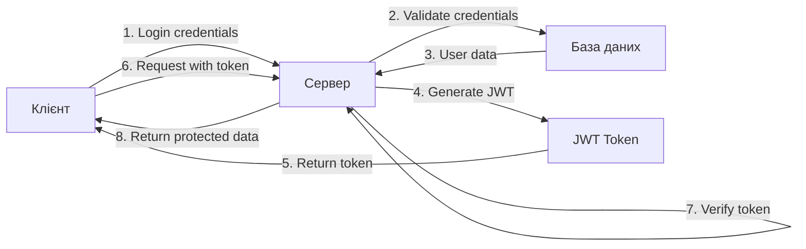
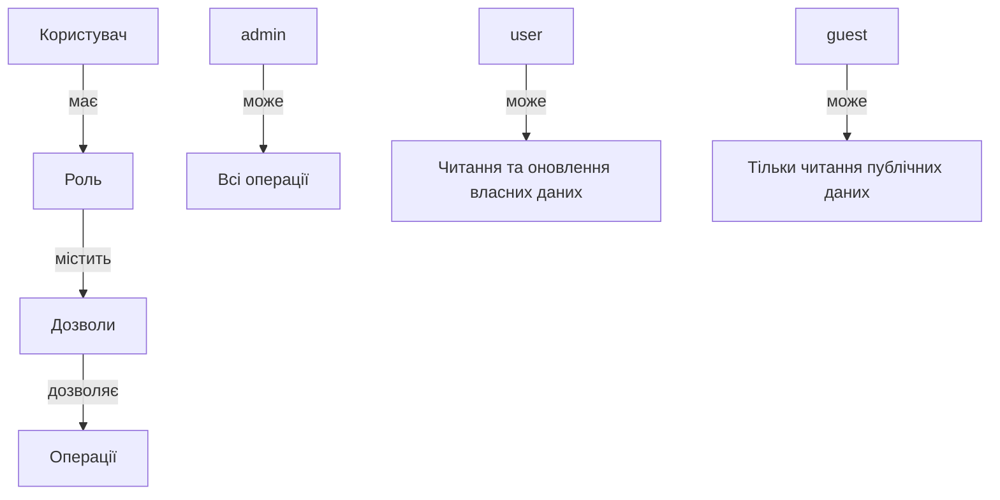

# Лабораторна робота 2. Аутентифікація, авторизація та розширений функціонал

## 🎯 Мета роботи

Здобути практичні навички реалізації системи аутентифікації та авторизації користувачів, впровадити механізми безпечного зберігання паролів та управління сесіями, розширити функціональність backend додатку файловим сервісом, пошуком, фільтрацією та пагінацією, а також створити документацію API.

## ✅ Завдання

### Рівень 1 (обов'язковий мінімум)

1. Реалізувати систему реєстрації користувачів з валідацією даних.
2. Впровадити безпечне зберігання паролів за допомогою bcrypt.
3. Створити систему аутентифікації на основі JWT токенів.
4. Реалізувати middleware для перевірки автентифікації користувачів.
5. Додати базову систему ролей користувачів (наприклад: користувач, адміністратор).
6. Впровадити middleware авторизації для захисту окремих маршрутів.
7. Реалізувати пагінацію для списків даних.
8. Створити базову документацію API за допомогою Swagger.

### Рівень 2 (додаткова функціональність)

1. Реалізувати файловий сервіс для завантаження та зберігання файлів.
2. Додати валідацію типів та розмірів файлів.
3. Впровадити систему пошуку по основних сутностях предметної області.
4. Реалізувати фільтрацію даних за різними критеріями.
5. Додати можливість оновлення та видалення завантажених файлів.
6. Створити endpoint для зміни паролю користувача.
7. Реалізувати refresh токени для оновлення JWT.
8. Написати базові тести для endpoints аутентифікації.

### Рівень 3 (творче розширення)

1. Впровадити систему відновлення паролю через email.
2. Реалізувати двофакторну аутентифікацію.
3. Додати можливість входу через соціальні мережі (OAuth).
4. Створити систему логування дій користувачів.
5. Реалізувати rate limiting для захисту від зловживань.
6. Впровадити складнішу систему дозволів з детальними правами доступу.
7. Додати можливість завантаження декількох файлів одночасно.
8. Створити розширену документацію API з прикладами використання та опис всіх можливих помилок.

## 📚 Теоретичні відомості

### Аутентифікація та авторизація

**Аутентифікація** (Authentication) — процес перевірки ідентичності користувача, підтвердження того, що користувач є тим, за кого себе видає. Це перший крок у забезпеченні безпеки додатку.

**Авторизація** (Authorization) — процес визначення прав доступу автентифікованого користувача до ресурсів системи. Авторизація завжди відбувається після аутентифікації.

Ключова різниця: аутентифікація відповідає на питання "Хто ви?", а авторизація на питання "Що вам дозволено робити?".

### JWT (JSON Web Token)

**JWT** — це відкритий стандарт для створення токенів доступу, які дозволяють передавати інформацію між сторонами у вигляді JSON об'єкта. JWT складається з трьох частин, розділених крапками:

1. **Header** (заголовок) — містить тип токену та алгоритм шифрування.
2. **Payload** (корисне навантаження) — містить claims (твердження) про користувача та додаткові дані.
3. **Signature** (підпис) — використовується для перевірки цілісності токену.



Переваги JWT:

- Компактність та ефективність передачі.
- Самодостатність токену, який містить всю необхідну інформацію.
- Можливість використання на різних платформах.
- Відсутність необхідності зберігати сесії на сервері.

### Bcrypt

**Bcrypt** — це криптографічна хеш-функція, спеціально розроблена для безпечного зберігання паролів. Основні характеристики bcrypt:

- Використання солі для захисту від rainbow table атак.
- Налаштування складності обчислень через cost factor.
- Стійкість до brute-force атак завдяки повільності алгоритму.
- Автоматичне управління сіллю при хешуванні.

Приклад роботи з bcrypt:

```javascript
const bcrypt = require('bcrypt');

// Хешування пароля
async function hashPassword(plainPassword) {
    const saltRounds = 10;
    const hashedPassword = await bcrypt.hash(plainPassword, saltRounds);
    return hashedPassword;
}

// Перевірка пароля
async function verifyPassword(plainPassword, hashedPassword) {
    const isMatch = await bcrypt.compare(plainPassword, hashedPassword);
    return isMatch;
}
```

### Система ролей та дозволів

**RBAC (Role-Based Access Control)** — модель контролю доступу, заснована на ролях користувачів. Основні компоненти:

- **Ролі** — набір дозволів, призначених групі користувачів.
- **Дозволи** — конкретні права на виконання операцій.
- **Користувачі** — суб'єкти, яким призначаються ролі.



### Файловий сервіс

**Multer** — middleware для Node.js, призначений для обробки multipart/form-data, який використовується для завантаження файлів. Основні можливості:

- Завантаження одного або декількох файлів.
- Налаштування місця збереження файлів.
- Фільтрація файлів за типом та розміром.
- Генерація унікальних імен файлів.

Приклад базової конфігурації Multer:

```javascript
const multer = require('multer');
const path = require('path');

const storage = multer.diskStorage({
    destination: function (req, file, cb) {
        cb(null, 'uploads/');
    },
    filename: function (req, file, cb) {
        const uniqueSuffix = Date.now() + '-' + Math.round(Math.random() * 1E9);
        cb(null, file.fieldname + '-' + uniqueSuffix + path.extname(file.originalname));
    }
});

const fileFilter = (req, file, cb) => {
    const allowedTypes = ['image/jpeg', 'image/png', 'image/gif'];
    if (allowedTypes.includes(file.mimetype)) {
        cb(null, true);
    } else {
        cb(new Error('Непідтримуваний тип файлу'), false);
    }
};

const upload = multer({
    storage: storage,
    fileFilter: fileFilter,
    limits: {
        fileSize: 5 * 1024 * 1024
    }
});
```

### Пошук, фільтрація та пагінація

**Пагінація** — розділення великого набору даних на окремі сторінки для покращення продуктивності та зручності використання. Основні параметри:

- `page` — номер поточної сторінки.
- `limit` — кількість елементів на сторінці.
- `offset` — зміщення від початку набору даних.

**Фільтрація** — обмеження результатів запиту за певними критеріями. Може включати:

- Пошук за текстовими полями.
- Фільтрацію за діапазоном значень.
- Фільтрацію за категоріями або статусами.
- Сортування результатів.

Приклад реалізації пагінації з Prisma:

```javascript
async function getProducts(page = 1, limit = 10, filters = {}) {
    const skip = (page - 1) * limit;

    const where = {};
    if (filters.category) {
        where.category = filters.category;
    }
    if (filters.minPrice) {
        where.price = { gte: parseFloat(filters.minPrice) };
    }
    if (filters.search) {
        where.name = { contains: filters.search, mode: 'insensitive' };
    }

    const [products, total] = await Promise.all([
        prisma.product.findMany({
            where,
            skip,
            take: limit,
            orderBy: { createdAt: 'desc' }
        }),
        prisma.product.count({ where })
    ]);

    return {
        data: products,
        pagination: {
            page,
            limit,
            total,
            totalPages: Math.ceil(total / limit)
        }
    };
}
```

### Swagger та документація API

**Swagger** — набір інструментів для проектування, побудови та документування RESTful API. Основні переваги:

- Автоматична генерація документації з коду.
- Інтерактивний інтерфейс для тестування endpoints.
- Підтримка специфікації OpenAPI.
- Можливість генерації клієнтського коду.

Для Node.js найпопулярнішою бібліотекою є swagger-jsdoc та swagger-ui-express. Приклад базового налаштування:

```javascript
const swaggerJsdoc = require('swagger-jsdoc');
const swaggerUi = require('swagger-ui-express');

const options = {
    definition: {
        openapi: '3.0.0',
        info: {
            title: 'API Documentation',
            version: '1.0.0',
            description: 'Документація API для вебдодатку'
        },
        servers: [
            {
                url: 'http://localhost:3000',
                description: 'Development server'
            }
        ]
    },
    apis: ['./src/routes/*.js']
};

const specs = swaggerJsdoc(options);
app.use('/api-docs', swaggerUi.serve, swaggerUi.setup(specs));
```

Приклад документування endpoint:

```javascript
/**
 * @swagger
 * /api/users/register:
 *   post:
 *     summary: Реєстрація нового користувача
 *     tags: [Authentication]
 *     requestBody:
 *       required: true
 *       content:
 *         application/json:
 *           schema:
 *             type: object
 *             required:
 *               - email
 *               - password
 *               - name
 *             properties:
 *               email:
 *                 type: string
 *                 format: email
 *               password:
 *                 type: string
 *                 minLength: 8
 *               name:
 *                 type: string
 *     responses:
 *       201:
 *         description: Користувач успішно зареєстрований
 *       400:
 *         description: Помилка валідації даних
 *       409:
 *         description: Користувач вже існує
 */
```

### Безпека вебдодатків

Основні принципи безпеки при розробці backend:

1. **Валідація вхідних даних** — завжди перевіряйте та очищайте дані від користувачів.
2. **Захист від SQL ін'єкцій** — використовуйте ORM або параметризовані запити.
3. **Захист від XSS атак** — екрануйте вихідні дані.
4. **HTTPS** — завжди використовуйте шифроване з'єднання в production.
5. **Rate limiting** — обмежуйте кількість запитів від одного клієнта.
6. **CORS** — правильно налаштовуйте політику cross-origin запитів.
7. **Helmet** — використовуйте middleware для встановлення безпечних HTTP заголовків.

Приклад налаштування базової безпеки:

```javascript
const helmet = require('helmet');
const rateLimit = require('express-rate-limit');
const cors = require('cors');

app.use(helmet());

const limiter = rateLimit({
    windowMs: 15 * 60 * 1000,
    max: 100,
    message: 'Забагато запитів з цієї IP адреси'
});

app.use('/api/', limiter);

app.use(cors({
    origin: process.env.FRONTEND_URL,
    credentials: true
}));
```

## 🔗 Додаткові ресурси

- [JWT офіційна документація](https://jwt.io/introduction)
- [Bcrypt документація](https://www.npmjs.com/package/bcrypt)
- [Multer документація](https://www.npmjs.com/package/multer)
- [Swagger документація](https://swagger.io/docs/)
- [OWASP Top 10](https://owasp.org/www-project-top-ten/)
- [Express security best practices](https://expressjs.com/en/advanced/best-practice-security.html)

## ▶️ Хід роботи

### Крок 1. Підготовка середовища

1. Переконайтеся, що проєкт з лабораторної роботи 1 працює коректно.
2. Встановіть необхідні додаткові залежності:
    ```bash
    npm install jsonwebtoken bcrypt multer swagger-jsdoc swagger-ui-express helmet express-rate-limit cors
    npm install --save-dev @types/jsonwebtoken @types/bcrypt @types/multer
    ```
3. Створіть додаткові змінні середовища у файлі `.env`:
    ```
    JWT_SECRET=your-secret-key-here
    JWT_EXPIRES_IN=7d
    REFRESH_TOKEN_SECRET=your-refresh-secret-here
    REFRESH_TOKEN_EXPIRES_IN=30d
    UPLOAD_DIR=uploads
    MAX_FILE_SIZE=5242880
    ```

### Крок 2. Оновлення моделей даних

1. Оновіть Prisma схему, додавши поля для аутентифікації та файлів:
    ```prisma
    model User {
      id        Int      @id @default(autoincrement())
      email     String   @unique
      password  String
      name      String
      role      Role     @default(USER)
      avatar    String?
      createdAt DateTime @default(now())
      updatedAt DateTime @updatedAt
    }

    enum Role {
      USER
      ADMIN
      MODERATOR
    }

    model File {
      id          Int      @id @default(autoincrement())
      filename    String
      originalName String
      mimetype    String
      size        Int
      path        String
      uploadedBy  Int
      createdAt   DateTime @default(now())
      user        User     @relation(fields: [uploadedBy], references: [id])
    }
    ```
2. Виконайте міграцію бази даних:
    ```bash
    npx prisma migrate dev --name add-auth-and-files
    ```

### Крок 3. Створення utility функцій
1. Створіть файл `src/utils/jwt.js` для роботи з JWT:
    ```javascript
    const jwt = require('jsonwebtoken');

    function generateAccessToken(userId, role) {
        return jwt.sign(
            { userId, role },
            process.env.JWT_SECRET,
            { expiresIn: process.env.JWT_EXPIRES_IN }
        );
    }

    function generateRefreshToken(userId) {
        return jwt.sign(
            { userId },
            process.env.REFRESH_TOKEN_SECRET,
            { expiresIn: process.env.REFRESH_TOKEN_EXPIRES_IN }
        );
    }

    function verifyAccessToken(token) {
        try {
            return jwt.verify(token, process.env.JWT_SECRET);
        } catch (error) {
            throw new Error('Недійсний токен доступу');
        }
    }

    function verifyRefreshToken(token) {
        try {
            return jwt.verify(token, process.env.REFRESH_TOKEN_SECRET);
        } catch (error) {
            throw new Error('Недійсний refresh токен');
        }
    }

    module.exports = {
        generateAccessToken,
        generateRefreshToken,
        verifyAccessToken,
        verifyRefreshToken
    };
    ```
2. Створіть файл `src/utils/password.js` для роботи з паролями:
    ```javascript
    const bcrypt = require('bcrypt');

    async function hashPassword(password) {
        const saltRounds = 10;
        return await bcrypt.hash(password, saltRounds);
    }

    async function comparePassword(password, hashedPassword) {
        return await bcrypt.compare(password, hashedPassword);
    }

    module.exports = {
        hashPassword,
        comparePassword
    };
    ```

### Крок 4. Створення middleware

1. Створіть файл `src/middleware/auth.js` для аутентифікації:
    ```javascript
    const { verifyAccessToken } = require('../utils/jwt');

    function authenticate(req, res, next) {
        try {
            const authHeader = req.headers.authorization;

            if (!authHeader || !authHeader.startsWith('Bearer ')) {
                return res.status(401).json({
                    error: 'Токен аутентифікації відсутній'
                });
            }

            const token = authHeader.substring(7);
            const decoded = verifyAccessToken(token);

            req.user = decoded;
            next();
        } catch (error) {
            return res.status(401).json({
                error: 'Недійсний або прострочений токен'
            });
        }
    }

    module.exports = { authenticate };
    ```
2. Створіть файл `src/middleware/authorize.js` для авторизації:
    ```javascript
    function authorize(...allowedRoles) {
        return (req, res, next) => {
            if (!req.user) {
                return res.status(401).json({
                    error: 'Необхідна аутентифікація'
                });
            }

            if (!allowedRoles.includes(req.user.role)) {
                return res.status(403).json({
                    error: 'Недостатньо прав для виконання цієї операції'
                });
            }

            next();
        };
    }

    module.exports = { authorize };
    ```
3. Створіть файл `src/middleware/upload.js` для завантаження файлів:
    ```javascript
    const multer = require('multer');
    const path = require('path');
    const fs = require('fs');

    const uploadDir = process.env.UPLOAD_DIR || 'uploads';

    if (!fs.existsSync(uploadDir)) {
        fs.mkdirSync(uploadDir, { recursive: true });
    }

    const storage = multer.diskStorage({
        destination: function (req, file, cb) {
            cb(null, uploadDir);
        },
        filename: function (req, file, cb) {
            const uniqueSuffix = Date.now() + '-' + Math.round(Math.random() * 1E9);
            cb(null, file.fieldname + '-' + uniqueSuffix + path.extname(file.originalname));
        }
    });

    const fileFilter = (req, file, cb) => {
        const allowedMimes = [
            'image/jpeg',
            'image/png',
            'image/gif',
            'application/pdf',
            'application/msword',
            'application/vnd.openxmlformats-officedocument.wordprocessingml.document'
        ];

        if (allowedMimes.includes(file.mimetype)) {
            cb(null, true);
        } else {
            cb(new Error('Непідтримуваний тип файлу'), false);
        }
    };

    const upload = multer({
        storage: storage,
        fileFilter: fileFilter,
        limits: {
            fileSize: parseInt(process.env.MAX_FILE_SIZE) || 5 * 1024 * 1024
        }
    });

    module.exports = { upload };
    ```

### Крок 5. Реалізація контролерів аутентифікації
1. Створіть файл `src/controllers/authController.js`:
    ```javascript
    const { PrismaClient } = require('@prisma/client');
    const { hashPassword, comparePassword } = require('../utils/password');
    const { generateAccessToken, generateRefreshToken, verifyRefreshToken } = require('../utils/jwt');

    const prisma = new PrismaClient();

    async function register(req, res) {
        try {
            const { email, password, name } = req.body;

            if (!email || !password || !name) {
                return res.status(400).json({
                    error: 'Email, пароль та ім\'я є обов\'язковими'
                });
            }

            if (password.length < 8) {
                return res.status(400).json({
                    error: 'Пароль має містити мінімум 8 символів'
                });
            }

            const existingUser = await prisma.user.findUnique({
                where: { email }
            });

            if (existingUser) {
                return res.status(409).json({
                    error: 'Користувач з таким email вже існує'
                });
            }

            const hashedPassword = await hashPassword(password);

            const user = await prisma.user.create({
                data: {
                    email,
                    password: hashedPassword,
                    name
                },
                select: {
                    id: true,
                    email: true,
                    name: true,
                    role: true,
                    createdAt: true
                }
            });

            const accessToken = generateAccessToken(user.id, user.role);
            const refreshToken = generateRefreshToken(user.id);

            res.status(201).json({
                message: 'Користувача успішно зареєстровано',
                user,
                tokens: {
                    accessToken,
                    refreshToken
                }
            });

        } catch (error) {
            console.error('Помилка реєстрації:', error);
            res.status(500).json({
                error: 'Помилка сервера при реєстрації'
            });
        }
    }

    async function login(req, res) {
        try {
            const { email, password } = req.body;

            if (!email || !password) {
                return res.status(400).json({
                    error: 'Email та пароль є обов\'язковими'
                });
            }

            const user = await prisma.user.findUnique({
                where: { email }
            });

            if (!user) {
                return res.status(401).json({
                    error: 'Невірний email або пароль'
                });
            }

            const isPasswordValid = await comparePassword(password, user.password);

            if (!isPasswordValid) {
                return res.status(401).json({
                    error: 'Невірний email або пароль'
                });
            }

            const accessToken = generateAccessToken(user.id, user.role);
            const refreshToken = generateRefreshToken(user.id);

            const { password: _, ...userWithoutPassword } = user;

            res.json({
                message: 'Успішний вхід',
                user: userWithoutPassword,
                tokens: {
                    accessToken,
                    refreshToken
                }
            });

        } catch (error) {
            console.error('Помилка входу:', error);
            res.status(500).json({
                error: 'Помилка сервера при вході'
            });
        }
    }

    async function refreshToken(req, res) {
        try {
            const { refreshToken } = req.body;

            if (!refreshToken) {
                return res.status(400).json({
                    error: 'Refresh токен відсутній'
                });
            }

            const decoded = verifyRefreshToken(refreshToken);

            const user = await prisma.user.findUnique({
                where: { id: decoded.userId }
            });

            if (!user) {
                return res.status(404).json({
                    error: 'Користувача не знайдено'
                });
            }

            const newAccessToken = generateAccessToken(user.id, user.role);
            const newRefreshToken = generateRefreshToken(user.id);

            res.json({
                tokens: {
                    accessToken: newAccessToken,
                    refreshToken: newRefreshToken
                }
            });

        } catch (error) {
            console.error('Помилка оновлення токену:', error);
            res.status(401).json({
                error: 'Недійсний refresh токен'
            });
        }
    }

    module.exports = {
        register,
        login,
        refreshToken
    };
    ```

### Крок 6. Додавання пошуку та фільтрації
1. Розширте контролери основних сутностей методами пошуку та фільтрації. Наприклад, для продуктів:
    ```javascript
    async function getProducts(req, res) {
        try {
            const {
                page = 1,
                limit = 10,
                search,
                category,
                minPrice,
                maxPrice,
                sortBy = 'createdAt',
                order = 'desc'
            } = req.query;

            const skip = (parseInt(page) - 1) * parseInt(limit);

            const where = {};

            if (search) {
                where.OR = [
                    { name: { contains: search, mode: 'insensitive' } },
                    { description: { contains: search, mode: 'insensitive' } }
                ];
            }

            if (category) {
                where.category = category;
            }

            if (minPrice || maxPrice) {
                where.price = {};
                if (minPrice) where.price.gte = parseFloat(minPrice);
                if (maxPrice) where.price.lte = parseFloat(maxPrice);
            }

            const orderBy = {};
            orderBy[sortBy] = order;

            const [products, total] = await Promise.all([
                prisma.product.findMany({
                    where,
                    skip,
                    take: parseInt(limit),
                    orderBy
                }),
                prisma.product.count({ where })
            ]);

            res.json({
                data: products,
                pagination: {
                    page: parseInt(page),
                    limit: parseInt(limit),
                    total,
                    totalPages: Math.ceil(total / parseInt(limit)),
                    hasMore: skip + products.length < total
                }
            });

        } catch (error) {
            console.error('Помилка отримання продуктів:', error);
            res.status(500).json({
                error: 'Помилка сервера'
            });
        }
    }
    ```

### Крок 7. Реалізація файлового сервісу

1. Створіть файл `src/controllers/fileController.js`:
    ```javascript
    const { PrismaClient } = require('@prisma/client');
    const fs = require('fs').promises;
    const path = require('path');

    const prisma = new PrismaClient();

    async function uploadFile(req, res) {
        try {
            if (!req.file) {
                return res.status(400).json({
                    error: 'Файл не надано'
                });
            }

            const file = await prisma.file.create({
                data: {
                    filename: req.file.filename,
                    originalName: req.file.originalname,
                    mimetype: req.file.mimetype,
                    size: req.file.size,
                    path: req.file.path,
                    uploadedBy: req.user.userId
                }
            });

            res.status(201).json({
                message: 'Файл успішно завантажено',
                file
            });

        } catch (error) {
            console.error('Помилка завантаження файлу:', error);

            if (req.file) {
                await fs.unlink(req.file.path).catch(console.error);
            }

            res.status(500).json({
                error: 'Помилка сервера при завантаженні файлу'
            });
        }
    }

    async function getFile(req, res) {
        try {
            const fileId = parseInt(req.params.id);

            const file = await prisma.file.findUnique({
                where: { id: fileId }
            });

            if (!file) {
                return res.status(404).json({
                    error: 'Файл не знайдено'
                });
            }

            res.sendFile(path.resolve(file.path));

        } catch (error) {
            console.error('Помилка отримання файлу:', error);
            res.status(500).json({
                error: 'Помилка сервера'
            });
        }
    }

    async function deleteFile(req, res) {
        try {
            const fileId = parseInt(req.params.id);

            const file = await prisma.file.findUnique({
                where: { id: fileId }
            });

            if (!file) {
                return res.status(404).json({
                    error: 'Файл не знайдено'
                });
            }

            if (file.uploadedBy !== req.user.userId && req.user.role !== 'ADMIN') {
                return res.status(403).json({
                    error: 'Ви не маєте прав для видалення цього файлу'
                });
            }

            await fs.unlink(file.path);

            await prisma.file.delete({
                where: { id: fileId }
            });

            res.json({
                message: 'Файл успішно видалено'
            });

        } catch (error) {
            console.error('Помилка видалення файлу:', error);
            res.status(500).json({
                error: 'Помилка сервера при видаленні файлу'
            });
        }
    }

    module.exports = {
        uploadFile,
        getFile,
        deleteFile
    };
    ```

### Крок 8. Налаштування маршрутів

1. Створіть файл `src/routes/authRoutes.js`:
    ```javascript
    const express = require('express');
    const { register, login, refreshToken } = require('../controllers/authController');

    const router = express.Router();

    /**
    * @swagger
    * /api/auth/register:
    *   post:
    *     summary: Реєстрація нового користувача
    *     tags: [Authentication]
    *     requestBody:
    *       required: true
    *       content:
    *         application/json:
    *           schema:
    *             type: object
    *             required:
    *               - email
    *               - password
    *               - name
    *             properties:
    *               email:
    *                 type: string
    *                 format: email
    *               password:
    *                 type: string
    *                 minLength: 8
    *               name:
    *                 type: string
    *     responses:
    *       201:
    *         description: Користувач успішно зареєстрований
    *       400:
    *         description: Помилка валідації даних
    *       409:
    *         description: Користувач вже існує
    */
    router.post('/register', register);

    /**
    * @swagger
    * /api/auth/login:
    *   post:
    *     summary: Вхід користувача
    *     tags: [Authentication]
    *     requestBody:
    *       required: true
    *       content:
    *         application/json:
    *           schema:
    *             type: object
    *             required:
    *               - email
    *               - password
    *             properties:
    *               email:
    *                 type: string
    *                 format: email
    *               password:
    *                 type: string
    *     responses:
    *       200:
    *         description: Успішний вхід
    *       401:
    *         description: Невірні дані для входу
    */
    router.post('/login', login);

    /**
    * @swagger
    * /api/auth/refresh:
    *   post:
    *     summary: Оновлення access токену
    *     tags: [Authentication]
    *     requestBody:
    *       required: true
    *       content:
    *         application/json:
    *           schema:
    *             type: object
    *             required:
    *               - refreshToken
    *             properties:
    *               refreshToken:
    *                 type: string
    *     responses:
    *       200:
    *         description: Токен успішно оновлено
    *       401:
    *         description: Недійсний refresh токен
    */
    router.post('/refresh', refreshToken);

    module.exports = router;
    ```
2. Створіть файл `src/routes/fileRoutes.js`:
    ```javascript
    const express = require('express');
    const { uploadFile, getFile, deleteFile } = require('../controllers/fileController');
    const { authenticate } = require('../middleware/auth');
    const { upload } = require('../middleware/upload');

    const router = express.Router();

    /**
    * @swagger
    * /api/files/upload:
    *   post:
    *     summary: Завантаження файлу
    *     tags: [Files]
    *     security:
    *       - bearerAuth: []
    *     requestBody:
    *       required: true
    *       content:
    *         multipart/form-data:
    *           schema:
    *             type: object
    *             properties:
    *               file:
    *                 type: string
    *                 format: binary
    *     responses:
    *       201:
    *         description: Файл успішно завантажено
    *       400:
    *         description: Файл не надано або невалідний
    *       401:
    *         description: Необхідна аутентифікація
    */
    router.post('/upload', authenticate, upload.single('file'), uploadFile);

    /**
    * @swagger
    * /api/files/{id}:
    *   get:
    *     summary: Отримання файлу за ID
    *     tags: [Files]
    *     parameters:
    *       - in: path
    *         name: id
    *         required: true
    *         schema:
    *           type: integer
    *     responses:
    *       200:
    *         description: Файл успішно отримано
    *       404:
    *         description: Файл не знайдено
    */
    router.get('/:id', getFile);

    /**
    * @swagger
    * /api/files/{id}:
    *   delete:
    *     summary: Видалення файлу
    *     tags: [Files]
    *     security:
    *       - bearerAuth: []
    *     parameters:
    *       - in: path
    *         name: id
    *         required: true
    *         schema:
    *           type: integer
    *     responses:
    *       200:
    *         description: Файл успішно видалено
    *       403:
    *         description: Недостатньо прав
    *       404:
    *         description: Файл не знайдено
    */
    router.delete('/:id', authenticate, deleteFile);

    module.exports = router;
    ```
3. Оновіть існуючі маршрути, додавши захист через middleware. Наприклад, для продуктів:
    ```javascript
    const express = require('express');
    const {
        getProducts,
        getProductById,
        createProduct,
        updateProduct,
        deleteProduct
    } = require('../controllers/productController');
    const { authenticate } = require('../middleware/auth');
    const { authorize } = require('../middleware/authorize');

    const router = express.Router();

    router.get('/', getProducts);
    router.get('/:id', getProductById);
    router.post('/', authenticate, authorize('ADMIN', 'MODERATOR'), createProduct);
    router.put('/:id', authenticate, authorize('ADMIN', 'MODERATOR'), updateProduct);
    router.delete('/:id', authenticate, authorize('ADMIN'), deleteProduct);

    module.exports = router;
    ```

### Крок 9. Налаштування Swagger

1. Створіть файл `src/config/swagger.js`:
    ```javascript
    const swaggerJsdoc = require('swagger-jsdoc');

    const options = {
        definition: {
            openapi: '3.0.0',
            info: {
                title: 'API Documentation',
                version: '1.0.0',
                description: 'Документація API для вебдодатку',
                contact: {
                    name: 'API Support',
                    email: 'support@example.com'
                }
            },
            servers: [
                {
                    url: 'http://localhost:3000',
                    description: 'Development server'
                }
            ],
            components: {
                securitySchemes: {
                    bearerAuth: {
                        type: 'http',
                        scheme: 'bearer',
                        bearerFormat: 'JWT',
                        description: 'Введіть JWT токен'
                    }
                },
                schemas: {
                    Error: {
                        type: 'object',
                        properties: {
                            error: {
                                type: 'string',
                                description: 'Повідомлення про помилку'
                            }
                        }
                    },
                    User: {
                        type: 'object',
                        properties: {
                            id: {
                                type: 'integer'
                            },
                            email: {
                                type: 'string',
                                format: 'email'
                            },
                            name: {
                                type: 'string'
                            },
                            role: {
                                type: 'string',
                                enum: ['USER', 'ADMIN', 'MODERATOR']
                            },
                            createdAt: {
                                type: 'string',
                                format: 'date-time'
                            }
                        }
                    },
                    Pagination: {
                        type: 'object',
                        properties: {
                            page: {
                                type: 'integer'
                            },
                            limit: {
                                type: 'integer'
                            },
                            total: {
                                type: 'integer'
                            },
                            totalPages: {
                                type: 'integer'
                            },
                            hasMore: {
                                type: 'boolean'
                            }
                        }
                    }
                }
            },
            tags: [
                {
                    name: 'Authentication',
                    description: 'Операції аутентифікації'
                },
                {
                    name: 'Files',
                    description: 'Управління файлами'
                }
            ]
        },
        apis: ['./src/routes/*.js']
    };

    const specs = swaggerJsdoc(options);

    module.exports = specs;
    ```

    2. Оновіть файл `src/app.js`, додавши Swagger та додаткові middleware:

    ```javascript
    const express = require('express');
    const helmet = require('helmet');
    const cors = require('cors');
    const rateLimit = require('express-rate-limit');
    const swaggerUi = require('swagger-ui-express');
    const swaggerSpecs = require('./config/swagger');

    const authRoutes = require('./routes/authRoutes');
    const fileRoutes = require('./routes/fileRoutes');

    const app = express();

    app.use(helmet());

    app.use(cors({
        origin: process.env.FRONTEND_URL || 'http://localhost:5173',
        credentials: true
    }));

    const limiter = rateLimit({
        windowMs: 15 * 60 * 1000,
        max: 100,
        message: 'Забагато запитів з цієї IP адреси, спробуйте пізніше'
    });

    app.use('/api/', limiter);

    app.use(express.json());
    app.use(express.urlencoded({ extended: true }));

    app.use('/api-docs', swaggerUi.serve, swaggerUi.setup(swaggerSpecs, {
        explorer: true,
        customCss: '.swagger-ui .topbar { display: none }'
    }));

    app.use('/api/auth', authRoutes);
    app.use('/api/files', fileRoutes);

    app.use((err, req, res, next) => {
        console.error(err.stack);

        if (err.name === 'MulterError') {
            if (err.code === 'LIMIT_FILE_SIZE') {
                return res.status(400).json({
                    error: 'Файл занадто великий'
                });
            }
            return res.status(400).json({
                error: 'Помилка завантаження файлу'
            });
        }

        res.status(err.status || 500).json({
            error: err.message || 'Внутрішня помилка сервера'
        });
    });

    const PORT = process.env.PORT || 3000;
    app.listen(PORT, () => {
        console.log(`Сервер запущено на порту ${PORT}`);
        console.log(`Документація API: http://localhost:${PORT}/api-docs`);
    });

    module.exports = app;
    ```

### Крок 10. Тестування API

1. Створіть файл `tests/auth.test.js` для базового тестування:
    ```javascript
    const request = require('supertest');
    const app = require('../src/app');
    const { PrismaClient } = require('@prisma/client');

    const prisma = new PrismaClient();

    describe('Authentication API', () => {
        let testUser;

        beforeAll(async () => {
            await prisma.user.deleteMany({
                where: { email: 'test@example.com' }
            });
        });

        afterAll(async () => {
            await prisma.$disconnect();
        });

        describe('POST /api/auth/register', () => {
            it('повинен зареєструвати нового користувача', async () => {
                const response = await request(app)
                    .post('/api/auth/register')
                    .send({
                        email: 'test@example.com',
                        password: 'testpassword123',
                        name: 'Test User'
                    });

                expect(response.status).toBe(201);
                expect(response.body).toHaveProperty('user');
                expect(response.body).toHaveProperty('tokens');
                expect(response.body.user.email).toBe('test@example.com');

                testUser = response.body.user;
            });

            it('не повинен зареєструвати користувача з існуючим email', async () => {
                const response = await request(app)
                    .post('/api/auth/register')
                    .send({
                        email: 'test@example.com',
                        password: 'testpassword123',
                        name: 'Test User 2'
                    });

                expect(response.status).toBe(409);
            });

            it('не повинен зареєструвати користувача з коротким паролем', async () => {
                const response = await request(app)
                    .post('/api/auth/register')
                    .send({
                        email: 'test2@example.com',
                        password: 'short',
                        name: 'Test User 2'
                    });

                expect(response.status).toBe(400);
            });
        });

        describe('POST /api/auth/login', () => {
            it('повинен увійти з правильними credentials', async () => {
                const response = await request(app)
                    .post('/api/auth/login')
                    .send({
                        email: 'test@example.com',
                        password: 'testpassword123'
                    });

                expect(response.status).toBe(200);
                expect(response.body).toHaveProperty('tokens');
                expect(response.body.tokens).toHaveProperty('accessToken');
                expect(response.body.tokens).toHaveProperty('refreshToken');
            });

            it('не повинен увійти з невірним паролем', async () => {
                const response = await request(app)
                    .post('/api/auth/login')
                    .send({
                        email: 'test@example.com',
                        password: 'wrongpassword'
                    });

                expect(response.status).toBe(401);
            });
        });
    });
    ```
2. Встановіть необхідні залежності для тестування:
    ```bash
    npm install --save-dev jest supertest
    ```
3. Додайте скрипт тестування в `package.json`:
    ```json
    {
        "scripts": {
            "test": "jest --detectOpenHandles --forceExit"
        }
    }
    ```

### Крок 11. Створення звіту

1. Скопіюйте шаблон звіту до папки `reports/` та перейменуйте на `lab2-report.md`.
2. Заповніть всі розділи звіту:
    - Опишіть реалізовану систему аутентифікації та авторизації.
    - Додайте скріншоти Swagger документації.
    - Додайте приклади запитів та відповідей API.
    - Вставте скріншоти результатів тестування в Postman або через curl.
    - Опишіть реалізований файловий сервіс та систему пошуку.
    - Відповідайте на контрольні запитання.
3. Зробіть скріншоти:
    - Swagger документації з усіма endpoints.
    - Успішної реєстрації користувача.
    - Успішного входу та отримання токенів.
    - Захищеного endpoint з використанням токену.
    - Помилки доступу без токену або з недійсним токеном.
    - Завантаження файлу.
    - Пошуку та фільтрації даних з пагінацією.

### Крок 12. Фіналізація та здача роботи

1. Переконайтеся, що всі endpoints працюють коректно.
2. Перевірте, що документація Swagger доступна за адресою `http://localhost:3000/api-docs`.
3. Запустіть тести та переконайтеся, що вони проходять успішно:
    ```bash
    npm test
    ```
4. Створіть коміт з усіма змінами:
    ```bash
    git add .
    git commit -m "feat: додано аутентифікацію, авторизацію, файловий сервіс та документацію API"
    git push origin main
    ```
5. Здайте роботу на Moodle, вставивши посилання на GitHub репозиторій.

## 📝 Критерії оцінювання

### Середній рівень (оцінка "задовільно")

- Реалізовано базову реєстрацію та вхід користувачів.
- Створено JWT токени для аутентифікації.
- Додано middleware для перевірки автентифікації.
- Реалізовано базову пагінацію.
- Створено мінімальну документацію Swagger.
- Код працює, але має значні недоліки в безпеці або структурі.
- Відсутня або неповна валідація даних.
- Базове розуміння принципів аутентифікації та авторизації.

### Достатній рівень (оцінка "добре")

- Виконано всі завдання рівня 1.
- Реалізовано систему ролей користувачів.
- Додано файловий сервіс з валідацією.
- Впроваджено пошук та фільтрацію даних.
- Створено refresh токени.
- Код добре структурований з належною обробкою помилок.
- Документація API містить більшість endpoints з прикладами.
- Написано базові тести для ключових функцій.
- Показано розуміння принципів безпеки вебдодатків.

### Високий рівень (оцінка "відмінно")

- Виконано всі завдання рівнів 1 та 2.
- Реалізовано додаткові функції з рівня 3 (наприклад, відновлення паролю, двофакторна аутентифікація).
- Впроваджено комплексну систему безпеки з helmet, rate limiting, CORS.
- Створено детальну та професійну документацію API з прикладами для всіх endpoints.
- Написано повний набір тестів з високим покриттям коду.
- Код написаний якісно з дотриманням принципів SOLID та чистого коду.
- Реалізовано систему логування дій користувачів.
- Продемонстровано глибоке розуміння аутентифікації, авторизації та безпеки під час захисту.
- Додано власні інноваційні рішення або покращення.

## ⏰ Політика щодо дедлайнів

При порушенні встановленого терміну здачі лабораторної роботи максимальна можлива оцінка становить "добре", незалежно від якості виконаної роботи. Винятки можливі лише за поважних причин, підтверджених документально.

## ❓ Контрольні запитання

1. Поясніть різницю між аутентифікацією та авторизацією. Наведіть приклади з вашого проєкту.
2. Що таке JWT токен і з яких частин він складається? Чому JWT є популярним для аутентифікації в API?
3. Як працює bcrypt і чому він є безпечним для зберігання паролів? Що таке salt і навіщо він потрібен?
4. Поясніть принцип роботи middleware в Express.js. Як ви використали middleware для аутентифікації та авторизації?
5. Що таке RBAC (Role-Based Access Control) і як ви реалізували систему ролей у своєму проєкті?
6. Як працює Multer для завантаження файлів? Які обмеження та валідації ви застосували?
7. Поясніть, як реалізовано пагінацію в вашому проєкті. Які параметри використовуються?
8. Що таке Swagger і для чого він використовується? Які переваги автоматичної документації API?
9. Які основні загрози безпеки існують для вебдодатків? Як ви їх мінімізували в своєму проєкті?
10. Поясніть різницю між access токеном та refresh токеном. Навіщо потрібні два типи токенів?
