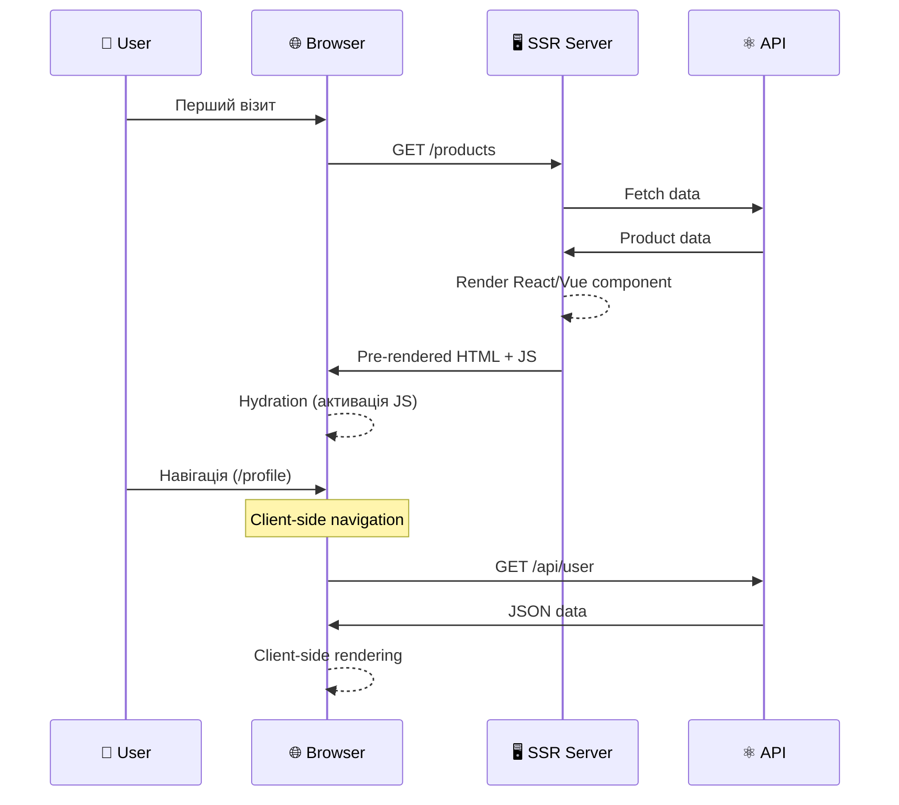
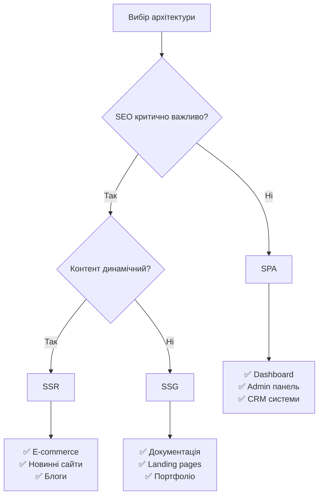
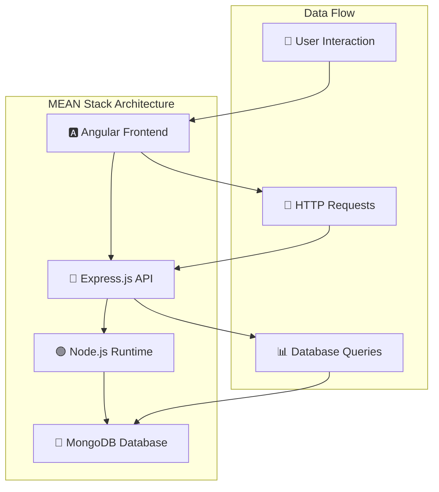
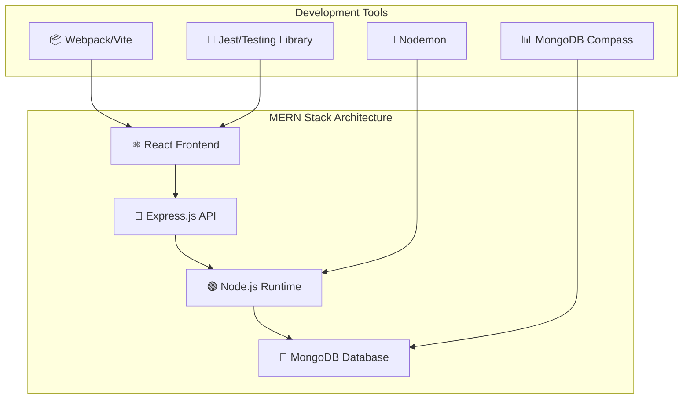
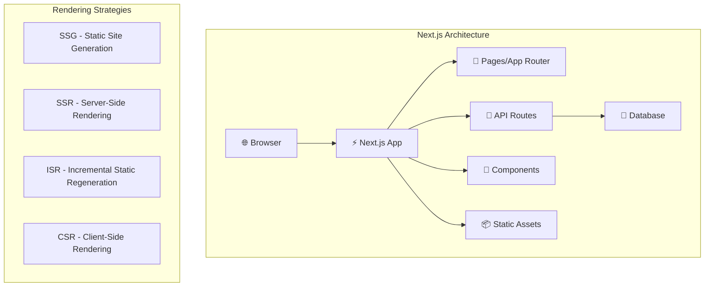

### Server-Side Rendering (SSR)

**SSR** — це підхід, при якому HTML генерується на сервері для кожного запиту, що поєднує переваги SPA та MPA.

#### Архітектура SSR:



#### Приклад SSR з Next.js:

```javascript
// pages/products/[id].js - Next.js SSR
import { GetServerSideProps } from 'next';

export default function ProductPage({ product }) {
  return (
    <div>
      <h1>{product.name}</h1>
      <p>{product.description}</p>
      <p>Ціна: {product.price} грн</p>
    </div>
  );
}

// Ця функція виконується на сервері для кожного запиту
export const getServerSideProps = async (context) => {
  const { id } = context.params;

  try {
    const res = await fetch(`http://api.example.com/products/${id}`);
    const product = await res.json();

    return {
      props: {
        product
      }
    };
  } catch (error) {
    return {
      notFound: true
    };
  }
};
```

#### Static Site Generation (SSG)

**SSG** — це підвид SSR, де сторінки генеруються під час збірки проекту:

```javascript
// Next.js SSG приклад
export const getStaticProps = async () => {
  const res = await fetch('http://api.example.com/products');
  const products = await res.json();

  return {
    props: {
      products
    },
    revalidate: 3600 // Регенерація кожну годину
  };
};

export const getStaticPaths = async () => {
  const res = await fetch('http://api.example.com/products');
  const products = await res.json();

  const paths = products.map((product) => ({
    params: { id: product.id.toString() }
  }));

  return {
    paths,
    fallback: 'blocking' // Генерувати нові сторінки на вимогу
  };
};
```

### Порівняльна таблиця підходів

| Критерій | SPA | MPA | SSR | SSG |
|----------|-----|-----|-----|-----|
| **Початкове завантаження** | Повільне | Швидке | Швидке | Найшвидше |
| **Навігація** | Миттєва | Повільна | Миттєва | Миттєва |
| **SEO** | Погане | Відмінне | Відмінне | Відмінне |
| **Інтерактивність** | Висока | Низька | Висока | Висока |
| **Складність розробки** | Середня | Низька | Висока | Висока |
| **Навантаження на сервер** | Низьке | Високе | Високе | Низьке |
| **Кешування** | Складне | Просте | Середнє | Відмінне |

### Вибір підходу для різних проектів



## Огляд технологічних стеків

### MEAN Stack

**MEAN** — це повний JavaScript стек для веб-розробки:

- **M**ongoDB - NoSQL база даних
- **E**xpress.js - веб-фреймворк для Node.js
- **A**ngular - frontend фреймворк
- **N**ode.js - серверне середовище JavaScript



#### Приклад MEAN додатку:

**Backend (Express.js + Node.js):**
```javascript
// server.js
const express = require('express');
const mongoose = require('mongoose');
const cors = require('cors');

const app = express();

// Підключення до MongoDB
mongoose.connect('mongodb://localhost:27017/meanapp');

// Middleware
app.use(cors());
app.use(express.json());

// Модель користувача
const userSchema = new mongoose.Schema({
  name: String,
  email: String,
  createdAt: { type: Date, default: Date.now }
});

const User = mongoose.model('User', userSchema);

// API маршрути
app.get('/api/users', async (req, res) => {
  try {
    const users = await User.find();
    res.json(users);
  } catch (error) {
    res.status(500).json({ error: error.message });
  }
});

app.post('/api/users', async (req, res) => {
  try {
    const user = new User(req.body);
    await user.save();
    res.status(201).json(user);
  } catch (error) {
    res.status(400).json({ error: error.message });
  }
});

app.listen(3000, () => {
  console.log('Сервер запущено на порті 3000');
});
```

**Frontend (Angular):**
```typescript
// user.service.ts
import { Injectable } from '@angular/core';
import { HttpClient } from '@angular/common/http';
import { Observable } from 'rxjs';

export interface User {
  _id?: string;
  name: string;
  email: string;
  createdAt?: Date;
}

@Injectable({
  providedIn: 'root'
})
export class UserService {
  private apiUrl = 'http://localhost:3000/api';

  constructor(private http: HttpClient) {}

  getUsers(): Observable<User[]> {
    return this.http.get<User[]>(`${this.apiUrl}/users`);
  }

  createUser(user: User): Observable<User> {
    return this.http.post<User>(`${this.apiUrl}/users`, user);
  }
}

// user-list.component.ts
import { Component, OnInit } from '@angular/core';
import { UserService, User } from './user.service';

@Component({
  selector: 'app-user-list',
  template: `
    <div>
      <h2>Користувачі</h2>
      <ul>
        <li *ngFor="let user of users">
          {{ user.name }} - {{ user.email }}
        </li>
      </ul>
    </div>
  `
})
export class UserListComponent implements OnInit {
  users: User[] = [];

  constructor(private userService: UserService) {}

  ngOnInit() {
    this.userService.getUsers().subscribe(
      users => this.users = users,
      error => console.error('Помилка завантаження користувачів:', error)
    );
  }
}
```

### MERN Stack

**MERN** замінює Angular на React:

- **M**ongoDB - NoSQL база даних
- **E**xpress.js - веб-фреймворк для Node.js
- **R**eact - frontend бібліотека
- **N**ode.js - серверне середовище JavaScript



#### Приклад MERN компоненту:

```jsx
// UserList.jsx
import React, { useState, useEffect } from 'react';
import axios from 'axios';

const UserList = () => {
  const [users, setUsers] = useState([]);
  const [loading, setLoading] = useState(true);
  const [error, setError] = useState(null);

  useEffect(() => {
    const fetchUsers = async () => {
      try {
        const response = await axios.get('/api/users');
        setUsers(response.data);
      } catch (err) {
        setError('Не вдалося завантажити користувачів');
      } finally {
        setLoading(false);
      }
    };

    fetchUsers();
  }, []);

  if (loading) return <div>Завантаження...</div>;
  if (error) return <div>Помилка: {error}</div>;

  return (
    <div className="user-list">
      <h2>Список користувачів</h2>
      {users.map(user => (
        <div key={user._id} className="user-card">
          <h3>{user.name}</h3>
          <p>{user.email}</p>
          <small>{new Date(user.createdAt).toLocaleDateString()}</small>
        </div>
      ))}
    </div>
  );
};

export default UserList;
```

### Next.js Full-Stack

**Next.js** — це React фреймворк з вбудованими можливостями full-stack розробки:



#### Приклад Next.js додатку:

**Файлова структура:**
```
nextjs-app/
├── pages/                         # Сторінки (до Next.js 13)
│   ├── api/                       # API маршрути
│   │   └── users.js
│   ├── index.js                   # Домашня сторінка
│   └── users/
│       └── [id].js               # Динамічний маршрут
├── app/                          # App Router (Next.js 13+)
│   ├── layout.js                 # Корневий layout
│   ├── page.js                   # Домашня сторінка
│   ├── users/
│   │   ├── page.js              # /users сторінка
│   │   └── [id]/
│   │       └── page.js          # /users/[id] сторінка
│   └── api/
│       └── users/
│           └── route.js         # API endpoint
├── components/
│   ├── UserCard.jsx
│   └── Navigation.jsx
├── lib/
│   └── database.js              # Утиліти для БД
└── public/
    └── images/
```

**API маршрут:**
```javascript
// app/api/users/route.js (Next.js 13+)
import { NextResponse } from 'next/server';
import { connectToDatabase } from '@/lib/database';

export async function GET() {
  try {
    const db = await connectToDatabase();
    const users = await db.collection('users').find({}).toArray();

    return NextResponse.json(users);
  } catch (error) {
    return NextResponse.json(
      { error: 'Не вдалося завантажити користувачів' },
      { status: 500 }
    );
  }
}

export async function POST(request) {
  try {
    const userData = await request.json();
    const db = await connectToDatabase();

    const result = await db.collection('users').insertOne({
      ...userData,
      createdAt: new Date()
    });

    return NextResponse.json(
      { id: result.insertedId, ...userData },
      { status: 201 }
    );
  } catch (error) {
    return NextResponse.json(
      { error: 'Не вдалося створити користувача' },
      { status: 400 }
    );
  }
}
```

**SSR сторінка:**
```jsx
// app/users/[id]/page.js
async function getUser(id) {
  const res = await fetch(`${process.env.API_URL}/api/users/${id}`, {
    next: { revalidate: 3600 } // Кешування на годину
  });

  if (!res.ok) {
    throw new Error('Не вдалося завантажити користувача');
  }

  return res.json();
}

export default async function UserPage({ params }) {
  const user = await getUser(params.id);

  return (
    <div className="user-profile">
      <h1>{user.name}</h1>
      <p>{user.email}</p>
      <p>Реєстрація: {new Date(user.createdAt).toLocaleDateString()}</p>
    </div>
  );
}

// Генерація статичних параметрів
export async function generateStaticParams() {
  const res = await fetch(`${process.env.API_URL}/api/users`);
  const users = await res.json();

  return users.map((user) => ({
    id: user.id.toString()
  }));
}
```

### Порівняння технологічних стеків

| Критерій | MEAN | MERN | Next.js |
|----------|------|------|---------|
| **Frontend** | Angular | React | React |
| **Крива навчання** | Висока | Середня | Середня-Висока |
| **TypeScript** | Нативно | Додатково | Нативно |
| **SEO** | Потребує Angular Universal | Потребує SSR | Вбудовано |
| **Розмір додатку** | Великий | Середній | Оптимізований |
| **Екосистема** | Менша | Велика | Зростаюча |
| **Продуктивність** | Середня | Висока | Висока |
| **Гнучкість** | Середня | Висока | Середня |

## Інструменти розробника та середовища розробки

### Інтегровані середовища розробки (IDE)

#### Visual Studio Code
**VS Code** — найпопулярніший редактор для веб-розробки:

**Корисні розширення для веб-розробки:**
```json
{
  "recommendations": [
    "ms-vscode.vscode-typescript-next",
    "bradlc.vscode-tailwindcss",
    "ms-vscode.vscode-json",
    "esbenp.prettier-vscode",
    "ms-vscode.vscode-eslint",
    "formulahendry.auto-rename-tag",
    "christian-kohler.path-intellisense",
    "ms-vscode.vscode-html-css-support",
    "ms-vscode.live-server",
    "ritwickdey.liveserver"
  ]
}
```

**Налаштування для команди:**
```json
// .vscode/settings.json
{
  "editor.formatOnSave": true,
  "editor.codeActionsOnSave": {
    "source.fixAll.eslint": true,
    "source.organizeImports": true
  },
  "typescript.preferences.importModuleSpecifier": "relative",
  "emmet.includeLanguages": {
    "javascript": "javascriptreact",
    "typescript": "typescriptreact"
  }
}
```

#### WebStorm
**WebStorm** — потужна IDE від JetBrains:

**Переваги:**
- ✅ Інтелігентне автодоповнення
- ✅ Потужні інструменти рефакторингу
- ✅ Вбудований debugger
- ✅ Підтримка всіх сучасних фреймворків

### Інструменти збірки та розробки

#### Vite
**Vite** — швидкий інструмент збірки для сучасної веб-розробки:

```javascript
// vite.config.js
import { defineConfig } from 'vite';
import react from '@vitejs/plugin-react';
import path from 'path';

export default defineConfig({
  plugins: [react()],
  resolve: {
    alias: {
      '@': path.resolve(__dirname, './src'),
    },
  },
  server: {
    port: 3000,
    proxy: {
      '/api': {
        target: 'http://localhost:8000',
        changeOrigin: true,
      },
    },
  },
  build: {
    outDir: 'dist',
    sourcemap: true,
  },
});
```

#### Webpack
**Webpack** — модульний bundler:

```javascript
// webpack.config.js
const path = require('path');
const HtmlWebpackPlugin = require('html-webpack-plugin');

module.exports = {
  entry: './src/index.js',
  output: {
    path: path.resolve(__dirname, 'dist'),
    filename: '[name].[contenthash].js',
    clean: true,
  },
  module: {
    rules: [
      {
        test: /\.(js|jsx)$/,
        exclude: /node_modules/,
        use: {
          loader: 'babel-loader',
          options: {
            presets: ['@babel/preset-react'],
          },
        },
      },
      {
        test: /\.css$/,
        use: ['style-loader', 'css-loader', 'postcss-loader'],
      },
    ],
  },
  plugins: [
    new HtmlWebpackPlugin({
      template: './public/index.html',
    }),
  ],
  devServer: {
    port: 3000,
    hot: true,
  },
};
```

### Системи контролю версій

#### Git - основні команди для веб-розробки

```bash
# Початкові налаштування
git config --global user.name "Ваше Ім'я"
git config --global user.email "email@example.com"

# Створення репозиторію
git init
git remote add origin https://github.com/username/project.git

# Щоденний workflow
git status                    # Перевірка стану файлів
git add .                     # Додавання всіх змін
git commit -m "feat: додати компонент користувача"
git push origin main          # Відправка змін

# Робота з гілками
git checkout -b feature/user-auth    # Створити нову гілку
git checkout main                    # Перемикнутися на main
git merge feature/user-auth         # Злити гілку
git branch -d feature/user-auth     # Видалити гілку

# Відміна змін
git checkout -- filename.js         # Відмінити зміни у файлі
git reset HEAD~1                     # Відмінити останній коміт
git revert commit-hash              # Безпечна відміна коміту
```

#### Conventional Commits
Стандартизований формат комітів для команд:

```
<type>[optional scope]: <description>

feat: додати компонент авторизації
fix: виправити помилку валідації email
docs: оновити README
style: виправити форматування коду
refactor: переписати API клієнт
test: додати тести для UserService
chore: оновити залежності
```

### Інструменти для якості коду

#### ESLint + Prettier

**ESLint конфігурація:**
```json
// .eslintrc.json
{
  "extends": [
    "eslint:recommended",
    "@typescript-eslint/recommended",
    "plugin:react/recommended",
    "plugin:react-hooks/recommended"
  ],
  "parser": "@typescript-eslint/parser",
  "plugins": ["@typescript-eslint", "react", "react-hooks"],
  "rules": {
    "react/react-in-jsx-scope": "off",
    "@typescript-eslint/no-unused-vars": "error",
    "prefer-const": "error"
  },
  "settings": {
    "react": {
      "version": "detect"
    }
  }
}
```

**Prettier конфігурація:**
```json
// .prettierrc
{
  "semi": true,
  "singleQuote": true,
  "tabWidth": 2,
  "trailingComma": "es5",
  "printWidth": 80,
  "bracketSpacing": true,
  "arrowParens": "avoid"
}
```

### DevTools браузера

#### Chrome DevTools для веб-розробки

**Performance вкладка:**
```javascript
// Вимірювання продуктивності компоненту
console.time('ComponentRender');
// ... код компоненту
console.timeEnd('ComponentRender');

// Профілювання функції
performance.mark('functionStart');
someExpensiveFunction();
performance.mark('functionEnd');
performance.measure('functionDuration', 'functionStart', 'functionEnd');
```

**Network вкладка - аналіз запитів:**
- Час завантаження ресурсів
- Розмір файлів
- Кешування
- CORS помилки

### Package Managers

#### npm vs Yarn vs pnpm

```bash
# npm
npm init -y
npm install react react-dom
npm install -D @types/react
npm run build

# Yarn
yarn init -y
yarn add react react-dom
yarn add -D @types/react
yarn build

# pnpm (найшвидший та економний)
pnpm init
pnpm add react react-dom
pnpm add -D @types/react
pnpm run build
```

**Порівняння продуктивності:**
```
Установка 1000+ пакетів:
├── npm: 45-60 секунд
├── Yarn: 30-45 секунд
└── pnpm: 15-25 секунд

Дисковий простір:
├── npm: дублювання залежностей
├── Yarn: часткове дублювання
└── pnpm: symlinks, без дублювання
```

### Налагодження (Debugging)

#### React Developer Tools

```jsx
// Компонент з підтримкою debugging
import { useDebugValue } from 'react';

function useUserData(userId) {
  const [user, setUser] = useState(null);

  // Відображається в React DevTools
  useDebugValue(user ? `User: ${user.name}` : 'Loading...');

  useEffect(() => {
    fetchUser(userId).then(setUser);
  }, [userId]);

  return user;
}
```

#### Console методи для debugging

```javascript
// Різні методи логування
console.log('Звичайне повідомлення');
console.info('Інформаційне повідомлення');
console.warn('Попередження');
console.error('Помилка');

// Групування логів
console.group('API Request');
console.log('URL:', url);
console.log('Method:', method);
console.log('Headers:', headers);
console.groupEnd();

// Таблиця даних
console.table([
  { name: 'Іван', age: 25, city: 'Київ' },
  { name: 'Марія', age: 30, city: 'Львів' }
]);

// Трасування стеку
console.trace('Trace point');
```

## Висновки

Сучасна веб-розробка — це складна екосистема технологій, інструментів та підходів:

### Ключові аспекти:

1. **Архітектура**: Розуміння client-server взаємодії та різних архітектурних підходів є основою якісної розробки
2. **API Design**: Вибір між REST, GraphQL та gRPC залежить від специфіки проекту та вимог до продуктивності
3. **Рендеринг**: SPA, MPA, SSR та SSG мають свої переваги та недоліки для різних типів додатків
4. **Технологічні стеки**: MEAN, MERN та Next.js надають готові рішення для швидкого старту проектів
5. **Інструменти**: Сучасні IDE, системи збірки та девелоперські інструменти значно підвищують продуктивність розробки

### Тенденції розвитку:

- **Мікрофронтенди**: Декомпозиція frontend додатків на незалежні частини
- **Serverless**: Функції як сервіс для backend логіки
- **Edge Computing**: Виконання коду близько до користувачів
- **Web Assembly**: Високопродуктивні додатки в браузері
- **Progressive Web Apps**: Веб-додатки з можливостями нативних

Успішна веб-розробка вимагає постійного навчання та адаптації до нових технологій, але розуміння фундаментальних принципів залишається незмінним.

## Питання для самоперевірки

1. Які основні компоненти сучасної веб-архітектури та їх функції?
2. У чому різниця між HTTP методами GET, POST, PUT і PATCH?
3. Коли варто використовувати GraphQL замість REST API?
4. Які переваги та недоліки SPA порівняно з SSR?
5. Чим відрізняються технологічні стеки MEAN та MERN?
6. Які інструменти необхідні для ефективної веб-розробки?
7. Як налаштувати проект для командної розробки?
8. Які метрики важливі для оцінки продуктивності веб-додатку?
