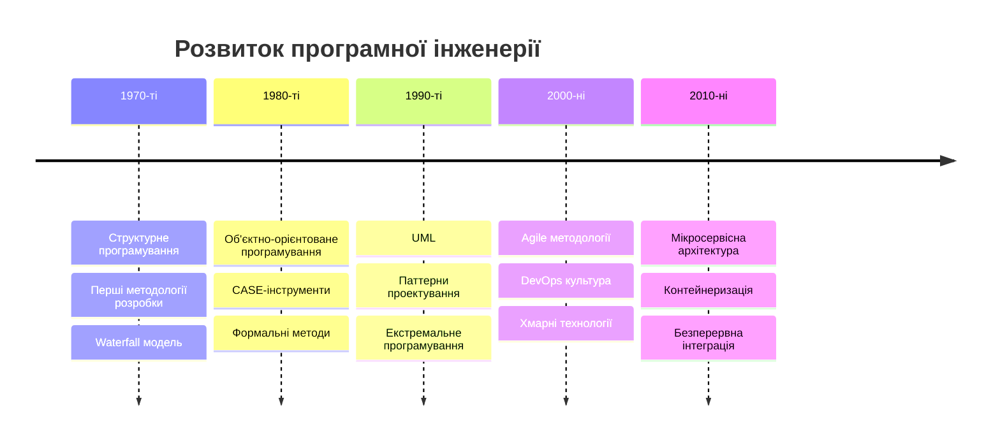
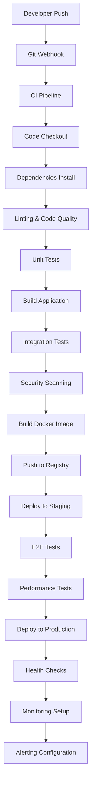

# Лекція 1. Вступ до програмної інженерії та її місце в IT

## Визначення програмної інженерії

**Програмна інженерія** — це дисципліна, що займається застосуванням інженерного підходу до проектування, розробки, тестування, розгортання та супроводу програмного забезпечення з метою створення високоякісних, надійних та економічно ефективних програмних систем.

### Детальний аналіз ключових аспектів визначення:

#### 1. **Інженерний підхід**
Програмна інженерія запозичує принципи традиційної інженерії та адаптує їх до специфіки розробки програмного забезпечення:

- **Систематичність**: Використання перевірених методів та процедур, а не хаотичного підходу
- **Дисциплінованість**: Дотримання встановлених стандартів та процесів розробки
- **Кількісна оцінка**: Застосування метрик для вимірювання якості, продуктивності та прогресу
- **Відтворюваність**: Здатність повторити результати при дотриманні тих самих умов

**Приклад**: При розробці банківської системи інженер ПЗ не просто "пише код", а спочатку аналізує вимоги, проектує архітектуру, вибирає відповідні технології, планує етапи реалізації, визначає критерії якості та методи тестування.

#### 2. **Охоплення життєвого циклу**
Програмна інженерія включає всі фази існування програмного продукту:

- **Планування**: Визначення цілей, ресурсів та часових рамок
- **Аналіз вимог**: Детальне вивчення потреб користувачів та бізнес-процесів
- **Проектування**: Створення архітектури та детального дизайну системи
- **Реалізація**: Безпосереднє написання коду згідно з проектом
- **Тестування**: Перевірка функціональності та якості продукту
- **Розгортання**: Установка та налаштування системи в робочому середовищі
- **Супровід**: Підтримка, оновлення та вдосконалення після впровадження

#### 3. **Забезпечення якості**
Якість програмного забезпечення є багатоаспектним поняттям:

- **Функціональність**: Система виконує всі заявлені функції
- **Надійність**: Стабільна робота без критичних збоїв
- **Використабельність**: Зручність та інтуїтивність інтерфейсу
- **Ефективність**: Оптимальне використання системних ресурсів
- **Підтримуваність**: Легкість внесення змін та виправлень
- **Переносимість**: Здатність працювати в різних середовищах

#### 4. **Економічна ефективність**
Програмна інженерія враховує бізнес-аспекти розробки:

- **Оптимізація витрат**: Мінімізація ресурсів при збереженні якості
- **Дотримання термінів**: Своєчасна поставка продукту на ринок
- **Рентабельність інвестицій**: Забезпечення окупності розробки
- **Довгострокова цінність**: Створення продуктів з тривалим життєвим циклом

### Детальне порівняння з програмуванням

Розуміння відмінності між програмуванням та програмною інженерією є критично важливим для розуміння професії:

| Аспект | Програмування | Програмна інженерія |
|--------|---------------|-------------------|
| **Масштаб** | Окремі програми чи скрипти | Великі системи та комплекси |
| **Тривалість** | Години-дні | Місяці-роки |
| **Команда** | 1-2 особи | Від декількох до сотень спеціалістів |
| **Процес** | Неформальний, інтуїтивний | Структурований, документований |
| **Документація** | Мінімальна або відсутня | Детальна технічна документація |
| **Тестування** | Базове, ручне | Комплексне, автоматизоване |
| **Підтримка** | Обмежена | Довготривала, систематична |
| **Бюджет** | Невеликий | Від тисяч до мільйонів доларів |
| **Ризики** | Низькі | Високі (фінансові, репутаційні) |
| **Стандарти** | Особисті переваги | Галузеві стандарти та регуляції |

**Ілюстративний приклад**:

- **Програмування**: Студент пише калькулятор на Python за вечір для домашнього завдання
- **Програмна інженерія**: Команда з 50 розробників створює систему онлайн-банкінгу протягом 2 років з бюджетом $5 млн, яка обслуговуватиме мільйони клієнтів

## Історичний розвиток програмної інженерії

### Передумови виникнення програмної інженерії (1940-1960-ті роки)

#### Ранній період комп'ютингу
У перші десятиліття комп'ютерної ери програмування дійсно було більше **мистецтвом**, ніж **наукою**. Розробники працювали інтуїтивно, спираючись на особистий досвід та творчий підхід, що призводило до непередбачуваних результатів.

**Характеристики того періоду:**

1. **Індивідуальний підхід**: Кожен програміст мав власний стиль написання коду
2. **Відсутність документації**: Код рідко коментувався та документувався
3. **Неформальне тестування**: Перевірка працездатності "на око"
4. **Обмежена співпраця**: Мінімальна координація між розробниками

**Основні проблеми періоду:**

- **Відсутність стандартизованих методів**: Кожен проект розпочинався "з чистого листа"
- **Складність супроводу**: Код, написаний одним розробником, був незрозумілий іншим
- **Неконтрольоване зростання складності**: Програми ставали занадто складними для розуміння людиною
- **Дублювання зусиль**: Відсутність повторного використання коду

**Конкретний приклад**: Операційна система OS/360 компанії IBM (середина 1960-х) — одна з найамбітніших спроб того часу створити універсальну операційну систему. Проект залучав тисячі програмістів, але через відсутність координації та стандартизації призвів до величезних перевитрат та затримок.

### Криза програмного забезпечення (1960-ті роки)

#### Суть кризи
Термін "криза програмного забезпечення" описував ситуацію, коли традиційні підходи до програмування перестали справлятися з вимогами індустрії. Корінь проблеми полягав у **експоненціальному зростанні складності** програмних систем при **лінійному зростанні** людських можливостей їх розуміння.

**Детальний аналіз симптомів кризи:**

1. Фінансові перевитрати:
    - Проекти регулярно перевищували первинні бюджети в 2-5 разів
    - Приклад: проект SAGE (напівавтоматична система протиповітряної оборони США) коштував $61 млрд в сучасних цінах замість планованих $18 млрд
2. Хронічні затримки:
    - Терміни розробки зсувалися на місяці та роки
    - Деякі проекти взагалі ніколи не були завершені
    - IBM System/360 затримався на 2 роки
3. Низька якість продуктів:
    - Програми часто "падали" або працювали некоректно
    - Безліч помилок, що виявлялися вже після релізу
    - Складність виправлення дефектів
4. Непередбачуваність:
    - Неможливість точно оцінити час та ресурси, необхідні для розробки
    - Відсутність надійних методів планування

#### Причини кризи

**Технічні причини:**

- Зростання розміру та складності систем
- Відсутність структурованих методів програмування
- Примітивні інструменти розробки та відлагодження
- Обмежені можливості тестування

**Організаційні причини:**

- Відсутність проектного менеджменту в розробці ПЗ
- Слабка комунікація між замовником та виконавцем
- Нечіткі або мінливі вимоги
- Відсутність контролю якості

**Людські фактори:**

- Недооцінка складності завдань
- Надмірний оптимізм розробників
- Відсутність досвіду в управлінні великими проектами

### Народження терміну "програмна інженерія" (1968 рік)

#### Історична конференція

7-11 жовтня 1968 року в німецькому місті Гарміш-Партенкірхен відбулася конференція НАТО під назвою "Software Engineering". Це була перша міжнародна конференція, присвячена проблемам розробки програмного забезпечення.

**Учасники конференції:**

- Більше 50 провідних експертів з США, Європи та інших країн
- Представники університетів, урядових установ та приватних компаній
- Піонери комп'ютерної науки та практики програмування

**Ключові рішення конференції:**

1. **Визнання проблеми**: Офіційне визнання існування "кризи програмного забезпечення"
2. **Введення терміну**: Поява терміну "Software Engineering" як заклик до професіоналізації галузі
3. **Постановка завдань**: Визначення необхідності розробки інженерних підходів до створення ПЗ

**Цитата з підсумкового звіту конференції:**

> "Фраза 'програмна інженерія' була навмисно обрана як провокативна, щоб передбачити необхідність розміщення розробки програмного забезпечення на теоретичних основах та практичних дисциплінах, що характеризують встановлені галузі інженерії."

#### Наслідки конференції

**Короткострокові результати:**

- Створення перших навчальних програм з програмної інженерії
- Початок досліджень в області методології розробки ПЗ
- Формування професійних спільнот розробників

**Довгострокові наслідки:**

- Розвиток структурованого програмування
- Створення CASE-інструментів
- Формування галузевих стандартів
- Професіоналізація розробки програмного забезпечення

### Ключові віхи розвитку:



## Місце програмної інженерії в IT-індустрії

### Детальний аналіз позиції програмної інженерії

**1. Enterprise системи**
   - **ERP системи**: SAP, Oracle, Microsoft Dynamics
   - **CRM платформи**: Salesforce, HubSpot
   - **Банківські системи**: обробка транзакцій, ризик-менеджмент
   - **Медичні інформаційні системи**: електронні медичні картки
   - **Урядові системи**: електронне урядування, податкові системи
**2. Розподілені системи**
   - **Мікросервісна архітектура**: Netflix, Amazon, Google
   - **Системи обміну повідомленнями**: Apache Kafka, RabbitMQ
   - **Розподілені бази даних**: MongoDB, Cassandra, Redis
   - **Blockchain платформи**: Ethereum, Hyperledger
**3. Вбудовані системи**
   - **Автомобільна індустрія**: системи керування двигуном, автопілоти
   - **Медичне обладнання**: кардіостимулятори, МРТ сканери
   - **Побутова техніка**: "розумні" холодильники, пральні машини
   - **Промислова автоматизація**: роботи, конвеєрні лінії

### Взаємодія з суміжними дисциплінами

#### Глибинний аналіз взаємозв'язків

**1. Комп'ютерні науки (Computer Science)**

*Що надає програмній інженерії:*

- Теоретичні основи алгоритмів та складності обчислень
- Формальні методи верифікації програм
- Теорія баз даних та структур даних
- Основи штучного інтелекту та машинного навчання

*Що отримує від програмної інженерії:*

- Практичне застосування теоретичних концепцій
- Зворотний зв'язок про ефективність алгоритмів у реальних умовах
- Емпіричні дані для покращення теорій

*Приклад взаємодії:* Алгоритм сортування quicksort, розроблений в рамках CS, адаптується в програмній інженерії для конкретних застосувань з урахуванням обмежень пам'яті та продуктивності.

**2. Інформаційні системи (Information Systems)**

*Спільні аспекти:*

- Проектування баз даних
- Аналіз бізнес-процесів
- Управління даними організації

*Розбіжності:*

- IS фокусується на бізнес-вимогах, SE — на технічній реалізації
- IS працює з користувачами, SE — з технічними системами

**3. Управління проектами (Project Management)**

*Інтеграція в програмну інженерію:*

- Методології розробки (Agile, Scrum, Waterfall)
- Планування ресурсів та часу
- Управління ризиками технічних проектів
- Координація міжфункціональних команд

### Секторальний аналіз впливу програмної інженерії

**1. Фінансовий сектор**

- **Цифрові банки**: Monobank, Privat24
- **Платіжні системи**: Visa, Mastercard
- **Криптовалютні біржі**: Binance (українська команда)
- **Економічний ефект**: зниження вартості транзакцій на 40-60%

**2. Охорона здоров'я**

- **Телемедицина**: збільшення доступності медпослуг на 300%
- **Електронні рецепти**: економія $50 млн щорічно в Україні
- **Діагностичні системи**: підвищення точності діагнозу на 25%

**3. Освіта**

- **E-learning платформи**: охоплення 150+ мільйонів користувачів
- **Адаптивні системи навчання**: підвищення ефективності на 35%
- **Українські приклади**: Prometheus, EdEra

#### Трансформаційні ефекти

**Цифрова трансформація бізнесу:**

- **Автоматизація процесів**: зниження операційних витрат на 20-50%
- **Аналітика даних**: покращення прийняття рішень
- **Персоналізація послуг**: підвищення задоволеності клієнтів

**Створення нових бізнес-моделей:**

- **Platform Economy**: Uber, Airbnb, Amazon Marketplace
- **Software-as-a-Service**: Microsoft 365, Google Workspace
- **Subscription Economy**: Netflix, Spotify

## Основні принципи програмної інженерії

### 1. Модульність

**Принцип**: Розбиття складної системи на менші, керовані компоненти.

**Переваги:**

- Спрощення розробки та тестування
- Можливість паралельної роботи команд
- Легкість супроводу та оновлень
- Повторне використання коду

### 2. Абстракція

**Принцип**: Приховування деталей реалізації та надання простого інтерфейсу.

**Рівні абстракції:**

- Процедурна абстракція (функції)
- Абстракція даних (структури)
- Об'єктна абстракція (класи)
- Архітектурна абстракція (компоненти)

### 3. Інкапсуляція

**Принцип**: Об'єднання даних та методів їх обробки в єдину структуру з контрольованим доступом.

**Результат**: Підвищення надійності та безпеки системи.

### 4. Ієрархія

**Принцип**: Організація системи у вигляді ієрархічної структури рівнів абстракції.

**Приклади:**

- Ієрархія класів (наслідування)
- Архітектурні рівні (презентація, бізнес-логіка, дані)
- Організаційна ієрархія проекту

### 5. Розділення відповідальності

**Принцип**: Кожен компонент системи повинен мати чітко визначену та обмежену відповідальність.

**Реалізація:**

- Single Responsibility Principle (SRP)
- Розділення на рівні архітектури
- Мікросервісна архітектура

## Ролі та відповідальності в програмній інженерії

**1. Архітектор програмного забезпечення (Software Architect)**

*Основні відповідальності:*

- **Стратегічне планування архітектури**: визначення загальної структури системи
- **Технологічні рішення**: вибір технологічного стеку, фреймворків, баз даних
- **Архітектурні стандарти**: створення та підтримка архітектурних принципів
- **Оцінка ризиків**: аналіз технічних ризиків та способів їх мітигації

*Детальні завдання:*

```
Приклад роботи архітектора над e-commerce проектом:

1. Аналіз вимог:
   - Очікувана кількість користувачів: 1 млн+ одночасно
   - Географічне розповсюдження: глобальне
   - Пікові навантаження: розпродажі, чорна п'ятниця

2. Архітектурні рішення:
   - Мікросервісна архітектура для масштабованості
   - CDN для швидкої доставки контенту
   - Кешування на різних рівнях (Redis, Memcached)
   - Асинхронна обробка повідомлень (RabbitMQ/Kafka)

3. Технологічний стек:
   - Backend: Node.js/Python + Docker + Kubernetes
   - Frontend: React/Vue.js + Next.js для SSR
   - База даних: PostgreSQL + MongoDB + Elasticsearch
   - Моніторинг: Prometheus + Grafana + ELK Stack
```

*Необхідні компетенції:*

- Глибокі знання архітектурних патернів
- Досвід роботи з різними технологіями
- Розуміння бізнес-процесів
- Навички комунікації та презентації
- 7+ років досвіду в розробці ПЗ

**2. Розробник програмного забезпечення (Software Developer)**

*Спеціалізації сучасних розробників:*

**Frontend Developer:**

```
Технічний стек:
├── Основи: HTML5, CSS3, JavaScript ES6+
├── Фреймворки: React, Vue.js, Angular, Svelte
├── Збірка: Webpack, Vite, Rollup
├── Стилізація: Sass/SCSS, TailwindCSS, styled-components
├── Тестування: Jest, Cypress, Playwright
├── Інструменти: TypeScript, ESLint, Prettier
└── Версії: Git, GitHub/GitLab

Відповідальності:
├── Створення інтерактивних користувацьких інтерфейсів
├── Оптимізація продуктивності веб-додатків
├── Забезпечення кроссбраузерності та адаптивності
├── Інтеграція з Backend API
├── UX/UI покращення на основі аналітики
└── Accessibility (A11y) імплементація
```

**Backend Developer:**

```
Технічний стек:
├── Мови: Python, Java, C#, Go, Node.js, Rust
├── Фреймворки: Django, Spring Boot, .NET, Express.js
├── Бази даних: PostgreSQL, MySQL, MongoDB, Redis
├── API: REST, GraphQL, gRPC
├── Хмарні сервіси: AWS, Azure, GCP
├── Контейнеризація: Docker, Kubernetes
└── Моніторинг: Prometheus, Grafana, New Relic

Відповідальності:
├── Розробка серверної логіки та API
├── Проектування та оптимізація баз даних
├── Забезпечення безпеки та аутентифікації
├── Інтеграція з зовнішніми сервісами
├── Масштабування та оптимізація продуктивності
└── Розробка мікросервісів та розподілених систем
```

**3. Тестувальник/Інженер якості (QA Engineer)**

*Еволюція ролі тестувальника:*

**Традиційний підхід:**

- Ручне тестування після завершення розробки
- Створення тест-кейсів на основі документації
- Звітування про знайдені баги

**Сучасний підхід (Quality Engineering):**

```
Shifted-Left Testing:
├── Участь у плануванні з самого початку проекту
├── Створення тестових сценаріїв разом з вимогами
├── Автоматизація тестування на всіх рівнях
├── Безперервна інтеграція тестів у CI/CD pipeline
└── Моніторинг якості в production середовищі

Типи тестування:
├── Unit Testing (модульне тестування)
│   ├── Інструменти: Jest, JUnit, pytest, NUnit
│   └── Покриття: 80%+ для критичних компонентів
├── Integration Testing (інтеграційне тестування)
│   ├── API тестування: Postman, REST Assured
│   └── Database тестування: перевірка CRUD операцій
├── End-to-End Testing (наскрізне тестування)
│   ├── Інструменти: Cypress, Playwright, Selenium
│   └── Автоматизація користувацьких сценаріїв
├── Performance Testing (тестування продуктивності)
│   ├── Навантажувальне: JMeter, k6, Artillery
│   └── Стрес-тестування: виявлення точок відмови
└── Security Testing (тестування безпеки)
    ├── OWASP Top 10 перевірки
    └── Інструменти: OWASP ZAP, Burp Suite
```

**4. DevOps інженер**

*Ключові області відповідальності:*

**Infrastructure as Code (IaC):**

```yaml
# Приклад Terraform конфігурації для AWS
resource "aws_instance" "web_server" {
  ami           = "ami-0c02fb55956c7d316"
  instance_type = "t3.medium"

  tags = {
    Name        = "WebServer"
    Environment = "Production"
    Project     = "ECommerce"
  }
}

resource "aws_rds_instance" "database" {
  engine               = "postgres"
  engine_version       = "13.7"
  instance_class       = "db.t3.micro"
  allocated_storage    = 20
  db_name             = "ecommerce"
  username            = "admin"
  password            = var.db_password

  backup_retention_period = 7
  multi_az               = true

  tags = {
    Name = "ECommerce-DB"
    Environment = "Production"
  }
}
```

**CI/CD Pipeline Design:**



**Моніторинг:**

```
Метрики для моніторингу:
├── Application Metrics
│   ├── Response time (середній час відповіді < 200ms)
│   ├── Throughput (запитів за секунду)
│   ├── Error rate (< 0.1% помилок)
│   └── Resource utilization (CPU, Memory, Disk)
├── Infrastructure Metrics
│   ├── Server health (uptime, load average)
│   ├── Network metrics (bandwidth, latency)
│   ├── Database performance (query time, connections)
│   └── Storage metrics (disk space, I/O operations)
└── Business Metrics
    ├── User engagement (активні користувачі)
    ├── Conversion rates (конверсія продажів)
    ├── Revenue metrics (доход в реальному часі)
    └── Customer satisfaction (NPS, відгуки)
```

**5. Product Owner**

*Ключові навички та відповідальності:*

**Візія та статегія продукту:**

- Визначення довгострокової візії продукту
- Створення product roadmap на 6-12 місяців
- Аналіз ринку та конкурентів
- Визначення цільової аудиторії та персон

**Backlog Management:**

```
Структура Product Backlog:
├── Епіки (великі функціональні блоки)
│   ├── Epic: "Система рекомендацій"
│   ├── Epic: "Мобільний додаток"
│   └── Epic: "Програма лояльності"
├── User Stories (конкретні користувацькі історії)
│   ├── "Як користувач, я хочу бачити рекомендовані товари"
│   ├── "Як адмін, я хочу керувати акціями"
│   └── "Як клієнт, я хочу отримувати бонуси"
└── Tasks (технічні завдання)
    ├── Створити API endpoint для рекомендацій
    ├── Розробити алгоритм collaborative filtering
    └── Інтегрувати з системою аналітики
```

**Комінікація зі стейкхолдерами:**

- Регулярні презентації результатів спрінту
- Збір та аналіз відгуків користувачів
- Координація з маркетингом, продажами, підтримкою
- Участь у демо та retrospective зустрічах

### Міждисциплінарна співпраця

Успішна програмна інженерія вимагає тісної співпраці з:

- **UX/UI дизайнерами**: для створення зручного інтерфейсу
- **Бізнес-аналітиками**: для розуміння бізнес-вимог
- **Менеджерами проектів**: для планування та контролю
- **Спеціалістами з безпеки**: для забезпечення захисту

## Виклики сучасної програмної інженерії

### Технічні виклики

**1. Складність систем**
   - Зростання розміру кодової бази
   - Інтеграція з множинними сервісами
   - Управління залежностями
**2. Продуктивність та масштабованість**
   - Необхідність обробки великих обсягів даних
   - Підтримка мільйонів користувачів
   - Оптимізація ресурсів
**3. Безпека**
   - Захист від кібератак
   - Забезпечення приватності даних
   - Відповідність регуляторним вимогам

### Організаційні виклики

**1. Швидкість розробки**
   - Скорочення часу виходу на ринок (Time-to-Market)
   - Швидка адаптація до змін вимог
   - Безперервна поставка функцій
**2. Командна робота**
   - Координація розподілених команд
   - Культурні відмінності
   - Ефективна комунікація
**3. Управління якістю**
   - Баланс між швидкістю та якістю
   - Технічний борг
   - Довгострокова підтримуваність

### Соціальні виклики

**1. Етичні питання**
   - Відповідальність за наслідки використання ПЗ
   - Алгоритмічна справедливість
   - Вплив на суспільство

**2. Навички та освіта**
   - Постійне навчання нових технологій
   - Дефіцит кваліфікованих спеціалістів
   - Адаптація до змін у індустрії

## Висновки

Програмна інженерія є фундаментальною дисципліною сучасної IT-індустрії, яка:

1. **Застосовує інженерні принципи** до створення програмного забезпечення
2. **Охоплює весь життєвий цикл** розробки ПЗ
3. **Вимагає командної роботи** та міждисциплінарної співпраці
4. **Постійно еволюціонує** відповідно до технологічних змін
5. **Впливає на всі аспекти** сучасного життя та бізнесу

Розуміння основ програмної інженерії є критично важливим для успішної кар'єри в IT-сфері та створення якісних програмних продуктів.

## Питання для самоперевірки

1. У чому полягає основна відмінність між програмуванням та програмною інженерією?
2. Які фактори призвели до виникнення кризи програмного забезпечення в 1960-х роках?
3. Назвіть п'ять основних принципів програмної інженерії та поясніть їх значення.
4. Які ролі існують у сучасній команді розробки ПЗ?
5. Які основні виклики стоять перед програмною інженерією сьогодні?
