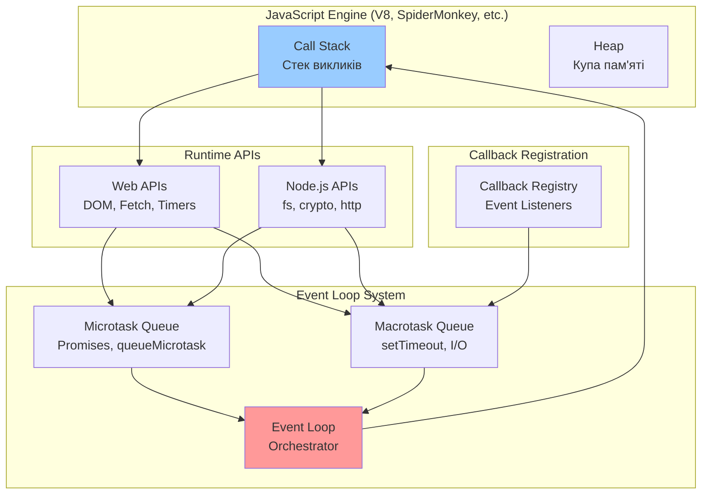
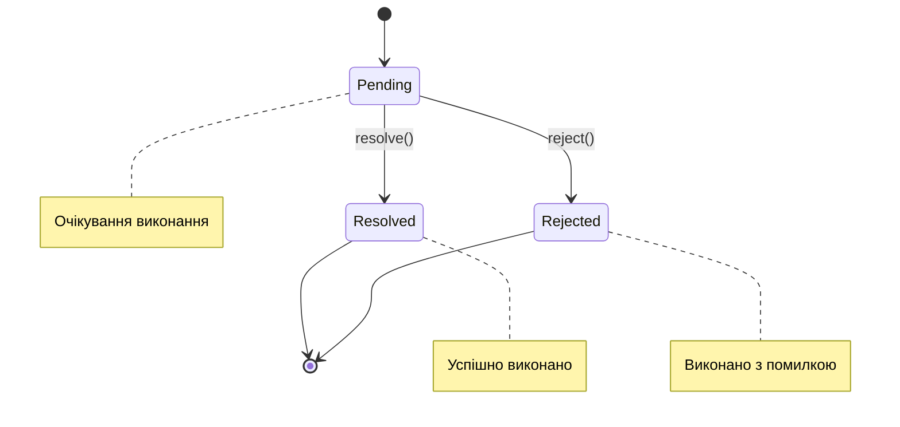
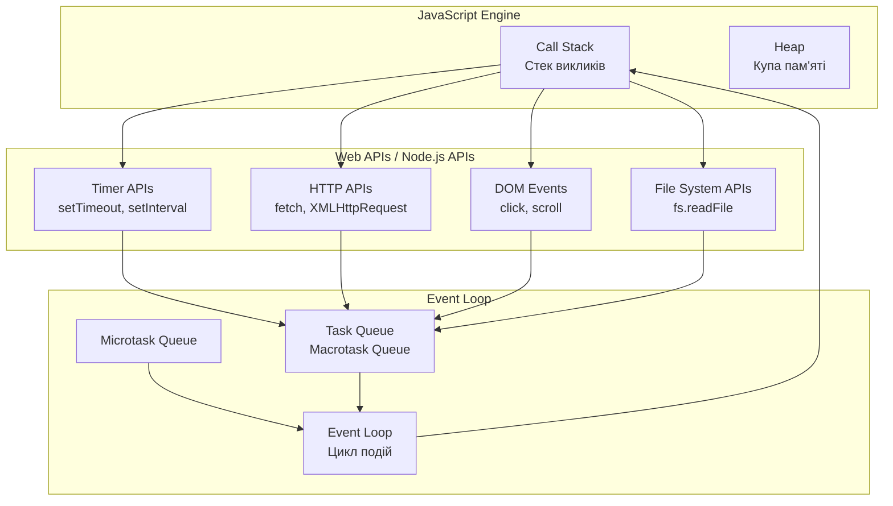

#### Асинхронні ітерації та обробка колекцій

Робота з асинхронними операціями над колекціями даних вимагає особливого підходу. Традиційні методи масивів як `forEach`, `map`, `filter` не працюють інтуїтивно з асинхронними функціями.

```javascript
// ПРОБЛЕМА: forEach не чекає на async функції
const userIds = [1, 2, 3, 4, 5];

// Це НЕ працює як очікується
userIds.forEach(async (id) => {
    const user = await fetchUserData(id);
    console.log(user.name); // Порядок виводу непередбачуваний
});
console.log('Завершено'); // Виведеться першим!

// РІШЕННЯ 1: Послідовна обробка з for...of
async function processUsersSequentially(userIds) {
    const processedUsers = [];

    for (const id of userIds) {
        try {
            const user = await fetchUserData(id);
            const processedUser = await processUserData(user);
            processedUsers.push(processedUser);

            console.log(`Оброблено користувача: ${user.name}`);
        } catch (error) {
            console.error(`Помилка обробки користувача ${id}:`, error.message);
        }
    }

    return processedUsers;
}

// РІШЕННЯ 2: Паралельна обробка з Promise.all
async function processUsersParallel(userIds) {
    try {
        // Створюємо масив Promise
        const userPromises = userIds.map(async (id) => {
            const user = await fetchUserData(id);
            return await processUserData(user);
        });

        // Чекаємо на всі Promise одночасно
        const processedUsers = await Promise.all(userPromises);

        processedUsers.forEach(user => {
            console.log(`Оброблено користувача: ${user.name}`);
        });

        return processedUsers;
    } catch (error) {
        console.error('Помилка паралельної обробки:', error);
        throw error;
    }
}

// РІШЕННЯ 3: Контрольована паралельність
async function processUsersWithLimit(userIds, concurrencyLimit = 3) {
    const results = [];
    const executing = [];

    for (const id of userIds) {
        const promise = fetchUserData(id).then(processUserData);
        results.push(promise);

        if (userIds.length >= concurrencyLimit) {
            executing.push(promise);

            if (executing.length >= concurrencyLimit) {
                await Promise.race(executing);
                executing.splice(executing.findIndex(p => p === promise), 1);
            }
        }
    }

    return Promise.all(results);
}

// Утилітарна функція для асинхронного map
async function asyncMap(array, asyncCallback) {
    const promises = array.map(asyncCallback);
    return Promise.all(promises);
}

// Утилітарна функція для асинхронного filter
async function asyncFilter(array, asyncCallback) {
    const results = await asyncMap(array, asyncCallback);
    return array.filter((_, index) => results[index]);
}

// Використання утилітарних функцій
const users = await asyncMap(userIds, fetchUserData);
const activeUsers = await asyncFilter(users, async user => {
    const activity = await checkUserActivity(user.id);
    return activity.isActive;
});
```

### Обробка помилок: всебічний підхід

#### Філософія обробки помилок в асинхронному коді

Обробка помилок в асинхронному JavaScript коді є критично важливою, оскільки неправильно оброблені помилки можуть призвести до "мовчазних" збоїв, коли програма продовжує працювати в непередбачуваному стані.

```javascript
// Створення ієрархії власних помилок
class AppError extends Error {
    constructor(message, statusCode = 500, isOperational = true) {
        super(message);
        this.name = this.constructor.name;
        this.statusCode = statusCode;
        this.isOperational = isOperational;
        this.timestamp = new Date().toISOString();

        Error.captureStackTrace(this, this.constructor);
    }
}

class ValidationError extends AppError {
    constructor(message, field = null) {
        super(message, 400);
        this.field = field;
        this.type = 'VALIDATION_ERROR';
    }
}

class NetworkError extends AppError {
    constructor(message, originalError = null) {
        super(message, 503);
        this.originalError = originalError;
        this.type = 'NETWORK_ERROR';
        this.retryable = true;
    }
}

class AuthenticationError extends AppError {
    constructor(message = 'Необхідна автентифікація') {
        super(message, 401);
        this.type = 'AUTHENTICATION_ERROR';
    }
}

class AuthorizationError extends AppError {
    constructor(message = 'Недостатньо прав доступу') {
        super(message, 403);
        this.type = 'AUTHORIZATION_ERROR';
    }
}
```

#### Комплексна система обробки помилок

```javascript
// Централізована система обробки помилок
class ErrorHandler {
    constructor() {
        this.errorReporters = [];
        this.userNotifiers = [];
    }

    // Додати репортер помилок (логування, аналітика)
    addErrorReporter(reporter) {
        this.errorReporters.push(reporter);
    }

    // Додати нотифікатор користувача
    addUserNotifier(notifier) {
        this.userNotifiers.push(notifier);
    }

    // Головний метод обробки помилок
    async handleError(error, context = {}) {
        const errorInfo = this.analyzeError(error, context);

        // Логування та репортинг
        await this.reportError(errorInfo);

        // Повідомлення користувача
        await this.notifyUser(errorInfo);

        // Відновлення, якщо можливо
        if (errorInfo.recoverable) {
            await this.attemptRecovery(errorInfo);
        }

        return errorInfo;
    }

    analyzeError(error, context) {
        return {
            error,
            message: error.message,
            stack: error.stack,
            type: error.constructor.name,
            statusCode: error.statusCode || 500,
            isOperational: error.isOperational !== false,
            recoverable: this.isRecoverable(error),
            context,
            timestamp: new Date().toISOString(),
            severity: this.getSeverity(error)
        };
    }

    isRecoverable(error) {
        return error instanceof NetworkError && error.retryable;
    }

    getSeverity(error) {
        if (error.statusCode >= 500) return 'CRITICAL';
        if (error.statusCode >= 400) return 'ERROR';
        return 'WARNING';
    }

    async reportError(errorInfo) {
        const reports = this.errorReporters.map(reporter =>
            reporter.report(errorInfo).catch(console.error)
        );
        await Promise.allSettled(reports);
    }

    async notifyUser(errorInfo) {
        const notifications = this.userNotifiers.map(notifier =>
            notifier.notify(errorInfo).catch(console.error)
        );
        await Promise.allSettled(notifications);
    }

    async attemptRecovery(errorInfo) {
        console.log('Спроба відновлення після помилки:', errorInfo.message);
        // Логіка відновлення залежно від типу помилки
    }
}

// Впровадження репортерів та нотифікаторів
class ConsoleErrorReporter {
    async report(errorInfo) {
        console.error(`[${errorInfo.severity}] ${errorInfo.message}`, {
            type: errorInfo.type,
            statusCode: errorInfo.statusCode,
            context: errorInfo.context,
            stack: errorInfo.stack
        });
    }
}

class UserNotifier {
    async notify(errorInfo) {
        const userMessage = this.getUserMessage(errorInfo);

        // Показати повідомлення користувачу
        if (typeof window !== 'undefined') {
            this.showNotification(userMessage, errorInfo.severity);
        }
    }

    getUserMessage(errorInfo) {
        const { error } = errorInfo;

        if (error instanceof ValidationError) {
            return `Помилка валідації: ${error.message}`;
        }

        if (error instanceof NetworkError) {
            return 'Проблеми з мережею. Спробуйте пізніше.';
        }

        if (error instanceof AuthenticationError) {
            return 'Будь ласка, увійдіть в систему.';
        }

        if (error instanceof AuthorizationError) {
            return 'У вас немає прав для виконання цієї операції.';
        }

        return 'Сталася неочікувана помилка. Ми працюємо над її вирішенням.';
    }

    showNotification(message, severity) {
        // Реалізація показу повідомлення користувачу
        console.log(`[USER NOTIFICATION - ${severity}] ${message}`);
    }
}

// Глобальна ініціалізація обробника помилок
const errorHandler = new ErrorHandler();
errorHandler.addErrorReporter(new ConsoleErrorReporter());
errorHandler.addUserNotifier(new UserNotifier());
```

#### Retry механізм з exponential backoff

```javascript
// Система повторних спроб з прогресивною затримкою
class RetryManager {
    constructor(options = {}) {
        this.maxRetries = options.maxRetries || 3;
        this.baseDelay = options.baseDelay || 1000;
        this.maxDelay = options.maxDelay || 30000;
        this.backoffFactor = options.backoffFactor || 2;
        this.jitter = options.jitter || true;
    }

    async executeWithRetry(operation, context = {}) {
        let lastError;
        let attempt = 0;

        while (attempt <= this.maxRetries) {
            try {
                const result = await operation();

                if (attempt > 0) {
                    console.log(`Успіх після ${attempt} повторних спроб`);
                }

                return result;
            } catch (error) {
                lastError = error;
                attempt++;

                if (attempt > this.maxRetries) {
                    console.error(`Всі ${this.maxRetries + 1} спроб невдалі`);
                    break;
                }

                if (!this.isRetryable(error)) {
                    console.error('Помилка не підлягає повторній спробі:', error.message);
                    break;
                }

                const delay = this.calculateDelay(attempt);
                console.warn(`Спроба ${attempt} невдала. Повтор через ${delay}ms`);

                await this.delay(delay);
            }
        }

        throw lastError;
    }

    isRetryable(error) {
        // Визначаємо, чи варто повторювати операцію
        if (error instanceof NetworkError) return error.retryable;
        if (error instanceof ValidationError) return false;
        if (error instanceof AuthenticationError) return false;
        if (error.statusCode && error.statusCode >= 500) return true;
        if (error.statusCode && error.statusCode === 429) return true; // Rate limit

        return false;
    }

    calculateDelay(attempt) {
        let delay = this.baseDelay * Math.pow(this.backoffFactor, attempt - 1);

        // Обмежуємо максимальну затримку
        delay = Math.min(delay, this.maxDelay);

        // Додаємо jitter для уникнення "thundering herd"
        if (this.jitter) {
            delay = delay * (0.5 + Math.random() * 0.5);
        }

        return Math.floor(delay);
    }

    delay(ms) {
        return new Promise(resolve => setTimeout(resolve, ms));
    }
}

// Використання retry механізму
const retryManager = new RetryManager({
    maxRetries: 5,
    baseDelay: 500,
    maxDelay: 10000
});

async function fetchUserDataWithRetry(userId) {
    return retryManager.executeWithRetry(async () => {
        const response = await fetch(`/api/users/${userId}`);

        if (!response.ok) {
            if (response.status >= 500 || response.status === 429) {
                throw new NetworkError(`HTTP ${response.status}: ${response.statusText}`, { retryable: true });
            } else {
                throw new AppError(`HTTP ${response.status}: ${response.statusText}`, response.status);
            }
        }

        return await response.json();
    });
}
```

#### Практичний приклад комплексної обробки помилок

```javascript
// Реальний приклад обробки помилок в додатку
async function processUserRegistration(userData) {
    try {
        // Валідація даних
        await validateUserData(userData);

        // Перевірка унікальності email
        const existingUser = await retryManager.executeWithRetry(() =>
            checkEmailExists(userData.email)
        );

        if (existingUser) {
            throw new ValidationError('Користувач з таким email вже існує', 'email');
        }

        // Створення користувача
        const newUser = await retryManager.executeWithRetry(() =>
            createUser(userData)
        );

        // Надсилання email підтвердження
        try {
            await sendConfirmationEmail(newUser.email, newUser.confirmationToken);
        } catch (emailError) {
            // Email помилки не повинні зупиняти реєстрацію
            console.warn('Не вдалося надіслати email підтвердження:', emailError.message);

            // Але треба повідомити про це
            await errorHandler.handleError(emailError, {
                operation: 'sendConfirmationEmail',
                userId: newUser.id,
                critical: false
            });
        }

        // Логування успішної реєстрації
        console.log(`Користувач успішно зареєстрований: ${newUser.email}`);

        return {
            success: true,
            user: newUser,
            message: 'Реєстрація успішна. Перевірте email для підтвердження.'
        };

    } catch (error) {
        // Централізована обробка всіх помилок
        const errorInfo = await errorHandler.handleError(error, {
            operation: 'userRegistration',
            userData: { ...userData, password: '[HIDDEN]' }
        });

        return {
            success: false,
            error: errorInfo,
            message: getUserFriendlyMessage(error)
        };
    }
}

function getUserFriendlyMessage(error) {
    if (error instanceof ValidationError) {
        return `Помилка валідації: ${error.message}`;
    }

    if (error instanceof NetworkError) {
        return 'Тимчасові проблеми з сервером. Спробуйте пізніше.';
    }

    return 'Сталася помилка під час реєстрації. Спробуйте пізніше.';
}

// Використання в UI компоненті
async function handleRegistrationForm(formData) {
    const submitButton = document.getElementById('submitButton');
    const errorContainer = document.getElementById('errorContainer');

    try {
        submitButton.disabled = true;
        submitButton.textContent = 'Реєстрація...';

        const result = await processUserRegistration(formData);

        if (result.success) {
            showSuccessMessage(result.message);
            redirectToConfirmationPage();
        } else {
            showErrorMessage(result.message);
        }

    } catch (error) {
        showErrorMessage('Неочікувана помилка. Спробуйте пізніше.');
    } finally {
        submitButton.disabled = false;
        submitButton.textContent = 'Зареєструватися';
    }
}
```

## Event Loop та асинхронність в JavaScript

### Фундаментальні основи Event Loop

**Event Loop** є серцем асинхронності JavaScript. Це механізм, який дозволяє однопоточній мові виконувати неблокуючі операції шляхом делегування операцій системним API та управління чергами завдань.

#### Концептуальна архітектура JavaScript Runtime

JavaScript Runtime Environment складається з кількох ключових компонентів, які працюють разом для забезпечення асинхронного виконання коду:



#### Детальна анатомія Event Loop

```javascript
// Демонстрація роботи Event Loop через приклад
console.log('🟢 1: Start - синхронний код');

// Macrotask - піде в чергу macrotasks
setTimeout(() => {
    console.log('🔴 2: setTimeout callback (macrotask)');

    // Microtask всередині macrotask
    Promise.resolve().then(() => {
        console.log('🟡 3: Promise inside setTimeout (microtask)');
    });

    // Ще один macrotask
    setTimeout(() => {
        console.log('🔴 4: Nested setTimeout (macrotask)');
    }, 0);
}, 0);

// Microtask - піде в чергу microtasks
Promise.resolve().then(() => {
    console.log('🟡 5: Promise callback (microtask)');

    // Вкладений microtask
    return Promise.resolve();
}).then(() => {
    console.log('🟡 6: Chained Promise (microtask)');
});

// Ручне додавання в microtask queue
queueMicrotask(() => {
    console.log('🟡 7: queueMicrotask callback (microtask)');
});

console.log('🟢 8: End - синхронний код');

/* Вивід:
🟢 1: Start - синхронний код
🟢 8: End - синхронний код
🟡 5: Promise callback (microtask)
🟡 6: Chained Promise (microtask)
🟡 7: queueMicrotask callback (microtask)
🔴 2: setTimeout callback (macrotask)
🟡 3: Promise inside setTimeout (microtask)
🔴 4: Nested setTimeout (macrotask)
*/
```

#### Пріоритети виконання в Event Loop

Event Loop працює за чітко визначеними правилами пріоритетності:

1. **Синхронний код** виконується негайно в Call Stack;
2. **Microtasks** мають найвищий пріоритет серед асинхронних операцій;
3. **Macrotasks** виконуються після завершення всіх microtasks;
4. **Render фаза** (тільки в браузері) відбувається між циклами Event Loop.

```javascript
// Візуалізація пріоритетів Event Loop
function demonstrateEventLoopPriorities() {
    console.log('=== Демонстрація пріоритетів Event Loop ===');

    // Macrotask 1
    setTimeout(() => console.log('Macrotask 1: setTimeout'), 0);

    // Macrotask 2
    setImmediate(() => console.log('Macrotask 2: setImmediate')); // Node.js only

    // Microtask 1
    Promise.resolve().then(() => {
        console.log('Microtask 1: Promise');

        // Microtask всередині microtask
        queueMicrotask(() => {
            console.log('Microtask 1.1: queueMicrotask inside Promise');
        });
    });

    // Microtask 2
    queueMicrotask(() => {
        console.log('Microtask 2: queueMicrotask');

        // Ще один Promise всередині queueMicrotask
        Promise.resolve().then(() => {
            console.log('Microtask 2.1: Promise inside queueMicrotask');
        });
    });

    // Синхронний код завжди виконується першим
    console.log('Синхронний код завершено');
}

demonstrateEventLoopPriorities();
```

### Типи асинхронних операцій та їх класифікація

#### Macrotasks (Task Queue)

**Macrotasks** — це "великі" завдання, які планується для виконання в наступних ітераціях Event Loop. Кожен цикл Event Loop обробляє тільки один macrotask.

```javascript
// Приклади macrotasks
console.log('=== Macrotasks ===');

// setTimeout/setInterval
setTimeout(() => console.log('setTimeout macrotask'), 0);
setInterval(() => console.log('setInterval macrotask'), 1000);

// I/O операції (Node.js)
if (typeof require !== 'undefined') {
    const fs = require('fs');
    fs.readFile('package.json', (err, data) => {
        console.log('File I/O macrotask');
    });
}

// DOM події (браузер)
if (typeof document !== 'undefined') {
    document.addEventListener('click', () => {
        console.log('DOM event macrotask');
    });
}

// HTTP запити
fetch('/api/data')
    .then(() => console.log('Fetch macrotask'))
    .catch(() => console.log('Fetch error macrotask'));

// MessageChannel (браузер)
if (typeof MessageChannel !== 'undefined') {
    const channel = new MessageChannel();
    channel.port1.onmessage = () => console.log('MessageChannel macrotask');
    channel.port2.postMessage('test');
}
```

#### Microtasks (Microtask Queue)

**Microtasks** — це "дрібні" завдання з високим пріоритетом. Всі доступні microtasks виконуються перед будь-якими macrotasks.

```javascript
// Приклади microtasks
console.log('=== Microtasks ===');

// Promise callbacks
Promise.resolve().then(() => console.log('Promise then microtask'));
Promise.reject().catch(() => console.log('Promise catch microtask'));

// async/await
async function asyncFunction() {
    await Promise.resolve();
    console.log('async/await microtask');
}
asyncFunction();

// queueMicrotask
queueMicrotask(() => console.log('queueMicrotask'));

// MutationObserver (браузер)
if (typeof MutationObserver !== 'undefined') {
    const observer = new MutationObserver(() => {
        console.log('MutationObserver microtask');
    });

    const targetNode = document.createElement('div');
    observer.observe(targetNode, { attributes: true });
    targetNode.setAttribute('data-test', 'value');
}
```

### Продуктивність та оптимізація Event Loop

#### Уникнення блокування Event Loop

Блокування Event Loop — одна з найсерйозніших проблем у JavaScript додатках. Коли синхронний код виконується занадто довго, він блокує всі інші операції.

```javascript
// ПОГАНО: Блокування Event Loop
function blockingOperation() {
    console.log('Початок блокуючої операції...');
    const start = Date.now();

    // Симуляція важкої синхронної операції
    while (Date.now() - start < 5000) {
        // 5 секунд блокування
        // UI заморожений, ніщо інше не може виконуватися
    }

    console.log('Блокуюча операція завершена');
}

// ДОБРЕ: Неблокуюча операція з використанням setTimeout
function nonBlockingOperation(callback) {
    console.log('Початок неблокуючої операції...');
    let processed = 0;
    const total = 1000000;
    const chunkSize = 10000;

    function processChunk() {
        const end = Math.min(processed + chunkSize, total);

        // Обробка частини даних
        for (let i = processed; i < end; i++) {
            // Симуляція обробки даних
            Math.sqrt(i);
        }

        processed = end;

        if (processed < total) {
            // Передати контроль Event Loop
            setTimeout(processChunk, 0);
        } else {
            console.log('Неблокуюча операція завершена');
            callback();
        }
    }

    processChunk();
}

// КРАЩЕ: Використання Web Workers для важких обчислень
function heavyComputationWithWorker(data) {
    return new Promise((resolve, reject) => {
        // Створення Web Worker
        const workerCode = `
            self.onmessage = function(e) {
                const data = e.data;
                let result = 0;

                // Важкі обчислення в окремому потоці
                for (let i = 0; i < data.length; i++) {
                    result += Math.sqrt(data[i]) * Math.sin(data[i]);
                }

                self.postMessage(result);
            };
        `;

        const blob = new Blob([workerCode], { type: 'application/javascript' });
        const worker = new Worker(URL.createObjectURL(blob));

        worker.onmessage = (event) => {
            resolve(event.data);
            worker.terminate();
        };

        worker.onerror = (error) => {
            reject(error);
            worker.terminate();
        };

        worker.postMessage(data);
    });
}
```

#### Оптимізація асинхронних операцій

```javascript
// Пул з'єднань для управління кількістю одночасних операцій
class ConnectionPool {
    constructor(maxConnections = 5) {
        this.maxConnections = maxConnections;
        this.activeConnections = 0;
        this.queue = [];
        this.stats = {
            totalRequests: 0,
            completedRequests: 0,
            failedRequests: 0,
            averageWaitTime: 0
        };
    }

    async execute(operation, priority = 0) {
        this.stats.totalRequests++;
        const startTime = Date.now();

        return new Promise((resolve, reject) => {
            const request = {
                operation,
                resolve,
                reject,
                priority,
                enqueuedAt: startTime
            };

            // Вставка з урахуванням пріоритету
            this.insertByPriority(request);
            this.processQueue();
        });
    }

    insertByPriority(request) {
        let inserted = false;
        for (let i = 0; i < this.queue.length; i++) {
            if (request.priority > this.queue[i].priority) {
                this.queue.splice(i, 0, request);
                inserted = true;
                break;
            }
        }
        if (!inserted) {
            this.queue.push(request);
        }
    }

    async processQueue() {
        if (this.activeConnections >= this.maxConnections || this.queue.length === 0) {
            return;
        }

        const request = this.queue.shift();
        this.activeConnections++;

        const waitTime = Date.now() - request.enqueuedAt;
        this.updateAverageWaitTime(waitTime);

        try {
            const result = await request.operation();
            this.stats.completedRequests++;
            request.resolve(result);
        } catch (error) {
            this.stats.failedRequests++;
            request.reject(error);
        } finally {
            this.activeConnections--;
            this.processQueue(); // Обробити наступний запит
        }
    }

    updateAverageWaitTime(newWaitTime) {
        const totalCompleted = this.stats.completedRequests + this.stats.failedRequests;
        this.stats.averageWaitTime =
            (this.stats.averageWaitTime * (totalCompleted - 1) + newWaitTime) / totalCompleted;
    }

    getStats() {
        return {
            ...this.stats,
            queueLength: this.queue.length,
            activeConnections: this.activeConnections
        };
    }
}

// Використання пулу з'єднань
const api## Модульна система (import/export)

### Революція в організації коду

До появи ES6 JavaScript не мав стандартного способу організації коду в модулі. Розробники використовували різні підходи: глобальні змінні, IIFE (Immediately Invoked Function Expressions), бібліотеки як RequireJS або CommonJS. Кожен з цих підходів мав свої обмеження та недоліки.

**Модульна система ES6+** стала першим нативним, стандартизованим рішенням для організації JavaScript коду. Вона базується на двох ключових концепціях: **експорт** (export) та **імпорт** (import).

### Концептуальні основи модульності

**Модуль** у JavaScript — це окремий файл, який інкапсулює функціональність та експортує тільки те, що повинно бути доступне зовні. Це реалізує фундаментальні принципи програмування:

1. **Інкапсуляція**: приховування внутрішньої реалізації;
2. **Розділення відповідальності**: кожен модуль має чітко визначену роль;
3. **Повторне використання**: модулі можуть бути імпортовані в різних частинах додатку;
4. **Залежності**: явне визначення того, що потрібно модулю для роботи.

```javascript
// Проблема без модулів: глобальне забруднення
// file1.js
var userName = 'Іван';
var userAge = 25;

function processUser() {
    console.log(userName + ' is ' + userAge + ' years old');
}

// file2.js
var userName = 'Марія'; // Конфлікт! Перезаписуємо глобальну змінну
var productName = 'Ноутбук';

function processUser() { // Конфлікт! Перезаписуємо глобальну функцію
    console.log('Processing product: ' + productName);
}
```

### Export: оголошення публічного API модуля

**Експорт** визначає, які елементи модуля доступні для використання в інших модулях. ES6+ надає два основних типи експорту: **named export** (іменований) та **default export** (за замовчуванням).

#### Named Export: множинні експорти з семантичними іменами

```javascript
// mathematics.js - модуль математичних операцій
export const PI = 3.14159265359;
export const E = 2.71828182846;

export function add(a, b) {
    return a + b;
}

export function multiply(a, b) {
    return a * b;
}

export function calculateCircleArea(radius) {
    return PI * radius * radius;
}

export class Calculator {
    constructor() {
        this.memory = 0;
    }

    add(value) {
        this.memory += value;
        return this;
    }

    multiply(value) {
        this.memory *= value;
        return this;
    }

    getResult() {
        return this.memory;
    }

    clear() {
        this.memory = 0;
        return this;
    }
}

// Альтернативний синтаксис: експорт в кінці файлу
const subtract = (a, b) => a - b;
const divide = (a, b) => {
    if (b === 0) {
        throw new Error('Ділення на нуль неможливе');
    }
    return a / b;
};

const power = (base, exponent) => Math.pow(base, exponent);

export { subtract, divide, power as pow }; // Експорт з перейменуванням
```

#### Default Export: головний експорт модуля

**Default export** використовується коли модуль має одну основну функціональність або клас. Кожен модуль може мати тільки один default export.

```javascript
// dateUtils.js - утиліти для роботи з датами
export default class DateFormatter {
    constructor(locale = 'uk-UA', options = {}) {
        this.locale = locale;
        this.options = {
            timeZone: 'Europe/Kiev',
            ...options
        };
    }

    formatDate(date) {
        return new Intl.DateTimeFormat(this.locale, {
            year: 'numeric',
            month: 'long',
            day: 'numeric',
            ...this.options
        }).format(date);
    }

    formatTime(date) {
        return new Intl.DateTimeFormat(this.locale, {
            hour: '2-digit',
            minute: '2-digit',
            second: '2-digit',
            ...this.options
        }).format(date);
    }

    formatRelativeTime(date) {
        const now = new Date();
        const diffInSeconds = Math.floor((now - date) / 1000);

        if (diffInSeconds < 60) return `${diffInSeconds} секунд тому`;
        if (diffInSeconds < 3600) return `${Math.floor(diffInSeconds / 60)} хвилин тому`;
        if (diffInSeconds < 86400) return `${Math.floor(diffInSeconds / 3600)} годин тому`;

        return this.formatDate(date);
    }
}

// Можна комбінувати default export з named exports
export const CURRENT_YEAR = new Date().getFullYear();
export const MONTHS = [
    'Січень', 'Лютий', 'Березень', 'Квітень', 'Травень', 'Червень',
    'Липень', 'Серпень', 'Вересень', 'Жовтень', 'Листопад', 'Грудень'
];

// Альтернативний спосіб default export
function createLogger(level = 'INFO') {
    return {
        info: (message) => console.log(`[${level}] ${message}`),
        warn: (message) => console.warn(`[${level}] ${message}`),
        error: (message) => console.error(`[${level}] ${message}`)
    };
}

export default createLogger;
```

### Import: споживання функціональності модулів

**Імпорт** дозволяє використовувати експортовану функціональність інших модулів. Синтаксис імпорту відображає структуру експорту, створюючи симетричний та інтуїтивний API.

#### Named Import: селективне імпортування

```javascript
// app.js - головний файл додатку
import { add, multiply, PI, Calculator } from './mathematics.js';
import DateFormatter, { CURRENT_YEAR, MONTHS } from './dateUtils.js';

// Використання іменованих імпортів
console.log(add(5, 3)); // 8
console.log(multiply(PI, 2)); // 6.28318...

const calc = new Calculator();
const result = calc.add(10).multiply(2).getResult();
console.log(result); // 20

// Використання default та named імпортів
const formatter = new DateFormatter('uk-UA');
const now = new Date();

console.log(formatter.formatDate(now)); // "2 вересня 2025 р."
console.log(`Поточний рік: ${CURRENT_YEAR}`); // "Поточний рік: 2025"
console.log(`Місяці: ${MONTHS.join(', ')}`);
```

#### Import з перейменуванням

```javascript
// Вирішення конфліктів імен
import { add as mathAdd } from './mathematics.js';
import { add as stringAdd } from './stringUtils.js';

console.log(mathAdd(2, 3)); // 5
console.log(stringAdd('Hello', ' World')); // "Hello World"

// Перейменування для кращої семантики
import { Calculator as MathCalculator } from './mathematics.js';
import { Calculator as ScientificCalculator } from './scientificMath.js';
```

#### Namespace Import: групування під об'єктом

```javascript
// Імпорт всього модуля як об'єкт
import * as MathUtils from './mathematics.js';
import * as DateUtils from './dateUtils.js';

console.log(MathUtils.add(1, 2)); // 3
console.log(MathUtils.PI); // 3.14159...

const calc = new MathUtils.Calculator();
const formatter = new DateUtils.default(); // default export потребує .default
```

#### Динамічний Import: завантаження на вимогу

```javascript
// Асинхронний імпорт для code splitting та умовного завантаження
async function loadMathModule() {
    try {
        const mathModule = await import('./mathematics.js');
        console.log(mathModule.add(2, 3)); // 5

        const Calculator = mathModule.Calculator;
        const calc = new Calculator();
        return calc;
    } catch (error) {
        console.error('Помилка завантаження модуля:', error);
    }
}

// Умовний імпорт залежно від середовища
if (process.env.# Лекція 2. JavaScript ES6+ та асинхронне програмування

## Вступ до сучасного JavaScript

### Історична еволюція JavaScript

JavaScript народився в 1995 році як проста мова сценаріїв для браузера Netscape Navigator. Спочатку мова мала обмежені можливості: додавання інтерактивності до статичних HTML сторінок, валідація форм, маніпуляції з DOM елементами. Проте за майже три десятиліття JavaScript пройшов неймовірний шлях еволюції, перетворившись з допоміжної мови в одну з найпопулярніших та наймогутніших мов програмування сучасності.

Ключовими етапами цього розвитку стали:

- **1997 рік**: стандартизація JavaScript як ECMAScript (ES1);
- **1999 рік**: ECMAScript 3 — додання регулярних виразів, обробки винятків;
- **2009 рік**: ECMAScript 5 — strict mode, нові методи масивів, JSON підтримка;
- **2015 рік**: ECMAScript 2015 (ES6) — революційне оновлення з класами, модулями, стрілочними функціями;
- **2016-теперішній час**: щорічні оновлення ECMAScript з постійним додаванням нових функцій.

### Що таке ECMAScript та його значення

**ECMAScript** — це стандарт, який визначає синтаксис, типи даних, об'єкти та методи, на яких базується JavaScript. Важливо розуміти, що JavaScript — це реалізація стандарту ECMAScript, хоча на практиці ці терміни часто використовуються як синоніми.

**ES6+ (ECMAScript 2015+)** позначає всі версії стандарту, починаючи з ES2015 і до сучасних версій. Це позначення підкреслює кардинальні зміни, які відбулися в мові, роблячи її більш потужною, виразною та зручною для розробки складних застосунків.

Основні причини, чому ES6+ став настільки важливим:

1. **Синтаксичні покращення**: введення більш зрозумілого та лаконічного синтаксису;
2. **Модульність**: нативна підтримка модульної системи;
3. **Асинхронність**: кращі інструменти для роботи з асинхронним кодом;
4. **Об'єктно-орієнтованість**: класи та наслідування в більш знайомому вигляді;
5. **Функціональне програмування**: покращена підтримка функціональних підходів.

### Проблеми, які вирішив ES6+

До появи ES6 розробники JavaScript стикалися з рядом фундаментальних проблем:

**Проблема області видимості**: використання `var` призводило до неочікуваної поведінки через hoisting та функціональну область видимості замість блочної.

**Відсутність модульності**: не було стандартного способу організації коду в модулі, що призводило до конфліктів глобальних змінних.

**Callback Hell**: глибока вкладеність зворотних викликів робила асинхронний код важкочитабельним та схильним до помилок.

**Багатослівність**: багато повсякденних операцій вимагали значної кількості коду.

ES6+ систематично вирішив ці проблеми, надавши розробникам сучасні інструменти для створення чистого, ефективного та підтримуваного коду.

## ES6+ можливості: деструктуризація, spread/rest, arrow functions

### Деструктуризація: революція в роботі з даними

**Деструктуризація** — це синтаксична конструкція, яка дозволяє розпакувати значення з масивів або властивості з об'єктів і присвоїти їх окремим змінним за один синтаксичний крок. Ця функціональність радикально змінила підхід до роботи з складними структурами даних у JavaScript.

#### Філософія деструктуризації

Традиційно програмісти змушені були писати повторюваний код для витягування даних зі структур. Деструктуризація відображає фундаментальний принцип сучасного програмування: код повинен бути виразним та мінімізувати boilerplate (шаблонний код).

Концептуально деструктуризація працює як "дзеркальне відображення" конструкції даних. Якщо ми можемо створити масив як `[1, 2, 3]`, то ми можемо його деструктурувати як `[a, b, c]`.

#### Деструктуризація масивів: принципи та можливості

Деструктуризація масивів базується на позиційному принципі — елементи витягуються відповідно до їх позиції в масиві.

```javascript
// Проблема до ES6: громіздкий код
const coordinates = [10, 20, 30];
const x = coordinates[0];
const y = coordinates[1];
const z = coordinates[2];

// ES6+ рішення: елегантна деструктуризація
const [x, y, z] = [10, 20, 30];
console.log(x, y, z); // 10 20 30
```

**Пропуск елементів** дозволяє селективно витягувати тільки потрібні значення:

```javascript
const colors = ['червоний', 'зелений', 'синій', 'жовтий'];
const [primary, , tertiary] = colors;
console.log(primary, tertiary); // 'червоний' 'синій'
```

**Значення за замовчуванням** захищають від undefined у випадку відсутності елементів:

```javascript
const [width = 100, height = 200, depth = 50] = [300, 150];
console.log(width, height, depth); // 300 150 50
```

**Rest синтаксис в деструктуризації** дозволяє зібрати решту елементів:

```javascript
const [head, ...tail] = [1, 2, 3, 4, 5];
console.log(head); // 1
console.log(tail); // [2, 3, 4, 5]
```

#### Деструктуризація об'єктів: семантичний підхід

На відміну від масивів, деструктуризація об'єктів базується на іменах властивостей, що робить її більш семантичною та стійкою до змін структури.

```javascript
// Традиційний підхід: повторюваність та схильність до помилок
const person = {
    name: 'Іван Петренко',
    age: 25,
    city: 'Київ',
    profession: 'Розробник'
};

const personName = person.name;
const personAge = person.age;
const personCity = person.city;

// Деструктуризація: декларативний та виразний код
const { name, age, city } = person;
console.log(name, age, city); // 'Іван Петренко' 25 'Київ'
```

**Перейменування змінних** вирішує конфлікти імен та покращує семантику:

```javascript
const apiResponse = {
    user_name: 'Марія',
    user_age: 28,
    user_email: 'maria@example.com'
};

// Перейменування для кращої читабельності
const {
    user_name: name,
    user_age: age,
    user_email: email
} = apiResponse;
```

**Глибока (вкладена) деструктуризація** дозволяє працювати з складними структурами:

```javascript
const company = {
    name: 'TechCorp',
    location: {
        country: 'Україна',
        city: 'Київ',
        coordinates: {
            lat: 50.4501,
            lng: 30.5234
        }
    },
    employees: {
        developers: 50,
        designers: 15,
        managers: 8
    }
};

// Глибока деструктуризація для витягування вкладених значень
const {
    name: companyName,
    location: {
        city,
        coordinates: { lat, lng }
    },
    employees: { developers, designers }
} = company;

console.log(companyName, city, lat, lng, developers, designers);
// 'TechCorp' 'Київ' 50.4501 30.5234 50 15
```

#### Деструктуризація в параметрах функцій: функціональна елегантність

Деструктуризація в параметрах функцій є одним з найпотужніших застосувань цієї можливості, дозволяючи створювати більш виразні та гнучкі API.

```javascript
// Традиційний підхід: позиційні параметри
function createUser(name, age, email, city, profession) {
    return {
        id: Math.random(),
        name,
        age,
        email,
        city,
        profession,
        createdAt: new Date()
    };
}

// Проблема: порядок параметрів має значення, легко помилитися
const user1 = createUser('Олексій', 30, 'alex@example.com', 'Львів', 'Дизайнер');

// ES6+ підхід: деструктуризація параметрів
function createUserModern({ name, age, email, city = 'Київ', profession = 'Спеціаліст' }) {
    return {
        id: Math.random(),
        name,
        age,
        email,
        city,
        profession,
        createdAt: new Date()
    };
}

// Переваги: порядок не має значення, значення за замовчуванням, самодокументованість
const user2 = createUserModern({
    profession: 'Розробник',
    email: 'dev@example.com',
    name: 'Анна',
    age: 27
});
```

### Оператори Spread і Rest: універсальність через три крапки

Оператори spread (`...`) та rest (`...`) є одними з найбільш універсальних та потужних додатків ES6+. Незважаючи на ідентичний синтаксис, вони виконують протилежні функції: spread розгортає структури, а rest збирає елементи в структури.

#### Spread оператор: розгортання як філософія

**Концептуальна основа spread оператора** полягає в тому, що він дозволяє "розпакувати" ітерований об'єкт (масив, рядок, об'єкт) і передати його елементи як окремі аргументи або значення.

```javascript
// Spread з масивами: об'єднання та копіювання
const primaryColors = ['червоний', 'синій', 'жовтий'];
const secondaryColors = ['зелений', 'помаранчевий', 'фіолетовий'];

// Об'єднання масивів: до ES6 використовувався concat()
const allColors = [...primaryColors, ...secondaryColors];
console.log(allColors);
// ['червоний', 'синій', 'жовтий', 'зелений', 'помаранчевий', 'фіолетовий']

// Shallow копіювання масиву
const colorsCopy = [...primaryColors];
// Це створює новий масив, а не посилання на існуючий

// Додавання елементів в довільних позиціях
const extendedColors = ['білий', ...primaryColors, 'чорний', ...secondaryColors];
```

**Spread з рядками** демонструє універсальність оператора:

```javascript
const greeting = "Привіт";
const characters = [...greeting];
console.log(characters); // ['П', 'р', 'и', 'в', 'і', 'т']

// Практичне застосування: перевірка на паліндром
function isPalindrome(str) {
    const normalized = str.toLowerCase().replace(/[^а-яa-z]/g, '');
    const chars = [...normalized];
    return chars.join('') === chars.reverse().join('');
}
```

**Spread з об'єктами** дозволяє елегантно працювати з immutable patterns:

```javascript
const baseConfig = {
    theme: 'light',
    language: 'uk',
    notifications: true
};

const userConfig = {
    ...baseConfig,
    theme: 'dark', // Перезаписує існуючу властивість
    fontSize: 'large' // Додає нову властивість
};

// Результат: { theme: 'dark', language: 'uk', notifications: true, fontSize: 'large' }

// Глибоке клонування об'єктів (shallow clone)
const configCopy = { ...baseConfig };
```

#### Rest параметри: збирання як принцип

**Rest параметри** дозволяють функціям приймати змінну кількість аргументів, збираючи їх у масив. Це рішення замінило застарілий об'єкт `arguments` більш сучасним та зручним підходом.

```javascript
// Проблема з arguments (застарілий підхід)
function oldSum() {
    var total = 0;
    for (var i = 0; i < arguments.length; i++) {
        total += arguments[i];
    }
    return total;
}

// arguments - це не справжній масив, тому методи масивів недоступні

// ES6+ рішення з rest параметрами
function sum(...numbers) {
    return numbers.reduce((total, num) => total + num, 0);
}

console.log(sum(1, 2, 3, 4, 5)); // 15
console.log(sum(10, 20)); // 30
console.log(sum()); // 0
```

**Комбінування звичайних параметрів з rest** забезпечує гнучкість:

```javascript
function createMessage(level, category, ...details) {
    const timestamp = new Date().toISOString();
    return {
        timestamp,
        level,
        category,
        message: details.join(' '),
        details
    };
}

const errorMessage = createMessage('ERROR', 'AUTH', 'User', 'authentication', 'failed');
// { timestamp: '2025-09-02...', level: 'ERROR', category: 'AUTH',
//   message: 'User authentication failed', details: ['User', 'authentication', 'failed'] }
```

### Arrow Functions: функціональна революція

**Стрілочні функції (Arrow Functions)** є однією з найвидимих та найбільш використовуваних можливостей ES6+. Вони не просто надають скорочений синтаксис — вони змінюють семантику функцій, особливо в контексті обробки `this`.

#### Синтаксична еволюція функцій

```javascript
// Еволюція синтаксису функцій у JavaScript

// 1. Function declaration (традиційний спосіб)
function multiply(a, b) {
    return a * b;
}

// 2. Function expression
const multiply = function(a, b) {
    return a * b;
};

// 3. Arrow function (ES6+)
const multiply = (a, b) => a * b;

// 4. Різні форми arrow functions
const square = x => x * x; // Один параметр - дужки не обов'язкові
const greet = () => console.log('Привіт!'); // Без параметрів
const processData = data => {
    // Багаторядкове тіло функції
    const processed = data.map(item => item * 2);
    return processed.filter(item => item > 10);
};
```

#### Семантичні відмінності: контекст this

Найважливішою концептуальною відмінністю стрілочних функцій є їхня поведінка щодо контексту `this`. Традиційні функції створюють власний контекст `this`, тоді як стрілочні функції наслідують `this` з лексичного оточення.

```javascript
// Проблема традиційних функцій з this
const timer = {
    seconds: 0,
    start: function() {
        // this тут посилається на об'єкт timer
        setInterval(function() {
            this.seconds++; // this тут посилається на global/window
            console.log(this.seconds); // undefined або помилка
        }, 1000);
    }
};

// Класичне рішення: збереження контексту
const timer = {
    seconds: 0,
    start: function() {
        const self = this; // Зберігаємо посилання на правильний this
        setInterval(function() {
            self.seconds++;
            console.log(self.seconds);
        }, 1000);
    }
};

// ES6+ рішення: стрілочні функції наслідують this
const timer = {
    seconds: 0,
    start: function() {
        setInterval(() => {
            this.seconds++; // this тут правильно посилається на timer
            console.log(this.seconds);
        }, 1000);
    }
};
```

#### Практичне застосування в методах масивів

Стрілочні функції особливо корисні при роботі з функціональними методами масивів:

```javascript
const products = [
    { name: 'Ноутбук', price: 25000, category: 'electronics' },
    { name: 'Книга', price: 300, category: 'books' },
    { name: 'Навушники', price: 2000, category: 'electronics' },
    { name: 'Кава', price: 150, category: 'food' }
];

// Традиційний підхід: багатослівний та менш читабельний
const expensiveElectronics = products
    .filter(function(product) {
        return product.category === 'electronics';
    })
    .filter(function(product) {
        return product.price > 5000;
    })
    .map(function(product) {
        return {
            name: product.name,
            formattedPrice: product.price + ' грн'
        };
    });

// ES6+ підхід: лаконічний та виразний
const expensiveElectronics = products
    .filter(product => product.category === 'electronics')
    .filter(product => product.price > 5000)
    .map(product => ({
        name: product.name,
        formattedPrice: `${product.price} грн`
    }));
```

#### Деструктуризація масивів

```javascript
// Традиційний підхід ES5
const numbers = [1, 2, 3, 4, 5];
const first = numbers[0];
const second = numbers[1];
const third = numbers[2];

// Деструктуризація ES6+
const [first, second, third] = [1, 2, 3, 4, 5];
console.log(first, second, third); // 1 2 3

// Пропуск елементів
const [a, , c] = [1, 2, 3];
console.log(a, c); // 1 3

// Значення за замовчуванням
const [x = 10, y = 20] = [1];
console.log(x, y); // 1 20

// Rest у деструктуризації масивів
const [head, ...tail] = [1, 2, 3, 4, 5];
console.log(head); // 1
console.log(tail); // [2, 3, 4, 5]
```

#### Деструктуризація об'єктів

```javascript
// Базова деструктуризація об'єктів
const person = {
    name: 'Іван Петренко',
    age: 25,
    city: 'Київ',
    profession: 'Розробник'
};

const { name, age, city } = person;
console.log(name); // 'Іван Петренко'
console.log(age);  // 25
console.log(city); // 'Київ'

// Перейменування змінних
const { name: fullName, age: years } = person;
console.log(fullName); // 'Іван Петренко'
console.log(years);    // 25

// Значення за замовчуванням
const { name, age, salary = 50000 } = person;
console.log(salary); // 50000 (значення за замовчуванням)

// Вкладена деструктуризація
const user = {
    id: 1,
    profile: {
        name: 'Марія',
        contacts: {
            email: 'maria@example.com',
            phone: '+380123456789'
        }
    }
};

const {
    profile: {
        name,
        contacts: { email, phone }
    }
} = user;

console.log(name);  // 'Марія'
console.log(email); // 'maria@example.com'
console.log(phone); // '+380123456789'
```

#### Деструктуризація в параметрах функції

```javascript
// Деструктуризація параметрів
function displayUser({ name, age, city = 'Невідомо' }) {
    console.log(`Ім'я: ${name}, Вік: ${age}, Місто: ${city}`);
}

const user = { name: 'Олексій', age: 30 };
displayUser(user); // Ім'я: Олексій, Вік: 30, Місто: Невідомо

// Деструктуризація масиву в параметрах
function getCoordinates([x, y, z = 0]) {
    return { x, y, z };
}

console.log(getCoordinates([10, 20])); // { x: 10, y: 20, z: 0 }
```

### Оператори Spread і Rest

#### Spread оператор (...)

**Spread оператор** розгортає елементи ітерованого об'єкта (масиву, рядка, об'єкта) в окремі елементи.

```javascript
// Spread з масивами
const arr1 = [1, 2, 3];
const arr2 = [4, 5, 6];

// Об'єднання масивів
const combined = [...arr1, ...arr2];
console.log(combined); // [1, 2, 3, 4, 5, 6]

// Копіювання масиву
const originalArray = [1, 2, 3];
const copiedArray = [...originalArray];
console.log(copiedArray); // [1, 2, 3]

// Додавання елементів
const extendedArray = [0, ...originalArray, 4, 5];
console.log(extendedArray); // [0, 1, 2, 3, 4, 5]

// Spread з рядками
const str = "hello";
const chars = [...str];
console.log(chars); // ['h', 'e', 'l', 'l', 'o']

// Spread з об'єктами
const obj1 = { a: 1, b: 2 };
const obj2 = { c: 3, d: 4 };

const mergedObj = { ...obj1, ...obj2 };
console.log(mergedObj); // { a: 1, b: 2, c: 3, d: 4 }

// Перезапис властивостей
const baseConfig = { theme: 'light', language: 'uk' };
const userConfig = { ...baseConfig, theme: 'dark' };
console.log(userConfig); // { theme: 'dark', language: 'uk' }

// Spread в функціях
function sum(a, b, c) {
    return a + b + c;
}

const numbers = [1, 2, 3];
console.log(sum(...numbers)); // 6
```

#### Rest параметри (...)

**Rest параметри** дозволяють представити невизначену кількість аргументів як масив.

```javascript
// Rest параметри у функціях
function sum(...numbers) {
    return numbers.reduce((total, num) => total + num, 0);
}

console.log(sum(1, 2, 3, 4, 5)); // 15
console.log(sum(10, 20));        // 30

// Комбінування звичайних параметрів з rest
function greet(greeting, ...names) {
    return `${greeting} ${names.join(', ')}!`;
}

console.log(greet('Привіт', 'Іван', 'Марія', 'Петро'));
// 'Привіт Іван, Марія, Петро!'

// Rest в деструктуризації об'єктів
const person = {
    name: 'Олена',
    age: 28,
    city: 'Львів',
    profession: 'Дизайнер',
    hobby: 'Фотографія'
};

const { name, age, ...otherInfo } = person;
console.log(name); // 'Олена'
console.log(age);  // 28
console.log(otherInfo); // { city: 'Львів', profession: 'Дизайнер', hobby: 'Фотографія' }
```

### Arrow Functions (Стрілочні функції)

**Стрілочні функції** — це скорочений синтаксис для визначення функцій, який також має відмінності в поведінці контексту `this`.

#### Синтаксис стрілочних функцій

```javascript
// Традиційна функція
function traditionalFunction(x) {
    return x * 2;
}

// Стрілочна функція
const arrowFunction = (x) => x * 2;

// Різні варіанти синтаксису стрілочних функцій

// Один параметр (дужки не обов'язкові)
const double = x => x * 2;

// Без параметрів
const getCurrentTime = () => new Date();

// Багато параметрів
const add = (a, b) => a + b;

// Багаторядкове тіло функції
const processUser = (user) => {
    const processedName = user.name.toUpperCase();
    const greeting = `Привіт, ${processedName}!`;
    return greeting;
};

// Повернення об'єкта (потрібні дужки)
const createUser = (name, age) => ({ name, age, id: Math.random() });

console.log(createUser('Анна', 24));
// { name: 'Анна', age: 24, id: 0.123456789 }
```

#### Контекст this у стрілочних функціях

```javascript
// Традиційні функції мають власний контекст this
const traditionalObject = {
    name: 'Traditional',
    regularMethod: function() {
        console.log('Regular method:', this.name);

        // Вкладена традиційна функція втрачає контекст
        setTimeout(function() {
            console.log('Timeout traditional:', this.name); // undefined
        }, 100);
    }
};

// Стрілочні функції наслідують контекст this
const arrowObject = {
    name: 'Arrow',
    arrowMethod: function() {
        console.log('Arrow method:', this.name);

        // Стрілочна функція зберігає контекст
        setTimeout(() => {
            console.log('Timeout arrow:', this.name); // 'Arrow'
        }, 100);
    }
};

// Практичний приклад з класом
class Timer {
    constructor() {
        this.seconds = 0;
        this.intervalId = null;
    }

    start() {
        // Стрілочна функція зберігає контекст this
        this.intervalId = setInterval(() => {
            this.seconds++;
            console.log(`Пройшло секунд: ${this.seconds}`);
        }, 1000);
    }

    stop() {
        clearInterval(this.intervalId);
        console.log('Таймер зупинено');
    }
}

const timer = new Timer();
timer.start();
```

#### Використання стрілочних функцій з масивами

```javascript
const numbers = [1, 2, 3, 4, 5, 6, 7, 8, 9, 10];

// Метод map
const doubled = numbers.map(num => num * 2);
console.log(doubled); // [2, 4, 6, 8, 10, 12, 14, 16, 18, 20]

// Метод filter
const evenNumbers = numbers.filter(num => num % 2 === 0);
console.log(evenNumbers); // [2, 4, 6, 8, 10]

// Метод reduce
const sum = numbers.reduce((total, num) => total + num, 0);
console.log(sum); // 55

// Ланцюжок методів
const result = numbers
    .filter(num => num > 3)
    .map(num => num * num)
    .reduce((total, num) => total + num, 0);

console.log(result); // 16 + 25 + 36 + 49 + 64 + 81 + 100 = 371

// Приклад з об'єктами
const users = [
    { name: 'Іван', age: 25, active: true },
    { name: 'Марія', age: 30, active: false },
    { name: 'Петро', age: 35, active: true }
];

const activeUserNames = users
    .filter(user => user.active)
    .map(user => user.name);

console.log(activeUserNames); // ['Іван', 'Петро']
```

## Модульна система (import/export)

**Модулі** дозволяють організувати код у окремі файли та повторно використовувати функціональність між різними частинами застосунку.

### Export (Експорт)

#### Named Export (Іменований експорт)

```javascript
// math.js
export const PI = 3.14159;

export function add(a, b) {
    return a + b;
}

export function multiply(a, b) {
    return a * b;
}

export class Calculator {
    constructor() {
        this.result = 0;
    }

    add(value) {
        this.result += value;
        return this;
    }

    multiply(value) {
        this.result *= value;
        return this;
    }

    getResult() {
        return this.result;
    }
}

// Альтернативний спосіб експорту
const subtract = (a, b) => a - b;
const divide = (a, b) => a / b;

export { subtract, divide };

// Експорт з перейменуванням
const power = (base, exponent) => Math.pow(base, exponent);
export { power as pow };
```

#### Default Export (Експорт за замовчуванням)

```javascript
// utils.js - тільки один default export на файл
export default function formatDate(date) {
    return date.toLocaleDateString('uk-UA');
}

// або
function formatDate(date) {
    return date.toLocaleDateString('uk-UA');
}

export default formatDate;

// Можна комбінувати default та named export
export const CURRENT_YEAR = new Date().getFullYear();

export function formatTime(date) {
    return date.toLocaleTimeString('uk-UA');
}
```

### Import (Імпорт)

```javascript
// Іменований імпорт
import { add, multiply, PI } from './math.js';
import { Calculator } from './math.js';

console.log(add(5, 3)); // 8
console.log(multiply(PI, 2)); // 6.28318

const calc = new Calculator();
const result = calc.add(10).multiply(2).getResult();
console.log(result); // 20

// Імпорт з перейменуванням
import { subtract as minus, pow } from './math.js';
console.log(minus(10, 4)); // 6
console.log(pow(2, 3)); // 8

// Імпорт всього як об'єкт
import * as MathUtils from './math.js';
console.log(MathUtils.add(1, 2)); // 3
console.log(MathUtils.PI); // 3.14159

// Default імпорт
import formatDate from './utils.js';
import formatDate, { CURRENT_YEAR, formatTime } from './utils.js';

const now = new Date();
console.log(formatDate(now)); // 02.09.2025 (приклад)
console.log(formatTime(now)); // 14:30:45 (приклад)
console.log(CURRENT_YEAR); // 2025

// Динамічний імпорт
async function loadMathModule() {
    const mathModule = await import('./math.js');
    console.log(mathModule.add(2, 3)); // 5
}

loadMathModule();

// Умовний імпорт
if (process.env.NODE_ENV === 'development') {
    import('./debug-utils.js').then(debugModule => {
        debugModule.enableDebugMode();
    });
}
```

#### Приклад модульної структури проєкту

```
project/
├── src/
│   ├── utils/
│   │   ├── math.js
│   │   ├── date.js
│   │   └── validation.js
│   ├── services/
│   │   ├── api.js
│   │   └── storage.js
│   ├── components/
│   │   ├── User.js
│   │   └── Product.js
│   └── app.js
└── package.json
```

```javascript
// src/services/api.js
const API_BASE_URL = 'https://api.example.com';

export async function fetchUsers() {
    const response = await fetch(`${API_BASE_URL}/users`);
    return response.json();
}

export async function createUser(userData) {
    const response = await fetch(`${API_BASE_URL}/users`, {
        method: 'POST',
        headers: {
            'Content-Type': 'application/json'
        },
        body: JSON.stringify(userData)
    });
    return response.json();
}

// src/utils/validation.js
export function validateEmail(email) {
    const emailRegex = /^[^\s@]+@[^\s@]+\.[^\s@]+$/;
    return emailRegex.test(email);
}

export function validateAge(age) {
    return age >= 0 && age <= 120;
}

// src/components/User.js
import { validateEmail, validateAge } from '../utils/validation.js';
import { createUser } from '../services/api.js';

export class User {
    constructor(name, email, age) {
        if (!validateEmail(email)) {
            throw new Error('Некоректний email');
        }
        if (!validateAge(age)) {
            throw new Error('Некоректний вік');
        }

        this.name = name;
        this.email = email;
        this.age = age;
    }

    async save() {
        return createUser({
            name: this.name,
            email: this.email,
            age: this.age
        });
    }
}

// src/app.js
import { User } from './components/User.js';
import { fetchUsers } from './services/api.js';

async function main() {
    try {
        const users = await fetchUsers();
        console.log('Існуючі користувачі:', users);

        const newUser = new User('Олекса', 'olexa@example.com', 28);
        const savedUser = await newUser.save();
        console.log('Новий користувач створений:', savedUser);
    } catch (error) {
        console.error('Помилка:', error.message);
    }
}

main();
```

## Promises, async/await, обробка помилок

### Promises (Проміси)

**Promise** — це об'єкт, який представляє eventual completion (або failure) асинхронної операції та її результуючу вартість.

#### Стани Promise



#### Створення та використання Promise

```javascript
// Створення простого Promise
const simplePromise = new Promise((resolve, reject) => {
    const isSuccess = Math.random() > 0.5;

    setTimeout(() => {
        if (isSuccess) {
            resolve('Операція успішна!');
        } else {
            reject(new Error('Щось пішло не так!'));
        }
    }, 1000);
});

// Використання Promise з then/catch
simplePromise
    .then(result => {
        console.log('Успіх:', result);
    })
    .catch(error => {
        console.error('Помилка:', error.message);
    })
    .finally(() => {
        console.log('Операція завершена');
    });

// Приклад Promise для завантаження даних
function fetchUserData(userId) {
    return new Promise((resolve, reject) => {
        // Симуляція API виклику
        setTimeout(() => {
            if (userId > 0) {
                resolve({
                    id: userId,
                    name: 'Іван Петренко',
                    email: 'ivan@example.com'
                });
            } else {
                reject(new Error('Некоректний ID користувача'));
            }
        }, 1500);
    });
}

// Використання
fetchUserData(123)
    .then(user => {
        console.log('Отримано користувача:', user);
        return fetchUserPosts(user.id); // Повертаємо новий Promise
    })
    .then(posts => {
        console.log('Отримано пости:', posts);
    })
    .catch(error => {
        console.error('Помилка завантаження:', error.message);
    });
```

#### Методи Promise

```javascript
// Promise.resolve() - створює resolved Promise
const resolvedPromise = Promise.resolve('Готово!');
resolvedPromise.then(value => console.log(value)); // 'Готово!'

// Promise.reject() - створює rejected Promise
const rejectedPromise = Promise.reject(new Error('Помилка!'));
rejectedPromise.catch(error => console.error(error.message)); // 'Помилка!'

// Promise.all() - чекає на всі Promise
const promise1 = fetchUserData(1);
const promise2 = fetchUserData(2);
const promise3 = fetchUserData(3);

Promise.all([promise1, promise2, promise3])
    .then(users => {
        console.log('Всі користувачі завантажені:', users);
    })
    .catch(error => {
        console.error('Хоча б один запит невдалий:', error);
    });

// Promise.allSettled() - чекає на всі Promise (не зупиняється на помилці)
Promise.allSettled([promise1, promise2, promise3])
    .then(results => {
        results.forEach((result, index) => {
            if (result.status === 'fulfilled') {
                console.log(`Користувач ${index + 1}:`, result.value);
            } else {
                console.error(`Помилка користувача ${index + 1}:`, result.reason);
            }
        });
    });

// Promise.race() - повертає перший завершений Promise
const fastPromise = new Promise(resolve => setTimeout(() => resolve('Швидкий'), 1000));
const slowPromise = new Promise(resolve => setTimeout(() => resolve('Повільний'), 2000));

Promise.race([fastPromise, slowPromise])
    .then(result => {
        console.log('Перший результат:', result); // 'Швидкий'
    });

// Promise.any() - повертає перший успішний Promise
const failingPromise = Promise.reject(new Error('Невдача'));
const successPromise = Promise.resolve('Успіх');

Promise.any([failingPromise, successPromise])
    .then(result => {
        console.log('Перший успішний:', result); // 'Успіх'
    })
    .catch(error => {
        console.error('Всі Promise невдалі:', error);
    });
```

### Async/Await

**async/await** — це синтаксичний цукор для роботи з Promise, який робить асинхронний код схожим на синхронний.

#### Базовий синтаксис async/await

```javascript
// Функція з async
async function fetchUserData(userId) {
    return new Promise((resolve) => {
        setTimeout(() => {
            resolve({
                id: userId,
                name: 'Марія Коваленко',
                email: 'maria@example.com'
            });
        }, 1000);
    });
}

// Використання await
async function displayUserInfo(userId) {
    try {
        console.log('Завантаження даних користувача...');
        const user = await fetchUserData(userId);
        console.log('Користувач завантажений:', user.name);
        return user;
    } catch (error) {
        console.error('Помилка завантаження:', error.message);
        throw error;
    }
}

// Виклик async функції
displayUserInfo(456)
    .then(user => {
        console.log('Операція завершена для:', user.name);
    })
    .catch(error => {
        console.error('Загальна помилка:', error);
    });

// Або з await (в іншій async функції)
async function main() {
    try {
        const user = await displayUserInfo(456);
        console.log('Головна функція отримала:', user);
    } catch (error) {
        console.error('Помилка в головній функції:', error);
    }
}

main();
```

#### Паралельне та послідовне виконання

```javascript
// Приклад API функцій
async function fetchUser(id) {
    const response = await fetch(`https://api.example.com/users/${id}`);
    return response.json();
}

async function fetchUserPosts(userId) {
    const response = await fetch(`https://api.example.com/users/${userId}/posts`);
    return response.json();
}

async function fetchUserComments(userId) {
    const response = await fetch(`https://api.example.com/users/${userId}/comments`);
    return response.json();
}

// Послідовне виконання (повільно)
async function loadUserDataSequentially(userId) {
    console.time('Sequential');

    const user = await fetchUser(userId);           // ~1 секунда
    const posts = await fetchUserPosts(userId);     // ~1 секунда
    const comments = await fetchUserComments(userId); // ~1 секунда

    console.timeEnd('Sequential'); // ~3 секунди загалом

    return { user, posts, comments };
}

// Паралельне виконання (швидко)
async function loadUserDataParallel(userId) {
    console.time('Parallel');

    // Запускаємо всі запити одночасно
    const [user, posts, comments] = await Promise.all([
        fetchUser(userId),
        fetchUserPosts(userId),
        fetchUserComments(userId)
    ]);

    console.timeEnd('Parallel'); // ~1 секунда загалом

    return { user, posts, comments };
}

// Змішаний підхід
async function loadUserDataMixed(userId) {
    // Спочатку отримуємо користувача
    const user = await fetchUser(userId);

    // Потім паралельно завантажуємо пости та коментарі
    const [posts, comments] = await Promise.all([
        fetchUserPosts(user.id),
        fetchUserComments(user.id)
    ]);

    return { user, posts, comments };
}
```

#### Async функції вищого порядку

```javascript
// Async forEach (неправильно - не чекає на завершення)
const userIds = [1, 2, 3, 4, 5];

userIds.forEach(async (id) => {
    const user = await fetchUser(id);
    console.log(user.name); // Виконується паралельно, порядок не гарантується
});

// Правильний підхід - послідовна обробка
async function processUsersSequentially(userIds) {
    const users = [];

    for (const id of userIds) {
        const user = await fetchUser(id);
        users.push(user);
        console.log(`Оброблено користувача: ${user.name}`);
    }

    return users;
}

// Правильний підхід - паралельна обробка
async function processUsersParallel(userIds) {
    const userPromises = userIds.map(id => fetchUser(id));
    const users = await Promise.all(userPromises);

    users.forEach(user => {
        console.log(`Оброблено користувача: ${user.name}`);
    });

    return users;
}

// Обробка з обмеженням кількості паралельних запитів
async function processUsersWithLimit(userIds, limit = 3) {
    const results = [];

    for (let i = 0; i < userIds.length; i += limit) {
        const batch = userIds.slice(i, i + limit);
        const batchPromises = batch.map(id => fetchUser(id));
        const batchResults = await Promise.all(batchPromises);

        results.push(...batchResults);
        console.log(`Оброблено партію з ${batchResults.length} користувачів`);
    }

    return results;
}
```

### Обробка помилок

#### Try/Catch з async/await

```javascript
// Базова обробка помилок
async function fetchUserSafely(userId) {
    try {
        const user = await fetchUser(userId);
        console.log('Користувач отриманий:', user);
        return user;
    } catch (error) {
        console.error('Помилка отримання користувача:', error.message);

        // Можна повернути значення за замовчуванням
        return {
            id: userId,
            name: 'Невідомий користувач',
            email: null
        };
    }
}

// Вкладена обробка помилок
async function complexOperation(userId) {
    try {
        const user = await fetchUser(userId);

        try {
            const posts = await fetchUserPosts(user.id);
            return { user, posts };
        } catch (postsError) {
            console.warn('Не вдалося завантажити пости:', postsError.message);
            return { user, posts: [] };
        }

    } catch (userError) {
        console.error('Критична помилка:', userError.message);
        throw new Error(`Неможливо обробити користувача ${userId}`);
    }
}

// Обробка помилок з finally
async function operationWithCleanup() {
    let resource = null;

    try {
        resource = await acquireResource();
        const result = await performOperation(resource);
        return result;
    } catch (error) {
        console.error('Помилка операції:', error.message);
        throw error;
    } finally {
        // Цей блок виконується завжди
        if (resource) {
            await releaseResource(resource);
            console.log('Ресурс звільнено');
        }
    }
}

// Множинна обробка помилок
async function handleMultipleErrors() {
    try {
        const results = await Promise.allSettled([
            fetchUser(1),
            fetchUser(2),
            fetchUser(999) // Цей може викликати помилку
        ]);

        const successful = [];
        const failed = [];

        results.forEach((result, index) => {
            if (result.status === 'fulfilled') {
                successful.push(result.value);
            } else {
                failed.push({
                    index,
                    error: result.reason.message
                });
            }
        });

        if (failed.length > 0) {
            console.warn('Деякі операції невдалі:', failed);
        }

        return successful;
    } catch (error) {
        console.error('Неочікувана помилка:', error);
        return [];
    }
}
```

#### Створення власних типів помилок

```javascript
// Власні класи помилок
class APIError extends Error {
    constructor(message, statusCode, endpoint) {
        super(message);
        this.name = 'APIError';
        this.statusCode = statusCode;
        this.endpoint = endpoint;
    }
}

class ValidationError extends Error {
    constructor(message, field) {
        super(message);
        this.name = 'ValidationError';
        this.field = field;
    }
}

// Функція з детальною обробкою помилок
async function fetchUserWithDetailedErrors(userId) {
    // Валідація параметрів
    if (!userId || userId <= 0) {
        throw new ValidationError('ID користувача має бути позитивним числом', 'userId');
    }

    try {
        const response = await fetch(`https://api.example.com/users/${userId}`);

        if (!response.ok) {
            throw new APIError(
                `Помилка API: ${response.statusText}`,
                response.status,
                `/users/${userId}`
            );
        }

        const user = await response.json();
        return user;
    } catch (error) {
        if (error instanceof APIError) {
            console.error(`API помилка (${error.statusCode}) на ${error.endpoint}:`, error.message);
        } else if (error instanceof ValidationError) {
            console.error(`Помилка валідації поля ${error.field}:`, error.message);
        } else if (error instanceof TypeError) {
            console.error('Помилка мережі або парсингу JSON:', error.message);
        } else {
            console.error('Невідома помилка:', error);
        }

        throw error; // Re-throw для подальшої обробки
    }
}

// Використання з детальною обробкою
async function handleUserFetch(userId) {
    try {
        const user = await fetchUserWithDetailedErrors(userId);
        console.log('Успішно отримано користувача:', user.name);
        return user;
    } catch (error) {
        if (error instanceof ValidationError) {
            // Показати користувачу повідомлення про некоректні дані
            showUserError('Будь ласка, перевірте введені дані');
        } else if (error instanceof APIError) {
            if (error.statusCode === 404) {
                showUserError('Користувача не знайдено');
            } else if (error.statusCode >= 500) {
                showUserError('Сервер тимчасово недоступний. Спробуйте пізніше');
            }
        } else {
            showUserError('Сталася неочікувана помилка');
        }

        return null;
    }
}
```

#### Retry логіка з exponential backoff

```javascript
// Функція для повтору операцій
async function retryWithBackoff(operation, maxRetries = 3, baseDelay = 1000) {
    let lastError;

    for (let attempt = 0; attempt <= maxRetries; attempt++) {
        try {
            const result = await operation();
            if (attempt > 0) {
                console.log(`Успіх після ${attempt} повторних спроб`);
            }
            return result;
        } catch (error) {
            lastError = error;

            if (attempt === maxRetries) {
                console.error(`Всі ${maxRetries + 1} спроб невдалі`);
                break;
            }

            // Exponential backoff: 1s, 2s, 4s, 8s...
            const delay = baseDelay * Math.pow(2, attempt);
            console.warn(`Спроба ${attempt + 1} невдала. Повтор через ${delay}ms`);

            await new Promise(resolve => setTimeout(resolve, delay));
        }
    }

    throw lastError;
}

// Використання retry логіки
async function fetchUserWithRetry(userId) {
    return retryWithBackoff(async () => {
        const response = await fetch(`https://api.example.com/users/${userId}`);

        if (!response.ok) {
            throw new Error(`HTTP ${response.status}: ${response.statusText}`);
        }

        return response.json();
    });
}
```

## Event Loop та асинхронність в JavaScript

### Основи Event Loop

**Event Loop** — це механізм, який дозволяє JavaScript виконувати неблокуючі операції, незважаючи на те, що JavaScript є однопоточною мовою.



#### Черги завдань

```javascript
// Приклад роботи Event Loop
console.log('1: Синхронний код');

setTimeout(() => {
    console.log('2: Macrotask (setTimeout)');
}, 0);

Promise.resolve().then(() => {
    console.log('3: Microtask (Promise)');
});

queueMicrotask(() => {
    console.log('4: Microtask (queueMicrotask)');
});

console.log('5: Синхронний код');

// Вивід:
// 1: Синхронний код
// 5: Синхронний код
// 3: Microtask (Promise)
// 4: Microtask (queueMicrotask)
// 2: Macrotask (setTimeout)
```

#### Детальний приклад Event Loop

```javascript
console.log('=== Початок виконання ===');

// Macrotask
setTimeout(() => {
    console.log('Timeout 1');

    // Microtask всередині macrotask
    Promise.resolve().then(() => {
        console.log('Promise всередині Timeout 1');
    });
}, 0);

// Microtask
Promise.resolve().then(() => {
    console.log('Promise 1');

    // Ще один microtask
    return Promise.resolve();
}).then(() => {
    console.log('Promise 2');
});

// Ще один macrotask
setTimeout(() => {
    console.log('Timeout 2');
}, 0);

// Microtask
queueMicrotask(() => {
    console.log('Microtask 1');
});

console.log('=== Кінець синхронного коду ===');

// Вивід:
// === Початок виконання ===
// === Кінець синхронного коду ===
// Promise 1
// Promise 2
// Microtask 1
// Timeout 1
// Promise всередині Timeout 1
// Timeout 2
```

### Асинхронні патерни

#### Callback Pattern (застарілий підхід)

```javascript
// Callback Hell (пекло зворотних викликів)
function fetchUser(id, callback) {
    setTimeout(() => {
        callback(null, { id, name: 'John' });
    }, 1000);
}

function fetchUserPosts(userId, callback) {
    setTimeout(() => {
        callback(null, [{ id: 1, title: 'Post 1' }]);
    }, 1000);
}

function fetchPostComments(postId, callback) {
    setTimeout(() => {
        callback(null, [{ id: 1, text: 'Comment 1' }]);
    }, 1000);
}

// Проблема: вкладеність та складність
fetchUser(1, (err, user) => {
    if (err) return console.error(err);

    fetchUserPosts(user.id, (err, posts) => {
        if (err) return console.error(err);

        fetchPostComments(posts[0].id, (err, comments) => {
            if (err) return console.error(err);

            console.log('Результат:', { user, posts, comments });
        });
    });
});
```

#### Promise-based підхід

```javascript
// Перетворення callback у Promise
function fetchUserPromise(id) {
    return new Promise((resolve, reject) => {
        setTimeout(() => {
            resolve({ id, name: 'John' });
        }, 1000);
    });
}

function fetchUserPostsPromise(userId) {
    return new Promise((resolve) => {
        setTimeout(() => {
            resolve([{ id: 1, title: 'Post 1', userId }]);
        }, 1000);
    });
}

function fetchPostCommentsPromise(postId) {
    return new Promise((resolve) => {
        setTimeout(() => {
            resolve([{ id: 1, text: 'Comment 1', postId }]);
        }, 1000);
    });
}

// Плоска структура з Promise chains
fetchUserPromise(1)
    .then(user => {
        console.log('Користувач:', user);
        return fetchUserPostsPromise(user.id);
    })
    .then(posts => {
        console.log('Пости:', posts);
        return fetchPostCommentsPromise(posts[0].id);
    })
    .then(comments => {
        console.log('Коментарі:', comments);
    })
    .catch(error => {
        console.error('Помилка:', error);
    });
```

#### Async/Await підхід (сучасний)

```javascript
// Найбільш читабельний підхід
async function loadUserData(userId) {
    try {
        console.log('Завантаження користувача...');
        const user = await fetchUserPromise(userId);

        console.log('Завантаження постів...');
        const posts = await fetchUserPostsPromise(user.id);

        console.log('Завантаження коментарів...');
        const comments = await fetchPostCommentsPromise(posts[0].id);

        return { user, posts, comments };
    } catch (error) {
        console.error('Помилка завантаження даних:', error);
        throw error;
    }
}

// Використання
loadUserData(1).then(result => {
    console.log('Всі дані завантажені:', result);
});
```

### Продуктивність та оптимізація

#### Уникнення блокування Event Loop

```javascript
// Погано: блокування Event Loop
function heavyCalculation() {
    let result = 0;
    for (let i = 0; i < 10000000000; i++) {
        result += Math.random();
    }
    return result;
}

// Краще: розбиття на частини
function heavyCalculationAsync(callback) {
    let result = 0;
    let processed = 0;
    const total = 10000000000;
    const chunkSize = 1000000;

    function processChunk() {
        const end = Math.min(processed + chunkSize, total);

        for (let i = processed; i < end; i++) {
            result += Math.random();
        }

        processed = end;

        if (processed < total) {
            // Дати можливість Event Loop обробити інші завдання
            setTimeout(processChunk, 0);
        } else {
            callback(result);
        }
    }

    processChunk();
}

// Сучасний підхід з Web Workers (в браузері)
function heavyCalculationWithWorker() {
    return new Promise((resolve, reject) => {
        const worker = new Worker('calculation-worker.js');

        worker.postMessage({ type: 'calculate', data: 10000000000 });

        worker.onmessage = (event) => {
            resolve(event.data);
            worker.terminate();
        };

        worker.onerror = (error) => {
            reject(error);
            worker.terminate();
        };
    });
}
```

#### Оптимізація асинхронних операцій

```javascript
// Пулінг підключень
class ConnectionPool {
    constructor(maxConnections = 5) {
        this.maxConnections = maxConnections;
        this.activeConnections = 0;
        this.queue = [];
    }

    async execute(operation) {
        return new Promise((resolve, reject) => {
            this.queue.push({ operation, resolve, reject });
            this.processQueue();
        });
    }

    async processQueue() {
        if (this.activeConnections >= this.maxConnections || this.queue.length === 0) {
            return;
        }

        const { operation, resolve, reject } = this.queue.shift();
        this.activeConnections++;

        try {
            const result = await operation();
            resolve(result);
        } catch (error) {
            reject(error);
        } finally {
            this.activeConnections--;
            this.processQueue(); // Обробити наступне завдання
        }
    }
}

// Використання пулу
const connectionPool = new ConnectionPool(3);

// Багато одночасних запитів будуть оброблятися по 3 одночасно
const requests = Array.from({ length: 10 }, (_, i) =>
    connectionPool.execute(() => fetchUser(i + 1))
);

Promise.all(requests).then(users => {
    console.log('Всі користувачі завантажені:', users.length);
});

// Кешування асинхронних операцій
class AsyncCache {
    constructor(ttl = 60000) { // TTL в мілісекундах
        this.cache = new Map();
        this.ttl = ttl;
    }

    async get(key, fetchFunction) {
        const cached = this.cache.get(key);

        if (cached && Date.now() - cached.timestamp < this.ttl) {
            return cached.data;
        }

        // Якщо дані застаріли або відсутні, завантажуємо нові
        const data = await fetchFunction();
        this.cache.set(key, {
            data,
            timestamp: Date.now()
        });

        return data;
    }

    clear() {
        this.cache.clear();
    }
}

const cache = new AsyncCache(30000); // Кеш на 30 секунд

// Використання кешу
async function getCachedUser(id) {
    return cache.get(`user-${id}`, () => fetchUserPromise(id));
}

// Перший виклик завантажить дані з сервера
const user1 = await getCachedUser(1);
// Другий виклик поверне дані з кешу
const user2 = await getCachedUser(1);
```

### Практичні приклади асинхронного коду

#### Система завантаження файлів

```javascript
class FileUploader {
    constructor(maxConcurrent = 3) {
        this.maxConcurrent = maxConcurrent;
        this.activeUploads = 0;
        this.queue = [];
    }

    async uploadFile(file, onProgress) {
        return new Promise((resolve, reject) => {
            this.queue.push({
                file,
                onProgress,
                resolve,
                reject
            });

            this.processQueue();
        });
    }

    async processQueue() {
        if (this.activeUploads >= this.maxConcurrent || this.queue.length === 0) {
            return;
        }

        const upload = this.queue.shift();
        this.activeUploads++;

        try {
            const result = await this.performUpload(upload.file, upload.onProgress);
            upload.resolve(result);
        } catch (error) {
            upload.reject(error);
        } finally {
            this.activeUploads--;
            this.processQueue();
        }
    }

    async performUpload(file, onProgress) {
        const formData = new FormData();
        formData.append('file', file);

        return new Promise((resolve, reject) => {
            const xhr = new XMLHttpRequest();

            xhr.upload.addEventListener('progress', (event) => {
                if (event.lengthComputable) {
                    const percentComplete = (event.loaded / event.total) * 100;
                    onProgress?.(percentComplete);
                }
            });

            xhr.addEventListener('load', () => {
                if (xhr.status === 200) {
                    resolve(JSON.parse(xhr.responseText));
                } else {
                    reject(new Error(`Upload failed: ${xhr.statusText}`));
                }
            });

            xhr.addEventListener('error', () => {
                reject(new Error('Upload failed'));
            });

            xhr.open('POST', '/api/upload');
            xhr.send(formData);
        });
    }
}

// Використання
const uploader = new FileUploader(2); // Максимум 2 одночасних завантаження

async function uploadMultipleFiles(files) {
    const uploadPromises = Array.from(files).map(file =>
        uploader.uploadFile(file, (progress) => {
            console.log(`${file.name}: ${progress.toFixed(2)}%`);
        })
    );

    try {
        const results = await Promise.allSettled(uploadPromises);

        const successful = results.filter(r => r.status === 'fulfilled');
        const failed = results.filter(r => r.status === 'rejected');

        console.log(`Успішно завантажено: ${successful.length}`);
        console.log(`Невдалих завантажень: ${failed.length}`);

        return { successful: successful.map(r => r.value), failed };
    } catch (error) {
        console.error('Критична помилка завантаження:', error);
        throw error;
    }
}
```

#### Real-time чат система

```javascript
class ChatSystem {
    constructor(apiUrl) {
        this.apiUrl = apiUrl;
        this.socket = null;
        this.reconnectAttempts = 0;
        this.maxReconnectAttempts = 5;
        this.reconnectDelay = 1000;
    }

    async connect(userId, token) {
        try {
            // Встановити WebSocket з'єднання
            this.socket = new WebSocket(`${this.apiUrl}/chat?token=${token}`);

            this.socket.onopen = () => {
                console.log('Підключено до чату');
                this.reconnectAttempts = 0;
                this.joinUser(userId);
            };

            this.socket.onmessage = (event) => {
                const message = JSON.parse(event.data);
                this.handleMessage(message);
            };

            this.socket.onclose = () => {
                console.log('З\'єднання закрито');
                this.attemptReconnect(userId, token);
            };

            this.socket.onerror = (error) => {
                console.error('Помилка WebSocket:', error);
            };

        } catch (error) {
            console.error('Помилка підключення:', error);
            throw error;
        }
    }

    async attemptReconnect(userId, token) {
        if (this.reconnectAttempts >= this.maxReconnectAttempts) {
            console.error('Максимум спроб перепідключення досягнуто');
            return;
        }

        this.reconnectAttempts++;
        const delay = this.reconnectDelay * Math.pow(2, this.reconnectAttempts - 1);

        console.log(`Спроба перепідключення ${this.reconnectAttempts} через ${delay}ms`);

        await new Promise(resolve => setTimeout(resolve, delay));
        await this.connect(userId, token);
    }

    async sendMessage(roomId, text) {
        if (this.socket?.readyState !== WebSocket.OPEN) {
            throw new Error('З\'єднання не активне');
        }

        const message = {
            type: 'message',
            roomId,
            text,
            timestamp: Date.now()
        };

        this.socket.send(JSON.stringify(message));
    }

    async loadMessageHistory(roomId, limit = 50, offset = 0) {
        try {
            const response = await fetch(`${this.apiUrl}/rooms/${roomId}/messages`, {
                method: 'GET',
                headers: {
                    'Authorization': `Bearer ${this.token}`
                },
                params: new URLSearchParams({ limit, offset })
            });

            if (!response.ok) {
                throw new Error('Помилка завантаження історії');
            }

            return await response.json();
        } catch (error) {
            console.error('Помилка завантаження історії:', error);
            throw error;
        }
    }

    handleMessage(message) {
        switch (message.type) {
            case 'message':
                this.displayMessage(message);
                break;
            case 'user_joined':
                this.displayUserJoined(message.user);
                break;
            case 'user_left':
                this.displayUserLeft(message.user);
                break;
            case 'typing':
                this.displayTyping(message.user);
                break;
        }
    }

    displayMessage(message) {
        const messageElement = document.createElement('div');
        messageElement.innerHTML = `
            <div class="message">
                <strong>${message.author}</strong>: ${message.text}
                <small>${new Date(message.timestamp).toLocaleTimeString()}</small>
            </div>
        `;
        document.getElementById('messages').appendChild(messageElement);
    }
}

// Використання
const chat = new ChatSystem('wss://chat.example.com');

async function initializeChat(userId, token) {
    try {
        await chat.connect(userId, token);

        // Завантажити історію повідомлень
        const history = await chat.loadMessageHistory('general');
        history.forEach(message => chat.displayMessage(message));

    } catch (error) {
        console.error('Помилка ініціалізації чату:', error);
    }
}
```

## Висновки

Сучасний JavaScript з ES6+ можливостями та розумінням асинхронного програмування є основою для створення ефективних вебдодатків:

### Ключові переваги ES6+:

1. **Деструктуризація** спрощує роботу з об'єктами та масивами;
2. **Spread/Rest оператори** забезпечують гнучкість у роботі з даними;
3. **Стрілочні функції** покращують читабельність та спрощують контекст;
4. **Модульна система** дозволяє організувати код у структуровані компоненти.

### Принципи асинхронного програмування:

1. **Promises** надають структурований підхід до обробки асинхронних операцій;
2. **Async/await** робить асинхронний код схожим на синхронний;
3. **Event Loop** забезпечує неблокуючу природу JavaScript;
4. **Правильна обробка помилок** критично важлива для надійних застосунків.

### Найкращі практики:

- Використовувати async/await замість callback-ів та Promise chains;
- Обробляти помилки на кожному рівні;
- Уникати блокування Event Loop;
- Використовувати паралельне виконання там, де це можливо;
- Кешувати результати довготривалих операцій;
- Реалізовувати retry логіку для нестабільних операцій.

Розуміння цих концепцій дозволяє створювати швидкі, надійні та масштабовані вебдодатки, які забезпечують відмінний користувацький досвід.
