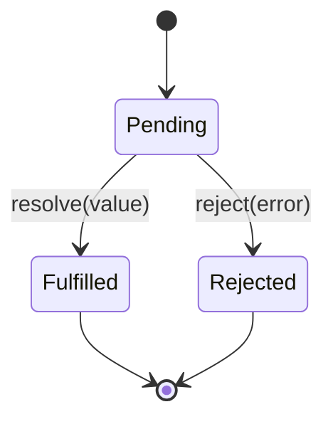
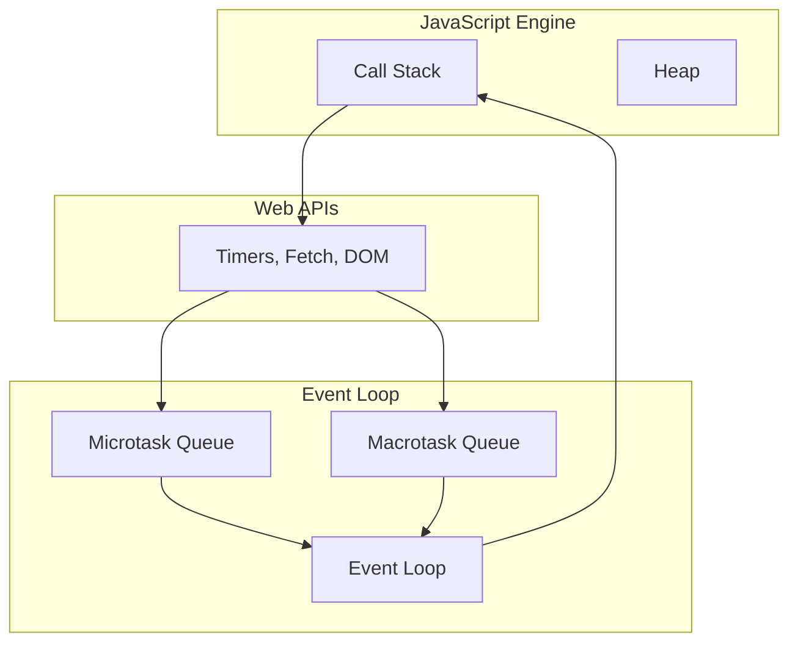

# Лекція 2. JavaScript ES6+ та асинхронне програмування

## Вступ до сучасного JavaScript

### Історична еволюція JavaScript

JavaScript народився в 1995 році як проста мова сценаріїв для браузера Netscape Navigator. Спочатку мова мала обмежені можливості: додавання інтерактивності до статичних HTML сторінок, валідація форм, маніпуляції з DOM елементами. Проте за майже три десятиліття JavaScript пройшов неймовірний шлях еволюції, перетворившись з допоміжної мови в одну з найпопулярніших та наймогутніших мов програмування сучасності.

Ключовими етапами цього розвитку стали:

- **1995 рік**: створення JavaScript Бренданом Айхом за 10 днів у Netscape;
- **1997 рік**: стандартизація JavaScript як ECMAScript (ES1);
- **1999 рік**: ECMAScript 3 — додання регулярних виразів, обробки винятків;
- **2009 рік**: ECMAScript 5 — strict mode, нові методи масивів, JSON підтримка;
- **2015 рік**: ECMAScript 2015 (ES6) — революційне оновлення з класами, модулями, стрілочними функціями;
- **2016-теперішній час**: щорічні оновлення ECMAScript з постійним додаванням нових функцій.

### Що таке ECMAScript та його значення

**ECMAScript** — це стандарт, який визначає синтаксис, типи даних, об'єкти та методи, на яких базується JavaScript. Важливо розуміти, що JavaScript — це реалізація стандарту ECMAScript, хоча на практиці ці терміни часто використовуються як синоніми.

**ES6+ (ECMAScript 2015+)** позначає всі версії, починаючи з ES2015 і до сучасних версій. Це позначення підкреслює кардинальні зміни, які відбулися в мові, роблячи її більш потужною, виразною та зручною для розробки складних застосунків.

Основні причини, чому ES6+ став настільки важливим:

1. **Синтаксичні покращення**: введення більш зрозумілого та лаконічного синтаксису;
2. **Модульність**: нативна підтримка модульної системи;
3. **Асинхронність**: кращі інструменти для роботи з асинхронним кодом;
4. **Об'єктно-орієнтованість**: класи та наслідування в більш знайомому вигляді;
5. **Функціональне програмування**: покращена підтримка функціональних підходів.

### Проблеми, які вирішив ES6+

До появи ES6 розробники JavaScript стикалися з рядом фундаментальних проблем:

**Проблема області видимості**: використання `var` призводило до неочікуваної поведінки через hoisting та функціональну область видимості замість блочної.

**Відсутність модульності**: не було стандартного способу організації коду в модулі, що призводило до конфліктів глобальних змінних.

**Callback Hell**: глибока вкладеність зворотних викликів робила асинхронний код важкочитабельним та схильним до помилок.

**Багатослівність**: багато повсякденних операцій вимагали значної кількості коду.

ES6+ систематично вирішив ці проблеми, надавши розробникам сучасні інструменти для створення чистого, ефективного та підтримуваного коду.

## ES6+ можливості: деструктуризація, spread/rest, arrow functions

### Деструктуризація: революція в роботі з даними

**Деструктуризація** — це синтаксична конструкція, яка дозволяє розпакувати значення з масивів або властивості з об'єктів і присвоїти їх окремим змінним за один синтаксичний крок. Ця функціональність радикально змінила підхід до роботи з складними структурами даних у JavaScript.

#### Філософія деструктуризації

Традиційно програмісти змушені були писати повторюваний код для витягування даних зі структур. Деструктуризація відображає фундаментальний принцип сучасного програмування: код повинен бути виразним та мінімізувати boilerplate (шаблонний код).

Концептуально деструктуризація працює як "дзеркальне відображення" конструкції даних. Якщо ми можемо створити масив як `[1, 2, 3]`, то ми можемо його деструктурувати як `[a, b, c]`.

#### Деструктуризація масивів

Деструктуризація масивів базується на позиційному принципі — елементи витягуються відповідно до їх позиції в масиві.

```javascript
// Традиційний підхід: громіздкий код
const coordinates = [10, 20, 30];
const x = coordinates[0];
const y = coordinates[1];
const z = coordinates[2];

// ES6+ рішення: елегантна деструктуризація
const [x, y, z] = [10, 20, 30];

// Пропуск елементів дозволяє селективно витягувати тільки потрібні значення
const colors = ['червоний', 'зелений', 'синій', 'жовтий'];
const [primary, , tertiary] = colors;
console.log(primary, tertiary); // 'червоний' 'синій'

// Значення за замовчуванням захищають від undefined
const [width = 100, height = 200, depth = 50] = [300, 150];
console.log(width, height, depth); // 300 150 50

// Rest синтаксис дозволяє зібрати решту елементів
const [head, ...tail] = [1, 2, 3, 4, 5];
console.log(head); // 1
console.log(tail); // [2, 3, 4, 5]
```

#### Деструктуризація об'єктів

На відміну від масивів, деструктуризація об'єктів базується на іменах властивостей, що робить її більш семантичною та стійкою до змін структури.

```javascript
const person = {
    name: 'Іван Петренко',
    age: 25,
    city: 'Київ',
    profession: 'Розробник'
};

// Базова деструктуризація
const { name, age, city } = person;

// Перейменування змінних вирішує конфлікти імен та покращує семантику
const { name: fullName, age: years } = person;

// Значення за замовчуванням
const { name, age, salary = 50000 } = person;

// Глибока (вкладена) деструктуризація дозволяє працювати з складними структурами
const company = {
    name: 'TechCorp',
    location: {
        country: 'Україна',
        city: 'Київ',
        coordinates: { lat: 50.4501, lng: 30.5234 }
    }
};

const {
    name: companyName,
    location: {
        city,
        coordinates: { lat, lng }
    }
} = company;
```

#### Деструктуризація в параметрах функцій

Деструктуризація в параметрах функцій є одним з найпотужніших застосувань цієї можливості, дозволяючи створювати більш виразні та гнучкі API.

```javascript
// Традиційний підхід: позиційні параметри
function createUser(name, age, email, city, profession) {
    return { id: Math.random(), name, age, email, city, profession };
}
// Проблема: порядок параметрів має значення, легко помилитися

// ES6+ підхід: деструктуризація параметрів
function createUserModern({ name, age, email, city = 'Київ', profession = 'Спеціаліст' }) {
    return { id: Math.random(), name, age, email, city, profession };
}

// Переваги: порядок не має значення, значення за замовчуванням, самодокументованість
const user = createUserModern({
    profession: 'Розробник',
    email: 'dev@example.com',
    name: 'Анна',
    age: 27
});
```

### Оператори Spread і Rest: універсальність через три крапки

Оператори spread (`...`) та rest (`...`) є одними з найбільш універсальних та потужних додатків ES6+. Незважаючи на ідентичний синтаксис, вони виконують протилежні функції: spread розгортає структури, а rest збирає елементи в структури.

#### Spread оператор: розгортання як філософія

**Концептуальна основа spread оператора** полягає в тому, що він дозволяє "розпакувати" ітерований об'єкт і передати його елементи як окремі аргументи або значення.

```javascript
// Spread з масивами: об'єднання та копіювання
const primaryColors = ['червоний', 'синій', 'жовтий'];
const secondaryColors = ['зелений', 'помаранчевий', 'фіолетовий'];

// Об'єднання масивів: до ES6 використовувався concat()
const allColors = [...primaryColors, ...secondaryColors];

// Shallow копіювання масиву
const colorsCopy = [...primaryColors];
// Це створює новий масив, а не посилання на існуючий

// Додавання елементів в довільних позиціях
const extendedColors = ['білий', ...primaryColors, 'чорний', ...secondaryColors];

// Spread з рядками демонструює універсальність оператора
const greeting = "Привіт";
const characters = [...greeting];
console.log(characters); // ['П', 'р', 'и', 'в', 'і', 'т']

// Spread з об'єктами дозволяє елегантно працювати з immutable patterns
const baseConfig = {
    theme: 'light',
    language: 'uk',
    notifications: true
};

const userConfig = {
    ...baseConfig,
    theme: 'dark', // Перезаписує існуючу властивість
    fontSize: 'large' // Додає нову властивість
};
```

#### Rest параметри: збирання як принцип

**Rest параметри** дозволяють функціям приймати змінну кількість аргументів, збираючи їх у масив. Це рішення замінило застарілий об'єкт `arguments` більш сучасним та зручним підходом.

```javascript
// Проблема з arguments (застарілий підхід)
function oldSum() {
    var total = 0;
    for (var i = 0; i < arguments.length; i++) {
        total += arguments[i];
    }
    return total;
}
// arguments - це не справжній масив, тому методи масивів недоступні

// ES6+ рішення з rest параметрами
function sum(...numbers) {
    return numbers.reduce((total, num) => total + num, 0);
}

console.log(sum(1, 2, 3, 4, 5)); // 15
console.log(sum(10, 20)); // 30
console.log(sum()); // 0

// Комбінування звичайних параметрів з rest
function createMessage(level, category, ...details) {
    const timestamp = new Date().toISOString();
    return {
        timestamp,
        level,
        category,
        message: details.join(' '),
        details
    };
}

const errorMessage = createMessage('ERROR', 'AUTH', 'User', 'authentication', 'failed');
```

### Arrow Functions: функціональна революція

**Стрілочні функції (Arrow Functions)** є однією з найвидимих та найбільш використовуваних можливостей ES6+. Вони не просто надають скорочений синтаксис — вони змінюють семантику функцій, особливо в контексті обробки `this`.

#### Синтаксична еволюція функцій

```javascript
// Еволюція синтаксису функцій у JavaScript

// 1. Function declaration (традиційний спосіб)
function multiply(a, b) {
    return a * b;
}

// 2. Function expression
const multiply = function(a, b) {
    return a * b;
};

// 3. Arrow function (ES6+)
const multiply = (a, b) => a * b;

// Різні форми arrow functions
const square = x => x * x; // Один параметр - дужки не обов'язкові
const greet = () => console.log('Привіт!'); // Без параметрів
const processData = data => {
    // Багаторядкове тіло функції
    const processed = data.map(item => item * 2);
    return processed.filter(item => item > 10);
};

// Повернення об'єкта (потрібні дужки)
const createUser = (name, age) => ({ name, age, id: Math.random() });
```

#### Семантичні відмінності: контекст this

Найважливішою концептуальною відмінністю стрілочних функцій є їхня поведінка щодо контексту `this`. Традиційні функції створюють власний контекст `this`, тоді як стрілочні функції наслідують `this` з лексичного оточення.

```javascript
// Проблема традиційних функцій з this
const timer = {
    seconds: 0,
    start: function() {
        // this тут посилається на об'єкт timer
        setInterval(function() {
            this.seconds++; // this тут посилається на global/window
            console.log(this.seconds); // undefined або помилка
        }, 1000);
    }
};

// Класичне рішення: збереження контексту
const timer = {
    seconds: 0,
    start: function() {
        const self = this; // Зберігаємо посилання на правильний this
        setInterval(function() {
            self.seconds++;
            console.log(self.seconds);
        }, 1000);
    }
};

// ES6+ рішення: стрілочні функції наслідують this
const timer = {
    seconds: 0,
    start: function() {
        setInterval(() => {
            this.seconds++; // this тут правильно посилається на timer
            console.log(this.seconds);
        }, 1000);
    }
};
```

#### Практичне застосування в методах масивів

```javascript
const products = [
    { name: 'Ноутбук', price: 25000, category: 'electronics' },
    { name: 'Книга', price: 300, category: 'books' },
    { name: 'Навушники', price: 2000, category: 'electronics' }
];

// ES6+ підхід: лаконічний та виразний
const expensiveElectronics = products
    .filter(product => product.category === 'electronics')
    .filter(product => product.price > 5000)
    .map(product => ({
        name: product.name,
        formattedPrice: `${product.price} грн`
    }));
```

## Модульна система (import/export)

### Концептуальні основи модульності

**Модуль** у JavaScript — це окремий файл, який інкапсулює функціональність та експортує тільки те, що повинно бути доступне зовні. Це реалізує принципи інкапсуляції та розділення відповідальності.

### Export: оголошення публічного API

#### Named Export

```javascript
// mathematics.js
export const PI = 3.14159;
export function add(a, b) { return a + b; }
export function multiply(a, b) { return a * b; }

export class Calculator {
    constructor() { this.memory = 0; }
    add(value) { this.memory += value; return this; }
    getResult() { return this.memory; }
}

// Альтернативний синтаксис
const subtract = (a, b) => a - b;
export { subtract };
```

#### Default Export

```javascript
// logger.js
export default class Logger {
    constructor(level = 'INFO') {
        this.level = level;
    }

    log(message) {
        console.log(`[${this.level}] ${message}`);
    }
}

// Можна комбінувати default та named
export const LOG_LEVELS = ['INFO', 'WARN', 'ERROR'];
```

### Import: споживання функціональності

```javascript
// Іменований імпорт
import { add, multiply, Calculator } from './mathematics.js';

// Default імпорт
import Logger from './logger.js';

// Комбінований імпорт
import Logger, { LOG_LEVELS } from './logger.js';

// Namespace імпорт
import * as MathUtils from './mathematics.js';

// Динамічний імпорт
async function loadModule() {
    const math = await import('./mathematics.js');
    return math.add(1, 2);
}
```

## Promises, async/await, обробка помилок

### Promises: концептуальна революція

**Promise** представляє eventual completion або failure асинхронної операції та її результуючу вартість. Promise має три стани: pending (очікування), fulfilled (виконано), rejected (відхилено).



#### Створення та використання Promise

```javascript
// Створення Promise
const fetchUserData = (userId) => {
    return new Promise((resolve, reject) => {
        setTimeout(() => {
            if (userId > 0) {
                resolve({
                    id: userId,
                    name: `Користувач ${userId}`,
                    email: `user${userId}@example.com`
                });
            } else {
                reject(new Error('Некоректний ID користувача'));
            }
        }, 1000);
    });
};

// Використання Promise
fetchUserData(123)
    .then(user => {
        console.log('Користувач:', user);
        return fetchUserPosts(user.id);
    })
    .then(posts => {
        console.log('Пости:', posts);
    })
    .catch(error => {
        console.error('Помилка:', error.message);
    })
    .finally(() => {
        console.log('Операція завершена');
    });
```

#### Promise методи

```javascript
// Promise.all() - чекає на всі Promise
const [userData, userPosts, userStats] = await Promise.all([
    fetchUserData(1),
    fetchUserPosts(1),
    fetchUserStats(1)
]);

// Promise.allSettled() - не зупиняється на помилці
const results = await Promise.allSettled([
    fetchUserData(1),
    fetchUserData(999) // може дати помилку
]);

// Promise.race() - повертає перший завершений
const winner = await Promise.race([
    fetchData(),
    timeout(5000) // timeout після 5 секунд
]);
```

### Async/Await: синтаксичний цукор з глибокою семантикою

**Async/await** дозволяє писати асинхронний код у стилі, близькому до синхронного.

```javascript
// Еволюція підходів
// 1. Callback Hell
fetchUser(id, (userErr, user) => {
    if (userErr) return callback(userErr);
    fetchPosts(user.id, (postsErr, posts) => {
        if (postsErr) return callback(postsErr);
        callback(null, { user, posts });
    });
});

// 2. Promise chains
function loadUserData(id) {
    return fetchUser(id)
        .then(user => fetchPosts(user.id)
            .then(posts => ({ user, posts })));
}

// 3. Async/await (найкраще рішення)
async function loadUserData(id) {
    try {
        const user = await fetchUser(id);
        const posts = await fetchPosts(user.id);
        return { user, posts };
    } catch (error) {
        console.error('Помилка:', error);
        throw error;
    }
}
```

#### Послідовне vs паралельне виконання

```javascript
// НЕЕФЕКТИВНО: послідовне виконання
async function loadDataSequential(userId) {
    const userData = await fetchUserData(userId);    // ~1 секунда
    const userPosts = await fetchUserPosts(userId);  // ~1 секунда
    const userStats = await fetchUserStats(userId);  // ~1 секунда
    // Загалом: ~3 секунди
    return { userData, userPosts, userStats };
}

// ЕФЕКТИВНО: паралельне виконання
async function loadDataParallel(userId) {
    const [userData, userPosts, userStats] = await Promise.all([
        fetchUserData(userId),
        fetchUserPosts(userId),
        fetchUserStats(userId)
    ]);
    // Загалом: ~1 секунда
    return { userData, userPosts, userStats };
}
```

### Обробка помилок

#### Створення власних типів помилок

```javascript
class APIError extends Error {
    constructor(message, statusCode) {
        super(message);
        this.name = 'APIError';
        this.statusCode = statusCode;
    }
}

class ValidationError extends Error {
    constructor(message, field) {
        super(message);
        this.name = 'ValidationError';
        this.field = field;
    }
}
```

#### Комплексна обробка помилок

```javascript
async function fetchUserSafely(userId) {
    try {
        // Валідація
        if (!userId || userId <= 0) {
            throw new ValidationError('ID має бути позитивним числом');
        }

        const user = await fetchUser(userId);
        return user;

    } catch (error) {
        if (error instanceof ValidationError) {
            console.error('Валідаційна помилка:', error.message);
        } else if (error instanceof APIError && error.statusCode >= 500) {
            console.error('Серверна помилка:', error.message);
        }

        // Повернути fallback значення
        return { id: userId, name: 'Невідомий користувач' };
    }
}
```

## Event Loop та асинхронність в JavaScript

### Фундаментальні основи Event Loop

**Event Loop** є серцем асинхронності JavaScript. Це механізм, який дозволяє однопоточній мові виконувати неблокуючі операції шляхом делегування операцій системним API та управління чергами завдань.



#### Пріоритети виконання в Event Loop

1. **Синхронний код** виконується негайно в Call Stack;
2. **Microtasks** мають найвищий пріоритет серед асинхронних операцій;
3. **Macrotasks** виконуються після завершення всіх microtasks.

```javascript
console.log('1: Синхронний код');

setTimeout(() => {
    console.log('2: Macrotask (setTimeout)');
}, 0);

Promise.resolve().then(() => {
    console.log('3: Microtask (Promise)');
});

console.log('4: Синхронний код');

// Вивід: 1 → 4 → 3 → 2
```

#### Типи завдань

**Macrotasks**: setTimeout, setInterval, I/O операції, DOM події
**Microtasks**: Promise callbacks, queueMicrotask, async/await

### Продуктивність та оптимізація

#### Уникнення блокування Event Loop

```javascript
// ПОГАНО: блокування Event Loop
function heavyCalculation() {
    let result = 0;
    for (let i = 0; i < 10000000000; i++) {
        result += Math.random();
    }
    return result; // Блокує UI на кілька секунд
}

// ДОБРЕ: неблокуюча операція
function heavyCalculationAsync(callback) {
    let result = 0, processed = 0;
    const total = 10000000000, chunkSize = 1000000;

    function processChunk() {
        const end = Math.min(processed + chunkSize, total);
        for (let i = processed; i < end; i++) {
            result += Math.random();
        }
        processed = end;

        if (processed < total) {
            setTimeout(processChunk, 0); // Передаємо контроль Event Loop
        } else {
            callback(result);
        }
    }
    processChunk();
}
```

### Практичні приклади асинхронного коду

#### Connection Pool для оптимізації

```javascript
class ConnectionPool {
    constructor(maxConnections = 5) {
        this.maxConnections = maxConnections;
        this.activeConnections = 0;
        this.queue = [];
    }

    async execute(operation) {
        return new Promise((resolve, reject) => {
            this.queue.push({ operation, resolve, reject });
            this.processQueue();
        });
    }

            if (request.priority > this.queue[i].priority) {
                this.queue.splice(i, 0, request);
                inserted = true;
                break;
            }
        }
        if (!inserted) {
            this.queue.push(request);
        }
    }

    async processQueue() {
        if (this.activeConnections >= this.maxConnections || this.queue.length === 0) {
            return;
        }

        const request = this.queue.shift();
        this.activeConnections++;

        try {
            const result = await request.operation();
            this.stats.completedRequests++;
            request.resolve(result);
        } catch (error) {
            this.stats.failedRequests++;
            request.reject(error);
        } finally {
            this.activeConnections--;
            this.processQueue(); // Обробити наступний запит
        }
    }

    getStats() {
        return {
            ...this.stats,
            queueLength: this.queue.length,
            activeConnections: this.activeConnections,
            successRate: (this.stats.completedRequests / this.stats.totalRequests * 100).toFixed(2) + '%'
        };
    }
}

// Використання пулу з'єднань
const apiPool = new ConnectionPool(3);

async function fetchUserWithPool(id, priority = 0) {
    return apiPool.execute(async () => {
        const response = await fetch(`/api/users/${id}`);
        if (!response.ok) {
            throw new Error(`HTTP ${response.status}: ${response.statusText}`);
        }
        return response.json();
    }, priority);
}

// Приклад використання з пріоритетами
async function loadDashboard() {
    const requests = [
        fetchUserWithPool(1, 10),  // Високий пріоритет - критичні дані
        fetchUserWithPool(2, 5),   // Середній пріоритет
        fetchUserWithPool(3, 1),   // Низький пріоритет - додаткові дані
        fetchUserWithPool(4, 10),  // Високий пріоритет
        fetchUserWithPool(5, 5)    // Середній пріоритет
    ];

    try {
        const users = await Promise.allSettled(requests);
        console.log('Статистика пулу:', apiPool.getStats());
        return users.filter(result => result.status === 'fulfilled').map(result => result.value);
    } catch (error) {
        console.error('Помилка завантаження dashboard:', error);
    }
}
```

##### Розумне кешування асинхронних операцій

```javascript
// Просунута система кешування з TTL та стратегіями оновлення
class SmartAsyncCache {
    constructor(options = {}) {
        this.cache = new Map();
        this.defaultTTL = options.ttl || 300000; // 5 хвилин за замовчуванням
        this.maxSize = options.maxSize || 100;
        this.stats = {
            hits: 0,
            misses: 0,
            evictions: 0
        };

        // Автоматичне очищення застарілих записів
        this.cleanupInterval = setInterval(() => {
            this.cleanup();
        }, 60000); // Кожну хвилину
    }

    async get(key, fetchFunction, options = {}) {
        const ttl = options.ttl || this.defaultTTL;
        const forceRefresh = options.forceRefresh || false;
        const cached = this.cache.get(key);

        // Перевірка актуальності кешованих даних
        if (cached && !forceRefresh && !this.isExpired(cached, ttl)) {
            this.stats.hits++;
            cached.lastAccessed = Date.now();
            return cached.data;
        }

        this.stats.misses++;

        // Background refresh для кращого UX
        if (cached && !forceRefresh && options.backgroundRefresh) {
            // Повернути застарілі дані, але оновити в фоні
            this.refreshInBackground(key, fetchFunction, ttl);
            return cached.data;
        }

        try {
            // Завантаження нових даних
            const data = await fetchFunction();
            this.set(key, data, ttl);
            return data;
        } catch (error) {
            // Graceful degradation - якщо є застарілі дані, повернути їх при помилці
            if (cached && options.fallbackToStale) {
                console.warn('Використання застарілих даних через помилку:', error.message);
                return cached.data;
            }
            throw error;
        }
    }

    set(key, data, ttl = this.defaultTTL) {
        // Перевірка розміру кешу та видалення найменш використовуваних записів
        if (this.cache.size >= this.maxSize) {
            this.evictLRU();
        }

        this.cache.set(key, {
            data,
            createdAt: Date.now(),
            lastAccessed: Date.now(),
            ttl
        });
    }

    isExpired(cached, ttl) {
        return Date.now() - cached.createdAt > ttl;
    }

    async refreshInBackground(key, fetchFunction, ttl) {
        try {
            const data = await fetchFunction();
            this.set(key, data, ttl);
            console.log(`Background refresh completed for key: ${key}`);
        } catch (error) {
            console.warn('Background refresh failed for key:', key, error);
        }
    }

    evictLRU() {
        // Видалити найменш нещодавно використаний елемент
        let oldestKey = null;
        let oldestAccess = Date.now();

        for (const [key, value] of this.cache) {
            if (value.lastAccessed < oldestAccess) {
                oldestAccess = value.lastAccessed;
                oldestKey = key;
            }
        }

        if (oldestKey) {
            this.cache.delete(oldestKey);
            this.stats.evictions++;
            console.log(`Evicted LRU cache entry: ${oldestKey}`);
        }
    }

    cleanup() {
        const now = Date.now();
        const toDelete = [];

        for (const [key, value] of this.cache) {
            if (this.isExpired(value, value.ttl)) {
                toDelete.push(key);
            }
        }

        toDelete.forEach(key => {
            this.cache.delete(key);
            this.stats.evictions++;
        });

        if (toDelete.length > 0) {
            console.log(`Очищено ${toDelete.length} застарілих записів з кешу`);
        }
    }

    getStats() {
        const totalRequests = this.stats.hits + this.stats.misses;
        const hitRate = totalRequests > 0 ? (this.stats.hits / totalRequests * 100).toFixed(2) : 0;

        return {
            ...this.stats,
            hitRate: hitRate + '%',
            cacheSize: this.cache.size,
            memoryUsage: this.estimateMemoryUsage()
        };
    }

    estimateMemoryUsage() {
        // Приблизна оцінка використання пам'яті
        let size = 0;
        for (const [key, value] of this.cache) {
            size += key.length * 2; // UTF-16 characters
            size += JSON.stringify(value.data).length * 2;
        }
        return `${(size / 1024).toFixed(2)} KB`;
    }

    clear() {
        this.cache.clear();
        clearInterval(this.cleanupInterval);
    }
}

// Глобальний кеш для API запитів
const apiCache = new SmartAsyncCache({
    ttl: 300000,      // 5 хвилин
    maxSize: 50       // Максимум 50 записів
});

// Кеширована функція для отримання користувачів
async function getCachedUser(id, options = {}) {
    return apiCache.get(
        `user-${id}`,
        () => fetch(`/api/users/${id}`).then(r => r.json()),
        {
            backgroundRefresh: true,
            fallbackToStale: true,
            ...options
        }
    );
}

// Приклад використання з різними стратегіями
async function loadUserProfile(userId) {
    try {
        // Завантажити основні дані користувача з кешу
        const user = await getCachedUser(userId, {
            backgroundRefresh: true
        });

        // Завантажити додаткові дані паралельно
        const [posts, stats] = await Promise.all([
            apiCache.get(`user-posts-${userId}`,
                () => fetch(`/api/users/${userId}/posts`).then(r => r.json()),
                { ttl: 600000 } // 10 хвилин для постів
            ),
            apiCache.get(`user-stats-${userId}`,
                () => fetch(`/api/users/${userId}/stats`).then(r => r.json()),
                { ttl: 30000 } // 30 секунд для статистики
            )
        ]);

        return { user, posts, stats };
    } catch (error) {
        console.error('Помилка завантаження профілю:', error);
        throw error;
    }
}
```

## Висновки та найкращі практики

### Ключові висновки про ES6+ можливості

**Деструктуризація** не просто спрощує синтаксис — вона змінює спосіб мислення про структури даних, роблячи код більш декларативним та менш схильним до помилок. Особливо це помітно при роботі з API відповідями та конфігураційними об'єктами.

**Spread та Rest оператори** демонструють елегантність сучасного JavaScript, де три крапки можуть виконувати протилежні функції залежно від контексту. Ці оператори є основою для багатьох функціональних підходів та immutable паттернів, які є критично важливими в сучасних фреймворках як React.

**Стрілочні функції** революціонізували не тільки синтаксис, але й семантику функцій у JavaScript. Лексичне зв'язування `this` вирішило одну з найбільш заплутаних проблем мови та зробило код більш передбачуваним, особливо в контексті асинхронного програмування та обробки подій.

**Модульна система** перетворила JavaScript з мови сценаріїв на повноцінну платформу для створення великих додатків. Стандартизація import/export забезпечила основу для сучасних інструментів збірки та оптимізації коду, дозволяючи створювати масштабовані архітектури з чіткими залежностями.

### Асинхронне програмування: від хаосу до елегантності

Еволюція від callback-ів до Promise та async/await відображає зрілість JavaScript як платформи. **Promises** надали структурований спосіб роботи з асинхронністю, вирішивши проблему "callback hell" та забезпечивши композиційність асинхронних операцій. **Async/await** зробив асинхронний код читабельним як синхронний, не жертвуючи при цьому потужністю та гнучкістю.

**Event Loop** залишається серцем JavaScript, і розуміння його роботи критично важливе для написання ефективного коду. Знання різниці між microtasks та macrotasks дозволяє передбачати поведінку програми та оптимізувати її продуктивність. Особливо важливо розуміти, як уникнути блокування Event Loop при роботі з важкими обчисленнями.

### Найкращі практики для сучасної розробки

1. **Використовуйте const та let замість var** для блочної області видимості та запобігання hoisting проблем;
2. **Віддавайте перевагу async/await** над Promise chains для кращої читабельності, але розумійте коли використовувати паралельне виконання з Promise.all;
3. **Структуруйте код в модулі** з чіткими залежностями та єдиною відповідальністю - це основа масштабованої архітектури;
4. **Обробляйте помилки на кожному рівні** з використанням спеціалізованих класів помилок та централізованої системи логування;
5. **Уникайте блокування Event Loop** через розбиття важких операцій на частини або використання Web Workers для CPU-інтенсивних завдань;
6. **Використовуйте кешування розумно** з урахуванням TTL, стратегій оновлення та memory management;

Розуміння цих концепцій та їх практичне застосування є основою для створення сучасних, ефективних та підтримуваних JavaScript додатків, які можуть конкурувати з рішеннями на інших платформах за продуктивністю та надійністю. Ключ до успіху — це не просто знання синтаксису, але глибоке розуміння принципів асинхронності, архітектурних паттернів та оптимізації продуктивності.
