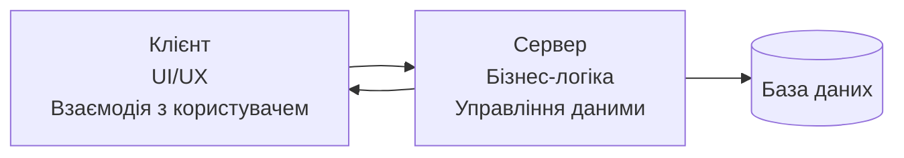
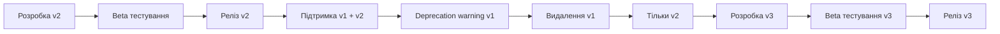

# Лекція 6. RESTful API дизайн

## Вступ до RESTful архітектури

### Історичні передумови виникнення REST

Наприкінці 1990-х років, коли Всесвітня павутина стрімко розвивалася, розробники зіткнулися з проблемою створення масштабованих та інтероперабельних вебсервісів. Існували різні підходи до створення розподілених систем, такі як CORBA, RPC та SOAP, але всі вони мали суттєві недоліки: складність реалізації, важку підтримку та низьку масштабованість.

У 2000 році Рой Філдінг, один із засновників протоколу HTTP, представив у своїй докторській дисертації концепцію **REST (Representational State Transfer)** — архітектурний стиль для розподілених гіпермедіа систем. REST не є протоколом або стандартом, а набором архітектурних принципів, що забезпечують створення масштабованих, надійних та ефективних вебсервісів.

Філдінг спостерігав, що веб працює надзвичайно успішно завдяки простим та універсальним принципам. Він вирішив виділити ці принципи та формалізувати їх як архітектурний стиль, який може бути застосований для створення вебсервісів.

### Фундаментальні принципи REST архітектури

#### Принцип 1: Client-Server архітектура

REST передбачає чітке розділення відповідальності між клієнтом та сервером. **Клієнт** відповідає за користувацький інтерфейс та взаємодію з користувачем, тоді як **сервер** керує даними, бізнес-логікою та зберіганням. Це розділення дозволяє незалежно розвивати та масштабувати обидві частини системи.



#### Принцип 2: Stateless (без збереження стану)

Кожен HTTP запит до сервера повинен містити всю інформацію, необхідну для його обробки. Сервер не зберігає контекст між запитами від клієнта. Це означає, що сервер не пам'ятає попередні взаємодії з клієнтом, що суттєво спрощує архітектуру та покращує масштабованість.

**Переваги stateless підходу:**
- Підвищена надійність через відсутність проблем з синхронізацією стану
- Легше масштабування за допомогою load balancers
- Спрощена відновлення після збоїв
- Можливість кешування запитів

#### Принцип 3: Кешування

Відповіді сервера повинні бути явно позначені як кешовані або некешовані. Кешування дозволяє клієнтам повторно використовувати отримані дані, що значно покращує продуктивність та зменшує навантаження на сервер.

#### Принцип 4: Уніфікований інтерфейс

REST визначає уніфікований інтерфейс між клієнтами та серверами, що спрощує архітектуру системи та покращує видимість взаємодій. Цей принцип включає чотири основні обмеження:

**Ідентифікація ресурсів:** кожен ресурс має унікальний ідентифікатор (URI).

**Маніпулювання ресурсами через представлення:** клієнти взаємодіють з ресурсами через їх представлення (JSON, XML тощо).

**Самоописові повідомлення:** кожне повідомлення містить достатньо інформації для розуміння того, як його обробляти.

**Гіпермедіа як двигун стану програми (HATEOAS):** клієнти відкривають доступні дії через гіперпосилання в отриманих відповідях.

#### Принцип 5: Багаторівнева система

REST дозволяє використання проміжних компонентів (проксі, шлюзи, load balancers) між клієнтом та сервером без впливу на функціональність. Це забезпечує додаткову гнучкість та можливості для оптимізації.

#### Принцип 6: Код за запитом (опціонально)

Сервер може розширювати функціональність клієнта шляхом надсилання виконуваного коду (наприклад, JavaScript). Цей принцип є опціональним і використовується рідко.

### Концепція ресурсів у REST

У REST все є **ресурсом** — будь-яка інформація, яка може бути іменована, може бути ресурсом. Ресурс це абстракція ключової інформації. Важливо розуміти, що ресурс не є файлом, базою даних або навіть об'єктом — це концептуальна цілісність, яка може мати різні представлення.

**Приклади ресурсів:**
- Користувач системи
- Список товарів
- Замовлення
- Звіт за період
- Поточна погода
- Конфігурація системи

**Ідентифікація ресурсів відбувається через URI (Uniform Resource Identifier):**

```
https://api.example.com/users/123
https://api.example.com/orders
https://api.example.com/products/456/reviews
```

### Представлення ресурсів

Ресурс може мати кілька представлень — різних форматів, у яких клієнт може отримати або надіслати дані. Найпопулярнішими форматами є JSON та XML, хоча можуть використовуватися й інші формати, такі як HTML, CSV або навіть бінарні формати.

```javascript
// JSON представлення користувача
{
    "id": 123,
    "name": "Іван Петренко",
    "email": "ivan@example.com",
    "created_at": "2024-01-15T10:30:00Z",
    "status": "active"
}

// XML представлення того ж користувача
<user>
    <id>123</id>
    <name>Іван Петренко</name>
    <email>ivan@example.com</email>
    <created_at>2024-01-15T10:30:00Z</created_at>
    <status>active</status>
</user>
```

## HTTP методи та їх семантика

### GET: Отримання даних

**GET** є найбільш часто використовуваним HTTP методом і призначений для отримання представлення ресурсу. GET запити повинні бути **безпечними** (не змінювати стан сервера) та **ідемпотентними** (множинні виклики дають той самий результат).

```javascript
// Отримання списку користувачів
GET /api/users
Response: 200 OK
[
    {"id": 1, "name": "Іван", "email": "ivan@example.com"},
    {"id": 2, "name": "Марія", "email": "maria@example.com"}
]

// Отримання конкретного користувача
GET /api/users/1
Response: 200 OK
{"id": 1, "name": "Іван", "email": "ivan@example.com", "created_at": "2024-01-01"}

// Отримання користувачів з фільтрацією
GET /api/users?status=active&limit=10&offset=20
```

**Особливості GET запитів:**
- Параметри передаються через query string
- Можуть бути кешовані браузером та проміжними серверами
- Мають обмеження на довжину URL
- Не повинні мати тіло запиту

### POST: Створення нових ресурсів

**POST** використовується для створення нових ресурсів або виконання операцій, які змінюють стан сервера. POST запити не є ідемпотентними — множинні виклики можуть створити кілька ресурсів.

```javascript
// Створення нового користувача
POST /api/users
Content-Type: application/json

{
    "name": "Олександр Коваленко",
    "email": "oleksandr@example.com",
    "password": "securePassword123"
}

Response: 201 Created
Location: /api/users/123
{
    "id": 123,
    "name": "Олександр Коваленко",
    "email": "oleksandr@example.com",
    "created_at": "2024-01-15T14:30:00Z"
}
```

**Особливості POST запитів:**
- Дані передаються в тілі запиту
- Не є ідемпотентними
- Можуть використовуватися для складних операцій
- Відповідь зазвичай містить створений ресурс та статус 201

### PUT: Повне оновлення ресурсу

**PUT** призначений для повного заміщення ресурсу новими даними. PUT запити є ідемпотентними — множинні виклики з тими самими даними дають той самий результат.

```javascript
// Повне оновлення користувача
PUT /api/users/123
Content-Type: application/json

{
    "name": "Олександр Коваленко",
    "email": "new.email@example.com",
    "status": "active",
    "phone": "+380501234567"
}

Response: 200 OK
{
    "id": 123,
    "name": "Олександр Коваленко",
    "email": "new.email@example.com",
    "status": "active",
    "phone": "+380501234567",
    "updated_at": "2024-01-15T15:45:00Z"
}
```

**Важливо:** PUT заміщує ресурс повністю. Якщо деякі поля не передані, вони повинні бути встановлені в значення за замовчуванням або видалені.

### PATCH: Часткове оновлення ресурсу

**PATCH** використовується для часткового оновлення ресурсу, коли потрібно змінити лише деякі поля без впливу на інші.

```javascript
// Часткове оновлення користувача
PATCH /api/users/123
Content-Type: application/json

{
    "email": "updated.email@example.com",
    "status": "inactive"
}

Response: 200 OK
{
    "id": 123,
    "name": "Олександр Коваленко", // залишається незмінним
    "email": "updated.email@example.com", // оновлено
    "status": "inactive", // оновлено
    "phone": "+380501234567", // залишається незмінним
    "updated_at": "2024-01-15T16:00:00Z"
}
```

### DELETE: Видалення ресурсу

**DELETE** призначений для видалення ресурсу. DELETE запити є ідемпотентними — множинне видалення того самого ресурсу має такий самий ефект, як і одноразове.

```javascript
// Видалення користувача
DELETE /api/users/123

Response: 204 No Content
// Або
Response: 200 OK
{
    "message": "Користувача успішно видалено",
    "deleted_at": "2024-01-15T16:15:00Z"
}
```

**Варіанти поведінки DELETE:**
- **Жорстке видалення:** ресурс повністю видаляється з бази даних
- **М'яке видалення:** ресурс позначається як видалений, але залишається в базі
- **Архівування:** ресурс переміщується до архіву

### Додаткові HTTP методи

**HEAD** — аналогічний до GET, але повертає лише заголовки без тіла відповіді. Корисний для перевірки існування ресурсу або отримання метаданих.

**OPTIONS** — повертає інформацію про підтримувані методи для ресурсу. Часто використовується в CORS preflight запитах.

```javascript
OPTIONS /api/users/123
Response: 200 OK
Allow: GET, PUT, PATCH, DELETE
Access-Control-Allow-Methods: GET, PUT, PATCH, DELETE
```

## HTTP статус коди та їх значення

### Класифікація статус кодів

HTTP статус коди діляться на п'ять класів, кожен з яких має певне семантичне значення:

- **1xx (Інформаційні):** запит отримано, процес триває
- **2xx (Успішні):** запит успішно отримано, зрозуміно та прийнято
- **3xx (Перенаправлення):** потрібні додаткові дії для завершення запиту
- **4xx (Помилки клієнта):** запит містить помилку або не може бути виконано
- **5xx (Помилки сервера):** сервер не зміг виконати валідний запит

### Ключові статус коди для REST API

#### Успішні відповіді (2xx)

**200 OK** — стандартна відповідь для успішних HTTP запитів. Семантика залежить від методу:
- GET: ресурс отримано та передано в тілі відповіді
- POST: результат дії передано в тілі відповіді
- PUT/PATCH: ресурс оновлено успішно

**201 Created** — запит виконано успішно та створено новий ресурс. Зазвичай використовується з POST запитами. Відповідь повинна містити заголовок Location з URI створеного ресурсу.

**202 Accepted** — запит прийнято для обробки, але обробка не завершена. Використовується для асинхронних операцій.

**204 No Content** — запит виконано успішно, але відповідь не містить тіла. Часто використовується для DELETE операцій або успішних PUT запитів.

#### Помилки клієнта (4xx)

**400 Bad Request** — сервер не може або не буде обробляти запит через помилку клієнта (наприклад, невірний синтаксис запиту, некоректні дані).

```javascript
Response: 400 Bad Request
{
    "error": "Validation Error",
    "message": "Невірний формат email адреси",
    "details": {
        "field": "email",
        "value": "invalid-email",
        "constraint": "must be a valid email address"
    }
}
```

**401 Unauthorized** — запит вимагає аутентифікації користувача. Клієнт повинен надати валідні облікові дані.

**403 Forbidden** — сервер зрозумів запит, але відмовляється його виконувати. На відміну від 401, аутентифікація не допоможе.

**404 Not Found** — запитуваний ресурс не знайдено на сервері.

**405 Method Not Allowed** — метод запиту відомий серверу, але не підтримується цільовим ресурсом.

**409 Conflict** — запит не може бути виконано через конфлікт з поточним станом ресурсу.

```javascript
Response: 409 Conflict
{
    "error": "Resource Conflict",
    "message": "Користувач з таким email вже існує",
    "conflicting_field": "email",
    "existing_resource": "/api/users/456"
}
```

**422 Unprocessable Entity** — запит синтаксично правильний, але містить семантичні помилки.

**429 Too Many Requests** — клієнт надіслав занадто багато запитів за певний період (rate limiting).

#### Помилки сервера (5xx)

**500 Internal Server Error** — загальна помилка сервера, коли виникла неочікувана умова.

**502 Bad Gateway** — сервер, діючи як шлюз або проксі, отримав невірну відповідь від вишестоящого сервера.

**503 Service Unavailable** — сервер тимчасово не може обробити запит через перевантаження або технічне обслуговування.

### Принципи вибору статус кодів

При виборі статус коду керуйтеся наступними принципами:

1. **Точність:** використовуйте найбільш точний код для ситуації
2. **Консистентність:** дотримуйтеся однакового підходу в межах API
3. **Семантичність:** код повинен відображати реальну семантику операції
4. **Документованість:** всі використовувані коди повинні бути задокументовані

## Структурування API endpoints

### Принципи проектування URL структури

**Ресурсо-орієнтований підхід** є основою REST архітектури. URL повинні представляти ресурси, а не дії. Використовуйте іменники для опису ресурсів та HTTP методи для опису дій над ними.

```javascript
// ПРАВИЛЬНО: ресурсо-орієнтований підхід
GET    /api/users              // Отримати всіх користувачів
POST   /api/users              // Створити користувача
GET    /api/users/123          // Отримати користувача з ID 123
PUT    /api/users/123          // Оновити користувача з ID 123
DELETE /api/users/123          // Видалити користувача з ID 123

// НЕПРАВИЛЬНО: дія-орієнтований підхід
GET    /api/getUsers
POST   /api/createUser
GET    /api/getUserById?id=123
POST   /api/updateUser
POST   /api/deleteUser
```

### Конвенції іменування

**Використання множини для колекцій:** використовуйте множину для представлення колекцій ресурсів.

```javascript
GET /api/users        // Колекція користувачів
GET /api/products     // Колекція товарів
GET /api/orders       // Колекція замовлень
```

**Регістр URL:** використовуйте kebab-case (слова через дефіс) для складних назв ресурсів.

```javascript
GET /api/user-profiles
GET /api/product-categories
GET /api/shipping-addresses
```

**Версіонування:** включайте версію API в URL для забезпечення зворотної сумісності.

```javascript
GET /api/v1/users
GET /api/v2/users
```

### Ієрархічна структура ресурсів

Для представлення зв'язків між ресурсами використовуйте ієрархічну структуру URL, що відображає природні зв'язки між даними.

```javascript
// Користувачі та їх пости
GET    /api/users/123/posts              // Всі пости користувача 123
POST   /api/users/123/posts              // Створити новий пост для користувача 123
GET    /api/users/123/posts/456          // Конкретний пост користувача
PUT    /api/users/123/posts/456          // Оновити пост
DELETE /api/users/123/posts/456          // Видалити пост

// Пости та їх коментарі
GET    /api/posts/456/comments           // Всі коментарі до поста 456
POST   /api/posts/456/comments           // Додати коментар до поста
GET    /api/posts/456/comments/789       // Конкретний коментар
```

**Обмеження глибини:** уникайте надмірно глибокої вкладеності URL. Зазвичай рекомендується не більше 2-3 рівнів.

```javascript
// ДОПУСТИМО
GET /api/users/123/posts/456/comments

// НАДМІРНО СКЛАДНО
GET /api/companies/123/departments/456/employees/789/projects/101/tasks/202/comments/303
```

### Фільтрація, сортування та пагінація

**Фільтрація через query параметри:**

```javascript
GET /api/products?category=electronics&price_min=100&price_max=500
GET /api/users?status=active&created_after=2024-01-01
GET /api/orders?status=pending&customer_id=123
```

**Сортування:**

```javascript
GET /api/products?sort=price              // Сортування за ціною (зростання)
GET /api/products?sort=-price             // Сортування за ціною (спадання)
GET /api/products?sort=name,price         // Множинне сортування
GET /api/users?sort=-created_at,name      // За датою створення (спадання), потім за ім'ям
```

**Пагінація:**

```javascript
// Offset-based пагінація
GET /api/users?limit=20&offset=40         // 20 користувачів, починаючи з 41-го

// Cursor-based пагінація (для великих наборів даних)
GET /api/users?limit=20&cursor=eyJpZCI6MTIzfQ==

// Page-based пагінація
GET /api/users?page=3&per_page=20         // Сторінка 3, по 20 елементів
```

### Пошук та складні запити

**Простий пошук:**

```javascript
GET /api/products?search=laptop
GET /api/users?q=іван
```

**Розширений пошук:**

```javascript
GET /api/products?name_contains=MacBook&description_contains=processor
GET /api/users?name_starts_with=Іва&email_ends_with=@gmail.com
```

**Складні логічні операції:**

```javascript
// Використання спеціального endpoint для складних запитів
POST /api/users/search
{
    "filters": {
        "and": [
            {"field": "age", "operator": "gte", "value": 18},
            {"field": "age", "operator": "lt", "value": 65},
            {
                "or": [
                    {"field": "city", "operator": "eq", "value": "Київ"},
                    {"field": "city", "operator": "eq", "value": "Львів"}
                ]
            }
        ]
    },
    "sort": [{"field": "created_at", "direction": "desc"}],
    "limit": 50
}
```

## Валідація даних та обробка помилок

### Рівні валідації

**Валідація на рівні схеми:** перевірка базових типів даних, обов'язковості полів та формату.

```javascript
const userSchema = {
    name: {
        type: 'string',
        required: true,
        minLength: 2,
        maxLength: 50,
        pattern: /^[a-zA-ZА-Яа-яїЇєЄ\s]+$/
    },
    email: {
        type: 'string',
        required: true,
        format: 'email'
    },
    age: {
        type: 'integer',
        minimum: 18,
        maximum: 120
    },
    password: {
        type: 'string',
        required: true,
        minLength: 8,
        pattern: /^(?=.*[a-z])(?=.*[A-Z])(?=.*\d)(?=.*[@$!%*?&])[A-Za-z\d@$!%*?&]/
    }
};
```

**Бізнес-логіка валідація:** перевірка правил, специфічних для предметної області.

```javascript
async function validateUserBusinessRules(userData) {
    const errors = [];

    // Перевірка унікальності email
    const existingUser = await User.findByEmail(userData.email);
    if (existingUser) {
        errors.push({
            field: 'email',
            message: 'Користувач з таким email вже існує',
            code: 'EMAIL_ALREADY_EXISTS'
        });
    }

    // Перевірка мінімального віку для реєстрації
    if (userData.age < 16) {
        errors.push({
            field: 'age',
            message: 'Мінімальний вік для реєстрації 16 років',
            code: 'AGE_BELOW_MINIMUM'
        });
    }

    return errors;
}
```

### Структура повідомлень про помилки

**Стандартизована структура помилок** забезпечує послідовність та зручність обробки на стороні клієнта.

```javascript
// Базова структура помилки
{
    "error": {
        "type": "ValidationError",
        "message": "Дані не пройшли валідацію",
        "code": "VALIDATION_FAILED",
        "timestamp": "2024-01-15T16:30:00Z",
        "request_id": "req_123456789",
        "details": [
            {
                "field": "email",
                "message": "Невірний формат email адреси",
                "code": "INVALID_EMAIL_FORMAT",
                "value": "invalid-email"
            },
            {
                "field": "age",
                "message": "Вік повинен бути між 18 та 120 роками",
                "code": "AGE_OUT_OF_RANGE",
                "value": 15
            }
        ]
    }
}
```

**Локалізація помилок:**

```javascript
{
    "error": {
        "type": "ValidationError",
        "message": "Validation failed",
        "code": "VALIDATION_FAILED",
        "localized_message": "Дані не пройшли валідацію",
        "details": [
            {
                "field": "email",
                "message": "Invalid email format",
                "localized_message": "Невірний формат email адреси",
                "code": "INVALID_EMAIL_FORMAT"
            }
        ]
    }
}
```

### Обробка різних типів помилок

**Помилки валідації (400 Bad Request):**

```javascript
app.post('/api/users', async (req, res) => {
    try {
        const validationErrors = await validateUser(req.body);
        if (validationErrors.length > 0) {
            return res.status(400).json({
                error: {
                    type: 'ValidationError',
                    message: 'Дані не пройшли валідацію',
                    code: 'VALIDATION_FAILED',
                    details: validationErrors
                }
            });
        }

        const user = await User.create(req.body);
        res.status(201).json(user);
    } catch (error) {
        handleServerError(error, res);
    }
});
```

**Помилки не знайденого ресурсу (404 Not Found):**

```javascript
app.get('/api/users/:id', async (req, res) => {
    try {
        const user = await User.findById(req.params.id);
        if (!user) {
            return res.status(404).json({
                error: {
                    type: 'NotFoundError',
                    message: 'Користувача не знайдено',
                    code: 'USER_NOT_FOUND',
                    resource: 'User',
                    resource_id: req.params.id
                }
            });
        }

        res.json(user);
    } catch (error) {
        handleServerError(error, res);
    }
});
```

**Помилки авторизації (401/403):**

```javascript
function checkAuthentication(req, res, next) {
    const token = req.headers.authorization?.replace('Bearer ', '');

    if (!token) {
        return res.status(401).json({
            error: {
                type: 'AuthenticationError',
                message: 'Необхідна аутентифікація',
                code: 'AUTHENTICATION_REQUIRED'
            }
        });
    }

    try {
        const decoded = jwt.verify(token, process.env.JWT_SECRET);
        req.user = decoded;
        next();
    } catch (error) {
        return res.status(401).json({
            error: {
                type: 'AuthenticationError',
                message: 'Невірний токен аутентифікації',
                code: 'INVALID_TOKEN'
            }
        });
    }
}
```

### Глобальна обробка помилок

```javascript
// Middleware для глобальної обробки помилок
function globalErrorHandler(error, req, res, next) {
    // Логування помилки
    console.error(`Error ${error.name}: ${error.message}`, {
        stack: error.stack,
        url: req.url,
        method: req.method,
        ip: req.ip,
        userAgent: req.get('User-Agent'),
        timestamp: new Date().toISOString()
    });

    // Визначення типу помилки та відповідного статус коду
    let statusCode = 500;
    let errorResponse = {
        error: {
            type: 'InternalServerError',
            message: 'Внутрішня помилка сервера',
            code: 'INTERNAL_SERVER_ERROR',
            timestamp: new Date().toISOString(),
            request_id: req.id || generateRequestId()
        }
    };

    // Спеціалізована обробка для різних типів помилок
    if (error.name === 'ValidationError') {
        statusCode = 400;
        errorResponse.error = {
            type: 'ValidationError',
            message: 'Помилка валідації даних',
            code: 'VALIDATION_ERROR',
            details: error.details || []
        };
    } else if (error.name === 'CastError') {
        statusCode = 400;
        errorResponse.error = {
            type: 'InvalidInputError',
            message: 'Невірний формат ідентифікатора',
            code: 'INVALID_ID_FORMAT'
        };
    } else if (error.code === 11000) { // MongoDB duplicate key error
        statusCode = 409;
        errorResponse.error = {
            type: 'ConflictError',
            message: 'Ресурс з такими даними вже існує',
            code: 'DUPLICATE_RESOURCE'
        };
    }

    // У production режимі приховуємо деталі внутрішніх помилок
    if (process.env.NODE_ENV === 'production' && statusCode === 500) {
        delete errorResponse.error.details;
        errorResponse.error.message = 'Внутрішня помилка сервера';
    }

    res.status(statusCode).json(errorResponse);
}

// Використання глобального обробника помилок
app.use(globalErrorHandler);
```

## API документація (Swagger/OpenAPI)

### Важливість документації API

**API документація** є критично важливою для успішного використання вашого API. Якісна документація має бути:

- **Повною:** описувати всі доступні endpoints, параметри та відповіді
- **Актуальною:** автоматично оновлюватися при змінах в API
- **Інтерактивною:** дозволяти тестувати API безпосередньо з документації
- **Зрозумілою:** містити приклади використання та пояснення

### OpenAPI Specification (OAS)

**OpenAPI Specification** (раніше відома як Swagger Specification) є стандартом для опису REST API. Вона дозволяє описати API у форматі JSON або YAML, що може бути використано для автоматичної генерації документації, клієнтських SDK та тестів.

### Структура OpenAPI документа

```yaml
openapi: 3.0.3
info:
  title: Task Management API
  description: API для управління завданнями та проєктами
  version: 1.0.0
  contact:
    name: API Support
    email: api-support@example.com
    url: https://example.com/support
  license:
    name: MIT
    url: https://opensource.org/licenses/MIT

servers:
  - url: https://api.example.com/v1
    description: Production server
  - url: https://staging-api.example.com/v1
    description: Staging server
  - url: http://localhost:3000/api/v1
    description: Development server

paths:
  /users:
    get:
      summary: Отримати список користувачів
      description: Повертає пагінований список користувачів з можливістю фільтрації
      tags:
        - Users
      parameters:
        - name: limit
          in: query
          description: Кількість користувачів на сторінці
          required: false
          schema:
            type: integer
            minimum: 1
            maximum: 100
            default: 20
        - name: offset
          in: query
          description: Зміщення від початку списку
          required: false
          schema:
            type: integer
            minimum: 0
            default: 0
        - name: status
          in: query
          description: Фільтр за статусом користувача
          required: false
          schema:
            type: string
            enum: [active, inactive, pending]
      responses:
        '200':
          description: Список користувачів отримано успішно
          content:
            application/json:
              schema:
                type: object
                properties:
                  data:
                    type: array
                    items:
                      $ref: '#/components/schemas/User'
                  pagination:
                    $ref: '#/components/schemas/Pagination'
              examples:
                success_response:
                  summary: Успішна відповідь
                  value:
                    data:
                      - id: 1
                        name: "Іван Петренко"
                        email: "ivan@example.com"
                        status: "active"
                        created_at: "2024-01-15T10:30:00Z"
                    pagination:
                      total: 150
                      limit: 20
                      offset: 0
                      has_next: true
        '400':
          $ref: '#/components/responses/BadRequest'
        '401':
          $ref: '#/components/responses/Unauthorized'
        '500':
          $ref: '#/components/responses/InternalServerError'

    post:
      summary: Створити нового користувача
      description: Створює нового користувача в системі
      tags:
        - Users
      security:
        - bearerAuth: []
      requestBody:
        required: true
        content:
          application/json:
            schema:
              $ref: '#/components/schemas/CreateUserRequest'
            examples:
              create_user:
                summary: Приклад створення користувача
                value:
                  name: "Марія Коваленко"
                  email: "maria@example.com"
                  password: "securePassword123"
                  role: "user"
      responses:
        '201':
          description: Користувача створено успішно
          content:
            application/json:
              schema:
                $ref: '#/components/schemas/User'
        '400':
          $ref: '#/components/responses/BadRequest'
        '409':
          $ref: '#/components/responses/Conflict'

components:
  schemas:
    User:
      type: object
      required:
        - id
        - name
        - email
        - status
        - created_at
      properties:
        id:
          type: integer
          format: int64
          description: Унікальний ідентифікатор користувача
          example: 123
        name:
          type: string
          description: Повне ім'я користувача
          minLength: 2
          maxLength: 100
          example: "Іван Петренко"
        email:
          type: string
          format: email
          description: Email адреса користувача
          example: "ivan@example.com"
        status:
          type: string
          enum: [active, inactive, pending]
          description: Статус користувача
          example: "active"
        created_at:
          type: string
          format: date-time
          description: Дата та час створення
          example: "2024-01-15T10:30:00Z"
        updated_at:
          type: string
          format: date-time
          description: Дата та час останнього оновлення
          example: "2024-01-15T10:30:00Z"

    CreateUserRequest:
      type: object
      required:
        - name
        - email
        - password
      properties:
        name:
          type: string
          minLength: 2
          maxLength: 100
          example: "Марія Коваленко"
        email:
          type: string
          format: email
          example: "maria@example.com"
        password:
          type: string
          minLength: 8
          format: password
          description: "Пароль має містити мінімум 8 символів"
          example: "securePassword123"
        role:
          type: string
          enum: [user, admin, manager]
          default: user
          example: "user"

    Pagination:
      type: object
      properties:
        total:
          type: integer
          description: Загальна кількість елементів
          example: 150
        limit:
          type: integer
          description: Кількість елементів на сторінці
          example: 20
        offset:
          type: integer
          description: Зміщення від початку
          example: 0
        has_next:
          type: boolean
          description: Чи є наступна сторінка
          example: true
        has_prev:
          type: boolean
          description: Чи є попередня сторінка
          example: false

    Error:
      type: object
      required:
        - type
        - message
        - code
      properties:
        type:
          type: string
          description: Тип помилки
          example: "ValidationError"
        message:
          type: string
          description: Опис помилки
          example: "Дані не пройшли валідацію"
        code:
          type: string
          description: Код помилки для програмної обробки
          example: "VALIDATION_FAILED"
        details:
          type: array
          description: Деталі помилки
          items:
            type: object
            properties:
              field:
                type: string
                example: "email"
              message:
                type: string
                example: "Невірний формат email"
              code:
                type: string
                example: "INVALID_EMAIL"

  responses:
    BadRequest:
      description: Невірний запит
      content:
        application/json:
          schema:
            type: object
            properties:
              error:
                $ref: '#/components/schemas/Error'

    Unauthorized:
      description: Не авторизований доступ
      content:
        application/json:
          schema:
            type: object
            properties:
              error:
                $ref: '#/components/schemas/Error'
          example:
            error:
              type: "AuthenticationError"
              message: "Необхідна аутентифікація"
              code: "AUTHENTICATION_REQUIRED"

    Conflict:
      description: Конфлікт ресурсів
      content:
        application/json:
          schema:
            type: object
            properties:
              error:
                $ref: '#/components/schemas/Error'

    InternalServerError:
      description: Внутрішня помилка сервера
      content:
        application/json:
          schema:
            type: object
            properties:
              error:
                $ref: '#/components/schemas/Error'

  securitySchemes:
    bearerAuth:
      type: http
      scheme: bearer
      bearerFormat: JWT
      description: JWT токен для авторизації

security:
  - bearerAuth: []

tags:
  - name: Users
    description: Операції з користувачами
  - name: Projects
    description: Управління проєктами
  - name: Tasks
    description: Управління завданнями
```

### Автоматична генерація документації

**Swagger UI з Express.js:**

```javascript
const express = require('express');
const swaggerUi = require('swagger-ui-express');
const swaggerJsdoc = require('swagger-jsdoc');

const app = express();

// Конфігурація Swagger
const swaggerOptions = {
    definition: {
        openapi: '3.0.3',
        info: {
            title: 'Task Management API',
            version: '1.0.0',
            description: 'API для управління завданнями та проєктами'
        },
        servers: [
            {
                url: 'http://localhost:3000/api/v1',
                description: 'Development server'
            }
        ]
    },
    apis: ['./routes/*.js', './models/*.js'] // Шляхи до файлів з коментарями
};

const swaggerSpec = swaggerJsdoc(swaggerOptions);

// Підключення Swagger UI
app.use('/api-docs', swaggerUi.serve, swaggerUi.setup(swaggerSpec));

// Endpoint для отримання OpenAPI специфікації
app.get('/api-docs.json', (req, res) => {
    res.setHeader('Content-Type', 'application/json');
    res.send(swaggerSpec);
});
```

**Документування endpoints через коментарі:**

```javascript
/**
 * @swagger
 * /api/v1/users:
 *   get:
 *     summary: Отримати список користувачів
 *     tags: [Users]
 *     parameters:
 *       - in: query
 *         name: limit
 *         schema:
 *           type: integer
 *           minimum: 1
 *           maximum: 100
 *           default: 20
 *         description: Кількість користувачів на сторінці
 *       - in: query
 *         name: status
 *         schema:
 *           type: string
 *           enum: [active, inactive, pending]
 *         description: Фільтр за статусом
 *     responses:
 *       200:
 *         description: Список користувачів
 *         content:
 *           application/json:
 *             schema:
 *               type: object
 *               properties:
 *                 data:
 *                   type: array
 *                   items:
 *                     $ref: '#/components/schemas/User'
 *                 pagination:
 *                   $ref: '#/components/schemas/Pagination'
 */
app.get('/api/v1/users', async (req, res) => {
    // Реалізація endpoint
});
```

## Версіонування API

### Необхідність версіонування

**Версіонування API** дозволяє вносити зміни в API без порушення існуючих клієнтів. Це критично важливо для підтримки зворотної сумісності та поступового міграції клієнтів на нові версії.

### Стратегії версіонування

#### URL Versioning

**Переваги:** простота реалізації, очевидність версії, легкість тестування.
**Недоліки:** забруднення URL простору, складність підтримки багатьох версій.

```javascript
// Версіонування через URL path
GET /api/v1/users
GET /api/v2/users
GET /api/v3/users

// Альтернативний підхід з більш детальним версіонуванням
GET /api/2024-01-15/users  // Версіонування за датою
```

#### Header Versioning

**Переваги:** чистіші URL, гнучкість у версіонуванні.
**Недоліки:** менша видимість версії, складність кешування.

```javascript
// Версіонування через кастомний заголовок
GET /api/users
Headers: {
    "API-Version": "v2",
    "Accept": "application/json"
}

// Версіонування через Accept заголовок
GET /api/users
Headers: {
    "Accept": "application/vnd.api+json;version=2"
}
```

#### Query Parameter Versioning

```javascript
// Версіонування через query параметр
GET /api/users?version=v2
GET /api/users?api_version=2024-01-15
```

### Реалізація версіонування в Express.js

```javascript
const express = require('express');
const app = express();

// Middleware для визначення версії API
function versionMiddleware(req, res, next) {
    // Спробувати отримати версію з різних джерел
    let version = req.params.version ||           // URL: /api/:version/users
                  req.headers['api-version'] ||   // Header: API-Version
                  req.query.version ||            // Query: ?version=v2
                  'v1';                          // За замовчуванням

    // Нормалізація версії
    version = version.toLowerCase().replace(/^v/, '');

    // Валідація версії
    const supportedVersions = ['1', '2', '3'];
    if (!supportedVersions.includes(version)) {
        return res.status(400).json({
            error: {
                type: 'UnsupportedVersionError',
                message: `Версія API '${version}' не підтримується`,
                supported_versions: supportedVersions,
                code: 'UNSUPPORTED_API_VERSION'
            }
        });
    }

    req.apiVersion = version;
    next();
}

// Використання middleware
app.use('/api/:version?/*', versionMiddleware);

// Версіоновані маршрути
app.get('/api/:version?/users', (req, res) => {
    switch (req.apiVersion) {
        case '1':
            return getUsersV1(req, res);
        case '2':
            return getUsersV2(req, res);
        case '3':
            return getUsersV3(req, res);
        default:
            return res.status(400).json({
                error: {
                    message: 'Непідтримувана версія API',
                    code: 'UNSUPPORTED_VERSION'
                }
            });
    }
});

// Реалізації різних версій
async function getUsersV1(req, res) {
    const users = await User.find({}, 'id name email'); // Базові поля
    res.json(users);
}

async function getUsersV2(req, res) {
    const users = await User.find({}, 'id name email status created_at'); // Додані поля
    res.json({
        data: users,
        version: 'v2'
    });
}

async function getUsersV3(req, res) {
    const { limit = 20, offset = 0 } = req.query;
    const users = await User.find({})
        .select('id name email status created_at updated_at profile')
        .limit(parseInt(limit))
        .skip(parseInt(offset));

    const total = await User.countDocuments();

    res.json({
        data: users,
        pagination: {
            total,
            limit: parseInt(limit),
            offset: parseInt(offset),
            has_next: offset + limit < total,
            has_prev: offset > 0
        },
        version: 'v3'
    });
}
```

### Міграційна стратегія

**Повідомлення про застарілі версії:**

```javascript
function deprecationWarningMiddleware(req, res, next) {
    if (req.apiVersion === '1') {
        res.set({
            'X-API-Deprecation-Warning': 'API v1 буде видалено 2024-06-01',
            'X-API-Sunset-Date': '2024-06-01',
            'X-API-Migration-Guide': 'https://docs.example.com/migration/v1-to-v2'
        });
    }
    next();
}

app.use(deprecationWarningMiddleware);
```

### Управління життєвим циклом версій



## Висновки та найкращі практики

### Ключові принципи успішного REST API

**Консистентність** є основою хорошого API дизайну. Використовуйте однакові конвенції іменування, структури відповідей та обробки помилок у всьому API. Це зменшує когнітивне навантаження на розробників та покращує developer experience.

**Передбачуваність** означає, що поведінка API повинна відповідати очікуванням розробників. Якщо GET /users повертає список користувачів, то GET /products повинен повертати список продуктів у схожому форматі.

**Простота** не означає обмеженість функціональності. REST API повинен бути простим у використанні для базових операцій, але достатньо гнучким для складних сценаріїв.

### Практичні рекомендації для розробки

**Проектуйте API з перспективи клієнта.** Починайте з того, як клієнт буде використовувати API, а не з того, як організовані дані в базі даних. Це допоможе створити більш інтуїтивний та зручний API.

**Використовуйте правильні HTTP методи та статус коди.** Не змушуйте розробників гадати, що означає відповідь. 404 означає "не знайдено", а не "помилка в даних".

**Забезпечте якісну документацію та приклади.** Навіть найкращий API буде марним без хорошої документації. Включайте приклади запитів та відповідей для кожного endpoint.

**Плануйте еволюцію API з самого початку.** Розгляньте стратегію версіонування, міграції та підтримки зворотної сумісності ще на етапі проектування.

### Забезпечення якості API

**Тестування API** має включати функціональні тести, тести продуктивності та тести безпеки. Автоматизуйте тестування та включайте його в CI/CD pipeline.

**Моніторинг та аналітика** допомагають розуміти, як використовується API, які endpoint найпопулярніші, та де виникають проблеми.

**Зворотний зв'язок від розробників** є неоціненним для покращення API. Створюйте канали для отримання відгуків та активно працюйте з розробниками, які використовують ваш API.

REST API дизайн — це мистецтво балансу між простотою та функціональністю, між гнучкістю та передбачуваністю. Дотримання принципів REST та найкращих практик допоможе створити API, який буде радувати розробників та забезпечувати надійну основу для ваших додатків на роки вперед.
