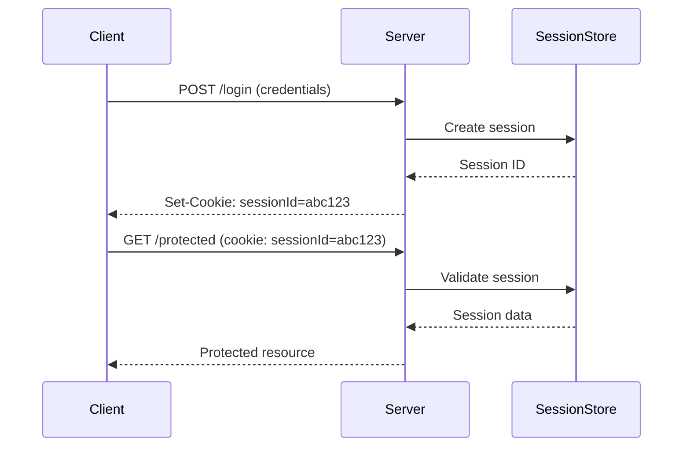
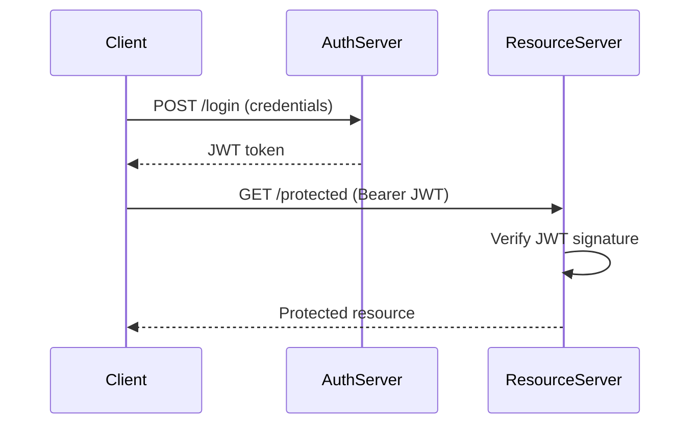

# Лекція 7. Аутентифікація та безпека

## Вступ до безпеки вебдодатків

Безпека вебдодатків є одним з найкритичніших аспектів сучасної розробки. У світі, де кіберзагрози зростають експоненціально, розуміння принципів безпеки та правильна реалізація механізмів захисту стають обов'язковими навичками для кожного веброзробника.

Статистика кіберзлочинності показує тривожні тенденції: щороку реєструється мільйони атак на вебдодатки, а середні втрати від однієї успішної атаки становлять сотні тисяч доларів. Більшість цих атак можна було б запобігти за допомогою правильної реалізації базових принципів безпеки.

Безпека вебдодатків охоплює багато аспектів: від захисту даних користувачів до забезпечення цілісності системи. Основні принципи включають конфіденційність, цілісність та доступність інформації. Конфіденційність забезпечує, що дані доступні тільки авторизованим користувачам. Цілісність гарантує, що дані не були змінені несанкціоновано. Доступність означає, що система залишається функціональною для легітимних користувачів.

## Аутентифікація vs авторизація: фундаментальні концепції

Перш ніж переходити до конкретних технологій, важливо чітко розуміти різницю між аутентифікацією та авторизацією, оскільки ці поняття часто плутають.

**Аутентифікація** – це процес підтвердження особи користувача. Вона відповідає на питання "Хто ви?". Під час аутентифікації система перевіряє, чи дійсно користувач є тим, за кого себе видає. Це може відбуватися через різні механізми: пароль, біометрія, токени, сертифікати.

**Авторизація** – це процес визначення того, що користувач має право робити в системі. Вона відповідає на питання "Що ви можете робити?". Авторизація відбувається після успішної аутентифікації і визначає, до яких ресурсів користувач має доступ та які дії може виконувати.

Наприклад, коли ви входите в банківську систему, спочатку відбувається аутентифікація через логін та пароль. Після цього система авторизує вас для доступу до ваших рахунків, але не до рахунків інших клієнтів.

## Сесії vs токени: порівняльний аналіз

### Сесійна аутентифікація: традиційний підхід

Сесійна аутентифікація базується на збереженні стану користувача на сервері. Коли користувач успішно проходить аутентифікацію, сервер створює сесію – унікальний ідентифікатор, який зберігається в пам'яті сервера або базі даних. Клієнт отримує цей ідентифікатор зазвичай у вигляді cookie.



Переваги сесійної аутентифікації включають простоту реалізації, можливість легкого відкликання доступу, централізований контроль над сесіями та можливість зберігання додаткової інформації про сесію. Сервер має повний контроль над активними сесіями і може миттєво їх припинити.

Недоліки полягають у необхідності зберігання стану на сервері, що ускладнює масштабування. При використанні кількох серверів потрібна синхронізація сесій або sticky sessions. Також існує залежність від cookies, що може створювати проблеми в деяких сценаріях.

### Токенна аутентифікація: сучасний підхід

Токенна аутентифікація, особливо з використанням JSON Web Tokens (JWT), представляє stateless підхід. Замість зберігання стану на сервері, вся необхідна інформація кодується в токені, який підписується сервером.

JWT складається з трьох частин, розділених крапками:
- **Header**: містить тип токена та алгоритм підпису
- **Payload**: містить claims (твердження) про користувача
- **Signature**: забезпечує цілісність токена

```javascript
// Приклад структури JWT
const header = {
    "alg": "HS256",
    "typ": "JWT"
};

const payload = {
    "sub": "1234567890",
    "name": "Іван Петренко",
    "role": "user",
    "iat": 1516239022,
    "exp": 1516325422
};

// Результуючий JWT:
// eyJhbGciOiJIUzI1NiIsInR5cCI6IkpXVCJ9.
// eyJzdWIiOiIxMjM0NTY3ODkwIiwibmFtZSI6IkpvaG4gRG9lIiwiaWF0IjoxNTE2MjM5MDIyfQ.
// SflKxwRJSMeKKF2QT4fwpMeJf36POk6yJV_adQssw5c
```

Переваги JWT включають відсутність стану на сервері, що спрощує масштабування, можливість міжсервісної аутентифікації, незалежність від cookies та можливість включення метаданих безпосередньо в токен.

Недоліки полягають у складності відкликання токенів до закінчення терміну дії, потенційно більшому розміру порівняно з session ID та необхідності ретельного управління секретними ключами.



## Хешування паролів: криптографічна безпека

Зберігання паролів у відкритому вигляді є одним з найгрубіших порушень безпеки. Паролі завжди повинні зберігатися у хешованому вигляді з використанням криптографічно стійких алгоритмів.

### Проблеми простого хешування

Використання простих хеш-функцій як MD5 або SHA-1 для паролів є небезпечним через кілька причин. По-перше, ці алгоритми розроблені для швидкості, що робить їх вразливими до brute-force атак. По-друге, однакові паролі завжди дають однаковий хеш, що дозволяє атакувати їх через rainbow tables.

```javascript
// НЕБЕЗПЕЧНО: простий хеш без солі
const crypto = require('crypto');
const password = "mypassword123";
const hash = crypto.createHash('sha256').update(password).digest('hex');
// Одинаковий пароль завжди дає одинаковий хеш
```

### Bcrypt: золотий стандарт

Bcrypt є adaptive hashing функцією, спеціально розробленою для хешування паролів. Він автоматично включає сіль та дозволяє налаштовувати складність обчислень.

```javascript
const bcrypt = require('bcryptjs');

// Хешування пароля
async function hashPassword(password) {
    const saltRounds = 12; // Кількість раундів солі
    const hashedPassword = await bcrypt.hash(password, saltRounds);
    return hashedPassword;
}

// Перевірка пароля
async function verifyPassword(password, hashedPassword) {
    const isValid = await bcrypt.compare(password, hashedPassword);
    return isValid;
}

// Приклад використання
async function registerUser(email, password) {
    try {
        const hashedPassword = await hashPassword(password);

        // Зберігати в базі даних
        const user = await User.create({
            email,
            password: hashedPassword
        });

        return user;
    } catch (error) {
        throw new Error('Помилка реєстрації користувача');
    }
}

async function loginUser(email, password) {
    try {
        const user = await User.findOne({ where: { email } });
        if (!user) {
            throw new Error('Користувача не знайдено');
        }

        const isValidPassword = await verifyPassword(password, user.password);
        if (!isValidPassword) {
            throw new Error('Невірний пароль');
        }

        return user;
    } catch (error) {
        throw new Error('Помилка аутентифікації');
    }
}
```

Параметр saltRounds визначає складність обчислень. Більше значення означає вищу безпеку, але повільніше виконання. Зазвичай використовуються значення від 10 до 15.

## Middleware для аутентифікації

Middleware є ключовим компонентом для реалізації аутентифікації в Express.js додатках. Він дозволяє централізовано обробляти аутентифікацію та авторизацію.

### Базовий middleware для JWT аутентифікації

```javascript
const jwt = require('jsonwebtoken');

// Middleware для перевірки JWT токена
function authenticateToken(req, res, next) {
    const authHeader = req.headers['authorization'];
    const token = authHeader && authHeader.split(' ')[1]; // Bearer TOKEN

    if (!token) {
        return res.status(401).json({
            error: 'Токен доступу відсутній'
        });
    }

    jwt.verify(token, process.env.JWT_SECRET, (error, user) => {
        if (error) {
            return res.status(403).json({
                error: 'Недійсний токен'
            });
        }

        req.user = user;
        next();
    });
}

// Використання middleware
app.get('/protected', authenticateToken, (req, res) => {
    res.json({
        message: 'Доступ дозволено',
        user: req.user
    });
});
```

### Розширений middleware з обробкою помилок

```javascript
// Розширений middleware з детальною обробкою помилок
function authenticateTokenAdvanced(req, res, next) {
    const authHeader = req.headers['authorization'];

    if (!authHeader) {
        return res.status(401).json({
            error: 'Authorization header відсутній',
            code: 'NO_AUTH_HEADER'
        });
    }

    const parts = authHeader.split(' ');
    if (parts.length !== 2 || parts[0] !== 'Bearer') {
        return res.status(401).json({
            error: 'Невірний формат Authorization header',
            code: 'INVALID_AUTH_FORMAT'
        });
    }

    const token = parts[1];

    try {
        const decoded = jwt.verify(token, process.env.JWT_SECRET);

        // Перевірка терміну дії
        if (decoded.exp < Date.now() / 1000) {
            return res.status(401).json({
                error: 'Токен прострочений',
                code: 'TOKEN_EXPIRED'
            });
        }

        req.user = decoded;
        next();
    } catch (error) {
        if (error.name === 'JsonWebTokenError') {
            return res.status(403).json({
                error: 'Недійсний токен',
                code: 'INVALID_TOKEN'
            });
        } else if (error.name === 'TokenExpiredError') {
            return res.status(401).json({
                error: 'Токен прострочений',
                code: 'TOKEN_EXPIRED'
            });
        } else {
            return res.status(500).json({
                error: 'Помилка верифікації токена',
                code: 'VERIFICATION_ERROR'
            });
        }
    }
}
```

### Middleware для refresh токенів

```javascript
// Система refresh токенів для підвищення безпеки
function generateTokens(user) {
    const accessToken = jwt.sign(
        {
            userId: user.id,
            email: user.email,
            role: user.role
        },
        process.env.JWT_SECRET,
        { expiresIn: '15m' } // Короткий термін для access token
    );

    const refreshToken = jwt.sign(
        { userId: user.id },
        process.env.REFRESH_TOKEN_SECRET,
        { expiresIn: '7d' } // Довший термін для refresh token
    );

    return { accessToken, refreshToken };
}

// Endpoint для оновлення токенів
app.post('/refresh-token', async (req, res) => {
    const { refreshToken } = req.body;

    if (!refreshToken) {
        return res.status(401).json({ error: 'Refresh token відсутній' });
    }

    try {
        const decoded = jwt.verify(refreshToken, process.env.REFRESH_TOKEN_SECRET);
        const user = await User.findById(decoded.userId);

        if (!user) {
            return res.status(403).json({ error: 'Користувача не знайдено' });
        }

        const tokens = generateTokens(user);
        res.json(tokens);
    } catch (error) {
        return res.status(403).json({ error: 'Недійсний refresh token' });
    }
});
```

## Ролі та дозволи користувачів

Система ролей та дозволів є критично важливою для забезпечення того, що користувачі мають доступ тільки до тих ресурсів та функцій, які їм необхідні для виконання їх обов'язків.

### RBAC (Role-Based Access Control)

RBAC є найпоширенішою моделлю контролю доступу, де дозволи надаються ролям, а ролі призначаються користувачам.

```javascript
// Модель користувача з ролями
const userSchema = {
    id: 'string',
    email: 'string',
    password: 'string',
    roles: ['admin', 'moderator', 'user'], // Множинні ролі
    permissions: ['read:posts', 'write:posts', 'delete:posts'],
    isActive: 'boolean',
    createdAt: 'date'
};

// Middleware для перевірки ролей
function requireRole(roles) {
    return (req, res, next) => {
        if (!req.user) {
            return res.status(401).json({ error: 'Не аутентифіковано' });
        }

        const userRoles = req.user.roles || [];
        const hasRequiredRole = roles.some(role => userRoles.includes(role));

        if (!hasRequiredRole) {
            return res.status(403).json({
                error: 'Недостатньо прав доступу',
                required: roles,
                current: userRoles
            });
        }

        next();
    };
}

// Middleware для перевірки дозволів
function requirePermission(permission) {
    return (req, res, next) => {
        if (!req.user) {
            return res.status(401).json({ error: 'Не аутентифіковано' });
        }

        const userPermissions = req.user.permissions || [];
        if (!userPermissions.includes(permission)) {
            return res.status(403).json({
                error: 'Недостатньо дозволів',
                required: permission,
                current: userPermissions
            });
        }

        next();
    };
}

// Використання в маршрутах
app.get('/admin/users',
    authenticateToken,
    requireRole(['admin']),
    (req, res) => {
        // Тільки адміністратори можуть переглядати список користувачів
    }
);

app.delete('/posts/:id',
    authenticateToken,
    requirePermission('delete:posts'),
    (req, res) => {
        // Тільки користувачі з дозволом на видалення постів
    }
);
```

### Розширена система дозволів

```javascript
// Клас для управління дозволами
class PermissionManager {
    constructor() {
        this.rolePermissions = {
            admin: [
                'users:create', 'users:read', 'users:update', 'users:delete',
                'posts:create', 'posts:read', 'posts:update', 'posts:delete',
                'comments:create', 'comments:read', 'comments:update', 'comments:delete'
            ],
            moderator: [
                'posts:read', 'posts:update', 'posts:delete',
                'comments:read', 'comments:update', 'comments:delete'
            ],
            user: [
                'posts:read', 'posts:create',
                'comments:read', 'comments:create'
            ]
        };
    }

    getUserPermissions(user) {
        const permissions = new Set();

        // Додати дозволи на основі ролей
        if (user.roles) {
            user.roles.forEach(role => {
                if (this.rolePermissions[role]) {
                    this.rolePermissions[role].forEach(permission => {
                        permissions.add(permission);
                    });
                }
            });
        }

        // Додати індивідуальні дозволи
        if (user.permissions) {
            user.permissions.forEach(permission => {
                permissions.add(permission);
            });
        }

        return Array.from(permissions);
    }

    hasPermission(user, requiredPermission) {
        const userPermissions = this.getUserPermissions(user);
        return userPermissions.includes(requiredPermission);
    }

    // Перевірка власності ресурсу
    canAccessResource(user, resource, action) {
        const permission = `${resource}:${action}`;

        // Загальний дозвіл
        if (this.hasPermission(user, permission)) {
            return true;
        }

        // Дозвіл на власні ресурси
        const ownPermission = `own:${resource}:${action}`;
        if (this.hasPermission(user, ownPermission)) {
            return true; // Додаткова перевірка власності в контролері
        }

        return false;
    }
}

const permissionManager = new PermissionManager();

// Middleware з використанням PermissionManager
function requirePermissionAdvanced(resource, action) {
    return (req, res, next) => {
        if (!req.user) {
            return res.status(401).json({ error: 'Не аутентифіковано' });
        }

        if (!permissionManager.canAccessResource(req.user, resource, action)) {
            return res.status(403).json({
                error: 'Недостатньо дозволів',
                required: `${resource}:${action}`
            });
        }

        next();
    };
}
```

## CORS, CSRF, XSS захист

### Cross-Origin Resource Sharing (CORS)

CORS контролює, які домени можуть робити запити до вашого API. Неправильне налаштування CORS може створити серйозні вразливості безпеки.

```javascript
const cors = require('cors');

// Базове налаштування CORS
app.use(cors({
    origin: function (origin, callback) {
        // Список дозволених доменів
        const allowedOrigins = [
            'https://yourdomain.com',
            'https://api.yourdomain.com',
            'http://localhost:3000' // Для розробки
        ];

        // Дозволити запити без origin (наприклад, мобільні додатки)
        if (!origin) return callback(null, true);

        if (allowedOrigins.includes(origin)) {
            callback(null, true);
        } else {
            callback(new Error('Не дозволено CORS політикою'));
        }
    },
    credentials: true, // Дозволити cookies
    methods: ['GET', 'POST', 'PUT', 'DELETE'],
    allowedHeaders: ['Content-Type', 'Authorization']
}));
```

### Cross-Site Request Forgery (CSRF) захист

CSRF атаки змушують автентифікованих користувачів виконувати небажані дії на вебсайті.

```javascript
const csrf = require('csurf');

// Налаштування CSRF захисту
const csrfProtection = csrf({
    cookie: {
        httpOnly: true,
        secure: process.env.NODE_ENV === 'production',
        sameSite: 'strict'
    }
});

// Застосування CSRF захисту до форм
app.use('/api', csrfProtection);

// Endpoint для отримання CSRF токена
app.get('/csrf-token', csrfProtection, (req, res) => {
    res.json({ csrfToken: req.csrfToken() });
});

// Альтернативний підхід - Double Submit Cookie
function generateCSRFToken() {
    return crypto.randomBytes(32).toString('hex');
}

function validateCSRF(req, res, next) {
    const headerToken = req.headers['x-csrf-token'];
    const cookieToken = req.cookies['csrf-token'];

    if (!headerToken || !cookieToken || headerToken !== cookieToken) {
        return res.status(403).json({ error: 'CSRF токен недійсний' });
    }

    next();
}
```

### Cross-Site Scripting (XSS) захист

XSS атаки дозволяють виконувати шкідливий JavaScript код в браузері користувача.

```javascript
const helmet = require('helmet');
const DOMPurify = require('dompurify');
const { JSDOM } = require('jsdom');

// Використання Helmet для базового XSS захисту
app.use(helmet({
    contentSecurityPolicy: {
        directives: {
            defaultSrc: ["'self'"],
            scriptSrc: ["'self'", "'unsafe-inline'"],
            styleSrc: ["'self'", "'unsafe-inline'"],
            imgSrc: ["'self'", "data:", "https:"],
        },
    },
    hsts: {
        maxAge: 31536000,
        includeSubDomains: true,
        preload: true
    }
}));

// Функція для очищення HTML контенту
function sanitizeHTML(dirty) {
    const window = new JSDOM('').window;
    const purify = DOMPurify(window);

    return purify.sanitize(dirty, {
        ALLOWED_TAGS: ['b', 'i', 'em', 'strong', 'p', 'br'],
        ALLOWED_ATTR: []
    });
}

// Middleware для валідації та очищення вхідних даних
function validateAndSanitize(req, res, next) {
    if (req.body) {
        for (const key in req.body) {
            if (typeof req.body[key] === 'string') {
                // Базове очищення від XSS
                req.body[key] = req.body[key]
                    .replace(/</g, '&lt;')
                    .replace(/>/g, '&gt;')
                    .replace(/"/g, '&quot;')
                    .replace(/'/g, '&#x27;')
                    .replace(/\//g, '&#x2F;');
            }
        }
    }
    next();
}

app.use(validateAndSanitize);
```

## Best practices безпеки

### Комплексна система безпеки

```javascript
// Централізована конфігурація безпеки
const securityConfig = {
    password: {
        minLength: 8,
        requireUppercase: true,
        requireLowercase: true,
        requireNumbers: true,
        requireSpecialChars: true,
        maxAge: 90 * 24 * 60 * 60 * 1000 // 90 днів
    },
    session: {
        maxAge: 24 * 60 * 60 * 1000, // 24 години
        secure: process.env.NODE_ENV === 'production',
        httpOnly: true,
        sameSite: 'strict'
    },
    rateLimit: {
        windowMs: 15 * 60 * 1000, // 15 хвилин
        max: 100 // максимум 100 запитів на вікно
    }
};

// Rate limiting для захисту від brute-force атак
const rateLimit = require('express-rate-limit');

const authLimiter = rateLimit({
    windowMs: 15 * 60 * 1000, // 15 хвилин
    max: 5, // максимум 5 спроб входу
    message: {
        error: 'Забагато спроб входу, спробуйте через 15 хвилин'
    },
    standardHeaders: true,
    legacyHeaders: false,
});

app.use('/auth/login', authLimiter);

// Валідація пароля
function validatePassword(password) {
    const config = securityConfig.password;
    const errors = [];

    if (password.length < config.minLength) {
        errors.push(`Пароль повинен містити мінімум ${config.minLength} символів`);
    }

    if (config.requireUppercase && !/[A-Z]/.test(password)) {
        errors.push('Пароль повинен містити великі літери');
    }

    if (config.requireLowercase && !/[a-z]/.test(password)) {
        errors.push('Пароль повинен містити малі літери');
    }

    if (config.requireNumbers && !/\d/.test(password)) {
        errors.push('Пароль повинен містити цифри');
    }

    if (config.requireSpecialChars && !/[!@#$%^&*(),.?":{}|<>]/.test(password)) {
        errors.push('Пароль повинен містити спеціальні символи');
    }

    return {
        isValid: errors.length === 0,
        errors
    };
}

// Логування безпеки
const securityLogger = require('winston').createLogger({
    level: 'info',
    format: require('winston').format.json(),
    transports: [
        new require('winston').transports.File({ filename: 'security.log' })
    ]
});

function logSecurityEvent(type, details, req) {
    securityLogger.info({
        type,
        details,
        ip: req.ip,
        userAgent: req.get('User-Agent'),
        timestamp: new Date().toISOString(),
        userId: req.user?.id
    });
}

// Middleware для логування подозрілої активності
function detectSuspiciousActivity(req, res, next) {
    // Перевірка на SQL injection спроби
    const suspiciousPatterns = [
        /(\b(SELECT|INSERT|UPDATE|DELETE|DROP|CREATE|ALTER)\b)/i,
        /<script\b[^<]*(?:(?!<\/script>)<[^<]*)*<\/script>/gi,
        /javascript:/i
    ];

    const requestBody = JSON.stringify(req.body);
    const requestQuery = JSON.stringify(req.query);

    for (const pattern of suspiciousPatterns) {
        if (pattern.test(requestBody) || pattern.test(requestQuery)) {
            logSecurityEvent('SUSPICIOUS_ACTIVITY', {
                pattern: pattern.toString(),
                body: req.body,
                query: req.query
            }, req);

            return res.status(400).json({
                error: 'Підозрілий запит заблоковано'
            });
        }
    }

    next();
}

app.use(detectSuspiciousActivity);
```

### Моніторинг та алерти

```javascript
// Система алертів безпеки
class SecurityMonitor {
    constructor() {
        this.suspiciousActivities = new Map();
        this.rateLimits = new Map();
    }

    trackFailedLogin(ip, email) {
        const key = `${ip}:${email}`;
        const attempts = this.suspiciousActivities.get(key) || 0;

        this.suspiciousActivities.set(key, attempts + 1);

        if (attempts >= 3) {
            this.sendAlert('MULTIPLE_FAILED_LOGINS', {
                ip,
                email,
                attempts: attempts + 1
            });
        }

        // Автоматичне очищення через 1 годину
        setTimeout(() => {
            this.suspiciousActivities.delete(key);
        }, 60 * 60 * 1000);
    }

    async sendAlert(type, details) {
        // Відправка алерту адміністраторам
        console.log(`SECURITY ALERT: ${type}`, details);

        // Можна інтегрувати з email, Slack, тощо
        if (process.env.SLACK_WEBHOOK_URL) {
            await this.sendSlackAlert(type, details);
        }
    }

    async sendSlackAlert(type, details) {
        const webhook = process.env.SLACK_WEBHOOK_URL;
        const message = {
            text: `🚨 Security Alert: ${type}`,
            attachments: [{
                color: 'danger',
                fields: Object.entries(details).map(([key, value]) => ({
                    title: key,
                    value: value.toString(),
                    short: true
                }))
            }]
        };

        try {
            await fetch(webhook, {
                method: 'POST',
                headers: { 'Content-Type': 'application/json' },
                body: JSON.stringify(message)
            });
        } catch (error) {
            console.error('Failed to send Slack alert:', error);
        }
    }
}

const securityMonitor = new SecurityMonitor();
```

### Шифрування чутливих даних

```javascript
const crypto = require('crypto');

// Клас для шифрування чутливих даних
class DataEncryption {
    constructor() {
        this.algorithm = 'aes-256-gcm';
        this.secretKey = process.env.ENCRYPTION_KEY || crypto.randomBytes(32);
    }

    encrypt(text) {
        const iv = crypto.randomBytes(16);
        const cipher = crypto.createCipher(this.algorithm, this.secretKey);
        cipher.setAAD(Buffer.from('additional-data'));

        let encrypted = cipher.update(text, 'utf8', 'hex');
        encrypted += cipher.final('hex');

        const authTag = cipher.getAuthTag();

        return {
            encrypted,
            iv: iv.toString('hex'),
            authTag: authTag.toString('hex')
        };
    }

    decrypt(encryptedData) {
        const { encrypted, iv, authTag } = encryptedData;

        const decipher = crypto.createDecipher(this.algorithm, this.secretKey);
        decipher.setAAD(Buffer.from('additional-data'));
        decipher.setAuthTag(Buffer.from(authTag, 'hex'));

        let decrypted = decipher.update(encrypted, 'hex', 'utf8');
        decrypted += decipher.final('utf8');

        return decrypted;
    }
}

const dataEncryption = new DataEncryption();

// Приклад використання для PII (Personally Identifiable Information)
async function saveUserSensitiveData(userId, sensitiveData) {
    const encrypted = dataEncryption.encrypt(JSON.stringify(sensitiveData));

    await UserSensitiveData.create({
        userId,
        encryptedData: encrypted.encrypted,
        iv: encrypted.iv,
        authTag: encrypted.authTag
    });
}
```

### Аудит безпеки та логування

```javascript
// Система аудиту для відстеження дій користувачів
class SecurityAudit {
    constructor() {
        this.auditLogger = require('winston').createLogger({
            level: 'info',
            format: require('winston').format.combine(
                require('winston').format.timestamp(),
                require('winston').format.json()
            ),
            transports: [
                new require('winston').transports.File({
                    filename: 'audit.log',
                    maxsize: 5242880, // 5MB
                    maxFiles: 5
                })
            ]
        });
    }

    logAction(action, userId, details = {}, req = null) {
        const auditEntry = {
            action,
            userId,
            details,
            timestamp: new Date().toISOString(),
            ip: req?.ip,
            userAgent: req?.get('User-Agent'),
            sessionId: req?.sessionID
        };

        this.auditLogger.info(auditEntry);

        // Зберігати критичні дії в базі даних
        if (this.isCriticalAction(action)) {
            this.saveToDatabase(auditEntry);
        }
    }

    isCriticalAction(action) {
        const criticalActions = [
            'USER_LOGIN',
            'USER_LOGOUT',
            'PASSWORD_CHANGE',
            'PERMISSION_CHANGE',
            'ADMIN_ACCESS',
            'DATA_EXPORT',
            'ACCOUNT_DELETION'
        ];

        return criticalActions.includes(action);
    }

    async saveToDatabase(auditEntry) {
        try {
            await AuditLog.create(auditEntry);
        } catch (error) {
            console.error('Failed to save audit log to database:', error);
        }
    }

    // Генерація звітів аудиту
    async generateSecurityReport(startDate, endDate) {
        const logs = await AuditLog.findAll({
            where: {
                timestamp: {
                    [Op.between]: [startDate, endDate]
                }
            },
            order: [['timestamp', 'DESC']]
        });

        const report = {
            period: { startDate, endDate },
            totalActions: logs.length,
            uniqueUsers: new Set(logs.map(log => log.userId)).size,
            actionBreakdown: {},
            suspiciousActivities: []
        };

        // Аналіз дій
        logs.forEach(log => {
            report.actionBreakdown[log.action] =
                (report.actionBreakdown[log.action] || 0) + 1;
        });

        // Виявлення підозрілих активностей
        report.suspiciousActivities = this.detectSuspiciousPatterns(logs);

        return report;
    }

    detectSuspiciousPatterns(logs) {
        const suspicious = [];
        const userActions = {};

        // Групувати дії за користувачами
        logs.forEach(log => {
            if (!userActions[log.userId]) {
                userActions[log.userId] = [];
            }
            userActions[log.userId].push(log);
        });

        // Аналіз паттернів
        Object.entries(userActions).forEach(([userId, actions]) => {
            // Забагато невдалих спроб входу
            const failedLogins = actions.filter(a => a.action === 'FAILED_LOGIN');
            if (failedLogins.length > 5) {
                suspicious.push({
                    type: 'EXCESSIVE_FAILED_LOGINS',
                    userId,
                    count: failedLogins.length
                });
            }

            // Активність в незвичний час
            const nightActivity = actions.filter(a => {
                const hour = new Date(a.timestamp).getHours();
                return hour < 6 || hour > 22;
            });

            if (nightActivity.length > 10) {
                suspicious.push({
                    type: 'UNUSUAL_TIME_ACTIVITY',
                    userId,
                    count: nightActivity.length
                });
            }
        });

        return suspicious;
    }
}

const securityAudit = new SecurityAudit();

// Middleware для автоматичного логування
function auditMiddleware(action) {
    return (req, res, next) => {
        const originalSend = res.send;

        res.send = function(data) {
            // Логувати тільки успішні дії (status < 400)
            if (res.statusCode < 400) {
                securityAudit.logAction(action, req.user?.id, {
                    method: req.method,
                    url: req.originalUrl,
                    statusCode: res.statusCode
                }, req);
            }

            originalSend.call(this, data);
        };

        next();
    };
}
```

### Безпечне налаштування продакшена

```javascript
// Конфігурація для продакшн середовища
const productionSecuritySetup = (app) => {
    // Приховати технічну інформацію
    app.disable('x-powered-by');

    // Встановити безпечні заголовки
    app.use((req, res, next) => {
        res.setHeader('X-Content-Type-Options', 'nosniff');
        res.setHeader('X-Frame-Options', 'DENY');
        res.setHeader('X-XSS-Protection', '1; mode=block');
        res.setHeader('Referrer-Policy', 'strict-origin-when-cross-origin');
        res.setHeader('Permissions-Policy', 'geolocation=(), microphone=(), camera=()');
        next();
    });

    // HTTPS редирект
    if (process.env.NODE_ENV === 'production') {
        app.use((req, res, next) => {
            if (req.header('x-forwarded-proto') !== 'https') {
                res.redirect(`https://${req.header('host')}${req.url}`);
            } else {
                next();
            }
        });
    }

    // Безпечне налаштування cookies
    app.use(session({
        secret: process.env.SESSION_SECRET,
        resave: false,
        saveUninitialized: false,
        cookie: {
            secure: true, // Тільки HTTPS
            httpOnly: true, // Недоступний через JavaScript
            maxAge: 24 * 60 * 60 * 1000, // 24 години
            sameSite: 'strict' // CSRF захист
        },
        store: new RedisStore({
            client: redisClient,
            prefix: 'sess:'
        })
    }));
};

// Валідація змінних середовища
function validateEnvironmentVariables() {
    const required = [
        'JWT_SECRET',
        'REFRESH_TOKEN_SECRET',
        'DATABASE_URL',
        'SESSION_SECRET',
        'ENCRYPTION_KEY'
    ];

    const missing = required.filter(variable => !process.env[variable]);

    if (missing.length > 0) {
        console.error('Missing required environment variables:', missing);
        process.exit(1);
    }

    // Перевірка складності секретів
    if (process.env.JWT_SECRET.length < 32) {
        console.error('JWT_SECRET must be at least 32 characters long');
        process.exit(1);
    }
}

// Ініціалізація в продакшені
if (process.env.NODE_ENV === 'production') {
    validateEnvironmentVariables();
    productionSecuritySetup(app);
}
```

## Практичні рекомендації та чекліст безпеки

### Чекліст безпеки для вебдодатків

**Аутентифікація та авторизація:**
- Використовувати bcrypt для хешування паролів з salt rounds >= 10
- Реалізувати систему refresh токенів для JWT
- Встановити короткий термін дії для access токенів (15-30 хвилин)
- Реалізувати rate limiting для endpoints аутентифікації
- Логувати всі спроби входу та підозрілу активність

**Захист від атак:**
- Налаштувати CORS відповідно до потреб додатку
- Реалізувати CSRF захист для state-changing операцій
- Використовувати Content Security Policy (CSP)
- Валідувати та санітизувати всі вхідні дані
- Використовувати параметризовані запити для БД

**Шифрування та конфіденційність:**
- Використовувати HTTPS в продакшені
- Шифрувати чутливі дані в базі даних
- Використовувати безпечні методи зберігання секретів
- Регулярно ротувати ключі та паролі

**Моніторинг та аудит:**
- Логувати всі безпекові події
- Налаштувати алерти для підозрілої активності
- Регулярно аналізувати логи безпеки
- Створювати резервні копії аудит логів

### Типові помилки безпеки

Найпоширенішими помилками в безпеці вебдодатків є: зберігання паролів у відкритому вигляді, використання слабких алгоритмів хешування, відсутність rate limiting, неправильне налаштування CORS, ігнорування валідації на сервері, використання HTTP замість HTTPS в продакшені, зберігання секретів у коді, відсутність логування безпекових подій.

### Інструменти для тестування безпеки

Для перевірки безпеки вебдодатків можна використовувати різні інструменти: OWASP ZAP для автоматизованого сканування вразливостей, Burp Suite для ручного тестування, npm audit для перевірки вразливостей у залежностях, ESLint security плагіни для статичного аналізу коду, Snyk для моніторингу безпеки залежностей.

## Висновки

Безпека вебдодатків є комплексною дисципліною, яка вимагає постійної уваги та оновлення знань. Правильна реалізація аутентифікації та авторизації, використання сучасних криптографічних методів, захист від поширених атак та постійний моніторинг є основними компонентами безпечного вебдодатку.

Найважливішими принципами є: принцип найменших привілеїв, глибокий захист через кілька рівнів безпеки, регулярне оновлення компонентів та залежностей, постійне навчання та слідування за новими загрозами.

Пам'ятайте, що безпека не є одноразовою задачею, а постійним процесом, який повинен бути інтегрований у всі етапи розробки та підтримки вебдодатку. Інвестиції в безпеку завжди менші за потенційні втрати від успішних атак.

## Питання для самоперевірки

1. Яка різниця між аутентифікацією та авторизацією?
2. Коли варто використовувати сесії, а коли JWT?
3. Чому bcrypt кращий за SHA256 для паролів?
4. Як захиститися від CSRF атак?
5. Що таке принцип найменших привілеїв?
