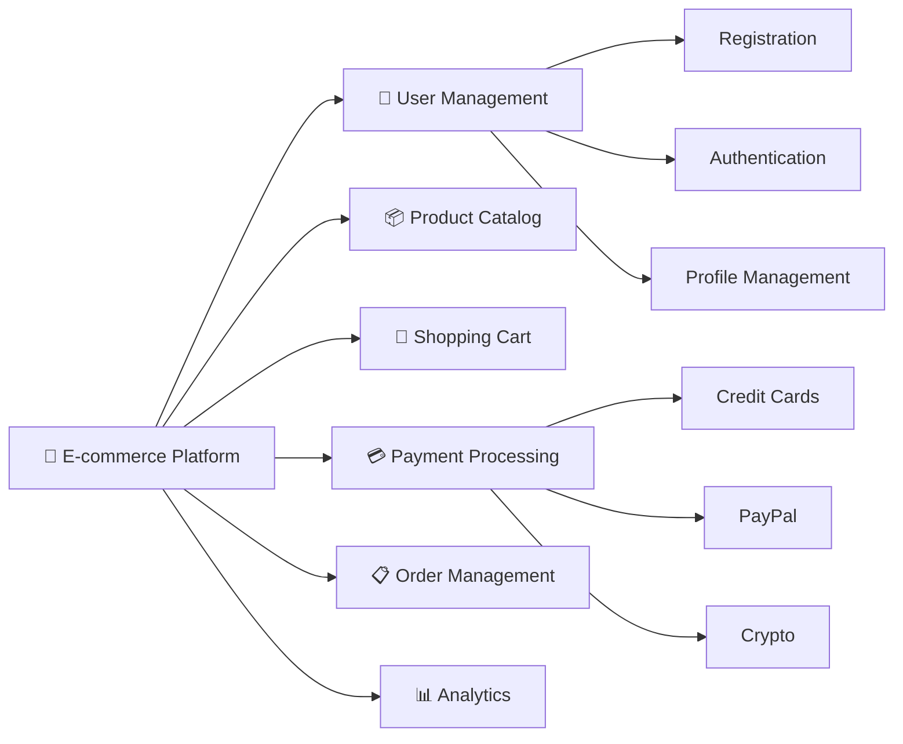
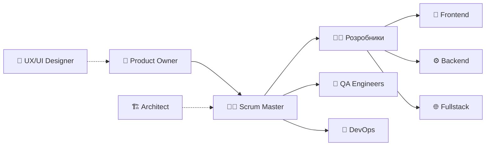
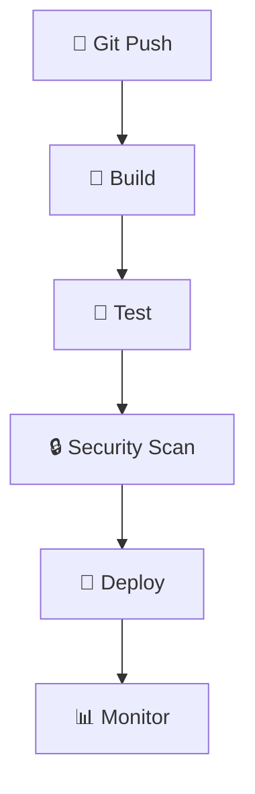
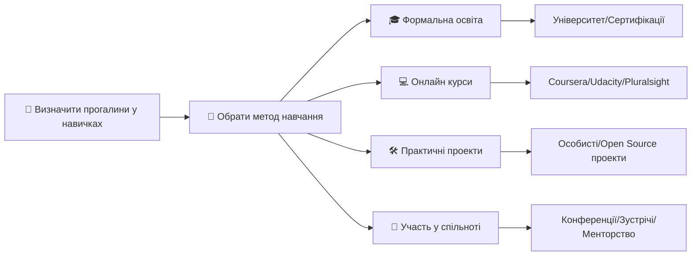
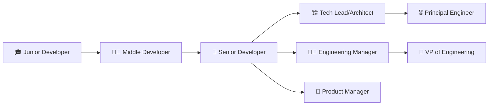

# Вступ до програмної інженерії та її місце в IT

## План лекції

1. Визначення програмної інженерії
2. Історичний розвиток
3. Основні принципи
4. Ролі в команді
5. Сучасні виклики

## **1. Визначення програмної інженерії**

## Що таке програмна інженерія?

> **Програмна інженерія** — це дисципліна, що займається застосуванням **інженерного підходу** до проектування, розробки, тестування, розгортання та супроводу програмного забезпечення.

### Ключові слова:

- ✅ **Систематичний підхід**
- ✅ **Весь життєвий цикл**
- ✅ **Якість та надійність**
- ✅ **Командна робота**

## Програмування ≠ Програмна інженерія

| 👨‍💻 Програмування | 🏗️ Програмна інженерія |
|:---:|:---:|
| Написання коду | Весь життєвий цикл |
| Індивідуальна робота | Командна робота |
| Короткий термін | Довгострокове рішення |
| Функціональність | Якість + Підтримуваність |

## **2. Історичний розвиток**

## Історія: Криза 1960-х років

### Проблеми того часу:

- 📈 **Бюджети** перевищувалися в 2-3 рази
- ⏰ **Затримки** на роки
- 🐛 **Низька якість** продуктів
- ❓ **Непередбачуваність** термінів

### Рішення:

**1968 рік** — конференція НАТО → термін **"Software Engineering"**

## **3. Основні принципи**

## 5 фундаментальних принципів

### 1. 🧩 **Модульність**
**Розбиття системи на керовані частини**

### 2. 🎭 **Абстракція**
**Приховування складності, простий інтерфейс**

### 3. 📦 **Інкапсуляція**
**Контрольований доступ до даних**

### 4. 🏗️ **Ієрархія**
**Багаторівнева організація**

### 5. ⚖️ **Розділення відповідальності**
**Кожен компонент має чітку роль**

## Принцип модульності: E-commerce



**💡 Переваги:** Паралельна розробка, легке тестування, повторне використання

## **4. Ролі в команді**

## Сучасна команда розробки



## Ключові ролі детально

### 🏗️ **Архітектор ПЗ**

- 🎯 Стратегічне планування архітектури
- ⚙️ Вибір технологічного стеку
- 📋 Встановлення стандартів розробки
- ⚠️ Аналіз ризиків
- 💰 **Досвід:** 7+ років, $4,000-8,000

### 👨‍💻 **Розробники**

- **Frontend:** React, Vue.js, TypeScript, CSS frameworks
- **Backend:** Python, Java, Node.js, Go, databases
- **Fullstack:** End-to-end development
- 💰 **Junior:** $800-1,500, **Senior:** $2,500-4,500

### 🧪 **QA Engineer**

- 🧪 Unit, Integration, E2E тестування
- 🤖 Автоматизація тестування (Cypress, Playwright)
- 🔄 CI/CD інтеграція
- 📊 Тестування продуктивності

### 🔄 **DevOps: Infrastructure as Code** (інфраструктура як код)

*CI/CD Pipeline:*



## **5. Сучасні виклики**

## Сучасні виклики: Технічні

### 📈 **Експоненціальне зростання складності**

- 1970-ті: 1K-10K рядків коду
- 2020-ті: 10M+ рядків коду

- Google Search: 100+ млн рядків
- Facebook: 60+ млн рядків
### ⚡ **Вимоги до продуктивності**

- ⏱️ Завантаження: **< 3 секунди**
- 🔄 API відповідь: **< 200мс**
- 🟢 Uptime: **99.99%** (4.38 хв простою/рік)
- 🔧 Відновлення: **< 5 хвилин**

*40% користувачів залишають сайт, якщо він завантажується > 3 сек*

## Масштабування: Netflix приклад

### 📊 **Цифри:**

- 👥 **230+ млн** користувачів
- 🌐 **15%** всього інтернет-трафіку США
- ⚙️ **1000+** мікросервісів

### 🛠️ **Рішення:**

- Chaos Engineering (навмисні збої)
- Global CDN для контенту
- Алгоритми персоналізації
- A/B testing на всіх рівнях

## Кібербезпека: Зростання загроз

### 🛡️ **OWASP Top 10:**

1. **Broken Access Control** - неправильна авторизація
2. **Cryptographic Failures** - слабке шифрування
3. **Injection** - SQL/NoSQL/Command injection
4. **Insecure Design** - архітектурні вразливості
5. ...

## Організаційні виклики

### ⚡ **Прискорення Time-to-Market**

```
Традиційні цикли:
├── Waterfall: 12-24 місяці
└── Результат: застарілий продукт

Сучасні очікування:
├── MVP: 3-6 місяців
├── Features: 2-4 тижні
└── Hotfixes: години-дні
```

### 🌍 **Розподілені команди**

- ⏰ Часові зони: тільки 2-4 години перекриття
- 🗣️ Культурні відмінності у комунікації
- 🔄 Асинхронна співпраця стає критичною

## Постійне навчання

### 📚 **Швидкість змін:**

```
Життєвий цикл технологій:
├── 1990і: 10-15 років стабільності
├── 2000і: 5-7 років головні зміни
├── 2010і: 2-3 роки суттєві оновлення
└── 2020і: 6-18 місяців до нових версій
```

### 🧠 **Виклики для розробників:**

- 📉 Застарівання навичок за 2-5 років
- 📊 Перевантаженість інформацією
- 🔄 Втома від фреймворків (Framework fatigue)
- ⚖️ Дилема глибини проти широти знань

## Стратегії навчання



## Навички інженера ПЗ

### 💻 **Технічні**

- Мови програмування
- Алгоритми та структури даних
- Бази даних
- Архітектура систем

### 🤝 **М'які навички**

- Командна робота
- Комунікація
- Вирішення проблем
- Критичне мислення

## Кар'єрний шлях



## Тенденції розвитку

### 🔥 **Актуальні напрямки:**

- 🤖 **Штучний інтелект** та машинне навчання
- ☁️ **Хмарні технології** та мікросервіси
- 📊 **Великі дані** та аналітика
- 🔒 **Кібербезпека** та приватність
- 🥽 **AR/VR** та метавсесвіт
- 🌱 **Green Software** та енергоефективність

## Підсумки лекції

### Програмна інженерія — це:

1. 🎯 **Дисципліна** з системним підходом
2. 📈 **Еволюція** від простого програмування
3. 🌐 **Основа** сучасної IT-індустрії
4. 👥 **Командна робота** та співпраця
5. 🔬 **Постійний розвиток** та адаптація
