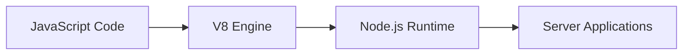
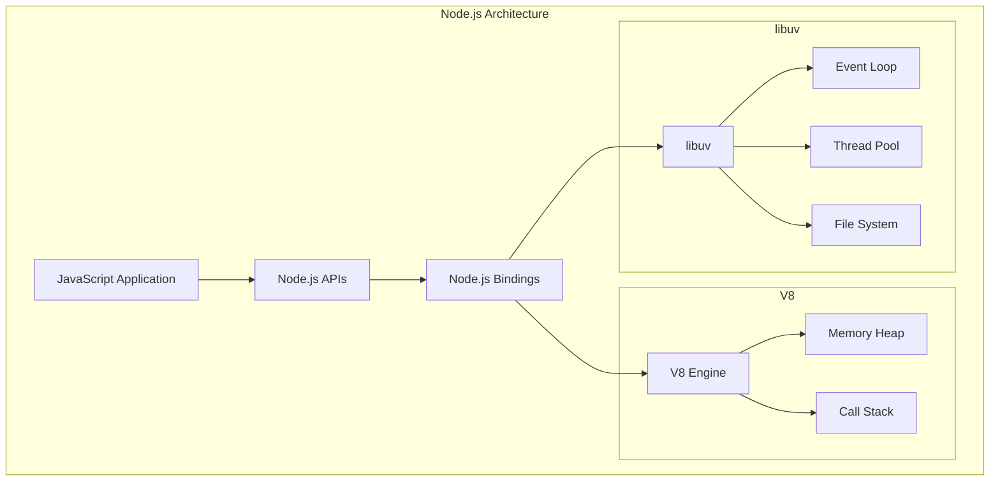
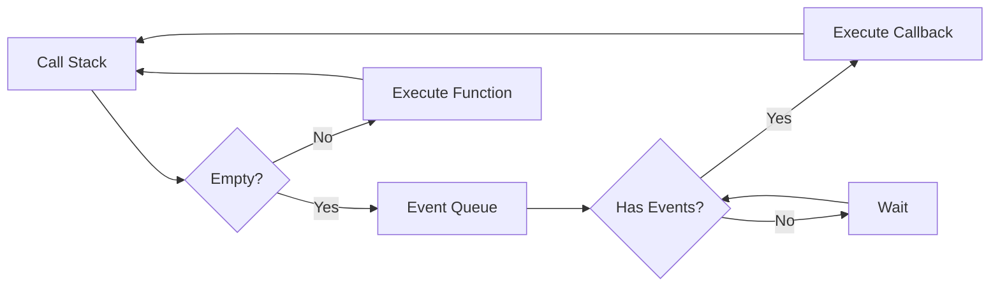
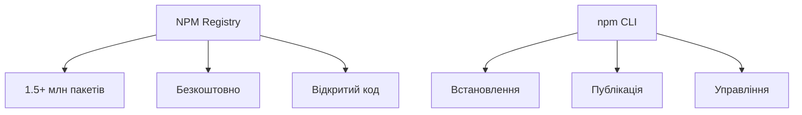
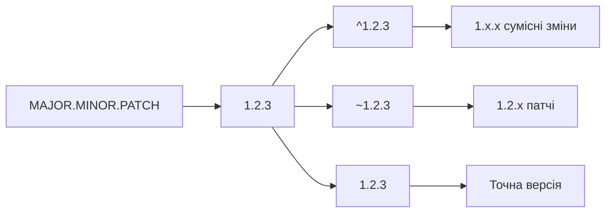

# Node.js основи та NPM

## Лекція 3


## План лекції

- Що таке Node.js?
- Архітектура та цикл подій
- NPM екосистема
- Модульна система
- Вбудовані модулі
- Налаштування середовища
- Практичні приклади


## Що таке Node.js?

**Node.js** — серверне середовище виконання JavaScript



### Ключові особливості:
- Асинхронне виконання
- Подієво-орієнтована архітектура
- Єдина мова для frontend та backend
- Величезна екосистема NPM


## Чому Node.js?

### ✅ Переваги
- **Висока продуктивність** для I/O операцій
- **Швидкість розробки** - одна мова
- **Активна спільнота** та екосистема
- **Реальний час** - WebSockets, чати

### ❌ Недоліки
- Не підходить для CPU-інтенсивних задач
- Callback hell (вирішується Promise/async-await)
- Швидкі зміни екосистеми


## Архітектура Node.js




## Цикл подій (Event Loop)



**Основний принцип:** Неблокуючі I/O операції


## Приклад асинхронності

```javascript
console.log('Початок');

setTimeout(() => {
    console.log('Таймер виконано');
}, 0);

console.log('Кінець');

// Вивід:
// Початок
// Кінець
// Таймер виконано
```

**Чому?** Event Loop обробляє setTimeout після поточного стеку


## NPM - найбільший реєстр пакетів



### Основні команди:
```bash
npm init                 # Ініціалізація проєкту
npm install express      # Встановлення пакета
npm install -g nodemon   # Глобальне встановлення
npm run dev              # Запуск скрипта
```


## package.json - серце проєкту

```json
{
  "name": "my-app",
  "version": "1.0.0",
  "main": "index.js",
  "scripts": {
    "start": "node index.js",
    "dev": "nodemon index.js"
  },
  "dependencies": {
    "express": "^4.18.2"
  },
  "devDependencies": {
    "nodemon": "^2.0.22"
  }
}
```


## Семантичне версіонування



- **MAJOR** - breaking changes
- **MINOR** - нові функції
- **PATCH** - виправлення помилок


## Модульна система: CommonJS

```javascript
// math.js - експорт
function add(a, b) {
    return a + b;
}

function subtract(a, b) {
    return a - b;
}

module.exports = { add, subtract };

// app.js - імпорт
const { add, subtract } = require('./math');
const math = require('./math');

console.log(add(5, 3)); // 8
```


## Модульна система: ES Modules

```javascript
// math.mjs - експорт
export function add(a, b) {
    return a + b;
}

export function subtract(a, b) {
    return a - b;
}

export default function multiply(a, b) {
    return a * b;
}

// app.mjs - імпорт
import multiply, { add, subtract } from './math.mjs';
import * as math from './math.mjs';

console.log(add(5, 3)); // 8
```


## Налаштування ES Modules

### package.json
```json
{
  "type": "module",
  "main": "index.js"
}
```

### Або використовувати розширення:
- `.mjs` - ES modules
- `.cjs` - CommonJS
- `.js` - залежить від package.json


## Вбудовані модулі

### File System (fs)
```javascript
import fs from 'fs/promises';

// Читання файлу
const data = await fs.readFile('config.txt', 'utf8');

// Запис файлу
await fs.writeFile('output.txt', 'Hello World');

// Список файлів
const files = await fs.readdir('./');
```


## Path модуль

```javascript
import path from 'path';

// Об'єднання шляхів
const fullPath = path.join('/users', 'student', 'project.js');
// /users/student/project.js

// Розбір шляху
console.log(path.dirname(fullPath));  // /users/student
console.log(path.basename(fullPath)); // project.js
console.log(path.extname(fullPath));  // .js

// Абсолютний шлях
const absolute = path.resolve('src', 'index.js');
```


## HTTP модуль

```javascript
import http from 'http';

const server = http.createServer((req, res) => {
    res.setHeader('Content-Type', 'application/json');

    if (req.url === '/api/status') {
        res.statusCode = 200;
        res.end(JSON.stringify({
            status: 'OK',
            timestamp: new Date().toISOString()
        }));
    } else {
        res.statusCode = 404;
        res.end(JSON.stringify({ error: 'Not Found' }));
    }
});

server.listen(3000, () => {
    console.log('Сервер запущено на порті 3000');
});
```


## URL модуль

```javascript
import { URL } from 'url';

const apiUrl = new URL('https://api.example.com/users?page=2&limit=10');

console.log(apiUrl.protocol);  // https:
console.log(apiUrl.host);      // api.example.com
console.log(apiUrl.pathname);  // /users

// Робота з параметрами
const params = apiUrl.searchParams;
console.log(params.get('page'));  // 2

params.set('page', '3');
params.append('sort', 'name');
```


## Налаштування середовища

### VS Code розширення
- **Node.js Modules Intellisense**
- **npm Intellisense**
- **ESLint**
- **Prettier**
- **Node.js Debug**

### Конфігурація
```json
// .vscode/settings.json
{
  "editor.formatOnSave": true,
  "editor.defaultFormatter": "esbenp.prettier-vscode"
}
```


## ESLint + Prettier

### .eslintrc.json
```json
{
  "env": {
    "node": true,
    "es2022": true
  },
  "extends": ["eslint:recommended"],
  "rules": {
    "semi": ["error", "always"],
    "quotes": ["error", "single"]
  }
}
```

### .prettierrc
```json
{
  "semi": true,
  "singleQuote": true,
  "tabWidth": 2
}
```


## Змінні середовища

### .env файл
```env
NODE_ENV=development
PORT=3000
DB_HOST=localhost
DB_PASSWORD=secret123
JWT_SECRET=my-secret-key
```

### Використання
```javascript
import dotenv from 'dotenv';
dotenv.config();

const config = {
    port: process.env.PORT || 3000,
    dbHost: process.env.DB_HOST || 'localhost',
    jwtSecret: process.env.JWT_SECRET
};
```


## Корисні NPM скрипти

```json
{
  "scripts": {
    "start": "node src/index.js",
    "dev": "nodemon src/index.js",
    "dev:debug": "nodemon --inspect src/index.js",
    "test": "jest",
    "test:watch": "jest --watch",
    "lint": "eslint src/",
    "lint:fix": "eslint src/ --fix",
    "format": "prettier --write src/",
    "clean": "rm -rf dist/",
    "build": "npm run clean && babel src --out-dir dist"
  }
}
```


## Практичний приклад: Простий API

```javascript
import http from 'http';

const users = [
    { id: 1, name: 'Іван', email: 'ivan@example.com' },
    { id: 2, name: 'Марія', email: 'maria@example.com' }
];

const server = http.createServer((req, res) => {
    res.setHeader('Content-Type', 'application/json');

    if (req.url === '/api/users' && req.method === 'GET') {
        res.statusCode = 200;
        res.end(JSON.stringify({ users }));
    } else {
        res.statusCode = 404;
        res.end(JSON.stringify({ error: 'Not Found' }));
    }
});

server.listen(3000);
```


## Обробка POST запитів

```javascript
async function handlePost(req, res) {
    const body = await parseBody(req);

    if (!body.name || !body.email) {
        res.statusCode = 400;
        res.end(JSON.stringify({ error: 'Name and email required' }));
        return;
    }

    const newUser = {
        id: Date.now(),
        name: body.name,
        email: body.email
    };

    users.push(newUser);
    res.statusCode = 201;
    res.end(JSON.stringify(newUser));
}

function parseBody(req) {
    return new Promise((resolve, reject) => {
        let body = '';
        req.on('data', chunk => body += chunk);
        req.on('end', () => resolve(JSON.parse(body)));
        req.on('error', reject);
    });
}
```


## Nodemon - автоматичний перезапуск

### Встановлення
```bash
npm install -D nodemon
```

### nodemon.json
```json
{
  "watch": ["src"],
  "ext": "js,mjs,json",
  "ignore": ["src/**/*.test.js"],
  "exec": "node src/index.js",
  "env": {
    "NODE_ENV": "development"
  }
}
```

### Використання
```bash
nodemon src/index.js
# або через NPM script
npm run dev
```


## Відлагодження Node.js

### VS Code Launch Configuration
```json
{
  "type": "node",
  "request": "launch",
  "name": "Launch Program",
  "program": "${workspaceFolder}/src/index.js",
  "env": {
    "NODE_ENV": "development"
  },
  "console": "integratedTerminal"
}
```

### Командний рядок
```bash
node --inspect src/index.js
node --inspect-brk src/index.js  # пауза на першому рядку
```


## Управління залежностями

### Типи залежностей
```bash
# Production залежності
npm install express mongoose

# Development залежності
npm install -D nodemon jest eslint

# Peer залежності (у package.json)
"peerDependencies": {
  "react": ">=16.0.0"
}
```

### Оновлення пакетів
```bash
npm outdated           # перевірка застарілих пакетів
npm update             # оновлення до допустимих версій
npm audit              # перевірка безпеки
npm audit fix          # автоматичне виправлення
```


## Best Practices

### ✅ Рекомендації
- Використовуйте **async/await** замість callbacks
- Встановлюйте **точні версії** для production
- Додавайте **package-lock.json** до Git
- Використовуйте **.env** для конфігурації
- Налаштуйте **ESLint** та **Prettier**
- Пишіть **тести** для критичного функціоналу

### ❌ Уникайте
- Глобальних змінних
- Синхронних fs операцій у production
- Hardcoded паролів у коді
- Ігнорування помилок у Promise


## Архітектура проєкту

```
my-node-app/
├── src/
│   ├── controllers/     # Бізнес логіка
│   ├── models/         # Моделі даних
│   ├── routes/         # API маршрути
│   ├── middleware/     # Проміжне ПЗ
│   ├── utils/          # Утиліти
│   └── index.js        # Точка входу
├── tests/              # Тести
├── docs/               # Документація
├── .env.example        # Приклад змінних
├── .gitignore
├── package.json
└── README.md
```


## Популярні NPM пакети

### **Web фреймворки**
- **express** - мінімалістичний веб фреймворк
- **fastify** - швидкий та низькорівневий
- **koa** - наступна генерація Express

### **База даних**
- **mongoose** - MongoDB ODM
- **prisma** - сучасний ORM
- **sequelize** - SQL ORM

### **Утиліти**
- **lodash** - функціональні утиліти
- **moment/dayjs** - робота з датами
- **joi/yup** - валідація схем


## Тестування в Node.js

### Jest - популярний тестовий фреймворк
```javascript
// math.test.js
import { add, subtract } from './math.js';

describe('Math functions', () => {
    test('should add two numbers', () => {
        expect(add(2, 3)).toBe(5);
    });

    test('should subtract two numbers', () => {
        expect(subtract(5, 3)).toBe(2);
    });
});
```

### Запуск тестів
```bash
npm test
npm test -- --watch    # watch mode
npm test -- --coverage # з покриттям коду
```


## Моніторинг та логування

### Логування з winston
```javascript
import winston from 'winston';

const logger = winston.createLogger({
    level: 'info',
    format: winston.format.json(),
    transports: [
        new winston.transports.File({ filename: 'error.log', level: 'error' }),
        new winston.transports.File({ filename: 'combined.log' })
    ]
});

logger.info('Server started', { port: 3000 });
logger.error('Database connection failed', { error: err.message });
```


## Performance та оптимізація

### Cluster для використання всіх CPU
```javascript
import cluster from 'cluster';
import os from 'os';

if (cluster.isMaster) {
    const numCPUs = os.cpus().length;

    for (let i = 0; i < numCPUs; i++) {
        cluster.fork();
    }

    cluster.on('exit', (worker) => {
        console.log(`Worker ${worker.process.pid} помер`);
        cluster.fork();
    });
} else {
    // Основний код додатку
    import('./app.js');
}
```


## Безпека в Node.js

### Основні принципи
- **Валідація** всіх вхідних даних
- **Хешування** паролів (bcrypt)
- **JWT токени** для автентифікації
- **HTTPS** для production
- **Rate limiting** для API
- **Helmet** для захисту заголовків

```javascript
import helmet from 'helmet';
import rateLimit from 'express-rate-limit';

app.use(helmet());
app.use(rateLimit({
    windowMs: 15 * 60 * 1000, // 15 хвилин
    max: 100 // обмеження запитів
}));
```


## Деплой Node.js додатків

### Популярні платформи
- **Heroku** - простий деплой
- **Vercel** - для serverless
- **DigitalOcean** - VPS сервери
- **AWS** - повна екосистема
- **Railway** - сучасна альтернатива

### PM2 для production
```bash
npm install -g pm2
pm2 start src/index.js --name "my-app"
pm2 startup
pm2 save
```


## Робота з середовищами

### Різні конфігурації
```javascript
// config.js
const configs = {
    development: {
        port: 3000,
        db: 'mongodb://localhost/myapp_dev'
    },
    production: {
        port: process.env.PORT,
        db: process.env.DATABASE_URL
    },
    test: {
        port: 3001,
        db: 'mongodb://localhost/myapp_test'
    }
};

export default configs[process.env.NODE_ENV || 'development'];
```

## Майбутнє Node.js

### Нові можливості
- **ES Modules** стають стандартом
- **Top-level await** в модулях
- **Worker Threads** для CPU задач
- **HTTP/3** підтримка
- **WebAssembly** інтеграція

### Тренди екосистеми
- **TypeScript** набирає популярність
- **Deno** як альтернатива
- **Serverless** архітектури
- **Microservices** з Node.js


## Корисні ресурси

### 📚 Документація та навчання
- [nodejs.org](https://nodejs.org) - офіційна документація
- [npmjs.com](https://npmjs.com) - реєстр пакетів
- [Node.js Best Practices](https://github.com/goldbergyoni/nodebestpractices)

### 🛠️ Інструменти
- [npm-check-updates](https://www.npmjs.com/package/npm-check-updates) - оновлення залежностей
- [depcheck](https://www.npmjs.com/package/depcheck) - пошук невикористаних залежностей
- [clinic.js](https://clinicjs.org/) - профайлінг продуктивності
