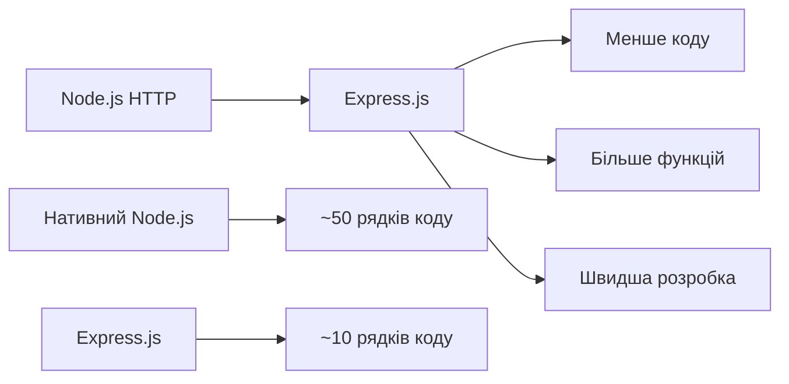
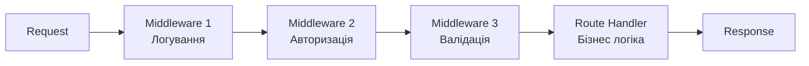
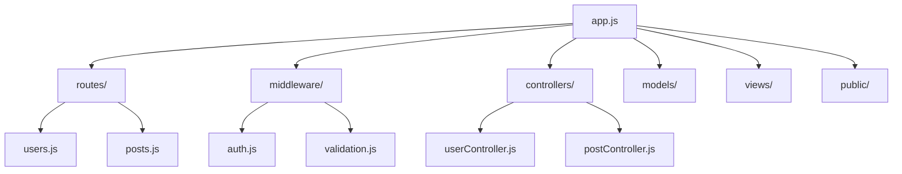
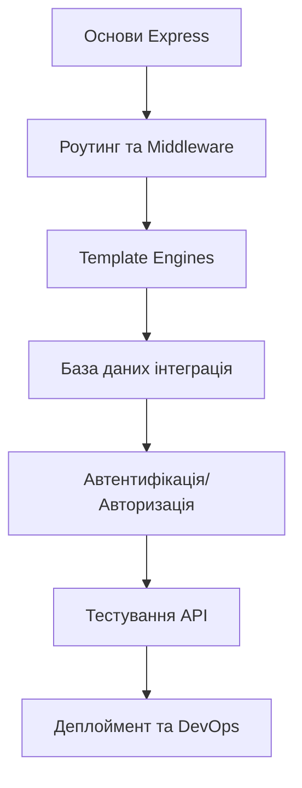

# Express.js фреймворк


## Що таке Express.js?

**Express.js** — мінімалістичний та гнучкий вебфреймворк для Node.js

### Основні характеристики:
- 🚀 **Швидкий** старт проектів
- 🔧 **Гнучкий** та розширюваний
- 📦 **Мінімалістичний** підхід
- 🌐 **Велика спільнота** розробників

### Хто використовує?
Netflix • Airbnb • Uber • WhatsApp • IBM


## Чому Express?



### Переваги:
- ✅ Простота використання
- ✅ Потужна екосистема middleware
- ✅ Відмінна продуктивність
- ✅ Активна підтримка спільноти


## Перший Express сервер

### Встановлення:
```bash
npm init -y
npm install express
```

### Базовий код:
```javascript
const express = require('express');
const app = express();

app.get('/', (req, res) => {
    res.send('Привіт, Express!');
});

app.listen(3000, () => {
    console.log('Сервер працює на порті 3000');
});
```

**Результат:** Працюючий веб-сервер за 7 рядків коду! 🎉


## Система роутингу

### HTTP методи в Express:

| Метод | Призначення | Приклад |
|-------|-------------|---------|
| **GET** | Отримання даних | `app.get('/users')` |
| **POST** | Створення | `app.post('/users')` |
| **PUT** | Повне оновлення | `app.put('/users/:id')` |
| **DELETE** | Видалення | `app.delete('/users/:id')` |

### Динамічні маршрути:
```javascript
// Параметри URL
app.get('/users/:id', (req, res) => {
    const userId = req.params.id;
    res.json({ userId });
});

// Query параметри: /search?q=node&limit=10
app.get('/search', (req, res) => {
    const { q, limit } = req.query;
    res.json({ query: q, limit });
});
```


## Концепція Middleware



### Middleware функції:
- **Виконують код** перед/після обробки запиту
- **Модифікують** req та res об'єкти
- **Передають управління** наступній функції
- **Завершують** цикл запит-відповідь


## Типи Middleware

### 1. Application-level
```javascript
// Для всіх маршрутів
app.use((req, res, next) => {
    console.log('Час запиту:', Date.now());
    next();
});

// Для конкретного шляху
app.use('/api', authMiddleware);
```

### 2. Router-level
```javascript
const router = express.Router();
router.use(loggerMiddleware);
app.use('/users', router);
```

### 3. Вбудовані middleware
```javascript
app.use(express.json());          // Парсинг JSON
app.use(express.static('public')); // Статичні файли
```


## Обробка запитів та відповідей

### Об'єкт Request (req):
```javascript
app.post('/users', (req, res) => {
    console.log(req.method);    // POST
    console.log(req.url);       // /users
    console.log(req.headers);   // HTTP заголовки
    console.log(req.body);      // Тіло запиту
    console.log(req.params);    // Параметри URL
    console.log(req.query);     // Query параметри
});
```

### Об'єкт Response (res):
```javascript
app.get('/api/data', (req, res) => {
    res.status(200);                    // Статус код
    res.set('X-Custom-Header', 'value'); // Заголовки
    res.json({ success: true });        // JSON відповідь
    // res.send('text');                // Текст
    // res.redirect('/new-url');        // Редірект
});
```


## Валідація даних

### Middleware для валідації:
```javascript
const validateUser = (req, res, next) => {
    const { name, email, age } = req.body;
    const errors = [];

    if (!name || name.length < 2) {
        errors.push('Ім\'я занадто коротке');
    }

    if (!email || !/\S+@\S+\.\S+/.test(email)) {
        errors.push('Некоректний email');
    }

    if (!age || age < 18) {
        errors.push('Вік має бути більше 18');
    }

    if (errors.length > 0) {
        return res.status(400).json({ errors });
    }

    next();
};
```

### Використання:
```javascript
app.post('/users', validateUser, (req, res) => {
    // Дані вже валідні!
    res.json({ message: 'Користувача створено' });
});
```


## Статичні файли

### Структура проєкту:
```
project/
├── app.js
├── public/
│   ├── css/style.css
│   ├── js/app.js
│   └── images/logo.png
└── package.json
```

### Налаштування:
```javascript
// Базове використання
app.use(express.static('public'));
// Доступ: http://localhost:3000/css/style.css

// З віртуальним шляхом
app.use('/assets', express.static('public'));
// Доступ: http://localhost:3000/assets/css/style.css
```

### Переваги:
- 🚀 **Швидкість** - прямий доступ до файлів
- 💾 **Кешування** - автоматичне кешування браузером
- 🔒 **Безпека** - контроль доступу до файлів


## Template Engines

### EJS приклад:
```javascript
// Налаштування
app.set('view engine', 'ejs');
app.set('views', './views');

// Рендеринг
app.get('/', (req, res) => {
    const data = {
        title: 'Головна сторінка',
        users: [
            { name: 'Іван', email: 'ivan@example.com' },
            { name: 'Марія', email: 'maria@example.com' }
        ]
    };

    res.render('index', data);
});
```

### Шаблон (views/index.ejs):
```html
<h1><%= title %></h1>
<ul>
    <% users.forEach(user => { %>
        <li><%= user.name %> - <%= user.email %></li>
    <% }); %>
</ul>
```


## Express Router

### Модульна організація:
```javascript
// routes/users.js
const express = require('express');
const router = express.Router();

router.get('/', getAllUsers);
router.get('/:id', getUserById);
router.post('/', createUser);
router.put('/:id', updateUser);
router.delete('/:id', deleteUser);

module.exports = router;

// app.js
const userRoutes = require('./routes/users');
app.use('/api/users', userRoutes);
```

### Переваги Router:
- 📁 **Модульність** - розділення логіки
- 🔧 **Повторне використання** - підключення до різних шляхів
- 🧪 **Тестування** - ізольоване тестування модулів


## Структура Express проєкту



### MVC Архітектура:
- **Models** - робота з даними
- **Views** - відображення (шаблони)
- **Controllers** - бізнес логіка
- **Routes** - маршрутизація
- **Middleware** - допоміжна логіка


## Обробка помилок

### Error Middleware:
```javascript
// Middleware для обробки помилок (4 параметри!)
app.use((err, req, res, next) => {
    console.error(err.stack);

    const status = err.status || 500;
    const message = err.message || 'Внутрішня помилка сервера';

    res.status(status).json({
        success: false,
        error: {
            message,
            status,
            timestamp: new Date().toISOString()
        }
    });
});
```

### Передача помилок:
```javascript
app.get('/users/:id', (req, res, next) => {
    try {
        const user = findUserById(req.params.id);
        if (!user) {
            const error = new Error('Користувача не знайдено');
            error.status = 404;
            throw error;
        }
        res.json(user);
    } catch (error) {
        next(error); // Передача в error handler
    }
});
```


## Безпека Express додатків

### Основні принципи:
```javascript
const helmet = require('helmet');
const rateLimit = require('express-rate-limit');

// Безпечні заголовки
app.use(helmet());

// Rate limiting
const limiter = rateLimit({
    windowMs: 15 * 60 * 1000, // 15 хвилин
    max: 100 // максимум 100 запитів
});
app.use('/api/', limiter);

// Валідація Content-Type
app.use((req, res, next) => {
    if (['POST', 'PUT'].includes(req.method)) {
        if (!req.is('application/json')) {
            return res.status(400).json({
                error: 'Content-Type має бути application/json'
            });
        }
    }
    next();
});
```

### Чеклист безпеки:
- ✅ Використовуйте HTTPS
- ✅ Валідуйте всі вхідні дані
- ✅ Впроваджуйте rate limiting
- ✅ Налаштуйте безпечні заголовки
- ✅ Логуйте та моніторьте активність


## Тестування Express

### Unit тести з Jest:
```javascript
const request = require('supertest');
const app = require('../app');

describe('Users API', () => {
    test('GET /api/users повертає список користувачів', async () => {
        const response = await request(app)
            .get('/api/users')
            .expect(200);

        expect(response.body.success).toBe(true);
        expect(Array.isArray(response.body.data)).toBe(true);
    });

    test('POST /api/users створює користувача', async () => {
        const userData = {
            name: 'Тест',
            email: 'test@example.com',
            age: 25
        };

        const response = await request(app)
            .post('/api/users')
            .send(userData)
            .expect(201);

        expect(response.body.data.name).toBe(userData.name);
    });
});
```


## Продуктивність та оптимізація

### Compression:
```javascript
const compression = require('compression');

app.use(compression({
    level: 6,
    threshold: 1024 // стискати файли > 1KB
}));
```

### Кешування:
```javascript
const cache = (duration = 300) => {
    return (req, res, next) => {
        const key = `cache:${req.originalUrl}`;

        // Перевірка кешу
        const cachedData = getFromCache(key);
        if (cachedData) {
            return res.json(cachedData);
        }

        // Зберігання в кеш після відповіді
        const originalJson = res.json;
        res.json = function(data) {
            saveToCache(key, data, duration);
            return originalJson.call(this, data);
        };

        next();
    };
};

app.get('/api/users', cache(600), getAllUsers);
```


## Найкращі практики

### 1. Структура коду:
- 📁 Розділяйте логіку по модулях
- 🔧 Використовуйте Router для маршрутів
- 🛡️ Створюйте окремі middleware
- 🧪 Пишіть тести для API

### 2. Безпека:
- 🔒 Валідуйте всі дані
- 🚫 Ніколи не довіряйте клієнту
- 📝 Логуйте всі важливі операції
- 🔐 Використовуйте HTTPS в продакшені

### 3. Продуктивність:
- ⚡ Кешуйте часто запитувані дані
- 📦 Стискайте відповіді
- 🔄 Використовуйте connection pooling
- 📊 Моніторьте метрики додатку


## Ecosystem та інструменти

### Корисні пакети:
```javascript
// Безпека
const helmet = require('helmet');
const cors = require('cors');

// Логування
const morgan = require('morgan');
const winston = require('winston');

// Валідація
const joi = require('joi');
const express-validator = require('express-validator');

// База даних
const mongoose = require('mongoose');
const sequelize = require('sequelize');

// Автентифікація
const passport = require('passport');
const jsonwebtoken = require('jsonwebtoken');
```

### Інструменти розробки:
- 🔄 **Nodemon** - автоперезапуск сервера
- 🧪 **Jest/Mocha** - тестування
- 📊 **Postman** - тестування API
- 🐛 **VS Code** - відладка
- 📝 **Swagger** - документація API


## Порівняння з іншими фреймворками

| Framework | Тип | Особливості |
|-----------|-----|-------------|
| **Express** | Мінімалістичний | Гнучкість, middleware |
| **Koa** | Наступник Express | Async/await, менший розмір |
| **Fastify** | Швидкий | Висока продуктивність |
| **NestJS** | Enterprise | TypeScript, декоратори |
| **Hapi** | Повнофункціональний | Вбудована валідація, кеш |

### Коли вибирати Express:
- ✅ Потрібна гнучкість та контроль
- ✅ Великий досвід команди з JavaScript
- ✅ Велика екосистема пакетів
- ✅ Швидкий старт проєкту


## Roadmap вивчення Express



### Наступні кроки:
1. **Практика** - створіть власний API
2. **База даних** - вивчіть MongoDB/PostgreSQL
3. **Автентифікація** - JWT, Passport.js
4. **Тестування** - Jest, Supertest
5. **Деплоймент** - Docker, Heroku, AWS


## Висновки

### Express.js - це:
- 🚀 **Швидкий старт** для веб-проєктів
- 🔧 **Гнучкий інструмент** для різних задач
- 📚 **Відмінна документація** та спільнота
- 🌐 **Стандарт індустрії** для Node.js

### Ключові переваги:
- Мінімалістичний підхід з можливістю розширення
- Потужна система middleware для модульності
- Відмінна продуктивність для більшості додатків
- Велика екосистема та активна спільнота
