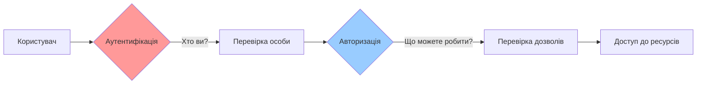
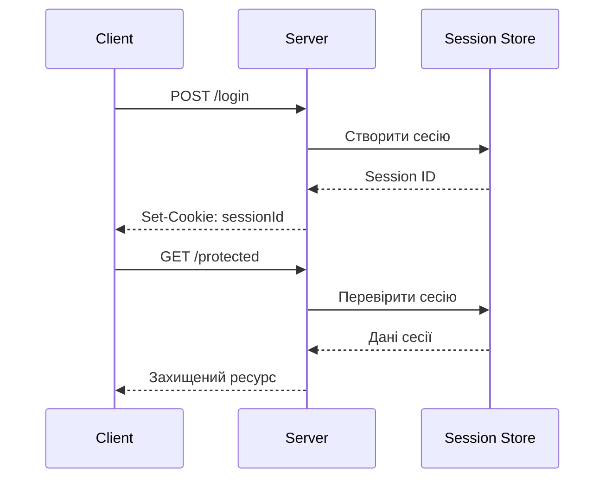
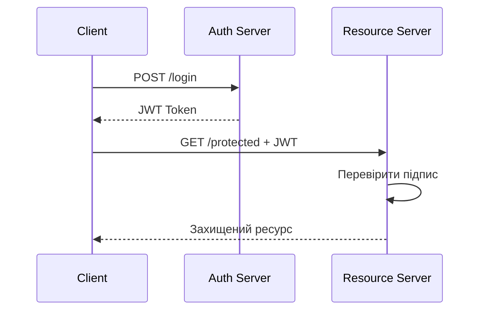
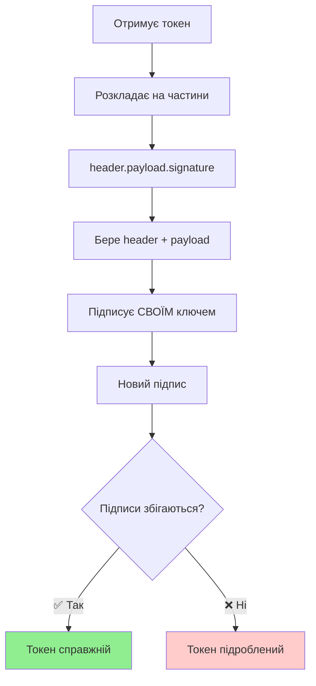
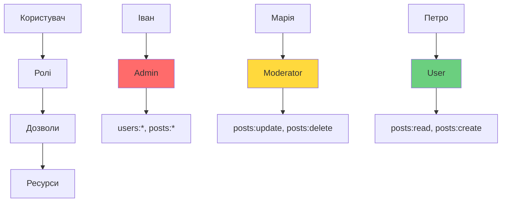
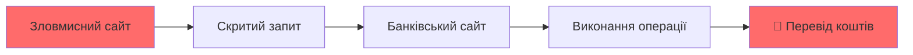
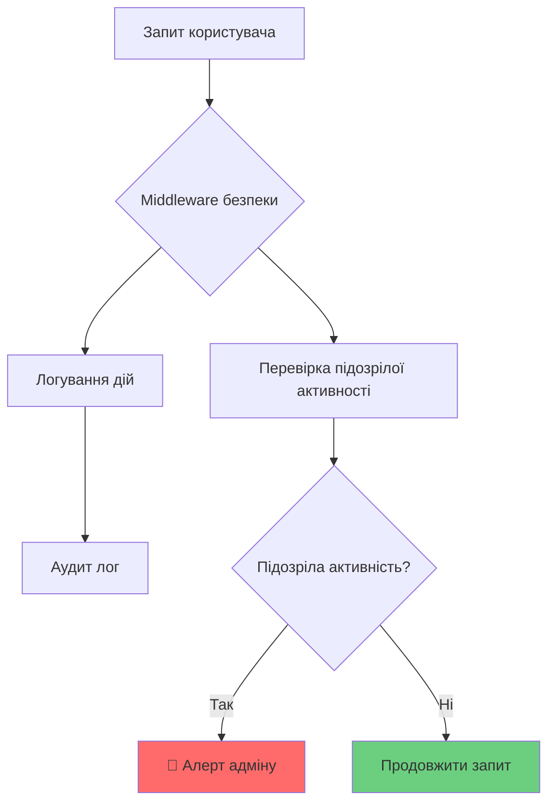
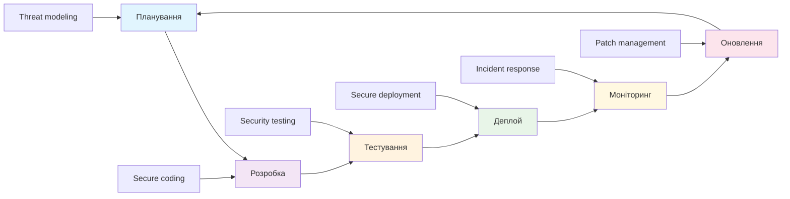

# Аутентифікація та безпека

## 🔐 Аутентифікація vs Авторизація



### **Аутентифікація** = "Хто ви?"

### **Авторизація** = "Що ви можете робити?"

## ⚖️ Сесії vs Токени

### 🏪 Сесійна аутентифікація (Stateful)



## 🎫 JWT токени (Stateless)



### JWT структура: **Header.Payload.Signature**

## 🔍 Як сервер перевіряє справжність JWT?

### **Ключовий принцип: сервер повторює підпис!**



## 🔐 Процес перевірки токена

```javascript
function verifyToken(token, secret) {
    // 1. Розкладає токен
    const [header, payload, receivedSignature] = token.split('.');

    // 2. Бере дані для підпису
    const dataToSign = header + '.' + payload;

    // 3. ПІДПИСУЄ тими самими даними
    const mySignature = HMAC_SHA256(dataToSign, secret);

    // 4. Порівнює підписи
    if (mySignature === receivedSignature) {
        return "✅ Токен справжній!";
    } else {
        throw "❌ Токен підроблений!";
    }
}
```

## 🏛️ Аналогія з печаткою

```
┌─────────────────────────────┐
│ ПОСВІДЧЕННЯ ОСОБИ          │
│ ─────────────────────────── │ ← header
│ Ім'я: Іван Петренко        │ ← payload
│ ID: 123, Роль: admin       │
│ ─────────────────────────── │
│     [ПЕЧАТКА СЕРВЕРА] 🏛️   │ ← signature
└─────────────────────────────┘
```

**Як перевіряє сервер:**

1. 📖 Читає документ
2. 🏛️ Ставить свою печатку на ці дані
3. 🔍 Порівнює з печаткою в документі
4. ✅ Якщо збігаються → документ справжній!

## ❌ Чому атака не працює?

### Спроба підробки:
```javascript
// Зловмисник змінює payload:
originalPayload = { userId: 123, role: 'user' }
hackedPayload   = { userId: 123, role: 'admin' } // ⚠️

// Але підпис залишається старий!
oldSignature = "abc123xyz" // для старого payload

// Сервер перевіряє:
newSignature = HMAC_SHA256(header + hackedPayload, SECRET)
// Результат: "def456uvw" ≠ "abc123xyz" ❌
```

### **🔑 Без SECRET ключа неможливо створити правильний підпис!**

## 📊 Порівняння підходів

| Критерій | Сесії | JWT |
|----------|-------|-----|
| **Стан сервера** | ✅ Stateful | ❌ Stateless |
| **Масштабування** | ⚠️ Складне | ✅ Легке |
| **Відкликання** | ✅ Миттєве | ⚠️ Складне |
| **Розмір** | ✅ Малий | ⚠️ Великий |
| **Безпека** | ✅ Висока | ⚠️ Потребує уваги |

## 🔒 Хешування паролів: bcrypt

### ❌ Небезпечно
```javascript
// НІКОЛИ не робіть так!
const password = "mypassword123";
const hash = crypto.createHash('sha256')
                  .update(password)
                  .digest('hex');
```

### ✅ Безпечно

```javascript
// Правильний підхід з bcrypt
const bcrypt = require('bcryptjs');

const hashPassword = async (password) => {
    return await bcrypt.hash(password, 12);
};

const verifyPassword = async (password, hash) => {
    return await bcrypt.compare(password, hash);
};
```
## 🔧 Middleware аутентифікації

```javascript
function authenticateToken(req, res, next) {
    const authHeader = req.headers['authorization'];
    const token = authHeader && authHeader.split(' ')[1];

    if (!token) {
        return res.status(401).json({
            error: 'Токен відсутній'
        });
    }

    jwt.verify(token, process.env.JWT_SECRET, (err, user) => {
        if (err) return res.status(403).json({
            error: 'Недійсний токен'
        });

        req.user = user;
        next();
    });
}
```
## 👥 Система ролей (RBAC)



## 🛡️ Middleware авторизації

```javascript
function requireRole(roles) {
    return (req, res, next) => {
        if (!req.user) {
            return res.status(401).json({
                error: 'Не аутентифіковано'
            });
        }

        const userRoles = req.user.roles || [];
        const hasRole = roles.some(role =>
            userRoles.includes(role)
        );

        if (!hasRole) {
            return res.status(403).json({
                error: 'Недостатньо прав'
            });
        }

        next();
    };
}
```
## 🌐 CORS: Cross-Origin Resource Sharing

### Проблема

Браузери блокують запити між різними доменами з міркувань безпеки

### Рішення
```javascript
app.use(cors({
    origin: [
        'https://yourdomain.com',
        'https://app.yourdomain.com'
    ],
    credentials: true,
    methods: ['GET', 'POST', 'PUT', 'DELETE'],
    allowedHeaders: ['Content-Type', 'Authorization']
}));
```

**⚠️ Ніколи не використовуйте `origin: '*'` у продакшені!**

## 🎭 CSRF: Cross-Site Request Forgery



### Захист: CSRF токени
```javascript
// Генерація токена
app.get('/csrf-token', (req, res) => {
    res.json({ csrfToken: req.csrfToken() });
});

// Перевірка токена
app.use('/api', csrfProtection);
```
## 💉 XSS: Cross-Site Scripting

### Типи XSS атак

- **Reflected XSS**: шкідливий код у URL
- **Stored XSS**: збережений у базі даних
- **DOM-based XSS**: маніпуляції з DOM

### Захист

```javascript
// Санітизація вхідних даних
function sanitizeInput(input) {
    return input
        .replace(/</g, '&lt;')
        .replace(/>/g, '&gt;')
        .replace(/"/g, '&quot;')
        .replace(/'/g, '&#x27;');
}

// Content Security Policy
app.use(helmet({
    contentSecurityPolicy: {
        directives: {
            defaultSrc: ["'self'"],
            scriptSrc: ["'self'"]
        }
    }
}));
```
## 🚀 Rate Limiting

### Захист від Brute Force атак

```javascript
const rateLimit = require('express-rate-limit');

// Загальний rate limiting
const generalLimiter = rateLimit({
    windowMs: 15 * 60 * 1000, // 15 хвилин
    max: 100 // 100 запитів на вікно
});

// Спеціальний для login
const authLimiter = rateLimit({
    windowMs: 15 * 60 * 1000,
    max: 5, // Тільки 5 спроб входу
    message: 'Забагато спроб входу'
});

app.use('/auth/login', authLimiter);
```

## 📊 Система моніторингу



### Що логувати:

- Спроби входу (успішні/неуспішні)
- Зміни дозволів
- Доступ до чутливих даних
- Підозрілі запити

## 🔐 Шифрування даних

### Шифрування в спокої

```javascript
const crypto = require('crypto');

class DataEncryption {
    encrypt(text) {
        const cipher = crypto.createCipher('aes-256-gcm', secretKey);
        let encrypted = cipher.update(text, 'utf8', 'hex');
        encrypted += cipher.final('hex');
        return encrypted;
    }

    decrypt(encryptedText) {
        const decipher = crypto.createDecipher('aes-256-gcm', secretKey);
        let decrypted = decipher.update(encryptedText, 'hex', 'utf8');
        decrypted += decipher.final('utf8');
        return decrypted;
    }
}
```

### **HTTPS у продакшені - обов'язково!**

## ✅ Чекліст безпеки

### Аутентифікація
- ✅ bcrypt для паролів (salt rounds ≥ 10)
- ✅ JWT з коротким терміном дії
- ✅ Refresh токени
- ✅ Rate limiting для login

### Авторизація
- ✅ Принцип найменших привілеїв
- ✅ Ролі та дозволи
- ✅ Перевірка на кожному endpoint

### Захист від атак
- ✅ CORS налаштування
- ✅ CSRF токени
- ✅ XSS санітизація
- ✅ SQL injection захист

## 🛠️ Інструменти безпеки

### Автоматизація

- **Helmet.js** - безпечні HTTP заголовки
- **express-rate-limit** - обмеження запитів
- **express-validator** - валідація вхідних даних
- **bcryptjs** - хешування паролів

### Тестування

- **OWASP ZAP** - сканування вразливостей
- **npm audit** - перевірка залежностей
- **Snyk** - моніторинг безпеки

### Моніторинг

- **Winston** - логування
- **Elasticsearch** - аналіз логів
- **Grafana** - візуалізація метрик

## 🚨 Типові помилки

### ❌ Що НЕ робити

- Зберігати паролі в plaintext
- Використовувати слабкі алгоритми (MD5, SHA1)
- Ігнорувати валідацію на сервері
- Довіряти тільки клієнтській валідації
- Використовувати HTTP у продакшені
- Зберігати секрети в коді
- Ігнорувати логування безпеки

### ✅ Що робити ЗАВЖДИ

- Валідувати ВСІ вхідні дані
- Використовувати HTTPS
- Регулярно оновлювати залежності
- Логувати безпекові події
- Тестувати на вразливості

## 📈 Життєвий цикл безпеки



## 💡 Ключові принципи

### Defense in Depth
**Кілька рівнів захисту краще за один досконалий**

### Principle of Least Privilege
**Мінімальні необхідні дозволи**

### Fail Secure
**Безпечна поведінка при помилках**

### Security by Design
**Безпека з самого початку, не як доповнення**

## 🌟 Майбутнє безпеки

### Сучасні тренди
- **Zero Trust** архітектура
- **Multi-Factor Authentication** (MFA)
- **Behavioral Analytics** для виявлення аномалій
- **AI/ML** в кібербезпеці

### Що вивчати далі
- OAuth 2.0 / OpenID Connect
- WebAuthn / FIDO2
- Security Headers
- Container Security

## 📚 Ресурси для поглиблення

### Документація
- [OWASP Top 10](https://owasp.org/www-project-top-ten/)
- [MDN Web Security](https://developer.mozilla.org/en-US/docs/Web/Security)
- [JWT Best Practices](https://auth0.com/blog/a-look-at-the-latest-draft-for-jwt-bcp/)

### Практика
- [TryHackMe](https://tryhackme.com/) - практичні завдання
- [DVWA](http://www.dvwa.co.uk/) - тестове середовище
- [WebGoat](https://owasp.org/www-project-webgoat/) - навчальні вразливості

## 🎉 Висновки

### Безпека - це не опція, а необхідність

- **Комплексний підхід** до захисту додатку
- **Постійне навчання** та оновлення знань
- **Превентивні заходи** краще за реактивні
- **Тестування безпеки** на всіх етапах розробки
