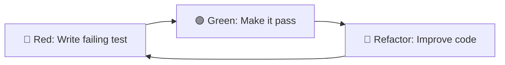

---

## 🐳 Containerization та Docker

**📦 Docker Основи:**
- **🐳 Container** - ізольований процес з власною файловою системою
- **📷 Image** - read-only template для створення контейнерів
- **📄 Dockerfile** - інструкції для збірки image
- **🗃️ Registry** - сховище для Docker images

**📝 Dockerfile для Node.js:**
```dockerfile
FROM node:18-alpine
WORKDIR /app
COPY package*.json ./
RUN npm ci --only=production
COPY . .
EXPOSE 3000
CMD ["npm", "start"]
```

**🔧 Multi-stage Builds:**
```dockerfile
# Build stage
FROM node:18-alpine AS builder
WORKDIR /app
COPY package*.json ./
RUN npm ci
COPY . .
RUN npm run build

# Production stage
FROM node:18-alpine AS production
WORKDIR /app
COPY package*.json ./
RUN npm ci --only=production
COPY --from=builder /app/dist ./dist
CMD ["npm", "start"]
```

**⚖️ Docker vs VM:**
- **🐳 Docker** - shares OS kernel, lightweight
- **🖥️ VM** - full OS, more resource intensive


## ☸️ Kubernetes Basics

**🏗️ K8s Architecture:**
- **👨‍✈️ Master Node** - control plane
- **⚙️ Worker Nodes** - run applications
- **📦 Pods** - smallest deployable units
- **🔄 Services** - network access to pods
- **📊 Deployments** - manage pod replicas

**📄 Basic Deployment:**
```yaml
apiVersion: apps/v1
kind: Deployment
metadata:
  name: api-deployment
spec:
  replicas: 3
  selector:
    matchLabels:
      app: api
  template:
    metadata:
      labels:
        app: api
    spec:
      containers:
      - name: api
        image: myapp:latest
        ports:
        - containerPort: 3000
```

**🔧 K8s Objects:**
- **📦 Pod** - група контейнерів
- **🔄 ReplicaSet** - забезпечує кількість pod-ів
- **📊 Deployment** - управляє ReplicaSet
- **🌐 Service** - мережевий доступ
- **📋 ConfigMap** - конфігураційні дані
- **🔒 Secret** - чутливі дані


## 🔄 GitOps та Infrastructure as Code

**📚 GitOps Principles:**
- **📖 Declarative** - опис бажаного стану
- **📝 Versioned** - все в Git
- **🤖 Automated** - автоматичне застосування змін
- **🔍 Observable** - моніторинг стану

**🛠️ IaC Tools:**
- **🌍 Terraform** - universal infrastructure
- **☁️ CloudFormation** - AWS specific
- **📋 Ansible** - configuration management
- **🏗️ Pulumi** - infrastructure using code

**📄 Terraform Example:**
```hcl
resource "aws_instance" "web" {
  ami           = "ami-0c55b159cbfafe1d0"
  instance_type = "t2.micro"

  tags = {
    Name = "WebServer"
    Environment = "production"
  }
}
```

**🔄 GitOps Workflow:**
1. **📝 Code Change** - developer commits
2. **🤖 CI Pipeline** - build and test
3. **📦 Image Push** - to container registry
4. **🔄 Config Update** - GitOps operator pulls changes
5. **🚀 Deployment** - automatic rollout


## 📊 Advanced Monitoring

**🔍 Distributed Tracing:**
- **📍 Span** - одна операція в trace
- **🔗 Trace** - шлях запиту через систему
- **🏷️ Tags** - додаткові метадані
- **📝 Logs** - події в межах span

**🛠️ Tracing Tools:**
- **🎯 Jaeger** - open source tracing
- **🔍 Zipkin** - distributed tracing system
- **🌐 DataDog APM** - commercial solution
- **📊 New Relic** - full-stack observability

**📈 Metrics Collection:**
```javascript
const prometheus = require('prom-client');

// Custom metric
const httpRequestsTotal = new prometheus.Counter({
  name: 'http_requests_total',
  help: 'Total number of HTTP requests',
  labelNames: ['method', 'route', 'status']
});

// Middleware
app.use((req, res, next) => {
  res.on('finish', () => {
    httpRequestsTotal.inc({
      method: req.method,
      route: req.route?.path || 'unknown',
      status: res.statusCode
    });
  });
  next();
});
```

**📊 RED Method:**
- **📈 Rate** - requests per second
- **🚨 Errors** - error percentage
- **⏱️ Duration** - response time

**📊 USE Method:**
- **🎯 Utilization** - % resource usage
- **📈 Saturation** - queue length
- **🚨 Errors** - error count


## 🔐 Secrets Management

**🚫 Anti-patterns:**
- **📝 Hardcoded secrets** - в коді
- **📄 .env files** - в репозиторії
- **📧 Email/Slack** - передача секретів

**✅ Best Practices:**
- **🔒 Vault** - HashiCorp Vault
- **☁️ Cloud Secrets** - AWS Secrets Manager
- **☸️ K8s Secrets** - для контейнерів
- **🔄 Rotation** - регулярна зміна

**🔧 Environment-specific Secrets:**
```javascript
// config/secrets.js
const getSecrets = async () => {
  if (process.env.NODE_ENV === 'production') {
    // Fetch from AWS Secrets Manager
    return await fetchFromAWS();
  } else {
    // Use local .env for development
    return {
      dbPassword: process.env.DB_PASSWORD,
      jwtSecret: process.env.JWT_SECRET
    };
  }
};
```

**🔒 Secret Scanning:**
- **🕵️ git-secrets** - prevent commits
- **🔍 TruffleHog** - find existing secrets
- **🛡️ GitHub Security** - automated scanning


## 🚨 Incident Response

**📋 Incident Lifecycle:**
1. **🔍 Detection** - моніторинг виявляє проблему
2. **📢 Alert** - сповіщення команди
3. **🎯 Triage** - оцінка серйозності
4. **🔧 Mitigation** - тимчасове рішення
5. **✅ Resolution** - повне виправлення
6. **📝 Post-mortem** - аналіз та навчання

**🚨 Severity Levels:**
- **🔥 P0/SEV1** - повний outage
- **⚠️ P1/SEV2** - значний вплив
- **📊 P2/SEV3** - помірний вплив
- **🔍 P3/SEV4** - мінімальний вплив

**📱 On-call Best Practices:**
- **📋 Runbooks** - покрокові інструкції
- **🔄 Rotation** - справедливий розподіл
- **📊 Escalation** - коли залучати інших
- **💤 Fatigue Management** - запобігання вигоранню

**📝 Post-mortem Template:**
- **📊 Timeline** - що і коли відбулося
- **🎯 Root Cause** - основна причина
- **🔧 Resolution** - як виправили
- **📈 Action Items** - як запобігти в майбутньому


## 🧪 Advanced Testing Patterns

**🎭 Test Patterns:**
- **🏭 Factory Pattern** - створення тестових даних
- **🔨 Builder Pattern** - складні об'єкти
- **📄 Page Object** - UI тестування
- **🎯 AAA Pattern** - Arrange, Act, Assert

**🏭 Test Data Factory:**
```javascript
// factories/userFactory.js
class UserFactory {
  static create(overrides = {}) {
    return {
      id: Math.random(),
      name: 'Test User',
      email: 'test@example.com',
      createdAt: new Date(),
      ...overrides
    };
  }

  static createMany(count, overrides = {}) {
    return Array.from({ length: count }, () =>
      this.create(overrides)
    );
  }
}
```

**🔧 Test Utilities:**
```javascript
// test-utils/database.js
class TestDatabase {
  static async clean() {
    await User.deleteMany({});
    await Post.deleteMany({});
  }

  static async seed() {
    const users = UserFactory.createMany(10);
    await User.insertMany(users);
  }
}
```

**🎯 Contract Testing:**
- **📋 Consumer Contract** - що API споживач очікує
- **🏗️ Provider Contract** - що API надає
- **🔍 Pact** - framework для contract testing


## 🔄 Database Testing Strategies

**🗄️ Database Test Patterns:**
- **🔄 Transaction Rollback** - швидке cleanup
- **📊 In-memory Database** - SQLite, MongoDB Memory
- **🐳 Test Containers** - реальна БД в Docker
- **🏭 Database Fixtures** - попередньо підготовлені дані

**⚡ Fast Database Tests:**
```javascript
// Using transaction rollback
beforeEach(async () => {
  await db.beginTransaction();
});

afterEach(async () => {
  await db.rollback();
});
```

**🐳 Test Containers Example:**
```javascript
const { GenericContainer } = require('testcontainers');

let container;
let pool;

beforeAll(async () => {
  container = await new GenericContainer('postgres:14')
    .withEnvironment({ POSTGRES_DB: 'test' })
    .withExposedPorts(5432)
    .start();

  pool = new Pool({
    host: container.getHost(),
    port: container.getMappedPort(5432),
    database: 'test'
  });
});

afterAll(async () => {
  await pool.end();
  await container.stop();
});
```


## 🎯 Висновки

**🔑 Ключові принципи:**
- 🧪 Тестування як частина процесу розробки
- 🤖 Автоматизація всіх повторюваних процесів
- 📊 Моніторинг як основа для прийняття рішень
- 📈 Поступове впровадження best practices

**🛠️ Інструменти для початку:**
- 🧪 Jest для тестування
- 🤖 GitHub Actions для CI/CD
- ☁️ Railway/Heroku для деплою
- 📝 Winston для логування
- 🔍 Sentry для error tracking

**🚀 Наступні кроки:** практика на реальних проєктах# 🧪 Тестування та деплой backend
### Забезпечення якості та розгортання застосунків


## 📋 План лекції

- **🔬 Основи тестування backend**
- **⚡ Unit тестування з Jest**
- **🔗 Integration тестування API**
- **📊 Test coverage та автоматизація**
- **⚙️ Налаштування середовищ**
- **☁️ Деплой на хмарні платформи**
- **📈 Моніторинг та логування**


## 🤔 Навіщо тестувати backend?

**🎯 Основні причини:**
- 🔍 Виявлення помилок до production
- 💪 Впевненість при змінах коду
- 📚 Документування очікуваної поведінки
- 💰 Зниження вартості виправлення багів

**📈 Статистика:** Виправлення помилки у production коштує в 100 разів дорожче, ніж на етапі розробки


## 🏗️ Типи тестування

```mermaid
pyramid
    title Піраміда тестування
    section E2E
      тестування повного workflow : 10
    section Integration
      тестування взаємодії компонентів : 20
    section Unit
      тестування окремих функцій : 70
```

**🧩 Unit тести** - перевіряють окремі функції
**🔗 Integration тести** - перевіряють взаємодію між модулями
**🌍 E2E тести** - перевіряють повний сценарій користувача


## 🚀 Jest - основний інструмент

**✨ Переваги Jest:**
- ⚡ Нульова конфігурація для початку роботи
- 🛠️ Вбудовані assertions та moking
- 🏃‍♂️ Parallel execution для швидкості
- 📊 Покриття коду з коробки
- 📸 Snapshot тестування

**💻 Встановлення:**
```bash
npm install --save-dev jest
```


## 🧪 Перший unit тест

**🔧 Тестована функція:**
```javascript
function calculateTotal(price, tax) {
    if (price < 0 || tax < 0) {
        throw new Error('Ціна та податок мають бути позитивними');
    }
    return price + (price * tax / 100);
}
```

**✅ Тест:**
```javascript
test('розраховує загальну суму з податком', () => {
    expect(calculateTotal(100, 20)).toBe(120);
});

test('викидає помилку для негативних значень', () => {
    expect(() => calculateTotal(-10, 20)).toThrow();
});
```

**📚 Термінологія:**
- **Test Case** - окремий тест сценарій
- **Test Suite** - група пов'язаних тестів (describe блок)
- **Assertion** - твердження про очікуваний результат


## 📐 Структура тесту

**🔄 Паттерн AAA:**
- **📝 Arrange** - підготовка даних та умов
- **⚡ Act** - виконання тестованої операції
- **🔍 Assert** - перевірка результату

```javascript
test('створює користувача з валідними даними', () => {
    // 📝 Arrange
    const userData = { name: 'Іван', email: 'ivan@test.com' };

    // ⚡ Act
    const user = createUser(userData);

    // 🔍 Assert
    expect(user.name).toBe('Іван');
    expect(user.id).toBeDefined();
});
```


## ⏰ Тестування асинхронного коду

**🔄 З async/await:**
```javascript
test('завантажує дані користувача', async () => {
    const userId = 123;
    const user = await fetchUser(userId);

    expect(user.id).toBe(userId);
    expect(user.name).toBeDefined();
});
```

**🎁 З Promise:**
```javascript
test('створює користувача асинхронно', () => {
    return createUserAsync(userData)
        .then(user => {
            expect(user.email).toBe(userData.email);
        });
});
```


## 🎭 Mocking зовнішніх залежностей

**⚠️ Проблема:** Unit тести не мають залежати від зовнішніх сервісів

**✅ Рішення:** Використання moків для імітації залежностей

```javascript
// 🎭 Мокування модуля
jest.mock('./emailService');

test('відправляє email при реєстрації', async () => {
    const emailService = require('./emailService');
    emailService.send.mockResolvedValue(true);

    await registerUser('test@example.com');

    expect(emailService.send).toHaveBeenCalledWith(
        'test@example.com',
        'Ласкаво просимо!'
    );
});
```

**🔍 Типи Test Doubles:**
- **🎭 Mock** - перевіряє взаємодію з об'єктом
- **🔧 Stub** - повертає заздалегідь визначені значення
- **👤 Fake** - спрощена реалізація (in-memory database)
- **🕵️ Spy** - записує інформацію про виклики
- **🎪 Dummy** - об'єкти-заглушки для параметрів


## 🔗 Integration тести для API

**🏗️ Налаштування тестового середовища:**
```javascript
const request = require('supertest');
const app = require('../src/app');

describe('Users API', () => {
    beforeEach(async () => {
        // 🧹 Очищення тестової бази даних
        await clearDatabase();
        await seedTestData();
    });

    test('створює нового користувача', async () => {
        const userData = {
            name: 'Тест Користувач',
            email: 'test@example.com'
        };

        const response = await request(app)
            .post('/api/users')
            .send(userData)
            .expect(201);

        expect(response.body.name).toBe(userData.name);
    });
});
```

**🧪 Типи Integration тестів:**
- **📡 API Testing** - тестування HTTP endpoints
- **🗄️ Database Integration** - тести з реальною БД
- **🔗 Service Integration** - взаємодія між сервісами
- **📂 File System Testing** - робота з файлами

**📋 Test Lifecycle Hooks:**
- **beforeAll()** - виконується один раз перед всіма тестами
- **beforeEach()** - перед кожним тестом
- **afterEach()** - після кожного тесту
- **afterAll()** - після всіх тестів


## 🔐 Тестування з аутентифікацією

**🎫 Підготовка JWT токена:**
```javascript
const jwt = require('jsonwebtoken');

function createTestToken(userId) {
    return jwt.sign(
        { userId, email: 'test@example.com' },
        process.env.JWT_SECRET,
        { expiresIn: '1h' }
    );
}

test('отримує профіль авторизованого користувача', async () => {
    const token = createTestToken(1);

    const response = await request(app)
        .get('/api/users/profile')
        .set('Authorization', `Bearer ${token}`)
        .expect(200);

    expect(response.body.id).toBe(1);
});
```


## 📊 Test Coverage

**📈 Метрики покриття:**
- **📄 Lines** - відсоток покритих рядків коду
- **🔧 Functions** - відсоток покритих функцій
- **🌿 Branches** - відсоток покритих умовних конструкцій
- **⚡ Statements** - відсоток покритих інструкцій

**🚀 Запуск з coverage:**
```bash
npm test -- --coverage
```

**🎯 Рекомендації:** 80-90% покриття для критичної бізнес-логіки

**📊 Coverage звіти:**
- **📄 Text Report** - консольний вивід
- **🌐 HTML Report** - веб-інтерфейс
- **📋 LCOV** - для CI/CD інтеграції
- **📈 JSON** - для програмної обробки

**⚠️ Coverage Anti-patterns:**
- **Vanity metrics** - фокус на 100% замість якості
- **Testing implementation** - тестування деталей реалізації
- **Brittle tests** - тести що ламаються при рефакторингу


## 🤖 Налаштування GitHub Actions

**⚙️ Базовий workflow (.github/workflows/test.yml):**
```yaml
name: Tests
on: [push, pull_request]

jobs:
  test:
    runs-on: ubuntu-latest

    services:
      postgres:
        image: postgres:14
        env:
          POSTGRES_PASSWORD: testpass
        options: >-
          --health-cmd pg_isready
          --health-interval 10s
          --health-timeout 5s
          --health-retries 5

    steps:
    - uses: actions/checkout@v3
    - uses: actions/setup-node@v3
      with:
        node-version: '18'
    - run: npm ci
    - run: npm test
```

**🔄 CI/CD Термінологія:**
- **🔄 Pipeline** - послідовність етапів автоматизації
- **📝 Workflow** - конфігурація pipeline в GitHub Actions
- **🏃‍♂️ Job** - група кроків що виконуються разом
- **⚡ Step** - окрема дія в job
- **🎯 Action** - перевикористовуваний компонент
- **🎨 Matrix Build** - запуск на різних версіях/платформах
- **🔒 Secrets** - зашифровані змінні середовища

**📊 CI/CD Метрики:**
- **⏱️ Build Time** - час виконання pipeline
- **✅ Success Rate** - відсоток успішних builds
- **🔄 Deployment Frequency** - частота релізів
- **⚡ Lead Time** - час від коміту до production


## ⚙️ Environment конфігурації

**📜 Принцип 12-Factor App:** конфігурація в змінних середовища

**🏗️ Структура конфігурацій:**
```javascript
// config/index.js
const env = process.env.NODE_ENV || 'development';
const configs = {
    development: require('./development'),
    production: require('./production'),
    test: require('./test')
};

module.exports = configs[env];
```

**🔄 Development vs Production:**
- 🗄️ Різні бази даних
- 📝 Різні рівні логування
- 🔒 Різні security налаштування


## ✅ Валідація конфігурацій

**🔍 Використання Joi для валідації:**
```javascript
const Joi = require('joi');

const configSchema = Joi.object({
    port: Joi.number().port().required(),
    database: Joi.object({
        host: Joi.string().required(),
        port: Joi.number().port().required(),
        name: Joi.string().required()
    }).required(),
    jwt: Joi.object({
        secret: Joi.string().min(32).required()
    }).required()
});

function validateConfig(config) {
    const { error } = configSchema.validate(config);
    if (error) {
        throw new Error(`Config validation failed: ${error.message}`);
    }
}
```


## 🚄 Railway - простий деплой

**✨ Переваги Railway:**
- 🔍 Автоматичне виявлення Node.js проєктів
- 🔗 Інтеграція з GitHub
- 🔒 Автоматичне SSL
- 📊 Built-in моніторинг

**📋 Кроки деплою:**
1. 🔗 Підключити GitHub репозиторій до Railway
2. 🏗️ Railway автоматично створює build
3. ⚙️ Налаштувати змінні середовища
4. 🌐 Отримати URL застосунку

**💻 CLI команди:**
```bash
npm install -g @railway/cli
railway login
railway link
railway up
```

**☁️ PaaS vs IaaS vs SaaS:**
- **🏗️ PaaS (Platform as a Service)** - Railway, Heroku
- **🖥️ IaaS (Infrastructure as a Service)** - AWS EC2, Digital Ocean Droplets
- **📱 SaaS (Software as a Service)** - готові застосунки

**🔧 Deployment Термінологія:**
- **🚀 Deploy** - розгортання застосунку
- **🔄 Rolling Update** - поступове оновлення
- **🔵🟢 Blue-Green** - переключення між версіями
- **🐤 Canary Release** - тестування на малій частині
- **🔙 Rollback** - повернення до попередньої версії


## 🟣 Heroku специфіка

**🔧 Особливості Heroku:**
- 📄 Використання Procfile для визначення процесів
- 😴 Dyno sleep після 30 хвилин неактивності
- 💾 Ephemeral filesystem
- 🧩 Addon ecosystem

**📄 Procfile:**
```
web: npm start
worker: node src/worker.js
```

**🐘 Налаштування для PostgreSQL:**
```javascript
const pool = new Pool({
    connectionString: process.env.DATABASE_URL,
    ssl: process.env.NODE_ENV === 'production' ? { rejectUnauthorized: false } : false
});
```

**🏗️ Heroku Architecture:**
- **📦 Dyno** - контейнер для запуску застосунку
- **🔧 Buildpack** - інструменти для збірки
- **🧩 Add-on** - додаткові сервіси (БД, Redis)
- **📊 Metrics** - моніторинг продуктивності
- **📝 Logs** - централізоване логування

**💰 Heroku Pricing Tiers:**
- **🆓 Free** - обмеження та dyno sleep
- **💼 Hobby** - always-on, custom domains
- **🏢 Professional** - auto-scaling, advanced metrics


## 🌊 Digital Ocean варіанти

**☁️ App Platform (PaaS):**
- 🔄 Схожий на Heroku досвід
- 📄 YAML конфігурація
- 📈 Автоматичне масштабування

**💻 Droplets (IaaS):**
- 🎛️ Повний контроль над сервером
- 🔧 Використання PM2 для process management
- ⚙️ Ручне налаштування nginx, SSL

**⚙️ Конфігурація PM2:**
```javascript
module.exports = {
  apps: [{
    name: 'api-server',
    script: './src/server.js',
    instances: 'max',
    exec_mode: 'cluster',
    env_production: {
      NODE_ENV: 'production',
      PORT: 8080
    }
  }]
};
```


## 📝 Winston для логування

**⚙️ Налаштування логера:**
```javascript
const winston = require('winston');

const logger = winston.createLogger({
    level: process.env.LOG_LEVEL || 'info',
    format: winston.format.combine(
        winston.format.timestamp(),
        winston.format.errors({ stack: true }),
        winston.format.json()
    ),
    transports: [
        new winston.transports.File({ filename: 'logs/error.log', level: 'error' }),
        new winston.transports.File({ filename: 'logs/combined.log' })
    ]
});

if (process.env.NODE_ENV !== 'production') {
    logger.add(new winston.transports.Console({
        format: winston.format.simple()
    }));
}
```

**📊 Logging Levels (RFC 5424):**
- **🚨 error** - помилки що вимагають уваги
- **⚠️ warn** - потенційні проблеми
- **ℹ️ info** - загальна інформація
- **🔍 debug** - детальна діагностична інформація
- **📝 verbose** - додаткова деталізація
- **🎯 silly** - найбільш детальний рівень

**🏗️ Structured Logging:**
- **JSON формат** для легкої обробки
- **Correlation ID** для трекінгу запитів
- **Context fields** - додаткова інформація
- **Sanitization** - видалення чутливих даних


## 🌐 HTTP Request Logging

**🔍 Middleware для логування запитів:**
```javascript
function requestLogger(req, res, next) {
    const start = Date.now();

    res.on('finish', () => {
        const duration = Date.now() - start;

        logger.info('HTTP Request', {
            method: req.method,
            url: req.url,
            statusCode: res.statusCode,
            duration,
            userAgent: req.get('user-agent'),
            ip: req.ip
        });
    });

    next();
}

app.use(requestLogger);
```


## 💚 Health Check endpoint

**✅ Базовий health check:**
```javascript
app.get('/health', async (req, res) => {
    const health = {
        status: 'ok',
        timestamp: new Date().toISOString(),
        uptime: process.uptime(),
        version: process.env.npm_package_version
    };

    try {
        // 🗄️ Перевірка бази даних
        await pool.query('SELECT 1');
        health.database = 'connected';
    } catch (error) {
        health.status = 'error';
        health.database = 'disconnected';
    }

    const statusCode = health.status === 'ok' ? 200 : 503;
    res.status(statusCode).json(health);
});
```

**🩺 Типи Health Checks:**
- **💚 Liveness Probe** - чи працює застосунок
- **📋 Readiness Probe** - чи готовий приймати трафік
- **🚀 Startup Probe** - чи завершилась ініціалізація

**📊 Health Check Patterns:**
- **🔍 Shallow** - базова перевірка процесу
- **🏊‍♂️ Deep** - перевірка всіх залежностей
- **⏱️ Cached** - кешування результатів перевірок
- **🎯 Synthetic** - імітація користувацьких дій


## 🚨 Error Handling

**🎯 Централізований error handler:**
```javascript
function errorHandler(error, req, res, next) {
    logger.error('Unhandled error', {
        error: error.message,
        stack: error.stack,
        url: req.url,
        method: req.method,
        userId: req.user?.id
    });

    let statusCode = 500;
    let message = 'Internal server error';

    if (error.name === 'ValidationError') {
        statusCode = 400;
        message = error.message;
    }

    res.status(statusCode).json({ error: message });
}

app.use(errorHandler);
```


## 🔍 Моніторинг з Sentry

**⚙️ Налаштування Sentry:**
```javascript
const Sentry = require('@sentry/node');

Sentry.init({
    dsn: process.env.SENTRY_DSN,
    environment: process.env.NODE_ENV
});

app.use(Sentry.Handlers.requestHandler());
app.use(Sentry.Handlers.errorHandler());

// 📤 Ручне відправлення помилки
function trackError(error, context) {
    Sentry.captureException(error, {
        tags: context,
        user: { id: context.userId }
    });
}
```


## ⚡ Performance моніторинг

**📊 Збір метрик продуктивності:**
```javascript
function performanceMiddleware(req, res, next) {
    const start = process.hrtime.bigint();

    res.on('finish', () => {
        const duration = Number(process.hrtime.bigint() - start) / 1000000; // ms

        // 📤 Відправка метрик
        if (duration > 1000) { // Повільні запити
            logger.warn('Slow request', {
                method: req.method,
                url: req.url,
                duration
            });
        }
    });

    next();
}
```


## 🗄️ Database моніторинг

**📊 Моніторинг connection pool:**
```javascript
const pool = new Pool({
    // ... конфігурація
    max: 20,
    idleTimeoutMillis: 30000,
    connectionTimeoutMillis: 2000
});

// 📈 Моніторинг стану пулу
setInterval(() => {
    const { totalCount, idleCount, waitingCount } = pool;

    logger.info('Database pool stats', {
        totalConnections: totalCount,
        idleConnections: idleCount,
        waitingConnections: waitingCount
    });

    if (waitingCount > 5) {
        logger.warn('High database connection wait queue');
    }
}, 60000);
```


## 🔄 CI/CD Best Practices

**📋 Етапи pipeline:**
1. **📝 Code Quality** - linting, formatting
2. **🔒 Security** - vulnerability scanning
3. **🧪 Testing** - unit, integration, E2E
4. **🏗️ Build** - compilation, bundling
5. **🚀 Deploy** - staging, production
6. **✅ Post-deploy** - smoke tests, monitoring

**🎯 Стратегії деплою:**
- **🔄 Rolling deployment** - поступова заміна instances
- **🔵🟢 Blue-green deployment** - переключення між версіями
- **🐤 Canary deployment** - тестування на частині трафіку


## 🔒 Security в тестуванні

**🔍 SAST (Static Analysis):**
```bash
npm audit --audit-level high
npx eslint-plugin-security src/
```

**📦 Dependency scanning:**
```yaml
- name: Run Snyk security scan
  uses: snyk/actions/node@master
  env:
    SNYK_TOKEN: ${{ secrets.SNYK_TOKEN }}
```

**🛡️ Integration тести безпеки:**
- 🚦 Rate limiting тестування
- 🔐 Authentication bypass спроби
- 💉 SQL injection захист
- 🌍 CORS налаштування


## 💡 Практичні рекомендації

**📁 Структура тестів:**
```
tests/
├── unit/           # Unit тести
├── integration/    # Integration тести
├── fixtures/       # Тестові дані
└── helpers/        # Допоміжні функції
```

**📝 Naming conventions:**
- 🧪 Тести: `*.test.js` або `*.spec.js`
- 📄 Fixtures: `*.fixture.js`
- 🎭 Mocks: `__mocks__/`

**🗄️ Test data management:**
- 🏭 Використання factory functions
- 🧹 Cleanup після кожного тесту
- 🔒 Ізоляція тестових даних


## 🐛 Debugging тестів

**🔍 Jest debugging:**
```bash
node --inspect-brk node_modules/.bin/jest --runInBand test/specific.test.js
```

**🔧 VS Code конфігурація:**
```json
{
    "type": "node",
    "request": "launch",
    "name": "Jest Debug",
    "program": "${workspaceFolder}/node_modules/.bin/jest",
    "args": ["--runInBand"],
    "console": "integratedTerminal"
}
```

**🚩 Корисні флаги:**
- 👀 `--watch` - автоматичний перезапуск
- 📝 `--verbose` - детальний вивід
- 🛑 `--bail` - зупинка при першій помилці


## 📈 Масштабування тестів

**🏃‍♂️ Паралелізація:**
- ⚡ Jest workers для unit тестів
- 🔄 Parallel CI jobs для різних test suites
- 🔪 Test sharding для великих проєктів

**🚀 Оптимізація швидкості:**
- 💾 In-memory database для unit тестів
- 📊 Shared fixtures для integration тестів
- 🎯 Selective test running (тільки змінені файли)

**🗄️ Управління test data:**
- 🌱 Database seeding стратегії
- 🐳 Test containers для ізоляції
- 💾 Backup/restore механізми


## 📊 Моніторинг в production

**🎯 Key metrics:**
- ⏱️ **Response time** - час відповіді API
- 🚀 **Throughput** - кількість запитів/секунду
- 🚨 **Error rate** - відсоток помилкових запитів
- 💻 **Resource utilization** - CPU, память, disk

**🔔 Alerting правила:**
- 📈 Error rate > 5% протягом 5 хвилин
- ⏱️ Response time > 2 секунди протягом 1 хвилини
- 🗄️ Database connections > 80% від ліміту
- 💾 Memory usage > 90%

**📊 Four Golden Signals (Google SRE):**
- **⚡ Latency** - час відповіді
- 🚨 **Errors** - кількість помилок
- 🚀 **Traffic** - навантаження системи
- 🔋 **Saturation** - використання ресурсів

**📈 SLI/SLO/SLA:**
- **📊 SLI (Service Level Indicator)** - метрика якості
- **🎯 SLO (Service Level Objective)** - цільові значення
- **📜 SLA (Service Level Agreement)** - договірні зобов'язання

**🔍 Observability Pillars:**
- **📝 Logs** - події що відбулися
- **📊 Metrics** - числові показники
- **🔍 Traces** - шлях запиту через систему


## 🔥 Test-Driven Development (TDD)



**🔄 TDD Цикл:**
1. **🔴 Red** - написати тест що не проходить
2. **🟢 Green** - написати мінімальний код для проходження
3. **🔵 Refactor** - покращити код зберігши функціональність

**📚 TDD Принципи:**
- **YAGNI** - You Aren't Gonna Need It
- **KISS** - Keep It Simple, Stupid
- **DRY** - Don't Repeat Yourself
- **SOLID** - принципи об'єктно-орієнтованого дизайну

**⚖️ TDD vs BDD:**
- **🧪 TDD** - Test-Driven Development (технічний фокус)
- **📋 BDD** - Behavior-Driven Development (бізнес фокус)


## 🔒 Security Testing

**🛡️ SAST vs DAST:**
- **🔍 SAST (Static)** - аналіз коду без виконання
- **🎯 DAST (Dynamic)** - тестування працюючого застосунку

**🔧 Security Testing Tools:**
```bash
# Vulnerability scanning
npm audit --audit-level high
npx snyk test

# Code quality
npx eslint-plugin-security src/
npx semgrep --config=auto src/
```

**🎯 OWASP Top 10 Testing:**
- **💉 Injection** - SQL, NoSQL, Command injection
- **🔐 Broken Authentication** - session management
- **📊 Sensitive Data Exposure** - encryption, storage
- **🌐 XXE** - XML External Entities
- **🚫 Broken Access Control** - authorization flaws

**🔒 Security Headers Testing:**
- **🛡️ HSTS** - HTTP Strict Transport Security
- **🎭 CSP** - Content Security Policy
- **🚫 X-Frame-Options** - clickjacking protection
- **🔒 X-Content-Type-Options** - MIME type sniffing


## 📊 Performance Testing

**⚡ Types of Performance Testing:**
- **📈 Load Testing** - нормальне навантаження
- **🚀 Stress Testing** - максимальне навантаження
- **💥 Spike Testing** - різкі стрибки трафіку
- **⏱️ Volume Testing** - великі обсяги даних
- **🔄 Endurance Testing** - тривале навантаження

**📊 Performance Metrics:**
- **⏱️ Response Time** - час відповіді
- **🚀 Throughput** - requests per second
- **👥 Concurrent Users** - одночасні користувачі
- **📈 CPU/Memory Usage** - використання ресурсів
- **🗄️ Database Performance** - query execution time

**🛠️ Performance Testing Tools:**
- **Artillery** - load testing for APIs
- **k6** - modern load testing
- **Apache JMeter** - comprehensive testing
- **Lighthouse** - web performance auditing

**🔑 Ключові принципи:**
- 🧪 Тестування як частина процесу розробки
- 🤖 Автоматизація всіх повторюваних процесів
- 📊 Моніторинг як основа для прийняття рішень
- 📈 Поступове впровадження best practices

**🛠️ Інструменти для початку:**
- 🧪 Jest для тестування
- 🤖 GitHub Actions для CI/CD
- ☁️ Railway/Heroku для деплою
- 📝 Winston для логування
- 🔍 Sentry для error tracking

**🚀 Наступні кроки:** практика на реальних проєктах


## ❓ Запитання та обговорення

**💬 Теми для дискусії:**
- 📊 Досвід команди з тестуванням
- ☁️ Вибір платформи для деплою
- 📈 Стратегії моніторингу
- 🎯 Challenges у production

**📚 Корисні ресурси:**
- 📖 Jest Documentation
- 🤖 GitHub Actions Marketplace
- ☁️ Cloud Platform Docs
- 📊 Monitoring Best Practices        node-version: '18'
    - run: npm ci
    - run: npm test
```


## ⚙️ Environment конфігурації

**📜 Принцип 12-Factor App:** конфігурація в змінних середовища

**🏗️ Структура конфігурацій:**
```javascript
// config/index.js
const env = process.env.NODE_ENV || 'development';
const configs = {
    development: require('./development'),
    production: require('./production'),
    test: require('./test')
};

module.exports = configs[env];
```

**🔄 Development vs Production:**
- 🗄️ Різні бази даних
- 📝 Різні рівні логування
- 🔒 Різні security налаштування


## Валідація конфігурацій

**Використання Joi для валідації:**
```javascript
const Joi = require('joi');

const configSchema = Joi.object({
    port: Joi.number().port().required(),
    database: Joi.object({
        host: Joi.string().required(),
        port: Joi.number().port().required(),
        name: Joi.string().required()
    }).required(),
    jwt: Joi.object({
        secret: Joi.string().min(32).required()
    }).required()
});

function validateConfig(config) {
    const { error } = configSchema.validate(config);
    if (error) {
        throw new Error(`Config validation failed: ${error.message}`);
    }
}
```


## Railway - простий деплой

**Переваги Railway:**
- Автоматичне виявлення Node.js проєктів
- Інтеграція з GitHub
- Автоматичне SSL
- Built-in моніторинг

**Кроки деплою:**
1. Підключити GitHub репозиторій до Railway
2. Railway автоматично створює build
3. Налаштувати змінні середовища
4. Отримати URL застосунку

**CLI команди:**
```bash
npm install -g @railway/cli
railway login
railway link
railway up
```


## Heroku специфіка

**Особливості Heroku:**
- Використання Procfile для визначення процесів
- Dyno sleep після 30 хвилин неактивності
- Ephemeral filesystem
- Addon ecosystem

**Procfile:**
```
web: npm start
worker: node src/worker.js
```

**Налаштування для PostgreSQL:**
```javascript
const pool = new Pool({
    connectionString: process.env.DATABASE_URL,
    ssl: process.env.NODE_ENV === 'production' ? { rejectUnauthorized: false } : false
});
```


## Digital Ocean варіанти

**App Platform (PaaS):**
- Схожий на Heroku досвід
- YAML конфігурація
- Автоматичне масштабування

**Droplets (IaaS):**
- Повний контроль над сервером
- Використання PM2 для process management
- Ручне налаштування nginx, SSL

**Конфігурація PM2:**
```javascript
module.exports = {
  apps: [{
    name: 'api-server',
    script: './src/server.js',
    instances: 'max',
    exec_mode: 'cluster',
    env_production: {
      NODE_ENV: 'production',
      PORT: 8080
    }
  }]
};
```


## Winston для логування

**Налаштування логера:**
```javascript
const winston = require('winston');

const logger = winston.createLogger({
    level: process.env.LOG_LEVEL || 'info',
    format: winston.format.combine(
        winston.format.timestamp(),
        winston.format.errors({ stack: true }),
        winston.format.json()
    ),
    transports: [
        new winston.transports.File({ filename: 'logs/error.log', level: 'error' }),
        new winston.transports.File({ filename: 'logs/combined.log' })
    ]
});

if (process.env.NODE_ENV !== 'production') {
    logger.add(new winston.transports.Console({
        format: winston.format.simple()
    }));
}
```


## HTTP Request Logging

**Middleware для логування запитів:**
```javascript
function requestLogger(req, res, next) {
    const start = Date.now();

    res.on('finish', () => {
        const duration = Date.now() - start;

        logger.info('HTTP Request', {
            method: req.method,
            url: req.url,
            statusCode: res.statusCode,
            duration,
            userAgent: req.get('user-agent'),
            ip: req.ip
        });
    });

    next();
}

app.use(requestLogger);
```


## Health Check endpoint

**Базовий health check:**
```javascript
app.get('/health', async (req, res) => {
    const health = {
        status: 'ok',
        timestamp: new Date().toISOString(),
        uptime: process.uptime(),
        version: process.env.npm_package_version
    };

    try {
        // Перевірка бази даних
        await pool.query('SELECT 1');
        health.database = 'connected';
    } catch (error) {
        health.status = 'error';
        health.database = 'disconnected';
    }

    const statusCode = health.status === 'ok' ? 200 : 503;
    res.status(statusCode).json(health);
});
```


## Error Handling

**Централізований error handler:**
```javascript
function errorHandler(error, req, res, next) {
    logger.error('Unhandled error', {
        error: error.message,
        stack: error.stack,
        url: req.url,
        method: req.method,
        userId: req.user?.id
    });

    let statusCode = 500;
    let message = 'Internal server error';

    if (error.name === 'ValidationError') {
        statusCode = 400;
        message = error.message;
    }

    res.status(statusCode).json({ error: message });
}

app.use(errorHandler);
```


## Моніторинг з Sentry

**Налаштування Sentry:**
```javascript
const Sentry = require('@sentry/node');

Sentry.init({
    dsn: process.env.SENTRY_DSN,
    environment: process.env.NODE_ENV
});

app.use(Sentry.Handlers.requestHandler());
app.use(Sentry.Handlers.errorHandler());

// Ручне відправлення помилки
function trackError(error, context) {
    Sentry.captureException(error, {
        tags: context,
        user: { id: context.userId }
    });
}
```


## Performance моніторинг

**Збір метрик продуктивності:**
```javascript
function performanceMiddleware(req, res, next) {
    const start = process.hrtime.bigint();

    res.on('finish', () => {
        const duration = Number(process.hrtime.bigint() - start) / 1000000; // ms

        // Відправка метрик
        if (duration > 1000) { // Повільні запити
            logger.warn('Slow request', {
                method: req.method,
                url: req.url,
                duration
            });
        }
    });

    next();
}
```


## Database моніторинг

**Моніторинг connection pool:**
```javascript
const pool = new Pool({
    // ... конфігурація
    max: 20,
    idleTimeoutMillis: 30000,
    connectionTimeoutMillis: 2000
});

// Моніторинг стану пулу
setInterval(() => {
    const { totalCount, idleCount, waitingCount } = pool;

    logger.info('Database pool stats', {
        totalConnections: totalCount,
        idleConnections: idleCount,
        waitingConnections: waitingCount
    });

    if (waitingCount > 5) {
        logger.warn('High database connection wait queue');
    }
}, 60000);
```


## CI/CD Best Practices

**Етапи pipeline:**
1. **Code Quality** - linting, formatting
2. **Security** - vulnerability scanning
3. **Testing** - unit, integration, E2E
4. **Build** - compilation, bundling
5. **Deploy** - staging, production
6. **Post-deploy** - smoke tests, monitoring

**Стратегії деплою:**
- **Rolling deployment** - поступова заміна instances
- **Blue-green deployment** - переключення між версіями
- **Canary deployment** - тестування на частині трафіку


## Security в тестуванні

**SAST (Static Analysis):**
```bash
npm audit --audit-level high
npx eslint-plugin-security src/
```

**Dependency scanning:**
```yaml
- name: Run Snyk security scan
  uses: snyk/actions/node@master
  env:
    SNYK_TOKEN: ${{ secrets.SNYK_TOKEN }}
```

**Integration тести безпеки:**
- Rate limiting тестування
- Authentication bypass спроби
- SQL injection захист
- CORS налаштування


## Практичні рекомендації

**Структура тестів:**
```
tests/
├── unit/           # Unit тести
├── integration/    # Integration тести
├── fixtures/       # Тестові дані
└── helpers/        # Допоміжні функції
```

**Naming conventions:**
- Тести: `*.test.js` або `*.spec.js`
- Fixtures: `*.fixture.js`
- Mocks: `__mocks__/`

**Test data management:**
- Використання factory functions
- Cleanup після кожного тесту
- Ізоляція тестових даних


## Debugging тестів

**Jest debugging:**
```bash
node --inspect-brk node_modules/.bin/jest --runInBand test/specific.test.js
```

**VS Code конфігурація:**
```json
{
    "type": "node",
    "request": "launch",
    "name": "Jest Debug",
    "program": "${workspaceFolder}/node_modules/.bin/jest",
    "args": ["--runInBand"],
    "console": "integratedTerminal"
}
```

**Корисні флаги:**
- `--watch` - автоматичний перезапуск
- `--verbose` - детальний вивід
- `--bail` - зупинка при першій помилці


## Масштабування тестів

**Паралелізація:**
- Jest workers для unit тестів
- Parallel CI jobs для різних test suites
- Test sharding для великих проєктів

**Оптимізація швидкості:**
- In-memory database для unit тестів
- Shared fixtures для integration тестів
- Selective test running (тільки змінені файли)

**Управління test data:**
- Database seeding стратегії
- Test containers для ізоляції
- Backup/restore механізми


## Моніторинг в production

**Key metrics:**
- **Response time** - час відповіді API
- **Throughput** - кількість запитів/секунду
- **Error rate** - відсоток помилкових запитів
- **Resource utilization** - CPU, память, disk

**Alerting правила:**
- Error rate > 5% протягом 5 хвилин
- Response time > 2 секунди протягом 1 хвилини
- Database connections > 80% від ліміту
- Memory usage > 90%


## Висновки

**Ключові принципи:**
- Тестування як частина процесу розробки
- Автоматизація всіх повторюваних процесів
- Моніторинг як основа для прийняття рішень
- Поступове впровадження best practices

**Інструменти для початку:**
- Jest для тестування
- GitHub Actions для CI/CD
- Railway/Heroku для деплою
- Winston для логування
- Sentry для error tracking
