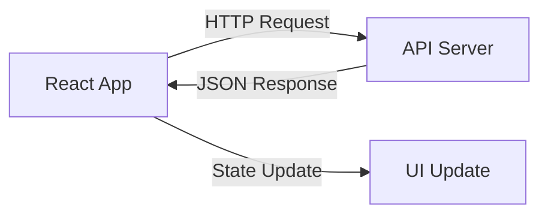
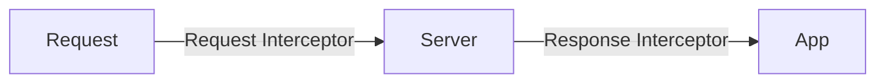

# HTTP клієнт та інтеграція з backend

---

## План лекції

- Axios: потужний HTTP клієнт
- Interceptors для запитів та відповідей
- Обробка помилок API
- Loading стани та UX
- Кешування запитів
- React Query для data fetching
- Оптимістичні оновлення

---

## Взаємодія Frontend ↔ Backend



**Основні виклики:**
- Асинхронність операцій
- Обробка помилок
- Управління станами завантаження
- Кешування даних
- Оптимізація запитів

---

## Fetch API vs Axios

**Fetch API (нативний):**
```javascript
const response = await fetch('/api/users');
const data = await response.json();
if (!response.ok) {
    throw new Error('Error');
}
```

**Axios (бібліотека):**
```javascript
const { data } = await axios.get('/api/users');
// Автоматична обробка JSON
// Вбудована обробка помилок
```

**Переваги Axios:**
- Автоматична трансформація JSON
- Interceptors
- Timeout підтримка
- Відміна запитів
- Захист від CSRF

---

## Налаштування Axios

```javascript
import axios from 'axios';

const api = axios.create({
    baseURL: 'https://api.example.com',
    timeout: 10000,
    headers: {
        'Content-Type': 'application/json'
    }
});

// Використання
const response = await api.get('/users');
const user = await api.post('/users', userData);
const updated = await api.put('/users/1', newData);
await api.delete('/users/1');
```

---

## CRUD операції з Axios

```javascript
// CREATE
async function createUser(userData) {
    const response = await api.post('/users', userData);
    return response.data;
}

// READ
async function getUser(userId) {
    const response = await api.get(`/users/${userId}`);
    return response.data;
}

// UPDATE
async function updateUser(userId, data) {
    const response = await api.put(`/users/${userId}`, data);
    return response.data;
}

// DELETE
async function deleteUser(userId) {
    await api.delete(`/users/${userId}`);
}
```

---

## Interceptors: концепція

**Request Interceptor** - обробка перед відправкою:
- Додавання токенів авторизації
- Логування запитів
- Модифікація headers

**Response Interceptor** - обробка після отримання:
- Централізована обробка помилок
- Логування відповідей
- Трансформація даних



---

## Request Interceptor

```javascript
api.interceptors.request.use(
    (config) => {
        // Додавання токена до кожного запиту
        const token = localStorage.getItem('authToken');
        if (token) {
            config.headers.Authorization = `Bearer ${token}`;
        }
        
        // Логування
        console.log('Запит:', config.method, config.url);
        
        // Додавання timestamp
        config.metadata = { startTime: new Date() };
        
        return config;
    },
    (error) => {
        console.error('Помилка запиту:', error);
        return Promise.reject(error);
    }
);
```

---

## Response Interceptor

```javascript
api.interceptors.response.use(
    (response) => {
        // Обчислення часу запиту
        const duration = new Date() - response.config.metadata.startTime;
        
        console.log(
            'Відповідь:',
            response.config.url,
            `${duration}ms`
        );
        
        return response;
    },
    (error) => {
        // Централізована обробка помилок
        if (error.response?.status === 401) {
            // Перенаправлення на логін
            window.location.href = '/login';
        }
        
        return Promise.reject(error);
    }
);
```

---

## Автоматичне оновлення токенів

```javascript
let isRefreshing = false;
let failedQueue = [];

api.interceptors.response.use(
    response => response,
    async error => {
        const originalRequest = error.config;
        
        if (error.response?.status === 401 && !originalRequest._retry) {
            if (isRefreshing) {
                // Додати в чергу
                return new Promise((resolve, reject) => {
                    failedQueue.push({ resolve, reject });
                });
            }
            
            originalRequest._retry = true;
            isRefreshing = true;
            
            // Оновити токен
            const newToken = await refreshToken();
            originalRequest.headers.Authorization = `Bearer ${newToken}`;
            
            return api(originalRequest);
        }
        
        return Promise.reject(error);
    }
);
```

---

## Типізація помилок

```javascript
class APIError extends Error {
    constructor(message, status, data) {
        super(message);
        this.name = 'APIError';
        this.status = status;
        this.data = data;
    }
}

class NetworkError extends Error {
    constructor(message) {
        super(message);
        this.name = 'NetworkError';
    }
}

class ValidationError extends APIError {
    constructor(message, errors) {
        super(message, 422, errors);
        this.name = 'ValidationError';
        this.errors = errors;
    }
}
```

---

## Централізована обробка помилок

```javascript
api.interceptors.response.use(
    response => response,
    error => {
        if (error.response) {
            const { status, data } = error.response;
            
            switch (status) {
                case 400:
                    throw new APIError('Bad Request', 400, data);
                case 401:
                    throw new APIError('Unauthorized', 401, data);
                case 404:
                    throw new APIError('Not Found', 404, data);
                case 422:
                    throw new ValidationError('Validation failed', data.errors);
                case 500:
                    throw new APIError('Server Error', 500, data);
                default:
                    throw new APIError('Unknown Error', status, data);
            }
        } else if (error.request) {
            throw new NetworkError('No response from server');
        }
        throw new Error(error.message);
    }
);
```

---

## Loading стани в компонентах

```javascript
function UserList() {
    const [users, setUsers] = useState([]);
    const [isLoading, setIsLoading] = useState(false);
    const [error, setError] = useState(null);

    const fetchUsers = async () => {
        try {
            setIsLoading(true);
            setError(null);
            
            const response = await api.get('/users');
            setUsers(response.data);
        } catch (err) {
            setError(err.message);
        } finally {
            setIsLoading(false);
        }
    };

    if (isLoading) return <Spinner />;
    if (error) return <ErrorMessage error={error} />;
    
    return <UserListView users={users} />;
}
```

---

## Skeleton Screens

**Замість спіннера - skeleton:**

```javascript
function SkeletonCard() {
    return (
        <div className="skeleton-card">
            <div className="skeleton skeleton-avatar" />
            <div className="skeleton skeleton-title" />
            <div className="skeleton skeleton-text" />
        </div>
    );
}

function UserList() {
    const [users, setUsers] = useState([]);
    const [isLoading, setIsLoading] = useState(true);

    return (
        <div>
            {isLoading ? (
                <>
                    <SkeletonCard />
                    <SkeletonCard />
                    <SkeletonCard />
                </>
            ) : (
                users.map(user => <UserCard key={user.id} user={user} />)
            )}
        </div>
    );
}
```

---

## Простий кеш в пам'яті

```javascript
class APICache {
    constructor(ttl = 300000) { // 5 хвилин
        this.cache = new Map();
        this.ttl = ttl;
    }

    get(key) {
        const cached = this.cache.get(key);
        if (!cached) return null;
        
        if (Date.now() - cached.timestamp > this.ttl) {
            this.cache.delete(key);
            return null;
        }
        
        return cached.data;
    }

    set(key, data) {
        this.cache.set(key, {
            data,
            timestamp: Date.now()
        });
    }
}
```

---

## Використання кешу

```javascript
const apiCache = new APICache();

async function cachedGet(url, params = {}) {
    const cacheKey = `${url}?${JSON.stringify(params)}`;
    
    // Перевірка кешу
    const cached = apiCache.get(cacheKey);
    if (cached) {
        console.log('Використання кешу');
        return cached;
    }
    
    // Запит до API
    const response = await api.get(url, { params });
    const data = response.data;
    
    // Збереження в кеш
    apiCache.set(cacheKey, data);
    
    return data;
}

// Використання
const users = await cachedGet('/users');
```

---

## React Query: революція в data fetching

**Проблеми традиційного підходу:**
- Ручне управління loading/error станами
- Дублювання логіки кешування
- Складна синхронізація даних
- Відсутність фонових оновлень

**Рішення - React Query:**
- Декларативний data fetching
- Автоматичне кешування
- Фонові оновлення
- Оптимістичні оновлення

```bash
npm install @tanstack/react-query
```

---

## React Query: базове використання

```javascript
import { useQuery } from '@tanstack/react-query';

function UserList() {
    const {
        data: users,
        isLoading,
        isError,
        error,
        refetch
    } = useQuery({
        queryKey: ['users'],
        queryFn: async () => {
            const response = await api.get('/users');
            return response.data;
        },
        staleTime: 300000, // 5 хвилин
        cacheTime: 600000  // 10 хвилин
    });

    if (isLoading) return <div>Завантаження...</div>;
    if (isError) return <div>Помилка: {error.message}</div>;

    return <UserListView users={users} onRefresh={refetch} />;
}
```

---

## React Query: Mutations

```javascript
import { useMutation, useQueryClient } from '@tanstack/react-query';

function CreateUser() {
    const queryClient = useQueryClient();

    const mutation = useMutation({
        mutationFn: (userData) => api.post('/users', userData),
        
        onSuccess: (newUser) => {
            // Оновлення кешу
            queryClient.setQueryData(['users'], (old) => 
                [...old, newUser.data]
            );
            
            toast.success('Користувача створено');
        },
        
        onError: (error) => {
            toast.error('Помилка створення');
        }
    });

    return (
        <button onClick={() => mutation.mutate({ name: 'Іван' })}>
            Створити
        </button>
    );
}
```

---

## Оптимістичні оновлення

**Концепція:** оновлювати UI миттєво, відкочувати при помилці

```javascript
const updateMutation = useMutation({
    mutationFn: updateUser,
    
    onMutate: async (newData) => {
        // Скасування поточних запитів
        await queryClient.cancelQueries(['users']);
        
        // Збереження попереднього стану
        const previous = queryClient.getQueryData(['users']);
        
        // Оптимістичне оновлення
        queryClient.setQueryData(['users'], (old) =>
            old.map(user => 
                user.id === newData.id ? { ...user, ...newData } : user
            )
        );
        
        return { previous };
    },
    
    onError: (err, variables, context) => {
        // Відкат при помилці
        queryClient.setQueryData(['users'], context.previous);
    }
});
```

---

## Паралельне vs Послідовне завантаження

**Паралельне (ефективно):**
```javascript
function Dashboard() {
    const { data: users } = useQuery(['users'], fetchUsers);
    const { data: posts } = useQuery(['posts'], fetchPosts);
    const { data: stats } = useQuery(['stats'], fetchStats);
    
    // Всі запити виконуються одночасно
    return <DashboardView {...{ users, posts, stats }} />;
}
```

**Послідовне (неефективно):**
```javascript
// ❌ Погано
const users = await fetchUsers();    // ~1 сек
const posts = await fetchPosts();    // ~1 сек
const stats = await fetchStats();    // ~1 сек
// Загалом: ~3 секунди
```

---

## Залежні запити

```javascript
function UserProfile({ userId }) {
    // Спочатку користувач
    const { data: user } = useQuery({
        queryKey: ['user', userId],
        queryFn: () => fetchUser(userId)
    });

    // Потім пости (залежить від user)
    const { data: posts } = useQuery({
        queryKey: ['posts', userId],
        queryFn: () => fetchUserPosts(userId),
        enabled: !!user  // Виконується тільки якщо user є
    });

    if (!user) return <Loading />;

    return (
        <div>
            <UserInfo user={user} />
            {posts && <PostList posts={posts} />}
        </div>
    );
}
```

---

## Інвалідація кешу

```javascript
function UserManager() {
    const queryClient = useQueryClient();

    const deleteMutation = useMutation({
        mutationFn: deleteUser,
        
        onSuccess: () => {
            // Інвалідувати кеш користувачів
            queryClient.invalidateQueries(['users']);
            
            // Або видалити конкретний запит
            queryClient.removeQueries(['user', userId]);
            
            // Або оновити вручну
            queryClient.setQueryData(['users'], (old) =>
                old.filter(u => u.id !== userId)
            );
        }
    });

    return <button onClick={() => deleteMutation.mutate(userId)}>
        Видалити
    </button>;
}
```

---

## Prefetching даних

```javascript
function UserList() {
    const queryClient = useQueryClient();

    const { data: users } = useQuery(['users'], fetchUsers);

    const handleMouseEnter = (userId) => {
        // Попереднє завантаження даних користувача
        queryClient.prefetchQuery({
            queryKey: ['user', userId],
            queryFn: () => fetchUser(userId),
            staleTime: 60000
        });
    };

    return (
        <div>
            {users.map(user => (
                <UserCard
                    key={user.id}
                    user={user}
                    onMouseEnter={() => handleMouseEnter(user.id)}
                />
            ))}
        </div>
    );
}
```

---

## Pagination з React Query

```javascript
function PaginatedUsers() {
    const [page, setPage] = useState(1);

    const { data, isLoading } = useQuery({
        queryKey: ['users', page],
        queryFn: () => fetchUsers(page),
        keepPreviousData: true  // Показувати попередні дані при завантаженні
    });

    return (
        <div>
            {isLoading && <Spinner />}
            
            <UserList users={data?.users} />
            
            <Pagination
                currentPage={page}
                totalPages={data?.totalPages}
                onPageChange={setPage}
            />
        </div>
    );
}
```

---

## Infinite Scroll

```javascript
function InfiniteUserList() {
    const {
        data,
        fetchNextPage,
        hasNextPage,
        isFetchingNextPage
    } = useInfiniteQuery({
        queryKey: ['users'],
        queryFn: ({ pageParam = 1 }) => fetchUsers(pageParam),
        getNextPageParam: (lastPage) => lastPage.nextPage
    });

    return (
        <div>
            {data?.pages.map(page =>
                page.users.map(user => <UserCard key={user.id} user={user} />)
            )}
            
            {hasNextPage && (
                <button onClick={fetchNextPage} disabled={isFetchingNextPage}>
                    {isFetchingNextPage ? 'Завантаження...' : 'Більше'}
                </button>
            )}
        </div>
    );
}
```

---

## Найкращі практики

**HTTP клієнт:**
- Використовуйте Axios для складних додатків
- Централізуйте конфігурацію API
- Застосовуйте interceptors для аутентифікації

**Обробка помилок:**
- Створюйте типізовані класи помилок
- Надавайте зрозумілі повідомлення
- Логуйте помилки для моніторингу

**UX:**
- Skeleton screens замість спіннерів
- Оптимістичні оновлення
- Показуйте прогрес довгих операцій

---

## Найкращі практики (продовження)

**React Query:**
- Використовуйте для всього серверного стану
- Налаштовуйте staleTime та cacheTime
- Prefetch для покращення UX
- Використовуйте оптимістичні оновлення

**Продуктивність:**
- Кешуйте запити де можливо
- Паралельне завантаження незалежних даних
- Використовуйте pagination/infinite scroll

**Безпека:**
- HTTPS для всіх запитів
- Не зберігайте токени в localStorage без шифрування
- Правильно обробляйте refresh tokens

---

## Приклад: повна інтеграція

```javascript
// api.js
export const api = axios.create({
    baseURL: process.env.VITE_API_URL,
    timeout: 10000
});

// hooks/useUsers.js
export function useUsers() {
    return useQuery({
        queryKey: ['users'],
        queryFn: async () => {
            const { data } = await api.get('/users');
            return data;
        }
    });
}

// components/UserList.jsx
function UserList() {
    const { data: users, isLoading } = useUsers();
    
    if (isLoading) return <SkeletonList />;
    return <List items={users} />;
}
```

---

## Моніторинг та дебаг

**React Query Devtools:**
```javascript
import { ReactQueryDevtools } from '@tanstack/react-query-devtools';

function App() {
    return (
        <QueryClientProvider client={queryClient}>
            <YourApp />
            <ReactQueryDevtools initialIsOpen={false} />
        </QueryClientProvider>
    );
}
```

**Логування запитів:**
```javascript
api.interceptors.request.use(config => {
    console.log(`[API] ${config.method.toUpperCase()} ${config.url}`);
    return config;
});
```

---

## Корисні ресурси

**Документація:**
- [Axios](https://axios-http.com/docs/intro)
- [React Query](https://tanstack.com/query/latest)
- [Fetch API](https://developer.mozilla.org/en-US/docs/Web/API/Fetch_API)

**Інструменти:**
- [React Query Devtools](https://tanstack.com/query/latest/docs/react/devtools)
- [MSW](https://mswjs.io/) - мокування API
- [Postman](https://www.postman.com/) - тестування API

**Альтернативи:**
- [SWR](https://swr.vercel.app/) - від Vercel
- [RTK Query](https://redux-toolkit.js.org/rtk-query/overview) - від Redux

---

## Питання для самоперевірки

1. Які переваги Axios над Fetch API?
2. Для чого використовуються interceptors?
3. Як правильно обробляти помилки API?
4. Що таке оптимістичні оновлення?
5. Коли використовувати React Query замість useState?
6. Як реалізувати кешування запитів?

---

## Практичне завдання

**Створіть систему управління користувачами з:**
- CRUD операціями через Axios
- Централізованою обробкою помилок
- React Query для data fetching
- Оптимістичними оновленнями
- Skeleton screens
- Інвалідацією кешу

**Бонус:** додайте infinite scroll та prefetching

---

## Дякую за увагу! 🎉

**Контакти для запитань:**
📧 Email: [ваш email]
💼 LinkedIn: [ваш профіль]
🐙 GitHub: [ваш репозиторій]

**Наступна тема:**
Tailwind CSS та сучасна стилізація
