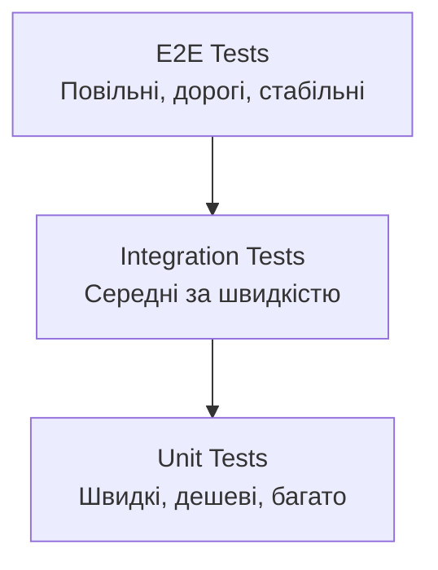
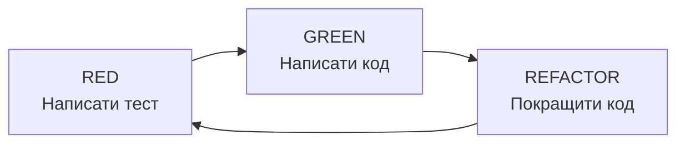

# Тестування React компонентів

---

## План лекції

- React Testing Library основи
- Unit тестування компонентів
- Мокування API викликів
- Integration тести
- E2E тестування (Cypress/Playwright)
- Test-driven development

---

## Навіщо тестувати?

**Основні причини:**
- 🐛 Раннє виявлення помилок
- 🔄 Впевненість при рефакторингу
- 📖 Документація коду
- 🚀 Швидший розвиток в довгостроковій перспективі
- 👥 Полегшення колаборації

**Статистика:**
- 40% часу витрачається на баги в продакшені
- Вартість виправлення бага зростає в 100 разів після релізу
- Тести економлять час і гроші

---

## Піраміда тестування



**Розподіл:**
- 70% Unit Tests - тестують окремі функції/компоненти
- 20% Integration Tests - тестують взаємодію компонентів
- 10% E2E Tests - тестують повні сценарії користувача

---

## React Testing Library: філософія

**Ключовий принцип:**
> Тестуйте те, що бачить користувач, а не деталі реалізації

**Відмінності від enzyme:**
- ❌ Enzyme: доступ до стану та методів
- ✅ RTL: пошук через доступні атрибути

**Переваги:**
- Більш стійкі тести
- Кращі практики доступності
- Схожість з реальною поведінкою користувача
- Легший рефакторинг

---

## Налаштування тестового середовища

```bash
# Встановлення залежностей
npm install --save-dev @testing-library/react
npm install --save-dev @testing-library/jest-dom
npm install --save-dev @testing-library/user-event
npm install --save-dev vitest jsdom
```

```javascript
// vite.config.js
export default defineConfig({
    plugins: [react()],
    test: {
        globals: true,
        environment: 'jsdom',
        setupFiles: './src/test/setup.js',
    },
});
```

---

## Setup файл

```javascript
// src/test/setup.js
import { expect, afterEach } from 'vitest';
import { cleanup } from '@testing-library/react';
import matchers from '@testing-library/jest-dom/matchers';

// Розширення expect з jest-dom matchers
expect.extend(matchers);

// Очищення після кожного тесту
afterEach(() => {
    cleanup();
});
```

**jest-dom matchers:**
- `toBeInTheDocument()`
- `toHaveClass()`
- `toHaveValue()`
- `toBeDisabled()`
- багато інших...

---

## Перший тест

```jsx
// Button.jsx
function Button({ onClick, children }) {
    return (
        <button onClick={onClick}>
            {children}
        </button>
    );
}
```

```javascript
// Button.test.jsx
import { describe, it, expect, vi } from 'vitest';
import { render, screen } from '@testing-library/react';
import userEvent from '@testing-library/user-event';
import Button from './Button';

describe('Button Component', () => {
    it('рендериться з текстом', () => {
        render(<Button>Натисни мене</Button>);

        expect(screen.getByRole('button')).toHaveTextContent('Натисни мене');
    });

    it('викликає onClick при натисканні', async () => {
        const handleClick = vi.fn();
        const user = userEvent.setup();

        render(<Button onClick={handleClick}>Click</Button>);
        await user.click(screen.getByRole('button'));

        expect(handleClick).toHaveBeenCalledTimes(1);
    });
});
```

---

## Queries: пошук елементів

**Пріоритет (від кращого до гіршого):**

1. **getByRole** - найкращий для доступності
```javascript
screen.getByRole('button', { name: /submit/i })
```

2. **getByLabelText** - для форм
```javascript
screen.getByLabelText(/email/i)
```

3. **getByPlaceholderText** - якщо немає label
```javascript
screen.getByPlaceholderText(/enter email/i)
```

4. **getByText** - для не-інтерактивних елементів
```javascript
screen.getByText(/hello world/i)
```

5. **getByTestId** - останній варіант
```javascript
screen.getByTestId('custom-element')
```

---

## Variants запитів

**getBy** - знаходить один елемент, помилка якщо ні
```javascript
const button = screen.getByRole('button');
```

**queryBy** - знаходить один елемент, null якщо ні
```javascript
const button = screen.queryByRole('button');
expect(button).not.toBeInTheDocument();
```

**findBy** - асинхронний, чекає на елемент
```javascript
const button = await screen.findByRole('button');
```

**getAllBy/queryAllBy/findAllBy** - для множинних елементів
```javascript
const buttons = screen.getAllByRole('button');
expect(buttons).toHaveLength(3);
```

---

## User Event API

**userEvent vs fireEvent:**
- fireEvent - низькорівневий, миттєвий
- userEvent - імітує справжнього користувача

```javascript
import userEvent from '@testing-library/user-event';

it('тестує взаємодію користувача', async () => {
    const user = userEvent.setup();
    render(<LoginForm />);

    // Введення тексту
    await user.type(screen.getByLabelText(/email/i), 'test@example.com');

    // Клік
    await user.click(screen.getByRole('button', { name: /submit/i }));

    // Подвійний клік
    await user.dblClick(element);

    // Hover
    await user.hover(element);

    // Keyboard
    await user.keyboard('{Enter}');
});
```

---

## Тестування форм

```jsx
function LoginForm({ onSubmit }) {
    const [email, setEmail] = useState('');
    const [password, setPassword] = useState('');

    return (
        <form onSubmit={(e) => {
            e.preventDefault();
            onSubmit({ email, password });
        }}>
            <label htmlFor="email">Email</label>
            <input
                id="email"
                type="email"
                value={email}
                onChange={(e) => setEmail(e.target.value)}
            />

            <label htmlFor="password">Пароль</label>
            <input
                id="password"
                type="password"
                value={password}
                onChange={(e) => setPassword(e.target.value)}
            />

            <button type="submit">Увійти</button>
        </form>
    );
}
```

---

## Тестування форм (продовження)

```javascript
it('відправляє правильні дані при submit', async () => {
    const handleSubmit = vi.fn();
    const user = userEvent.setup();

    render(<LoginForm onSubmit={handleSubmit} />);

    // Заповнення форми
    await user.type(
        screen.getByLabelText(/email/i),
        'test@example.com'
    );
    await user.type(
        screen.getByLabelText(/пароль/i),
        'password123'
    );

    // Відправка
    await user.click(screen.getByRole('button', { name: /увійти/i }));

    // Перевірка
    expect(handleSubmit).toHaveBeenCalledWith({
        email: 'test@example.com',
        password: 'password123'
    });
});
```

---

## Тестування валідації

```javascript
it('показує помилку при некоректному email', async () => {
    const user = userEvent.setup();
    render(<LoginForm />);

    const emailInput = screen.getByLabelText(/email/i);
    await user.type(emailInput, 'invalid-email');

    await user.click(screen.getByRole('button', { name: /увійти/i }));

    expect(screen.getByText(/некоректний email/i)).toBeInTheDocument();
});

it('показує помилку при порожньому паролі', async () => {
    const user = userEvent.setup();
    render(<LoginForm />);

    await user.type(screen.getByLabelText(/email/i), 'test@example.com');
    await user.click(screen.getByRole('button', { name: /увійти/i }));

    expect(screen.getByText(/пароль обов'язковий/i)).toBeInTheDocument();
});
```

---

## Мокування API: vi.fn()

```javascript
// Створення mock функції
const mockFunction = vi.fn();

// Виклик
mockFunction('arg1', 'arg2');

// Перевірки
expect(mockFunction).toHaveBeenCalled();
expect(mockFunction).toHaveBeenCalledTimes(1);
expect(mockFunction).toHaveBeenCalledWith('arg1', 'arg2');

// Налаштування повернення значення
mockFunction.mockReturnValue(42);
mockFunction.mockResolvedValue({ data: 'success' });
mockFunction.mockRejectedValue(new Error('Failed'));

// Реалізація
mockFunction.mockImplementation((x, y) => x + y);
```

---

## Мокування модулів

```javascript
// api.js
export async function fetchUser(userId) {
    const response = await fetch(`/api/users/${userId}`);
    return response.json();
}

// UserProfile.test.jsx
import * as api from './api';

vi.mock('./api');

describe('UserProfile', () => {
    it('відображає дані користувача', async () => {
        api.fetchUser.mockResolvedValue({
            id: 1,
            name: 'Іван Петренко'
        });

        render(<UserProfile userId={1} />);

        expect(await screen.findByText('Іван Петренко')).toBeInTheDocument();
    });
});
```

---

## MSW: Mock Service Worker

**Переваги MSW:**
- Мокування на рівні мережі
- Один код для тестів та розробки
- Реалістичніше тестування

```bash
npm install --save-dev msw
```

```javascript
// mocks/handlers.js
import { http, HttpResponse } from 'msw';

export const handlers = [
    http.get('/api/users/:userId', ({ params }) => {
        return HttpResponse.json({
            id: params.userId,
            name: 'Іван Петренко'
        });
    }),

    http.post('/api/users', async ({ request }) => {
        const data = await request.json();
        return HttpResponse.json({ id: 1, ...data });
    })
];
```

---

## MSW: налаштування

```javascript
// mocks/server.js
import { setupServer } from 'msw/node';
import { handlers } from './handlers';

export const server = setupServer(...handlers);
```

```javascript
// src/test/setup.js
import { beforeAll, afterEach, afterAll } from 'vitest';
import { server } from '../mocks/server';

beforeAll(() => server.listen());
afterEach(() => server.resetHandlers());
afterAll(() => server.close());
```

**Тепер всі HTTP запити будуть перехоплюватися!**

---

## Тестування async компонентів

```javascript
it('показує loading, потім дані', async () => {
    render(<UserProfile userId={1} />);

    // Перевірка loading стану
    expect(screen.getByText(/завантаження/i)).toBeInTheDocument();

    // Очікування появи даних
    expect(await screen.findByText('Іван Петренко')).toBeInTheDocument();

    // Перевірка що loading зник
    expect(screen.queryByText(/завантаження/i)).not.toBeInTheDocument();
});

it('показує помилку при невдачі', async () => {
    server.use(
        http.get('/api/users/:userId', () => {
            return new HttpResponse(null, { status: 500 });
        })
    );

    render(<UserProfile userId={1} />);

    expect(await screen.findByRole('alert')).toHaveTextContent(/помилка/i);
});
```

---

## waitFor для складних сценаріїв

```javascript
import { waitFor } from '@testing-library/react';

it('оновлює дані після mutation', async () => {
    const user = userEvent.setup();
    render(<UserEditor userId={1} />);

    // Чекаємо завантаження
    await screen.findByText('Іван Петренко');

    // Редагування
    await user.type(screen.getByLabelText(/ім'я/i), 'Нове ім\'я');
    await user.click(screen.getByRole('button', { name: /зберегти/i }));

    // Чекаємо на оновлення (може бути складна логіка)
    await waitFor(() => {
        expect(screen.getByText('Нове ім\'я')).toBeInTheDocument();
    }, { timeout: 3000 });
});
```

---

## Integration тести

**Тестування взаємодії декількох компонентів:**

```javascript
describe('Todo List Integration', () => {
    it('повний CRUD workflow', async () => {
        const user = userEvent.setup();
        render(<TodoApp />);

        // CREATE
        await user.type(screen.getByPlaceholderText(/додати/i), 'Купити молоко');
        await user.click(screen.getByRole('button', { name: /додати/i }));
        expect(screen.getByText('Купити молоко')).toBeInTheDocument();

        // UPDATE
        await user.click(screen.getByRole('checkbox'));
        expect(screen.getByText('Купити молоко')).toHaveClass('completed');

        // DELETE
        await user.click(screen.getByRole('button', { name: /видалити/i }));
        expect(screen.queryByText('Купити молоко')).not.toBeInTheDocument();
    });
});
```

---

## E2E тестування: Playwright

**Переваги Playwright:**
- Швидкий та надійний
- Підтримка всіх браузерів
- Автоматичне очікування
- Потужні селектори
- Паралельне виконання

```bash
npm init playwright@latest
```

```javascript
// playwright.config.js
export default defineConfig({
    testDir: './e2e',
    use: {
        baseURL: 'http://localhost:5173',
    },
    webServer: {
        command: 'npm run dev',
        url: 'http://localhost:5173',
    },
});
```

---

## Playwright: перший тест

```javascript
// e2e/login.spec.js
import { test, expect } from '@playwright/test';

test('користувач може увійти', async ({ page }) => {
    await page.goto('/login');

    // Заповнення форми
    await page.fill('input[name="email"]', 'test@example.com');
    await page.fill('input[name="password"]', 'password123');

    // Відправка
    await page.click('button[type="submit"]');

    // Перевірка редіректу
    await expect(page).toHaveURL('/dashboard');

    // Перевірка вмісту
    await expect(page.locator('text=Вітаємо')).toBeVisible();
});
```

---

## Playwright: складні сценарії

```javascript
test('повний user journey', async ({ page }) => {
    // Реєстрація
    await page.goto('/register');
    await page.fill('input[name="name"]', 'Іван');
    await page.fill('input[name="email"]', 'ivan@example.com');
    await page.fill('input[name="password"]', 'secure123');
    await page.click('button:has-text("Зареєструватися")');

    // Створення проєкту
    await page.goto('/projects/new');
    await page.fill('input[name="title"]', 'Новий проєкт');
    await page.fill('textarea[name="description"]', 'Опис проєкту');
    await page.click('button:has-text("Створити")');

    // Перевірка
    await expect(page).toHaveURL(/\/projects\/\d+/);
    await expect(page.locator('h1')).toContainText('Новий проєкт');
});
```

---

## Playwright: API тестування

```javascript
test('API authentication', async ({ request }) => {
    // Login request
    const response = await request.post('/api/auth/login', {
        data: {
            email: 'test@example.com',
            password: 'password123'
        }
    });

    expect(response.ok()).toBeTruthy();

    const body = await response.json();
    expect(body).toHaveProperty('token');

    // Використання токену
    const userResponse = await request.get('/api/user', {
        headers: {
            'Authorization': `Bearer ${body.token}`
        }
    });

    expect(userResponse.ok()).toBeTruthy();
});
```

---

## Test-Driven Development (TDD)

**Процес Red-Green-Refactor:**



**Переваги TDD:**
- Кращий дизайн коду
- Повне покриття тестами
- Документація через тести
- Впевненість при рефакторингу

---

## TDD приклад: Counter

```javascript
// RED: Тести не проходять
describe('Counter', () => {
    it('починається з 0', () => {
        render(<Counter />);
        expect(screen.getByText('0')).toBeInTheDocument();
    });

    it('збільшується при кліку', async () => {
        const user = userEvent.setup();
        render(<Counter />);

        await user.click(screen.getByRole('button', { name: /\+/i }));
        expect(screen.getByText('1')).toBeInTheDocument();
    });

    it('зменшується при кліку', async () => {
        const user = userEvent.setup();
        render(<Counter />);

        await user.click(screen.getByRole('button', { name: /-/i }));
        expect(screen.getByText('-1')).toBeInTheDocument();
    });
});
```

---

## TDD приклад: реалізація

```jsx
// GREEN: Мінімальна реалізація
function Counter() {
    const [count, setCount] = useState(0);

    return (
        <div>
            <p>{count}</p>
            <button onClick={() => setCount(count + 1)}>+</button>
            <button onClick={() => setCount(count - 1)}>-</button>
            <button onClick={() => setCount(0)}>Reset</button>
        </div>
    );
}

// REFACTOR: Покращення
function Counter({ initialValue = 0 }) {
    const [count, setCount] = useState(initialValue);

    const increment = () => setCount(prev => prev + 1);
    const decrement = () => setCount(prev => prev - 1);
    const reset = () => setCount(initialValue);

    return (/* ... */);
}
```

---

## Coverage: покриття тестами

```bash
# Запуск з coverage
npm test -- --coverage
```

**Метрики покриття:**
- **Statements** - рядки коду
- **Branches** - умови (if/else)
- **Functions** - функції
- **Lines** - фізичні рядки

**Цілі:**
- Критичний код: 90-100%
- Бізнес-логіка: 80-90%
- UI компоненти: 70-80%
- Допоміжні функції: 60-70%

**⚠️ Висока coverage ≠ якісні тести**

---

## Що тестувати?

**✅ Тестуйте:**
- Критичний функціонал (оплата, реєстрація)
- Складну бізнес-логіку
- Краєві випадки (edge cases)
- Обробку помилок
- Доступність (a11y)

**❌ Не тестуйте:**
- Деталі реалізації
- Зовнішні бібліотеки
- Очевидні речі
- Константи
- Тривіальні функції

---

## Найкращі практики

**Організація тестів:**
- Один файл тестів поряд з компонентом
- Групуйте тести через describe
- Зрозумілі назви тестів (it should...)
- Arrange-Act-Assert паттерн

**Написання тестів:**
- Тестуйте поведінку, не реалізацію
- Один assert на один тест (коли можливо)
- Використовуйте getByRole для доступності
- Уникайте getByTestId

**Мокування:**
- Мокуйте зовнішні залежності
- Використовуйте MSW для API
- Не мокуйте все підряд

---

## Debugging тестів

**Корисні інструменти:**

```javascript
// Виведення DOM
screen.debug();

// Виведення окремого елемента
screen.debug(screen.getByRole('button'));

// Logгing
screen.logTestingPlaygroundURL();

// Пауза для дослідження
await screen.findByRole('button');
await new Promise(resolve => setTimeout(resolve, 1000000));
```

**VS Code extensions:**
- Testing Library
- Jest Runner
- Vitest

---

## CI/CD Integration

```yaml
# .github/workflows/test.yml
name: Tests

on: [push, pull_request]

jobs:
  test:
    runs-on: ubuntu-latest

    steps:
      - uses: actions/checkout@v3
      - uses: actions/setup-node@v3
        with:
          node-version: 18

      - name: Install dependencies
        run: npm ci

      - name: Run tests
        run: npm test -- --coverage

      - name: Upload coverage
        uses: codecov/codecov-action@v3
```

---

## Performance тестів

**Прискорення виконання:**
- Паралелізація тестів
- Правильний setup/teardown
- Уникнення зайвих async операцій
- Використання shallow rendering (коли можливо)

```javascript
// vitest.config.js
export default defineConfig({
    test: {
        threads: true,
        maxThreads: 4,
        minThreads: 1,
    }
});
```

**Типові проблеми:**
- Забуття await
- Зайві waitFor
- Повільні mock імплементації

---

## Корисні ресурси

**Документація:**
- [React Testing Library](https://testing-library.com/react)
- [Vitest](https://vitest.dev/)
- [Playwright](https://playwright.dev/)
- [Jest DOM](https://github.com/testing-library/jest-dom)

**Практика:**
- [Testing Playground](https://testing-playground.com/)
- [Kent C. Dodds Blog](https://kentcdodds.com/blog)
- [Common mistakes](https://kentcdodds.com/blog/common-mistakes-with-react-testing-library)

**Інструменти:**
- [Storybook](https://storybook.js.org/) - для visual testing
- [Chromatic](https://www.chromatic.com/) - visual regression
