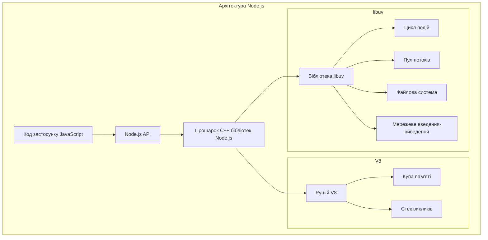
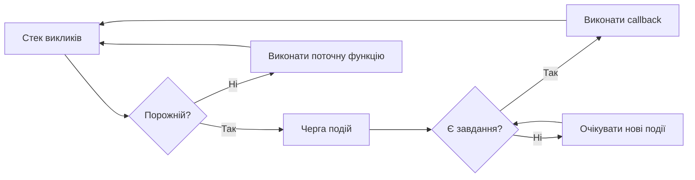
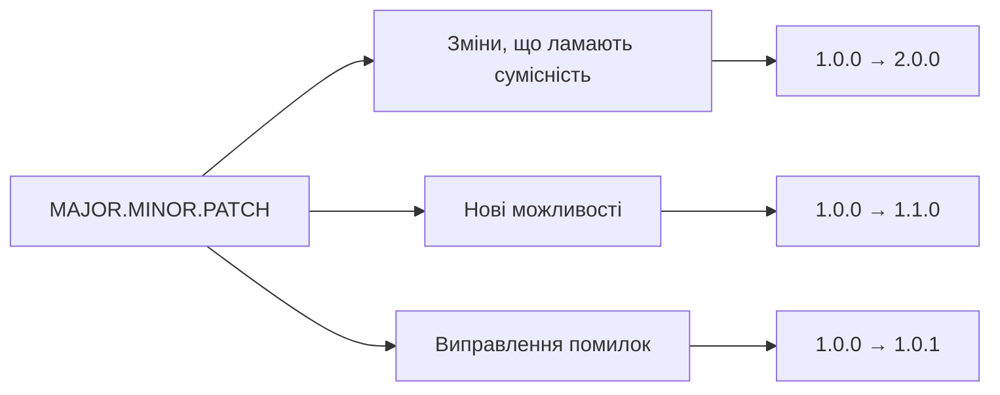
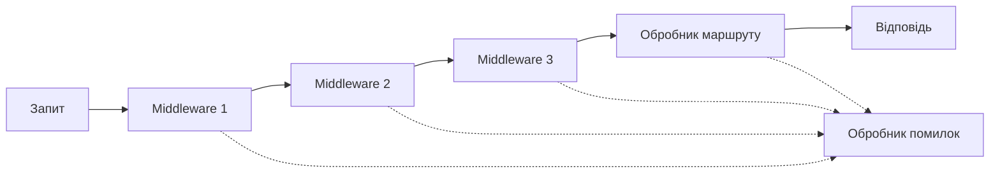

# Лекція 2. Node.js та Express.js: основи серверної розробки

## Вступ: від сторінки до сервера

У попередній лекції йшлося про HTML, CSS та JavaScript як інструменти клієнтської частини — того, що виконується безпосередньо в браузері користувача. Але браузер не вміє й не повинен зберігати базу даних користувачів, перевіряти паролі, обробляти платежі чи роздавати той самий вебдодаток тисячам відвідувачів одночасно. Для цього потрібна **серверна частина** (backend) — програма, яка постійно працює на сервері, приймає запити від клієнтів і повертає їм відповіді.

До 2009 року серверна частина вебдодатків майже завжди писалася іншою мовою, ніж клієнтська: PHP, Java, Python, Ruby. Розробнику доводилось тримати в голові дві різні мови, дві різні екосистеми інструментів і два способи мислення. Node.js змінив цю ситуацію, дозволивши виконувати JavaScript поза браузером — на сервері. Це не єдина причина його популярності (про переваги й обмеження — нижче), але саме вона зробила JavaScript першою мовою, якою можна написати вебдодаток «від краю до краю»: і клієнтську, і серверну частину.

Ця лекція складається з двох логічно пов'язаних частин:

- **Частина I** знайомить із Node.js — середовищем виконання, яке робить серверний JavaScript можливим: його архітектурою, циклом подій, менеджером пакетів NPM і вбудованими модулями.
- **Частина II** переходить до Express.js — фреймворка, який надбудовується над Node.js і перетворює написання серверних застосунків із рутинної роботи з низькорівневим HTTP-модулем на зручний, декларативний процес.

Розуміння матеріалу цієї лекції — фундамент для подальших тем курсу: побудови REST API, роботи з базами даних та автентифікації, які без Node.js та Express.js обговорювати немає сенсу.

## 1. Node.js: середовище виконання JavaScript на сервері

**Node.js** — це середовище виконання JavaScript із відкритим кодом, яке дозволяє запускати JavaScript-код поза браузером, зокрема на сервері. Node.js створив Раян Дал у 2009 році; в основі середовища лежить рушій V8 від Google Chrome, який компілює JavaScript у машинний код, та бібліотека **libuv**, що відповідає за асинхронні операції введення-виведення.

Важливо розрізняти дві речі, які часто плутають: **JavaScript** — це мова програмування, а **Node.js** — середовище, яке цю мову виконує. Так само, як браузер надає JavaScript-коду доступ до DOM, вікна, локального сховища, Node.js надає йому доступ до файлової системи, мережі, процесів операційної системи — того, чого в браузері з міркувань безпеки просто немає.

Ключові характеристики Node.js:

- **Асинхронність і неблокуюче введення-виведення.** Операції з файлами, мережею чи базою даних не зупиняють виконання решти програми — вони виконуються «у фоні», а результат повертається через callback, проміс (Promise) або конструкцію `async/await`. Це дозволяє одному потоку Node.js обслуговувати тисячі одночасних з'єднань.
- **Єдина мова для клієнтської та серверної частини.** Розробник може використовувати ті самі знання JavaScript і навіть спільний код (наприклад, функції валідації) в обох шарах застосунку.
- **Величезна екосистема NPM.** Реєстр NPM налічує понад 3 мільйони пакетів — готових рішень практично для будь-якого завдання, від роботи з датами до повноцінних вебфреймворків.

## 2. Архітектура Node.js та цикл подій

Щоб зрозуміти, чому Node.js добре справляється з великою кількістю одночасних з'єднань, потрібно розглянути його внутрішню будову.



**V8** відповідає за виконання власне JavaScript-коду: парсинг, компіляцію та роботу зі стеком викликів і купою пам'яті. **libuv** — це бібліотека мовою C, написана спеціально для Node.js, яка реалізує неблокуюче введення-виведення на різних операційних системах і надає механізм, що робить Node.js асинхронним, — **цикл подій** (event loop).

### Як працює цикл подій

Головна ідея: JavaScript у Node.js виконується в **одному потоці**. Коли потрібно виконати операцію, яка потребує очікування (читання файлу, запит до бази даних, мережевий виклик), Node.js не зупиняє цей потік — він передає завдання libuv (яка для деяких операцій використовує окремий пул потоків) і продовжує виконувати наступний код. Коли операція завершується, її callback-функція стає в чергу, і цикл подій виконує її, щойно звільниться стек викликів.



Цикл подій проходить через кілька фаз на кожній ітерації:

| Фаза | Що обробляє |
|---|---|
| **timers** | callback-функції `setTimeout` та `setInterval` |
| **pending callbacks** | відкладені callback-и для деяких системних операцій |
| **poll** | нові події введення-виведення; виконання відповідних callback-ів |
| **check** | callback-функції `setImmediate` |
| **close callbacks** | обробка закриття з'єднань (наприклад, `socket.on('close', ...)`) |

Наочний приклад, який пояснює порядок виконання:

```javascript
console.log('Початок');

setTimeout(() => {
    console.log('Таймер виконано');
}, 0);

console.log('Кінець');

// Вивід:
// Початок
// Кінець
// Таймер виконано
```

Навіть із затримкою `0` мілісекунд `setTimeout` виконається після всього синхронного коду: цикл подій не переходить до фази timers, поки стек викликів не звільниться.

## 3. Переваги та обмеження Node.js

### Переваги

- **Висока продуктивність для I/O-інтенсивних застосунків.** Традиційні серверні технології (наприклад, класичний Apache з PHP) створюють окремий потік операційної системи для кожного клієнтського з'єднання, що споживає багато пам'яті. Node.js обслуговує всі запити в одному потоці за допомогою циклу подій, тому масштабується на набагато більшу кількість одночасних з'єднань за тих самих ресурсів.
- **Швидкість розробки** завдяки одній мові для всього стеку та величезній кількості готових рішень у NPM.
- **Активна спільнота й екосистема.** Node.js підтримує фонд OpenJS, а щорічний реліз нової major-версії гарантує передбачуваний цикл оновлень (докладніше — у наступному розділі).

### Обмеження

- **Не підходить для CPU-інтенсивних задач.** Оскільки основний JavaScript-код виконується в одному потоці, важкі обчислення (обробка зображень, складна математика) блокують цикл подій і, відповідно, обробку всіх інших запитів. Для таких задач у Node.js є модуль **Worker Threads**, що дозволяє виконувати JavaScript у окремих потоках, або варто виносити обчислення в окремий сервіс.
- **Callback hell.** Історично асинхронний код на callback-ах призводив до глибоко вкладених структур, які важко читати й підтримувати. Сучасний JavaScript (проміси та `async/await`) практично розв'язує цю проблему, але в старому («legacy») коді вона й досі трапляється.
- **Швидкі зміни в екосистемі** іноді призводять до необхідності частого оновлення залежностей і потенційних проблем сумісності між пакетами.

## 4. Версії Node.js та політика підтримки

Node.js розвивається за передбачуваним графіком: щороку у квітні виходить нова major-версія, а у жовтні одна з них отримує статус **LTS** (Long Term Support — довготривала підтримка) і стає рекомендованою для продакшену. Станом на вересень 2026 року актуальна картина підтримки виглядає так:

| Версія | Кодова назва | Статус | Підтримка до |
|---|---|---|---|
| **Node.js 24** | Krypton | **Active LTS** (рекомендована для нових проєктів) | квітень 2028 |
| **Node.js 22** | Jod | Maintenance LTS (лише критичні виправлення безпеки) | квітень 2027 |
| **Node.js 26** | — | Current (стане LTS у жовтні 2026) | — |
| Node.js 20 і старіші | Iron та ін. | Завершили підтримку (End of Life) | — |

> 💡 **Практична порада.** Для нових навчальних і робочих проєктів варто орієнтуватися на поточну Active LTS-версію (на момент написання — Node.js 24). Актуальний графік підтримки завжди можна перевірити на [nodejs.org/en/about/previous-releases](https://nodejs.org/en/about/previous-releases).

З останніх практично корисних змін, які варто знати:

- **`--env-file`** та **`process.loadEnvFile()`** — вбудована, стабільна (з Node.js 24) підтримка завантаження змінних середовища з файлу `.env` без сторонніх пакетів (докладніше — у розділі про налаштування середовища).
- **`require()` тепер уміє синхронно завантажувати ES-модулі** (стабільно з Node.js 22+), що спрощує співіснування CommonJS і ES Modules у одному проєкті (докладніше — у розділі про модульну систему).
- **Вбудований тестовий раннер `node:test`** — стабільний з Node.js 20, дозволяє писати й запускати тести без встановлення Jest чи іншого стороннього фреймворка.

## 5. NPM: менеджер пакетів Node.js

**NPM (Node Package Manager)** встановлюється разом із Node.js і виконує три ролі: це реєстр пакетів (npmjs.com), інтерфейс командного рядка для встановлення й управління залежностями та формат опису проєкту — файл `package.json`.

### Ініціалізація проєкту

```bash
# Інтерактивна ініціалізація
npm init

# Швидка ініціалізація зі значеннями за замовчуванням
npm init -y
```

### Встановлення пакетів

```bash
# Встановлення пакета як звичайної залежності
npm install express

# Встановлення пакета як залежності для розробки (не потрібна в продакшені)
npm install --save-dev nodemon

# Встановлення пакета глобально (доступний з будь-якого місця в системі)
npm install -g typescript

# Встановлення конкретної версії
npm install express@5.1.0
```

### Структура package.json

`package.json` — це «паспорт» Node.js-проєкту: він містить метадані, список залежностей і команди для автоматизації.

```json
{
  "name": "my-web-app",
  "version": "1.0.0",
  "description": "Навчальний вебдодаток",
  "type": "module",
  "main": "src/index.js",
  "scripts": {
    "start": "node src/index.js",
    "dev": "node --watch src/index.js",
    "test": "node --test"
  },
  "keywords": ["web", "express", "api"],
  "author": "Студент Іванович",
  "license": "MIT",
  "dependencies": {
    "express": "^5.1.0",
    "mongoose": "^8.9.0"
  },
  "devDependencies": {
    "eslint": "^9.15.0"
  },
  "engines": {
    "node": ">=22.0.0"
  }
}
```

Поле `scripts` дозволяє визначати команди для автоматизації завдань розробки, які потім запускаються через `npm run <назва_скрипта>`. `dependencies` містить пакети, потрібні для роботи застосунку в продакшені; `devDependencies` — пакети, потрібні тільки під час розробки й тестування (лінтери, тестові фреймворки).

> Зверніть увагу на поле `"type": "module"` і скрипт `dev`, який використовує вбудований прапорець `--watch` замість стороннього `nodemon`. Обидва підходи пояснено нижче, у відповідних розділах.

### Семантичне версіонування (SemVer)

NPM використовує семантичне версіонування для управління версіями пакетів. Версія має формат `MAJOR.MINOR.PATCH`:



Префікси версій у `package.json` визначають, які оновлення дозволено встановлювати автоматично:

- **`^1.2.3`** дозволяє оновлення, сумісні з вказаною версією: від `1.2.3` до будь-якої `1.x.x`, але не `2.0.0`. Це значення за замовчуванням при `npm install`.
- **`~1.2.3`** дозволяє оновлення лише патч-версій: від `1.2.3` до `1.2.x`.
- Відсутність префікса (`1.2.3`) означає точну версію без автоматичних оновлень.

### package-lock.json

Файл `package-lock.json` генерується автоматично при встановленні пакетів і фіксує **точні** версії всіх залежностей та їхніх під-залежностей. Це гарантує, що на будь-якій машині — у вашого одногрупника, викладача чи на сервері CI/CD — встановляться абсолютно однакові версії пакетів. Тому `package-lock.json` завжди додають у Git, на відміну від теки `node_modules`.

### Керування залежностями

```bash
npm outdated           # перевірка застарілих пакетів
npm update              # оновлення до допустимих версій (з урахуванням ^ і ~)
npm audit                # перевірка відомих вразливостей безпеки
npm audit fix          # автоматичне виправлення там, де це можливо
```

## 6. Модульна система Node.js

Node.js підтримує дві модульні системи: **CommonJS** — історичну, «рідну» для Node.js, і **ES Modules (ESM)** — сучасний стандарт JavaScript, який використовується і в браузерах. Розуміння різниці між ними важливе, бо в реальних проєктах трапляються обидва варіанти, а сучасні пакети (зокрема Express) в офіційній документації вже орієнтуються саме на ESM.

### ES Modules — сучасний стандарт

ESM використовує ключові слова `import` та `export`:

```javascript
// math.js — експорт
export function add(a, b) {
    return a + b;
}

export function subtract(a, b) {
    return a - b;
}

function multiply(a, b) {
    return a * b;
}

// Експорт за замовчуванням
export default multiply;
```

```javascript
// app.js — імпорт
import multiply, { add, subtract } from './math.js';
import * as math from './math.js';

// Динамічний імпорт (повертає проміс)
const mathModule = await import('./math.js');

console.log(add(5, 3)); // 8
console.log(math.multiply(4, 6)); // 24
```

Щоб Node.js сприймав файли `.js` як ES-модулі, у `package.json` потрібно вказати `"type": "module"`:

```json
{
  "name": "esm-app",
  "version": "1.0.0",
  "type": "module",
  "main": "index.js"
}
```

Альтернатива — явні розширення файлів: `.mjs` завжди трактується як ESM, а `.cjs` — завжди як CommonJS, незалежно від поля `type`.

### CommonJS — історичний стандарт

CommonJS використовує `require()` для імпорту та `module.exports` для експорту. Це стандарт, у якому й досі написана значна частина існуючих Node.js-пакетів та навчальних матеріалів:

```javascript
// math.cjs — експорт
function add(a, b) {
    return a + b;
}

module.exports = { add };
```

```javascript
// app.cjs — імпорт
const { add } = require('./math.cjs');
console.log(add(5, 3)); // 8
```

### Взаємодія між модульними системами

Раніше поєднання CommonJS та ESM в одному проєкті вимагало обхідних шляхів. Починаючи з Node.js 22, `require()` уміє **синхронно** завантажувати ES-модулі (за умови, що модуль не використовує `top-level await`), тож у більшості випадків окремий динамічний `import()` більше не потрібен:

```javascript
// commonjs-module.cjs
module.exports = { message: 'Привіт із CommonJS' };
```

```javascript
// es-module.mjs
import commonjsModule from './commonjs-module.cjs'; // ESM → CJS: працює завжди
console.log(commonjsModule.message);

// CJS → ESM: працює синхронно з Node.js 22+, якщо модуль без top-level await
const esmLib = require('some-esm-only-package');
```

> Для нових проєктів рекомендація проста: обирайте **ES Modules** (`"type": "module"`) як основний формат — саме так побудована документація сучасних пакетів, включно з Express 5. CommonJS варто розуміти, щоб читати старіший код, але для власних нових файлів достатньо `import`/`export`.

## 7. Основні вбудовані модулі Node.js

Node.js постачається з набором вбудованих модулів (їх префікс — `node:`, хоча він і необов'язковий), які надають доступ до файлової системи, мережі та інших ресурсів операційної системи без встановлення будь-яких пакетів.

### Модуль File System (fs)

```javascript
import { readFile, writeFile } from 'node:fs/promises';

// Асинхронне читання файлу з використанням проміса
async function readConfigFile() {
    try {
        const data = await readFile('config.txt', 'utf8');
        console.log('Конфігурація:', data);
        return JSON.parse(data);
    } catch (error) {
        console.error('Помилка читання конфігурації:', error.message);
        throw error;
    }
}

// Запис у файл
await writeFile('output.txt', 'Привіт, файлова система!', 'utf8');
```

Модуль `fs` також надає синхронні версії функцій (`readFileSync`, `writeFileSync`), але їх варто уникати на сервері в продакшені: вони блокують єдиний потік виконання, а отже — і обробку всіх інших запитів, поки не завершиться операція з диском.

### Модуль Path

```javascript
import path from 'node:path';

// Об'єднання частин шляху (кросплатформово — сам обирає / або \)
const fullPath = path.join('/users', 'student', 'documents', 'project.js');
console.log(fullPath); // /users/student/documents/project.js

// Отримання інформації про шлях
const filePath = '/home/user/projects/webapp/src/index.js';
console.log(path.dirname(filePath));   // /home/user/projects/webapp/src
console.log(path.basename(filePath));  // index.js
console.log(path.extname(filePath));   // .js
```

У ES-модулях змінних `__dirname` та `__filename`, знайомих із CommonJS, немає — їх потрібно отримати через `import.meta.url`:

```javascript
import path from 'node:path';
import { fileURLToPath } from 'node:url';

const __filename = fileURLToPath(import.meta.url);
const __dirname = path.dirname(__filename);

const configPath = path.join(__dirname, 'config', 'database.json');
```

### Модуль HTTP

Модуль `http` — це фундамент, на якому побудований будь-який вебсервер у Node.js, зокрема й сам Express. Розуміння того, як виглядає сервер без фреймворка, допомагає зрозуміти, яку саме роботу Express бере на себе.

```javascript
// server.js
import http from 'node:http';

const server = http.createServer((request, response) => {
    const { url, method } = request;

    response.setHeader('Content-Type', 'application/json; charset=utf-8');

    if (url === '/' && method === 'GET') {
        response.statusCode = 200;
        response.end(JSON.stringify({ message: 'Ласкаво просимо до API' }));
    } else if (url === '/api/users' && method === 'GET') {
        response.statusCode = 200;
        response.end(JSON.stringify({
            users: [
                { id: 1, name: 'Іван' },
                { id: 2, name: 'Марія' }
            ]
        }));
    } else {
        response.statusCode = 404;
        response.end(JSON.stringify({ error: 'Ресурс не знайдено' }));
    }
});

const PORT = process.env.PORT || 3000;
server.listen(PORT, () => {
    console.log(`Сервер запущено на порті ${PORT}`);
});
```

Навіть у такому короткому прикладі помітно, скільки рутинної роботи лягає на розробника: вручну розбирати `request.url`, перевіряти метод, встановлювати заголовки й код стану для кожної гілки логіки. Що більше маршрутів — то більше однотипного коду доводиться писати. Саме цю проблему і розв'язує Express.js — про нього йдеться в Частині II.

### Модуль URL

```javascript
const apiUrl = new URL('https://api.example.com/users?page=2&limit=10&sort=name');

console.log(apiUrl.protocol);  // https:
console.log(apiUrl.host);      // api.example.com
console.log(apiUrl.pathname);  // /users

// Робота з параметрами запиту
const params = apiUrl.searchParams;
console.log(params.get('page'));   // 2

params.set('page', '3');
params.append('filter', 'active');
console.log(apiUrl.toString());
```

Клас `URL` — глобальний у Node.js, тобто його можна використовувати без імпорту, так само як у браузері.

## 8. Налаштування середовища розробки

### Редактор та розширення

Visual Studio Code — стандартний вибір для розробки на Node.js. Мінімальний корисний набір розширень:

```json
{
  "recommendations": [
    "dbaeumer.vscode-eslint",
    "esbenp.prettier-vscode",
    "christian-kohler.npm-intellisense"
  ]
}
```

### ESLint та Prettier

**ESLint** виконує статичний аналіз коду й виявляє потенційні помилки та порушення стилю ще до запуску:

```json
{
  "env": { "node": true, "es2024": true },
  "extends": ["eslint:recommended"],
  "parserOptions": { "ecmaVersion": "latest", "sourceType": "module" },
  "rules": {
    "no-unused-vars": ["error", { "argsIgnorePattern": "^_" }],
    "no-console": "off",
    "prefer-const": "error"
  }
}
```

**Prettier** відповідає лише за форматування (відступи, лапки, крапки з комою), не втручаючись у логіку коду:

```json
{
  "semi": true,
  "singleQuote": true,
  "printWidth": 100,
  "tabWidth": 2
}
```

### Змінні середовища

Змінні середовища дозволяють зберігати конфігурацію (порт, реквізити бази даних, секретні ключі) окремо від коду — це і зручніше, і безпечніше, бо файл із секретами не потрапляє в Git.

Донедавна єдиним зручним способом завантажити `.env`-файл у Node.js-застосунок був пакет `dotenv`. Він і сьогодні широко використовується та має додаткові можливості (наприклад, підстановку значень), тому знати його варто:

```javascript
// config.js
import 'dotenv/config';

export const config = {
  port: process.env.PORT || 3000,
  database: {
    host: process.env.DB_HOST || 'localhost',
    name: process.env.DB_NAME || 'webapp',
  },
  jwt: {
    secret: process.env.JWT_SECRET,
  },
};

if (process.env.NODE_ENV === 'production' && !config.jwt.secret) {
  throw new Error('У продакшені обов\'язково потрібно задати JWT_SECRET');
}
```

Проте починаючи з Node.js 20 (і остаточно стабільно — з Node.js 24), завантаження `.env`-файлів **вбудоване в саму платформу**, і для базових сценаріїв сторонній пакет уже не потрібен:

```bash
# Запуск із автоматичним завантаженням .env
node --env-file=.env src/index.js
```

```javascript
// або програмно, прямо в коді
import { loadEnvFile } from 'node:process';

loadEnvFile(); // завантажує ./.env
```

Приклад файлу `.env` для локальної розробки (цей файл обов'язково додають у `.gitignore`):

```env
NODE_ENV=development
PORT=3000

DB_HOST=localhost
DB_NAME=webapp_dev

JWT_SECRET=super-secret-key-for-development
```

### Автоматичний перезапуск під час розробки

Раніше для перезапуску сервера при зміні файлів практично завжди встановлювали пакет **nodemon**. Сьогодні для простих проєктів достатньо вбудованого прапорця `--watch`, який з'явився в Node.js 18 і не потребує жодних додаткових залежностей:

```json
{
  "scripts": {
    "start": "node src/index.js",
    "dev": "node --watch src/index.js"
  }
}
```

`nodemon` залишається доречним вибором для складніших сценаріїв — наприклад, коли потрібно стежити за кількома нестандартними теками або автоматично передавати змінні середовища:

```bash
npm install --save-dev nodemon
```

```json
// nodemon.json
{
  "watch": ["src"],
  "ext": "js,json",
  "ignore": ["src/**/*.test.js"],
  "exec": "node --env-file=.env src/index.js"
}
```

### Налагодження (debugging)

```bash
node --inspect src/index.js
node --inspect-brk src/index.js  # пауза на першому рядку коду
```

Конфігурація запуску в VS Code (`launch.json`):

```json
{
  "version": "0.2.0",
  "configurations": [
    {
      "type": "node",
      "request": "launch",
      "name": "Запустити сервер",
      "program": "${workspaceFolder}/src/index.js",
      "env": { "NODE_ENV": "development" }
    }
  ]
}
```


## 9. Express.js: фреймворк для серверної розробки

Розглянутий раніше приклад на модулі `http` показав: навіть простий сервер вимагає ручного розбору URL, методу запиту, встановлення заголовків і кодів стану для кожного окремого маршруту. У реальному застосунку з десятками маршрутів, перевіркою вхідних даних, автентифікацією й обробкою помилок такий підхід швидко стає непідйомним.

**Express.js** — мінімалістичний і гнучкий вебфреймворк для Node.js, який бере на себе цю рутину: маршрутизацію, розбір тіла запиту, обробку помилок і багато іншого — залишаючи розробнику декларативний, зручний API. Створений Ті Джеєм Головейчуком (TJ Holowaychuk) у 2010 році, Express став фактичним стандартом для серверної розробки на Node.js завдяки простоті, гнучкості та відсутності нав'язаних архітектурних рішень: фреймворк не змушує використовувати конкретну базу даних, шаблонізатор чи структуру проєкту.

Express побудований навколо ідеї мінімального ядра, яке розширюється через **middleware** («проміжне програмне забезпечення») — саме цій концепції присвячено значну частину лекції. Express і сьогодні використовують компанії на кшталт Netflix, Uber та багатьох інших для внутрішніх і публічних сервісів, а сам фреймворк лишається залежністю багатьох інших вебфреймворків (наприклад, NestJS може працювати поверх нього).

### Актуальна версія Express

З березня 2025 року команда Express перейшла на офіційну LTS-політику для гілок 4.x і 5.x. Станом на вересень 2026 року **Express 5.x** (поточна версія — 5.2.1) — це та версія, яку `npm install express` встановлює за замовчуванням. Express 5 вимагає Node.js 18 або новіше і приносить кілька важливих змін порівняно з Express 4:

- **автоматична передача помилок з асинхронних обробників** — більше не потрібно вручну огортати кожен `async`-маршрут у `try/catch` з викликом `next(error)` (докладніше — у розділі про обробку помилок);
- **новий синтаксис маршрутів** для символу узагальнення (wildcard) та опціональних параметрів (докладніше — у розділі про роутинг);
- видалено застарілі методи на кшталт `app.del()` (замінений на `app.delete()`).

Ця лекція описує саме Express 5 як актуальну версію, з позначками там, де поведінка відрізняється від звичного Express 4.

## 10. Створення базового сервера з Express

```bash
npm init -y
npm pkg set type=module

npm install express
npm install --save-dev nodemon
```

Найпростіший Express-сервер:

```javascript
// app.js
import express from 'express';

const app = express();
const PORT = process.env.PORT || 3000;

app.get('/', (req, res) => {
    res.send('Привіт, світ! Це мій перший Express-сервер.');
});

app.listen(PORT, () => {
    console.log(`Сервер запущено на порті ${PORT}`);
});
```

Порівняйте цей приклад із версією на нативному `http` з розділу 7: замість розбору `request.url` вручну — виразний виклик `app.get('/', ...)`. Функція `app.listen()` за своєю суттю аналогічна `server.listen()` у нативному Node.js, оскільки Express побудований поверх модуля `http`, а не замінює його.

> **Легасі-нотатка (Express 4 і старіший код).** У багатьох підручниках і вже написаних проєктах усе ще зустрічається запис через CommonJS: `const express = require('express'); const app = express();`. Це працює й сьогодні — Express однаково добре підтримує обидва підходи, тож, читаючи чужий код, будьте готові побачити `require()` замість `import`.

## 11. Система маршрутизації в Express

**Маршрутизація** (routing) визначає, як застосунок відповідає на клієнтські запити до конкретних адрес (endpoints). Кожен маршрут складається з HTTP-методу, шляху та функції-обробника.

### Основні HTTP-методи

```javascript
app.get('/users', (req, res) => {
    res.json({ message: 'Список користувачів' });
});

app.post('/users', (req, res) => {
    res.status(201).json({ message: 'Користувача створено' });
});

app.put('/users/:id', (req, res) => {
    res.json({ message: `Користувача ${req.params.id} оновлено` });
});

app.patch('/users/:id', (req, res) => {
    res.json({ message: `Частково оновлено користувача ${req.params.id}` });
});

app.delete('/users/:id', (req, res) => {
    res.status(204).send();
});
```

### Параметри маршрутів

```javascript
// Один параметр
app.get('/users/:id', (req, res) => {
    res.json({ message: 'Інформація про користувача', userId: req.params.id });
});

// Кілька параметрів
app.get('/users/:userId/posts/:postId', (req, res) => {
    const { userId, postId } = req.params;
    res.json({ message: 'Пост користувача', userId, postId });
});
```

### Query-параметри

Query-параметри передаються в URL після знака питання й доступні через `req.query`:

```javascript
// URL: /search?q=nodejs&limit=10&page=1
app.get('/search', (req, res) => {
    const { q, limit = 20, page = 1 } = req.query;

    res.json({
        query: q,
        limit: Number(limit),
        page: Number(page),
    });
});
```

> ⚠️ **Що змінилось в Express 5.** У попередніх версіях необов'язковий параметр маршруту позначався знаком питання: `/products/:category?`. У path-to-regexp — бібліотеці, що відповідає за розбір шляхів, — версії, яку використовує Express 5, синтаксис змінено на фігурні дужки: `/products{/:category}`. Так само символ узагальнення `*` тепер обов'язково повинен мати ім'я: замість `app.get('*', ...)` пишуть `app.get('/*splat', ...)` (або `app.get('/{*splat}', ...)`, якщо потрібно захопити й кореневий шлях). Це зроблено заради безпеки — старий синтаксис був вразливим до атак типу ReDoS (Regular Expression Denial of Service).

```javascript
// Express 5: опціональний параметр
app.get('/products{/:category}', (req, res) => {
    const category = req.params.category || 'всі';
    res.json({ message: `Продукти категорії: ${category}` });
});

// Express 5: маршрут-заглушка «для всього іншого» (404-обробник)
app.use('/{*splat}', (req, res) => {
    res.status(404).json({ error: 'Маршрут не знайдено' });
});
```

### Router для модульної організації

`express.Router()` дозволяє винести маршрути в окремі файли й підключити їх до основного застосунку — це критично важливо для проєктів, у яких більше кількох маршрутів.

```javascript
// routes/users.js
import { Router } from 'express';

const router = Router();

router.use((req, res, next) => {
    console.log('Запит до users-роутера:', new Date().toISOString());
    next();
});

router.get('/', (req, res) => {
    res.json({ message: 'Список усіх користувачів' });
});

router.get('/:id', (req, res) => {
    res.json({ message: `Користувач ${req.params.id}` });
});

router.post('/', (req, res) => {
    res.status(201).json({ message: 'Нового користувача створено' });
});

export default router;
```

```javascript
// app.js
import userRoutes from './routes/users.js';

app.use('/users', userRoutes);
```

## 12. Концепція Middleware

**Middleware**-функції — серце Express. Це функції, що мають доступ до об'єкта запиту (`req`), об'єкта відповіді (`res`) та наступної middleware-функції в циклі «запит — відповідь» (`next`). Middleware може виконувати довільний код, змінювати `req` і `res`, завершувати цикл запит-відповідь або передавати керування далі.



Кожна middleware-функція **зобов'язана** або викликати `next()`, щоб передати керування далі, або самостійно завершити цикл запит-відповідь (наприклад, викликом `res.send()`), — інакше запит «зависне» без відповіді.

### Типи middleware за рівнем застосування

**Middleware рівня застосунку** прив'язується безпосередньо до `app`:

```javascript
// Для всіх маршрутів
app.use((req, res, next) => {
    console.log(`${req.method} ${req.url} — ${new Date().toISOString()}`);
    next();
});

// Для конкретного префікса шляху
app.use('/api', (req, res, next) => {
    console.log('Запит до API');
    next();
});

// Middleware з умовою (спрощений приклад авторизації)
app.use('/admin', (req, res, next) => {
    const isAuthorized = req.headers.authorization === 'Bearer secret-token';

    if (!isAuthorized) {
        return res.status(401).json({ error: 'Доступ заборонено' });
    }

    next();
});
```

**Middleware рівня роутера** працює так само, але прив'язується до екземпляра `express.Router()`:

```javascript
const router = Router();

router.use((req, res, next) => {
    console.log('Middleware роутера спрацювало');
    next();
});

router.use('/:id', (req, res, next) => {
    if (!/^\d+$/.test(req.params.id)) {
        return res.status(400).json({ error: 'ID користувача має бути числом' });
    }
    next();
});
```

### Вбудовані middleware

Express постачається з кількома готовими middleware, які покривають найпоширеніші потреби:

```javascript
app.use(express.json({ limit: '10mb' }));        // розбір JSON-тіла запиту
app.use(express.urlencoded({ extended: true })); // розбір даних форм
app.use(express.static('public'));               // роздача статичних файлів
```

### Сторонні middleware

Екосистема Express включає безліч корисних сторонніх middleware, які встановлюються окремо через NPM:

```javascript
import cors from 'cors';
import helmet from 'helmet';
import morgan from 'morgan';
import compression from 'compression';

app.use(cors({ origin: ['http://localhost:5173'], credentials: true })); // крос-доменні запити
app.use(helmet());          // безпечні HTTP-заголовки
app.use(morgan('combined')); // журналювання запитів
app.use(compression());     // стиснення відповідей
```

## 13. Обробка помилок

### Middleware обробки помилок

Middleware для обробки помилок має особливу сигнатуру з **чотирма** параметрами — саме за їхньою кількістю Express розпізнає, що це обробник помилок, а не звичайна middleware:

```javascript
// Завжди підключається останнім, після всіх маршрутів
app.use((err, req, res, next) => {
    console.error('Помилка:', err.stack);

    const status = err.status || 500;
    const message = err.message || 'Внутрішня помилка сервера';

    res.status(status).json({
        error: {
            message,
            status,
            ...(process.env.NODE_ENV === 'development' && { stack: err.stack }),
        },
    });
});
```

### Що змінилося в Express 5: автоматична передача помилок

У Express 4, якщо помилка виникала всередині `async`-обробника маршруту, Express **не** підхоплював її автоматично — необхідно було вручну обгортати код у `try/catch` і викликати `next(error)`:

```javascript
// Express 4 — застарілий, але досі поширений підхід
app.get('/users/:id', async (req, res, next) => {
    try {
        const user = await findUserById(req.params.id);
        if (!user) {
            const error = new Error('Користувача не знайдено');
            error.status = 404;
            throw error;
        }
        res.json(user);
    } catch (error) {
        next(error); // без цього виклику застосунок «зависне» або впаде
    }
});
```

**В Express 5 такий `try/catch` більше не обов'язковий**: якщо `async`-функція-обробник повертає відхилений проміс (тобто всередині сталася помилка), Express автоматично передає її в middleware обробки помилок:

```javascript
// Express 5 — помилка потрапить у обробник помилок автоматично
app.get('/users/:id', async (req, res) => {
    const user = await findUserById(req.params.id);
    if (!user) {
        const error = new Error('Користувача не знайдено');
        error.status = 404;
        throw error;
    }
    res.json(user);
});
```

Це не скасовує потребу в самому middleware обробки помилок (він і далі потрібен, щоб коректно сформувати відповідь), але суттєво зменшує кількість шаблонного коду в кожному маршруті.

## 14. Об'єкти Request і Response

### Request (req)

```javascript
app.post('/api/users', (req, res) => {
    console.log(req.method);         // HTTP-метод
    console.log(req.originalUrl);    // повний URL запиту
    console.log(req.ip);             // IP-адреса клієнта

    console.log(req.get('User-Agent')); // окремий заголовок
    console.log(req.headers);           // всі заголовки

    console.log(req.params); // параметри маршруту (/users/:id)
    console.log(req.query);  // query-параметри (?key=value)
    console.log(req.body);   // тіло запиту (потребує express.json())

    res.json({ message: 'Запит оброблено' });
});
```

### Response (res)

```javascript
app.get('/api/example', (req, res) => {
    res.status(200);
    res.set('X-Custom-Header', 'Значення');

    res.json({ success: true, data: { id: 1, name: 'Іван' } }); // JSON-відповідь
    // res.send('Простий текст');              // текст або HTML
    // res.download('/path/to/file.pdf');       // файл для завантаження
    // res.redirect('/new-url');                // перенаправлення
    // res.cookie('sessionId', '123456', { httpOnly: true }); // cookie
});
```

## 15. Валідація вхідних даних

Довіряти даним, які надіслав клієнт, не можна ніколи — навіть якщо клієнт «свій». Перевірку вхідних даних зазвичай виносять у окрему middleware-функцію, щоб не повторювати логіку в кожному обробнику:

```javascript
const validateUser = (req, res, next) => {
    const { name, email, age } = req.body;
    const errors = [];

    if (!name || name.trim().length < 2) {
        errors.push('Ім\'я має містити принаймні 2 символи');
    }

    if (!email || !/\S+@\S+\.\S+/.test(email)) {
        errors.push('Некоректний email');
    }

    if (!age || age < 18 || age > 120) {
        errors.push('Вік має бути від 18 до 120 років');
    }

    if (errors.length > 0) {
        return res.status(400).json({ error: 'Помилки валідації', details: errors });
    }

    next();
};

app.post('/users', validateUser, (req, res) => {
    // Дані вже перевірені — можна безпечно з ними працювати
    res.status(201).json({ message: 'Користувача успішно створено', user: req.body });
});
```

Для реальних проєктів ручну валідацію на кшталт наведеної вище зазвичай замінюють на бібліотеку схем (наприклад, `zod` або `joi`), яка описує форму даних декларативно й дає значно детальніші повідомлення про помилки — але принцип «окрема middleware перед обробником маршруту» лишається той самий.

## 16. Статичні файли та шаблонізатори

### Роздача статичних файлів

Статичні файли — CSS, клієнтський JavaScript, зображення — не потребують серверної обробки, тому Express роздає їх напряму:

```javascript
app.use(express.static('public'));
// Тепер файли доступні напряму:
// http://localhost:3000/css/style.css
// http://localhost:3000/images/logo.png

// Роздача з віртуальним префіксом шляху
app.use('/assets', express.static('public'));
// http://localhost:3000/assets/css/style.css
```

### Шаблонізатори (Template Engines)

Коли сервер має самостійно формувати HTML-сторінки (наприклад, для сайту без окремого клієнтського застосунку на React чи Vue), використовують шаблонізатори — найпопулярніші серед них EJS та Handlebars.

```bash
npm install ejs
```

```javascript
app.set('view engine', 'ejs');
app.set('views', './views');

app.get('/', (req, res) => {
    res.render('index', {
        title: 'Головна сторінка',
        posts: [
            { id: 1, title: 'Перший пост' },
            { id: 2, title: 'Другий пост' },
        ],
    });
});
```

```html
<!-- views/index.ejs -->
<!DOCTYPE html>
<html lang="uk">
<head>
    <meta charset="UTF-8">
    <title><%= title %></title>
</head>
<body>
    <h1><%= title %></h1>
    <% posts.forEach(post => { %>
        <article><h3><%= post.title %></h3></article>
    <% }); %>
</body>
</html>
```

> У сучасній розробці, де клієнтська частина найчастіше є окремим застосунком на React/Vue/Angular, який спілкується з сервером через REST API або GraphQL, шаблонізатори застосовуються рідше, ніж кілька років тому. Проте вони й досі доречні для серверного відтворення сторінок (server-side rendering), адміністративних панелей чи простих сайтів без складної клієнтської логіки.

## 17. Структурування Express-застосунку

Довільно розкидані по одному файлу маршрути швидко стають нечитабельними. Стандартний підхід — розділення відповідальності за архітектурним патерном **MVC** (Model-View-Controller).

```
express-app/
├── app.js                  # Налаштування Express-застосунку
├── server.js               # Запуск сервера
├── package.json
├── .env                     # Змінні середовища (не в Git)
├── .gitignore
│
├── config/                 # Конфігурації (база даних, CORS тощо)
│   └── environment.js
│
├── controllers/            # Контролери — бізнес-логіка обробки запитів
│   └── userController.js
│
├── models/                 # Моделі — робота з даними
│   └── User.js
│
├── routes/                 # Маршрути — «які URL до яких контролерів»
│   ├── index.js
│   └── users.js
│
├── middleware/              # Власні middleware
│   ├── validation.js
│   └── errorHandler.js
│
├── public/                  # Статичні файли клієнта
│
└── tests/                   # Тести
```

- **Models** відповідають за роботу з даними (у наступних лекціях курсу — за взаємодію з базою даних).
- **Controllers** містять бізнес-логіку: що робити із запитом, як сформувати відповідь.
- **Routes** лише прив'язують URL-адреси до відповідних функцій-контролерів, не містячи логіки самі.
- **Middleware** — наскрізна логіка (валідація, автентифікація, логування, обробка помилок), спільна для кількох маршрутів.

## 18. Наскрізний приклад: REST API для користувачів

Зберемо розглянуті концепції — роутинг, middleware, валідацію, обробку помилок і структуру MVC — у єдиному компактному прикладі. Це навчальна реалізація без бази даних (дані зберігаються в масиві в пам'яті процесу), яку на лабораторній роботі можна розширити реальним підключенням до бази.

**`controllers/userController.js`** — бізнес-логіка:

```javascript
const users = []; // У реальному проєкті тут буде звернення до бази даних

export const userController = {
    getAllUsers(req, res) {
        const { page = 1, limit = 10 } = req.query;
        const start = (page - 1) * limit;
        const paginatedUsers = users.slice(start, start + Number(limit));

        res.json({
            success: true,
            data: paginatedUsers,
            pagination: { currentPage: Number(page), totalUsers: users.length },
        });
    },

    getUserById(req, res) {
        const user = users.find((u) => u.id === Number(req.params.id));

        if (!user) {
            return res.status(404).json({ success: false, error: 'Користувача не знайдено' });
        }

        res.json({ success: true, data: user });
    },

    createUser(req, res) {
        const { name, email, age } = req.body;

        if (users.some((u) => u.email === email)) {
            return res.status(400).json({ success: false, error: 'Користувач із таким email вже існує' });
        }

        const newUser = { id: Date.now(), name, email, age, createdAt: new Date().toISOString() };
        users.push(newUser);

        res.status(201).json({ success: true, data: newUser });
    },

    deleteUser(req, res) {
        const index = users.findIndex((u) => u.id === Number(req.params.id));

        if (index === -1) {
            return res.status(404).json({ success: false, error: 'Користувача не знайдено' });
        }

        users.splice(index, 1);
        res.status(204).send();
    },
};
```

**`middleware/validation.js`** — перевірка вхідних даних:

```javascript
export const validateUser = (req, res, next) => {
    const { name, email, age } = req.body;
    const errors = [];

    if (!name || name.trim().length < 2) errors.push('Ім\'я має містити принаймні 2 символи');
    if (!email || !/^[^\s@]+@[^\s@]+\.[^\s@]+$/.test(email)) errors.push('Некоректний формат email');
    if (!age || age < 18 || age > 120) errors.push('Вік має бути від 18 до 120 років');

    if (errors.length > 0) {
        return res.status(400).json({ success: false, error: 'Помилки валідації', details: errors });
    }

    next();
};

export const validateUserId = (req, res, next) => {
    if (!/^\d+$/.test(req.params.id)) {
        return res.status(400).json({ success: false, error: 'ID користувача має бути числом' });
    }
    next();
};
```

**`routes/users.js`** — прив'язка URL до контролерів:

```javascript
import { Router } from 'express';
import { userController } from '../controllers/userController.js';
import { validateUser, validateUserId } from '../middleware/validation.js';

const router = Router();

router.get('/', userController.getAllUsers);
router.get('/:id', validateUserId, userController.getUserById);
router.post('/', validateUser, userController.createUser);
router.delete('/:id', validateUserId, userController.deleteUser);

export default router;
```

**`app.js`** — збирання застосунку докупи:

```javascript
import express from 'express';
import cors from 'cors';
import helmet from 'helmet';
import morgan from 'morgan';

import userRoutes from './routes/users.js';

const app = express();

app.use(helmet());
app.use(cors());
app.use(morgan('dev'));
app.use(express.json());

app.use('/api/users', userRoutes);

// 404 — маршрут не знайдено (Express 5: іменований wildcard)
app.use('/{*splat}', (req, res) => {
    res.status(404).json({ success: false, error: 'Маршрут не знайдено' });
});

// Обробник помилок — завжди останнім
app.use((err, req, res, next) => {
    console.error(err.stack);
    res.status(err.status || 500).json({
        success: false,
        error: err.message || 'Внутрішня помилка сервера',
    });
});

export default app;
```

**`server.js`** — точка запуску:

```javascript
import app from './app.js';
import { loadEnvFile } from 'node:process';

try {
    loadEnvFile();
} catch {
    // немає .env — це нормально, наприклад, у продакшені змінні задає хостинг
}

const PORT = process.env.PORT || 3000;

const server = app.listen(PORT, () => {
    console.log(`🚀 Сервер запущено на порті ${PORT}`);
});

// Коректне завершення роботи при зупинці процесу
process.on('SIGTERM', () => {
    console.log('👋 SIGTERM отримано. Завершення роботи сервера...');
    server.close(() => process.exit(0));
});
```

Цей приклад свідомо компактний, але демонструє повний цикл: маршрут → middleware валідації → контролер → відповідь, з окремим централізованим обробником помилок. На лабораторній роботі до цієї структури додається реальна база даних замість масиву в пам'яті.

## 19. Найкращі практики: безпека, продуктивність, тестування

Розглянуті нижче практики варто застосовувати вже на рівні навчальних проєктів — це формує правильні звички задовго до першого «дорослого» продакшен-застосунку.

### Безпека

```javascript
import helmet from 'helmet';
import rateLimit from 'express-rate-limit';

app.use(helmet()); // безпечні HTTP-заголовки за замовчуванням

const limiter = rateLimit({
    windowMs: 15 * 60 * 1000, // 15 хвилин
    max: 100,                  // не більше 100 запитів з одного IP за вікно
    message: { error: 'Забагато запитів із цього IP, спробуйте пізніше' },
});
app.use('/api/', limiter);
```

Базовий чек-лист: використовувати HTTPS у продакшені, валідувати всі вхідні дані, ніколи не зберігати паролі у відкритому вигляді (хешування, наприклад через `bcrypt`), не тримати секрети (ключі, паролі) у коді — лише у змінних середовища.

### Журналювання (логування)

```javascript
import winston from 'winston';

export const logger = winston.createLogger({
    level: 'info',
    format: winston.format.combine(winston.format.timestamp(), winston.format.json()),
    transports: [
        new winston.transports.File({ filename: 'logs/error.log', level: 'error' }),
        new winston.transports.File({ filename: 'logs/combined.log' }),
    ],
});

if (process.env.NODE_ENV !== 'production') {
    logger.add(new winston.transports.Console({ format: winston.format.simple() }));
}
```

### Тестування

Для тестування Express-застосунків традиційно використовують **Jest** разом із **Supertest** — бібліотекою, яка вміє надсилати HTTP-запити напряму до Express-застосунку, без реального прослуховування порту:

```javascript
// tests/users.test.js
import request from 'supertest';
import app from '../app.js';

describe('Users API', () => {
    test('GET /api/users повертає список користувачів', async () => {
        const response = await request(app).get('/api/users').expect(200);

        expect(response.body.success).toBe(true);
        expect(Array.isArray(response.body.data)).toBe(true);
    });

    test('POST /api/users відхиляє запит із невалідними даними', async () => {
        const response = await request(app)
            .post('/api/users')
            .send({ name: 'T', email: 'invalid', age: 15 })
            .expect(400);

        expect(response.body.success).toBe(false);
        expect(response.body.details).toHaveLength(3);
    });
});
```

> 💡 Альтернатива без встановлення сторонніх пакетів — вбудований у Node.js тестовий раннер **`node:test`** (стабільний із Node.js 20, запускається командою `node --test`). Для невеликих навчальних проєктів і бібліотек цього часто достатньо; Jest залишається сильнішим вибором, коли потрібні розвинений режим спостереження (watch mode), знімки (snapshot testing) чи велика екосистема додаткових інструментів.

### Продуктивність

```javascript
import compression from 'compression';

app.use(compression()); // стиснення відповідей (gzip/brotli)
```

Для CPU-інтенсивних задач (не для звичайних вебзапитів) Node.js надає модуль `node:cluster`, який дозволяє використати всі ядра процесора, розподіливши навантаження між кількома процесами:

```javascript
import cluster from 'node:cluster';
import os from 'node:os';

if (cluster.isPrimary) {
    const numCPUs = os.availableParallelism();

    for (let i = 0; i < numCPUs; i++) {
        cluster.fork();
    }

    cluster.on('exit', (worker) => {
        console.log(`Процес ${worker.process.pid} завершив роботу, перезапуск...`);
        cluster.fork();
    });
} else {
    await import('./server.js');
}
```

## Висновки

Node.js та Express.js разом утворюють базовий стек для серверної розробки JavaScript, з яким варто впевнено працювати кожному, хто планує займатися веброзробкою.

**Node.js** дає змогу виконувати JavaScript поза браузером завдяки рушію V8 та бібліотеці libuv, а його асинхронна, подієво-орієнтована архітектура (цикл подій) дозволяє ефективно обробляти велику кількість одночасних з'єднань в одному потоці — ціною непридатності для важких обчислень без додаткових інструментів (Worker Threads, кластеризація). NPM та `package.json` — стандартний спосіб керувати залежностями проєкту, а розуміння семантичного версіонування вбереже від несподіваних поломок при оновленні пакетів. Сучасні проєкти дедалі частіше обирають ES Modules замість CommonJS, а частину функціоналу сторонніх пакетів (завантаження `.env`, запуск тестів, автоматичний перезапуск) уже взяла на себе сама платформа.

**Express.js** знімає з розробника рутину роботи з низькорівневим HTTP-модулем: маршрутизацію, розбір запитів, обробку помилок — залишаючи компактний і виразний API, розширюваний через middleware. Актуальна п'ята версія фреймворка додатково спрощує обробку помилок в асинхронному коді, хоча й вимагає уваги до змін у синтаксисі шляхів маршрутів. Розуміння концепції middleware, структурування застосунку за патерном MVC та базові практики безпеки, логування й тестування — той мінімум, без якого важко перейти від навчального прикладу до застосунку, придатного для реального використання.

Наступні лекції курсу спираються саме на цей фундамент: побудову REST API, роботу з базами даних та автентифікацію користувачів неможливо розглядати без Express.js як інструменту, у якому все це реалізується.
