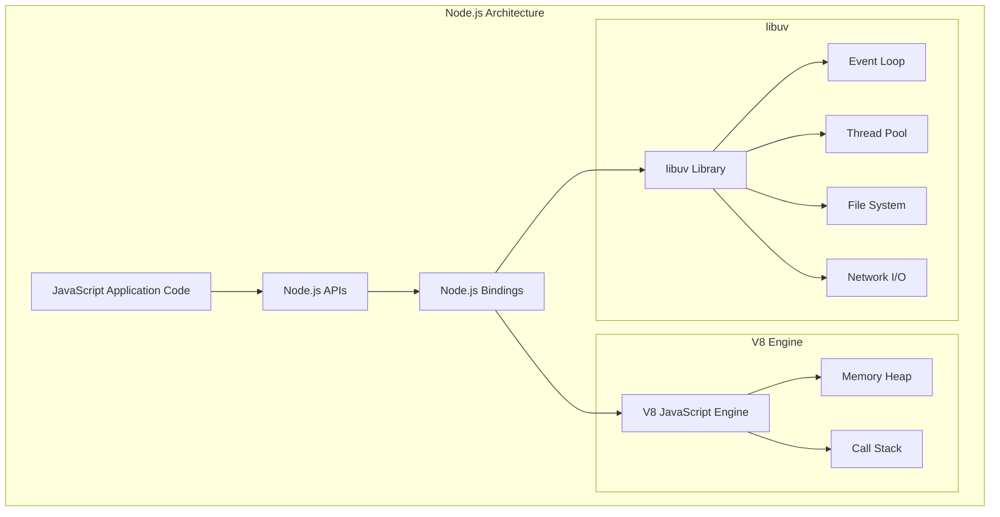
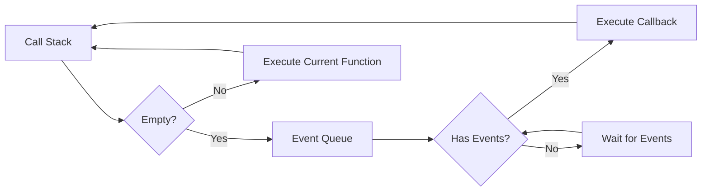
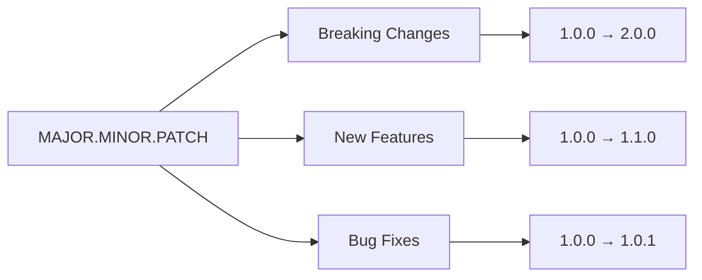

# Лекція 3. Node.js основи та NPM

## Вступ до Node.js

Node.js представляє собою серверне середовище виконання JavaScript, яке дозволяє розробникам створювати масштабовані мережеві додатки поза межами браузера. Розроблений Раяном Далем у 2009 році, Node.js заснований на движку V8 від Google Chrome та використовує асинхронну, подієво-орієнтовану архітектуру.

### Визначення та основні характеристики

Node.js – це платформа, побудована на JavaScript рушії V8 від Chrome, призначена для виконання JavaScript коду на серверній стороні. Ключовими особливостями Node.js є:

- Асинхронна та неблокуюча природа операцій введення-виведення дозволяє обробляти тисячі одночасних з'єднань з мінімальними витратами ресурсів. Це досягається завдяки циклу подій (event loop), який постійно перевіряє наявність завдань у черзі та виконує їх поступово.
- Єдина мова програмування для frontend та backend розробки спрощує процес створення повнофункціональних вебдодатків. Розробники можуть використовувати свої знання JavaScript як для клієнтської, так і для серверної частини додатка.
- Величезна екосистема NPM (Node Package Manager) надає доступ до сотень тисяч готових модулів та бібліотек, що значно прискорює процес розробки.

### Архітектура Node.js та цикл подій



Цикл подій є серцем Node.js архітектури. Він працює в одному потоці та постійно перевіряє наявність подій для обробки. Коли асинхронна операція завершується, відповідний callback додається до черги подій для виконання.



Фази циклу подій включають:

Фаза timers виконує callback функції, заплановані за допомогою setTimeout та setInterval. Pending callbacks обробляє callback'и для деяких системних операцій. Idle та prepare використовуються внутрішньо Node.js. Poll фаза отримує нові I/O події та виконує I/O callback'и. Check виконує setImmediate callback'и. Close callbacks обробляє закриття з'єднань та очищення ресурсів.

### Переваги Node.js

- Висока продуктивність для I/O-інтенсивних додатків досягається завдяки неблокуючій архітектурі. Традиційні серверні технології створюють новий потік для кожного клієнтського підключення, що споживає значну кількість пам'яті. Node.js обслуговує всі запити в одному потоці, використовуючи цикл подій.
- Швидкість розробки підвищується завдяки використанню однієї мови програмування для всього стеку технологій. Розробники можуть легко перемикатися між роботою з клієнтською та серверною частиною, не змінюючи контекст мови програмування.
- Активна спільнота та екосистема забезпечують постійний розвиток платформи. Щороку випускаються нові версії з поліпшеннями продуктивності та новими можливостями.

### Недоліки Node.js

- Не підходить для CPU-інтенсивних задач через однопотоковість основного циклу подій. Складні математичні обчислення або обробка великих даних можуть заблокувати цикл подій та знизити продуктивність всього додатка.
- Callback hell може ускладнити читання та підтримку коду при великій кількості вкладених асинхронних операцій. Хоча сучасні підходи з промісами та async/await вирішують цю проблему, legacy код може бути складним для розуміння.
- Швидкі зміни в екосистемі іноді призводять до проблем сумісності та необхідності частого оновлення залежностей.

## NPM екосистема

Node Package Manager представляє собою найбільший у світі реєстр програмних пакетів. NPM складається з трьох основних компонентів: веб-сайту для пошуку пакетів, інтерфейсу командного рядка для встановлення та управління пакетами, та реєстру для зберігання та розповсюдження пакетів.

### Основи роботи з NPM

Ініціалізація нового проєкту відбувається за допомогою команди npm init, яка створює файл package.json з базовою конфігурацією проєкту:

```bash
npm init
```

Інтерактивний режим запитає інформацію про назву проєкту, версію, опис, точку входу, автора та ліцензію. Для швидкої ініціалізації з значеннями за замовчуванням можна використовувати:

```bash
npm init -y
```

Встановлення пакетів здійснюється командою npm install. Існує кілька варіантів встановлення:

```bash
# Встановлення пакета як звичайну залежність
npm install express

# Встановлення пакета як залежність для розробки
npm install --save-dev nodemon

# Встановлення пакета глобально
npm install -g typescript

# Встановлення конкретної версії
npm install express@4.18.0
```

### Структура package.json

Файл package.json є серцем будь-якого Node.js проєкту. Він містить метадані про проєкт та список залежностей:

```json
{
  "name": "my-web-app",
  "version": "1.0.0",
  "description": "Навчальний вебдодаток",
  "main": "index.js",
  "scripts": {
    "start": "node index.js",
    "dev": "nodemon index.js",
    "test": "jest"
  },
  "keywords": ["web", "express", "api"],
  "author": "Студент Іванович",
  "license": "MIT",
  "dependencies": {
    "express": "^4.18.2",
    "mongoose": "^7.0.3"
  },
  "devDependencies": {
    "nodemon": "^2.0.22",
    "jest": "^29.5.0"
  },
  "engines": {
    "node": ">=16.0.0"
  }
}
```

Поле scripts дозволяє визначити команди для автоматизації різних завдань розробки. Команди можна виконувати за допомогою npm run command_name.

Dependencies містить пакети, необхідні для роботи додатка в продакшені. DevDependencies включає пакети, потрібні тільки під час розробки та тестування.

### Семантичне версіонування

NPM використовує семантичне версіонування (SemVer) для управління версіями пакетів. Версія складається з трьох частин: MAJOR.MINOR.PATCH.



Префікси версій визначають, які оновлення дозволено автоматично встановлювати:

Символ ^ дозволяє оновлення, сумісні з вказаною версією. Наприклад, ^1.2.3 дозволить встановлення версій від 1.2.3 до 1.x.x, але не 2.0.0.

Символ ~ дозволяє оновлення тільки патч-версій. Наприклад, ~1.2.3 дозволить версії від 1.2.3 до 1.2.x.

Відсутність префікса означає точну версію без автоматичних оновлень.

### Файл package-lock.json

Package-lock.json автоматично генерується при встановленні пакетів та фіксує точні версії всіх залежностей та їх під-залежностей. Це забезпечує відтворюваність збірок на різних машинах та середовищах.

```json
{
  "name": "my-web-app",
  "version": "1.0.0",
  "lockfileVersion": 3,
  "requires": true,
  "packages": {
    "": {
      "name": "my-web-app",
      "version": "1.0.0",
      "dependencies": {
        "express": "^4.18.2"
      }
    },
    "node_modules/express": {
      "version": "4.18.2",
      "resolved": "https://registry.npmjs.org/express/-/express-4.18.2.tgz",
      "integrity": "sha512-...",
      "dependencies": {
        "accepts": "~1.3.8",
        "array-flatten": "1.1.1"
      }
    }
  }
}
```

### NPM скрипти та автоматизація

NPM скрипти надають потужний механізм автоматизації завдань розробки. Вони можуть включати компіляцію коду, запуск тестів, лінтинг та деплой:

```json
{
  "scripts": {
    "start": "node src/index.js",
    "dev": "nodemon src/index.js",
    "build": "webpack --mode production",
    "test": "jest --coverage",
    "lint": "eslint src/",
    "lint:fix": "eslint src/ --fix",
    "clean": "rm -rf dist/",
    "deploy": "npm run build && npm run test && git push heroku main"
  }
}
```

Pre та post хуки дозволяють виконувати команди до та після основних скриптів:

```json
{
  "scripts": {
    "prebuild": "npm run clean",
    "build": "webpack --mode production",
    "postbuild": "npm run test",
    "pretest": "npm run lint",
    "test": "jest"
  }
}
```

## Модульна система Node.js

Node.js підтримує дві основні модульні системи: CommonJS (за замовчуванням) та ES Modules (сучасний стандарт). Розуміння різниці між ними є критично важливим для ефективної розробки.

### CommonJS модулі

CommonJS є традиційною модульною системою Node.js, яка використовує require() для імпорту та module.exports для експорту:

```javascript
// math.js - експорт функцій
function add(a, b) {
    return a + b;
}

function subtract(a, b) {
    return a - b;
}

function multiply(a, b) {
    return a * b;
}

// Експорт окремих функцій
exports.add = add;
exports.subtract = subtract;

// Альтернативний спосіб експорту всього об'єкта
module.exports = {
    add,
    subtract,
    multiply
};
```

Імпорт CommonJS модулів може відбуватися кількома способами:

```javascript
// app.js - імпорт модулів
const math = require('./math');
const { add, subtract } = require('./math');
const express = require('express');

// Використання імпортованих функцій
console.log(math.add(5, 3)); // 8
console.log(add(10, 7)); // 17

// Імпорт вбудованих модулів
const fs = require('fs');
const path = require('path');
```

### ES Modules

ES Modules представляють сучасний стандарт модульної системи JavaScript, який нативно підтримується браузерами та Node.js:

```javascript
// math.mjs - експорт ES модулів
export function add(a, b) {
    return a + b;
}

export function subtract(a, b) {
    return a - b;
}

function multiply(a, b) {
    return a * b;
}

// Експорт за замовчуванням
export default multiply;

// Експорт всіх функцій одразу
export { add, subtract, multiply };
```

Імпорт ES модулів використовує синтаксис import:

```javascript
// app.mjs - імпорт ES модулів
import multiply from './math.mjs';
import { add, subtract } from './math.mjs';
import * as math from './math.mjs';

// Динамічний імпорт
const mathModule = await import('./math.mjs');

console.log(add(5, 3)); // 8
console.log(math.multiply(4, 6)); // 24
```

### Налаштування ES Modules у Node.js

Для використання ES modules у Node.js необхідно вказати "type": "module" у package.json:

```json
{
  "name": "es-modules-app",
  "version": "1.0.0",
  "type": "module",
  "main": "index.js"
}
```

Альтернативно можна використовувати розширення .mjs для файлів з ES модулями та .cjs для CommonJS модулів:

```
project/
├── package.json
├── index.js          // ES modules (якщо type: "module")
├── math.mjs          // ES modules
├── utils.cjs         // CommonJS
└── config.json
```

### Взаємодія між модульними системами

Node.js дозволяє обмежену взаємодію між CommonJS та ES modules:

```javascript
// commonjs-module.cjs
module.exports = {
    message: "Hello from CommonJS"
};

// es-module.mjs
import commonjsModule from './commonjs-module.cjs';
console.log(commonjsModule.message);

// Динамічний імпорт CommonJS з ES модуля
const { createRequire } = await import('module');
const require = createRequire(import.meta.url);
const lodash = require('lodash');
```

## Основні вбудовані модулі Node.js

Node.js надає велику кількість вбудованих модулів для роботи з файловою системою, мережею, шляхами та іншими системними ресурсами.

### Модуль File System (fs)

Модуль fs надає API для взаємодії з файловою системою операційної системи:

```javascript
import fs from 'fs';
import { promises as fsPromises } from 'fs';

// Синхронні операції (блокують виконання)
try {
    const data = fs.readFileSync('config.txt', 'utf8');
    console.log(data);
} catch (error) {
    console.error('Помилка читання файлу:', error.message);
}

// Асинхронні операції з callback
fs.readFile('config.txt', 'utf8', (error, data) => {
    if (error) {
        console.error('Помилка:', error.message);
        return;
    }
    console.log('Вміст файлу:', data);
});

// Асинхронні операції з промісами
async function readConfigFile() {
    try {
        const data = await fsPromises.readFile('config.txt', 'utf8');
        console.log('Конфігурація:', data);
        return JSON.parse(data);
    } catch (error) {
        console.error('Помилка читання конфігурації:', error.message);
        throw error;
    }
}
```

Робота з директоріями та метаданими файлів:

```javascript
import fs from 'fs/promises';
import path from 'path';

async function analyzeDirectory(dirPath) {
    try {
        const items = await fs.readdir(dirPath, { withFileTypes: true });

        for (const item of items) {
            const itemPath = path.join(dirPath, item.name);

            if (item.isDirectory()) {
                console.log(`📁 Директорія: ${item.name}`);
                // Рекурсивний обхід піддиректорій
                await analyzeDirectory(itemPath);
            } else if (item.isFile()) {
                const stats = await fs.stat(itemPath);
                console.log(`📄 Файл: ${item.name}`);
                console.log(`   Розмір: ${stats.size} байт`);
                console.log(`   Змінено: ${stats.mtime.toISOString()}`);
            }
        }
    } catch (error) {
        console.error(`Помилка обробки директорії ${dirPath}:`, error.message);
    }
}
```

### Модуль Path

Модуль path надає утиліти для роботи зі шляхами файлів та директорій:

```javascript
import path from 'path';

// Об'єднання частин шляху
const fullPath = path.join('/users', 'student', 'documents', 'project.js');
console.log(fullPath); // /users/student/documents/project.js

// Розрішення абсолютного шляху
const absolutePath = path.resolve('src', 'components', 'App.js');
console.log(absolutePath); // /current/working/directory/src/components/App.js

// Отримання інформації про шлях
const filePath = '/home/user/projects/webapp/src/index.js';
console.log('Директорія:', path.dirname(filePath));   // /home/user/projects/webapp/src
console.log('Ім\'я файлу:', path.basename(filePath)); // index.js
console.log('Розширення:', path.extname(filePath));   // .js
console.log('Ім\'я без розширення:', path.parse(filePath).name); // index

// Нормалізація шляху
const messyPath = '/users//student/../teacher/./documents';
console.log(path.normalize(messyPath)); // /users/teacher/documents
```

Кросплатформова робота зі шляхами:

```javascript
import path from 'path';
import { fileURLToPath } from 'url';

// Отримання поточної директорії в ES modules
const __filename = fileURLToPath(import.meta.url);
const __dirname = path.dirname(__filename);

// Створення шляхів незалежно від операційної системи
const configPath = path.join(__dirname, 'config', 'database.json');
const uploadsPath = path.join(__dirname, '..', 'uploads');

console.log('Поточна директорія:', __dirname);
console.log('Шлях до конфігурації:', configPath);
console.log('Шлях до завантажень:', uploadsPath);
```

### Модуль HTTP

Модуль http надає можливості для створення HTTP серверів та клієнтів:

```javascript
import http from 'http';
import url from 'url';

// Створення простого HTTP сервера
const server = http.createServer((request, response) => {
    const parsedUrl = url.parse(request.url, true);
    const pathname = parsedUrl.pathname;
    const method = request.method;

    // Встановлення заголовків відповіді
    response.setHeader('Content-Type', 'application/json');
    response.setHeader('Access-Control-Allow-Origin', '*');

    // Обробка різних маршрутів
    if (pathname === '/' && method === 'GET') {
        response.statusCode = 200;
        response.end(JSON.stringify({
            message: 'Ласкаво просимо до API',
            timestamp: new Date().toISOString()
        }));
    } else if (pathname === '/users' && method === 'GET') {
        response.statusCode = 200;
        response.end(JSON.stringify({
            users: [
                { id: 1, name: 'Іван' },
                { id: 2, name: 'Марія' }
            ]
        }));
    } else {
        response.statusCode = 404;
        response.end(JSON.stringify({
            error: 'Ресурс не знайдено'
        }));
    }
});

// Запуск сервера
const PORT = process.env.PORT || 3000;
server.listen(PORT, () => {
    console.log(`Сервер запущено на порті ${PORT}`);
});
```

Створення HTTP клієнта для виконання запитів:

```javascript
import http from 'http';
import https from 'https';

function makeRequest(url, options = {}) {
    return new Promise((resolve, reject) => {
        const isHttps = url.startsWith('https');
        const httpModule = isHttps ? https : http;

        const request = httpModule.request(url, options, (response) => {
            let data = '';

            response.on('data', (chunk) => {
                data += chunk;
            });

            response.on('end', () => {
                try {
                    const parsedData = JSON.parse(data);
                    resolve({
                        statusCode: response.statusCode,
                        headers: response.headers,
                        data: parsedData
                    });
                } catch (error) {
                    resolve({
                        statusCode: response.statusCode,
                        headers: response.headers,
                        data: data
                    });
                }
            });
        });

        request.on('error', reject);

        if (options.body) {
            request.write(options.body);
        }

        request.end();
    });
}

// Використання HTTP клієнта
async function fetchUserData() {
    try {
        const response = await makeRequest('https://jsonplaceholder.typicode.com/users/1');
        console.log('Статус:', response.statusCode);
        console.log('Дані користувача:', response.data);
    } catch (error) {
        console.error('Помилка запиту:', error.message);
    }
}
```

### Модуль URL

Модуль url надає утиліти для парсингу та роботи з URL адресами:

```javascript
import { URL, URLSearchParams } from 'url';

// Парсинг URL
const apiUrl = new URL('https://api.example.com/users?page=2&limit=10&sort=name');

console.log('Протокол:', apiUrl.protocol);     // https:
console.log('Хост:', apiUrl.host);             // api.example.com
console.log('Шлях:', apiUrl.pathname);         // /users
console.log('Параметри:', apiUrl.search);      // ?page=2&limit=10&sort=name

// Робота з параметрами запиту
const params = apiUrl.searchParams;
console.log('Сторінка:', params.get('page'));  // 2
console.log('Ліміт:', params.get('limit'));    // 10

// Модифікація URL
params.set('page', '3');
params.append('filter', 'active');
console.log('Оновлений URL:', apiUrl.toString());

// Створення URL з параметрами
function buildApiUrl(baseUrl, endpoint, queryParams = {}) {
    const url = new URL(endpoint, baseUrl);

    Object.entries(queryParams).forEach(([key, value]) => {
        if (value !== undefined && value !== null) {
            url.searchParams.set(key, value.toString());
        }
    });

    return url.toString();
}

const userApiUrl = buildApiUrl('https://api.example.com', '/users', {
    page: 1,
    limit: 25,
    sort: 'created_at',
    order: 'desc'
});

console.log('API URL:', userApiUrl);
```

## Налаштування середовища розробки

Ефективне середовище розробки Node.js включає правильну конфігурацію редактора коду, налаштування інструментів для відлагодження та автоматизації процесів розробки.

### Конфігурація VS Code для Node.js

Visual Studio Code надає відмінну підтримку Node.js розробки. Рекомендовані розширення:

```json
{
  "recommendations": [
    "ms-vscode.vscode-node-debug2",
    "christian-kohler.npm-intellisense",
    "eg2.vscode-npm-script",
    "bradlc.vscode-tailwindcss",
    "esbenp.prettier-vscode",
    "dbaeumer.vscode-eslint"
  ]
}
```

Конфігурація налагодження в launch.json:

```json
{
  "version": "0.2.0",
  "configurations": [
    {
      "type": "node",
      "request": "launch",
      "name": "Launch Program",
      "skipFiles": ["<node_internals>/**"],
      "program": "${workspaceFolder}/src/index.js",
      "env": {
        "NODE_ENV": "development"
      }
    },
    {
      "type": "node",
      "request": "attach",
      "name": "Attach to Process",
      "port": 9229,
      "restart": true,
      "localRoot": "${workspaceFolder}",
      "remoteRoot": "."
    }
  ]
}
```

### Налаштування ESLint та Prettier

ESLint забезпечує статичний аналіз коду для виявлення потенційних помилок:

```json
{
  "env": {
    "node": true,
    "es2022": true
  },
  "extends": [
    "eslint:recommended"
  ],
  "parserOptions": {
    "ecmaVersion": "latest",
    "sourceType": "module"
  },
  "rules": {
    "indent": ["error", 2],
    "linebreak-style": ["error", "unix"],
    "quotes": ["error", "single"],
    "semi": ["error", "always"],
    "no-unused-vars": ["error", { "argsIgnorePattern": "^_" }],
    "no-console": "warn",
    "prefer-const": "error"
  }
}
```

Prettier забезпечує автоматичне форматування коду:

```json
{
  "semi": true,
  "trailingComma": "es5",
  "singleQuote": true,
  "printWidth": 80,
  "tabWidth": 2,
  "useTabs": false
}
```

### Змінні середовища

Використання змінних середовища для конфігурації додатків:

```javascript
// config.js
import dotenv from 'dotenv';

dotenv.config();

const config = {
  port: process.env.PORT || 3000,
  nodeEnv: process.env.NODE_ENV || 'development',
  database: {
    host: process.env.DB_HOST || 'localhost',
    port: process.env.DB_PORT || 5432,
    name: process.env.DB_NAME || 'webapp',
    user: process.env.DB_USER || 'user',
    password: process.env.DB_PASSWORD || 'password'
  },
  jwt: {
    secret: process.env.JWT_SECRET || 'fallback-secret-key',
    expiresIn: process.env.JWT_EXPIRES_IN || '24h'
  },
  email: {
    service: process.env.EMAIL_SERVICE || 'gmail',
    user: process.env.EMAIL_USER,
    password: process.env.EMAIL_PASSWORD
  }
};

// Валідація критичних змінних
if (!config.jwt.secret || config.jwt.secret === 'fallback-secret-key') {
  console.warn('Увага: використовується JWT секрет за замовчуванням');
}

if (config.nodeEnv === 'production' && !config.email.user) {
  throw new Error('EMAIL_USER must be set in production');
}

export default config;
```

Файл .env для локальної розробки:

```env
NODE_ENV=development
PORT=3000

# Database
DB_HOST=localhost
DB_PORT=5432
DB_NAME=webapp_dev
DB_USER=developer
DB_PASSWORD=dev_password

# JWT
JWT_SECRET=super-secret-key-for-development
JWT_EXPIRES_IN=7d

# Email
EMAIL_SERVICE=gmail
EMAIL_USER=your-email@gmail.com
EMAIL_PASSWORD=your-app-password
```

### Скрипти розробки

Налаштування package.json для зручної розробки:

```json
{
  "scripts": {
    "start": "node src/index.js",
    "dev": "nodemon src/index.js",
    "dev:debug": "nodemon --inspect src/index.js",
    "build": "npm run clean && npm run compile",
    "clean": "rm -rf dist/",
    "compile": "babel src --out-dir dist",
    "test": "jest",
    "test:watch": "jest --watch",
    "test:coverage": "jest --coverage",
    "lint": "eslint src/",
    "lint:fix": "eslint src/ --fix",
    "format": "prettier --write src/",
    "check": "npm run lint && npm run test",
    "prepare": "husky install"
  }
}
```

### Автоматизація з Nodemon

Nodemon автоматично перезапускає додаток при зміні файлів:

```json
{
  "watch": ["src"],
  "ext": "js,mjs,json",
  "ignore": ["src/**/*.test.js"],
  "exec": "node src/index.js",
  "env": {
    "NODE_ENV": "development"
  },
  "delay": "1000"
}
```

### Git хуки з Husky

Автоматична перевірка коду перед комітом:

```json
{
  "husky": {
    "hooks": {
      "pre-commit": "lint-staged",
      "pre-push": "npm run test"
    }
  },
  "lint-staged": {
    "*.js": [
      "eslint --fix",
      "prettier --write",
      "git add"
    ]
  }
}
```

## Практичні приклади

### Створення простого веб-сервера

Розглянемо створення базового веб-сервера з використанням вбудованих модулів Node.js:

```javascript
// server.js
import http from 'http';
import fs from 'fs/promises';
import path from 'path';
import { fileURLToPath } from 'url';

const __filename = fileURLToPath(import.meta.url);
const __dirname = path.dirname(__filename);

class SimpleWebServer {
  constructor(port = 3000) {
    this.port = port;
    this.server = http.createServer(this.handleRequest.bind(this));
  }

  async handleRequest(request, response) {
    const { method, url } = request;

    // Налаштування CORS заголовків
    this.setCorsHeaders(response);

    // Обробка preflight запитів
    if (method === 'OPTIONS') {
      response.statusCode = 200;
      response.end();
      return;
    }

    try {
      if (method === 'GET') {
        await this.handleGetRequest(url, response);
      } else if (method === 'POST') {
        await this.handlePostRequest(request, response);
      } else {
        this.sendError(response, 405, 'Method Not Allowed');
      }
    } catch (error) {
      console.error('Server error:', error);
      this.sendError(response, 500, 'Internal Server Error');
    }
  }

  setCorsHeaders(response) {
    response.setHeader('Access-Control-Allow-Origin', '*');
    response.setHeader('Access-Control-Allow-Methods', 'GET, POST, PUT, DELETE, OPTIONS');
    response.setHeader('Access-Control-Allow-Headers', 'Content-Type, Authorization');
  }

  async handleGetRequest(url, response) {
    if (url === '/') {
      await this.serveStaticFile('public/index.html', response);
    } else if (url === '/api/status') {
      this.sendJson(response, {
        status: 'active',
        timestamp: new Date().toISOString(),
        uptime: process.uptime()
      });
    } else if (url.startsWith('/api/users')) {
      await this.handleUsersApi(response);
    } else if (url.startsWith('/static/')) {
      const filePath = url.replace('/static/', 'public/');
      await this.serveStaticFile(filePath, response);
    } else {
      this.sendError(response, 404, 'Not Found');
    }
  }

  async handlePostRequest(request, response) {
    if (request.url === '/api/users') {
      const body = await this.parseRequestBody(request);

      // Валідація даних
      if (!body.name || !body.email) {
        this.sendError(response, 400, 'Name and email are required');
        return;
      }

      // Імітація збереження користувача
      const newUser = {
        id: Date.now(),
        name: body.name,
        email: body.email,
        createdAt: new Date().toISOString()
      };

      this.sendJson(response, newUser, 201);
    } else {
      this.sendError(response, 404, 'Not Found');
    }
  }

  async handleUsersApi(response) {
    // Імітація даних користувачів
    const users = [
      { id: 1, name: 'Іван Петренко', email: 'ivan@example.com' },
      { id: 2, name: 'Марія Іваненко', email: 'maria@example.com' },
      { id: 3, name: 'Петро Сидоренко', email: 'petro@example.com' }
    ];

    this.sendJson(response, { users, total: users.length });
  }

  async serveStaticFile(filePath, response) {
    try {
      const fullPath = path.join(__dirname, filePath);
      const content = await fs.readFile(fullPath);
      const ext = path.extname(filePath);

      const contentTypes = {
        '.html': 'text/html; charset=utf-8',
        '.css': 'text/css',
        '.js': 'application/javascript',
        '.json': 'application/json',
        '.png': 'image/png',
        '.jpg': 'image/jpeg',
        '.gif': 'image/gif'
      };

      response.setHeader('Content-Type', contentTypes[ext] || 'text/plain');
      response.statusCode = 200;
      response.end(content);
    } catch (error) {
      if (error.code === 'ENOENT') {
        this.sendError(response, 404, 'File not found');
      } else {
        throw error;
      }
    }
  }

  async parseRequestBody(request) {
    return new Promise((resolve, reject) => {
      let body = '';

      request.on('data', (chunk) => {
        body += chunk.toString();
      });

      request.on('end', () => {
        try {
          resolve(JSON.parse(body));
        } catch (error) {
          reject(new Error('Invalid JSON'));
        }
      });

      request.on('error', reject);
    });
  }

  sendJson(response, data, statusCode = 200) {
    response.setHeader('Content-Type', 'application/json');
    response.statusCode = statusCode;
    response.end(JSON.stringify(data, null, 2));
  }

  sendError(response, statusCode, message) {
    this.sendJson(response, { error: message }, statusCode);
  }

  start() {
    this.server.listen(this.port, () => {
      console.log(`Сервер запущено на http://localhost:${this.port}`);
      console.log('Доступні ендпоінти:');
      console.log('  GET  /              - Головна сторінка');
      console.log('  GET  /api/status    - Статус сервера');
      console.log('  GET  /api/users     - Список користувачів');
      console.log('  POST /api/users     - Створення користувача');
    });
  }

  stop() {
    this.server.close();
  }
}

// Запуск сервера
const server = new SimpleWebServer(3000);
server.start();

// Graceful shutdown
process.on('SIGTERM', () => {
  console.log('Отримано SIGTERM, завершення роботи...');
  server.stop();
  process.exit(0);
});

process.on('SIGINT', () => {
  console.log('Отримано SIGINT, завершення роботи...');
  server.stop();
  process.exit(0);
});
```

### Утиліта для роботи з файлами

Створення корисної утиліти для аналізу та обробки файлів:

```javascript
// file-analyzer.js
import fs from 'fs/promises';
import path from 'path';
import { createHash } from 'crypto';

class FileAnalyzer {
  constructor() {
    this.supportedFormats = ['.txt', '.js', '.json', '.md', '.html', '.css'];
  }

  async analyzeDirectory(dirPath, options = {}) {
    const {
      recursive = true,
      includeHidden = false,
      calculateHashes = false
    } = options;

    const results = {
      totalFiles: 0,
      totalSize: 0,
      fileTypes: {},
      largestFile: null,
      duplicates: [],
      structure: {}
    };

    const fileHashes = new Map();

    try {
      await this._processDirectory(dirPath, results, fileHashes, {
        recursive,
        includeHidden,
        calculateHashes
      });

      // Пошук дублікатів
      if (calculateHashes) {
        results.duplicates = this._findDuplicates(fileHashes);
      }

      return results;
    } catch (error) {
      throw new Error(`Помилка аналізу директорії: ${error.message}`);
    }
  }

  async _processDirectory(dirPath, results, fileHashes, options) {
    const items = await fs.readdir(dirPath, { withFileTypes: true });

    for (const item of items) {
      if (!options.includeHidden && item.name.startsWith('.')) {
        continue;
      }

      const itemPath = path.join(dirPath, item.name);

      if (item.isDirectory()) {
        if (options.recursive) {
          await this._processDirectory(itemPath, results, fileHashes, options);
        }
      } else if (item.isFile()) {
        await this._processFile(itemPath, results, fileHashes, options);
      }
    }
  }

  async _processFile(filePath, results, fileHashes, options) {
    try {
      const stats = await fs.stat(filePath);
      const ext = path.extname(filePath).toLowerCase();

      results.totalFiles++;
      results.totalSize += stats.size;

      // Підрахунок типів файлів
      if (!results.fileTypes[ext]) {
        results.fileTypes[ext] = { count: 0, totalSize: 0 };
      }
      results.fileTypes[ext].count++;
      results.fileTypes[ext].totalSize += stats.size;

      // Знаходження найбільшого файлу
      if (!results.largestFile || stats.size > results.largestFile.size) {
        results.largestFile = {
          path: filePath,
          size: stats.size,
          modified: stats.mtime
        };
      }

      // Обчислення хешу для пошуку дублікатів
      if (options.calculateHashes && stats.size > 0) {
        const hash = await this._calculateFileHash(filePath);
        if (!fileHashes.has(hash)) {
          fileHashes.set(hash, []);
        }
        fileHashes.get(hash).push({
          path: filePath,
          size: stats.size
        });
      }
    } catch (error) {
      console.warn(`Не вдалося обробити файл ${filePath}: ${error.message}`);
    }
  }

  async _calculateFileHash(filePath) {
    const content = await fs.readFile(filePath);
    return createHash('md5').update(content).digest('hex');
  }

  _findDuplicates(fileHashes) {
    const duplicates = [];

    for (const [hash, files] of fileHashes) {
      if (files.length > 1) {
        duplicates.push({
          hash,
          files: files.map(f => f.path),
          size: files[0].size,
          count: files.length
        });
      }
    }

    return duplicates.sort((a, b) => b.size - a.size);
  }

  async cleanupDirectory(dirPath, options = {}) {
    const {
      removeEmpty = false,
      removeByExtension = [],
      olderThan = null
    } = options;

    const results = {
      removedFiles: [],
      removedDirectories: [],
      freedSpace: 0
    };

    try {
      await this._cleanupRecursive(dirPath, results, options);
      return results;
    } catch (error) {
      throw new Error(`Помилка очищення директорії: ${error.message}`);
    }
  }

  async _cleanupRecursive(dirPath, results, options) {
    const items = await fs.readdir(dirPath, { withFileTypes: true });

    for (const item of items) {
      const itemPath = path.join(dirPath, item.name);

      if (item.isDirectory()) {
        await this._cleanupRecursive(itemPath, results, options);

        // Видалення порожніх директорій
        if (options.removeEmpty) {
          try {
            const isEmpty = (await fs.readdir(itemPath)).length === 0;
            if (isEmpty) {
              await fs.rmdir(itemPath);
              results.removedDirectories.push(itemPath);
            }
          } catch (error) {
            console.warn(`Не вдалося видалити директорію ${itemPath}`);
          }
        }
      } else if (item.isFile()) {
        const shouldRemove = await this._shouldRemoveFile(itemPath, options);

        if (shouldRemove) {
          try {
            const stats = await fs.stat(itemPath);
            await fs.unlink(itemPath);
            results.removedFiles.push(itemPath);
            results.freedSpace += stats.size;
          } catch (error) {
            console.warn(`Не вдалося видалити файл ${itemPath}`);
          }
        }
      }
    }
  }

  async _shouldRemoveFile(filePath, options) {
    const ext = path.extname(filePath).toLowerCase();

    // Перевірка розширення
    if (options.removeByExtension.includes(ext)) {
      return true;
    }

    // Перевірка віку файлу
    if (options.olderThan) {
      const stats = await fs.stat(filePath);
      const fileAge = Date.now() - stats.mtime.getTime();
      if (fileAge > options.olderThan) {
        return true;
      }
    }

    return false;
  }

  formatSize(bytes) {
    const units = ['B', 'KB', 'MB', 'GB', 'TB'];
    let size = bytes;
    let unitIndex = 0;

    while (size >= 1024 && unitIndex < units.length - 1) {
      size /= 1024;
      unitIndex++;
    }

    return `${size.toFixed(2)} ${units[unitIndex]}`;
  }

  generateReport(analysisResults) {
    const report = [];

    report.push('='.repeat(50));
    report.push('ЗВІТ АНАЛІЗУ ФАЙЛІВ');
    report.push('='.repeat(50));
    report.push('');

    report.push(`Загальна кількість файлів: ${analysisResults.totalFiles}`);
    report.push(`Загальний розмір: ${this.formatSize(analysisResults.totalSize)}`);
    report.push('');

    report.push('ТИПИ ФАЙЛІВ:');
    report.push('-'.repeat(30));

    const sortedTypes = Object.entries(analysisResults.fileTypes)
      .sort(([,a], [,b]) => b.totalSize - a.totalSize);

    for (const [ext, data] of sortedTypes) {
      const extName = ext || 'без розширення';
      const percentage = ((data.totalSize / analysisResults.totalSize) * 100).toFixed(1);
      report.push(`${extName}: ${data.count} файлів, ${this.formatSize(data.totalSize)} (${percentage}%)`);
    }

    if (analysisResults.largestFile) {
      report.push('');
      report.push('НАЙБІЛЬШИЙ ФАЙЛ:');
      report.push('-'.repeat(30));
      report.push(`Шлях: ${analysisResults.largestFile.path}`);
      report.push(`Розмір: ${this.formatSize(analysisResults.largestFile.size)}`);
    }

    if (analysisResults.duplicates.length > 0) {
      report.push('');
      report.push('ДУБЛІКАТИ:');
      report.push('-'.repeat(30));

      for (const duplicate of analysisResults.duplicates.slice(0, 5)) {
        report.push(`${duplicate.count} файлів, ${this.formatSize(duplicate.size)} кожен:`);
        duplicate.files.forEach(file => report.push(`  - ${file}`));
        report.push('');
      }
    }

    return report.join('\n');
  }
}

// Приклад використання
async function main() {
  const analyzer = new FileAnalyzer();

  try {
    console.log('Аналіз директорії...');
    const results = await analyzer.analyzeDirectory('./src', {
      recursive: true,
      calculateHashes: true,
      includeHidden: false
    });

    const report = analyzer.generateReport(results);
    console.log(report);

    // Збереження звіту у файл
    await fs.writeFile('file-analysis-report.txt', report, 'utf8');
    console.log('Звіт збережено у file-analysis-report.txt');

  } catch (error) {
    console.error('Помилка:', error.message);
  }
}

// Запуск тільки якщо скрипт викликаний безпосередньо
if (import.meta.url === `file://${process.argv[1]}`) {
  main();
}

export default FileAnalyzer;
```

## Висновки

Node.js представляє потужну платформу для розробки серверних додатків з використанням JavaScript. Розуміння основних концепцій цієї технології є фундаментальним для сучасного веб-розробника.

Ключові аспекти, які слід засвоїти:

Асинхронна природа Node.js та цикл подій формують основу для створення високопродуктивних додатків. Розуміння цих механізмів дозволяє ефективно використовувати ресурси сервера та обробляти велику кількість одночасних підключень.

NPM екосистема надає доступ до величезної кількості готових рішень, що значно прискорює розробку. Правильне управління залежностями та розуміння семантичного версіонування є критично важливими навичками.

Модульна система Node.js, включаючи як CommonJS, так і ES Modules, дозволяє створювати масштабовані та підтримувані додатки. Знання відмінностей між цими системами допомагає приймати обґрунтовані рішення при архітектурі проєктів.

Вбудовані модулі Node.js надають необхідний функціонал для роботи з файловою системою, мережею та іншими системними ресурсами без необхідності встановлення додаткових залежностей.

Правильне налаштування середовища розробки з відповідними інструментами підвищує продуктивність та якість коду. Автоматизація процесів через NPM скрипти та використання інструментів як ESLint та Prettier створюють основу для професійної розробки.

Node.js продовжує еволюціонувати, додаючи нові можливості та поліпшуючи продуктивність. Розуміння фундаментальних принципів дозволяє легко адаптуватися до нововведень та ефективно використовувати потенціал платформи для створення сучасних вебдодатків.
