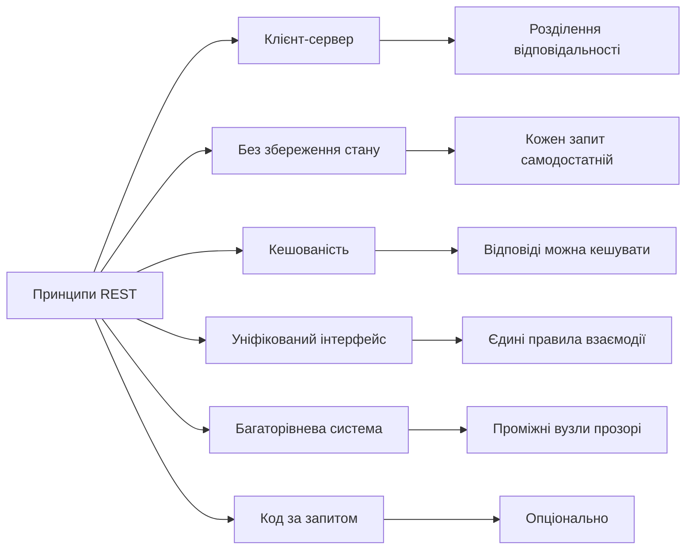
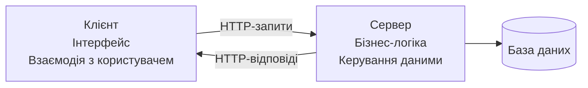
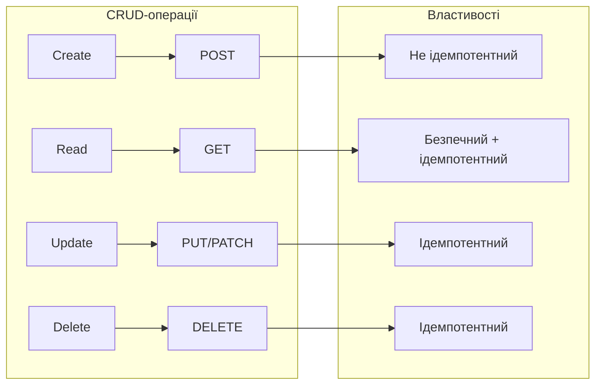
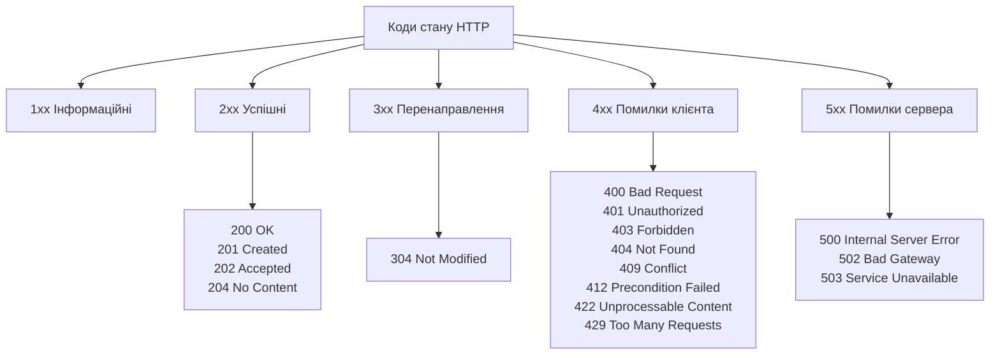
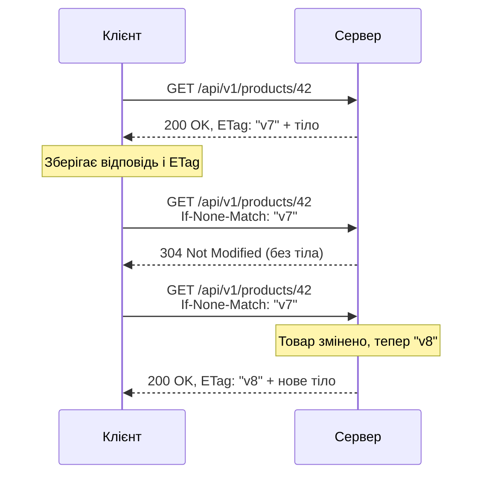
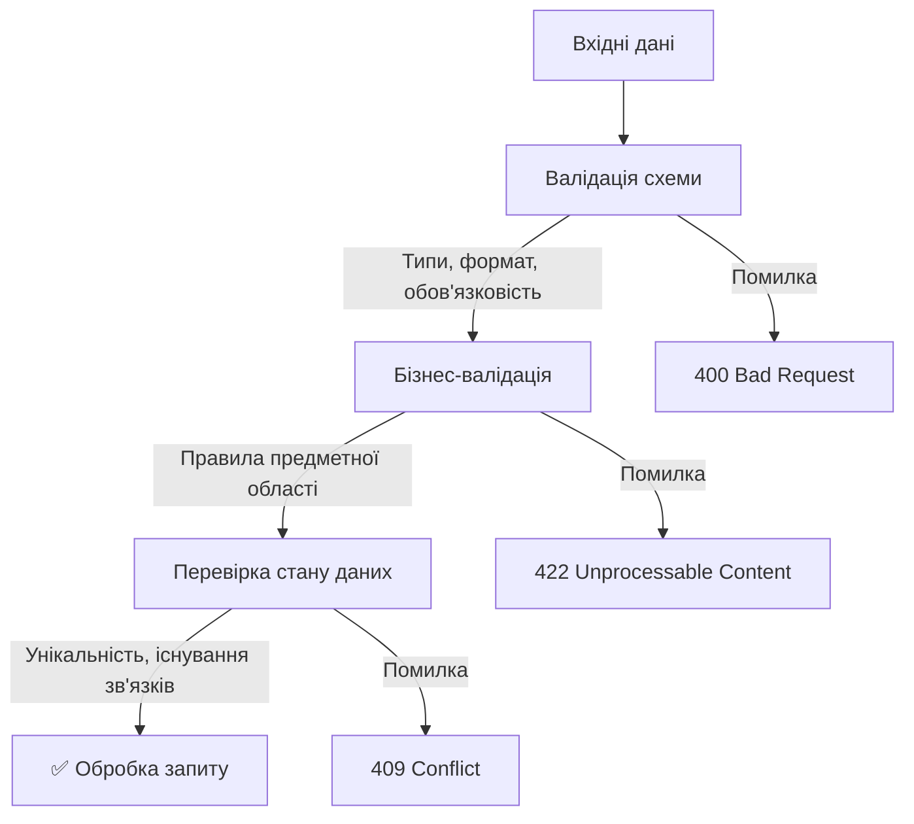
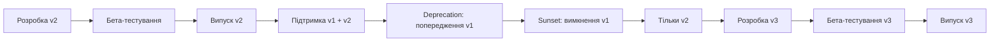

# Лекція 3. RESTful API дизайн

## Вступ до RESTful архітектури

У попередній лекції ми навчилися створювати сервер на Node.js та Express.js: приймати HTTP-запити, розбирати їхні параметри, будувати ланцюжки проміжних обробників (middleware) і повертати відповіді. Проте вміння написати маршрут ще не означає вміння спроєктувати програмний інтерфейс (API), яким зручно й безпечно користуватися роками. Коли кінцевих точок (endpoints) стає кілька десятків, а клієнтів — вебзастосунок, мобільний застосунок і сторонні сервіси, на перший план виходять узгодженість, передбачуваність і здатність API змінюватися, не ламаючи тих, хто ним уже користується.

Саме цим займається дизайн API. У цій лекції ми розглянемо найпоширеніший архітектурний стиль вебінтерфейсів — REST: звідки він узявся, на яких принципах тримається, як правильно використовувати методи та коди стану HTTP, як структурувати адреси ресурсів, обробляти помилки, документувати й версіонувати API. У наступній лекції ми під'єднаємо до цього API базу даних, а ще за одну — захистимо його аутентифікацією та авторизацією. Тож усе, що ви спроєктуєте тут, стане «фасадом», за яким далі ховатиметься реальне сховище даних і логіка доступу.

### Історичні передумови виникнення REST

Наприкінці 1990-х років, коли Всесвітня павутина стрімко розвивалася, розробники зіткнулися з проблемою створення масштабованих та інтероперабельних вебсервісів. Існували різні підходи до побудови розподілених систем — CORBA, RPC, згодом SOAP, — але всі вони мали суттєві недоліки: складність реалізації, важку підтримку, щільне зв'язування клієнта й сервера та низьку масштабованість.

У 2000 році Рой Філдінг, один з авторів специфікації протоколу HTTP/1.1, описав у своїй докторській дисертації концепцію **REST (Representational State Transfer)** — архітектурний стиль для розподілених гіпермедійних систем. REST не є ні протоколом, ні стандартом: це набір архітектурних обмежень, дотримання яких дає системі масштабованість, надійність і здатність до незалежного розвитку частин.

Філдінг спостерігав, що веб працює надзвичайно успішно завдяки кільком простим та універсальним правилам: кожен документ має адресу, браузер і сервер спілкуються невеликим набором стандартних дій, відповіді можна кешувати, а між клієнтом і сервером можуть стояти проксі. Він виділив ці правила й сформулював їх як архітектурний стиль, придатний не лише для вебсторінок, а й для програмних інтерфейсів.

Важливо розуміти: те, що в щоденній практиці називають «REST API», зазвичай є прагматичною інтерпретацією ідей Філдінга — JSON поверх HTTP з ресурсними адресами. Строгий REST вимагає більшого (про це нижче, у розділі про модель зрілості), але саме прагматичний варіант став фактичним стандартом галузі.

### Фундаментальні принципи REST архітектури

REST визначають шість обмежень. Перші п'ять обов'язкові, шосте — опціональне. Кожне з них не є самоціллю: воно дає конкретну властивість системі, і, порушуючи обмеження, ми втрачаємо відповідну властивість.


```mermaid
graph LR
    A[Принципи REST] --> B[Клієнт-сервер]
    A --> C[Без збереження стану]
    A --> D[Кешованість]
    A --> E[Уніфікований інтерфейс]
    A --> F[Багаторівнева система]
    A --> G[Код за запитом]

    B --> B1[Розділення відповідальності]
    C --> C1[Кожен запит самодостатній]
    D --> D1[Відповіді можна кешувати]
    E --> E1[Єдині правила взаємодії]
    F --> F1[Проміжні вузли прозорі]
    G --> G1[Опціонально]
```

#### Принцип 1: Client-Server архітектура

REST передбачає чітке розділення відповідальності між клієнтом та сервером. **Клієнт** відповідає за користувацький інтерфейс та взаємодію з користувачем, тоді як **сервер** керує даними, бізнес-логікою та зберіганням. Це розділення дозволяє незалежно розвивати обидві частини: команда клієнтської частини може переробити інтерфейс, не чіпаючи сервера, а серверна команда — змінити базу даних, не повідомляючи про це клієнтам, доки контракт API лишається тим самим.


```mermaid
graph LR
    Client[Клієнт<br/>Інтерфейс<br/>Взаємодія з користувачем] -->|HTTP-запити| Server[Сервер<br/>Бізнес-логіка<br/>Керування даними]
    Server -->|HTTP-відповіді| Client
    Server --> Database[(База даних)]
```

Саме це обмеження дозволяє одному API обслуговувати кілька різних клієнтів: вебзастосунок, мобільний застосунок, інтеграцію партнера чи сценарій автоматизації.

#### Принцип 2: Stateless (без збереження стану)

Кожен HTTP-запит до сервера повинен містити всю інформацію, необхідну для його обробки. Сервер не зберігає між запитами контекст взаємодії з конкретним клієнтом (так звану сесію застосунку). Якщо для обробки потрібно знати, хто робить запит, клієнт передає цю інформацію в кожному запиті — наприклад, токен у заголовку `Authorization`.

Тут часто виникає непорозуміння. Stateless не означає, що сервер не має даних: база даних, звісно, зберігає стан ресурсів. Мова лише про те, що сервер не «пам'ятає» попередніх запитів клієнта. Так само адреса на кшталт `/api/users/me` цілком сумісна з REST: сервер визначає, хто такий «me», з токена в поточному запиті, а не з пам'яті про попередню взаємодію.

**Переваги stateless підходу:**
- будь-який екземпляр сервера може обробити будь-який запит, тому легко масштабуватися горизонтально за допомогою балансувальника навантаження;
- немає проблем із синхронізацією стану між серверами;
- простіше відновлення після збоїв: перезапуск сервера не «розлогінює» користувачів;
- запити легше кешувати й повторювати.

Ціна цього обмеження — дещо більші запити (кожен несе облікові дані). У лекції 5 ми побачимо, що вибір між сесіями й токенами є саме компромісом навколо цього принципу.

#### Принцип 3: Кешування

Відповіді сервера повинні явно позначатися як кешовані або некешовані. Кешування дозволяє клієнтам і проміжним вузлам повторно використовувати отримані дані, що значно покращує продуктивність та зменшує навантаження на сервер. У HTTP для цього є заголовки `Cache-Control`, `ETag`, `Last-Modified` та умовні запити — їм присвячено окремий розділ цієї лекції.

#### Принцип 4: Уніфікований інтерфейс

Це центральне обмеження REST. Усі ресурси доступні через однакові правила взаємодії, що спрощує архітектуру та робить поведінку системи передбачуваною. Принцип включає чотири складові:

**Ідентифікація ресурсів:** кожен ресурс має унікальний ідентифікатор — URI.

**Маніпулювання ресурсами через представлення:** клієнти не працюють із ресурсом напряму, а отримують і надсилають його представлення (JSON, XML тощо).

**Самоописові повідомлення:** кожне повідомлення містить достатньо інформації, щоб зрозуміти, як його обробити: метод, заголовок `Content-Type`, код стану.

**Гіпермедіа як рушій стану застосунку (HATEOAS):** відповіді містять посилання на доступні далі дії, тож клієнт «відкриває» можливості API, переходячи за посиланнями, а не знаючи всі адреси заздалегідь.

#### Принцип 5: Багаторівнева система

REST дозволяє розміщувати між клієнтом і сервером проміжні компоненти — зворотні проксі, шлюзи API, балансувальники навантаження, мережі доставки вмісту (CDN). Клієнт не знає й не повинен знати, чи спілкується він безпосередньо з кінцевим сервером. Це дає змогу додавати кешування, захист від перевантаження чи шифрування, не змінюючи ні клієнта, ні сервера.

#### Принцип 6: Код за запитом (опціонально)

Сервер може розширювати функціональність клієнта, надсилаючи виконуваний код (наприклад, JavaScript). Цей принцип є опціональним і в API майже не використовується, хоча саме він лежить в основі звичайних вебсторінок.

### Концепція ресурсів у REST

У REST центральним поняттям є **ресурс** — будь-яка інформація, якій можна дати ім'я. Ресурс — це абстракція, а не файл, таблиця бази даних чи об'єкт у коді. Один ресурс може зберігатися в кількох таблицях, а одна таблиця може обслуговувати кілька ресурсів. Саме тому проєктувати API варто, думаючи про те, що потрібно клієнтові, а не про те, як розкладено дані в базі.

**Приклади ресурсів:**
- користувач системи;
- список товарів;
- замовлення;
- звіт за період;
- поточна погода;
- конфігурація системи.

**Ідентифікація ресурсів відбувається через URI (Uniform Resource Identifier):**

```
https://api.example.com/users/123
https://api.example.com/orders
https://api.example.com/products/456/reviews
```

### Представлення ресурсів

Ресурс може мати кілька представлень — форматів, у яких клієнт отримує або надсилає дані. Сьогодні в API абсолютно домінує JSON, але той самий ресурс можна віддати як CSV для експорту чи як HTML для перегляду в браузері. Клієнт повідомляє, який формат хоче отримати, заголовком `Accept`, а сервер указує формат відповіді заголовком `Content-Type`. Цей механізм називається узгодженням вмісту (content negotiation).

```javascript
// JSON представлення користувача
{
    "id": 123,
    "name": "Іван Петренко",
    "email": "ivan@example.com",
    "createdAt": "2026-01-15T10:30:00Z",
    "status": "active"
}

// XML представлення того ж користувача
<user>
    <id>123</id>
    <name>Іван Петренко</name>
    <email>ivan@example.com</email>
    <createdAt>2026-01-15T10:30:00Z</createdAt>
    <status>active</status>
</user>
```

Зверніть увагу на дві домовленості, яких варто дотримуватися в усьому API. По-перше, дати передаються в форматі ISO 8601 з часовим поясом (найчастіше UTC, суфікс `Z`). По-друге, стиль іменування полів обирають один раз — `camelCase`, як у JavaScript, або `snake_case` — і не змішують. У цьому курсі ми використовуємо `camelCase`.

### Модель зрілості Richardson

Щоб оцінити, наскільки API відповідає ідеям REST, часто використовують модель зрілості Леонарда Richardson. Вона описує чотири рівні:

| Рівень | Назва | Що характерно |
|--------|-------|---------------|
| 0 | «Болото POX» | Одна адреса, один метод (зазвичай POST), дія описана в тілі запиту |
| 1 | Ресурси | Окремі адреси для різних ресурсів, але методи HTTP використовуються довільно |
| 2 | Методи HTTP | Правильна семантика GET/POST/PUT/PATCH/DELETE і кодів стану |
| 3 | Гіпермедіа | Відповіді містять посилання на пов'язані ресурси й доступні дії (HATEOAS) |

Переважна більшість промислових API перебуває на рівні 2, і для більшості задач цього достатньо. Саме рівень 2 є метою цієї лекції. Рівень 3 корисно знати: навіть часткове використання посилань (наприклад, `next` і `prev` у посторінковій видачі) робить API зручнішим.

```javascript
// Відповідь із гіпермедійними посиланнями (рівень 3)
{
    "id": 456,
    "status": "pending",
    "total": 1250.00,
    "_links": {
        "self":    { "href": "/api/v1/orders/456" },
        "cancel":  { "href": "/api/v1/orders/456/cancellation", "method": "POST" },
        "payment": { "href": "/api/v1/orders/456/payment", "method": "POST" }
    }
}
```

### REST серед інших підходів

REST — не єдиний спосіб побудувати API. У лекції 1 ми вже згадували tRPC; поруч із ним існують GraphQL та gRPC. Кожен підхід розв'язує свою задачу, і сучасні системи нерідко поєднують кілька з них.

| Підхід | Модель | Формат | Коли доречний |
|--------|--------|--------|---------------|
| REST | Ресурси + методи HTTP | JSON | Публічні API, широке коло клієнтів, потрібне HTTP-кешування |
| GraphQL | Одна кінцева точка, клієнт описує потрібні дані запитом | JSON | Складні клієнти з різними потребами в даних, агрегація кількох джерел |
| gRPC | Виклик віддалених процедур за контрактом Protocol Buffers | Бінарний | Взаємодія між внутрішніми сервісами, потокова передача, висока продуктивність |
| tRPC | Виклик функцій сервера з повною типізацією TypeScript | JSON | Клієнт і сервер в одному репозиторії на TypeScript |

REST лишається вибором за замовчуванням для зовнішніх API: він спирається на стандартні механізми HTTP, його розуміють усі інструменти, а кешування й проміжні вузли працюють «з коробки».

## HTTP методи та їх семантика

Метод HTTP повідомляє серверу, **що** клієнт хоче зробити з ресурсом, тоді як URI вказує, **з яким** ресурсом. Кожен метод має визначену семантику, і дві її властивості особливо важливі для проєктування:

- **безпечний** метод не змінює стан сервера (його можна викликати без побоювань, наприклад, пошуковому роботу);
- **ідемпотентний** метод дає той самий результат на сервері незалежно від того, скільки разів його повторено.

Ідемпотентність — не абстракція, а практичний інструмент. Мережа ненадійна: запит може дійти до сервера, а відповідь загубитися. Якщо метод ідемпотентний, клієнт може спокійно повторити запит. Якщо ні — повторення може, наприклад, двічі списати гроші.


```mermaid
graph LR
    subgraph "CRUD-операції"
        C[Create] --> POST[POST]
        R[Read] --> GET[GET]
        U[Update] --> PUT[PUT/PATCH]
        D[Delete] --> DELETE[DELETE]
    end

    subgraph "Властивості"
        POST --> P1[Не ідемпотентний]
        GET --> G1[Безпечний + ідемпотентний]
        PUT --> U1[Ідемпотентний]
        DELETE --> D1[Ідемпотентний]
    end
```

| Метод | Безпечний | Ідемпотентний | Тіло запиту | Типове використання |
|-------|-----------|---------------|-------------|---------------------|
| GET | так | так | ні | Отримання ресурсу чи колекції |
| POST | ні | ні | так | Створення ресурсу, запуск операції |
| PUT | ні | так | так | Повне заміщення ресурсу |
| PATCH | ні | не гарантовано | так | Часткове оновлення |
| DELETE | ні | так | зазвичай ні | Видалення ресурсу |
| HEAD | так | так | ні | Лише заголовки, без тіла |
| OPTIONS | так | так | ні | Підтримувані методи, попередні запити CORS |

### GET: Отримання даних

**GET** є найчастіше використовуваним методом і призначений для отримання представлення ресурсу. GET-запити повинні бути **безпечними** та **ідемпотентними**.

```http
# Отримання списку користувачів
GET /api/v1/users

HTTP/1.1 200 OK
Content-Type: application/json

[
    {"id": 1, "name": "Іван", "email": "ivan@example.com"},
    {"id": 2, "name": "Марія", "email": "maria@example.com"}
]

# Отримання конкретного користувача
GET /api/v1/users/1

HTTP/1.1 200 OK
{"id": 1, "name": "Іван", "email": "ivan@example.com", "createdAt": "2026-01-01T09:00:00Z"}

# Отримання користувачів з фільтрацією
GET /api/v1/users?status=active&limit=10&offset=20
```

**Особливості GET-запитів:**
- параметри передаються через рядок запиту (query string);
- відповіді можуть кешуватися браузером та проміжними серверами;
- довжина URL обмежена (на практиці — кілька кілобайтів), тому дуже складні умови пошуку в GET не вміщаються;
- тіло запиту не має визначеної семантики, і багато проміжних вузлів його відкидають, тож передавати дані в тілі GET не можна.

Для складних пошукових запитів, яким тісно в URL, у HTTP розробляється окремий метод **QUERY** — безпечний та ідемпотентний, але з тілом запиту. Його вже підтримує специфікація OpenAPI 3.2, проте підтримка в бібліотеках і проміжних вузлах лише з'являється. Поки що для таких випадків використовують POST на спеціальну пошукову адресу (див. розділ про пошук).

### POST: Створення нових ресурсів

**POST** використовується для створення нових ресурсів або виконання операцій, які змінюють стан сервера й не вкладаються в інші методи. POST не є ідемпотентним — повторний виклик може створити ще один ресурс.

```http
# Створення нового користувача
POST /api/v1/users
Content-Type: application/json

{
    "name": "Олександр Коваленко",
    "email": "oleksandr@example.com",
    "password": "securePassword123"
}

HTTP/1.1 201 Created
Location: /api/v1/users/123
Content-Type: application/json

{
    "id": 123,
    "name": "Олександр Коваленко",
    "email": "oleksandr@example.com",
    "createdAt": "2026-01-15T14:30:00Z"
}
```

**Особливості POST-запитів:**
- дані передаються в тілі запиту;
- відповідь на успішне створення — код `201 Created` із заголовком `Location`, що містить адресу нового ресурсу;
- тіло відповіді зазвичай містить створений ресурс, щоб клієнт отримав згенеровані сервером поля (ідентифікатор, дати) без додаткового запиту;
- пароль ніколи не повертається у відповіді — навіть у хешованому вигляді.

#### Ідемпотентність POST через ключ ідемпотентності

Що робити, якщо клієнт не отримав відповіді на POST і не знає, чи створено замовлення? Популярне рішення, яке використовують платіжні системи, — **ключ ідемпотентності**. Клієнт генерує унікальний ідентифікатор операції й передає його в заголовку `Idempotency-Key`. Сервер запам'ятовує результат обробки запиту з цим ключем і на повторний запит із тим самим ключем повертає збережений результат, не виконуючи операцію вдруге. Стандарт цього заголовка перебуває на етапі проєкту IETF, але сама практика вже є усталеною.

```javascript
// Спрощена реалізація в Express 5
// idempotencyStore — сховище з обмеженим терміном життя записів (наприклад, Redis)
async function idempotency(req, res, next) {
    const key = req.get('Idempotency-Key');
    if (!key) return next();

    const saved = await idempotencyStore.get(key);
    if (saved) {
        return res.status(saved.status).json(saved.body);
    }

    // Перехоплюємо відповідь, щоб зберегти її під цим ключем
    const originalJson = res.json.bind(res);
    res.json = (body) => {
        idempotencyStore.set(key, { status: res.statusCode, body }, { ttlSeconds: 86400 });
        return originalJson(body);
    };
    next();
}

app.post('/api/v1/orders', idempotency, createOrder);
```

### PUT: Повне оновлення ресурсу

**PUT** призначений для повного заміщення ресурсу новим представленням. PUT є ідемпотентним — повторний виклик із тими самими даними дає той самий стан ресурсу.

```http
# Повне оновлення користувача
PUT /api/v1/users/123
Content-Type: application/json

{
    "name": "Олександр Коваленко",
    "email": "new.email@example.com",
    "status": "active",
    "phone": "+380501234567"
}

HTTP/1.1 200 OK
{
    "id": 123,
    "name": "Олександр Коваленко",
    "email": "new.email@example.com",
    "status": "active",
    "phone": "+380501234567",
    "updatedAt": "2026-01-15T15:45:00Z"
}
```

**Важливо:** PUT заміщує ресурс повністю. Якщо деякі поля не передані, вони встановлюються в значення за замовчуванням або видаляються. Тому PUT зручний тоді, коли клієнт має повне представлення ресурсу (наприклад, форма редагування з усіма полями). Деякі API дозволяють PUT на неіснуючу адресу для створення ресурсу з ідентифікатором, який задає клієнт, — у такому разі відповідь має код `201 Created`.

### PATCH: Часткове оновлення ресурсу

**PATCH** використовується для часткового оновлення ресурсу, коли потрібно змінити лише деякі поля без впливу на інші.

```http
# Часткове оновлення користувача
PATCH /api/v1/users/123
Content-Type: application/merge-patch+json

{
    "email": "updated.email@example.com",
    "status": "inactive"
}

HTTP/1.1 200 OK
{
    "id": 123,
    "name": "Олександр Коваленко",
    "email": "updated.email@example.com",
    "status": "inactive",
    "phone": "+380501234567",
    "updatedAt": "2026-01-15T16:00:00Z"
}
```

Існують два стандартні формати тіла PATCH. **JSON Merge Patch** (RFC 7396, тип `application/merge-patch+json`) — «надішли лише змінені поля; `null` означає видалити поле». Він простий і покриває більшість випадків. **JSON Patch** (RFC 6902, тип `application/json-patch+json`) — список операцій `add`, `remove`, `replace`, `move` тощо. Він складніший, зате дозволяє, наприклад, додати елемент у середину масиву. На практиці багато API приймають звичайний `application/json` і трактують його як merge patch — головне, щоб поведінку було задокументовано.

### DELETE: Видалення ресурсу

**DELETE** призначений для видалення ресурсу. DELETE є ідемпотентним: після першого виклику ресурсу немає, і повторні виклики цього стану не змінюють (хоча код відповіді може відрізнятися — `204` для першого, `404` для наступних).

```http
# Видалення користувача
DELETE /api/v1/users/123

HTTP/1.1 204 No Content
```

**Варіанти поведінки DELETE:**
- **жорстке видалення:** ресурс повністю видаляється з бази даних;
- **м'яке видалення:** ресурс позначається як видалений (поле `deletedAt`), але лишається в базі й може бути відновлений; у наступній лекції ви побачите, що ORM підтримують це вбудовано;
- **архівування:** ресурс переміщується до архівного сховища.

Для клієнта всі три варіанти мають виглядати однаково: після DELETE ресурс за цією адресою більше недоступний.

### Додаткові HTTP методи

**HEAD** — аналогічний до GET, але повертає лише заголовки без тіла відповіді. Корисний для перевірки існування ресурсу, його розміру чи дати зміни.

**OPTIONS** — повертає інформацію про підтримувані для ресурсу методи. Браузер автоматично надсилає OPTIONS як попередній запит (preflight) механізму CORS, про який детально йтиметься в лекції 5.

```http
OPTIONS /api/v1/users/123

HTTP/1.1 204 No Content
Allow: GET, PUT, PATCH, DELETE
```

## HTTP статус коди та їх значення

### Класифікація статус кодів

Коди стану HTTP — частина уніфікованого інтерфейсу: вони дозволяють клієнтові, проміжним вузлам і засобам моніторингу зрозуміти результат запиту, не розбираючи тіло відповіді. Коди поділяються на п'ять класів:

- **1xx (інформаційні):** запит отримано, обробка триває;
- **2xx (успішні):** запит успішно отримано, зрозуміло та виконано;
- **3xx (перенаправлення):** для завершення запиту потрібні додаткові дії;
- **4xx (помилки клієнта):** запит містить помилку або не може бути виконаний — повторювати його без змін марно;
- **5xx (помилки сервера):** сервер не зміг виконати коректний запит — повторення пізніше може бути успішним.


```mermaid
graph TD
    Status[Коди стану HTTP] --> S1[1xx Інформаційні]
    Status --> S2[2xx Успішні]
    Status --> S3[3xx Перенаправлення]
    Status --> S4[4xx Помилки клієнта]
    Status --> S5[5xx Помилки сервера]

    S2 --> S2A[200 OK<br/>201 Created<br/>202 Accepted<br/>204 No Content]
    S3 --> S3A[304 Not Modified]
    S4 --> S4A[400 Bad Request<br/>401 Unauthorized<br/>403 Forbidden<br/>404 Not Found<br/>409 Conflict<br/>412 Precondition Failed<br/>422 Unprocessable Content<br/>429 Too Many Requests]
    S5 --> S5A[500 Internal Server Error<br/>502 Bad Gateway<br/>503 Service Unavailable]
```

Розрізнення 4xx і 5xx має практичне значення: воно підказує клієнтові, чи варто повторювати запит, а системам моніторингу — чия це помилка. Тому неприпустимо повертати `500` на некоректні дані від клієнта чи `200` з полем `"error"` у тілі.

### Ключові статус коди для REST API

#### Успішні відповіді (2xx)

**200 OK** — стандартна відповідь для успішних запитів. Семантика залежить від методу:
- GET: ресурс отримано й передано в тілі відповіді;
- POST: результат операції передано в тілі відповіді;
- PUT/PATCH: ресурс оновлено, нове представлення — в тілі.

**201 Created** — ресурс створено. Відповідь повинна містити заголовок `Location` з URI створеного ресурсу.

**202 Accepted** — запит прийнято, але обробка ще не завершена. Використовується для тривалих асинхронних операцій (формування звіту, імпорт файлу). У відповіді варто повернути адресу, за якою клієнт може перевіряти стан операції.

**204 No Content** — запит виконано успішно, відповідь не містить тіла. Типово для DELETE і для оновлень, після яких клієнтові не потрібне нове представлення.

#### Перенаправлення (3xx)

**304 Not Modified** — ресурс не змінився з моменту, коли клієнт отримав його востаннє. Клієнт використовує збережену копію. Детально — у розділі про кешування.

#### Помилки клієнта (4xx)

**400 Bad Request** — сервер не може обробити запит через помилку клієнта: некоректний JSON, неправильні типи, відсутні обов'язкові поля.

```http
HTTP/1.1 400 Bad Request
Content-Type: application/problem+json

{
    "type": "https://api.example.com/problems/validation-error",
    "title": "Дані не пройшли валідацію",
    "status": 400,
    "errors": [
        { "field": "email", "code": "INVALID_EMAIL_FORMAT", "message": "Невірний формат email-адреси" }
    ]
}
```

**401 Unauthorized** — запит вимагає аутентифікації, а облікові дані відсутні або недійсні (зокрема, прострочений чи підроблений токен). Попри назву, цей код стосується саме аутентифікації.

**403 Forbidden** — сервер знає, хто робить запит, але цьому користувачеві дія заборонена. На відміну від 401, повторна аутентифікація не допоможе.

**404 Not Found** — ресурс не знайдено. Цей код також свідомо повертають замість 403, коли не хочуть розкривати сам факт існування ресурсу (наприклад, чужого замовлення).

**405 Method Not Allowed** — метод відомий серверу, але не підтримується цим ресурсом. Відповідь повинна містити заголовок `Allow`.

**409 Conflict** — запит конфліктує з поточним станом ресурсу: користувач із таким email уже існує, замовлення не можна скасувати, бо воно вже відправлене.

```http
HTTP/1.1 409 Conflict
Content-Type: application/problem+json

{
    "type": "https://api.example.com/problems/email-taken",
    "title": "Користувач з таким email вже існує",
    "status": 409,
    "detail": "Адреса oleksandr@example.com вже зареєстрована",
    "existingResource": "/api/v1/users/456"
}
```

**412 Precondition Failed** — не виконалася умова, передана в заголовку на кшталт `If-Match`. Використовується для захисту від одночасного редагування (див. розділ про кешування).

**422 Unprocessable Content** — запит синтаксично правильний, але не може бути оброблений через семантичні помилки. У новій редакції специфікації HTTP (RFC 9110) код перейменовано з «Unprocessable Entity» на «Unprocessable Content».

**429 Too Many Requests** — клієнт перевищив ліміт запитів. Відповідь варто доповнити заголовком `Retry-After`. Механізм обмеження частоти запитів ми реалізуємо в лекції 5.

#### Помилки сервера (5xx)

**500 Internal Server Error** — загальна помилка сервера, неочікувана ситуація в коді. Деталі (стек викликів, текст SQL-помилки) мають потрапляти в журнал, але ніколи — у відповідь клієнтові.

**502 Bad Gateway** — сервер, діючи як шлюз або проксі, отримав некоректну відповідь від сервера вищого рівня.

**503 Service Unavailable** — сервер тимчасово не може обробити запит через перевантаження або технічне обслуговування. Доречно додати `Retry-After`.

### Принципи вибору статус кодів

При виборі коду стану керуйтеся такими принципами:

1. **Точність:** використовуйте найбільш точний код для ситуації, але не екзотичні коди, яких клієнти не очікують.
2. **Консистентність:** дотримуйтеся однакового підходу в межах усього API.
3. **Семантичність:** код повинен відображати реальну семантику операції.
4. **Документованість:** усі коди, які може повернути кінцева точка, мають бути задокументовані.

Окремо варто прийняти рішення щодо **400 і 422**. Поширений і зрозумілий підхід такий: `400` — запит неможливо навіть розібрати або він не відповідає схемі (не той тип, відсутнє обов'язкове поле); `422` — дані відповідають схемі, але порушують правила предметної області (дата завершення раніше дати початку). Інший підхід — використовувати `400` для всіх помилок валідації. Обидва допустимі; помилкою є лише непослідовність. У цьому курсі ми використовуємо першу схему, а конфлікти з наявними даними (унікальність) позначаємо кодом `409`.

## Структурування API endpoints

### Принципи проектування URL структури

**Ресурсно-орієнтований підхід** є основою REST. URL повинні представляти ресурси, а не дії. Для опису ресурсів використовуються іменники, а для опису дій над ними — методи HTTP. Такий API вивчається один раз: зрозумівши, як працюють користувачі, клієнт уже знає, як працюватимуть товари й замовлення.

```http
# ПРАВИЛЬНО: ресурсно-орієнтований підхід
GET    /api/v1/users              # Отримати всіх користувачів
POST   /api/v1/users              # Створити користувача
GET    /api/v1/users/123          # Отримати користувача з ID 123
PUT    /api/v1/users/123          # Оновити користувача з ID 123
DELETE /api/v1/users/123          # Видалити користувача з ID 123

# НЕПРАВИЛЬНО: дієслівно-орієнтований підхід
GET    /api/getUsers
POST   /api/createUser
GET    /api/getUserById?id=123
POST   /api/updateUser
POST   /api/deleteUser
```

Як бути з діями, що не зводяться до CRUD, — «скасувати замовлення», «надіслати лист повторно»? Найчастіше їх вдається змоделювати як ресурс: скасування — це створення ресурсу «скасування» (`POST /orders/456/cancellation`) або зміна стану (`PATCH /orders/456` з `{"status": "cancelled"}`). Якщо ж дія справді не вписується в ресурсну модель, допустимо використати дієслово як підресурс (`POST /users/123/password-reset`), але це має бути виняток, а не правило.

### Конвенції іменування

**Множина для колекцій:** використовуйте іменники в множині для колекцій ресурсів, а ідентифікатор — для конкретного елемента.

```http
GET /api/v1/users        # Колекція користувачів
GET /api/v1/products     # Колекція товарів
GET /api/v1/orders       # Колекція замовлень
```

**Регістр URL:** використовуйте малі літери та kebab-case (слова через дефіс) для складних назв ресурсів. Назви полів у рядку запиту пишуть у тому ж стилі, що й поля JSON.

```http
GET /api/v1/user-profiles
GET /api/v1/product-categories
GET /api/v1/shipping-addresses
```

**Версіонування:** включайте версію API в URL, щоб забезпечити зворотну сумісність. Детально стратегії версіонування розглянуто в окремому розділі.

```http
GET /api/v1/users
GET /api/v2/users
```

**Без розширень файлів і завершальних слешів:** формат визначається заголовками, тому `/users.json` не потрібен, а `/users/` і `/users` мають вести на одне й те саме (краще — обирати одну форму й перенаправляти з іншої).

### Ієрархічна структура ресурсів

Для відображення природних зв'язків між ресурсами використовують вкладені адреси. Вони читаються як речення: «пости користувача 123», «коментарі до поста 456».

```http
# Користувачі та їх пости
GET    /api/v1/users/123/posts              # Всі пости користувача 123
POST   /api/v1/users/123/posts              # Створити пост для користувача 123
GET    /api/v1/users/123/posts/456          # Конкретний пост користувача

# Пости та їх коментарі
GET    /api/v1/posts/456/comments           # Всі коментарі до поста 456
POST   /api/v1/posts/456/comments           # Додати коментар до поста
GET    /api/v1/posts/456/comments/789       # Конкретний коментар
```

**Обмеження глибини:** уникайте надмірної вкладеності. Рекомендується не більше двох рівнів. Якщо ресурс має власний глобально унікальний ідентифікатор, звертайтеся до нього напряму: пост 456 доступний як `/posts/456`, а вкладена адреса `/users/123/posts` потрібна лише для отримання колекції в контексті користувача.

```http
# ДОПУСТИМО
GET /api/v1/posts/456/comments

# НАДМІРНО СКЛАДНО
GET /api/v1/companies/123/departments/456/employees/789/projects/101/tasks/202/comments/303

# КРАЩЕ
GET /api/v1/tasks/202/comments
```

У Express 5 вкладені маршрути зручно оформлювати окремими маршрутизаторами з параметром `mergeParams`, щоб дочірній маршрутизатор бачив параметри батьківської адреси:

```javascript
import { Router } from 'express';

const commentsRouter = Router({ mergeParams: true });

commentsRouter.get('/', async (req, res) => {
    const comments = await commentService.findByPost(req.params.postId);
    res.json({ data: comments });
});

const postsRouter = Router();
postsRouter.use('/:postId/comments', commentsRouter);

app.use('/api/v1/posts', postsRouter);
```

### Фільтрація, сортування та пагінація

Колекції ресурсів рідко повертаються повністю: клієнтові потрібні відфільтровані, відсортовані й розбиті на сторінки дані. Усе це передається параметрами рядка запиту, бо фільтр не змінює ресурс, а лише визначає, яку його частину отримати.

**Фільтрація через параметри запиту:**

```http
GET /api/v1/products?category=electronics&priceMin=100&priceMax=500
GET /api/v1/users?status=active&createdAfter=2026-01-01
GET /api/v1/orders?status=pending&customerId=123
```

**Сортування:**

```http
GET /api/v1/products?sort=price              # За ціною (зростання)
GET /api/v1/products?sort=-price             # За ціною (спадання)
GET /api/v1/products?sort=name,price         # Кілька полів
GET /api/v1/users?sort=-createdAt,name       # Спочатку нові, потім за ім'ям
```

Сортувати дозволяйте лише за полями з явного переліку: довільне поле в `sort` — це і ризик ін'єкції, і запит без індексу до бази.

**Посторінкове розбиття (пагінація):**

```http
# На основі зміщення (offset)
GET /api/v1/users?limit=20&offset=40         # 20 користувачів, починаючи з 41-го

# На основі номера сторінки
GET /api/v1/users?page=3&perPage=20          # Сторінка 3, по 20 елементів

# На основі курсора (для великих і швидкозмінних наборів)
GET /api/v1/users?limit=20&cursor=eyJpZCI6MTIzfQ
```

Підходи на основі зміщення та номера сторінки прості й дозволяють перейти на довільну сторінку, але мають два недоліки: на великих зміщеннях база даних змушена пропускати тисячі рядків, а якщо між запитами додаються нові записи, елементи «з'їжджають» і дублюються. Курсорна пагінація передає непрозорий маркер останнього отриманого елемента, тому працює однаково швидко на будь-якій глибині й стійка до змін. Її використовують для стрічок новин та великих журналів.

Хоч би який підхід ви обрали, відповідь має повідомляти клієнтові, чи є наступна сторінка і як її отримати:

```javascript
{
    "data": [ /* ... */ ],
    "pagination": {
        "limit": 20,
        "nextCursor": "eyJpZCI6MTQzfQ",
        "hasNext": true
    },
    "_links": {
        "next": { "href": "/api/v1/users?limit=20&cursor=eyJpZCI6MTQzfQ" }
    }
}
```

Завжди встановлюйте максимальне значення `limit` (наприклад, 100): інакше один запит `?limit=1000000` може покласти сервер.

### Пошук та складні запити

**Простий пошук:**

```http
GET /api/v1/products?search=laptop
GET /api/v1/users?q=іван
```

**Розширений пошук за окремими полями:**

```http
GET /api/v1/products?nameContains=MacBook&descriptionContains=processor
GET /api/v1/users?nameStartsWith=Іва&emailEndsWith=@gmail.com
```

**Складні логічні умови.** Коли фільтр містить вкладені «і/або», у рядок запиту він уже не вміщається. Тоді використовують окрему пошукову адресу з методом POST. Такий POST нічого не створює й фактично є безпечним — це відомий компроміс, який з часом замінить метод QUERY.

```http
POST /api/v1/users/search
Content-Type: application/json

{
    "filters": {
        "and": [
            {"field": "age", "operator": "gte", "value": 18},
            {"field": "age", "operator": "lt", "value": 65},
            {
                "or": [
                    {"field": "city", "operator": "eq", "value": "Київ"},
                    {"field": "city", "operator": "eq", "value": "Луцьк"}
                ]
            }
        ]
    },
    "sort": [{"field": "createdAt", "direction": "desc"}],
    "limit": 50
}
```

## Кешування та умовні запити

Принцип кешованості REST на практиці реалізується кількома заголовками HTTP. Розібратися з ними варто, бо правильно налаштоване кешування знімає з сервера значну частину навантаження безкоштовно — роботу виконують браузери, CDN і проміжні проксі.

### Керування кешем: Cache-Control

Заголовок `Cache-Control` у відповіді повідомляє, чи можна зберігати відповідь і як довго:

| Директива | Значення |
|-----------|----------|
| `max-age=60` | Відповідь свіжа протягом 60 секунд |
| `public` | Можуть кешувати й спільні кеші (CDN, проксі) |
| `private` | Лише браузер кінцевого користувача (персональні дані) |
| `no-cache` | Зберігати можна, але перед використанням треба перевірити актуальність на сервері |
| `no-store` | Не зберігати взагалі (конфіденційні дані) |

```javascript
// Довідник категорій змінюється рідко — кешуємо на 10 хвилин
app.get('/api/v1/categories', async (req, res) => {
    res.set('Cache-Control', 'public, max-age=600');
    res.json({ data: await categoryService.findAll() });
});

// Профіль поточного користувача — тільки приватний кеш із перевіркою
app.get('/api/v1/users/me', authenticate, async (req, res) => {
    res.set('Cache-Control', 'private, no-cache');
    res.json(await userService.findById(req.user.id));
});
```

### Валідатори: ETag та умовні GET-запити

**ETag** — це «відбиток» конкретної версії представлення ресурсу, наприклад хеш від вмісту або номер версії запису. Сервер надсилає його в заголовку `ETag`, а клієнт при наступному запиті повертає в заголовку `If-None-Match`. Якщо ресурс не змінився, сервер відповідає `304 Not Modified` без тіла, і клієнт використовує збережену копію. Express уже автоматично генерує слабкі ETag для відповідей `res.json()` і обробляє `If-None-Match`, тож для простих випадків нічого додатково писати не треба.


```mermaid
sequenceDiagram
    participant C as Клієнт
    participant S as Сервер

    C->>S: GET /api/v1/products/42
    S-->>C: 200 OK, ETag: "v7" + тіло
    Note over C: Зберігає відповідь і ETag

    C->>S: GET /api/v1/products/42<br/>If-None-Match: "v7"
    S-->>C: 304 Not Modified (без тіла)

    C->>S: GET /api/v1/products/42<br/>If-None-Match: "v7"
    Note over S: Товар змінено, тепер "v8"
    S-->>C: 200 OK, ETag: "v8" + нове тіло
```

### Захист від втрачених оновлень: If-Match

Ті самі ETag розв'язують ще одну важливу проблему — **одночасне редагування**. Уявіть, що двоє адміністраторів відкрили картку товару. Перший змінив ціну й зберіг, другий — опис і теж зберіг, повністю затерши зміну першого. Щоб цього не сталося, клієнт надсилає PUT або PATCH із заголовком `If-Match`, що містить ETag версії, яку він редагував. Якщо ресурс за цей час змінився, сервер відхиляє запит кодом `412 Precondition Failed`, і клієнт має отримати свіжу версію. Такий підхід називається оптимістичним блокуванням.

```javascript
app.patch('/api/v1/products/:id', async (req, res) => {
    const product = await productService.findById(req.params.id);
    if (!product) {
        throw new NotFoundError('Товар не знайдено');
    }

    const currentEtag = `"v${product.version}"`;
    const clientEtag = req.get('If-Match');

    if (!clientEtag) {
        // Вимагаємо умову, щоб клієнти не затирали чужі зміни
        return res.status(428).json({ title: 'Потрібен заголовок If-Match', status: 428 });
    }
    if (clientEtag !== currentEtag) {
        return res.status(412).json({ title: 'Товар було змінено іншим користувачем', status: 412 });
    }

    const updated = await productService.update(product.id, req.body);
    res.set('ETag', `"v${updated.version}"`);
    res.json(updated);
});
```

Поле `version`, яке збільшується з кожним оновленням, ORM уміють вести автоматично — у наступній лекції ми побачимо відповідну опцію Sequelize.

## Валідація даних та обробка помилок

Жодним вхідним даним від клієнта довіряти не можна. Навіть якщо клієнтська частина перевіряє форму, запит до API можна надіслати в обхід неї будь-яким інструментом. Тому сервер завжди перевіряє дані сам — і робить це на кількох рівнях.


```mermaid
graph TD
    Input[Вхідні дані] --> Schema[Валідація схеми]
    Schema -->|Типи, формат, обов'язковість| Business[Бізнес-валідація]
    Business -->|Правила предметної області| Unique[Перевірка стану даних]
    Unique -->|Унікальність, існування зв'язків| Success[✅ Обробка запиту]

    Schema -->|Помилка| Error400[400 Bad Request]
    Business -->|Помилка| Error422[422 Unprocessable Content]
    Unique -->|Помилка| Error409[409 Conflict]
```

### Рівні валідації

**Валідація на рівні схеми:** перевірка типів, обов'язковості полів, формату й допустимих діапазонів. Писати такі перевірки вручну довго й ненадійно, тому використовують бібліотеки опису схем. У сучасній екосистемі Node.js найпоширеніша — **Zod**: схема описується один раз, а бібліотека і перевіряє дані, і перетворює їх (наприклад, рядок `"20"` з URL — на число). Популярною альтернативою для Express є express-validator.

```javascript
import { z } from 'zod';

// Схема тіла запиту на створення користувача
export const createUserSchema = z.object({
    name: z.string().trim().min(2).max(50)
        .regex(/^[\p{L}\s'’-]+$/u, 'Ім\'я може містити лише літери, пробіли, апостроф і дефіс'),
    email: z.email(),
    age: z.number().int().min(16).max(120).optional(),
    password: z.string().min(8).max(64)
});

// Схема параметрів запиту на отримання списку
export const listUsersQuerySchema = z.object({
    limit: z.coerce.number().int().min(1).max(100).default(20),
    offset: z.coerce.number().int().min(0).default(0),
    status: z.enum(['active', 'inactive', 'pending']).optional()
});
```

Зверніть увагу на регулярний вираз для імені: клас `\p{L}` з прапорцем `u` означає «будь-яка літера будь-якої абетки». Шаблон `[a-zA-Z]`, який досі трапляється в посібниках, відкине ім'я «Олександр» — для українськомовного застосунку це прямий дефект.

Схему зручно підключати універсальним проміжним обробником, щоб кожен маршрут отримував уже перевірені й перетворені дані:

```javascript
export function validate(schema, source = 'body') {
    return (req, res, next) => {
        const result = schema.safeParse(req[source]);
        if (!result.success) {
            throw new ValidationError(
                result.error.issues.map(issue => ({
                    field: issue.path.join('.'),
                    code: issue.code,
                    message: issue.message
                }))
            );
        }
        // В Express 5 req.query доступний лише для читання,
        // тому перевірені дані зберігаємо в окреме поле
        req.valid = { ...req.valid, [source]: result.data };
        next();
    };
}

app.post('/api/v1/users', validate(createUserSchema), createUser);
app.get('/api/v1/users', validate(listUsersQuerySchema, 'query'), listUsers);
```

**Бізнес-валідація:** перевірка правил, специфічних для предметної області, які неможливо виразити схемою: «дата завершення не раніше дати початку», «кількість товару в замовленні не більша за залишок на складі».

**Перевірка стану даних:** унікальність email, існування пов'язаного запису. Такі перевірки вимагають звернення до бази даних. Важливо: перевірка «чи існує вже такий email» перед вставкою не гарантує унікальності — між перевіркою і вставкою інший запит може встигнути створити такого самого користувача. Надійна гарантія — унікальний індекс у базі даних, а код API має перетворювати помилку порушення унікальності на відповідь `409`. Як це зробити з ORM, ви побачите в наступній лекції.

```javascript
async function validateUserBusinessRules(userData) {
    const errors = [];

    // Попередня перевірка дає зрозуміле повідомлення,
    // але остаточну гарантію забезпечує унікальний індекс у БД
    const existingUser = await userRepository.findByEmail(userData.email);
    if (existingUser) {
        throw new ConflictError('Користувач з таким email вже існує', {
            existingResource: `/api/v1/users/${existingUser.id}`
        });
    }

    if (userData.age !== undefined && userData.age < 16) {
        errors.push({
            field: 'age',
            code: 'AGE_BELOW_MINIMUM',
            message: 'Мінімальний вік для реєстрації — 16 років'
        });
    }

    if (errors.length > 0) {
        throw new BusinessRuleError(errors);
    }
}
```

### Структура повідомлень про помилки: Problem Details

Клієнт має однаково обробляти помилки від усіх кінцевих точок API. Для цього формат помилки треба стандартизувати. Раніше кожна команда вигадувала власний формат; сьогодні для цього є стандарт **RFC 9457 «Problem Details for HTTP APIs»** (він замінив попередній RFC 7807). Відповідь із помилкою має тип `application/problem+json` і такі стандартні поля:

| Поле | Призначення |
|------|-------------|
| `type` | URI, що ідентифікує тип проблеми (може вести на сторінку документації) |
| `title` | Короткий опис типу проблеми, однаковий для всіх її випадків |
| `status` | Код стану HTTP (дублюється для зручності) |
| `detail` | Пояснення саме цього випадку |
| `instance` | URI конкретного запиту чи випадку помилки |

Стандарт дозволяє додавати власні поля-розширення. Додаткові поля варто оформлювати в межах того самого об'єкта, а не вкладати в `error`:

```javascript
{
    "type": "https://api.example.com/problems/validation-error",
    "title": "Дані не пройшли валідацію",
    "status": 400,
    "detail": "Два поля містять некоректні значення",
    "instance": "/api/v1/users",
    "requestId": "req_7f3a9c21",
    "errors": [
        {
            "field": "email",
            "code": "INVALID_EMAIL_FORMAT",
            "message": "Невірний формат email-адреси"
        },
        {
            "field": "age",
            "code": "AGE_OUT_OF_RANGE",
            "message": "Вік повинен бути між 16 та 120 роками"
        }
    ]
}
```

**Коди помилок і локалізація.** Текст повідомлення призначений для людини й може змінюватися чи перекладатися, а клієнтська програма має ухвалювати рішення за стабільним машинним кодом (`INVALID_EMAIL_FORMAT`). Якщо API обслуговує користувачів різними мовами, мову повідомлень обирають за заголовком запиту `Accept-Language`, а коди лишаються незмінними:

```javascript
// Accept-Language: en
{
    "type": "https://api.example.com/problems/validation-error",
    "title": "Validation failed",
    "status": 400,
    "errors": [
        { "field": "email", "code": "INVALID_EMAIL_FORMAT", "message": "Invalid email format" }
    ]
}
```

### Обробка різних типів помилок

Замість того щоб у кожному маршруті формувати відповідь з помилкою вручну, створюють ієрархію класів помилок. Маршрут лише «кидає» потрібну помилку, а формування відповіді відбувається в одному місці. Express 5 автоматично передає в обробник помилок і винятки, кинуті в асинхронних функціях, тому конструкції `try/catch` у кожному маршруті більше не потрібні — це одна з головних змін п'ятої версії, яку ми розглядали в лекції 2.

```javascript
// errors.js — ієрархія помилок застосунку
export class HttpError extends Error {
    constructor(status, title, { type = 'about:blank', detail, ...extensions } = {}) {
        super(detail ?? title);
        this.status = status;
        this.title = title;
        this.type = type;
        this.detail = detail;
        this.extensions = extensions;
    }
}

export class ValidationError extends HttpError {
    constructor(errors) {
        super(400, 'Дані не пройшли валідацію', {
            type: 'https://api.example.com/problems/validation-error',
            errors
        });
    }
}

export class BusinessRuleError extends HttpError {
    constructor(errors) {
        super(422, 'Дані порушують правила предметної області', {
            type: 'https://api.example.com/problems/business-rule',
            errors
        });
    }
}

export class NotFoundError extends HttpError {
    constructor(detail = 'Ресурс не знайдено') {
        super(404, 'Ресурс не знайдено', { detail });
    }
}

export class ConflictError extends HttpError {
    constructor(detail, extensions = {}) {
        super(409, 'Конфлікт зі станом ресурсу', { detail, ...extensions });
    }
}

export class AuthenticationError extends HttpError {
    constructor(detail = 'Необхідна аутентифікація', extensions = {}) {
        super(401, 'Необхідна аутентифікація', { detail, ...extensions });
    }
}
```

Тепер маршрути стають короткими й зосередженими на своїй задачі:

```javascript
// Помилка «не знайдено» (404)
app.get('/api/v1/users/:id', async (req, res) => {
    const user = await userService.findById(req.params.id);
    if (!user) {
        throw new NotFoundError(`Користувача з ID ${req.params.id} не знайдено`);
    }
    res.json(user);
});

// Створення з валідацією (400, 409, 422)
app.post('/api/v1/users', validate(createUserSchema), async (req, res) => {
    await validateUserBusinessRules(req.valid.body);
    const user = await userService.create(req.valid.body);
    res.status(201).location(`/api/v1/users/${user.id}`).json(user);
});
```

Помилки аутентифікації (401) та авторизації (403) обробляються так само; самі механізми перевірки токенів і прав доступу ми детально розберемо в лекції 5.

### Глобальна обробка помилок

Обробник помилок в Express — це проміжний обробник із чотирма параметрами, який підключають після всіх маршрутів. Він відповідає за три речі: записати помилку в журнал, перетворити її на відповідь у форматі Problem Details і не розкрити клієнтові внутрішніх деталей.

```javascript
import { randomUUID } from 'node:crypto';
import { HttpError } from './errors.js';

// Кожному запиту — ідентифікатор для зіставлення відповіді із записом у журналі
app.use((req, res, next) => {
    req.id = req.get('X-Request-Id') ?? randomUUID();
    res.set('X-Request-Id', req.id);
    next();
});

// ... маршрути ...

// Обробник для неіснуючих адрес
app.use((req, res) => {
    throw new NotFoundError(`Адресу ${req.originalUrl} не знайдено`);
});

// Глобальний обробник помилок — завжди останній
app.use((err, req, res, next) => {
    let error = err;

    // Перетворення відомих помилок бібліотек на помилки застосунку
    if (err.type === 'entity.parse.failed') {
        // express.json() не зміг розібрати тіло запиту
        error = new HttpError(400, 'Некоректний JSON у тілі запиту');
    } else if (err.name === 'SequelizeUniqueConstraintError') {
        // Порушення унікального індексу (детальніше — у лекції 4)
        error = new ConflictError('Ресурс з такими даними вже існує');
    }

    const isKnown = error instanceof HttpError;
    const status = isKnown ? error.status : 500;

    // Журналюємо з усіма деталями
    const logLevel = status >= 500 ? 'error' : 'warn';
    console[logLevel]({
        requestId: req.id,
        method: req.method,
        url: req.originalUrl,
        status,
        message: err.message,
        stack: status >= 500 ? err.stack : undefined
    });

    // Клієнту — лише безпечна інформація
    const problem = isKnown
        ? {
            type: error.type,
            title: error.title,
            status,
            detail: error.detail,
            ...error.extensions
        }
        : {
            type: 'about:blank',
            title: 'Внутрішня помилка сервера',
            status: 500
        };

    res.status(status)
        .type('application/problem+json')
        .json({ ...problem, instance: req.originalUrl, requestId: req.id });
});
```

Зверніть увагу: для невідомих помилок клієнт отримує лише загальне повідомлення та ідентифікатор запиту. Цього достатньо, щоб служба підтримки знайшла відповідний запис у журналі, і недостатньо, щоб зловмисник дізнався про структуру бази даних із тексту SQL-помилки. У лекції 5 ми повернемося до цього як до однієї з категорій OWASP Top 10.

## API документація (Swagger/OpenAPI)

### Важливість документації API

**API-документація** — це контракт між командою сервера й усіма, хто API використовує. Без неї клієнти змушені вгадувати формат запитів і вивчати поведінку методом проб і помилок. Якісна документація має бути:

- **повною:** описувати всі кінцеві точки, параметри, тіла запитів, відповіді й коди помилок;
- **актуальною:** оновлюватися разом із кодом, в ідеалі — генеруватися з нього або перевірятися тестами;
- **інтерактивною:** дозволяти надіслати запит безпосередньо зі сторінки документації;
- **зрозумілою:** містити приклади запитів і відповідей, а не лише типи полів.

### OpenAPI Specification (OAS)

**OpenAPI Specification** (раніше — Swagger Specification) є стандартом машиночитного опису REST API у форматі YAML або JSON. З одного такого опису можна згенерувати інтерактивну документацію, клієнтські бібліотеки для різних мов, серверні заготовки, тести й імітаційні сервери (mock), а також автоматично перевіряти, чи відповідають запити й відповіді контракту.

Специфікація розвивається. Версія **3.1** (2021) узгодила опис схем зі стандартом JSON Schema, тож тепер це звичайні схеми JSON Schema 2020-12, а не окремий діалект. Наприклад, замість нестандартного `nullable: true` пишуть `type: [string, "null"]`. Версія **3.2**, що вийшла у вересні 2025 року, повністю зворотно сумісна з 3.1 і додає ієрархічні теги, підтримку потокових відповідей, метод QUERY та довільні HTTP-методи, покращені приклади. Для нових проєктів рекомендовано щонайменше 3.1; перехід на 3.2 зводиться до зміни номера версії, але перед цим варто переконатися, що ваші інструменти (наприклад, Swagger UI) її вже підтримують. У прикладах цієї лекції використано версію 3.1.

### Структура OpenAPI документа

Документ OpenAPI складається з кількох розділів верхнього рівня: `info` (загальні відомості), `servers` (адреси середовищ), `paths` (кінцеві точки), `components` (повторно використовувані схеми, відповіді, параметри та схеми безпеки), `security` і `tags`. Нижче наведено повний приклад опису фрагмента API керування завданнями. Зверніть увагу, як `components` дозволяє описати структуру користувача чи помилки один раз і посилатися на неї через `$ref`.

```yaml
openapi: 3.1.1
info:
  title: Task Management API
  summary: API для управління завданнями та проєктами
  description: |
    API для управління завданнями, проєктами та користувачами.
    Усі помилки повертаються у форматі Problem Details (RFC 9457).
  version: 1.0.0
  contact:
    name: API Support
    email: api-support@example.com
    url: https://example.com/support
  license:
    name: MIT
    identifier: MIT

servers:
  - url: https://api.example.com/v1
    description: Робоче середовище
  - url: https://staging-api.example.com/v1
    description: Тестове середовище
  - url: http://localhost:3000/api/v1
    description: Локальна розробка

paths:
  /users:
    get:
      summary: Отримати список користувачів
      description: Повертає посторінковий список користувачів з можливістю фільтрації
      operationId: listUsers
      tags:
        - Users
      parameters:
        - name: limit
          in: query
          description: Кількість користувачів на сторінці
          required: false
          schema:
            type: integer
            minimum: 1
            maximum: 100
            default: 20
        - name: offset
          in: query
          description: Зміщення від початку списку
          required: false
          schema:
            type: integer
            minimum: 0
            default: 0
        - name: status
          in: query
          description: Фільтр за статусом користувача
          required: false
          schema:
            type: string
            enum: [active, inactive, pending]
      responses:
        '200':
          description: Список користувачів отримано успішно
          content:
            application/json:
              schema:
                type: object
                properties:
                  data:
                    type: array
                    items:
                      $ref: '#/components/schemas/User'
                  pagination:
                    $ref: '#/components/schemas/Pagination'
              examples:
                success_response:
                  summary: Успішна відповідь
                  value:
                    data:
                      - id: 1
                        name: "Іван Петренко"
                        email: "ivan@example.com"
                        status: "active"
                        createdAt: "2026-01-15T10:30:00Z"
                    pagination:
                      total: 150
                      limit: 20
                      offset: 0
                      hasNext: true
        '400':
          $ref: '#/components/responses/BadRequest'
        '401':
          $ref: '#/components/responses/Unauthorized'
        '500':
          $ref: '#/components/responses/InternalServerError'

    post:
      summary: Створити нового користувача
      description: Створює нового користувача в системі
      operationId: createUser
      tags:
        - Users
      security:
        - bearerAuth: []
      requestBody:
        required: true
        content:
          application/json:
            schema:
              $ref: '#/components/schemas/CreateUserRequest'
            examples:
              create_user:
                summary: Приклад створення користувача
                value:
                  name: "Марія Коваленко"
                  email: "maria@example.com"
                  password: "securePassword123"
                  role: "user"
      responses:
        '201':
          description: Користувача створено успішно
          headers:
            Location:
              description: Адреса створеного користувача
              schema:
                type: string
          content:
            application/json:
              schema:
                $ref: '#/components/schemas/User'
        '400':
          $ref: '#/components/responses/BadRequest'
        '409':
          $ref: '#/components/responses/Conflict'

components:
  schemas:
    User:
      type: object
      required:
        - id
        - name
        - email
        - status
        - createdAt
      properties:
        id:
          type: integer
          format: int64
          description: Унікальний ідентифікатор користувача
          examples: [123]
        name:
          type: string
          description: Повне ім'я користувача
          minLength: 2
          maxLength: 100
          examples: ["Іван Петренко"]
        email:
          type: string
          format: email
          description: Email-адреса користувача
          examples: ["ivan@example.com"]
        phone:
          type: [string, "null"]
          description: Номер телефону або null, якщо не вказано
          examples: ["+380501234567"]
        status:
          type: string
          enum: [active, inactive, pending]
          description: Статус користувача
          examples: ["active"]
        createdAt:
          type: string
          format: date-time
          description: Дата та час створення
          examples: ["2026-01-15T10:30:00Z"]
        updatedAt:
          type: string
          format: date-time
          description: Дата та час останнього оновлення
          examples: ["2026-01-15T10:30:00Z"]

    CreateUserRequest:
      type: object
      required:
        - name
        - email
        - password
      properties:
        name:
          type: string
          minLength: 2
          maxLength: 100
          examples: ["Марія Коваленко"]
        email:
          type: string
          format: email
          examples: ["maria@example.com"]
        password:
          type: string
          minLength: 8
          maxLength: 64
          format: password
          writeOnly: true
          description: Пароль від 8 до 64 символів
        role:
          type: string
          enum: [user, admin, manager]
          default: user

    Pagination:
      type: object
      properties:
        total:
          type: integer
          description: Загальна кількість елементів
          examples: [150]
        limit:
          type: integer
          description: Кількість елементів на сторінці
          examples: [20]
        offset:
          type: integer
          description: Зміщення від початку
          examples: [0]
        hasNext:
          type: boolean
          description: Чи є наступна сторінка
        hasPrev:
          type: boolean
          description: Чи є попередня сторінка

    Problem:
      type: object
      description: Опис помилки у форматі RFC 9457
      required:
        - title
        - status
      properties:
        type:
          type: string
          format: uri-reference
          description: Ідентифікатор типу проблеми
          default: about:blank
        title:
          type: string
          description: Короткий опис типу проблеми
          examples: ["Дані не пройшли валідацію"]
        status:
          type: integer
          description: Код стану HTTP
          examples: [400]
        detail:
          type: string
          description: Пояснення конкретного випадку
        instance:
          type: string
          description: Адреса запиту, що спричинив помилку
        requestId:
          type: string
          description: Ідентифікатор запиту для пошуку в журналах
        errors:
          type: array
          description: Помилки окремих полів
          items:
            type: object
            properties:
              field:
                type: string
                examples: ["email"]
              code:
                type: string
                examples: ["INVALID_EMAIL_FORMAT"]
              message:
                type: string
                examples: ["Невірний формат email-адреси"]

  responses:
    BadRequest:
      description: Некоректний запит
      content:
        application/problem+json:
          schema:
            $ref: '#/components/schemas/Problem'

    Unauthorized:
      description: Потрібна аутентифікація
      content:
        application/problem+json:
          schema:
            $ref: '#/components/schemas/Problem'
          example:
            type: "about:blank"
            title: "Необхідна аутентифікація"
            status: 401

    Conflict:
      description: Конфлікт зі станом ресурсу
      content:
        application/problem+json:
          schema:
            $ref: '#/components/schemas/Problem'

    InternalServerError:
      description: Внутрішня помилка сервера
      content:
        application/problem+json:
          schema:
            $ref: '#/components/schemas/Problem'

  securitySchemes:
    bearerAuth:
      type: http
      scheme: bearer
      bearerFormat: JWT
      description: JWT-токен доступу (див. лекцію 5)

security:
  - bearerAuth: []

tags:
  - name: Users
    description: Операції з користувачами
  - name: Projects
    description: Управління проєктами
  - name: Tasks
    description: Управління завданнями
```

Кілька деталей цього прикладу варто запам'ятати. Поле `writeOnly: true` для пароля означає, що воно може бути в запиті, але ніколи не з'явиться у відповіді. Відповіді з помилками мають тип `application/problem+json` і спільну схему `Problem`. А поле `operationId` задає ім'я операції, яке генератори клієнтів використовують як назву методу (`client.listUsers()`).

### Автоматична генерація документації

Існує два підходи до підтримання документації в актуальному стані.

**Підхід «спочатку контракт» (design-first):** команда спочатку пише й узгоджує файл OpenAPI, а вже потім реалізує API. Файл стає джерелом істини: з нього генерують заготовки, а тести перевіряють, що реалізація йому відповідає. Цей підхід особливо корисний, коли клієнтську й серверну частини розробляють паралельно різні команди.

**Підхід «спочатку код» (code-first):** опис генерується з коду — з коментарів або, що надійніше, з тих самих схем валідації. Бібліотеки на кшталт zod-to-openapi будують схеми OpenAPI безпосередньо зі схем Zod, тож документація й реальна перевірка даних не можуть розійтися.

Незалежно від підходу, готовий документ показують в інтерактивному переглядачі. Класичний варіант — **Swagger UI**; популярні сучасні альтернативи — Scalar та Redoc.

**Swagger UI з Express.js:**

```javascript
import express from 'express';
import swaggerUi from 'swagger-ui-express';
import swaggerJsdoc from 'swagger-jsdoc';

const app = express();

// Конфігурація генератора: базова частина опису + файли з коментарями
const swaggerSpec = swaggerJsdoc({
    definition: {
        openapi: '3.1.1',
        info: {
            title: 'Task Management API',
            version: '1.0.0',
            description: 'API для управління завданнями та проєктами'
        },
        servers: [
            {
                url: 'http://localhost:3000/api/v1',
                description: 'Локальна розробка'
            }
        ]
    },
    apis: ['./src/routes/*.js'] // Шляхи до файлів з коментарями @openapi
});

// Інтерактивна документація
app.use('/api-docs', swaggerUi.serve, swaggerUi.setup(swaggerSpec));

// Машиночитний опис для генераторів і тестів
app.get('/openapi.json', (req, res) => {
    res.json(swaggerSpec);
});
```

**Документування кінцевих точок через коментарі:**

```javascript
/**
 * @openapi
 * /users:
 *   get:
 *     summary: Отримати список користувачів
 *     tags: [Users]
 *     parameters:
 *       - in: query
 *         name: limit
 *         schema:
 *           type: integer
 *           minimum: 1
 *           maximum: 100
 *           default: 20
 *         description: Кількість користувачів на сторінці
 *       - in: query
 *         name: status
 *         schema:
 *           type: string
 *           enum: [active, inactive, pending]
 *         description: Фільтр за статусом
 *     responses:
 *       200:
 *         description: Список користувачів
 *         content:
 *           application/json:
 *             schema:
 *               type: object
 *               properties:
 *                 data:
 *                   type: array
 *                   items:
 *                     $ref: '#/components/schemas/User'
 *                 pagination:
 *                   $ref: '#/components/schemas/Pagination'
 */
router.get('/users', validate(listUsersQuerySchema, 'query'), listUsers);
```

Документування коментарями просте для старту, але має слабке місце: коментар не перевіряється компілятором, і після зміни коду його легко забути оновити. Тому в серйозних проєктах опис або генерують зі схем, або автоматично перевіряють відповідність API опису в тестах.

## Версіонування API

### Необхідність версіонування

Будь-який API з часом змінюється. Частина змін **сумісна**: додавання нового необов'язкового поля у відповідь чи нової кінцевої точки не зламає наявних клієнтів (за умови, що клієнти ігнорують невідомі поля, — цього варто вимагати в документації). Інші зміни **несумісні**: перейменування чи видалення поля, зміна його типу, нове обов'язкове поле в запиті, зміна семантики коду стану. Мобільний застосунок, встановлений у тисяч користувачів, не оновиться миттєво, тож несумісні зміни не можна просто «викотити».

**Версіонування API** дозволяє вносити несумісні зміни, не ламаючи наявних клієнтів: стара версія продовжує працювати, поки клієнти поступово переходять на нову. Найкраща стратегія — якомога довше обходитися сумісними змінами, а нову версію випускати рідко й свідомо.

### Стратегії версіонування

#### URL Versioning

Версія є частиною шляху. Це найпоширеніший підхід: версію видно в кожному запиті, в журналах і в документації, її легко перевірити браузером, а кеші й CDN розрізняють версії автоматично, бо адреси різні.

**Переваги:** простота реалізації, очевидність, легкість тестування й кешування.
**Недоліки:** формально одна сутність отримує кілька URI; складніше підтримувати багато версій одночасно.

```http
# Версіонування через шлях URL
GET /api/v1/users
GET /api/v2/users

# Версіонування за датою (підхід деяких великих платформ)
GET /api/2026-01-15/users
```

#### Header Versioning

Версія передається заголовком — власним або через узгодження вмісту в `Accept`.

**Переваги:** стабільні URI ресурсів, гнучкість.
**Недоліки:** версію не видно в адресі; кешам треба явно вказати, що відповідь залежить від заголовка (`Vary: API-Version`), інакше вони віддаватимуть відповідь однієї версії на запити іншої.

```http
# Версіонування через власний заголовок
GET /api/users
API-Version: 2

# Версіонування через тип медіа в Accept
GET /api/users
Accept: application/vnd.example.v2+json
```

#### Query Parameter Versioning

```http
# Версіонування через параметр запиту
GET /api/users?version=2
```

Цей варіант простий, але змішує версію з параметрами фільтрації й легко «губиться» при формуванні посилань. У промислових API він трапляється рідко.

**Рекомендація:** для більшості проєктів обирайте версіонування через URL із мажорним номером (`v1`, `v2`), а сумісні зміни вносьте без зміни версії.

### Реалізація версіонування в Express.js

В Express найчистіший спосіб реалізувати версіонування через URL — окремий маршрутизатор для кожної версії. Код версій при цьому не змішується в одному обробнику з `switch`, а спільна бізнес-логіка живе в сервісному шарі, який обидві версії використовують по-різному.

```javascript
// src/routes/v1/users.js
import { Router } from 'express';
const router = Router();

// v1: простий масив з базовими полями
router.get('/', async (req, res) => {
    const users = await userService.findAll();
    res.json(users.map(({ id, name, email }) => ({ id, name, email })));
});

export default router;
```

```javascript
// src/routes/v2/users.js
import { Router } from 'express';
const router = Router();

// v2: обгортка data + посторінкове розбиття
router.get('/', validate(listUsersQuerySchema, 'query'), async (req, res) => {
    const { limit, offset, status } = req.valid.query;
    const { rows, count } = await userService.findPage({ limit, offset, status });

    res.json({
        data: rows,
        pagination: {
            total: count,
            limit,
            offset,
            hasNext: offset + limit < count,
            hasPrev: offset > 0
        }
    });
});

export default router;
```

```javascript
// src/app.js
import express from 'express';
import usersV1 from './routes/v1/users.js';
import usersV2 from './routes/v2/users.js';

const app = express();

const v1 = express.Router();
v1.use('/users', usersV1);

const v2 = express.Router();
v2.use('/users', usersV2);

app.use('/api/v1', v1);
app.use('/api/v2', v2);
```

Якщо все ж потрібно визначати версію з заголовка, це робить невеликий проміжний обробник, підключений до адрес без номера версії. Зверніть увагу: у старих посібниках для цього трапляється маршрут `'/api/:version?/*'`. В Express 5 такий запис не працює — нова бібліотека розбору шляхів вимагає брати необов'язкові частини у фігурні дужки (`{/:version}`), а шаблон «будь-що» — іменувати (`/*rest`). Але навіть у правильному синтаксисі необов'язковий параметр версії на початку шляху неоднозначний: у запиті `/api/users/5` рядок `users` буде сприйнято як версію. Тому версію з URL і версію з заголовка краще обробляти окремо.

```javascript
const SUPPORTED_VERSIONS = ['1', '2'];

// Для адрес без номера версії: /api/users?... + заголовок API-Version
function resolveVersion(req, res, next) {
    const version = req.get('API-Version') ?? '1';

    if (!SUPPORTED_VERSIONS.includes(version)) {
        throw new HttpError(400, 'Непідтримувана версія API', {
            detail: `Версія ${version} не підтримується`,
            supportedVersions: SUPPORTED_VERSIONS
        });
    }

    req.apiVersion = version;
    // Відповідь залежить від заголовка — повідомляємо про це кешам
    res.vary('API-Version');
    next();
}

// Неверсіоновані адреси спрямовуємо до потрібного маршрутизатора
app.use('/api/users', resolveVersion, (req, res, next) => {
    const router = req.apiVersion === '2' ? usersV2 : usersV1;
    router(req, res, next);
});
```

### Міграційна стратегія

Коли нова версія випущена, стару не вимикають раптово. Клієнтів треба попередити — і не лише листом, який легко пропустити, а й безпосередньо у відповідях API, щоб розробники побачили попередження в журналах своїх застосунків. Раніше для цього вигадували власні заголовки з префіксом `X-`. Тепер для цього є стандарти:

- заголовок **`Deprecation`** (RFC 9745, 2025) — повідомляє, що ресурс застарів або застаріє; значення — дата у форматі `@` + Unix-час;
- заголовок **`Sunset`** (RFC 8594) — дата, після якої ресурс перестане відповідати, у звичному форматі HTTP-дати;
- заголовок **`Link`** з відношенням `deprecation` або `sunset` — посилання на документацію з інструкцією переходу.

```javascript
// Попередження для всіх відповідей v1
const V1_DEPRECATED_AT = Date.parse('2026-09-01T00:00:00Z');

function deprecateV1(req, res, next) {
    res.set({
        'Deprecation': `@${Math.floor(V1_DEPRECATED_AT / 1000)}`,
        'Sunset': 'Mon, 01 Mar 2027 00:00:00 GMT',
        'Link': '<https://docs.example.com/migration/v1-to-v2>; rel="deprecation"'
    });
    next();
}

app.use('/api/v1', deprecateV1, v1);
```

Після настання дати `Sunset` стара версія може відповідати кодом `410 Gone` з посиланням на документацію. Перед остаточним вимкненням деякі команди проводять короткі планові «відключення» (brownout) — вимикають стару версію на годину, щоб ті, хто проігнорував попередження, помітили проблему, поки її ще можна швидко виправити.

### Управління життєвим циклом версій


```mermaid
graph LR
    A[Розробка v2] --> B[Бета-тестування]
    B --> C[Випуск v2]
    C --> D[Підтримка v1 + v2]
    D --> E[Deprecation: попередження v1]
    E --> F[Sunset: вимкнення v1]
    F --> G[Тільки v2]

    G --> H[Розробка v3]
    H --> I[Бета-тестування v3]
    I --> J[Випуск v3]
```

Тривалість періоду одночасної підтримки двох версій визначається тим, хто ваші клієнти. Для внутрішнього API, яким користується лише ваш власний вебзастосунок, достатньо кількох тижнів. Для публічного API з мобільними клієнтами та партнерськими інтеграціями — від шести місяців до кількох років. Ці терміни варто оголосити в політиці версіонування заздалегідь, щоб клієнти могли планувати роботу.

## Висновки та найкращі практики

### Ключові принципи успішного REST API

**Консистентність** є основою хорошого дизайну API. Однакові конвенції іменування, структури відповідей, пагінації та обробки помилок в усьому API зменшують когнітивне навантаження на розробників клієнтів і роблять API зручним (developer experience).

**Передбачуваність** означає, що поведінка API відповідає очікуванням. Якщо `GET /users` повертає об'єкт `{ data, pagination }`, то й `GET /products` має повертати те саме. Якщо `DELETE` ідемпотентний в одному місці, він ідемпотентний усюди.

**Простота** не означає обмеженості. REST API має бути простим для базових операцій, але достатньо гнучким для складних сценаріїв — через фільтри, пошук і розширення.

**Спирання на стандарти.** Методи й коди стану HTTP, кешування через `Cache-Control` та ETag, помилки у форматі RFC 9457, заголовки `Deprecation` і `Sunset`, опис у форматі OpenAPI — усе це вже розуміють клієнтські бібліотеки, проксі та інструменти. Кожен власний винахід на місці стандарту — додаткова документація і додаткові помилки.

### Практичні рекомендації для розробки

**Проєктуйте API з погляду клієнта.** Починайте з того, як клієнт використовуватиме API, а не з того, як організовані таблиці в базі даних. Це допоможе створити інтуїтивний інтерфейс і не «прибити» API до внутрішньої структури, яку ви захочете змінити.

**Використовуйте правильні методи та коди стану HTTP.** Не змушуйте розробників гадати, що означає відповідь. `404` означає «не знайдено», а не «помилка в даних»; `200` з полем `error` у тілі — не відповідь, а пастка.

**Перевіряйте все на сервері.** Схеми валідації, бізнес-правила й обмеження бази даних — три рівні захисту, жоден з яких не замінює інші.

**Забезпечте якісну документацію та приклади.** Навіть найкращий API марний без документації. Для кожної кінцевої точки наводьте приклади запитів і відповідей, включно з помилками.

**Плануйте еволюцію API з самого початку.** Версія в URL, політика сумісних змін і процедура виведення застарілих версій мають бути визначені ще до першого випуску.

### Забезпечення якості API

**Тестування API** має включати функціональні тести кожної кінцевої точки (у лекції 2 ми згадували вбудований модуль `node:test`), перевірку відповідності опису OpenAPI, тести продуктивності та безпеки. Автоматизуйте тестування й запускайте його в конвеєрі безперервної інтеграції (CI/CD).

**Моніторинг та аналітика** допомагають розуміти, як використовується API: які кінцеві точки найпопулярніші, де зростає час відповіді, скільки клієнтів досі користуються застарілою версією.

**Зворотний зв'язок від розробників** є неоціненним для покращення API. Створюйте канали для відгуків і працюйте з тими, хто інтегрується з вашим API.

REST API дизайн — це мистецтво балансу між простотою та функціональністю, гнучкістю та передбачуваністю. У наступній лекції ми наповнимо спроєктований API даними: під'єднаємо PostgreSQL і MongoDB, розглянемо ORM та патерн Repository, який відокремить маршрути від способу зберігання. А в лекції 5 захистимо API аутентифікацією, авторизацією й захистом від поширених атак.

## Питання для самоперевірки

1. Чим REST як архітектурний стиль відрізняється від протоколу? Назвіть шість обмежень REST і властивість, яку дає кожне з них.
2. Чи порушує принцип stateless адреса `/api/v1/users/me`? Обґрунтуйте.
3. Що означають безпечність та ідемпотентність методу HTTP? Чому ідемпотентність важлива для повторення запитів?
4. Чим PUT відрізняється від PATCH? Які формати тіла існують для PATCH?
5. Коли слід повертати коди 401 і 403, а коли — 400, 409 і 422?
6. Порівняйте пагінацію на основі зміщення та курсорну. Коли доречна кожна з них?
7. Як працюють ETag та заголовки `If-None-Match` і `If-Match`? Яку проблему розв'язує код 412?
8. Які стандартні поля має відповідь у форматі Problem Details (RFC 9457)?
9. Чим підхід «спочатку контракт» відрізняється від «спочатку код» у документуванні API?
10. Які зміни API є несумісними? Як за допомогою заголовків `Deprecation` і `Sunset` повідомити клієнтів про виведення версії з експлуатації?
