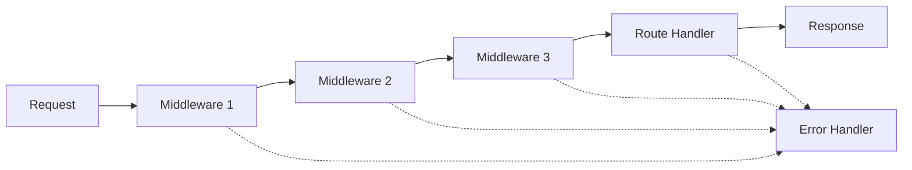

# Лекція 4. Express.js фреймворк

## Вступ до Express.js

Express.js — це мінімалістичний та гнучкий вебфреймворк для Node.js, який надає потужний набір функцій для вебдодатків та мобільних застосунків. Розроблений TJ Holowaychuk у 2010 році, Express швидко став стандартом де-факто для створення серверних додатків на Node.js завдяки своїй простоті, швидкості та гнучкості.

Express побудований на основі концепції мінімального ядра з можливістю розширення через middleware. Це означає, що базовий Express дуже легкий, але може бути розширений за допомогою різноманітних модулів для виконання складних завдань.

Основні переваги Express.js включають швидку розробку, велику спільноту розробників, безліч готових рішень та модулів, а також відмінну продуктивність. Фреймворк використовується такими компаніями як Netflix, Airbnb, Uber та багатьма іншими для створення масштабних вебдодатків.

## Створення базового сервера з Express

Процес створення сервера з Express значно простіший за нативний Node.js HTTP сервер. Спочатку необхідно встановити Express за допомогою npm менеджера пакетів.

```bash
# Ініціалізація нового проєкту
npm init -y

# Встановлення Express
npm install express

# Встановлення додаткових корисних пакетів для розробки
npm install --save-dev nodemon
```

Найпростіший Express сервер виглядає наступним чином:

```javascript
// app.js
const express = require('express');
const app = express();
const PORT = process.env.PORT || 3000;

// Базовий маршрут
app.get('/', (req, res) => {
    res.send('Привіт світ! Це мій перший Express сервер.');
});

// Запуск сервера
app.listen(PORT, () => {
    console.log(`Сервер запущено на порті ${PORT}`);
    console.log(`Відкрийте http://localhost:${PORT} у браузері`);
});
```

У цьому прикладі створюється Express додаток, визначається один маршрут для головної сторінки та запускається сервер на вказаному порті. Функція `app.listen()` аналогічна `server.listen()` у нативному Node.js, але з додаткими можливостями Express.

Для зручності розробки рекомендується налаштувати скрипт у `package.json` для автоматичного перезапуску сервера при змінах у коді:

```json
{
  "scripts": {
    "start": "node app.js",
    "dev": "nodemon app.js"
  }
}
```

Тепер можна запускати сервер командою `npm run dev`, і він автоматично перезапускатиметься при кожній зміні файлів.

## Система роутингу в Express

Роутинг в Express визначає, як додаток відповідає на клієнтські запити до конкретних endpoints. Кожен маршрут складається з HTTP методу, шляху та функції-обробника.

### Основні HTTP методи

Express підтримує всі стандартні HTTP методи через відповідні методи об'єкта app:

```javascript
// GET запити - отримання даних
app.get('/users', (req, res) => {
    res.json({ message: 'Список користувачів' });
});

// POST запити - створення нових ресурсів
app.post('/users', (req, res) => {
    res.status(201).json({ message: 'Користувача створено' });
});

// PUT запити - повне оновлення ресурсу
app.put('/users/:id', (req, res) => {
    const userId = req.params.id;
    res.json({ message: `Користувача ${userId} оновлено` });
});

// PATCH запити - часткове оновлення ресурсу
app.patch('/users/:id', (req, res) => {
    const userId = req.params.id;
    res.json({ message: `Частково оновлено користувача ${userId}` });
});

// DELETE запити - видалення ресурсів
app.delete('/users/:id', (req, res) => {
    const userId = req.params.id;
    res.status(204).send();
});
```

### Параметри маршрутів

Express дозволяє визначати динамічні маршрути з параметрами, які можна отримати через об'єкт `req.params`:

```javascript
// Маршрут з одним параметром
app.get('/users/:id', (req, res) => {
    const userId = req.params.id;
    res.json({
        message: `Інформація про користувача`,
        userId: userId
    });
});

// Маршрут з кількома параметрами
app.get('/users/:userId/posts/:postId', (req, res) => {
    const { userId, postId } = req.params;
    res.json({
        message: 'Пост користувача',
        userId: userId,
        postId: postId
    });
});

// Маршрут з опціональним параметром
app.get('/products/:category?', (req, res) => {
    const category = req.params.category || 'всі';
    res.json({
        message: `Продукти категорії: ${category}`
    });
});
```

### Query параметри та обробка запитів

Query параметри передаються в URL після знака питання та доступні через `req.query`:

```javascript
// Обробка query параметрів
// URL: /search?q=nodejs&limit=10&page=1
app.get('/search', (req, res) => {
    const { q, limit = 20, page = 1 } = req.query;

    res.json({
        query: q,
        limit: parseInt(limit),
        page: parseInt(page),
        results: []
    });
});

// Комбінування параметрів маршруту та query
// URL: /users/123/posts?limit=5&sort=date
app.get('/users/:id/posts', (req, res) => {
    const userId = req.params.id;
    const { limit = 10, sort = 'created' } = req.query;

    res.json({
        userId: userId,
        limit: parseInt(limit),
        sortBy: sort,
        posts: []
    });
});
```

### Router для модульної організації

Express Router дозволяє створювати модульні маршрути, які можна підключати до основного додатку:

```javascript
// routes/users.js
const express = require('express');
const router = express.Router();

// Middleware для всіх маршрутів користувачів
router.use((req, res, next) => {
    console.log('Запит до users роутера:', new Date().toISOString());
    next();
});

// Маршрути відносно /users
router.get('/', (req, res) => {
    res.json({ message: 'Список всіх користувачів' });
});

router.get('/:id', (req, res) => {
    res.json({ message: `Користувач ${req.params.id}` });
});

router.post('/', (req, res) => {
    res.status(201).json({ message: 'Нового користувача створено' });
});

module.exports = router;

// app.js
const userRoutes = require('./routes/users');
app.use('/users', userRoutes);
```

## Концепція Middleware

Middleware функції в Express — це функції, які мають доступ до об'єктів запиту (req), відповіді (res) та наступної middleware функції в циклі запит-відповідь додатку. Middleware може виконувати код, модифікувати об'єкти req та res, завершувати цикл запит-відповідь або викликати наступну middleware функцію.



### Типи middleware

Express розрізняє кілька типів middleware залежно від рівня застосування:

**Application-level middleware** прив'язується до екземпляра app за допомогою `app.use()` та `app.METHOD()`:

```javascript
// Middleware для всіх маршрутів
app.use((req, res, next) => {
    console.log('Час запиту:', new Date().toISOString());
    console.log('Метод:', req.method);
    console.log('URL:', req.url);
    next(); // Передача управління наступній middleware
});

// Middleware для конкретного шляху
app.use('/api', (req, res, next) => {
    console.log('API запит');
    next();
});

// Middleware з умовою
app.use('/admin', (req, res, next) => {
    // Перевірка авторизації для адмін панелі
    const isAuthorized = req.headers.authorization === 'Bearer secret-token';

    if (!isAuthorized) {
        return res.status(401).json({ error: 'Доступ заборонено' });
    }

    next();
});
```

**Router-level middleware** працює аналогічно application-level, але прив'язується до екземпляра `express.Router()`:

```javascript
const router = express.Router();

// Middleware для всіх маршрутів цього роутера
router.use((req, res, next) => {
    console.log('Router middleware спрацював');
    next();
});

// Middleware для конкретного маршруту
router.use('/users/:id', (req, res, next) => {
    // Валідація ID користувача
    const userId = req.params.id;

    if (!/^\d+$/.test(userId)) {
        return res.status(400).json({
            error: 'ID користувача має бути числом'
        });
    }

    req.userId = parseInt(userId);
    next();
});
```

### Вбудовані middleware

Express надає кілька корисних вбудованих middleware:

```javascript
// Парсинг JSON тіла запиту
app.use(express.json({ limit: '10mb' }));

// Парсинг URL-encoded тіла запиту (форми)
app.use(express.urlencoded({ extended: true }));

// Обслуговування статичних файлів
app.use(express.static('public'));

// Обслуговування статичних файлів з віртуальним шляхом
app.use('/assets', express.static('public'));
```

### Сторонні middleware

Екосистема Express включає безліч корисних сторонніх middleware:

```javascript
const cors = require('cors');
const helmet = require('helmet');
const morgan = require('morgan');
const compression = require('compression');

// CORS для дозволу крос-доменних запитів
app.use(cors({
    origin: ['http://localhost:3000', 'https://mydomain.com'],
    credentials: true
}));

// Безпека заголовків
app.use(helmet());

// Логування запитів
app.use(morgan('combined'));

// Стискання відповідей
app.use(compression());
```

### Обробка помилок у middleware

Middleware для обробки помилок має спеціальну сигнатуру з чотирма параметрами:

```javascript
// Middleware для обробки помилок
app.use((err, req, res, next) => {
    console.error('Помилка:', err.stack);

    // Визначення типу помилки та відповідного статусу
    let status = err.status || 500;
    let message = err.message || 'Внутрішня помилка сервера';

    if (err.name === 'ValidationError') {
        status = 400;
        message = 'Помилка валідації даних';
    }

    res.status(status).json({
        error: {
            message: message,
            status: status,
            ...(process.env.NODE_ENV === 'development' && { stack: err.stack })
        }
    });
});

// Middleware для обробки 404 помилок
app.use((req, res) => {
    res.status(404).json({
        error: {
            message: 'Маршрут не знайдено',
            status: 404,
            path: req.originalUrl
        }
    });
});
```

## Обробка запитів та відповідей

Express надає розширені можливості для роботи з HTTP запитами та відповідями через об'єкти req та res.

### Об'єкт Request (req)

Об'єкт req представляє HTTP запит та містить властивості для рядка запиту, параметрів, тіла, заголовків та багато іншого:

```javascript
app.post('/api/users', (req, res) => {
    // Основні властивості запиту
    console.log('HTTP метод:', req.method);
    console.log('URL:', req.url);
    console.log('Оригінальний URL:', req.originalUrl);
    console.log('Протокол:', req.protocol);
    console.log('Хост:', req.hostname);
    console.log('IP адреса:', req.ip);

    // Заголовки запиту
    console.log('User-Agent:', req.get('User-Agent'));
    console.log('Content-Type:', req.get('Content-Type'));
    console.log('Всі заголовки:', req.headers);

    // Параметри та query
    console.log('Параметри маршруту:', req.params);
    console.log('Query параметри:', req.query);

    // Тіло запиту (потребує middleware для парсингу)
    console.log('Тіло запиту:', req.body);

    // Файли (потребує multer middleware)
    console.log('Завантажені файли:', req.files);

    res.json({ message: 'Запит оброблено' });
});
```

### Об'єкт Response (res)

Об'єкт res представляє HTTP відповідь, яку Express надсилає при отриманні HTTP запиту:

```javascript
app.get('/api/example', (req, res) => {
    // Встановлення статус коду
    res.status(200);

    // Встановлення заголовків
    res.set('X-Custom-Header', 'My Value');
    res.set({
        'X-Another-Header': 'Another Value',
        'Cache-Control': 'no-cache'
    });

    // Відправка різних типів відповідей

    // JSON відповідь
    res.json({
        success: true,
        data: { id: 1, name: 'Іван' }
    });

    // Текстова відповідь
    // res.send('Простий текст');

    // HTML відповідь
    // res.send('<h1>HTML контент</h1>');

    // Файл для завантаження
    // res.download('/path/to/file.pdf');

    // Перенаправлення
    // res.redirect('/new-url');

    // Встановлення cookie
    // res.cookie('sessionId', '123456', { httpOnly: true });
});
```

### Валідація та обробка даних

Правильна валідація вхідних даних критично важлива для безпеки додатку:

```javascript
// Middleware для валідації JSON
const validateJSON = (req, res, next) => {
    if (req.get('Content-Type') !== 'application/json') {
        return res.status(400).json({
            error: 'Content-Type має бути application/json'
        });
    }
    next();
};

// Валідація даних користувача
const validateUser = (req, res, next) => {
    const { name, email, age } = req.body;
    const errors = [];

    if (!name || name.trim().length < 2) {
        errors.push('Ім\'я має містити принаймні 2 символи');
    }

    if (!email || !/\S+@\S+\.\S+/.test(email)) {
        errors.push('Некоректний email');
    }

    if (!age || age < 18 || age > 120) {
        errors.push('Вік має бути від 18 до 120 років');
    }

    if (errors.length > 0) {
        return res.status(400).json({
            error: 'Помилки валідації',
            details: errors
        });
    }

    next();
};

// Використання валідації
app.post('/users', validateJSON, validateUser, (req, res) => {
    const userData = req.body;

    // Тут би відбувалось збереження в базу даних
    console.log('Створення користувача:', userData);

    res.status(201).json({
        message: 'Користувача успішно створено',
        user: {
            id: Date.now(),
            ...userData,
            createdAt: new Date().toISOString()
        }
    });
});
```

## Статичні файли та шаблонізатори

Express надає зручні способи обслуговування статичних файлів та генерації динамічного HTML контенту.

### Обслуговування статичних файлів

Статичні файли включають CSS, JavaScript, зображення та інші ресурси, які не потребують серверної обробки:

```javascript
// Основне використання static middleware
app.use(express.static('public'));

// Тепер файли доступні напряму:
// http://localhost:3000/css/style.css
// http://localhost:3000/js/app.js
// http://localhost:3000/images/logo.png

// Віртуальний шлях для статичних файлів
app.use('/assets', express.static('public'));
// Файли доступні через: http://localhost:3000/assets/css/style.css

// Кілька директорій для статичних файлів
app.use(express.static('public'));
app.use(express.static('files'));
app.use('/uploads', express.static('uploads'));

// Налаштування кешування та безпеки
app.use('/static', express.static('public', {
    maxAge: '1d', // Кешування на 1 день
    index: false, // Заборонити показ індексних файлів
    dotfiles: 'deny' // Заборонити доступ до прихованих файлів
}));
```

Структура проєкту для статичних файлів:

```
project/
├── app.js
├── public/
│   ├── css/
│   │   ├── style.css
│   │   └── bootstrap.css
│   ├── js/
│   │   ├── app.js
│   │   └── jquery.js
│   ├── images/
│   │   ├── logo.png
│   │   └── favicon.ico
│   └── index.html
├── views/
│   ├── layouts/
│   └── pages/
└── package.json
```

### Template Engines (Шаблонізатори)

Express підтримує різноманітні шаблонізатори для генерації динамічного HTML. Найпопулярніші включають EJS, Handlebars, Pug та Mustache.

#### Налаштування EJS

EJS (Embedded JavaScript) — простий шаблонізатор, що дозволяє вставляти JavaScript код в HTML:

```bash
npm install ejs
```

```javascript
// Налаштування EJS як view engine
app.set('view engine', 'ejs');
app.set('views', './views');

// Маршрут з рендерингом шаблону
app.get('/', (req, res) => {
    const data = {
        title: 'Головна сторінка',
        user: {
            name: 'Іван Петренко',
            email: 'ivan@example.com'
        },
        posts: [
            { id: 1, title: 'Перший пост', content: 'Контент першого посту' },
            { id: 2, title: 'Другий пост', content: 'Контент другого посту' }
        ]
    };

    res.render('index', data);
});

app.get('/users/:id', (req, res) => {
    const userId = req.params.id;

    // Імітація отримання даних з бази даних
    const user = {
        id: userId,
        name: 'Користувач ' + userId,
        email: `user${userId}@example.com`,
        joinDate: new Date().toLocaleDateString()
    };

    res.render('user-profile', {
        title: 'Профіль користувача',
        user: user
    });
});
```

Приклад EJS шаблону (`views/index.ejs`):

```html
<!DOCTYPE html>
<html lang="uk">
<head>
    <meta charset="UTF-8">
    <meta name="viewport" content="width=device-width, initial-scale=1.0">
    <title><%= title %></title>
    <link rel="stylesheet" href="/css/style.css">
</head>
<body>
    <header>
        <h1><%= title %></h1>
        <% if (user) { %>
            <p>Вітаємо, <%= user.name %>!</p>
        <% } %>
    </header>

    <main>
        <section>
            <h2>Останні пости</h2>
            <% if (posts && posts.length > 0) { %>
                <div class="posts">
                    <% posts.forEach(post => { %>
                        <article class="post">
                            <h3><%= post.title %></h3>
                            <p><%= post.content %></p>
                        </article>
                    <% }); %>
                </div>
            <% } else { %>
                <p>Постів поки немає.</p>
            <% } %>
        </section>
    </main>

    <script src="/js/app.js"></script>
</body>
</html>
```

#### Handlebars шаблонізатор

Handlebars надає більш чистий синтаксис без вставок JavaScript коду:

```bash
npm install express-handlebars
```

```javascript
const { engine } = require('express-handlebars');

// Налаштування Handlebars
app.engine('handlebars', engine({
    defaultLayout: 'main',
    layoutsDir: './views/layouts',
    partialsDir: './views/partials'
}));
app.set('view engine', 'handlebars');

// Маршрут з Handlebars
app.get('/products', (req, res) => {
    const products = [
        { id: 1, name: 'Ноутбук', price: 25000, inStock: true },
        { id: 2, name: 'Телефон', price: 15000, inStock: false },
        { id: 3, name: 'Планшет', price: 12000, inStock: true }
    ];

    res.render('products', {
        title: 'Каталог товарів',
        products: products,
        hasProducts: products.length > 0
    });
});
```

## Структурування Express додатку

Правильна структура проєкту критично важлива для підтримки та масштабування додатку.

### Базова структура MVC

Model-View-Controller — популярний архітектурний паттерн для веб-додатків:

```
express-app/
├── app.js                  # Головний файл додатку
├── server.js               # Запуск сервера
├── package.json
├── .env                    # Змінні середовища
├── .gitignore
│
├── config/                 # Конфігурації
│   ├── database.js
│   ├── cors.js
│   └── environment.js
│
├── controllers/            # Контролери (бізнес-логіка)
│   ├── userController.js
│   ├── postController.js
│   └── authController.js
│
├── models/                 # Моделі даних
│   ├── User.js
│   ├── Post.js
│   └── index.js
│
├── routes/                 # Маршрути
│   ├── index.js
│   ├── users.js
│   ├── posts.js
│   └── auth.js
│
├── middleware/             # Користувацькі middleware
│   ├── auth.js
│   ├── validation.js
│   └── error.js
│
├── views/                  # Шаблони
│   ├── layouts/
│   ├── partials/
│   ├── pages/
│   └── error/
│
├── public/                 # Статичні файли
│   ├── css/
│   ├── js/
│   └── images/
│
├── utils/                  # Утиліти
│   ├── helpers.js
│   ├── validators.js
│   └── constants.js
│
└── tests/                  # Тести
    ├── unit/
    ├── integration/
    └── fixtures/
```

### Приклад структурованого додатку

Головний файл додатку (`app.js`):

```javascript
const express = require('express');
const cors = require('cors');
const helmet = require('helmet');
const morgan = require('morgan');

// Імпорт маршрутів
const indexRoutes = require('./routes/index');
const userRoutes = require('./routes/users');
const postRoutes = require('./routes/posts');

// Імпорт middleware
const errorHandler = require('./middleware/error');
const notFound = require('./middleware/notFound');

const app = express();

// Налаштування view engine
app.set('view engine', 'ejs');
app.set('views', './views');

// Базові middleware
app.use(helmet());
app.use(cors());
app.use(morgan('combined'));
app.use(express.json({ limit: '10mb' }));
app.use(express.urlencoded({ extended: true }));
app.use(express.static('public'));

// Маршрути
app.use('/', indexRoutes);
app.use('/api/users', userRoutes);
app.use('/api/posts', postRoutes);

// Обробка помилок
app.use(notFound);
app.use(errorHandler);

module.exports = app;
```

Файл запуску сервера (`server.js`):

```javascript
const app = require('./app');
require('dotenv').config();

const PORT = process.env.PORT || 3000;
const NODE_ENV = process.env.NODE_ENV || 'development';

app.listen(PORT, () => {
    console.log(`🚀 Сервер запущено в ${NODE_ENV} режимі на порті ${PORT}`);
    console.log(`📖 API документація: http://localhost:${PORT}/api-docs`);
});

// Graceful shutdown
process.on('SIGTERM', () => {
    console.log('👋 SIGTERM отримано. Завершення роботи сервера...');
    process.exit(0);
});

process.on('SIGINT', () => {
    console.log('👋 SIGINT отримано. Завершення роботи сервера...');
    process.exit(0);
});
```

Контролер користувачів (`controllers/userController.js`):

```javascript
const users = []; // Тимчасове сховище (в реальному проєкті - база даних)

const userController = {
    // Отримання всіх користувачів
    getAllUsers: (req, res) => {
        try {
            const { page = 1, limit = 10 } = req.query;
            const startIndex = (page - 1) * limit;
            const endIndex = page * limit;

            const paginatedUsers = users.slice(startIndex, endIndex);

            res.json({
                success: true,
                data: paginatedUsers,
                pagination: {
                    currentPage: parseInt(page),
                    totalPages: Math.ceil(users.length / limit),
                    totalUsers: users.length
                }
            });
        } catch (error) {
            res.status(500).json({
                success: false,
                error: 'Помилка при отриманні користувачів'
            });
        }
    },

    // Отримання користувача за ID
    getUserById: (req, res) => {
        try {
            const userId = parseInt(req.params.id);
            const user = users.find(u => u.id === userId);

            if (!user) {
                return res.status(404).json({
                    success: false,
                    error: 'Користувача не знайдено'
                });
            }

            res.json({
                success: true,
                data: user
            });
        } catch (error) {
            res.status(500).json({
                success: false,
                error: 'Помилка при отриманні користувача'
            });
        }
    },

    // Створення нового користувача
    createUser: (req, res) => {
        try {
            const { name, email, age } = req.body;

            // Перевірка унікальності email
            const existingUser = users.find(u => u.email === email);
            if (existingUser) {
                return res.status(400).json({
                    success: false,
                    error: 'Користувач з таким email вже існує'
                });
            }

            const newUser = {
                id: Date.now(),
                name,
                email,
                age,
                createdAt: new Date().toISOString()
            };

            users.push(newUser);

            res.status(201).json({
                success: true,
                data: newUser,
                message: 'Користувача успішно створено'
            });
        } catch (error) {
            res.status(500).json({
                success: false,
                error: 'Помилка при створенні користувача'
            });
        }
    },

    // Оновлення користувача
    updateUser: (req, res) => {
        try {
            const userId = parseInt(req.params.id);
            const userIndex = users.findIndex(u => u.id === userId);

            if (userIndex === -1) {
                return res.status(404).json({
                    success: false,
                    error: 'Користувача не знайдено'
                });
            }

            const updatedUser = {
                ...users[userIndex],
                ...req.body,
                updatedAt: new Date().toISOString()
            };

            users[userIndex] = updatedUser;

            res.json({
                success: true,
                data: updatedUser,
                message: 'Користувача успішно оновлено'
            });
        } catch (error) {
            res.status(500).json({
                success: false,
                error: 'Помилка при оновленні користувача'
            });
        }
    },

    // Видалення користувача
    deleteUser: (req, res) => {
        try {
            const userId = parseInt(req.params.id);
            const userIndex = users.findIndex(u => u.id === userId);

            if (userIndex === -1) {
                return res.status(404).json({
                    success: false,
                    error: 'Користувача не знайдено'
                });
            }

            users.splice(userIndex, 1);

            res.status(204).send();
        } catch (error) {
            res.status(500).json({
                success: false,
                error: 'Помилка при видаленні користувача'
            });
        }
    }
};

module.exports = userController;
```

Маршрути користувачів (`routes/users.js`):

```javascript
const express = require('express');
const router = express.Router();
const userController = require('../controllers/userController');
const { validateUser, validateUserId } = require('../middleware/validation');

// Маршрути для користувачів
router.get('/', userController.getAllUsers);
router.get('/:id', validateUserId, userController.getUserById);
router.post('/', validateUser, userController.createUser);
router.put('/:id', validateUserId, validateUser, userController.updateUser);
router.delete('/:id', validateUserId, userController.deleteUser);

module.exports = router;
```

Middleware для валідації (`middleware/validation.js`):

```javascript
const validateUser = (req, res, next) => {
    const { name, email, age } = req.body;
    const errors = [];

    // Валідація імені
    if (!name || typeof name !== 'string' || name.trim().length < 2) {
        errors.push('Ім\'я має містити принаймні 2 символи');
    }

    // Валідація email
    const emailRegex = /^[^\s@]+@[^\s@]+\.[^\s@]+$/;
    if (!email || !emailRegex.test(email)) {
        errors.push('Некоректний формат email');
    }

    // Валідація віку
    if (!age || !Number.isInteger(age) || age < 18 || age > 120) {
        errors.push('Вік має бути цілим числом від 18 до 120');
    }

    if (errors.length > 0) {
        return res.status(400).json({
            success: false,
            error: 'Помилки валідації',
            details: errors
        });
    }

    next();
};

const validateUserId = (req, res, next) => {
    const userId = req.params.id;

    if (!/^\d+$/.test(userId)) {
        return res.status(400).json({
            success: false,
            error: 'ID користувача має бути числом'
        });
    }

    req.params.id = parseInt(userId);
    next();
};

module.exports = {
    validateUser,
    validateUserId
};
```

Middleware для обробки помилок (`middleware/error.js`):

```javascript
const errorHandler = (err, req, res, next) => {
    console.error('Помилка:', err);

    // Визначення типу помилки та відповідного статусу
    let status = err.status || err.statusCode || 500;
    let message = err.message || 'Внутрішня помилка сервера';

    // Специфічні типи помилок
    if (err.name === 'ValidationError') {
        status = 400;
        message = 'Помилка валідації даних';
    }

    if (err.name === 'UnauthorizedError') {
        status = 401;
        message = 'Не авторизовано';
    }

    if (err.name === 'CastError') {
        status = 400;
        message = 'Некоректний формат даних';
    }

    // Структура відповіді про помилку
    const errorResponse = {
        success: false,
        error: {
            message: message,
            status: status,
            timestamp: new Date().toISOString(),
            path: req.originalUrl,
            method: req.method
        }
    };

    // Додавання стектрейсу в режимі розробки
    if (process.env.NODE_ENV === 'development') {
        errorResponse.error.stack = err.stack;
    }

    res.status(status).json(errorResponse);
};

module.exports = errorHandler;
```

### Конфігурація середовища

Файл змінних середовища (`.env`):

```env
# Сервер
PORT=3000
NODE_ENV=development

# База даних
DB_HOST=localhost
DB_PORT=5432
DB_NAME=myapp
DB_USER=postgres
DB_PASSWORD=password

# JWT
JWT_SECRET=your-super-secret-jwt-key
JWT_EXPIRES_IN=7d

# Email
SMTP_HOST=smtp.gmail.com
SMTP_PORT=587
SMTP_USER=your-email@gmail.com
SMTP_PASS=your-password

# Файли
UPLOAD_PATH=./uploads
MAX_FILE_SIZE=5242880
```

Конфігурація додатку (`config/environment.js`):

```javascript
require('dotenv').config();

const config = {
    development: {
        port: process.env.PORT || 3000,
        database: {
            host: process.env.DB_HOST || 'localhost',
            port: process.env.DB_PORT || 5432,
            name: process.env.DB_NAME || 'myapp_dev',
            user: process.env.DB_USER || 'postgres',
            password: process.env.DB_PASSWORD || 'password'
        },
        jwt: {
            secret: process.env.JWT_SECRET || 'dev-secret',
            expiresIn: process.env.JWT_EXPIRES_IN || '7d'
        },
        cors: {
            origin: ['http://localhost:3000', 'http://localhost:3001'],
            credentials: true
        }
    },

    production: {
        port: process.env.PORT,
        database: {
            host: process.env.DB_HOST,
            port: process.env.DB_PORT,
            name: process.env.DB_NAME,
            user: process.env.DB_USER,
            password: process.env.DB_PASSWORD,
            ssl: true
        },
        jwt: {
            secret: process.env.JWT_SECRET,
            expiresIn: process.env.JWT_EXPIRES_IN || '1d'
        },
        cors: {
            origin: process.env.ALLOWED_ORIGINS?.split(',') || [],
            credentials: true
        }
    }
};

const environment = process.env.NODE_ENV || 'development';

module.exports = config[environment];
```

## Найкращі практики Express

### Безпека

Забезпечення безпеки Express додатку включає кілька ключових аспектів:

```javascript
const helmet = require('helmet');
const rateLimit = require('express-rate-limit');
const mongoSanitize = require('express-mongo-sanitize');

// Базові заголовки безпеки
app.use(helmet({
    contentSecurityPolicy: {
        directives: {
            defaultSrc: ["'self'"],
            styleSrc: ["'self'", "'unsafe-inline'", "https://fonts.googleapis.com"],
            fontSrc: ["'self'", "https://fonts.gstatic.com"],
            imgSrc: ["'self'", "data:", "https:"],
            scriptSrc: ["'self'"]
        }
    }
}));

// Rate limiting
const limiter = rateLimit({
    windowMs: 15 * 60 * 1000, // 15 хвилин
    max: 100, // максимум 100 запитів з одного IP
    message: {
        error: 'Забагато запитів з цього IP, спробуйте пізніше'
    }
});

app.use('/api/', limiter);

// Санітизація від NoSQL ін'єкцій
app.use(mongoSanitize());

// Валідація Content-Type
app.use((req, res, next) => {
    if (req.method === 'POST' || req.method === 'PUT') {
        const contentType = req.get('Content-Type');
        if (!contentType || !contentType.includes('application/json')) {
            return res.status(400).json({
                error: 'Content-Type має бути application/json'
            });
        }
    }
    next();
});
```

### Логування та моніторинг

Правильне логування критично важливе для відстеження проблем та моніторингу:

```javascript
const winston = require('winston');

// Конфігурація логера
const logger = winston.createLogger({
    level: 'info',
    format: winston.format.combine(
        winston.format.timestamp(),
        winston.format.errors({ stack: true }),
        winston.format.json()
    ),
    defaultMeta: { service: 'express-app' },
    transports: [
        new winston.transports.File({ filename: 'logs/error.log', level: 'error' }),
        new winston.transports.File({ filename: 'logs/combined.log' })
    ]
});

// В режимі розробки також логуємо в консоль
if (process.env.NODE_ENV !== 'production') {
    logger.add(new winston.transports.Console({
        format: winston.format.simple()
    }));
}

// Middleware для логування запитів
app.use((req, res, next) => {
    logger.info('HTTP Request', {
        method: req.method,
        url: req.url,
        ip: req.ip,
        userAgent: req.get('User-Agent')
    });
    next();
});

module.exports = logger;
```

### Тестування Express додатків

Базові інтеграційні тести з Jest та Supertest:

```javascript
// tests/users.test.js
const request = require('supertest');
const app = require('../app');

describe('Users API', () => {
    describe('GET /api/users', () => {
        test('повертає список користувачів', async () => {
            const response = await request(app)
                .get('/api/users')
                .expect(200);

            expect(response.body.success).toBe(true);
            expect(Array.isArray(response.body.data)).toBe(true);
        });

        test('підтримує пагінацію', async () => {
            const response = await request(app)
                .get('/api/users?page=1&limit=5')
                .expect(200);

            expect(response.body.pagination).toBeDefined();
            expect(response.body.pagination.currentPage).toBe(1);
        });
    });

    describe('POST /api/users', () => {
        test('створює нового користувача з валідними даними', async () => {
            const userData = {
                name: 'Тест Користувач',
                email: 'test@example.com',
                age: 25
            };

            const response = await request(app)
                .post('/api/users')
                .send(userData)
                .expect(201);

            expect(response.body.success).toBe(true);
            expect(response.body.data.name).toBe(userData.name);
            expect(response.body.data.id).toBeDefined();
        });

        test('відхиляє запит з невалідними даними', async () => {
            const invalidData = {
                name: 'T', // замало символів
                email: 'invalid-email',
                age: 15 // замалий вік
            };

            const response = await request(app)
                .post('/api/users')
                .send(invalidData)
                .expect(400);

            expect(response.body.success).toBe(false);
            expect(response.body.details).toHaveLength(3);
        });
    });
});
```

## Продуктивність та оптимізація

### Кешування

Впровадження кешування для покращення продуктивності:

```javascript
const redis = require('redis');
const client = redis.createClient();

// Middleware для кешування
const cache = (duration = 300) => {
    return async (req, res, next) => {
        const key = `cache:${req.originalUrl}`;

        try {
            const cachedData = await client.get(key);

            if (cachedData) {
                return res.json(JSON.parse(cachedData));
            }

            // Перехоплюємо оригінальний res.json
            const originalJson = res.json;
            res.json = function(data) {
                // Кешуємо відповідь
                client.setex(key, duration, JSON.stringify(data));
                return originalJson.call(this, data);
            };

            next();
        } catch (error) {
            console.error('Помилка кешування:', error);
            next();
        }
    };
};

// Використання кешування
app.get('/api/users', cache(600), userController.getAllUsers);
```

### Compression та оптимізація

```javascript
const compression = require('compression');

// Стискання відповідей
app.use(compression({
    level: 6,
    threshold: 1024, // стискати файли більше 1KB
    filter: (req, res) => {
        if (req.headers['x-no-compression']) {
            return false;
        }
        return compression.filter(req, res);
    }
}));

// Оптимізація JSON відповідей
app.set('json spaces', 0); // видалити пробіли в JSON в продакшені
```

## Висновки

Express.js залишається одним з найпопулярніших вебфреймворків для Node.js завдяки своїй простоті, гнучкості та потужній екосистемі. Основні переваги включають мінімалістичний підхід, що дозволяє розробникам вибирати необхідні компоненти, потужну систему middleware для розширення функціональності, відмінну продуктивність для більшості вебдодатків та велику спільноту з безліччю готових рішень.

Ключові концепції Express включають роутинг для визначення endpoints додатку, middleware для обробки запитів та реалізації крос-функціональних вимог, template engines для генерації динамічного HTML, статичні файли для обслуговування ресурсів клієнта та структурування додатку за архітектурними патернами.

Успішне використання Express вимагає розуміння основних принципів HTTP, знання патернів проектування вебдодатків, дотримання найкращих практик безпеки та продуктивності, а також уміння структурувати код для подальшого масштабування та підтримки.

Express надає міцну основу для створення як простих API сервісів, так і складних вебдодатків, що робить його відмінним вибором для початківців та досвідчених розробників. Важливо пам'ятати, що Express — це інструмент, і його ефективність залежить від правильного використання та дотримання найкращих практик веброзробки.
