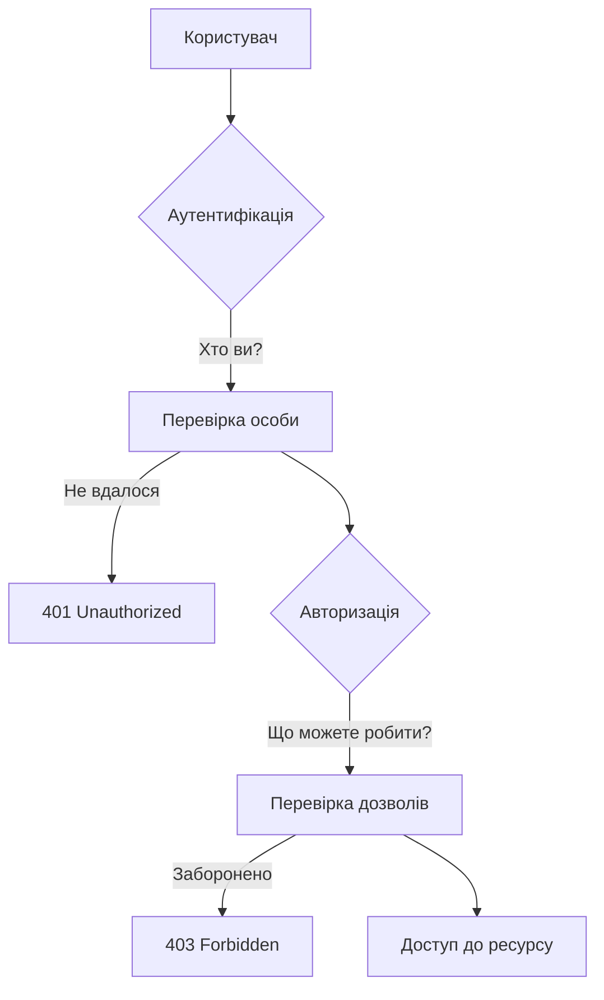
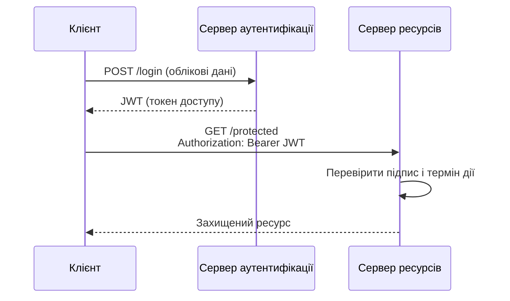
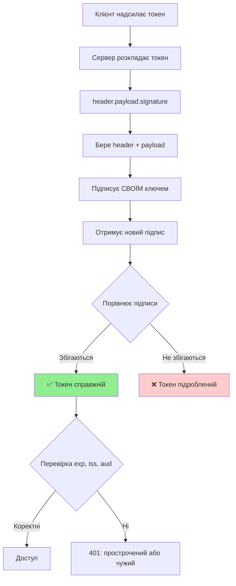
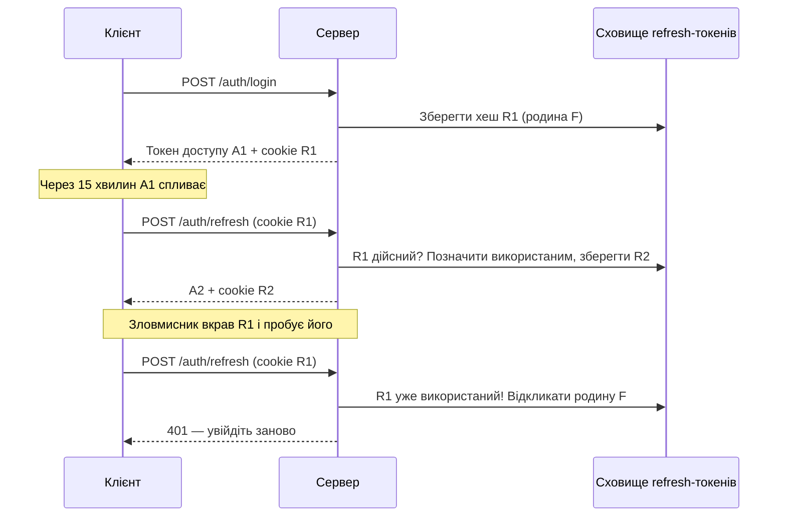
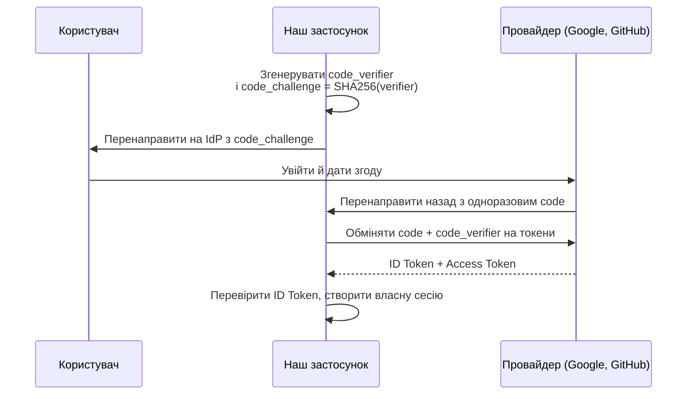
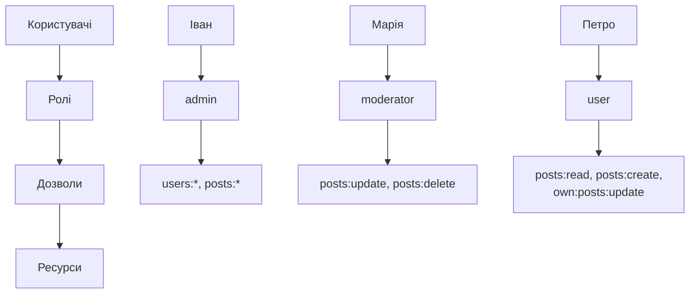
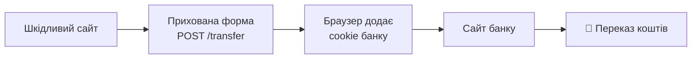
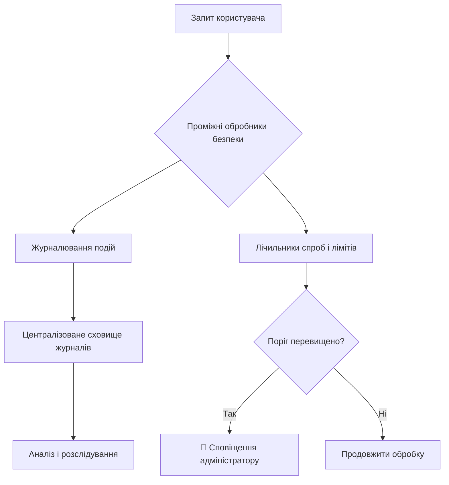
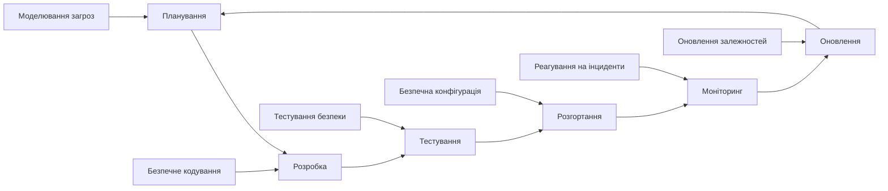

# Лекція 5. Аутентифікація та безпека

## Вступ до безпеки вебзастосунків

У попередніх двох лекціях ми спроєктували REST API і підключили до нього бази даних. Тепер наш застосунок зберігає реальні дані користувачів — і саме тому стає цікавим для зловмисників. Безпека є одним із найкритичніших аспектів сучасної розробки: одна пропущена перевірка прав доступу може відкрити чужі дані всім охочим, а один забутий секрет у репозиторії — повний контроль над сервером.

Статистика інцидентів років поспіль показує ту саму картину: більшість успішних атак на вебзастосунки використовують не складні «хакерські» прийоми, а типові помилки розробників — відсутню перевірку прав, слабке зберігання паролів, неперевірені вхідні дані, застарілі залежності. Тобто більшості атак можна запобігти, якщо послідовно застосовувати базові принципи безпеки, які ми розглянемо в цій лекції.

Безпеку інформації традиційно описують тріадою **CIA**:

- **конфіденційність (Confidentiality)** — дані доступні лише тим, хто має на це право;
- **цілісність (Integrity)** — дані не можуть бути змінені непомітно чи без дозволу;
- **доступність (Availability)** — система працює для легітимних користувачів, зокрема під навантаженням чи атакою.

Практичним орієнтиром для веброзробника є **OWASP Top 10** — перелік найкритичніших ризиків безпеки вебзастосунків, який укладає некомерційна спільнота OWASP на основі даних про сотні тисяч застосунків. Актуальна редакція — **OWASP Top 10:2025**, остаточну версію якої опубліковано на початку 2026 року. Порівняно з редакцією 2021 року в ній з'явилися дві нові категорії — збої ланцюга постачання програмного забезпечення та неправильна обробка виняткових ситуацій, — а підробка запитів на боці сервера (SSRF) увійшла до категорії порушення контролю доступу.

| № | Категорія OWASP Top 10:2025 | Де в курсі |
|---|-----------------------------|------------|
| A01 | Broken Access Control — порушення контролю доступу | Ця лекція: ролі, дозволи, власність ресурсів |
| A02 | Security Misconfiguration — хибна конфігурація | Ця лекція: заголовки, CORS, налаштування середовища |
| A03 | Software Supply Chain Failures — збої ланцюга постачання | Ця лекція: безпека залежностей |
| A04 | Cryptographic Failures — криптографічні збої | Ця лекція: хешування паролів, шифрування, HTTPS |
| A05 | Injection — ін'єкції | Лекції 3–4: валідація, параметризовані запити |
| A06 | Insecure Design — небезпечний дизайн | Уся лекція: безпека з самого початку |
| A07 | Authentication Failures — збої аутентифікації | Ця лекція: паролі, токени, сесії, MFA |
| A08 | Software or Data Integrity Failures — порушення цілісності | Ця лекція: підписи токенів, цілісність залежностей |
| A09 | Security Logging and Alerting Failures — збої журналювання та сповіщень | Ця лекція: аудит і моніторинг |
| A10 | Mishandling of Exceptional Conditions — неправильна обробка виняткових ситуацій | Лекція 3: глобальний обробник помилок |

Лекцію побудовано від основ до практики: спочатку розберемо, чим аутентифікація відрізняється від авторизації, порівняємо сесії та токени, навчимося правильно зберігати паролі, реалізуємо проміжні обробники перевірки доступу, познайомимося з сучасними способами входу, а потім перейдемо до захисту від типових атак і організаційних практик безпеки.

## Аутентифікація vs авторизація: фундаментальні концепції

Перш ніж переходити до технологій, важливо чітко розрізняти два поняття, які часто плутають.

**Аутентифікація** — процес підтвердження особи користувача. Вона відповідає на питання «Хто ви?». Система перевіряє, чи дійсно користувач є тим, за кого себе видає. Для цього використовують один або кілька **факторів**:

- те, що користувач **знає** — пароль, PIN-код;
- те, що користувач **має** — телефон із застосунком-автентифікатором, апаратний ключ, пристрій з passkey;
- те, чим користувач **є** — біометрія (відбиток пальця, обличчя).

Поєднання факторів різних типів називають **багатофакторною аутентифікацією (MFA)**.

**Авторизація** — процес визначення того, що користувач має право робити в системі. Вона відповідає на питання «Що ви можете робити?». Авторизація відбувається після успішної аутентифікації й визначає, до яких ресурсів користувач має доступ і які дії може виконувати.



Коли ви входите в банківський застосунок, спочатку відбувається аутентифікація за логіном, паролем і кодом із SMS чи застосунку. Після цього система авторизує вас для доступу до ваших рахунків — але не до рахунків інших клієнтів. Ця різниця напряму відображається в кодах стану HTTP, які ми вивчали в лекції 3: `401` означає «не вдалося встановити, хто ви», а `403` — «ми знаємо, хто ви, але вам сюди не можна».

Порушення контролю доступу — тобто помилки саме авторизації — посідають перше місце в OWASP Top 10. Найтиповіший приклад: користувач змінює в адресі `/api/v1/orders/1001` число на `1002` і бачить чуже замовлення, бо сервер перевірив лише те, що користувач увійшов у систему, але не те, чи належить йому це замовлення.

## Сесії vs токени: порівняльний аналіз

Після того як користувач довів свою особу, серверу треба «пам'ятати» це в наступних запитах. HTTP не зберігає стану, тож кожен запит має нести щось, що підтверджує аутентифікацію. Існують два основні підходи.

### Сесійна аутентифікація: традиційний підхід

Сесійна аутентифікація зберігає стан на сервері. Після успішного входу сервер створює **сесію** — запис у сховищі (найчастіше в Redis, про який ми говорили в лекції 4) з інформацією про користувача — і видає клієнтові лише її випадковий ідентифікатор у cookie. Браузер автоматично додає цей cookie до кожного запиту на той самий сайт.

```mermaid
sequenceDiagram
    participant C as Клієнт
    participant S as Сервер
    participant DB as Сховище сесій

    C->>S: POST /login (облікові дані)
    S->>DB: Створити сесію
    DB-->>S: ID сесії
    S-->>C: Set-Cookie: sid=abc123; HttpOnly; Secure; SameSite=Lax

    C->>S: GET /protected (Cookie: sid=abc123)
    S->>DB: Знайти сесію abc123
    DB-->>S: Дані сесії
    S-->>C: Захищений ресурс
```

```javascript
import session from 'express-session';
import { RedisStore } from 'connect-redis';

app.use(session({
    store: new RedisStore({ client: redisClient, prefix: 'sess:' }),
    name: '__Host-sid',             // Префікс __Host- забороняє підміну cookie з піддоменів
    secret: process.env.SESSION_SECRET,
    resave: false,
    saveUninitialized: false,       // Не створювати сесію для анонімних відвідувачів
    cookie: {
        httpOnly: true,             // Недоступний для JavaScript сторінки
        secure: true,               // Лише через HTTPS
        sameSite: 'lax',            // Не надсилається з POST-запитами з чужих сайтів
        maxAge: 8 * 60 * 60 * 1000  // 8 годин
    }
}));

app.post('/api/v1/auth/login', async (req, res, next) => {
    const user = await authService.verifyCredentials(req.body.email, req.body.password);

    // Новий ідентифікатор після входу — захист від фіксації сесії
    req.session.regenerate((err) => {
        if (err) return next(err);
        req.session.userId = user.id;
        req.session.role = user.role;
        res.json({ id: user.id, email: user.email });
    });
});

app.post('/api/v1/auth/logout', (req, res, next) => {
    req.session.destroy((err) => {
        if (err) return next(err);
        res.clearCookie('__Host-sid').status(204).end();
    });
});
```

Переваги сесійної аутентифікації: простота, миттєве відкликання доступу (досить видалити сесію), централізований контроль над активними сесіями (можна показати користувачеві «ваші пристрої» і завершити будь-яку сесію), малий розмір cookie. Сесійний підхід особливо природний, коли клієнт — вебзастосунок на тому самому домені, що й API.

Недоліки: сервер зберігає стан, тож при кількох екземплярах застосунку потрібне спільне сховище сесій (Redis) — і кожен запит звертається до нього. Залежність від cookie робить підхід менш зручним для мобільних застосунків і сторонніх клієнтів, а автоматичне надсилання cookie браузером створює ризик CSRF-атак, про які йтиметься далі.

### Токенна аутентифікація: сучасний підхід

Токенна аутентифікація, зокрема з використанням **JSON Web Token (JWT)**, реалізує підхід без збереження стану — той самий принцип stateless, який ми розглядали в лекції 3. Замість запису на сервері вся необхідна інформація кодується в самому токені, який сервер підписує. Щоб перевірити токен, серверу не потрібне звернення до бази даних — достатньо перевірити підпис.

JWT складається з трьох частин, закодованих у Base64URL і розділених крапками:

- **Header** — тип токена й алгоритм підпису;
- **Payload** — твердження (claims) про користувача й сам токен;
- **Signature** — підпис, що забезпечує цілісність перших двох частин.

```javascript
// Приклад структури JWT
const header = {
    "alg": "HS256",
    "typ": "JWT"
};

const payload = {
    "sub": "8f14e45f-ea5a-4c3d-9d6e-2b9f0b3a1c77",  // Ідентифікатор користувача
    "role": "user",
    "iss": "https://api.example.com",             // Хто видав токен
    "aud": "https://app.example.com",             // Для кого призначений
    "iat": 1789000000,                            // Коли видано (Unix-час)
    "exp": 1789000900                             // Коли спливає (через 15 хвилин)
};

// Результуючий JWT (скорочено):
// eyJhbGciOiJIUzI1NiIsInR5cCI6IkpXVCJ9.
// eyJzdWIiOiI4ZjE0ZTQ1Zi4uLiIsInJvbGUiOiJ1c2VyIn0.
// SflKxwRJSMeKKF2QT4fwpMeJf36POk6yJV_adQssw5c
```

**Важливо:** Base64URL — це кодування, а не шифрування. Будь-хто, хто отримав токен, може прочитати його payload (спробуйте вставити токен на сайті jwt.io). Тому в JWT ніколи не кладуть конфіденційні дані — паролі, номери документів, персональні дані понад необхідний мінімум. Підпис гарантує не таємність, а **незмінність**: прочитати токен можна, змінити непомітно — ні.



### Як сервер перевіряє справжність токена

Ключовий принцип перевірки JWT із симетричним алгоритмом (HS256) полягає в тому, що сервер **повторює процес підпису** з тими самими даними й своїм секретним ключем, а потім порівнює результат з отриманим підписом.



Щоб зрозуміти механізм, реалізуємо перевірку вручну. У реальному застосунку так робити не слід — для цього є перевірені бібліотеки, — але навчальна реалізація показує, що саме вони роблять.

```javascript
import { createHmac, timingSafeEqual } from 'node:crypto';

// Навчальна реалізація перевірки JWT з алгоритмом HS256
function verifyJWTDetailed(token, secret) {
    // 1. Розкладаємо токен на частини
    const parts = token.split('.');
    if (parts.length !== 3) {
        throw new Error('Некоректний формат токена');
    }
    const [headerB64, payloadB64, receivedSignature] = parts;

    // 2. Перевіряємо алгоритм: приймаємо лише той, який очікуємо
    const header = JSON.parse(Buffer.from(headerB64, 'base64url').toString('utf8'));
    if (header.alg !== 'HS256') {
        throw new Error(`Алгоритм ${header.alg} не дозволено`);
    }

    // 3. КЛЮЧОВИЙ МОМЕНТ: підписуємо ті самі дані своїм ключем
    const dataToSign = `${headerB64}.${payloadB64}`;
    const expectedSignature = createHmac('sha256', secret)
        .update(dataToSign)
        .digest('base64url');

    // 4. Порівнюємо підписи за сталий час
    const a = Buffer.from(expectedSignature);
    const b = Buffer.from(receivedSignature);
    if (a.length !== b.length || !timingSafeEqual(a, b)) {
        throw new Error('Недійсний підпис токена');
    }

    // 5. Підпис справжній — тепер можна довіряти вмісту
    const payload = JSON.parse(Buffer.from(payloadB64, 'base64url').toString('utf8'));

    // 6. Перевіряємо термін дії
    if (typeof payload.exp !== 'number' || payload.exp < Math.floor(Date.now() / 1000)) {
        throw new Error('Токен прострочений');
    }

    return payload;
}
```

Два моменти в цьому коді є принциповими для безпеки.

**Порівняння за сталий час.** Звичайне порівняння рядків `===` зупиняється на першому символі, що не збігся. Вимірюючи час відповіді з високою точністю, зловмисник теоретично може підбирати підпис посимвольно. Функція `timingSafeEqual` завжди порівнює всі байти, тому час порівняння не залежить від того, де саме розбіжність.

**Явний перелік алгоритмів.** Заголовок токена контролює той, хто токен надіслав, тобто потенційно зловмисник. Історично бібліотеки JWT мали вразливості, коли атакувальник вказував у заголовку `"alg": "none"` (токен без підпису) або підміняв асиметричний алгоритм симетричним. Тому сервер ніколи не бере алгоритм із заголовка «на віру», а перевіряє, що він збігається з очікуваним.

### Чому зловмисник не може підробити токен

```javascript
import jwt from 'jsonwebtoken';

const SECRET = process.env.JWT_SECRET;   // Довгий випадковий секрет — лише на сервері

// 1. Зловмисник отримує свій звичайний токен
const originalToken = jwt.sign({ sub: '123', role: 'user' }, SECRET, { expiresIn: '15m' });

// 2. Декодує payload (це можливо — він не зашифрований) і змінює роль
const [header, , originalSignature] = originalToken.split('.');
const hackedPayload = Buffer.from(JSON.stringify({ sub: '123', role: 'admin' }))
    .toString('base64url');

// 3. Складає підроблений токен зі старим підписом
const fakeToken = `${header}.${hackedPayload}.${originalSignature}`;

// 4. Сервер перевіряє
try {
    verifyJWTDetailed(fakeToken, SECRET);
} catch (error) {
    console.log('🛡️ Атаку заблоковано:', error.message);   // Недійсний підпис токена
}

// Чому атака не працює:
// Оригінальний підпис обчислено для header + { role: 'user' }.
// Для header + { role: 'admin' } потрібен інший підпис,
// а обчислити його без SECRET неможливо.
```

З цього прикладу випливає головна вимога до секрету: він має бути довгим і випадковим (щонайменше 256 біт, наприклад `openssl rand -base64 32`), зберігатися лише на сервері в змінних середовища чи сховищі секретів і ніколи не потрапляти в репозиторій. Якщо секрет короткий («secret», «mySuperKey»), зловмисник підбере його перебором за лічені хвилини, маючи лише один справжній токен.

Коли токени видає один сервіс, а перевіряють багато інших, використовують **асиметричні алгоритми** (RS256, ES256, EdDSA): сервер аутентифікації підписує токени закритим ключем, а решта сервісів перевіряють їх відкритим ключем, який можна публікувати. Так жоден сервіс, крім видавця, не може створити дійсний токен.

### Аналогія з печаткою

JWT можна порівняти з офіційним документом з печаткою:

```
┌─────────────────────────────┐
│ ПОСВІДЧЕННЯ ОСОБИ           │
│ ─────────────────────────── │ ← header
│ Ім'я: Іван Петренко         │
│ ID: 123                     │ ← payload
│ Роль: користувач            │
│ Дійсне до: 15:45            │
│ ─────────────────────────── │
│     [ПЕЧАТКА СЕРВЕРА] 🏛️    │ ← signature
└─────────────────────────────┘
```

**Процес перевірки:**
1. Сервер читає інформацію з документа.
2. Ставить свою печатку на ту саму інформацію.
3. Порівнює свою печатку з печаткою в документі.
4. Якщо печатки збігаються й документ не прострочений — документ справжній.

**Чому підробка неможлива:**
- тільки сервер має «печатку» (секретний ключ);
- зміна будь-якої інформації вимагає нової печатки;
- без правильної «печатки» документ буде відхилено.

Але в аналогії є й важливе застереження: текст посвідчення може прочитати будь-хто, хто його тримає в руках. Печатка захищає від підробки, а не від читання.

### Переваги, недоліки і де зберігати токени

Переваги JWT: сервер не зберігає стану, тож масштабування просте; токен можна перевірити в будь-якому сервісі без звернення до спільного сховища; підхід однаково зручний для браузерів, мобільних застосунків і взаємодії сервісів.

Недоліки: токен неможливо «відкликати» до закінчення терміну дії без додаткових механізмів; токен більший за ідентифікатор сесії; безпека повністю залежить від правильного керування ключами та перевірки. Тому на практиці токени доступу роблять **короткоживучими** (5–15 хвилин), а для продовження роботи використовують **refresh-токени**, які сервер уже зберігає і може відкликати, — це розглянуто в розділі про проміжні обробники.

Окреме питання — **де клієнт зберігає токен**.

| Місце | Ризик XSS | Ризик CSRF | Коментар |
|-------|-----------|------------|----------|
| `localStorage` | ❌ Високий: будь-який скрипт на сторінці прочитає токен | ✅ Немає | Поширено, але не рекомендовано для чутливих застосунків |
| Пам'ять застосунку (змінна) | ⚠️ Нижчий | ✅ Немає | Токен губиться при перезавантаженні сторінки — поєднують з refresh-токеном у cookie |
| Cookie з `HttpOnly; Secure; SameSite` | ✅ JavaScript не має доступу | ⚠️ Потрібен захист від CSRF | Рекомендований варіант для вебзастосунків |

Сучасна рекомендація для браузерних застосунків: refresh-токен — лише в cookie з прапорцями `HttpOnly`, `Secure` і `SameSite`, токен доступу — у пам'яті застосунку або теж у такому cookie. Для мобільних застосунків — захищене сховище операційної системи (Keychain, Keystore).

### Порівняння підходів

| Критерій | Сесії | JWT |
|----------|-------|-----|
| **Стан на сервері** | Зберігається (stateful) | Не зберігається (stateless) |
| **Масштабування** | Потрібне спільне сховище | Просте |
| **Відкликання** | Миттєве | Лише через короткий термін + refresh-токени |
| **Розмір** | Малий ідентифікатор | Сотні байтів |
| **Клієнти** | Переважно браузер | Будь-які |
| **Типові ризики** | CSRF, фіксація сесії | Слабкий секрет, крадіжка через XSS, помилки перевірки |

Жоден підхід не є «безпечнішим за замовчуванням» — кожен безпечний лише за правильної реалізації. Для класичного вебзастосунку на одному домені сесії часто простіші й надійніші; для API з різними клієнтами та кількома сервісами природніші токени.

## Хешування паролів: криптографічна безпека

Зберігання паролів у відкритому вигляді є одним з найгрубіших порушень безпеки: після будь-якого витоку бази даних зловмисники отримають готові паролі, а оскільки люди повторно використовують паролі на різних сайтах, постраждають і інші облікові записи користувачів. Паролі завжди зберігаються у вигляді **хешу** — результату односторонньої функції, з якого неможливо відновити пароль. Під час входу сервер хешує введений пароль тим самим способом і порівнює результати.

Зверніть увагу: паролі **хешують, а не шифрують**. Зашифроване можна розшифрувати, маючи ключ, а ключ може витекти разом з базою. Хеш не має «ключа для зворотного перетворення».

### Проблеми простого хешування

Використання звичайних хеш-функцій (MD5, SHA-1 чи навіть SHA-256) для паролів небезпечне з двох причин.

По-перше, ці функції розроблені для **швидкості**. Сучасна відеокарта обчислює мільярди SHA-256 на секунду, тож перебір усіх паролів довжиною до 8 символів займає години. По-друге, без **солі** (випадкового значення, унікального для кожного користувача) однакові паролі дають однаковий хеш. Це дозволяє використовувати заздалегідь обчислені таблиці хешів поширених паролів і одразу бачити, у яких користувачів пароль однаковий.

```javascript
import { createHash } from 'node:crypto';

// ❌ НЕБЕЗПЕЧНО: швидкий хеш без солі
const password = 'mypassword123';
const hash = createHash('sha256').update(password).digest('hex');
// Однаковий пароль завжди дає однаковий хеш,
// а перебір відбувається зі швидкістю мільярди спроб на секунду
```

Для паролів потрібні спеціальні **повільні адаптивні функції**, які автоматично використовують сіль і мають параметр складності, що можна збільшувати зі зростанням потужності обладнання.

### Argon2id: сучасний стандарт

**Argon2** — переможець міжнародного конкурсу Password Hashing Competition (2015) і стандарт RFC 9106. Його ключова особливість — вимога до **пам'яті**: кожне обчислення хешу потребує десятків мегабайтів оперативної пам'яті. Це робить масовий перебір на відеокартах і спеціалізованих мікросхемах дорогим, бо вони мають багато обчислювальних ядер, але мало пам'яті на кожне. З трьох варіантів алгоритму рекомендовано **Argon2id**, що поєднує стійкість до атак по сторонніх каналах і до перебору на відеокартах.

Актуальна настанова OWASP із зберігання паролів ставить Argon2id на перше місце з мінімальною конфігурацією 19 МіБ пам'яті, 2 ітерації й 1 потік. Якщо Argon2id недоступний — рекомендовано scrypt, а bcrypt розглядається як варіант для систем, де новіші алгоритми недоступні.

```javascript
// npm install argon2
import argon2 from 'argon2';

// Параметри за мінімальною рекомендацією OWASP
const HASH_OPTIONS = {
    type: argon2.argon2id,
    memoryCost: 19456,   // 19 МіБ (у кібібайтах)
    timeCost: 2,         // Кількість ітерацій
    parallelism: 1
};

export async function hashPassword(password) {
    // Сіль генерується автоматично й зберігається всередині рядка хешу
    return argon2.hash(password, HASH_OPTIONS);
}

export async function verifyPassword(hash, password) {
    return argon2.verify(hash, password);
}

// Результат — самодостатній рядок: алгоритм, параметри, сіль і хеш
// $argon2id$v=19$m=19456,t=2,p=1$<сіль>$<хеш>
```

Оскільки параметри зберігаються всередині хешу, їх можна з часом посилювати: під час успішного входу застосунок перевіряє, чи створено хеш зі старими параметрами, і якщо так — перехешовує пароль з новими (у бібліотеці argon2 для цього є функція `needsRehash`). Так база поступово оновлюється без примусової зміни паролів.

Тепер з'єднаємо хешування з репозиторієм з лекції 4. Зверніть увагу на дві деталі, які часто пропускають: однакова відповідь для «немає такого користувача» і «неправильний пароль» та перевірка фіктивного хешу, коли користувача не знайдено.

```javascript
// src/services/auth.service.js
import { AuthenticationError, ConflictError } from '../errors.js';
import { hashPassword, verifyPassword } from '../security/passwords.js';

// Заздалегідь обчислений хеш випадкового пароля для вирівнювання часу відповіді
const DUMMY_HASH = await hashPassword(crypto.randomUUID());

export class AuthService {
    constructor({ userRepository }) {
        this.users = userRepository;
    }

    async register({ email, password, firstName, lastName }) {
        if (await this.users.findByEmail(email)) {
            throw new ConflictError('Користувач з таким email вже існує');
        }
        const passwordHash = await hashPassword(password);
        return this.users.create({ email, passwordHash, firstName, lastName });
    }

    async verifyCredentials(email, password) {
        const user = await this.users.findCredentialsByEmail(email);

        // Якщо користувача немає, все одно виконуємо перевірку хешу:
        // інакше за часом відповіді можна з'ясувати, які email зареєстровані
        const isValid = await verifyPassword(user?.passwordHash ?? DUMMY_HASH, password);

        if (!user || !isValid) {
            // Однакове повідомлення для обох випадків
            throw new AuthenticationError('Невірний email або пароль');
        }

        await this.users.recordLogin(user.id);
        return { id: user.id, email: user.email, role: user.role };
    }
}
```

Якщо повідомлення про помилку відрізняються («користувача не знайдено» та «невірний пароль»), зловмисник може з'ясувати, які адреси зареєстровані в системі, — це називається **перерахуванням користувачів** (user enumeration) і полегшує цілеспрямовані атаки.

### bcrypt: допустима альтернатива

**bcrypt** — адаптивна функція хешування паролів, що використовується з 1999 року. Вона автоматично додає сіль і має параметр складності (cost, або «кількість раундів»): кожне збільшення на одиницю подвоює час обчислення. bcrypt досі широко розповсюджений і залишається безпечним за правильного налаштування, але поступається Argon2id, бо не вимагає багато пам'яті.

Використовувати bcrypt допустимо, коли Argon2 недоступний (наприклад, у середовищі, де не можна встановити пакети з нативним кодом) або в наявній системі. При цьому потрібно дотримуватися двох правил:

- параметр складності — **не менше 10**, а краще 12 і більше, наскільки дозволяє продуктивність сервера;
- bcrypt обробляє лише перші **72 байти** пароля, решту мовчки ігнорує. У кодуванні UTF-8 кожна українська літера займає 2 байти, тож пароль-фраза з 40 кириличних символів буде обрізана. Тому довжину пароля варто обмежити або перед bcrypt хешувати пароль швидкою функцією.

```javascript
// npm install bcryptjs — реалізація на чистому JavaScript, без нативних залежностей
import bcrypt from 'bcryptjs';

const BCRYPT_COST = 12;
const MAX_PASSWORD_BYTES = 72;

export async function hashPasswordBcrypt(password) {
    if (Buffer.byteLength(password, 'utf8') > MAX_PASSWORD_BYTES) {
        throw new Error('Пароль задовгий для bcrypt (понад 72 байти)');
    }
    return bcrypt.hash(password, BCRYPT_COST);
}

export async function verifyPasswordBcrypt(password, hash) {
    return bcrypt.compare(password, hash);
}
```

Варто знати й третій варіант, що не потребує жодних пакетів: вбудована в Node.js функція `crypto.scrypt` — також функція, вибаглива до пам'яті, яку OWASP рекомендує другою після Argon2id.

## Middleware для аутентифікації

Проміжні обробники (middleware) Express — природне місце для перевірки аутентифікації: один обробник перевіряє токен і записує дані користувача в `req.user`, а маршрути лише використовують ці дані. Так перевірку неможливо «забути» в окремому маршруті, якщо обробник підключено до цілої групи маршрутів.

### Базовий middleware для JWT аутентифікації

```javascript
import jwt from 'jsonwebtoken';
import { AuthenticationError } from '../errors.js';

const JWT_OPTIONS = {
    algorithms: ['HS256'],                 // Явний перелік дозволених алгоритмів
    issuer: 'https://api.example.com',
    audience: 'https://app.example.com'
};

export function authenticate(req, res, next) {
    const header = req.get('Authorization');
    const [scheme, token] = header?.split(' ') ?? [];

    if (scheme !== 'Bearer' || !token) {
        throw new AuthenticationError('Токен доступу відсутній');
    }

    try {
        // verify перевіряє підпис, алгоритм, exp, iss та aud
        const payload = jwt.verify(token, process.env.JWT_SECRET, JWT_OPTIONS);
        req.user = { id: payload.sub, role: payload.role };
        next();
    } catch {
        // Недійсний чи прострочений токен — це проблема аутентифікації: 401, не 403
        throw new AuthenticationError('Недійсний або прострочений токен');
    }
}

// Використання
app.get('/api/v1/users/me', authenticate, async (req, res) => {
    res.json(await userService.getUserById(req.user.id));
});
```

Зверніть увагу на три відмінності від прикладів, які досі часто трапляються в посібниках. По-перше, до `jwt.verify` передано явний перелік алгоритмів, видавця й аудиторію токена. По-друге, недійсний токен повертає `401`, а не `403`: клієнт має зрозуміти, що треба отримати новий токен, а не що йому заборонено доступ. По-третє, помилки передаються в глобальний обробник з лекції 3 і повертаються у форматі Problem Details.

### Розширений middleware з обробкою помилок

Клієнтові корисно розрізняти «токен прострочився» (слід оновити його за допомогою refresh-токена) та «токен недійсний» (слід увійти заново). Стандарт RFC 6750 для цього передбачає заголовок `WWW-Authenticate` у відповіді `401`.

```javascript
export function authenticateAdvanced(req, res, next) {
    const header = req.get('Authorization');

    if (!header) {
        res.set('WWW-Authenticate', 'Bearer realm="api"');
        throw new AuthenticationError('Заголовок Authorization відсутній');
    }

    const [scheme, token] = header.split(' ');
    if (scheme !== 'Bearer' || !token) {
        res.set('WWW-Authenticate', 'Bearer realm="api", error="invalid_request"');
        throw new AuthenticationError('Невірний формат заголовка Authorization');
    }

    try {
        const payload = jwt.verify(token, process.env.JWT_SECRET, JWT_OPTIONS);
        req.user = { id: payload.sub, role: payload.role };
        next();
    } catch (error) {
        if (error.name === 'TokenExpiredError') {
            res.set('WWW-Authenticate',
                'Bearer realm="api", error="invalid_token", error_description="expired"');
            throw new AuthenticationError('Токен прострочений', { code: 'TOKEN_EXPIRED' });
        }
        res.set('WWW-Authenticate', 'Bearer realm="api", error="invalid_token"');
        throw new AuthenticationError('Недійсний токен', { code: 'INVALID_TOKEN' });
    }
}
```

Окрема перевірка поля `exp` вручну не потрібна: `jwt.verify` уже робить це й кидає `TokenExpiredError`. Якщо на сервері й у клієнта трохи розходиться годинник, можна додати допуск опцією `clockTolerance` у кілька секунд.

### Refresh-токени: ротація та відкликання

Короткий термін дії токена доступу обмежує шкоду від його крадіжки, але змушував би користувача входити кожні 15 хвилин. Цю проблему розв'язують **refresh-токени** — довгоживучі токени, єдине призначення яких — отримувати нові токени доступу.

Сучасна практика висуває до refresh-токенів такі вимоги:

- refresh-токен — це **випадковий непрозорий рядок**, а не JWT; сервер зберігає в базі його **хеш** (як пароль), щоб витік бази не дав зловмисникам робочих токенів;
- у браузері refresh-токен живе лише в cookie з прапорцями `HttpOnly`, `Secure`, `SameSite=Strict` та обмеженим шляхом, щоб надсилатися лише на адресу оновлення;
- **ротація**: кожне використання refresh-токена видає новий, а старий стає недійсним;
- **виявлення повторного використання**: якщо хтось пред'являє вже використаний refresh-токен, це означає, що його вкрали. Сервер відкликає всю «родину» токенів цього входу, і обидві сторони — і користувач, і зловмисник — мусять увійти заново.



```javascript
import { randomBytes, createHash, randomUUID } from 'node:crypto';
import jwt from 'jsonwebtoken';

const ACCESS_TTL = '15m';
const REFRESH_TTL_MS = 7 * 24 * 60 * 60 * 1000;   // 7 днів

const sha256 = (value) => createHash('sha256').update(value).digest('hex');

function issueAccessToken(user) {
    return jwt.sign(
        { role: user.role },
        process.env.JWT_SECRET,
        { subject: user.id, expiresIn: ACCESS_TTL, algorithm: 'HS256',
          issuer: JWT_OPTIONS.issuer, audience: JWT_OPTIONS.audience }
    );
}

async function issueRefreshToken(userId, familyId = randomUUID()) {
    const token = randomBytes(32).toString('base64url');
    await refreshTokenRepository.create({
        tokenHash: sha256(token),
        userId,
        familyId,
        expiresAt: new Date(Date.now() + REFRESH_TTL_MS)
    });
    return token;
}

function setRefreshCookie(res, token) {
    res.cookie('refreshToken', token, {
        httpOnly: true,
        secure: true,
        sameSite: 'strict',
        path: '/api/v1/auth',          // Надсилається лише на адреси аутентифікації
        maxAge: REFRESH_TTL_MS
    });
}

// Вхід
app.post('/api/v1/auth/login', authLimiter, validate(loginSchema), async (req, res) => {
    const user = await authService.verifyCredentials(req.valid.body.email, req.valid.body.password);
    setRefreshCookie(res, await issueRefreshToken(user.id));
    res.json({ accessToken: issueAccessToken(user), expiresIn: 900 });
});

// Оновлення токенів з ротацією (потрібен проміжний обробник cookie-parser)
app.post('/api/v1/auth/refresh', async (req, res) => {
    const token = req.cookies.refreshToken;
    if (!token) throw new AuthenticationError('Refresh-токен відсутній');

    const stored = await refreshTokenRepository.findByHash(sha256(token));

    if (!stored || stored.expiresAt < new Date()) {
        throw new AuthenticationError('Недійсний refresh-токен');
    }

    if (stored.usedAt) {
        // Повторне використання — ознака крадіжки: відкликаємо всю родину
        await refreshTokenRepository.revokeFamily(stored.familyId);
        securityLogger.warn({ event: 'REFRESH_TOKEN_REUSE', userId: stored.userId });
        throw new AuthenticationError('Сесію завершено з міркувань безпеки');
    }

    await refreshTokenRepository.markUsed(stored.id);

    const user = await userService.getUserById(stored.userId);
    setRefreshCookie(res, await issueRefreshToken(user.id, stored.familyId));
    res.json({ accessToken: issueAccessToken(user), expiresIn: 900 });
});

// Вихід: відкликаємо родину на сервері й очищуємо cookie
app.post('/api/v1/auth/logout', async (req, res) => {
    const token = req.cookies.refreshToken;
    if (token) {
        const stored = await refreshTokenRepository.findByHash(sha256(token));
        if (stored) await refreshTokenRepository.revokeFamily(stored.familyId);
    }
    res.clearCookie('refreshToken', { path: '/api/v1/auth' }).status(204).end();
});
```

Цей механізм поєднує переваги обох підходів: токени доступу перевіряються без звернення до бази, а довгоживучі refresh-токени зберігаються на сервері й можуть бути відкликані в будь-який момент — при виході, зміні пароля чи підозрі на компрометацію.

## Сучасні способи входу: OAuth 2.0, OpenID Connect, passkeys і MFA

Пароль — найслабша ланка аутентифікації: його можна вгадати, підглянути, виманити фішинговою сторінкою або отримати з витоку іншого сайту. Сучасні застосунки дедалі частіше доповнюють або замінюють паролі іншими механізмами.

### OAuth 2.0 та OpenID Connect

**OAuth 2.0** — стандарт **делегованої авторизації**: він дозволяє користувачеві надати застосунку обмежений доступ до своїх даних в іншому сервісі без передачі пароля (наприклад, дозволити застосунку читати календар Google). **OpenID Connect (OIDC)** — надбудова над OAuth 2.0, що додає **аутентифікацію**: застосунок отримує підписаний ідентифікаційний токен (ID Token) з відомостями про користувача. Саме OIDC працює за кнопками «Увійти через Google», «Увійти через GitHub», «Увійти через Дію».

Рекомендований для вебзастосунків і мобільних клієнтів сценарій — **Authorization Code з PKCE**. Проєкт стандарту OAuth 2.1, який узагальнює найкращі практики, робить PKCE обов'язковим для всіх клієнтів і прибирає небезпечні застарілі сценарії (implicit flow і передачу пароля користувача безпосередньо застосунку).



**PKCE (Proof Key for Code Exchange)** захищає від перехоплення одноразового коду: застосунок на початку надсилає лише хеш випадкового секрету (`code_challenge`), а при обміні коду на токени — сам секрет (`code_verifier`). Зловмисник, який перехопив код, не знає секрету й не може його використати.

```javascript
import { randomBytes, createHash } from 'node:crypto';

// Генерація пари PKCE на боці застосунку
const codeVerifier = randomBytes(32).toString('base64url');
const codeChallenge = createHash('sha256').update(codeVerifier).digest('base64url');

// codeVerifier зберігаємо в сесії, codeChallenge передаємо провайдеру:
// https://idp.example.com/authorize?response_type=code&client_id=...
//   &redirect_uri=...&scope=openid%20email&state=...
//   &code_challenge=<codeChallenge>&code_challenge_method=S256
```

Самостійно реалізовувати протокол не варто: для Node.js існують сертифіковані бібліотеки (наприклад, openid-client), а для швидкої інтеграції — готові рішення на кшталт Auth.js або Passport.js зі стратегіями для різних провайдерів.

### Passkeys (WebAuthn)

**Passkeys** — вхід без пароля на основі стандартів WebAuthn і FIDO2, який за останні роки підтримали всі основні операційні системи, браузери та менеджери паролів. Замість пароля пристрій користувача створює для кожного сайту пару криптографічних ключів. Закритий ключ ніколи не покидає пристрій (або синхронізується в зашифрованому вигляді через менеджер паролів), а сервер зберігає лише відкритий ключ.

Під час входу сервер надсилає випадковий «виклик» (challenge), пристрій підписує його закритим ключем після підтвердження користувачем (відбитком пальця, обличчям чи PIN-кодом), а сервер перевіряє підпис відкритим ключем. Переваги цього підходу:

- **стійкість до фішингу**: ключ прив'язаний до домену сайту, тож на підробленій сторінці він просто не спрацює;
- **нічого красти з сервера**: витік бази відкритих ключів не дає зловмисникам нічого;
- **немає що вгадувати чи повторно використовувати** на інших сайтах.

Passkey поєднує два фактори — те, що користувач має (пристрій), і те, чим він є або що знає (біометрія чи PIN), — тому вважається багатофакторною аутентифікацією за один крок. На сервері Node.js для роботи з WebAuthn використовують бібліотеки на кшталт SimpleWebAuthn.

### Багатофакторна аутентифікація (MFA)

Якщо застосунок використовує паролі, **MFA** є найефективнішим захистом від їх компрометації. Найпоширеніші другі фактори (від найслабшого до найсильнішого):

- **SMS-коди** — краще, ніж нічого, але вразливі до перехоплення та підміни SIM-картки;
- **TOTP-коди** із застосунків-автентифікаторів (Google Authenticator, Microsoft Authenticator тощо) — одноразові коди, що змінюються кожні 30 секунд за стандартом RFC 6238;
- **апаратні ключі та passkeys** — стійкі до фішингу.

Для адміністративних облікових записів MFA має бути обов'язковою.

## Ролі та дозволи користувачів

Аутентифікація відповідає на питання «хто», а тепер розглянемо «що можна». Система ролей і дозволів реалізує **принцип найменших привілеїв**: кожен користувач має доступ лише до того, що необхідно для його задач.

### RBAC (Role-Based Access Control)

**Керування доступом на основі ролей (RBAC)** — найпоширеніша модель: дозволи надаються ролям, а ролі призначаються користувачам. Замість того щоб налаштовувати права кожному з тисячі користувачів, адміністратор керує кількома ролями.



```javascript
import { AuthenticationError, HttpError } from '../errors.js';

class ForbiddenError extends HttpError {
    constructor(detail = 'Недостатньо прав доступу') {
        super(403, 'Доступ заборонено', { detail });
    }
}

// Middleware перевірки ролі
export function requireRole(...roles) {
    return (req, res, next) => {
        if (!req.user) {
            throw new AuthenticationError();
        }
        if (!roles.includes(req.user.role)) {
            // Не повідомляємо, яка саме роль потрібна, — це зайва інформація для атакувальника
            throw new ForbiddenError();
        }
        next();
    };
}

// Використання в маршрутах
app.get('/api/v1/admin/users',
    authenticate,
    requireRole('admin'),
    async (req, res) => {
        res.json(await userService.findPage(req.query));
    }
);
```

Важливо: роль у токені — це твердження, зроблене в момент видачі токена. Якщо адміністратор позбавив користувача ролі, старий токен доступу ще до 15 хвилин нестиме стару роль. Для більшості застосунків цей компроміс прийнятний саме завдяки короткому терміну дії; для критичних операцій роль перевіряють у базі даних.

### Розширена система дозволів

Перевірка ролей зручна для «адміністративних» розділів, але для звичайних операцій гнучкіше перевіряти **дозволи** на кшталт `posts:delete`. Ролі тоді — лише іменовані набори дозволів. Окрім того, у багатьох застосунках існує поняття **власності**: користувач може редагувати **свої** пости, але не чужі. Такий дозвіл неможливо перевірити в проміжному обробнику лише за роллю — потрібно завантажити ресурс і порівняти власника.

```javascript
// src/security/permissions.js
const ROLE_PERMISSIONS = {
    admin: [
        'users:create', 'users:read', 'users:update', 'users:delete',
        'posts:create', 'posts:read', 'posts:update', 'posts:delete',
        'comments:create', 'comments:read', 'comments:update', 'comments:delete'
    ],
    moderator: [
        'posts:read', 'posts:update', 'posts:delete',
        'comments:read', 'comments:update', 'comments:delete'
    ],
    user: [
        'posts:read', 'posts:create', 'own:posts:update', 'own:posts:delete',
        'comments:read', 'comments:create', 'own:comments:update'
    ]
};

export function hasPermission(user, permission) {
    return ROLE_PERMISSIONS[user.role]?.includes(permission) ?? false;
}

// Перевірка з урахуванням власності ресурсу
export function canAccess(user, resourceType, action, resource) {
    if (hasPermission(user, `${resourceType}:${action}`)) {
        return true;                                          // Загальний дозвіл
    }
    if (hasPermission(user, `own:${resourceType}:${action}`)) {
        return resource?.authorId === user.id;                // Лише власний ресурс
    }
    return false;
}
```

```javascript
// Маршрут редагування поста: перевірка власності ПІСЛЯ завантаження ресурсу
app.patch('/api/v1/posts/:id', authenticate, validate(updatePostSchema), async (req, res) => {
    const post = await postService.findById(req.params.id);

    if (!post || !canAccess(req.user, 'posts', 'update', post)) {
        // 404 замість 403: не розкриваємо сам факт існування чужого ресурсу
        throw new NotFoundError('Пост не знайдено');
    }

    res.json(await postService.update(post.id, req.valid.body));
});
```

Ще надійніший спосіб — вбудовувати перевірку власності безпосередньо в запит до бази даних: `WHERE id = :id AND author_id = :userId`. Тоді чужий запис фізично не може бути повернутий, навіть якщо розробник забуде виклик `canAccess`. Уразливість, при якій користувач отримує доступ до чужого об'єкта простою зміною ідентифікатора, називають **IDOR (Insecure Direct Object Reference)**, і це найчастіший прояв категорії A01 OWASP Top 10.

## CORS, CSRF, XSS захист

### Cross-Origin Resource Sharing (CORS)

Браузер застосовує **політику одного джерела (same-origin policy)**: JavaScript на сторінці `https://evil.example` не може прочитати відповідь від `https://api.bank.example`. Джерело (origin) — це поєднання протоколу, домену й порту. Коли ваша клієнтська частина працює на `https://app.example.com`, а API — на `https://api.example.com`, це вже різні джерела, і браузер заблокує читання відповідей, якщо сервер явно цього не дозволить.

**CORS** — механізм, за допомогою якого сервер повідомляє браузеру, яким джерелам дозволено читати його відповіді. Для «непростих» запитів (з заголовком `Authorization`, методами PUT/DELETE, типом `application/json`) браузер спершу надсилає попередній запит `OPTIONS` (preflight) і виконує основний лише після дозволу.

Важливо розуміти, чим CORS **не є**: це не захист сервера. CORS обмежує лише браузер; запит через curl, Postman чи з іншого сервера CORS ніяк не зупиняє. Тому CORS — це налаштування «кому з браузера дозволено користуватися API», а не заміна аутентифікації.

```javascript
import cors from 'cors';

const ALLOWED_ORIGINS = new Set([
    'https://app.example.com',
    'https://admin.example.com',
    ...(process.env.NODE_ENV === 'development' ? ['http://localhost:5173'] : [])
]);

app.use(cors({
    origin(origin, callback) {
        // Запити без заголовка Origin (curl, інші сервери, мобільні застосунки)
        // CORS не стосуються — пропускаємо їх, аутентифікація перевірить окремо
        if (!origin || ALLOWED_ORIGINS.has(origin)) {
            return callback(null, true);
        }
        callback(null, false);          // Без заголовків CORS браузер заблокує відповідь
    },
    credentials: true,                  // Дозволити передачу cookie
    methods: ['GET', 'POST', 'PUT', 'PATCH', 'DELETE'],
    allowedHeaders: ['Content-Type', 'Authorization', 'Idempotency-Key', 'If-Match'],
    exposedHeaders: ['ETag', 'Location', 'X-Request-Id'],
    maxAge: 600                         // Кешувати відповідь preflight 10 хвилин
}));
```

Найнебезпечніша помилка конфігурації — дозволити будь-яке джерело разом із передачею облікових даних: наприклад, віддзеркалювати в `Access-Control-Allow-Origin` будь-яке значення заголовка `Origin` при `credentials: true`. Це дозволяє будь-якому сайту робити запити від імені користувача й читати відповіді. Значення `origin: '*'` допустиме лише для справді публічних API без cookie.

### Cross-Site Request Forgery (CSRF) захист

**CSRF-атака** змушує браузер автентифікованого користувача виконати небажану дію. Користувач заходить на шкідливий сайт, а той непомітно відправляє форму на `https://bank.example/transfer`. Браузер автоматично додає cookie сесії банку — і сервер бачить цілком легітимний автентифікований запит.



CSRF загрожує лише тим застосункам, які аутентифікують запити за cookie. API, що приймає токен у заголовку `Authorization`, до CSRF не вразливий: шкідливий сайт не може змусити браузер додати цей заголовок. Але якщо ви зберігаєте токени чи сесію в cookie, як рекомендовано вище, захист від CSRF обов'язковий.

Пакет `csurf`, який роками використовували в прикладах для Express, **більше не можна рекомендувати**: його архівовано ще у 2022 році, а у травні 2025 року команда Express офіційно оголосила його застарілим. Сучасний захист будується з кількох рівнів:

1. **Атрибут cookie `SameSite`.** Значення `Lax` (типове в сучасних браузерах) не надсилає cookie з POST-запитами з інших сайтів, `Strict` — взагалі з жодними міжсайтовими запитами. Це вже блокує класичну атаку з прихованою формою.
2. **Заголовки Fetch Metadata.** Сучасні браузери додають до кожного запиту заголовок `Sec-Fetch-Site` зі значенням `same-origin`, `same-site`, `cross-site` або `none` (користувач сам відкрив адресу). Сервер може просто відхиляти змінювальні запити з чужих сайтів. Цей простий механізм OWASP рекомендує як основний захист.
3. **Перевірка `Origin`** для браузерів, що не надсилають Fetch Metadata.
4. **CSRF-токени** — для класичних серверних форм і як додатковий рівень: випадкове значення, яке сервер видає сторінці й очікує отримати назад у полі форми чи заголовку. Для Express використовують підтримувані пакети на кшталт csrf-csrf (патерн Double Submit Cookie) або csrf-sync.

```javascript
const SAFE_METHODS = new Set(['GET', 'HEAD', 'OPTIONS']);

// Захист від CSRF на основі Fetch Metadata з резервною перевіркою Origin
export function csrfProtection(req, res, next) {
    if (SAFE_METHODS.has(req.method)) {
        return next();                  // Безпечні методи стан не змінюють
    }

    const site = req.get('Sec-Fetch-Site');

    if (site) {
        // same-origin — запит з нашої сторінки; none — користувач сам ініціював дію
        if (site === 'same-origin' || site === 'none') return next();
        throw new ForbiddenError('Міжсайтовий запит заблоковано');
    }

    // Старий браузер без Fetch Metadata — перевіряємо Origin
    const origin = req.get('Origin');
    if (origin && ALLOWED_ORIGINS.has(origin)) return next();

    throw new ForbiddenError('Не вдалося підтвердити джерело запиту');
}

app.use('/api', csrfProtection);
```

Зверніть увагу: захист від CSRF працює лише тоді, коли безпечні методи справді безпечні. Якщо `GET /api/v1/posts/5/delete` видаляє пост, жоден із цих механізмів не допоможе — ще одна причина дотримуватися семантики методів HTTP з лекції 3.

### Cross-Site Scripting (XSS) захист

**XSS-атака** дозволяє виконати шкідливий JavaScript у браузері користувача в контексті вашого сайту. Такий скрипт бачить усе, що бачить сторінка: може прочитати токен з `localStorage`, виконати запити від імені користувача, підмінити форму входу. Розрізняють три типи XSS:

- **відбитий (reflected)** — шкідливий код приходить у параметрі URL і одразу потрапляє в сторінку;
- **збережений (stored)** — код зберігається в базі даних (коментар, ім'я профілю) і показується всім, хто відкриє сторінку;
- **DOM-based** — клієнтський JavaScript сам вставляє неперевірені дані в сторінку.

Головний принцип захисту — **контекстне екранування під час виведення**, а не «очищення» під час введення. Екранувати всі вхідні дані на вході (замінювати `<` на `&lt;` у кожному полі запиту) — поширена помилка: дані в базі стають зіпсованими (у JSON для мобільного застосунку прийде `&lt;`), екранування застосовується двічі, а в іншому контексті (атрибут, URL, JavaScript) такого екранування недостатньо. Сучасні фреймворки клієнтської частини, як React, екранують дані автоматично — проблеми виникають там, де розробник свідомо вставляє «сирий» HTML (`innerHTML`, `dangerouslySetInnerHTML`).

Коли застосунок справді мусить приймати й показувати HTML (наприклад, форматований текст статті), його **очищують білим списком** дозволених тегів і атрибутів бібліотекою DOMPurify:

```javascript
import createDOMPurify from 'dompurify';
import { JSDOM } from 'jsdom';

const { window } = new JSDOM('');
const DOMPurify = createDOMPurify(window);

// Дозволяємо лише базове форматування; скрипти, обробники подій,
// javascript:-посилання та інше буде видалено
export function sanitizeRichText(dirty) {
    return DOMPurify.sanitize(dirty, {
        ALLOWED_TAGS: ['b', 'i', 'em', 'strong', 'p', 'br', 'ul', 'ol', 'li', 'a'],
        ALLOWED_ATTR: ['href']
    });
}

app.post('/api/v1/posts', authenticate, validate(createPostSchema), async (req, res) => {
    const post = await postService.create({
        ...req.valid.body,
        content: sanitizeRichText(req.valid.body.content),  // Лише для поля з HTML
        authorId: req.user.id
    });
    res.status(201).location(`/api/v1/posts/${post.id}`).json(post);
});
```

Другий рівень захисту — **Content Security Policy (CSP)**: заголовок, яким сервер повідомляє браузеру, звідки дозволено завантажувати скрипти, стилі, зображення. Навіть якщо зловмисник зуміє вставити на сторінку `<script>`, браузер відмовиться його виконати. Щоб CSP справді захищала, у ній не повинно бути `'unsafe-inline'` для скриптів: ця директива дозволяє будь-які вбудовані скрипти — саме ті, які впроваджує XSS. Для власних вбудованих скриптів використовують **nonce** — випадкове значення, нове для кожної відповіді.

```javascript
import helmet from 'helmet';
import { randomBytes } from 'node:crypto';

// Новий nonce для кожної відповіді
app.use((req, res, next) => {
    res.locals.cspNonce = randomBytes(16).toString('base64');
    next();
});

app.use(helmet({
    contentSecurityPolicy: {
        directives: {
            defaultSrc: ["'self'"],
            scriptSrc: ["'self'", (req, res) => `'nonce-${res.locals.cspNonce}'`],
            styleSrc: ["'self'"],
            imgSrc: ["'self'", 'data:', 'https:'],
            objectSrc: ["'none'"],
            baseUri: ["'self'"],
            frameAncestors: ["'none'"]       // Заборона вбудовування сторінки у фрейми
        }
    },
    strictTransportSecurity: {
        maxAge: 31536000,                    // Рік лише HTTPS
        includeSubDomains: true
    }
}));

// У шаблоні сторінки: <script nonce="<%= cspNonce %>">...</script>
```

Для API, що повертає лише JSON, CSP майже не має значення, бо браузер не виконує JSON як сторінку. Вона критична для застосунків, які віддають HTML. Зверніть також увагу, що колись популярний заголовок `X-XSS-Protection` сьогодні **застарів**: браузери прибрали вбудований «XSS-фільтр», який він вмикав, бо той сам створював уразливості. Helmet за замовчуванням встановлює його в `0`, і вмикати його вручну не потрібно.

### Ін'єкції: SQL та NoSQL

**Ін'єкції** виникають, коли дані від користувача потрапляють у команду (SQL-запит, запит MongoDB, команду оболонки) як її частина, а не як значення. У лекції 4 ми вже бачили, що ORM захищають від SQL-ін'єкцій параметризацією — але лише доти, доки розробник не почне склеювати рядки сам.

```javascript
// ❌ SQL-ін'єкція: значення вклеєне в текст запиту
await sequelize.query(`SELECT * FROM users WHERE email = '${req.query.email}'`);
// email = ' OR '1'='1  → повертаються всі користувачі

// ✅ Параметризований запит: значення передається окремо від тексту
await sequelize.query('SELECT * FROM users WHERE email = :email', {
    replacements: { email: req.query.email },
    type: QueryTypes.SELECT
});
```

MongoDB не використовує SQL, але має власний різновид — **ін'єкцію операторів**. Якщо тіло запиту `{"email": "a@b.c", "password": {"$ne": null}}` передати в запит без перевірки, умова «пароль не дорівнює null» виконається для будь-якого користувача. Захист той самий, що й від SQL-ін'єкцій: схема валідації з лекції 3, яка гарантує, що `password` — це рядок, а не об'єкт.

А от спроби «розпізнати атаку» за ключовими словами — наприклад, блокувати запити, що містять слова `SELECT` чи `DROP`, — не працюють. Вони блокують легітимні дані (статтю про SQL, прізвище, коментар «Select the best option») і легко обходяться зміною регістру чи кодуванням, створюючи хибне відчуття захищеності. Захист від ін'єкцій — це параметризація й валідація типів, а не фільтрація слів.

## Best practices безпеки

### Комплексна система безпеки

Безпеку застосунку будують з кількох незалежних рівнів — **глибокий захист (defense in depth)**: якщо один рівень не спрацює, інші зупинять атаку. Конфігурацію безпеки зручно тримати в одному місці.

```javascript
// src/config/security.js
export const securityConfig = {
    password: {
        minLength: 12,          // Довжина важливіша за складність
        maxLength: 128,
        checkBreached: true     // Перевірка за базою зламаних паролів
    },
    session: {
        maxAgeMs: 8 * 60 * 60 * 1000,
        secure: true,
        httpOnly: true,
        sameSite: 'lax'
    },
    rateLimit: {
        general: { windowMs: 15 * 60 * 1000, limit: 300 },
        auth: { windowMs: 15 * 60 * 1000, limit: 5 }
    }
};
```

**Політика паролів.** Сучасні настанови (NIST SP 800-63B, OWASP) відмовилися від правил на кшталт «обов'язково велика літера, цифра й спецсимвол» і примусової зміни пароля кожні 90 днів. Такі правила змушують людей обирати передбачувані паролі (`Password1!`) і записувати їх. Натомість рекомендують: мінімальну довжину щонайменше 8 символів (краще 12–15), підтримку довгих паролів-фраз і будь-яких символів Unicode, перевірку за списками відомих зламаних паролів і зміну пароля лише за ознак компрометації.

```javascript
import { createHash } from 'node:crypto';

export async function validatePassword(password) {
    const errors = [];
    const { minLength, maxLength, checkBreached } = securityConfig.password;

    if (password.length < minLength) {
        errors.push(`Пароль повинен містити щонайменше ${minLength} символів`);
    }
    if (password.length > maxLength) {
        errors.push(`Пароль не може бути довшим за ${maxLength} символів`);
    }

    if (checkBreached && errors.length === 0 && await isBreachedPassword(password)) {
        errors.push('Цей пароль трапляється у відомих витоках даних — оберіть інший');
    }

    return { isValid: errors.length === 0, errors };
}

// Перевірка через сервіс Have I Been Pwned за моделлю k-анонімності:
// на сервіс надсилаються лише перші 5 символів SHA-1 хешу, а не пароль
async function isBreachedPassword(password) {
    const hash = createHash('sha1').update(password).digest('hex').toUpperCase();
    const prefix = hash.slice(0, 5);
    const suffix = hash.slice(5);

    try {
        const response = await fetch(`https://api.pwnedpasswords.com/range/${prefix}`);
        const body = await response.text();
        return body.split('\n').some(line => line.startsWith(suffix));
    } catch {
        return false;   // Недоступність сервісу не повинна блокувати реєстрацію
    }
}
```

**Обмеження частоти запитів (rate limiting)** захищає від перебору паролів і перевантаження API. Для входу ліміт має бути суворим. Зверніть увагу, що в сучасних версіях `express-rate-limit` параметр кількості запитів називається `limit` (раніше — `max`). Якщо застосунок працює в кількох екземплярах, лічильники мають зберігатися в спільному сховищі (Redis/Valkey), інакше кожен екземпляр рахуватиме окремо.

```javascript
import { rateLimit } from 'express-rate-limit';

// Загальний ліміт для API
export const generalLimiter = rateLimit({
    ...securityConfig.rateLimit.general,
    standardHeaders: 'draft-7',   // Стандартизовані заголовки RateLimit
    legacyHeaders: false          // Без застарілих X-RateLimit-*
});

// Суворий ліміт для входу; успішні спроби не рахуються
export const authLimiter = rateLimit({
    ...securityConfig.rateLimit.auth,
    skipSuccessfulRequests: true,
    standardHeaders: 'draft-7',
    legacyHeaders: false,
    handler(req, res) {
        res.status(429).type('application/problem+json').json({
            type: 'about:blank',
            title: 'Забагато спроб входу',
            status: 429,
            detail: 'Спробуйте через 15 хвилин'
        });
    }
});

app.use('/api', generalLimiter);
app.use('/api/v1/auth/login', authLimiter);
```

### Логування безпекових подій

Категорія A09 OWASP Top 10 нагадує: атаку, яку не помітили, неможливо зупинити. Застосунок повинен журналювати безпекові події — спроби входу (успішні й невдалі), зміни паролів і ролей, відмови в доступі, спрацювання обмежень частоти, повторне використання refresh-токенів — у структурованому форматі, придатному для автоматичного аналізу.

Не менш важливо, **чого не журналювати**: паролі, токени, cookie, повні номери документів і платіжних карток. Журнали зазвичай захищені гірше за базу даних, і токен у журналі — це робочий ключ до облікового запису.

```javascript
// src/security/logger.js
import winston from 'winston';

const SENSITIVE_KEYS = ['password', 'passwordHash', 'token', 'accessToken',
                        'refreshToken', 'authorization', 'cookie'];

// Формат, що замінює чутливі поля на [REDACTED]
const redact = winston.format((info) => {
    for (const key of SENSITIVE_KEYS) {
        if (key in info) info[key] = '[REDACTED]';
    }
    return info;
});

export const securityLogger = winston.createLogger({
    level: 'info',
    format: winston.format.combine(
        redact(),
        winston.format.timestamp(),
        winston.format.json()
    ),
    transports: [
        new winston.transports.File({ filename: 'logs/security.log' })
    ]
});

export function logSecurityEvent(type, details, req) {
    securityLogger.info({
        type,
        ...details,
        requestId: req?.id,
        ip: req?.ip,
        userAgent: req?.get('User-Agent'),
        userId: req?.user?.id
    });
}

// Приклад використання
logSecurityEvent('LOGIN_FAILED', { email: req.body.email }, req);
```

Щоб `req.ip` показував справжню адресу клієнта, а не адресу зворотного проксі чи балансувальника, в Express треба явно налаштувати довіру до проксі: `app.set('trust proxy', 1)`. Без цього налаштування всі запити виглядатимуть такими, що прийшли з однієї адреси, і обмеження частоти запитів заблокує всіх користувачів одразу.

### Моніторинг та алерти

Журнали корисні лише тоді, коли їх хтось читає. Критичні події мають одразу надходити відповідальним людям. Найпростіший монітор відстежує повторювані невдалі спроби входу та надсилає сповіщення, наприклад, у месенджер через вебхук.

```javascript
// src/security/monitor.js
export class SecurityMonitor {
    constructor({ alertWebhookUrl, threshold = 5, windowMs = 60 * 60 * 1000 }) {
        this.failedLogins = new Map();
        this.webhook = alertWebhookUrl;
        this.threshold = threshold;
        this.windowMs = windowMs;
    }

    trackFailedLogin(ip, email) {
        const key = `${ip}:${email}`;
        const now = Date.now();
        const attempts = (this.failedLogins.get(key) ?? []).filter(t => now - t < this.windowMs);
        attempts.push(now);
        this.failedLogins.set(key, attempts);

        if (attempts.length === this.threshold) {
            this.sendAlert('MULTIPLE_FAILED_LOGINS', { ip, email, attempts: attempts.length });
        }
    }

    async sendAlert(type, details) {
        securityLogger.warn({ type: `ALERT_${type}`, ...details });
        if (!this.webhook) return;

        try {
            await fetch(this.webhook, {
                method: 'POST',
                headers: { 'Content-Type': 'application/json' },
                body: JSON.stringify({
                    text: `🚨 Сповіщення безпеки: ${type}\n` +
                          Object.entries(details).map(([k, v]) => `• ${k}: ${v}`).join('\n')
                })
            });
        } catch (error) {
            securityLogger.error({ type: 'ALERT_DELIVERY_FAILED', message: error.message });
        }
    }
}

export const securityMonitor = new SecurityMonitor({
    alertWebhookUrl: process.env.SECURITY_WEBHOOK_URL
});
```

Такий монітор у пам'яті процесу підходить для навчального проєкту. У робочих системах журнали збирають централізовано (Elasticsearch/OpenSearch, Grafana Loki), а правила сповіщень налаштовують у системі моніторингу — так вони працюють для всіх екземплярів застосунку одразу й не зникають після перезапуску.



### Шифрування чутливих даних

Паролі хешують, але деякі дані застосунок мусить мати змогу прочитати в початковому вигляді: номер телефону для SMS, паспортні дані, токени доступу до сторонніх API. Такі дані в базі варто **шифрувати**, щоб витік резервної копії бази не розкрив їх.

Для шифрування використовують алгоритм **AES-256-GCM** — він не лише приховує дані, а й перевіряє їх цілісність (режим автентифікованого шифрування): змінений зловмисником шифротекст не розшифрується, а викличе помилку.

Старі функції `crypto.createCipher()` і `crypto.createDecipher()`, які досі трапляються в прикладах, **вилучено з сучасних версій Node.js**. Вони виводили ключ з пароля слабким способом і не дозволяли задати вектор ініціалізації. Правильні функції — `createCipheriv()` і `createDecipheriv()`, які приймають ключ і випадковий вектор ініціалізації (IV), унікальний для кожного шифрування.

```javascript
// src/security/encryption.js
import { createCipheriv, createDecipheriv, randomBytes } from 'node:crypto';

const ALGORITHM = 'aes-256-gcm';
const IV_LENGTH = 12;   // Рекомендована довжина IV для GCM — 96 біт

// 32-байтовий ключ зі змінної середовища (64 шістнадцяткові символи).
// Згенерувати: openssl rand -hex 32
const KEY = Buffer.from(process.env.ENCRYPTION_KEY ?? '', 'hex');
if (KEY.length !== 32) {
    throw new Error('ENCRYPTION_KEY має містити 32 байти (64 hex-символи)');
}

export function encrypt(plaintext, associatedData = '') {
    const iv = randomBytes(IV_LENGTH);                 // Новий IV для кожного шифрування!
    const cipher = createCipheriv(ALGORITHM, KEY, iv);
    cipher.setAAD(Buffer.from(associatedData));        // Додаткові дані для перевірки цілісності

    const encrypted = Buffer.concat([cipher.update(plaintext, 'utf8'), cipher.final()]);
    const authTag = cipher.getAuthTag();

    // Зберігаємо все в одному рядку: iv.authTag.шифротекст
    return [iv, authTag, encrypted].map(b => b.toString('base64url')).join('.');
}

export function decrypt(payload, associatedData = '') {
    const [iv, authTag, encrypted] = payload.split('.').map(p => Buffer.from(p, 'base64url'));

    const decipher = createDecipheriv(ALGORITHM, KEY, iv);
    decipher.setAAD(Buffer.from(associatedData));
    decipher.setAuthTag(authTag);                      // Якщо дані змінено — final() кине помилку

    return Buffer.concat([decipher.update(encrypted), decipher.final()]).toString('utf8');
}

// Приклад: шифруємо номер телефону, прив'язавши шифротекст до конкретного користувача
const encryptedPhone = encrypt('+380501234567', `user:${userId}`);
await userRepository.update(userId, { phoneEncrypted: encryptedPhone });
```

Параметр `associatedData` прив'язує шифротекст до контексту: зашифрований телефон користувача А не вдасться «пересадити» в запис користувача Б — розшифрування з іншим ідентифікатором завершиться помилкою. Найслабше місце будь-якого шифрування — **ключ**: він не повинен лежати поруч із зашифрованими даними. У робочих системах ключі зберігають у спеціалізованих сховищах секретів (HashiCorp Vault, хмарні KMS) і періодично змінюють.

### Аудит безпеки та логування

Окрім оперативних журналів, для критичних дій потрібен **журнал аудиту** — незмінний запис того, хто, коли і що зробив. Він потрібен для розслідування інцидентів, а в багатьох галузях (фінанси, медицина, освіта з персональними даними) — і за вимогами законодавства.

```javascript
// src/security/audit.js
const CRITICAL_ACTIONS = new Set([
    'USER_LOGIN', 'USER_LOGOUT', 'PASSWORD_CHANGE', 'ROLE_CHANGE',
    'ADMIN_ACCESS', 'DATA_EXPORT', 'ACCOUNT_DELETION'
]);

export class SecurityAudit {
    constructor({ auditRepository, logger }) {
        this.audit = auditRepository;
        this.logger = logger;
    }

    async logAction(action, req, details = {}) {
        const entry = {
            action,
            userId: req.user?.id ?? null,
            details,
            ip: req.ip,
            userAgent: req.get('User-Agent'),
            requestId: req.id,
            timestamp: new Date()
        };

        this.logger.info({ type: 'AUDIT', ...entry });

        // Критичні дії додатково зберігаємо в базі — лише додавання, без оновлень і видалень
        if (CRITICAL_ACTIONS.has(action)) {
            try {
                await this.audit.append(entry);
            } catch (error) {
                this.logger.error({ type: 'AUDIT_WRITE_FAILED', action, message: error.message });
            }
        }
    }

    // Звіт за період: розподіл дій і підозрілі закономірності
    async generateReport(from, to) {
        const entries = await this.audit.findBetween(from, to);

        const byAction = {};
        const failedByUser = {};
        for (const e of entries) {
            byAction[e.action] = (byAction[e.action] ?? 0) + 1;
            if (e.action === 'LOGIN_FAILED') {
                failedByUser[e.details.email] = (failedByUser[e.details.email] ?? 0) + 1;
            }
        }

        return {
            period: { from, to },
            totalActions: entries.length,
            uniqueUsers: new Set(entries.map(e => e.userId).filter(Boolean)).size,
            byAction,
            suspicious: Object.entries(failedByUser)
                .filter(([, count]) => count > 5)
                .map(([email, count]) => ({ type: 'EXCESSIVE_FAILED_LOGINS', email, count }))
        };
    }
}

// Проміжний обробник: записати дію в аудит після успішної відповіді
export function audited(action) {
    return (req, res, next) => {
        res.on('finish', () => {
            if (res.statusCode < 400) {
                securityAudit.logAction(action, req, {
                    method: req.method,
                    url: req.originalUrl,
                    statusCode: res.statusCode
                });
            }
        });
        next();
    };
}

app.patch('/api/v1/users/:id/role', authenticate, requireRole('admin'), audited('ROLE_CHANGE'), changeRole);
```

Подія `finish` відповіді дозволяє записати аудит після того, як відповідь надіслано, не перевизначаючи методи `res.send` чи `res.json`.

### Безпечне налаштування продакшена

Робоче середовище вимагає окремої уваги: те, що зручно під час розробки (детальні повідомлення про помилки, відкритий CORS, тестові облікові записи), у робочому середовищі стає вразливістю. Хибна конфігурація посідає друге місце в OWASP Top 10:2025.

```javascript
// src/config/production.js
import helmet from 'helmet';
import { z } from 'zod';

// 1. Перевірка змінних середовища під час запуску: застосунок з неповною
//    конфігурацією краще не запускати взагалі, ніж запустити небезпечним
const envSchema = z.object({
    NODE_ENV: z.enum(['development', 'test', 'production']),
    DATABASE_URL: z.url(),
    JWT_SECRET: z.string().min(32, 'JWT_SECRET має містити щонайменше 32 символи'),
    SESSION_SECRET: z.string().min(32),
    ENCRYPTION_KEY: z.string().regex(/^[0-9a-f]{64}$/i, 'Очікується 64 hex-символи')
});

export const env = envSchema.parse(process.env);   // Помилка → процес не стартує

export function applyProductionSecurity(app) {
    // 2. Довіра до першого проксі (балансувальника), щоб req.ip і req.secure були коректними
    app.set('trust proxy', 1);

    // 3. Приховати технологічний стек
    app.disable('x-powered-by');

    // 4. Безпечні заголовки: Helmet встановлює HSTS, X-Content-Type-Options,
    //    X-Frame-Options, Referrer-Policy та інші розумні значення за замовчуванням
    app.use(helmet());

    // 5. Додатково обмежуємо доступ до можливостей браузера
    app.use((req, res, next) => {
        res.setHeader('Permissions-Policy', 'geolocation=(), microphone=(), camera=()');
        next();
    });

    // 6. Перенаправлення на HTTPS (якщо не налаштоване на рівні проксі)
    app.use((req, res, next) => {
        if (!req.secure) {
            return res.redirect(308, `https://${req.hostname}${req.originalUrl}`);
        }
        next();
    });
}
```

Решта налаштувань стосується не коду, а розгортання: секрети зберігаються у змінних середовища чи сховищі секретів, а не в репозиторії (файл `.env` — у `.gitignore`); застосунок запускається від користувача без прав адміністратора; база даних недоступна з інтернету; детальні повідомлення про помилки вимкнено (глобальний обробник з лекції 3 уже про це дбає).

### Безпека залежностей

Типовий застосунок на Node.js містить сотні пакетів, більшість з яких — залежності залежностей. Кожен з них виконує код з тими самими правами, що й ваш застосунок. Нова категорія OWASP Top 10:2025 — **збої ланцюга постачання ПЗ** — з'явилася саме тому, що атаки через скомпрометовані пакети стали масовими: зловмисники викрадають облікові записи супровідників популярних пакетів і публікують версії зі шкідливим кодом, який краде токени й ключі з комп'ютерів розробників та серверів збирання.

Базові практики захисту:

- **файл блокування версій** (`package-lock.json`) зберігається в репозиторії, а на сервері збирання залежності встановлюються командою `npm ci`, що ставить точно зафіксовані версії;
- **`npm audit`** регулярно перевіряє залежності на відомі вразливості, а сервіси на кшталт Dependabot чи Renovate автоматично пропонують оновлення;
- **обережність з новими пакетами**: перед встановленням варто перевірити популярність, активність супровідників і чи справді пакет потрібен — кілька рядків власного коду іноді безпечніші за нову залежність;
- **скрипти встановлення**: пакети можуть виконувати код під час `npm install`; у чутливих середовищах їх вимикають, дозволяючи лише для перевірених пакетів;
- **оновлення самого Node.js**: використовуйте лише версії з активною підтримкою (LTS), які отримують виправлення безпеки.

## Практичні рекомендації та чекліст безпеки

### Чекліст безпеки для вебдодатків

**Аутентифікація:**
- паролі хешуються Argon2id (або bcrypt з cost ≥ 10 і обмеженням 72 байти);
- політика паролів: довжина ≥ 12, перевірка за базою зламаних паролів, без примусових правил складу;
- токени доступу короткоживучі (5–15 хвилин), перевіряються з явним переліком алгоритмів, `iss` та `aud`;
- refresh-токени — випадкові, зберігаються хешованими, передаються в `HttpOnly`-cookie, ротуються з виявленням повторного використання;
- MFA або passkeys для адміністраторів, а в ідеалі — для всіх;
- жорсткий ліміт частоти спроб входу, однакові повідомлення про помилки входу.

**Авторизація:**
- доступ за замовчуванням заборонено, кожна кінцева точка явно вимагає аутентифікації й дозволів;
- перевірка власності ресурсу в кожному запиті до чужих об'єктів (захист від IDOR);
- принцип найменших привілеїв для ролей, облікових записів бази даних і сервісів.

**Захист від атак:**
- CORS з явним переліком джерел;
- для cookie-аутентифікації — `SameSite`, перевірка `Sec-Fetch-Site`/`Origin`, за потреби CSRF-токени;
- контекстне екранування виведення, DOMPurify для HTML, CSP без `'unsafe-inline'`;
- валідація всіх вхідних даних схемами, параметризовані запити до бази.

**Шифрування та конфіденційність:**
- HTTPS скрізь, HSTS;
- чутливі дані в базі шифруються AES-256-GCM, ключі — окремо від даних;
- секрети — у змінних середовища або сховищі секретів, ніколи в репозиторії;
- мінімум персональних даних у токенах і журналах.

**Моніторинг, аудит і підтримка:**
- журналювання безпекових подій без паролів і токенів;
- сповіщення про підозрілу активність;
- журнал аудиту критичних дій;
- регулярна перевірка й оновлення залежностей.

### Типові помилки безпеки

Найпоширенішими помилками залишаються: перевірка лише аутентифікації без перевірки власності ресурсу (IDOR); зберігання паролів у відкритому вигляді чи з використанням швидких хеш-функцій; слабкий або «зашитий» у код секрет для JWT; токени в `localStorage` у застосунку з XSS-уразливістю; CORS, що дозволяє будь-яке джерело разом з cookie; відсутність обмеження частоти запитів на вході; довіра до валідації на клієнті; детальні повідомлення про помилки в робочому середовищі; використання покинутих пакетів (як `csurf`) і застарілих API (як `crypto.createCipher`); відсутність журналювання, через яку атаку виявляють через місяці.

### Інструменти для тестування безпеки

Для перевірки безпеки вебзастосунків використовують: **OWASP ZAP** — безкоштовний сканер вразливостей для автоматизованого тестування; **Burp Suite** — інструмент для ручного тестування запитів; **npm audit**, **Snyk**, **Dependabot** — перевірку вразливостей у залежностях; плагіни безпеки для ESLint і **Semgrep** — статичний аналіз коду; **gitleaks** — пошук секретів, випадково закомічених у репозиторій. Для навчання безпечних практик існують спеціально вразливі застосунки: OWASP Juice Shop, WebGoat, DVWA.

## Висновки

Безпека вебзастосунків — комплексна дисципліна, яка вимагає постійної уваги й оновлення знань. Ця лекція добре це ілюструє: за останні роки змінилися рекомендовані алгоритми хешування паролів, з'явилася нова редакція OWASP Top 10, популярний пакет захисту від CSRF став застарілим, а passkeys з експериментальної технології перетворилися на звичний спосіб входу.

Водночас фундаментальні принципи залишаються незмінними:

- **глибокий захист (Defense in Depth)** — кілька незалежних рівнів захисту краще за один досконалий;
- **принцип найменших привілеїв (Principle of Least Privilege)** — мінімальні необхідні права для користувачів, сервісів і процесів;
- **безпечна відмова (Fail Secure)** — при помилці система відмовляє в доступі, а не надає його;
- **безпека за задумом (Security by Design)** — безпеку закладають від початку проєктування, а не додають наприкінці;
- **не винаходьте власну криптографію** — використовуйте перевірені алгоритми й бібліотеки.



Пам'ятайте, що безпека — не одноразова задача, а постійний процес, інтегрований у всі етапи розробки та підтримки застосунку. Інвестиції в безпеку завжди менші за втрати від успішної атаки — фінансові, репутаційні й юридичні.

## Питання для самоперевірки

1. Яка різниця між аутентифікацією та авторизацією? Яким кодам стану HTTP відповідають відмови на кожному з етапів?
2. Коли доцільніше використовувати сесії, а коли JWT? Де безпечніше зберігати токени в браузерному застосунку і чому?
3. Як сервер перевіряє справжність JWT? Навіщо порівнювати підписи за сталий час і явно перелічувати дозволені алгоритми?
4. Чому для паролів не підходить SHA-256? Чому Argon2id вважається кращим за bcrypt? Яке обмеження bcrypt важливе для паролів кирилицею?
5. Як працює ротація refresh-токенів і як вона допомагає виявити крадіжку токена?
6. Що таке PKCE і від якої атаки він захищає? Чим passkeys кращі за паролі?
7. Що таке IDOR? Як захиститися від неї в Express-застосунку?
8. Чому CORS не є захистом сервера? Яка конфігурація CORS є небезпечною?
9. Як захиститися від CSRF-атак без пакета csurf? У яких випадках API взагалі не вразливий до CSRF?
10. Чому екранування всіх вхідних даних не є правильним захистом від XSS? Що таке CSP і чому в ній не повинно бути `'unsafe-inline'`?
11. Чим небезпечні функції `crypto.createCipher()` і яка їх правильна заміна?
12. Що таке принцип найменших привілеїв? Наведіть три приклади його застосування у вебзастосунку.
