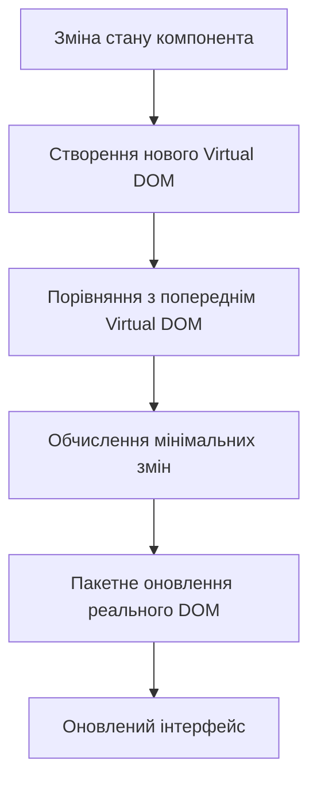
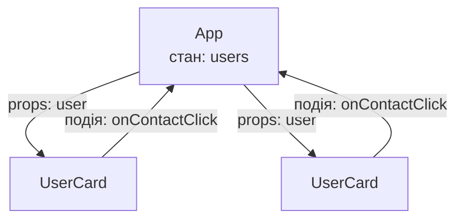

# Лекція 7. React основи та сучасні підходи

Шість попередніх лекцій були присвячені серверній частині: ми навчилися проєктувати API, працювати з базами даних, автентифікувати користувачів, тестувати й розгортати сервіси. Але користувач не працює з JSON — він бачить кнопки, форми й списки. Тепер ми переходимо на інший бік мережевої взаємодії й вивчаємо, як побудувати **клієнтську частину** (інтерфейс, що виконується в браузері) і підключити її до вже створеного сервера.

Для цього ми використаємо **React** — найпоширенішу бібліотеку для побудови інтерфейсів. Ця лекція закладає фундамент: як влаштований React, що таке JSX і компоненти, як дані передаються між ними, чим налагоджувати, як налаштувати проєкт і навіщо тут TypeScript. Наступні лекції побудуються на цьому: хуки й керування станом, маршрутизація, взаємодія з API. Матеріал лекції 6 нам також знадобиться: ті самі Vitest і конвеєр безперервної інтеграції застосовуються й до клієнтської частини.

Про актуальність. Цю лекцію оновлено під **React 19** (грудень 2024; поточна гілка — 19.2) і **Vite 8**. За останні роки змінилося чимало: з'явилися компілятор React, нові способи роботи з формами й асинхронними даними, а офіційна документація перестала рекомендувати Create React App. Там, де сучасний підхід відрізняється від того, що ви можете зустріти в старих посібниках і відеокурсах, ми прямо це зазначаємо.

## Вступ до React

### Історія та еволюція React

React народився в Facebook (тепер Meta) як внутрішній інструмент для розв'язання проблем зі складними інтерфейсами. Ідея належить інженеру Джордану Волке: на ранніх стадіях він перебував під впливом XHP — компонентної HTML-бібліотеки для PHP, де сторінку збирали з компонентів, а не рядкових шаблонів. Перший продукт із React — стрічка новин Facebook (2011), пізніше Instagram. У 2013 році на конференції JSConf US код відкрили для всіх, і з того часу підхід «інтерфейс як функція від даних» став одним із визначальних у клієнтській розробці.

Ключові етапи еволюції:

| Рік | Подія | Чому це важливо |
| --- | --- | --- |
| 2013 | Відкритий реліз React | бібліотека стає загальнодоступною |
| 2015 | React Native | ті самі ідеї для мобільних застосунків |
| 2016 | React 15 | покращена продуктивність, чистіша архітектура |
| 2017 | React 16 (Fiber) | повністю переписаний алгоритм узгодження (reconciliation), основа всього подальшого |
| 2019 | React 16.8: хуки (hooks) | функціональні компоненти отримали стан і ефекти; змінилася вся парадигма |
| 2020 | React 17 | реліз без нових можливостей, що спростив поступове оновлення великих застосунків |
| 2022 | React 18 | конкурентне відтворення (concurrent rendering), автоматичне групування оновлень, `createRoot` |
| 2024 | React 19 | Actions для форм і мутацій, хук `use`, `ref` як звичайний prop, стабільна підтримка серверних компонентів у фреймворках |
| 2025 | React 19.2, React Compiler 1.0 | `<Activity>`, `useEffectEvent`, треки продуктивності; автоматична мемоїзація на етапі збирання |

Зверніть увагу на закономірність: React рухається еволюційно. Код, написаний на React 16.8, у переважній більшості випадків працює й нині, а нові можливості додаються поруч зі старими. Це одна з причин, чому екосистема така стабільна — і чому ви зустрічатимете в реальних проєктах код, написаний у різних «епохах».

### Філософія React: компонентний підхід

До появи бібліотек на кшталт React інтерфейс зазвичай будували імперативно: знайти елемент у DOM, змінити його текст, додати клас, прибрати іншому елементу. У великому застосунку такі ручні маніпуляції швидко перетворювалися на клубок зв'язків, де зміна в одному місці ламала інше. React пропонує інший спосіб мислення: **ви описуєте, як інтерфейс має виглядати за поточних даних, а бібліотека сама вирішує, які зміни внести в сторінку**.

Основою є **компонент** — незалежний, придатний до повторного використання фрагмент інтерфейсу, який інкапсулює власну розмітку, логіку й стан. Кнопка, картка товару, форма входу, уся сторінка — усе це компоненти, вкладені один в одного, як цеглини в стіні. Так інтерфейс стає модульним, тестованим і підтримуваним — ті самі якості, до яких ми прагнули на серверній частині.

Ключові принципи React:

1. **Декларативність.** Ми описуємо, *що* має відображатися, а не *як* цього досягти покроково;
2. **Компонентна архітектура.** Інтерфейс — це ієрархія (дерево) компонентів;
3. **Однонаправлений потік даних.** Дані рухаються від батьківських компонентів до дочірніх (вниз), а зміни повідомляються вгору через функції-обробники; це робить поведінку застосунку передбачуваною;
4. **Інтерфейс як функція стану.** За тих самих даних компонент завжди дає той самий результат; ми змінюємо дані — React оновлює сторінку;
5. **Learn Once, Write Anywhere.** Концепції переносяться між платформами: веб (React DOM), мобільні застосунки (React Native), а також відтворення на сервері.

Звідси випливає важлива методична порада: у React найважче не запам'ятати синтаксис, а змінити спосіб мислення. Коли ви хочете «оновити елемент на сторінці», питайте себе: *яке значення стану це змінить?*

### Virtual DOM та reconciliation

Чому б просто не перебудовувати сторінку щоразу, коли змінилися дані? Тому що операції з реальним DOM відносно дорогі: кожна зміна може вимагати повторного розрахунку розмітки та перемальовування. Тому React будує проміжне **віртуальне представлення інтерфейсу** — легке дерево JavaScript-об'єктів (їх називають React-елементами), яке описує, що має бути на сторінці. Коли стан змінюється, React будує нове дерево, порівнює його з попереднім (це порівняння називають **diffing**) і обчислює мінімальний набір змін, які потрібно внести в реальний DOM.



Загальна процедура узгодження дерев називається **reconciliation** (узгодження). Вона спирається на два розумні припущення: елементи різних типів дають різні дерева (тому `<div>`, замінений на `<span>`, перебудовується повністю), а елементи списків розпізнаються за **ключем** `key` (тому ключі мають бути стабільними — про це нижче).

Процес оновлення складається з кількох фаз:

**Фаза відтворення (render)**: React викликає функції компонентів і будує нове віртуальне дерево. Це обчислення, побічних ефектів тут бути не повинно. Завдяки архітектурі Fiber ця фаза може бути перервана й відновлена пізніше — саме на цьому побудовано конкурентні можливості React 18 і новіших версій, коли терміновіші оновлення (введення тексту) обганяють менш термінові.

**Фаза фіксації (commit)**: React застосовує обчислені зміни до реального DOM. Ця фаза виконується синхронно й не переривається, бо користувач не повинен бачити напівоновлену сторінку.

**Фаза ефектів**: після оновлення DOM (і, як правило, після того, як браузер показав його на екрані) виконуються ефекти — код, який ви оформили в `useEffect`: запит до сервера, підписка, робота з таймером.

Слід сказати, що термін «Virtual DOM» останніми роками трактують дедалі обережніше. Це не «магічна швидкість», а спосіб дозволити розробнику мислити декларативно: React не обіцяє, що оновлення завжди найшвидше з можливих (інші бібліотеки, наприклад Svelte чи Solid, обходяться без віртуального дерева), але гарантує зручну модель програмування за прийнятної швидкості. Продуктивністю ми ще займемося, і, як побачимо, на практиці її переважно забезпечує правильна структура компонентів, а не ручні хитрощі.

### Екосистема React сьогодні

Важливо розуміти, чим React є, а чим ні. **React — це бібліотека для побудови інтерфейсу**, а не повний фреймворк: вона нічого не знає про маршрутизацію, запити до сервера чи розгортання. Навколо неї склалася екосистема, і в ній відбулися суттєві зміни:

- **Створення проєкту.** Інструмент Create React App (CRA) було офіційно оголошено застарілим у лютому 2025 року, і його більше не слід використовувати. Документація React рекомендує для нових проєктів **фреймворки** — Next.js, React Router (режим фреймворка), TanStack Start, Expo для мобільних застосунків. Якщо ж потрібен звичайний односторінковий застосунок (SPA) без серверної частини на React, стандартний вибір — **Vite**. У межах курсу ми обираємо Vite: ми вже маємо власну серверну частину на Express, тому повноцінний фреймворк з серверним відтворенням нам не потрібен, а результат простіше зрозуміти.
- **Компілятор React.** React Compiler 1.0 (жовтень 2025) — інструмент збирання, який автоматично мемоїзує компоненти й значення. Раніше розробники вручну обгортали код у `React.memo`, `useMemo`, `useCallback`; тепер у нових проєктах значну частину цієї роботи бере на себе компілятор.
- **Стан сервера.** Завантаження й кешування даних із API дедалі частіше доручають спеціалізованим бібліотекам, передусім **TanStack Query**, а не пишуть вручну через `useEffect`. Ми навчимося працювати саме так у лабораторних роботах, а тут розберемо базовий механізм, щоб розуміти, що відбувається «під капотом».

Тож коли ви бачите пораду з відео чи статті п'ятирічної давності, корисно перевірити: чи не належить вона до інструментів, що відійшли в минуле.

## JSX: синтаксис та можливості

### Що таке JSX

Щоб описати, як має виглядати інтерфейс, потрібна зручна нотація. Можна складати дерево елементів викликами функцій, але це швидко стає нечитабельним. React пропонує **JSX** (JavaScript XML) — синтаксичне розширення JavaScript, що дозволяє писати HTML-подібну розмітку безпосередньо в коді. Важливо, що це не шаблонна мова з власною логікою: у JSX ви користуєтеся всією потужністю JavaScript.

```javascript
// JSX виглядає як HTML
const element = <h1>Привіт, React!</h1>;

// Але насправді це синтаксичний цукор над викликами функцій
const element = React.createElement('h1', null, 'Привіт, React!');
```

JSX не є обов'язковим для роботи з React, але без нього код був би значно важчим для читання. Браузер JSX не розуміє, тому його перетворює на звичайний JavaScript інструмент збирання: у нашому проєкті це робить Vite (у попередніх версіях — Babel або SWC, у Vite 8 — швидший компілятор Oxc). Сучасне перетворення JSX («automatic runtime») навіть не вимагає писати `import React from 'react'` у кожному файлі, як це було до 2020 року.

Розмітка в JSX може здатися порушенням давнього принципу розділення HTML, CSS і JavaScript, але React розділяє код за іншою ознакою — за **відповідальністю**. Розмітка й логіка, що разом відповідають за одну кнопку, живуть в одному місці, і це зручніше, ніж три файли, змінюючи які постійно треба перемикатися.

### Синтаксис JSX: правила та обмеження

JSX має правила, що відрізняють його від звичайного HTML.

**Єдиний кореневий елемент.** Компонент повертає один кореневий елемент, бо функція може повернути лише одне значення. Якщо потрібно повернути кілька сусідніх елементів без зайвої обгортки в розмітці, використовують **фрагмент** `<>...</>`.

```javascript
// Правильно: один кореневий елемент
function UserCard() {
    return (
        <div className="card">
            <h2>Іван Петренко</h2>
            <p>Розробник</p>
        </div>
    );
}

// Правильно: використання Fragment
function UserInfo() {
    return (
        <>
            <h2>Іван Петренко</h2>
            <p>Розробник</p>
        </>
    );
}

// Неправильно: два кореневі елементи без обгортки
function WrongComponent() {
    return (
        <h2>Заголовок</h2>
        <p>Параграф</p>
    );
}
```

**CamelCase для атрибутів.** Атрибути записують у camelCase, а деякі мають інші назви, бо збігаються із зарезервованими словами JavaScript (`class`, `for`). Атрибути `aria-*` і `data-*` залишаються з дефісом.

```javascript
function StyledButton({ handleClick }) {
    return (
        <button
            className="btn-primary"      // замість class
            onClick={handleClick}        // замість onclick
            tabIndex={0}                 // замість tabindex
            aria-label="Кнопка дії"      // aria-атрибути залишаються з дефісом
        >
            Натисніть мене
        </button>
    );
}
```

**Закриття всіх тегів.** На відміну від HTML, у JSX кожен тег має бути закритий, зокрема й порожні (``, `<input />`, `<br />`).

```javascript
function ImageGallery() {
    return (
        <div>
                 {/* Обов'язково закривати */}
            <input type="text" />                   {/* Також потрібне закриття */}
            <br />                                  {/* Не <br> */}
        </div>
    );
}
```

**Регістр імені має значення.** Теги з малої літери (`<div>`, `<button>`) React сприймає як вбудовані елементи HTML, а з великої (`<UserCard />`) — як власні компоненти. Тому назви компонентів завжди починають з великої літери.

### Вбудований JavaScript в JSX

Усередині фігурних дужок `{}` можна писати будь-який **вираз** JavaScript: змінну, виклик функції, тернарний оператор. Не можна вставляти *інструкції* (`if`, `for`) — для них використовують вирази чи виносять логіку перед `return`. Так компоненти стають динамічними.

```javascript
function UserProfile({ user }) {
    const currentYear = new Date().getFullYear();
    const age = currentYear - user.birthYear;
    const isAdult = age >= 18;

    return (
        <div className="profile">
            <h1>{user.name}</h1>
            <p>Вік: {age} років</p>
            <p>Статус: {isAdult ? 'Повнолітній' : 'Неповнолітній'}</p>

            {/* Умовне відтворення */}
            {user.isVerified && <span className="badge">Верифіковано</span>}

            {/* Відтворення списків */}
            <ul>
                {user.skills.map((skill) => (
                    <li key={skill}>{skill}</li>
                ))}
            </ul>

            {/* Обчислення в атрибутах */}
            <div
                className={`status ${user.isOnline ? 'online' : 'offline'}`}
                style={{ backgroundColor: user.favoriteColor }}
            >
                {user.isOnline ? 'В мережі' : 'Не в мережі'}
            </div>
        </div>
    );
}
```

Зверніть увагу на атрибут `key` у списку. Він потрібен, щоб React міг розрізнити елементи між оновленнями: якщо порядок або склад списку змінився, React за ключами зрозуміє, який елемент новий, який видалений, а який просто перемістився. Тому ключ має бути **стабільним і унікальним серед сусідів** — ідентифікатор із бази даних (`user.id`) або унікальне значення (як `skill` у прикладі, якщо навички не повторюються). Часто трапляється `key={index}` (індекс у масиві), і це погана практика для списків, які можуть змінюватися: при вставці чи видаленні елемента індекси зсуваються, і React «прив'язує» стан до не тих елементів (наприклад, введений у поле текст «переїжджає» в інший рядок). Індекс припустимий лише для статичних списків, що ніколи не змінюють порядок.

Щодо `style`: в JSX він приймає **об'єкт**, а не рядок, тому подвійні фігурні дужки — це не спеціальний синтаксис, а дужка виразу, всередині якої записано об'єкт. Властивості пишуться в camelCase (`backgroundColor`). Для більшості випадків стилі краще виносити в CSS та підключати через `className`.

Ще одна важлива властивість JSX: він **автоматично екранує** вставлені значення. Якщо в `{user.name}` потрапить рядок із тегом `<script>`, він буде виведений як текст, а не виконаний. Це захищає від найпоширенішого виду XSS-атак (див. матеріали про безпеку з попередніх лекцій). Небезпечним є лише спеціальний атрибут `dangerouslySetInnerHTML`, назва якого не випадкова, — вставляти в нього дані, що не пройшли очищення, не можна.

### Умовне відтворення в JSX

React не має спеціальних директив на кшталт `v-if`: використовується звичайний JavaScript. Розглянемо основні способи.

```javascript
function ProductCard({ product, user }) {
    // 1. Раннє повернення для особливих станів.
    //    Перевіряємо ДО звернення до полів product
    if (!product) {
        return <div>Товар не знайдено</div>;
    }

    if (product.outOfStock) {
        return <div className="out-of-stock">Немає в наявності</div>;
    }

    // 2. Тернарний оператор для вибору між двома варіантами
    const priceDisplay = user.isPremium
        ? <span className="premium-price">{product.price * 0.9} грн</span>
        : <span className="regular-price">{product.price} грн</span>;

    // 3. Допоміжна функція для складнішої логіки
    function getStatusMessage(quantity) {
        if (quantity === 0) return 'Закінчився';
        if (quantity < 5) return 'Мало товару';
        return 'В наявності';
    }

    return (
        <div className="product-card">
            <h3>{product.name}</h3>
            {priceDisplay}

            {/* 4. Логічний оператор && для умовного показу */}
            {product.discount > 0 && (
                <div className="badge">Знижка {product.discount}%</div>
            )}

            <p>{getStatusMessage(product.quantity)}</p>
        </div>
    );
}
```

Порядок має значення. У старій версії цього прикладу перед перевіркою `!product` уже виконувалося звернення до `product.price`, і при `product === undefined` компонент упав би до того, як дійшов до «раннього повернення». Правило просте: **спершу відсікаємо особливі стани, потім працюємо зі звичайним**.

Ще одна пастка оператора `&&`. Значення `false`, `null` і `undefined` React не відображає, але число `0` — відображає. Тому `{items.length && <List items={items} />}` при порожньому списку виведе на сторінці цифру `0`. Правильно робити явне порівняння: `{items.length > 0 && <List items={items} />}`.

## React компоненти

### Функціональні компоненти

Функціональні компоненти — основний спосіб створення компонентів у сучасному React. Це звичайні JavaScript-функції, що приймають об'єкт властивостей (**props**) і повертають JSX. Ім'я функції починається з великої літери, а сама вона має бути *чистою* щодо своїх вхідних даних (докладніше про це нижче).

```javascript
// Найпростіший функціональний компонент
function Welcome() {
    return <h1>Вітаємо в React!</h1>;
}

// Компонент з props
function Greeting({ name, title }) {
    return (
        <div className="greeting">
            <h2>{title} {name}</h2>
        </div>
    );
}

// Компонент зі складнішою логікою
function TaskList({ tasks, onTaskComplete }) {
    const completedCount = tasks.filter((task) => task.completed).length;
    const pendingTasks = tasks.filter((task) => !task.completed);

    return (
        <div className="task-list">
            <div className="header">
                <h2>Список завдань</h2>
                <span>Виконано: {completedCount} з {tasks.length}</span>
            </div>

            <ul>
                {pendingTasks.map((task) => (
                    <li key={task.id}>
                        <span>{task.title}</span>
                        <button onClick={() => onTaskComplete(task.id)}>
                            Виконано
                        </button>
                    </li>
                ))}
            </ul>
        </div>
    );
}
```

Компонент можна використовувати як власний HTML-тег: `<TaskList tasks={tasks} onTaskComplete={complete} />`. Саме так із маленьких компонентів складаються великі.

Точкою входу застосунку є файл `main.jsx`, який «монтує» кореневий компонент у сторінку. Починаючи з React 18 це робиться через `createRoot` (старий `ReactDOM.render` видалено з React 19):

```javascript
// src/main.jsx
import { StrictMode } from 'react';
import { createRoot } from 'react-dom/client';
import App from './App.jsx';

createRoot(document.getElementById('root')).render(
    <StrictMode>
        <App />
    </StrictMode>
);
```

Компонент `<StrictMode>` не змінює вигляду сторінки, але в режимі розробки додатково перевіряє код: викликає функції компонентів і ефекти двічі, щоб виявити приховані побічні дії й помилки очищення. Якщо ви бачите в консолі подвійний виклик — це не помилка, а свідома перевірка, і в готовій збірці вона вимикається.

### Чисті компоненти та правила React

Щоб React міг безпечно перервати, повторити чи пропустити відтворення, від компонента потрібна **чистота**: за однакових props і стану він повертає однаковий результат і не змінює нічого за межами власного обчислення. Це не вигадка авторів бібліотеки, а той самий принцип, що ми знаємо з функціонального програмування й тестування (див. лекцію 6: чиста функція тестується найпростіше).

Практичні правила:

- **Не змінюйте props, стан і змінні поза компонентом безпосередньо.** Дані для читання; для змін є `setState`;
- **Не виконуйте побічних дій під час відтворення.** Запит до мережі, підписка, `document.title = ...` виконуються в обробниках подій або ефектах, а не в тілі компонента;
- **Викликайте хуки лише на верхньому рівні компонента (або власного хука)**: не всередині умов, циклів чи вкладених функцій. React відстежує хуки за порядком виклику, і порушення цього порядку ламає зв'язок зі станом;
- **Хуки викликають лише в компонентах та власних хуках**, а не в довільних функціях.

Ці правила перевіряє плагін `eslint-plugin-react-hooks`, який уже підключено в шаблоні Vite. Ставтеся до його попереджень серйозно: вони найчастіше вказують на реальну помилку, а компілятор React (див. далі) вимагає дотримання цих правил для коректної роботи.

### Стан і ефекти: перше знайомство

Компонент без стану — лише «шаблон». Щоб інтерфейс реагував на дії користувача, потрібен **стан** (state) — дані, що належать компоненту й змінюються з часом. Стан оголошують хуком `useState`:

```javascript
import { useState } from 'react';

function Counter() {
    const [count, setCount] = useState(0); // [поточне значення, функція оновлення]

    return (
        <div>
            <p>Натиснуто разів: {count}</p>
            <button onClick={() => setCount(count + 1)}>Додати</button>
        </div>
    );
}
```

Що відбувається при натисканні? Викликається `setCount`, React планує нове відтворення компонента, функція `Counter` виконується знову, але цього разу `useState` повертає вже нове значення — і React оновлює лише те, що змінилося. Зверніть увагу на дві важливі властивості:

1. **Стан — це «знімок» на момент відтворення.** У межах одного виклику функції `count` не змінюється, навіть якщо після `setCount` ви прочитаєте його в тому ж обробнику. Якщо нове значення залежить від попереднього, пишіть `setCount((prev) => prev + 1)`;
2. **Стан не можна змінювати «на місці».** Для масивів і об'єктів створюємо нову копію (`setItems([...items, newItem])`, `setUser({ ...user, name })`), інакше React не помітить змін.

Друга група задач — **побічні ефекти**: усе, що виходить за межі обчислення інтерфейсу (запит до сервера, таймер, підписка на подію браузера, зміна `document.title`). Для цього існує `useEffect`, який виконується після відтворення:

```javascript
import { useEffect, useState } from 'react';

function OnlineStatus() {
    const [isOnline, setIsOnline] = useState(navigator.onLine);

    useEffect(() => {
        const update = () => setIsOnline(navigator.onLine);

        window.addEventListener('online', update);
        window.addEventListener('offline', update);

        // Функція очищення: виконується перед наступним запуском ефекту та при видаленні компонента
        return () => {
            window.removeEventListener('online', update);
            window.removeEventListener('offline', update);
        };
    }, []); // масив залежностей: [] — лише при появі компонента

    return <p>{isOnline ? 'Ви в мережі' : 'Немає з’єднання'}</p>;
}
```

Другий аргумент `useEffect` — **масив залежностей**: ефект запускається знову, лише якщо змінилося одне зі значень у ньому. Порожній масив означає «один раз після появи компонента», відсутність масиву — «після кожного відтворення». Усі значення (props, стан), які ефект використовує, мають бути перелічені в залежностях — це також перевіряє ESLint.

Важлива методична порада: **ефект потрібен не завжди**. Обчислити значення з props чи стану (наприклад, відфільтрований список) або відреагувати на клік — це робиться прямо під час відтворення або в обробнику події. Ефекти призначені для *синхронізації із зовнішнім світом*. У нових версіях документації навіть є окрема стаття «Вам, імовірно, не потрібен ефект» (You Might Not Need an Effect). Повний розгляд хуків (`useReducer`, `useContext`, `useMemo`, власні хуки) — тема наступної лекції; тут вони потрібні, щоб приклади були зрозумілі.

### Class компоненти: історичний контекст

До введення хуків (2019) класові компоненти були єдиним способом працювати зі станом та методами життєвого циклу. Нові класові компоненти сьогодні майже не пишуть, але їх багато в старих кодових базах, тому вміти прочитати такий код корисно. Слід знати, що клас не було «видалено»: React підтримує їх і в 19-й версії, лише **нові можливості** (хуки, `use`, Actions) доступні тільки функціональним компонентам.

```javascript
// Класовий компонент зі state та методами життєвого циклу
class UserProfile extends React.Component {
    constructor(props) {
        super(props);
        this.state = {
            user: null,
            loading: true,
            error: null
        };
        this.controller = new AbortController();
    }

    componentDidMount() {
        // Викликається після першого відтворення
        this.fetchUserData();
    }

    componentDidUpdate(prevProps) {
        // Викликається після кожного оновлення
        if (prevProps.userId !== this.props.userId) {
            this.fetchUserData();
        }
    }

    componentWillUnmount() {
        // Викликається перед видаленням компонента
        this.controller.abort();
    }

    fetchUserData = async () => {
        try {
            const response = await fetch(`/api/users/${this.props.userId}`, {
                signal: this.controller.signal
            });
            const user = await response.json();
            this.setState({ user, loading: false });
        } catch (error) {
            if (error.name !== 'AbortError') {
                this.setState({ error: error.message, loading: false });
            }
        }
    };

    render() {
        const { user, loading, error } = this.state;

        if (loading) return <div>Завантаження...</div>;
        if (error) return <div>Помилка: {error}</div>;

        return (
            <div className="profile">
                <h1>{user.name}</h1>
                <p>{user.email}</p>
            </div>
        );
    }
}
```

Зверніть увагу, як логіка «отримати дані при появі й повторити при зміні `userId`» розкидана по трьох методах життєвого циклу. У функціональному варіанті вона зібрана в одному ефекті — це одна з причин, чому хуки прижилися.

### Порівняння функціональних та класових компонентів

Функціональні компоненти з хуками мають переваги над класовими:

**Менше службового коду (boilerplate).** Не потрібні `constructor`, `this.state`, `this.setState`, прив'язка методів.

**Краще повторне використання логіки.** Власні хуки виносять і переносять логіку між компонентами значно простіше, ніж компоненти вищого порядку (HOC) чи Render Props.

**Немає проблем із `this`.** Зникає плутанина з контекстом виконання.

**Кращі можливості оптимізації.** Функції легше аналізувати статично, тому компілятор React працює саме з функціональними компонентами.

Ось той самий компонент у сучасному вигляді:

```javascript
import { useEffect, useState } from 'react';

function UserProfile({ userId }) {
    const [user, setUser] = useState(null);
    const [loading, setLoading] = useState(true);
    const [error, setError] = useState(null);

    useEffect(() => {
        const controller = new AbortController();

        async function fetchUserData() {
            setLoading(true);
            setError(null);

            try {
                const response = await fetch(`/api/users/${userId}`, {
                    signal: controller.signal
                });
                // fetch не кидає помилку для 404 чи 500 — статус перевіряємо самі
                if (!response.ok) {
                    throw new Error(`Сервер відповів: ${response.status}`);
                }
                setUser(await response.json());
            } catch (err) {
                if (err.name !== 'AbortError') {
                    setError(err.message);
                }
            } finally {
                if (!controller.signal.aborted) {
                    setLoading(false);
                }
            }
        }

        fetchUserData();

        // Очищення: скасовуємо запит, якщо userId змінився або компонент видалено
        return () => controller.abort();
    }, [userId]);

    if (loading) return <div>Завантаження...</div>;
    if (error) return <div>Помилка: {error}</div>;

    return (
        <div className="profile">
            <h1>{user.name}</h1>
            <p>{user.email}</p>
        </div>
    );
}
```

Порівняно зі старою версією прикладу змінилося три речі, і всі вони практичні. По-перше, замість прапорця `isCancelled` ми використовуємо `AbortController`: він не просто ігнорує запізнілу відповідь, а справді **скасовує мережевий запит**, економлячи трафік. По-друге, ми перевіряємо `response.ok` — без цього відповідь 404 зі сторінкою помилки буде розібрана як JSON, і користувач побачить незрозумілий збій. По-третє, при зміні `userId` ми повертаємо компонент у стан завантаження.

Цей ручний код показовий, але він розв'язує лише частину проблем реального застосунку: немає кешу (повторний перехід на ту саму сторінку знову чекає мережу), дублювання запитів, повторних спроб, оновлення в фоновому режимі. Тому в промислових проєктах для стану сервера застосовують **TanStack Query** (ми користуватимемося ним у лабораторних роботах), а у фреймворках — вбудовані завантажувачі даних. У React 19 з'явилися й власні примітиви: хук `use` дозволяє «прочитати» проміс у компоненті, а `<Suspense>` показує запасний вміст, поки дані завантажуються. Але, щоб оцінити ці інструменти, потрібно розуміти, який саме механізм вони замінюють, — тому ми розібрали його вручну.

## Props та композиція компонентів

### Передача даних через props

**Props** (від properties — властивості) — механізм передачі даних від батьківського компонента до дочірнього. Для дочірнього компонента вони **доступні лише для читання**: змінювати props не можна, і це забезпечує однонаправлений потік даних. Якщо дочірньому компоненту потрібно щось повідомити батькові (користувач натиснув кнопку), батько передає функцію-обробник як prop, а дочірній її викликає.



Дані течуть вниз (через props), події — вгору (через функції-обробники). Завдяки цьому завжди можна визначити, звідки взялося кожне значення: достатньо піднятися деревом до компонента, який володіє станом.

```javascript
// Батьківський компонент передає props
function App() {
    const user = {
        name: 'Олена Шевченко',
        email: 'olena@example.com',
        role: 'Розробник'
    };

    return (
        <div>
            <UserCard
                name={user.name}
                email={user.email}
                role={user.role}
                isVerified={true}
                skills={['React', 'TypeScript', 'Node.js']}
                onContactClick={() => console.log('Контакт')}
            />
        </div>
    );
}

// Дочірній компонент отримує props
function UserCard({ name, email, role, isVerified, skills, onContactClick }) {
    return (
        <div className="user-card">
            <h2>{name}</h2>
            <p>{email}</p>
            <span className="role">{role}</span>
            {isVerified && <span className="verified">✓ Верифікований</span>}

            <div className="skills">
                {skills.map((skill) => (
                    <span key={skill} className="skill-tag">{skill}</span>
                ))}
            </div>

            <button onClick={onContactClick}>Зв’язатися</button>
        </div>
    );
}
```

Значення props можуть бути будь-якого типу: рядки, числа, об'єкти, масиви, функції, навіть інші компоненти. Рядки передають у лапках (`role="Розробник"`), усе інше — у фігурних дужках (`isVerified={true}`, `skills={[...]}`). Якщо boolean-prop передано без значення (`<Button disabled />`), це дорівнює `true`.

Коли з'являються props, які потрібно передати через кілька рівнів вкладення (дані користувача — з кореня в глибоко вкладену кнопку), ланцюжок передач стає громіздким («prop drilling»). Для цього у React є **контекст**, який ми розглянемо нижче на прикладі вкладок і докладно — в наступній лекції.

### Деструктуризація props

Деструктуризація робить код читабельнішим, особливо коли props багато: одразу видно, які дані потрібні компоненту.

```javascript
// Базова деструктуризація в параметрах
function ProductCard({ name, price, image, inStock }) {
    return (
        <div className="product">
            
            <h3>{name}</h3>
            <p>{price} грн</p>
            {inStock ? <span>В наявності</span> : <span>Немає</span>}
        </div>
    );
}

// Деструктуризація зі значеннями за замовчуванням
function Button({
    text = 'Натиснути',
    variant = 'primary',
    disabled = false,
    onClick
}) {
    return (
        <button
            className={`btn btn-${variant}`}
            disabled={disabled}
            onClick={onClick}
        >
            {text}
        </button>
    );
}

// Rest-оператор для решти props
function Input({ label, error, ...inputProps }) {
    return (
        <div className="input-group">
            <label>{label}</label>
            <input {...inputProps} />
            {error && <span className="error">{error}</span>}
        </div>
    );
}

// Використання
<Input
    label="Email"
    type="email"
    placeholder="your@email.com"
    required
    maxLength={100}
    error="Некоректний email"
/>
```

Значення за замовчуванням у параметрах деструктуризації — **єдиний рекомендований спосіб** задавати їх у функціональних компонентах. Старий спосіб `Button.defaultProps = {...}` у React 19 для функціональних компонентів **більше не працює** (видалений), тож у старих проєктах його треба замінити на значення в параметрах. Так само ігноруються `propTypes` (перевірка типів під час роботи): у React 19 їх більше не перевіряють, а рекомендованим способом типізації є TypeScript (див. нижче).

Шаблон `{ label, error, ...inputProps }` із rest-оператором корисний для компонентів-обгорток над нативними елементами: власні props ви забираєте, а решту (`type`, `placeholder`, `required`) передаєте далі без переліку кожного. У TypeScript це узгоджується типом `React.ComponentProps<'input'>` (приклад далі).

### Children prop та композиція

**Children** — особливий prop, що містить усе, що розміщено між відкривальним і закривальним тегами компонента. Це основа композиції: компонент не мусить знати, що саме в нього вкладено.

```javascript
// Базове використання children
function Card({ children }) {
    return (
        <div className="card">
            <div className="card-content">
                {children}
            </div>
        </div>
    );
}

// Використання
<Card>
    <h2>Заголовок картки</h2>
    <p>Це вміст усередині картки</p>
</Card>

// Компонент розмітки з кількома «слотами»
function PageLayout({ header, sidebar, children, footer }) {
    return (
        <div className="page-layout">
            <header className="header">{header}</header>
            <div className="main-content">
                <aside className="sidebar">{sidebar}</aside>
                <main className="content">{children}</main>
            </div>
            <footer className="footer">{footer}</footer>
        </div>
    );
}

// Використання з іменованими слотами
<PageLayout
    header={<Navigation />}
    sidebar={<Sidebar />}
    footer={<Footer />}
>
    <h1>Основний вміст</h1>
    <p>Тут розміщується основний вміст сторінки</p>
</PageLayout>
```

Головна думка тут — принцип «**композиція замість успадкування**». У React немає потреби створювати ієрархії класів `SpecialButton extends Button`: замість цього компонент приймає вкладений вміст або інші компоненти через props і комбінує їх. Такий підхід гнучкіший і не вимагає прогнозувати всі варіанти використання наперед.

### Композиційні патерни

Композиція дозволяє будувати складні компоненти з простих. Розглянемо два поширених патерни.

**Container/Presentational (контейнер і подання).** Компонент-контейнер відповідає за дані, а компонент-подання — лише за вигляд. Розділення полегшує тестування: подання перевіряють, просто передаючи props. Із появою хуків роль контейнера здебільшого перейшла до **власного хука**: логіка завантаження виноситься в функцію `useUsers`, а компонент залишається майже «чистою» розміткою.

```javascript
// Власний хук: логіка отримання даних
function useUsers() {
    const [users, setUsers] = useState([]);
    const [loading, setLoading] = useState(true);
    const [error, setError] = useState(null);

    useEffect(() => {
        const controller = new AbortController();

        fetch('/api/users', { signal: controller.signal })
            .then((response) => {
                if (!response.ok) throw new Error(`Сервер відповів: ${response.status}`);
                return response.json();
            })
            .then(setUsers)
            .catch((err) => {
                if (err.name !== 'AbortError') setError(err.message);
            })
            .finally(() => {
                if (!controller.signal.aborted) setLoading(false);
            });

        return () => controller.abort();
    }, []);

    return { users, loading, error };
}

// Контейнер: керує станом завантаження й передає дані
function UserListContainer() {
    const { users, loading, error } = useUsers();

    if (loading) return <LoadingSpinner />;
    if (error) return <ErrorMessage message={error} />;

    return <UserList users={users} />;
}

// Подання: лише вигляд, без власної логіки
function UserList({ users }) {
    return (
        <div className="user-list">
            {users.map((user) => (
                <UserListItem key={user.id} user={user} />
            ))}
        </div>
    );
}
```

**Compound Components (складені компоненти).** Кілька взаємопов'язаних компонентів працюють разом і ділять спільний стан, але споживач бачить лише зручний декларативний інтерфейс (як `<select>` і `<option>` у HTML). Класично ці компоненти передавали стан через `React.cloneElement` і `React.Children.map`, але такий спосіб крихкий: він ламається, якщо між `Tabs` і `Tab` з'явиться проміжна обгортка, і сама документація React зараз описує `cloneElement` як «застарілий підхід». Сучасний і надійніший спосіб — **контекст (Context)**: батьківський компонент «розповсюджує» стан, а вкладені беруть його безпосередньо, на будь-якій глибині.

```javascript
import { createContext, useContext, useState } from 'react';

const TabsContext = createContext(null);

function useTabs() {
    const context = useContext(TabsContext);
    if (!context) {
        throw new Error('Компоненти вкладок потрібно використовувати всередині <Tabs>');
    }
    return context;
}

function Tabs({ children, defaultTab = 0 }) {
    const [activeTab, setActiveTab] = useState(defaultTab);

    // React 19: контекст використовується безпосередньо як провайдер (без .Provider)
    return (
        <TabsContext value={{ activeTab, setActiveTab }}>
            <div className="tabs">{children}</div>
        </TabsContext>
    );
}

function TabList({ children }) {
    return <div className="tab-list" role="tablist">{children}</div>;
}

function Tab({ index, children }) {
    const { activeTab, setActiveTab } = useTabs();
    const isActive = index === activeTab;

    return (
        <button
            role="tab"
            aria-selected={isActive}
            className={`tab ${isActive ? 'active' : ''}`}
            onClick={() => setActiveTab(index)}
        >
            {children}
        </button>
    );
}

function TabPanel({ index, children }) {
    const { activeTab } = useTabs();
    if (index !== activeTab) return null;

    return <div className="tab-panel" role="tabpanel">{children}</div>;
}

// Використання
<Tabs defaultTab={0}>
    <TabList>
        <Tab index={0}>Профіль</Tab>
        <Tab index={1}>Налаштування</Tab>
        <Tab index={2}>Сповіщення</Tab>
    </TabList>

    <TabPanel index={0}>
        <UserProfile userId={1} />
    </TabPanel>
    <TabPanel index={1}>
        <Settings />
    </TabPanel>
    <TabPanel index={2}>
        <Notifications />
    </TabPanel>
</Tabs>
```

Зауважте: `index` тепер передаємо явно, тож `Tab` і `TabPanel` можна вкладати в довільні обгортки, а сам код лишається читабельним. Додаткові атрибути `role` та `aria-*` роблять вкладки доступними для допоміжних технологій — гарна звичка для будь-якого інтерактивного компонента. У реальних проєктах такі складні компоненти часто беруть із готових бібліотек (Radix UI, React Aria, shadcn/ui), але розуміння патерну потрібне, щоб їх використовувати й адаптувати.

### Що змінив React 19 у роботі з props і контекстом

Підсумуємо зміни, які стосуються цього розділу, — вони важливі, бо більшість навчальних матеріалів в інтернеті ще описує старий стан речей.

| Було (React 18 і раніше) | Стало (React 19) |
| --- | --- |
| `const Child = forwardRef((props, ref) => ...)` для передачі `ref` | `ref` — звичайний prop функціонального компонента: `function Input({ ref, ...props })` |
| `<MyContext.Provider value={...}>` | `<MyContext value={...}>` |
| `Component.defaultProps = {...}` | значення за замовчуванням у параметрах функції |
| `Component.propTypes = {...}` | перевірку більше не виконують; використовуйте TypeScript |
| `useContext(MyContext)` (лише на верхньому рівні) | `use(MyContext)` також працює й може викликатися в умовах |
| `<title>`, `<meta>` тільки через сторонні бібліотеки | можна відтворювати безпосередньо в компоненті — React підніме їх у `<head>` |

`forwardRef` та `.Provider` поки що працюють, але вважаються застарілими, тому в нових проєктах використовуйте нові форми. Для форм і асинхронних дій React 19 додав ще цілу групу можливостей — **Actions**, хуки `useActionState`, `useFormStatus` і `useOptimistic`, — які ми розглянемо в лекції про форми.

## React Developer Tools

### Встановлення та налаштування

Коли інтерфейс складається з десятків вкладених компонентів, `console.log` перестає бути ефективним способом налагодження: потрібно бачити дерево компонентів, їхні props і стан. Для цього існує розширення **React Developer Tools** для Chrome, Firefox і Edge (є також окрема автономна версія `react-devtools`).

Після встановлення у DevTools браузера з'являються дві нові вкладки:

**Components** — дерево компонентів із можливістю переглядати й змінювати props, стан і хуки в реальному часі.

**Profiler** — інструмент вимірювання продуктивності: скільки часу займає відтворення кожного компонента й чому воно відбулося.

Розширення працює на сторінках, створених із React. Значок розширення в панелі браузера змінює колір: синій — застосунок зібрано в режимі розробки, темний — у промисловому режимі (у ньому доступ до частини даних обмежений, і саме тому налагоджувати треба на сервері розробки).

### Інспекція компонентів

Вкладка Components показує ієрархію компонентів застосунку у вигляді дерева. Кожен вузол можна вибрати й розглянути детально.

```javascript
// Приклад компонента для інспекції
function ProductDetails({ productId }) {
    const [product, setProduct] = useState(null);
    const [quantity, setQuantity] = useState(1);
    const [reviews, setReviews] = useState([]);

    useEffect(() => {
        // React DevTools покаже цей ефект і його залежності
        loadProduct(productId).then(setProduct);
        loadReviews(productId).then(setReviews);
    }, [productId]);

    // У DevTools можна побачити:
    // - усі props (productId)
    // - усі змінні стану (product, quantity, reviews)
    // - усі хуки та їхні значення
    // - джерело компонента (файл і рядок коду)

    return (
        <div className="product-details">
            {/* вміст */}
        </div>
    );
}
```

Після вибору компонента відображається:

- **Props** — усі передані властивості з можливістю змінити значення прямо в панелі й одразу побачити результат;
- **Hooks** — стан усіх хуків у порядку виклику;
- **Rendered by** — який компонент створив поточний (допомагає пройти ланцюжок вгору);
- **Source** — посилання на вихідний код.

Корисні можливості: пошук за назвою компонента; кнопка «інспектувати елемент на сторінці» (клікаєте на елемент — DevTools виділяє відповідний компонент); налаштування «Highlight updates when components render», що підсвічує рамкою компоненти, які відтворюються після дії; запис значень у консоль (`$r` посилається на вибраний компонент).

У проєктах, де ввімкнено компілятор React, компоненти, які він успішно оптимізував, отримують у дереві позначку **«Memo ✨»**. Це швидкий спосіб переконатися, що оптимізація діє.

### Profiler для оптимізації

Profiler допомагає знайти вузькі місця. Розглянемо компонент, який виконує зайву роботу при кожному відтворенні:

```javascript
// Компонент, який може бути проблемним для продуктивності
function ExpensiveList({ items, filter }) {
    // Без мемоїзації ці обчислення виконуються при кожному відтворенні,
    // навіть якщо items і filter не змінилися (наприклад, змінився стан батька)
    const filteredItems = items.filter((item) =>
        item.name.toLowerCase().includes(filter.toLowerCase())
    );

    const sortedItems = filteredItems.toSorted((a, b) => b.price - a.price);

    return (
        <ul>
            {sortedItems.map((item) => (
                <ExpensiveListItem key={item.id} item={item} />
            ))}
        </ul>
    );
}
```

Зауважте `toSorted` замість `sort`: перший створює нову відсортовану копію, а не змінює масив на місці (принцип незмінності, про який ми говорили вище). Метод доступний у всіх сучасних браузерах і в Node.js 20+.

Робота з Profiler виглядає так:

1. Відкрити вкладку Profiler (у налаштуваннях увімкнути «Record why each component rendered while profiling»);
2. Натиснути кнопку запису;
3. Виконати в застосунку дії, які здаються повільними;
4. Зупинити запис і проаналізувати результати.

Profiler показує:

- **Flame graph** — візуалізацію часу відтворення кожного компонента (ширина смуги — тривалість, сірі компоненти в цій фіксації не відтворювалися);
- **Ranked chart** — компоненти, відсортовані за витраченим часом;
- **Причини відтворення** — змінилися props, стан, хук чи відтворився батьківський компонент.

Щодо оптимізації важливо засвоїти чітку послідовність: **спочатку вимірюємо, потім оптимізуємо**. Більшість інтерфейсів достатньо швидкі без будь-яких хитрощів, а передчасна оптимізація ускладнює код. Якщо ж вимірювання показало проблему, потрібно перевірити, чи не можна її розв'язати структурою: іноді достатньо винести повільну частину в окремий компонент або перенести стан ближче до місця використання. Колись наступним кроком були ручні `React.memo`, `useMemo` і `useCallback`. Тепер у проєктах із **компілятором React** такі оптимізації здебільшого виконуються автоматично, а ручні залишають для окремих винятків. Проте розуміти їх потрібно, бо ви зустрінете їх у наявному коді.

React 19.2 додав ще один засіб — **треки продуктивності (Performance Tracks)**: у вкладці Performance браузера Chrome з'являються окремі доріжки з часом планування й виконання робіт React, зіставлені з іншими подіями браузера.

## Налаштування проєкту з Vite

### Що таке Vite

**Vite** (французькою «швидкий») — сучасний інструмент збирання, створений Еваном Ю, автором Vue.js. Його ідея проста: під час розробки не збирати весь застосунок у один файл, а віддавати браузеру модулі окремо, використовуючи нативну підтримку ES-модулів; повну оптимізовану збірку робити лише для розгортання. Тому сервер розробки запускається практично миттєво навіть у великих проєктах. Vite не прив'язаний до React: цей самий інструмент використовують із Vue, Svelte, Solid та іншими.

Переваги Vite порівняно зі застарілим Create React App:

- **Миттєвий холодний старт**: сервер розробки готовий за секунди;
- **Швидка гаряча заміна модулів (HMR)**: зміни в коді з'являються в браузері без перезавантаження сторінки й без втрати стану;
- **Оптимізована збірка** для розгортання: розділення коду, стиснення, хешування назв файлів;
- **Вбудована підтримка TypeScript і JSX** без додаткових налаштувань;
- **Багата екосистема плагінів** і активна підтримка (тоді як CRA більше не розвивається).

Vite 8 (2026) зробив ще один суттєвий крок: замість двох різних інструментів (esbuild для розробки й Rollup для збірки) він використовує єдиний швидкий збирач **Rolldown**, написаний мовою Rust, а для обробки JSX і TypeScript — компілятор **Oxc**. Для вас, як користувача, це означає швидші збірки й однакову поведінку в розробці та у виробничій збірці; команди й структура проєкту залишаються знайомими. Vite 8 вимагає Node.js 20.19+ або 22.12+; у курсі ми працюємо з Node.js 24 (LTS).

### Створення React-проєкту з Vite

```bash
# Створення нового проєкту
npm create vite@latest my-react-app -- --template react

# Або з TypeScript
npm create vite@latest my-react-app -- --template react-ts

# Перехід до директорії проєкту
cd my-react-app

# Встановлення залежностей
npm install

# Запуск сервера розробки
npm run dev
```

Після запуску Vite виводить адресу — за замовчуванням `http://localhost:5173` (а **не** `3000`, як у Create React App). Саме цю адресу ми вказували в `ALLOWED_ORIGINS` серверної частини в лекції 6.

Структура створеного проєкту (склад файлів залежить від версії шаблону, але головне лишається незмінним):

```
my-react-app/
├── node_modules/
├── public/
│   └── vite.svg
├── src/
│   ├── assets/
│   │   └── react.svg
│   ├── App.css
│   ├── App.jsx
│   ├── index.css
│   └── main.jsx
├── .gitignore
├── eslint.config.js
├── index.html
├── package.json
└── vite.config.js
```

Зверніть увагу на дві відмінності від того, до чого ми звикли. По-перше, `index.html` лежить **у корені**, а не в `public/`: він є точкою входу, і в ньому напряму підключений `<script type="module" src="/src/main.jsx">`. По-друге, статичні файли, які потрібні «як є» (іконка, `robots.txt`), кладуть у `public/`, а зображення, що імпортуються в коді, — у `src/assets/`, тоді Vite додасть їм хеш у назві для кешування.

Скрипти в `package.json`:

| Команда | Призначення |
| --- | --- |
| `npm run dev` | сервер розробки з гарячою заміною модулів |
| `npm run build` | виробнича збірка в теку `dist/` |
| `npm run preview` | локальний перегляд уже зібраної версії |
| `npm run lint` | перевірка ESLint (у тому числі правил хуків) |

### Конфігурація Vite

Файл `vite.config.js` налаштовує поведінку Vite під потреби проєкту. Оскільки наш проєкт використовує ES-модулі, шлях до теки `src` формуємо через `import.meta.url` (змінної `__dirname` у модулях ESM немає — про це ми говорили в лекції 2).

```javascript
import { defineConfig } from 'vite';
import react from '@vitejs/plugin-react';
import { fileURLToPath, URL } from 'node:url';

export default defineConfig({
    plugins: [react()],

    // Псевдоніми для імпортів: import { Button } from '@/components/Button'
    resolve: {
        alias: {
            '@': fileURLToPath(new URL('./src', import.meta.url))
        }
    },

    // Налаштування сервера розробки
    server: {
        port: 5173,
        proxy: {
            // Запити на /api перенаправляються на нашу серверну частину
            '/api': {
                target: 'http://localhost:3000',
                changeOrigin: true
            }
        }
    },

    // Налаштування збірки
    build: {
        outDir: 'dist',
        sourcemap: true
    }
});
```

Пояснимо два моменти. **Проксі** для `/api` розв'язує типову проблему розробки: браузер вважає `localhost:5173` (клієнт) і `localhost:3000` (сервер) різними джерелами й блокує запити без CORS-заголовків. Із проксі клієнт звертається до свого ж джерела, а Vite сам передає запит серверу, тому в розробці налаштовувати CORS не потрібно. На відміну від старих прикладів, ми **не** переписуємо шлях (`rewrite`), бо наша серверна частина справді обслуговує маршрути з префіксом `/api`. У робочому середовищі проксі Vite не працює: там клієнт і сервер розгортаються окремо, і потрібні або коректні CORS-налаштування на сервері (`ALLOWED_ORIGINS` з лекції 6), або зворотний проксі перед обома.

Друге — **псевдоніми**. Вони скорочують імпорти (`@/hooks/useUsers` замість `../../../hooks/useUsers`). У проєктах на TypeScript їх треба продублювати в `tsconfig.json` (`paths`), щоб редактор розумів шляхи; у Vite 8 для цього є опція `resolve.tsconfigPaths: true`, яка бере псевдоніми безпосередньо з `tsconfig.json`, і дублювання не потрібне.

У старих прикладах можна побачити ручне розділення коду через `build.rollupOptions.output.manualChunks` (окремі файли для `react`, `react-dom`, маршрутизатора). Для нових проєктів у цьому переважно немає потреби: Vite вміє розділяти код автоматично, а в Vite 8 цей механізм працює інакше (збирач Rolldown має власні налаштування розділення). Замість ручного налаштування краще завантажувати рідко потрібні сторінки «ліниво» через `React.lazy` і динамічний `import()`, тоді збирач сам виділить їх в окремі файли.

Компілятор React підключається як додатковий етап збирання; актуальний спосіб налаштування для вашої версії плагіна дивіться в документації (`react.dev/learn/react-compiler`), бо він змінювався разом із Vite і плагіном.

### Робота із середовищами

Vite підтримує змінні середовища через файли `.env`, причому до клієнтського коду потрапляють **лише змінні з префіксом `VITE_`**:

```bash
# .env — спільні значення
VITE_APP_TITLE=My React App

# .env.development — під час npm run dev
VITE_API_URL=http://localhost:3000
VITE_DEBUG=true

# .env.production — під час npm run build
VITE_API_URL=https://api.example.com
VITE_DEBUG=false

# .env.local — особисті значення розробника; додайте *.local до .gitignore
```

Використання в коді:

```javascript
// src/config/api.js
export const API_URL = import.meta.env.VITE_API_URL;
export const IS_DEBUG = import.meta.env.VITE_DEBUG === 'true'; // усі значення — рядки
export const APP_TITLE = import.meta.env.VITE_APP_TITLE;

// src/App.jsx
function App() {
    return (
        <div>
            <h1>{import.meta.env.VITE_APP_TITLE}</h1>
        </div>
    );
}
```

Тут є два важливі застереження, які випливають із принципів лекції 6.

**По-перше, усе, що потрапило в `VITE_*`, стає публічним.** Клієнтський код завантажується в браузер, і будь-який користувач може прочитати його у вкладці Network. Тому в змінні з префіксом `VITE_` ніколи не кладуть секрети: паролі, приватні ключі, токени доступу до бази. Там може бути тільки те, що не шкода показати світові, — наприклад, адреса API. Приватні ключі живуть на серверній частині, і цей поділ є ще одним аргументом на користь власного API.

**По-друге, значення підставляються під час збірки, а не запуску.** На відміну від сервера на Node.js, який читає змінні при кожному старті (12-Factor), клієнтський застосунок «запікає» їх у файли `dist/`. Щоб змінити `VITE_API_URL`, потрібно **перезібрати** проєкт (у конвеєрі CI це просто окремий крок збирання для кожного середовища).

У TypeScript-проєктах змінні варто описати типами, щоб редактор підказував назви й ловив друкарські помилки:

```typescript
// src/vite-env.d.ts
/// <reference types="vite/client" />

interface ImportMetaEnv {
    readonly VITE_API_URL: string;
    readonly VITE_APP_TITLE: string;
    readonly VITE_DEBUG?: string;
}

interface ImportMeta {
    readonly env: ImportMetaEnv;
}
```

Готову збірку (тека `dist/`) — це звичайні статичні файли — можна розгортати на будь-якому статичному хостингу (Render Static Sites, Netlify, Cloudflare Pages, GitHub Pages) або віддавати через Nginx у контейнері. Якщо застосунок використовує маршрутизацію на клієнті, хостинг має відповідати файлом `index.html` на будь-який невідомий шлях («SPA fallback»), інакше при прямому переході на `/users/5` користувач побачить 404.

## TypeScript з React

### Переваги TypeScript у React-проєктах

**TypeScript** додає до JavaScript статичну типізацію: перевірку типів значень перед запуском програми. Ми вже стикалися з ним у контексті серверної частини, а в клієнтській він особливо корисний, бо компоненти — це, по суті, функції з багатьма параметрами (props), і саме їхня форма найчастіше є джерелом помилок.

**Раннє виявлення помилок.** Більшість помилок (передали рядок замість числа, забули обов'язковий prop, помилилися в назві поля) виявляються в редакторі, а не у браузері користувача.

**Кращі підказки IDE.** Редактор точно знає, які props має компонент і які поля містить об'єкт, тож автодоповнення стає точним.

**Самодокументований код.** Типи props — це документація, що ніколи не застаріває, бо її перевіряє компілятор. У React 19 вона до того ж замінює `propTypes`.

**Безпечний рефакторинг.** Перейменували поле — компілятор одразу покаже всі місця, які треба виправити.

**Керованість великих кодових баз.** Типізація робить код передбачуванішим і полегшує вхід нових розробників у проєкт.

Вартість також є: потрібно вивчити систему типів, а частину помилок вона не виявить (про це нижче). Але для командної роботи й проєктів, що житимуть довго, переваги переважають, тому TypeScript став стандартом де-факто в індустрії. Шаблон `react-ts` у Vite налаштовує його у суворому режимі (`strict`), який ми й рекомендуємо.

Одна тонкість: Vite під час розробки **не перевіряє типи**, а лише вилучає їх з коду (тому й працює швидко). Перевірка типів — окремий крок: скрипт `npm run build` у шаблоні запускає `tsc` перед збіркою, а в конвеєрі безперервної інтеграції (лекція 6) варто додати окремий крок `npx tsc --noEmit`.

### Типізація функціональних компонентів

```typescript
// Базова типізація props
interface ButtonProps {
    text: string;
    onClick: () => void;
    variant?: 'primary' | 'secondary' | 'danger';
    disabled?: boolean;
}

function Button({ text, onClick, variant = 'primary', disabled = false }: ButtonProps) {
    return (
        <button
            className={`btn btn-${variant}`}
            onClick={onClick}
            disabled={disabled}
        >
            {text}
        </button>
    );
}

// Типізація з children
interface CardProps {
    title: string;
    children: React.ReactNode;
    className?: string;
}

function Card({ title, children, className }: CardProps) {
    return (
        <div className={`card ${className ?? ''}`}>
            <h2>{title}</h2>
            <div className="card-content">{children}</div>
        </div>
    );
}

// Компонент-обгортка над нативним елементом: успадковуємо всі його props
interface InputProps extends React.ComponentProps<'input'> {
    label: string;
    error?: string;
}

function Input({ label, error, ...inputProps }: InputProps) {
    return (
        <label>
            {label}
            <input {...inputProps} />
            {error && <span className="error">{error}</span>}
        </label>
    );
}

// Типізація з generic-типами
interface ListProps<T> {
    items: T[];
    renderItem: (item: T) => React.ReactNode;
    keyExtractor: (item: T) => string | number;
}

function List<T>({ items, renderItem, keyExtractor }: ListProps<T>) {
    return (
        <ul>
            {items.map((item) => (
                <li key={keyExtractor(item)}>
                    {renderItem(item)}
                </li>
            ))}
        </ul>
    );
}

// Використання
interface User {
    id: number;
    name: string;
    email: string;
}

<List<User>
    items={users}
    renderItem={(user) => <div>{user.name}</div>}
    keyExtractor={(user) => user.id}
/>
```

Кілька зауважень щодо стилю. Тип повернення компонента зазвичай **не вказують** явно — TypeScript виводить його сам; якщо потрібна анотація, використовують `React.JSX.Element` (глобальний простір імен `JSX`, що траплявся в старих посібниках, у типах React 19 прибрано). Тип `React.FC` у нових проєктах уживають дедалі рідше, бо звичайна функція з типізованими props простіша й не додає неявних властивостей. Для `children` придатний `React.ReactNode` — найширший тип, що охоплює все, що React уміє відображати. Тип `React.ComponentProps<'input'>` дає повний набір атрибутів нативного елемента, тож обгортка над `<input>` не потребує перелічувати їх вручну.

### Типізація хуків

```typescript
// useState із типом
const [count, setCount] = useState<number>(0);
const [user, setUser] = useState<User | null>(null);
const [items, setItems] = useState<string[]>([]);

// useState з interface
interface FormData {
    username: string;
    email: string;
    password: string;
}

function LoginForm() {
    const [formData, setFormData] = useState<FormData>({
        username: '',
        email: '',
        password: ''
    });

    const handleChange = (e: React.ChangeEvent<HTMLInputElement>) => {
        setFormData((prev) => ({
            ...prev,
            [e.target.name]: e.target.value
        }));
    };

    return (
        <form>
            <input
                name="username"
                value={formData.username}
                onChange={handleChange}
            />
        </form>
    );
}

// useEffect: типізуємо дані, отримані з мережі
useEffect(() => {
    const controller = new AbortController();

    async function fetchData() {
        try {
            const response = await fetch('/api/users', { signal: controller.signal });
            if (!response.ok) throw new Error(`Сервер відповів: ${response.status}`);

            const data = (await response.json()) as User[];
            setUsers(data);
        } catch (error) {
            if (!(error instanceof DOMException && error.name === 'AbortError')) {
                console.error(error);
            }
        }
    }

    fetchData();
    return () => controller.abort();
}, []);

// useRef: посилання на елемент DOM і на довільне значення
const inputRef = useRef<HTMLInputElement>(null);
const timerRef = useRef<ReturnType<typeof setTimeout> | null>(null);

function focusInput() {
    inputRef.current?.focus();
}
```

Два зауваження. Перше — до рядка `as User[]`: метод `response.json()` повертає `any`, тож ми лише **стверджуємо** компілятору, що дані мають такий вигляд, але не перевіряємо цього. Якщо сервер поверне інший формат, TypeScript помилки не виявить — вона проявиться вже під час виконання. Тому для даних із зовнішніх джерел використовують бібліотеки перевірки схем, наприклад **Zod** (ми згадували її в лекції 6): схема одночасно перевіряє дані та виводить тип. Друге — тип таймера: у браузері `setTimeout` повертає число, а в середовищі Node.js (наприклад, у тестах) — об'єкт; тому `ReturnType<typeof setTimeout>` надійніший за `number`.

### Типізація подій

```typescript
// Типізація обробників подій
function SearchInput() {
    const handleChange = (e: React.ChangeEvent<HTMLInputElement>) => {
        console.log(e.target.value);
    };

    const handleSubmit = (e: React.FormEvent<HTMLFormElement>) => {
        e.preventDefault();
        // обробка форми
    };

    const handleKeyDown = (e: React.KeyboardEvent<HTMLInputElement>) => {
        if (e.key === 'Enter') {
            // обробка Enter
        }
    };

    const handleClick = (e: React.MouseEvent<HTMLButtonElement>) => {
        console.log(e.clientX, e.clientY);
    };

    return (
        <form onSubmit={handleSubmit}>
            <input
                type="text"
                onChange={handleChange}
                onKeyDown={handleKeyDown}
            />
            <button onClick={handleClick}>Пошук</button>
        </form>
    );
}
```

Тип події складається з назви події й типу елемента (`ChangeEvent<HTMLInputElement>`), і від нього залежить, що доступно в `e.target` та `e.currentTarget`. Якщо не знаєте, який тип вказати, наведіть курсор на атрибут (`onChange`) у редакторі, або напишіть обробник прямо в JSX — тоді тип буде виведено автоматично.

### Створення власних типів

```typescript
// Утилітні типи для React
type Optional<T, K extends keyof T> = Omit<T, K> & Partial<Pick<T, K>>;

interface UserFormProps {
    user: User;
    onSave: (user: User) => void;
    onCancel: () => void;
}

// Зробити onCancel необов'язковим
type OptionalCancelProps = Optional<UserFormProps, 'onCancel'>;

// Union-типи для варіантів
type Status = 'idle' | 'loading' | 'success' | 'error';

// Дискримінантні об'єднання (discriminated unions) для складних станів
type AsyncState<T> =
    | { status: 'idle' }
    | { status: 'loading' }
    | { status: 'success'; data: T }
    | { status: 'error'; error: string };

function DataDisplay({ state }: { state: AsyncState<User> }) {
    // TypeScript знає, які поля доступні в кожній гілці
    switch (state.status) {
        case 'idle':
            return <div>Натисніть «Завантажити»</div>;
        case 'loading':
            return <div>Завантаження...</div>;
        case 'success':
            return <div>{state.data.name}</div>; // data доступна лише тут
        case 'error':
            return <div>Помилка: {state.error}</div>; // error доступна лише тут
    }
}
```

Дискримінантні об'єднання — один із найкорисніших прийомів у клієнтській розробці. Замість трьох окремих змінних (`data`, `loading`, `error`), які можуть опинитися в неможливих комбінаціях («завантажується й водночас помилка»), ми описуємо **допустимі стани** одним типом, і компілятор не дозволить звернутися до `data`, поки статус не `success`. Це та сама ідея, що й у проєктуванні станів на серверній частині: зробити неправильні стани неможливими.

## Тестування компонентів

У лекції 6 ми говорили, що тести — обов'язкова частина процесу, а не «додаток» до коду. Це стосується й клієнтської частини. Добра новина в тому, що інструмент нам уже знайомий: **Vitest** працює з проєктами Vite без додаткового налаштування збирання (вони поділяють одну конфігурацію). Для компонентів додаємо **React Testing Library** — бібліотеку, яка перевіряє інтерфейс так, як його бачить користувач: за ролями, підписами й видимим текстом, а не за внутрішньою будовою компонента.

```bash
npm install --save-dev vitest jsdom @testing-library/react @testing-library/dom \
    @testing-library/jest-dom @testing-library/user-event
```

```javascript
// vite.config.js (доповнення)
import { defineConfig } from 'vitest/config';

export default defineConfig({
    // ... plugins, resolve, server, build
    test: {
        environment: 'jsdom',            // імітація браузерного DOM у Node.js
        setupFiles: ['./src/test/setup.js']
    }
});
```

```javascript
// src/test/setup.js
import '@testing-library/jest-dom/vitest'; // toBeInTheDocument, toBeDisabled тощо
```

Тест компонента `Counter`, який ми писали вище, і тест обробника події:

```javascript
// src/components/Counter.test.jsx
import { describe, it, expect, vi } from 'vitest';
import { render, screen } from '@testing-library/react';
import userEvent from '@testing-library/user-event';
import { Counter } from './Counter';
import { Button } from './Button';

describe('Counter', () => {
    it('збільшує лічильник після натискання', async () => {
        const user = userEvent.setup();
        render(<Counter />);

        expect(screen.getByText('Натиснуто разів: 0')).toBeInTheDocument();

        await user.click(screen.getByRole('button', { name: 'Додати' }));

        expect(screen.getByText('Натиснуто разів: 1')).toBeInTheDocument();
    });
});

describe('Button', () => {
    it('викликає onClick при натисканні', async () => {
        const user = userEvent.setup();
        const handleClick = vi.fn();
        render(<Button text="Зберегти" onClick={handleClick} />);

        await user.click(screen.getByRole('button', { name: 'Зберегти' }));

        expect(handleClick).toHaveBeenCalledTimes(1);
    });

    it('не реагує, якщо вимкнена', async () => {
        const user = userEvent.setup();
        const handleClick = vi.fn();
        render(<Button text="Зберегти" onClick={handleClick} disabled />);

        await user.click(screen.getByRole('button', { name: 'Зберегти' }));

        expect(handleClick).not.toHaveBeenCalled();
    });
});
```

Тут працює та сама структура **Arrange–Act–Assert** і той самий `vi.fn()`, що й для серверних тестів. Пошук елементів за роллю (`getByRole`) виявляє ще й доступність: якщо кнопку не вдається знайти за роллю та назвою, скоріше за все, її не зможе використати й екранний диктор. Тестуйте **поведінку з погляду користувача** («після натискання число збільшилося»), а не деталі реалізації («викликано `setCount`»): такі тести не ламаються при рефакторингу. Для компонентів, що звертаються до API, запити мокають (зокрема бібліотекою MSW, яка перехоплює мережеві виклики) — за тим самим принципом, що й тестові двійники в лекції 6. Виконуйте `npm test` локально, а в конвеєрі CI — той самий набір, разом із перевіркою типів і лінтером.

## Висновки та найкращі практики

### Ключові концепції React

React змінив підхід до розробки інтерфейсів, запровадивши компонентну архітектуру та декларативний стиль програмування. Розуміння віртуального DOM, узгодження й однонаправленого потоку даних — основа ефективної роботи з бібліотекою: воно допомагає передбачити, коли і чому оновлюється інтерфейс.

JSX робить код виразним, дозволяючи описувати інтерфейс у знайомому HTML-подібному синтаксисі з повною потужністю JavaScript. Пам'ятайте, що це синтаксичний цукор над викликами функцій, — це допомагає уникнути непорозумінь.

Функціональні компоненти з хуками стали стандартом завдяки простоті й можливості повторного використання логіки. Класові компоненти залишаються важливими для розуміння наявного коду й історії екосистеми, але нових їх не пишуть. Нові можливості React 19 і компілятор розраховані саме на функціональні компоненти.

### Організація компонентів

Правильна організація — ключ до підтримуваної кодової бази. Компоненти мають бути невеликими, з однією відповідальністю й такими, що легко використовуються повторно. **Композиція перевершує успадкування**: складні компоненти будуємо з простих блоків.

Props — це контракт між компонентами, їхній API. Чітка типізація (TypeScript замість застарілих PropTypes) документує очікування й запобігає помилкам. Children і слоти дозволяють створювати гнучкі компоненти розмітки та складені компоненти, а контекст — уникати передавання даних крізь кілька рівнів.

### Інструменти розробки

Vite забезпечує миттєвий старт і швидку заміну модулів; правильна конфігурація (псевдоніми, проксі до API, змінні середовища з префіксом `VITE_`) значно підвищує продуктивність. Пам'ятайте про межу між клієнтською й серверною частиною: усе, що потрапило в клієнтську збірку, публічне.

React Developer Tools — незамінний інструмент налагодження. Вміння оглянути дерево компонентів, стан і props, зафіксувати в Profiler причини зайвих відтворень відрізняє досвідченого розробника від початківця.

Vitest і React Testing Library дозволяють застосувати до інтерфейсу ту саму дисципліну тестування, що й до серверної частини.

### TypeScript у React

TypeScript дає безпеку типів і зручність розробки. Типізовані props роблять компоненти самодокументованими, generic-типи — гнучкими, а дискримінантні об'єднання дозволяють описувати допустимі стани так, що неправильні неможливо записати. Пам'ятайте, що типи існують лише на етапі розробки: дані з мережі потребують перевірки під час виконання (наприклад, Zod).

### Найкращі практики

1. **Дотримуйтесь принципу єдиної відповідальності**: кожен компонент робить одну річ добре;
2. **Використовуйте композицію** замість дублювання коду — створюйте переносні компоненти й комбінуйте їх;
3. **Тримайте компоненти чистими**: жодних побічних дій під час відтворення, жодних змін props і стану «на місці»;
4. **Типізуйте всі props і стан** — це безпека й кращий досвід розробника;
5. **Використовуйте стабільні ключі** (`key`) у списках, а не індекси масиву, якщо список змінюється;
6. **Спершу вимірюйте, потім оптимізуйте.** Для оптимізації користуйтеся Profiler і компілятором React, а ручні `React.memo`, `useMemo`, `useCallback` залишайте для доведених випадків;
7. **Не зловживайте ефектами**: обчислюйте значення під час відтворення, реагуйте на події в обробниках, ефекти лишайте для синхронізації із зовнішнім світом;
8. **Дані з сервера завантажуйте перевіреними інструментами** (TanStack Query або засоби фреймворка), а не розмножуйте власні `fetch` в ефектах;
9. **Не кладіть секрети у змінні `VITE_*`**;
10. **Пишіть тести поведінки**, використовуйте `getByRole` і виконуйте перевірки в конвеєрі CI;
11. **Організовуйте файли логічно**: групуйте пов'язані файли (компонент, стилі, тест) разом;
12. **Стежте за розміром компонентів**: якщо компонент розрісся — розділіть його.

### Що далі

Ми розібрали основи: як описати інтерфейс у JSX, розбити його на компоненти, передати дані через props і налаштувати проєкт. Ми лише познайомилися з `useState` та `useEffect`; наступні лекції розвинуть цю тему — глибокий розгляд хуків, керування станом застосунку, маршрутизацію на клієнті, роботу з формами (включно з Actions React 19) і взаємодію з нашим API. Ключ до майстерності в React — практика й постійне вивчення нових можливостей екосистеми, яка змінюється швидко: слідкуйте за офіційною документацією `react.dev` і перевіряйте, чи не застаріла порада, яку ви зустріли.

### Питання для самоперевірки

1. Що означає, що React — декларативна бібліотека? Чим це відрізняється від маніпуляцій з DOM «вручну»?
2. З яких фаз складається оновлення інтерфейсу в React? У якій із них можна виконувати побічні ефекти?
3. Чому в списках потрібен атрибут `key` і чому не варто використовувати індекс масиву як ключ?
4. Що таке чистий компонент і чому це важливо для React?
5. Чим `useState` відрізняється від звичайної змінної? Чому стан не можна змінювати «на місці»?
6. Для чого потрібен масив залежностей `useEffect` і функція очищення?
7. У яких випадках ефект не потрібен?
8. Як передати дані від батьківського компонента до дочірнього й навпаки?
9. Чому Context у складених компонентах надійніший за `React.cloneElement`?
10. Які зміни щодо `ref`, `defaultProps`, `propTypes` і провайдера контексту принесла React 19?
11. Чому Create React App більше не рекомендують і чим його замінює Vite?
12. Чому не можна зберігати секрети у змінних із префіксом `VITE_`?
13. Що дає TypeScript у React-проєктах і чого він не перевіряє під час виконання?
14. Як за допомогою Vitest і React Testing Library перевірити, що після натискання кнопки інтерфейс змінюється?
