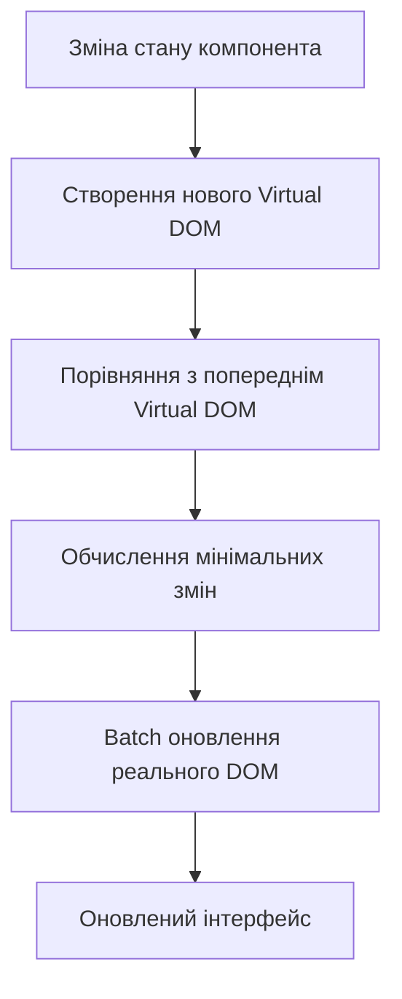

# Лекція 9. React основи та сучасні підходи

## Вступ до React

### Історія та еволюція React

React народився в 2011 році в стінах Facebook (тепер Meta) як внутрішній інструмент для вирішення проблем із складними інтерфейсами. Джордан Волке, інженер Facebook, створив першу версію React під впливом XHP — HTML-компонентної бібліотеки для PHP. У 2013 році React був представлений публіці на конференції JSConf US і з того часу радикально змінив ландшафт фронтенд розробки.

Ключові етапи еволюції React:

- **2013 рік**: публічний реліз React як бібліотеки з відкритим кодом;
- **2015 рік**: представлення React Native для мобільної розробки;
- **2016 рік**: React 15 з покращеною продуктивністю та оновленою архітектурою;
- **2017 рік**: React 16 (React Fiber) з повністю переписаним reconciliation алгоритмом;
- **2019 рік**: представлення React Hooks, що змінило парадигму розробки компонентів;
- **2020-2024 роки**: React 17-18 з concurrent features, Suspense, Server Components.

### Філософія React: компонентний підхід

React базується на фундаментальній ідеї розбиття інтерфейсу на незалежні, переносні компоненти. Кожен компонент інкапсулює свою логіку, стан та представлення, що робить код більш модульним, тестованим та підтримуваним.

**Ключові принципи React:**

1. **Декларативність**: описуємо "що" повинно бути відображено, а не "як" це зробити;
2. **Компонентна архітектура**: UI складається з ієрархії компонентів;
3. **Однонаправлений потік даних**: дані течуть від батьківських компонентів до дочірніх;
4. **Virtual DOM**: ефективне оновлення реального DOM через віртуальне представлення;
5. **Learn Once, Write Anywhere**: концепції React застосовні на різних платформах.

### Virtual DOM та reconciliation

Virtual DOM є серцем ефективності React. Це легке JavaScript представлення реального DOM дерева. Коли стан компонента змінюється, React створює нове віртуальне дерево, порівнює його з попереднім (diffing) та обчислює мінімальний набір змін, необхідних для оновлення реального DOM.



Процес reconciliation включає три основні фази:

**Render фаза**: React викликає render методи/функції компонентів та будує нове віртуальне дерево. Ця фаза може бути перервана та відновлена пізніше завдяки React Fiber архітектурі.

**Commit фаза**: React застосовує обчислені зміни до реального DOM. Ця фаза завжди виконується синхронно та не може бути перервана.

**Effects фаза**: виконання side effects, таких як useEffect хуки, після того як DOM був оновлений.

## JSX: синтаксис та можливості

### Що таке JSX

JSX (JavaScript XML) — це синтаксичне розширення JavaScript, яке дозволяє писати HTML-подібний код безпосередньо в JavaScript файлах. Хоча JSX нагадує шаблонну мову, він має повну потужність JavaScript.

```javascript
// JSX виглядає як HTML
const element = <h1>Привіт, React!</h1>;

// Але насправді це синтаксичний цукор над викликами функцій
const element = React.createElement('h1', null, 'Привіт, React!');
```

JSX не є обов'язковим для роботи з React, але його використання значно підвищує читабельність коду та продуктивність розробки. За лаштунками інструменти як Babel транспілюють JSX в звичайні JavaScript виклики.

### Синтаксис JSX: правила та обмеження

JSX має певні правила, які відрізняють його від звичайного HTML:

**Єдиний кореневий елемент**: кожен компонент повинен повертати один кореневий елемент. Якщо потрібно повернути кілька елементів, їх можна обгорнути в фрагмент.

```javascript
// Правильно: один кореневий елемент
function UserCard() {
    return (
        <div className="card">
            <h2>Іван Петренко</h2>
            <p>Розробник</p>
        </div>
    );
}

// Правильно: використання Fragment
function UserInfo() {
    return (
        <>
            <h2>Іван Петренко</h2>
            <p>Розробник</p>
        </>
    );
}

// Неправильно: два кореневі елементи без обгортки
function WrongComponent() {
    return (
        <h2>Заголовок</h2>
        <p>Параграф</p>
    );
}
```

**CamelCase для атрибутів**: HTML атрибути в JSX записуються в camelCase нотації, а деякі мають інші назви через конфлікти з JavaScript ключовими словами.

```javascript
function StyledButton() {
    return (
        <button
            className="btn-primary"      // замість class
            onClick={handleClick}        // замість onclick
            tabIndex={0}                 // замість tabindex
            aria-label="Кнопка дії"      // aria-атрибути залишаються з дефісом
        >
            Натисніть мене
        </button>
    );
}
```

**Закриття всіх тегів**: на відміну від HTML, в JSX всі теги повинні бути явно закриті, включно з самозакриваючими тегами.

```javascript
function ImageGallery() {
    return (
        <div>
                 {/* Обов'язково закривати */}
            <input type="text" />                   {/* Також потрібне закриття */}
            <br />                                  {/* Не <br> */}
        </div>
    );
}
```

### Вбудований JavaScript в JSX

JSX дозволяє використовувати JavaScript вирази всередині фігурних дужок. Це робить компоненти динамічними та виразними.

```javascript
function UserProfile({ user }) {
    const currentYear = new Date().getFullYear();
    const age = currentYear - user.birthYear;
    const isAdult = age >= 18;

    return (
        <div className="profile">
            <h1>{user.name}</h1>
            <p>Вік: {age} років</p>
            <p>Статус: {isAdult ? 'Повнолітній' : 'Неповнолітній'}</p>

            {/* Умовний рендеринг */}
            {user.isVerified && <span className="badge">Верифіковано</span>}

            {/* Рендеринг списків */}
            <ul>
                {user.skills.map((skill, index) => (
                    <li key={index}>{skill}</li>
                ))}
            </ul>

            {/* Обчислення в атрибутах */}
            <div
                className={`status ${user.isOnline ? 'online' : 'offline'}`}
                style={{ backgroundColor: user.favoriteColor }}
            >
                {user.isOnline ? 'В мережі' : 'Не в мережі'}
            </div>
        </div>
    );
}
```

### Умовний рендеринг в JSX

React надає кілька способів умовного рендерингу елементів:

```javascript
function ProductCard({ product, user }) {
    // 1. Тернарний оператор для вибору між двома варіантами
    const priceDisplay = user.isPremium
        ? <span className="premium-price">{product.price * 0.9} грн</span>
        : <span className="regular-price">{product.price} грн</span>;

    // 2. Логічний оператор && для умовного відображення
    const discountBadge = product.discount > 0 && (
        <div className="badge">Знижка {product.discount}%</div>
    );

    // 3. Раннє повернення для різних станів
    if (!product) {
        return <div>Товар не знайдено</div>;
    }

    if (product.outOfStock) {
        return <div className="out-of-stock">Немає в наявності</div>;
    }

    // 4. IIFE для складної логіки
    const statusMessage = (() => {
        if (product.quantity === 0) return 'Закінчився';
        if (product.quantity < 5) return 'Мало товару';
        return 'В наявності';
    })();

    return (
        <div className="product-card">
            <h3>{product.name}</h3>
            {priceDisplay}
            {discountBadge}
            <p>{statusMessage}</p>
        </div>
    );
}
```

## React компоненти

### Функціональні компоненти

Функціональні компоненти є основним способом створення компонентів у сучасному React. Це звичайні JavaScript функції, які приймають props як аргумент та повертають JSX.

```javascript
// Найпростіший функціональний компонент
function Welcome() {
    return <h1>Вітаємо в React!</h1>;
}

// Компонент з props
function Greeting({ name, title }) {
    return (
        <div className="greeting">
            <h2>{title} {name}</h2>
        </div>
    );
}

// Компонент зі складнішою логікою
function TaskList({ tasks, onTaskComplete }) {
    const completedCount = tasks.filter(task => task.completed).length;
    const pendingTasks = tasks.filter(task => !task.completed);

    return (
        <div className="task-list">
            <div className="header">
                <h2>Список завдань</h2>
                <span>Виконано: {completedCount} з {tasks.length}</span>
            </div>

            <ul>
                {pendingTasks.map(task => (
                    <li key={task.id}>
                        <span>{task.title}</span>
                        <button onClick={() => onTaskComplete(task.id)}>
                            Виконано
                        </button>
                    </li>
                ))}
            </ul>
        </div>
    );
}
```

### Class компоненти: історичний контекст

До введення React Hooks у 2019 році, класові компоненти були єдиним способом використання стану та lifecycle методів. Хоча сучасні проєкти віддають перевагу функціональним компонентам, розуміння класових компонентів важливе для роботи з legacy кодом.

```javascript
// Класовий компонент з state та lifecycle методами
class UserProfile extends React.Component {
    constructor(props) {
        super(props);
        this.state = {
            user: null,
            loading: true,
            error: null
        };
    }

    componentDidMount() {
        // Викликається після першого рендеру
        this.fetchUserData();
    }

    componentDidUpdate(prevProps) {
        // Викликається після кожного оновлення
        if (prevProps.userId !== this.props.userId) {
            this.fetchUserData();
        }
    }

    componentWillUnmount() {
        // Викликається перед видаленням компонента
        this.cancelPendingRequests();
    }

    fetchUserData = async () => {
        try {
            const response = await fetch(`/api/users/${this.props.userId}`);
            const user = await response.json();
            this.setState({ user, loading: false });
        } catch (error) {
            this.setState({ error: error.message, loading: false });
        }
    };

    render() {
        const { user, loading, error } = this.state;

        if (loading) return <div>Завантаження...</div>;
        if (error) return <div>Помилка: {error}</div>;

        return (
            <div className="profile">
                <h1>{user.name}</h1>
                <p>{user.email}</p>
            </div>
        );
    }
}
```

### Порівняння функціональних та класових компонентів

Функціональні компоненти з хуками мають численні переваги над класовими:

**Менше boilerplate коду**: функціональні компоненти більш лаконічні та легші для читання. Не потрібно писати constructor, this.state, this.setState.

**Краще повторне використання логіки**: кастомні хуки дозволяють виносити та переносити логіку між компонентами простіше, ніж Higher-Order Components або Render Props.

**Немає проблем з this**: уникнення плутанини з контекстом виконання та необхідності біндити методи.

**Кращі можливості оптимізації**: функціональні компоненти легше для React оптимізувати під час компіляції.

```javascript
// Той самий функціонал функціональним компонентом
function UserProfile({ userId }) {
    const [user, setUser] = useState(null);
    const [loading, setLoading] = useState(true);
    const [error, setError] = useState(null);

    useEffect(() => {
        let isCancelled = false;

        const fetchUserData = async () => {
            try {
                const response = await fetch(`/api/users/${userId}`);
                const data = await response.json();
                if (!isCancelled) {
                    setUser(data);
                    setLoading(false);
                }
            } catch (err) {
                if (!isCancelled) {
                    setError(err.message);
                    setLoading(false);
                }
            }
        };

        fetchUserData();

        return () => {
            isCancelled = true;
        };
    }, [userId]);

    if (loading) return <div>Завантаження...</div>;
    if (error) return <div>Помилка: {error}</div>;

    return (
        <div className="profile">
            <h1>{user.name}</h1>
            <p>{user.email}</p>
        </div>
    );
}
```

## Props та композиція компонентів

### Передача даних через props

Props (скорочення від properties) є механізмом передачі даних від батьківського компонента до дочірнього. Props є read-only для дочірнього компонента, що забезпечує однонаправлений потік даних.

```javascript
// Батьківський компонент передає props
function App() {
    const user = {
        name: 'Олена Шевченко',
        email: 'olena@example.com',
        role: 'Розробник'
    };

    return (
        <div>
            <UserCard
                name={user.name}
                email={user.email}
                role={user.role}
                isVerified={true}
                skills={['React', 'TypeScript', 'Node.js']}
                onContactClick={() => console.log('Контакт')}
            />
        </div>
    );
}

// Дочірній компонент отримує props
function UserCard({ name, email, role, isVerified, skills, onContactClick }) {
    return (
        <div className="user-card">
            <h2>{name}</h2>
            <p>{email}</p>
            <span className="role">{role}</span>
            {isVerified && <span className="verified">✓ Верифікований</span>}

            <div className="skills">
                {skills.map((skill, index) => (
                    <span key={index} className="skill-tag">{skill}</span>
                ))}
            </div>

            <button onClick={onContactClick}>Зв'язатися</button>
        </div>
    );
}
```

### Деструктуризація props

Деструктуризація робить код більш читабельним та виразним, особливо коли компонент має багато props.

```javascript
// Базова деструктуризація в параметрах
function ProductCard({ name, price, image, inStock }) {
    return (
        <div className="product">
            
            <h3>{name}</h3>
            <p>{price} грн</p>
            {inStock ? <span>В наявності</span> : <span>Немає</span>}
        </div>
    );
}

// Деструктуризація з значеннями за замовчуванням
function Button({
    text = 'Натиснути',
    variant = 'primary',
    disabled = false,
    onClick
}) {
    return (
        <button
            className={`btn btn-${variant}`}
            disabled={disabled}
            onClick={onClick}
        >
            {text}
        </button>
    );
}

// Rest оператор для решти props
function Input({ label, error, ...inputProps }) {
    return (
        <div className="input-group">
            <label>{label}</label>
            <input {...inputProps} />
            {error && <span className="error">{error}</span>}
        </div>
    );
}

// Використання
<Input
    label="Email"
    type="email"
    placeholder="your@email.com"
    required
    maxLength={100}
    error="Невалідний email"
/>
```

### Children prop та композиція

Children prop є спеціальним prop, який дозволяє передавати вміст між відкриваючим та закриваючим тегами компонента. Це основа композиційних паттернів у React.

```javascript
// Базове використання children
function Card({ children }) {
    return (
        <div className="card">
            <div className="card-content">
                {children}
            </div>
        </div>
    );
}

// Використання
<Card>
    <h2>Заголовок картки</h2>
    <p>Це контент всередині картки</p>
</Card>

// Layout компонент з множинними children
function PageLayout({ header, sidebar, children, footer }) {
    return (
        <div className="page-layout">
            <header className="header">{header}</header>
            <div className="main-content">
                <aside className="sidebar">{sidebar}</aside>
                <main className="content">{children}</main>
            </div>
            <footer className="footer">{footer}</footer>
        </div>
    );
}

// Використання з іменованими slots
<PageLayout
    header={<Navigation />}
    sidebar={<Sidebar />}
    footer={<Footer />}
>
    <h1>Основний контент</h1>
    <p>Тут розміщується основний вміст сторінки</p>
</PageLayout>
```

### Композиційні паттерни

Композиція в React дозволяє будувати складні компоненти з простих будівельних блоків.

```javascript
// Container/Presentational паттерн
function UserListContainer() {
    const [users, setUsers] = useState([]);
    const [loading, setLoading] = useState(true);

    useEffect(() => {
        fetchUsers().then(data => {
            setUsers(data);
            setLoading(false);
        });
    }, []);

    if (loading) return <LoadingSpinner />;

    return <UserList users={users} />;
}

function UserList({ users }) {
    return (
        <div className="user-list">
            {users.map(user => (
                <UserListItem key={user.id} user={user} />
            ))}
        </div>
    );
}

// Compound Components паттерн
function Tabs({ children, defaultTab }) {
    const [activeTab, setActiveTab] = useState(defaultTab);

    return (
        <div className="tabs">
            {React.Children.map(children, child => {
                return React.cloneElement(child, {
                    activeTab,
                    onTabChange: setActiveTab
                });
            })}
        </div>
    );
}

function TabList({ children, activeTab, onTabChange }) {
    return (
        <div className="tab-list">
            {React.Children.map(children, (child, index) => {
                return React.cloneElement(child, {
                    isActive: index === activeTab,
                    onClick: () => onTabChange(index)
                });
            })}
        </div>
    );
}

function Tab({ children, isActive, onClick }) {
    return (
        <button
            className={`tab ${isActive ? 'active' : ''}`}
            onClick={onClick}
        >
            {children}
        </button>
    );
}

function TabPanel({ children, index, activeTab }) {
    if (index !== activeTab) return null;
    return <div className="tab-panel">{children}</div>;
}

// Використання
<Tabs defaultTab={0}>
    <TabList>
        <Tab>Профіль</Tab>
        <Tab>Налаштування</Tab>
        <Tab>Сповіщення</Tab>
    </TabList>

    <TabPanel index={0}>
        <UserProfile />
    </TabPanel>
    <TabPanel index={1}>
        <Settings />
    </TabPanel>
    <TabPanel index={2}>
        <Notifications />
    </TabPanel>
</Tabs>
```

## React Developer Tools

### Встановлення та налаштування

React Developer Tools є розширенням для браузера, яке надає потужні інструменти для відладки React додатків. Розширення доступне для Chrome, Firefox, Edge.

Після встановлення в DevTools з'являються дві нові вкладки:

**Components**: дозволяє інспектувати дерево компонентів, переглядати props, state, hooks та модифікувати їх у реальному часі.

**Profiler**: надає інструменти для вимірювання продуктивності та виявлення повільних компонентів.

### Інспекція компонентів

Вкладка Components показує ієрархію компонентів вашого додатку у вигляді дерева. Кожен компонент можна вибрати для детального перегляду.

```javascript
// Приклад компонента для інспекції
function ProductDetails({ productId }) {
    const [product, setProduct] = useState(null);
    const [quantity, setQuantity] = useState(1);
    const [reviews, setReviews] = useState([]);

    useEffect(() => {
        // React DevTools покаже цей effect та його залежності
        loadProduct(productId).then(setProduct);
        loadReviews(productId).then(setReviews);
    }, [productId]);

    // В DevTools можна побачити:
    // - Всі props (productId)
    // - Всі state змінні (product, quantity, reviews)
    // - Всі hooks та їх значення
    // - Джерело компонента (файл та рядок коду)

    return (
        <div className="product-details">
            {/* контент */}
        </div>
    );
}
```

При виборі компонента в DevTools відображається:

- **Props**: всі props, передані компоненту, з можливістю модифікації;
- **Hooks**: стан всіх hooks в порядку виклику;
- **Rendered by**: який компонент відрендерив поточний;
- **Source**: посилання на вихідний код компонента.

### Profiler для оптимізації

Profiler допомагає знайти вузькі місця у продуктивності додатку, показуючи час рендерингу кожного компонента.

```javascript
// Компонент, який може бути проблемним для продуктивності
function ExpensiveList({ items, filter }) {
    // Без мемоїзації ця операція виконується при кожному рендері
    const filteredItems = items.filter(item =>
        item.name.toLowerCase().includes(filter.toLowerCase())
    );

    const sortedItems = filteredItems.sort((a, b) =>
        b.price - a.price
    );

    return (
        <ul>
            {sortedItems.map(item => (
                <ExpensiveListItem key={item.id} item={item} />
            ))}
        </ul>
    );
}

// Profiler покаже:
// - Скільки часу зайняв рендер
// - Чому компонент перерендерився (props, state, parent)
// - Скільки разів він рендерився
```

Для виявлення проблем з продуктивністю:

1. Відкрити вкладку Profiler;
2. Натиснути кнопку запису;
3. Виконати дії в додатку;
4. Зупинити запис та проаналізувати результати.

Profiler показує:

- **Flame graph**: візуалізація часу рендерингу кожного компонента;
- **Ranked chart**: компоненти, відсортовані за часом рендерингу;
- **Component chart**: детальна інформація про вибраний компонент;
- **Interactions**: зв'язок між діями користувача та рендерами.

## Налаштування проєкту з Vite

### Що таке Vite

Vite (французькою "швидкий") — це сучасний інструмент збірки, створений Еваном Ю, автором Vue.js. Vite пропонує надзвичайно швидкий dev server та оптимізовану production збірку завдяки використанню нативних ES modules та ефективного bundling через esbuild та Rollup.

Переваги Vite над Create React App:

- **Миттєвий холодний старт**: dev server запускається за секунди;
- **Блискавичний Hot Module Replacement (HMR)**: зміни відображаються миттєво;
- **Оптимізована production збірка**: менші bundle sizes;
- **Нативна підтримка TypeScript**: без додаткового налаштування;
- **Плагіни**: гнучка система розширення можливостей.

### Створення React проєкту з Vite

```bash
# Створення нового проєкту
npm create vite@latest my-react-app -- --template react

# Або з TypeScript
npm create vite@latest my-react-app -- --template react-ts

# Перехід до директорії проєкту
cd my-react-app

# Встановлення залежностей
npm install

# Запуск dev server
npm run dev
```

Структура створеного проєкту:

```
my-react-app/
├── node_modules/
├── public/
│   └── vite.svg
├── src/
│   ├── assets/
│   │   └── react.svg
│   ├── App.css
│   ├── App.jsx
│   ├── index.css
│   └── main.jsx
├── .gitignore
├── index.html
├── package.json
└── vite.config.js
```

### Конфігурація Vite

Файл vite.config.js дозволяє налаштувати поведінку Vite під потреби проєкту.

```javascript
import { defineConfig } from 'vite';
import react from '@vitejs/plugin-react';
import path from 'path';

export default defineConfig({
    plugins: [react()],

    // Налаштування шляхів
    resolve: {
        alias: {
            '@': path.resolve(__dirname, './src'),
            '@components': path.resolve(__dirname, './src/components'),
            '@utils': path.resolve(__dirname, './src/utils'),
            '@hooks': path.resolve(__dirname, './src/hooks')
        }
    },

    // Налаштування dev server
    server: {
        port: 3000,
        open: true,
        proxy: {
            '/api': {
                target: 'http://localhost:5000',
                changeOrigin: true,
                rewrite: path => path.replace(/^\/api/, '')
            }
        }
    },

    // Налаштування збірки
    build: {
        outDir: 'dist',
        sourcemap: true,
        rollupOptions: {
            output: {
                manualChunks: {
                    vendor: ['react', 'react-dom'],
                    router: ['react-router-dom']
                }
            }
        }
    }
});
```

### Робота з середовищами

Vite підтримує змінні середовища через файли .env:

```bash
# .env
VITE_API_URL=http://localhost:5000
VITE_APP_TITLE=My React App

# .env.development
VITE_API_URL=http://localhost:5000
VITE_DEBUG=true

# .env.production
VITE_API_URL=https://api.production.com
VITE_DEBUG=false
```

Використання в коді:

```javascript
// src/config/api.js
export const API_URL = import.meta.env.VITE_API_URL;
export const IS_DEBUG = import.meta.env.VITE_DEBUG === 'true';
export const APP_TITLE = import.meta.env.VITE_APP_TITLE;

// src/App.jsx
function App() {
    console.log('API URL:', import.meta.env.VITE_API_URL);

    return (
        <div>
            <h1>{import.meta.env.VITE_APP_TITLE}</h1>
        </div>
    );
}
```

## TypeScript з React

### Переваги TypeScript у React проєктах

TypeScript додає статичну типізацію до JavaScript, що приносить численні переваги для React розробки:

**Раннє виявлення помилок**: більшість помилок виявляються під час розробки, а не в runtime.

**Кращий IntelliSense**: IDE надає точні підказки для props, state, та API.

**Самодокументування коду**: типи служать документацією для компонентів.

**Безпечний рефакторинг**: TypeScript гарантує, що зміни не порушать існуючий код.

**Краща підтримка великих кодових баз**: типізація робить код більш передбачуваним та легким для розуміння.

### Типізація функціональних компонентів

```typescript
// Базова типізація props
interface ButtonProps {
    text: string;
    onClick: () => void;
    variant?: 'primary' | 'secondary' | 'danger';
    disabled?: boolean;
}

function Button({ text, onClick, variant = 'primary', disabled = false }: ButtonProps) {
    return (
        <button
            className={`btn btn-${variant}`}
            onClick={onClick}
            disabled={disabled}
        >
            {text}
        </button>
    );
}

// Типізація з children
interface CardProps {
    title: string;
    children: React.ReactNode;
    className?: string;
}

function Card({ title, children, className }: CardProps) {
    return (
        <div className={`card ${className || ''}`}>
            <h2>{title}</h2>
            <div className="card-content">{children}</div>
        </div>
    );
}

// Типізація з generic types
interface ListProps<T> {
    items: T[];
    renderItem: (item: T) => React.ReactNode;
    keyExtractor: (item: T) => string | number;
}

function List<T>({ items, renderItem, keyExtractor }: ListProps<T>) {
    return (
        <ul>
            {items.map(item => (
                <li key={keyExtractor(item)}>
                    {renderItem(item)}
                </li>
            ))}
        </ul>
    );
}

// Використання
interface User {
    id: number;
    name: string;
    email: string;
}

<List<User>
    items={users}
    renderItem={user => <div>{user.name}</div>}
    keyExtractor={user => user.id}
/>
```

### Типізація хуків

```typescript
// useState з типом
const [count, setCount] = useState<number>(0);
const [user, setUser] = useState<User | null>(null);
const [items, setItems] = useState<string[]>([]);

// useState з interface
interface FormData {
    username: string;
    email: string;
    password: string;
}

function LoginForm() {
    const [formData, setFormData] = useState<FormData>({
        username: '',
        email: '',
        password: ''
    });

    const handleChange = (e: React.ChangeEvent<HTMLInputElement>) => {
        setFormData(prev => ({
            ...prev,
            [e.target.name]: e.target.value
        }));
    };

    return (
        <form>
            <input
                name="username"
                value={formData.username}
                onChange={handleChange}
            />
        </form>
    );
}

// useEffect типізація
useEffect(() => {
    const fetchData = async () => {
        try {
            const response = await fetch('/api/users');
            const data: User[] = await response.json();
            setUsers(data);
        } catch (error) {
            console.error(error);
        }
    };

    fetchData();
}, []);

// useRef типізація
const inputRef = useRef<HTMLInputElement>(null);
const timerRef = useRef<number | null>(null);

function focusInput() {
    inputRef.current?.focus();
}
```

### Типізація подій

```typescript
// Типізація event handlers
function SearchInput() {
    const handleChange = (e: React.ChangeEvent<HTMLInputElement>) => {
        console.log(e.target.value);
    };

    const handleSubmit = (e: React.FormEvent<HTMLFormElement>) => {
        e.preventDefault();
        // обробка форми
    };

    const handleKeyDown = (e: React.KeyboardEvent<HTMLInputElement>) => {
        if (e.key === 'Enter') {
            // обробка Enter
        }
    };

    const handleClick = (e: React.MouseEvent<HTMLButtonElement>) => {
        console.log(e.clientX, e.clientY);
    };

    return (
        <form onSubmit={handleSubmit}>
            <input
                type="text"
                onChange={handleChange}
                onKeyDown={handleKeyDown}
            />
            <button onClick={handleClick}>Пошук</button>
        </form>
    );
}
```

### Створення власних типів

```typescript
// Utility types для React
type Optional<T, K extends keyof T> = Omit<T, K> & Partial<Pick<T, K>>;

interface UserFormProps {
    user: User;
    onSave: (user: User) => void;
    onCancel: () => void;
}

// Зробити onCancel опціональним
type OptionalCancelProps = Optional<UserFormProps, 'onCancel'>;

// Union types для варіантів
type Status = 'idle' | 'loading' | 'success' | 'error';

interface DataState<T> {
    data: T | null;
    status: Status;
    error: string | null;
}

// Discriminated unions для складних станів
type AsyncState<T> =
    | { status: 'idle' }
    | { status: 'loading' }
    | { status: 'success'; data: T }
    | { status: 'error'; error: string };

function DataDisplay({ state }: { state: AsyncState<User> }) {
    // TypeScript знає, які поля доступні в кожному випадку
    switch (state.status) {
        case 'idle':
            return <div>Натисніть завантажити</div>;
        case 'loading':
            return <div>Завантаження...</div>;
        case 'success':
            return <div>{state.data.name}</div>; // data доступна тільки тут
        case 'error':
            return <div>Помилка: {state.error}</div>; // error доступна тільки тут
    }
}
```

## Висновки та найкращі практики

### Ключові концепції React

React змінив підхід до розробки інтерфейсів, запровадивши компонентну архітектуру та декларативний стиль програмування. Розуміння Virtual DOM, reconciliation та однонаправленого потоку даних є основою для ефективної роботи з React.

JSX робить код виразним та інтуїтивним, дозволяючи описувати UI у знайомому HTML-подібному синтаксисі з повною потужністю JavaScript. Важливо розуміти, що JSX — це синтаксичний цукор над викликами функцій, що допомагає уникнути непорозумінь та помилок.

Функціональні компоненти з хуками стали стандартом сучасної React розробки завдяки їх простоті, виразності та можливостям повторного використання логіки. Класові компоненти залишаються важливими для розуміння legacy коду та еволюції екосистеми.

### Організація компонентів

Правильна організація компонентів є ключем до підтримуваної кодової бази. Компоненти повинні бути невеликими, мати єдину відповідальність та бути максимально повторно використовуваними. Композиція перевершує наслідування в React — будуйте складні компоненти з простих будівельних блоків.

Props служать контрактом між компонентами, визначаючи їх API. Чітка типізація props через TypeScript або PropTypes документує очікування компонента та запобігає помилкам. Children prop дозволяє створювати гнучкі композиційні паттерни, які є основою для layout компонентів та compound components.

### Інструменти розробки

Vite революціонізував досвід розробки завдяки миттєвому старту та швидкому HMR. Правильна конфігурація Vite з alias для імпортів, proxy для API та оптимізацією збірки значно підвищує продуктивність розробки.

React Developer Tools є незамінним інструментом для відладки та оптимізації. Вміння інспектувати компоненти, аналізувати їх state та props, використовувати Profiler для виявлення проблем з продуктивністю відрізняє досвідченого розробника.

### TypeScript у React

TypeScript приносить безпеку типів та кращий developer experience для React проєктів. Типізація props робить компоненти самодокументованими та запобігає помилкам на етапі розробки. Generic types дозволяють створювати гнучкі та типобезпечні компоненти.

Правильна типізація хуків, подій та власних типів робить код більш передбачуваним та легким для рефакторингу. Discriminated unions дозволяють TypeScript розуміти, які поля доступні в кожному стані, що призводить до більш безпечного коду.

### Найкращі практики

1. **Дотримуйтесь принципу єдиної відповідальності** для компонентів — кожен компонент повинен робити одну річ добре;
2. **Використовуйте композицію** замість дублювання коду — створюйте переносні компоненти та комбінуйте їх;
3. **Типізуйте всі props та state** для безпеки та кращого developer experience;
4. **Оптимізуйте рендеринг** використовуючи React.memo, useMemo, useCallback де необхідно;
5. **Слідкуйте за розміром компонентів** — якщо компонент стає надто великим, розділіть його на менші частини;
6. **Використовуйте React Developer Tools** для відладки та профілювання продуктивності;
7. **Організовуйте файлову структуру** логічно — групуйте пов'язані файли разом;
8. **Документуйте складні компоненти** через коментарі та приклади використання.

Розуміння цих основ React закладає фундамент для вивчення більш просунутих тем, таких як hooks, управління станом, роутинг та оптимізація продуктивності. Ключ до майстерності в React — це практика, експериментування з різними паттернами та постійне вивчення нових можливостей екосистеми.
