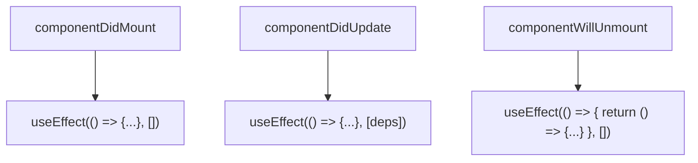

# Лекція 10. React Hooks та управління станом

## Вступ до React Hooks

### Історія та мотивація створення Hooks

До появи React Hooks у лютому 2019 року (React 16.8) розробники стикалися з фундаментальними проблемами при роботі з React. Функціональні компоненти були обмежені — вони не могли мати стан або використовувати lifecycle методи. Це змушувало розробників конвертувати прості функціональні компоненти в класові щоразу, коли потрібен був стан, що призводило до значного збільшення boilerplate коду.

Класові компоненти мали власні проблеми: плутанина з this, необхідність біндити методи, складність повторного використання логіки через Higher-Order Components та Render Props паттерни. Lifecycle методи часто містили непов'язану логіку, що ускладнювало розуміння та тестування коду.

React команда визначила три основні проблеми, які мали бути вирішені:

**Складність повторного використання stateful логіки**: HOCs та Render Props створювали "wrapper hell" та ускладнювали розуміння структури компонентів.

**Великі компоненти стають важкими для розуміння**: lifecycle методи змішують непов'язану логіку, роблячи компоненти важкими для підтримки та тестування.

**Класи заплутують людей та машини**: необхідність розуміти this, біндити методи, проблеми з оптимізацією коду компіляторами.

Hooks радикально вирішили ці проблеми, надавши функціональним компонентам доступ до стану та lifecycle, дозволивши виносити та переносити логіку через кастомні хуки, та усунувши необхідність в класах.

### Правила використання Hooks

React Hooks підкоряються двом фундаментальним правилам, які забезпечують їх коректну роботу:

**Викликайте хуки тільки на верхньому рівні**: не викликайте хуки всередині циклів, умов або вкладених функцій. React покладається на порядок виклику хуків для коректного зберігання стану між рендерами.

```javascript
// НЕПРАВИЛЬНО: хук всередині умови
function UserProfile({ userId }) {
    if (userId) {
        const [user, setUser] = useState(null); // Порушення правила!
    }
}

// ПРАВИЛЬНО: хук на верхньому рівні
function UserProfile({ userId }) {
    const [user, setUser] = useState(null);

    if (!userId) {
        return <div>Користувач не вибраний</div>;
    }
}
```

**Викликайте хуки тільки з React функцій**: використовуйте хуки тільки у функціональних компонентах або кастомних хуках. Не викликайте хуки зі звичайних JavaScript функцій.

```javascript
// НЕПРАВИЛЬНО: хук у звичайній функції
function calculatePrice() {
    const [discount, setDiscount] = useState(0); // Порушення!
    return price * (1 - discount);
}

// ПРАВИЛЬНО: хук у компоненті або кастомному хуку
function useDiscount() {
    const [discount, setDiscount] = useState(0);
    return [discount, setDiscount];
}
```

Для автоматичної перевірки цих правил використовується ESLint плагін eslint-plugin-react-hooks, який інтегрується в більшість сучасних React проєктів.

## useState: управління локальним станом

### Базове використання useState

useState є найпростішим та найбільш використовуваним хуком у React. Він дозволяє додавати стан до функціональних компонентів.

```javascript
import { useState } from 'react';

function Counter() {
    // useState повертає масив з двох елементів:
    // 1. Поточне значення стану
    // 2. Функцію для оновлення стану
    const [count, setCount] = useState(0);

    const increment = () => setCount(count + 1);
    const decrement = () => setCount(count - 1);
    const reset = () => setCount(0);

    return (
        <div className="counter">
            <h2>Лічильник: {count}</h2>
            <button onClick={increment}>+</button>
            <button onClick={decrement}>-</button>
            <button onClick={reset}>Скинути</button>
        </div>
    );
}
```

useState приймає початкове значення стану як аргумент. Це значення використовується тільки під час першого рендеру. Функція оновлення стану може приймати нове значення або функцію, яка отримує попереднє значення.

### Різні типи даних у useState

useState працює з будь-якими типами даних JavaScript: примітивами, об'єктами, масивами, функціями.

```javascript
function UserForm() {
    // Примітивні типи
    const [name, setName] = useState('');
    const [age, setAge] = useState(0);
    const [isActive, setIsActive] = useState(false);

    // Об'єкти
    const [user, setUser] = useState({
        name: '',
        email: '',
        role: 'user'
    });

    // Масиви
    const [skills, setSkills] = useState(['JavaScript', 'React']);

    // Складні структури
    const [formData, setFormData] = useState({
        personal: { name: '', age: 0 },
        contacts: { email: '', phone: '' },
        preferences: { theme: 'light', language: 'uk' }
    });

    return (
        <form>
            {/* форма */}
        </form>
    );
}
```

### Оновлення стану: пряме значення vs функція

React надає два способи оновлення стану: передача нового значення або функції оновлення.

```javascript
function TodoList() {
    const [todos, setTodos] = useState([]);

    // Пряме оновлення значенням
    const addTodoSimple = (text) => {
        const newTodo = { id: Date.now(), text, completed: false };
        setTodos([...todos, newTodo]); // Використовує поточне значення todos
    };

    // Функціональне оновлення
    const addTodoFunctional = (text) => {
        const newTodo = { id: Date.now(), text, completed: false };
        setTodos(prevTodos => [...prevTodos, newTodo]); // Отримує найсвіжіше значення
    };

    // Множинні оновлення демонструють різницю
    const addMultipleTodos = () => {
        // ПРОБЛЕМА: тільки одне todo буде додано
        setTodos([...todos, { id: 1, text: 'Todo 1' }]);
        setTodos([...todos, { id: 2, text: 'Todo 2' }]);
        setTodos([...todos, { id: 3, text: 'Todo 3' }]);
        // Всі три виклики використовують те саме значення todos

        // ПРАВИЛЬНО: всі три todos будуть додані
        setTodos(prev => [...prev, { id: 1, text: 'Todo 1' }]);
        setTodos(prev => [...prev, { id: 2, text: 'Todo 2' }]);
        setTodos(prev => [...prev, { id: 3, text: 'Todo 3' }]);
        // Кожен виклик отримує останнє значення
    };

    return (
        <div>
            {/* список todos */}
        </div>
    );
}
```

Функціональне оновлення гарантує, що ви завжди працюєте з найсвіжішим значенням стану, що критично важливо при множинних оновленнях та асинхронних операціях.

### Оновлення складних об'єктів

При роботі з об'єктами та масивами важливо пам'ятати про immutability — React порівнює стан за посиланням, тому потрібно створювати нові об'єкти замість модифікації існуючих.

```javascript
function UserProfile() {
    const [profile, setProfile] = useState({
        personal: {
            name: 'Олена',
            age: 25
        },
        settings: {
            theme: 'light',
            notifications: true
        }
    });

    // НЕПРАВИЛЬНО: модифікація існуючого об'єкта
    const updateNameWrong = (newName) => {
        profile.personal.name = newName; // Мутація!
        setProfile(profile); // React не виявить зміну
    };

    // ПРАВИЛЬНО: створення нового об'єкта
    const updateName = (newName) => {
        setProfile(prev => ({
            ...prev,
            personal: {
                ...prev.personal,
                name: newName
            }
        }));
    };

    // Оновлення вкладених властивостей
    const updateTheme = (theme) => {
        setProfile(prev => ({
            ...prev,
            settings: {
                ...prev.settings,
                theme
            }
        }));
    };

    // Робота з масивами всередині об'єктів
    const [data, setData] = useState({
        users: [],
        selectedIds: []
    });

    const addUser = (user) => {
        setData(prev => ({
            ...prev,
            users: [...prev.users, user]
        }));
    };

    const removeUser = (userId) => {
        setData(prev => ({
            ...prev,
            users: prev.users.filter(u => u.id !== userId),
            selectedIds: prev.selectedIds.filter(id => id !== userId)
        }));
    };

    return (
        <div>
            {/* профіль */}
        </div>
    );
}
```

### Ледаче ініціалізування стану

Якщо початкове значення стану вимагає складних обчислень, можна передати функцію замість значення. Ця функція викличеться тільки під час першого рендеру.

```javascript
function ExpensiveComponent({ initialData }) {
    // НЕЕФЕКТИВНО: обчислення виконується при кожному рендері
    const [data, setData] = useState(
        processLargeDataset(initialData) // Викликається щоразу
    );

    // ЕФЕКТИВНО: обчислення виконується тільки один раз
    const [data, setData] = useState(() => {
        console.log('Обчислення початкового стану');
        return processLargeDataset(initialData);
    });

    // Приклад з localStorage
    const [preferences, setPreferences] = useState(() => {
        const saved = localStorage.getItem('userPreferences');
        return saved ? JSON.parse(saved) : defaultPreferences;
    });

    return (
        <div>
            {/* контент */}
        </div>
    );
}
```

## useEffect: side effects та lifecycle

### Концепція side effects у React

Side effects — це будь-які операції, які впливають на щось поза компонентом: API запити, підписки на події, маніпуляції з DOM, логування, таймери. useEffect дозволяє виконувати такі операції після рендерингу компонента.

```javascript
import { useState, useEffect } from 'react';

function UserData({ userId }) {
    const [user, setUser] = useState(null);
    const [loading, setLoading] = useState(true);

    useEffect(() => {
        // Цей код виконається після рендеру
        async function fetchUser() {
            setLoading(true);
            try {
                const response = await fetch(`/api/users/${userId}`);
                const data = await response.json();
                setUser(data);
            } catch (error) {
                console.error('Помилка завантаження:', error);
            } finally {
                setLoading(false);
            }
        }

        fetchUser();
    }, [userId]); // Effect перезапускається при зміні userId

    if (loading) return <div>Завантаження...</div>;
    if (!user) return <div>Користувач не знайдений</div>;

    return (
        <div>
            <h2>{user.name}</h2>
            <p>{user.email}</p>
        </div>
    );
}
```

### Масив залежностей

Другий аргумент useEffect — це масив залежностей, який контролює коли effect повинен перезапускатися.

```javascript
function ComponentWithEffects() {
    const [count, setCount] = useState(0);
    const [name, setName] = useState('');

    // Виконується після КОЖНОГО рендеру
    useEffect(() => {
        console.log('Рендер відбувся');
    }); // Немає масиву залежностей

    // Виконується ОДИН РАЗ після першого рендеру
    useEffect(() => {
        console.log('Компонент змонтовано');
        loadInitialData();
    }, []); // Порожній масив залежностей

    // Виконується при зміні count
    useEffect(() => {
        console.log('Count змінився:', count);
        document.title = `Лічильник: ${count}`;
    }, [count]); // Effect залежить від count

    // Виконується при зміні count АБО name
    useEffect(() => {
        console.log('Count або name змінилися');
        saveToLocalStorage({ count, name });
    }, [count, name]); // Multiple залежності

    return (
        <div>
            {/* контент */}
        </div>
    );
}
```

Правила роботи з залежностями:

**Завжди включайте всі використовувані змінні**: якщо effect використовує props або state, вони повинні бути в масиві залежностей.

**ESLint допоможе**: плагін eslint-plugin-react-hooks автоматично перевіряє правильність залежностей.

**Уникайте об'єктів як залежностей**: об'єкти створюються заново при кожному рендері, що призведе до зайвих запусків effect.

### Очищення (cleanup) в useEffect

Багато side effects потребують очищення: відписка від подій, скасування запитів, очищення таймерів. useEffect може повернути cleanup функцію.

```javascript
function ChatRoom({ roomId }) {
    const [messages, setMessages] = useState([]);

    useEffect(() => {
        // Підключення до чату
        const connection = chatAPI.connect(roomId);

        connection.on('message', (message) => {
            setMessages(prev => [...prev, message]);
        });

        // Cleanup функція викликається:
        // 1. Перед наступним запуском effect
        // 2. Перед unmount компонента
        return () => {
            console.log('Очищення підключення');
            connection.disconnect();
        };
    }, [roomId]);

    return (
        <div>
            {messages.map(msg => (
                <div key={msg.id}>{msg.text}</div>
            ))}
        </div>
    );
}

// Приклад з таймерами
function Timer() {
    const [seconds, setSeconds] = useState(0);

    useEffect(() => {
        const interval = setInterval(() => {
            setSeconds(prev => prev + 1);
        }, 1000);

        // Очищення інтервалу
        return () => {
            clearInterval(interval);
        };
    }, []); // Порожній масив — effect запускається один раз

    return <div>Минуло секунд: {seconds}</div>;
}

// Приклад з event listeners
function WindowSize() {
    const [size, setSize] = useState({ width: 0, height: 0 });

    useEffect(() => {
        const handleResize = () => {
            setSize({
                width: window.innerWidth,
                height: window.innerHeight
            });
        };

        // Встановлюємо початковий розмір
        handleResize();

        // Підписуємося на зміни
        window.addEventListener('resize', handleResize);

        // Відписуємося при unmount
        return () => {
            window.removeEventListener('resize', handleResize);
        };
    }, []);

    return (
        <div>
            Розмір вікна: {size.width} x {size.height}
        </div>
    );
}
```

### Lifecycle методи через useEffect

useEffect може емулювати всі lifecycle методи класових компонентів.



```javascript
function LifecycleDemo({ userId }) {
    const [data, setData] = useState(null);

    // componentDidMount
    useEffect(() => {
        console.log('Компонент змонтовано');
        initializeApp();
    }, []);

    // componentDidUpdate (тільки для userId)
    useEffect(() => {
        console.log('userId оновлено:', userId);
        loadUserData(userId);
    }, [userId]);

    // componentWillUnmount
    useEffect(() => {
        return () => {
            console.log('Компонент буде розмонтовано');
            cleanup();
        };
    }, []);

    // Комбінація: mount + update + unmount
    useEffect(() => {
        console.log('Mount або userId змінився');
        const subscription = subscribeToUser(userId);

        return () => {
            console.log('Cleanup перед наступним effect або unmount');
            subscription.unsubscribe();
        };
    }, [userId]);

    return <div>{/* контент */}</div>;
}
```

## useContext: глобальний стан

### Проблема prop drilling

Prop drilling — це передача props через багато рівнів компонентів, навіть якщо проміжні компоненти не використовують ці props.

```javascript
// Проблема: props передаються через багато рівнів
function App() {
    const [user, setUser] = useState(null);
    const [theme, setTheme] = useState('light');

    return (
        <Layout user={user} theme={theme}>
            <Dashboard user={user} theme={theme}>
                <UserProfile user={user} theme={theme} />
            </Dashboard>
        </Layout>
    );
}

function Layout({ children, user, theme }) {
    // Layout не використовує user та theme, але змушений їх передавати
    return (
        <div className={`layout theme-${theme}`}>
            <Header user={user} theme={theme} />
            {children}
        </div>
    );
}

function Header({ user, theme }) {
    // Header теж передає далі
    return (
        <header>
            <UserMenu user={user} theme={theme} />
        </header>
    );
}
```

### Створення та використання Context

Context API вирішує проблему prop drilling, дозволяючи передавати дані напряму до будь-якого компонента в дереві.

```javascript
import { createContext, useContext, useState } from 'react';

// Створення контексту
const UserContext = createContext(null);
const ThemeContext = createContext('light');

// Provider компонент
function App() {
    const [user, setUser] = useState(null);
    const [theme, setTheme] = useState('light');

    return (
        <UserContext.Provider value={{ user, setUser }}>
            <ThemeContext.Provider value={{ theme, setTheme }}>
                <Layout>
                    <Dashboard>
                        <UserProfile />
                    </Dashboard>
                </Layout>
            </ThemeContext.Provider>
        </UserContext.Provider>
    );
}

// Споживання контексту через useContext
function UserProfile() {
    const { user } = useContext(UserContext);
    const { theme } = useContext(ThemeContext);

    // Прямий доступ до даних без prop drilling
    return (
        <div className={`profile theme-${theme}`}>
            <h2>{user?.name}</h2>
        </div>
    );
}
```

### Оптимізація Context

Context може призвести до зайвих рендерів, якщо не оптимізувати його використання.

```javascript
// Проблема: всі споживачі перерендерюються при будь-якій зміні
function AppWithProblem() {
    const [user, setUser] = useState(null);
    const [settings, setSettings] = useState({});

    // Об'єкт створюється заново при кожному рендері!
    const value = { user, setUser, settings, setSettings };

    return (
        <AppContext.Provider value={value}>
            {/* всі споживачі перерендеряться */}
        </AppContext.Provider>
    );
}

// Рішення 1: useMemo для стабільного значення
function AppOptimized() {
    const [user, setUser] = useState(null);
    const [settings, setSettings] = useState({});

    const value = useMemo(
        () => ({ user, setUser, settings, setSettings }),
        [user, settings]
    );

    return (
        <AppContext.Provider value={value}>
            {/* споживачі перерендеряться тільки при зміні user або settings */}
        </AppContext.Provider>
    );
}

// Рішення 2: розділення на окремі контексти
const UserContext = createContext(null);
const SettingsContext = createContext(null);

function AppSeparated() {
    const [user, setUser] = useState(null);
    const [settings, setSettings] = useState({});

    return (
        <UserContext.Provider value={{ user, setUser }}>
            <SettingsContext.Provider value={{ settings, setSettings }}>
                {/* тепер компоненти можуть підписатися тільки на потрібний контекст */}
            </SettingsContext.Provider>
        </UserContext.Provider>
    );
}
```

### Створення власних Context Providers

Для зручності можна створювати кастомні провайдери з вбудованою логікою.

```javascript
// Створення кастомного провайдера
const AuthContext = createContext(null);

export function AuthProvider({ children }) {
    const [user, setUser] = useState(null);
    const [loading, setLoading] = useState(true);

    useEffect(() => {
        // Перевірка авторизації при mount
        checkAuth()
            .then(setUser)
            .finally(() => setLoading(false));
    }, []);

    const login = async (credentials) => {
        const user = await authAPI.login(credentials);
        setUser(user);
        localStorage.setItem('token', user.token);
    };

    const logout = () => {
        setUser(null);
        localStorage.removeItem('token');
    };

    const value = useMemo(
        () => ({ user, login, logout, loading }),
        [user, loading]
    );

    return (
        <AuthContext.Provider value={value}>
            {children}
        </AuthContext.Provider>
    );
}

// Кастомний хук для зручності
export function useAuth() {
    const context = useContext(AuthContext);
    if (!context) {
        throw new Error('useAuth must be used within AuthProvider');
    }
    return context;
}

// Використання
function App() {
    return (
        <AuthProvider>
            <Router>
                <Routes>
                    <Route path="/login" element={<LoginPage />} />
                    <Route path="/dashboard" element={<Dashboard />} />
                </Routes>
            </Router>
        </AuthProvider>
    );
}

function Dashboard() {
    const { user, logout } = useAuth(); // Просте використання

    return (
        <div>
            <h1>Привіт, {user.name}</h1>
            <button onClick={logout}>Вийти</button>
        </div>
    );
}
```

## Кастомні хуки

### Концепція та переваги кастомних хуків

Кастомні хуки дозволяють виносити та повторно використовувати stateful логіку між компонентами. Це функції, які використовують вбудовані хуки та можуть викликати інші кастомні хуки.

```javascript
// Кастомний хук для API запитів
function useFetch(url) {
    const [data, setData] = useState(null);
    const [loading, setLoading] = useState(true);
    const [error, setError] = useState(null);

    useEffect(() => {
        let cancelled = false;

        async function fetchData() {
            try {
                setLoading(true);
                const response = await fetch(url);
                const json = await response.json();

                if (!cancelled) {
                    setData(json);
                    setError(null);
                }
            } catch (err) {
                if (!cancelled) {
                    setError(err.message);
                }
            } finally {
                if (!cancelled) {
                    setLoading(false);
                }
            }
        }

        fetchData();

        return () => {
            cancelled = true;
        };
    }, [url]);

    return { data, loading, error };
}

// Використання кастомного хука
function UserList() {
    const { data: users, loading, error } = useFetch('/api/users');

    if (loading) return <div>Завантаження...</div>;
    if (error) return <div>Помилка: {error}</div>;

    return (
        <ul>
            {users.map(user => (
                <li key={user.id}>{user.name}</li>
            ))}
        </ul>
    );
}
```

### Популярні паттерни кастомних хуків

```javascript
// Хук для роботи з localStorage
function useLocalStorage(key, initialValue) {
    const [value, setValue] = useState(() => {
        const saved = localStorage.getItem(key);
        return saved ? JSON.parse(saved) : initialValue;
    });

    useEffect(() => {
        localStorage.setItem(key, JSON.stringify(value));
    }, [key, value]);

    return [value, setValue];
}

// Використання
function Settings() {
    const [theme, setTheme] = useLocalStorage('theme', 'light');
    const [language, setLanguage] = useLocalStorage('language', 'uk');

    return (
        <div>
            <select value={theme} onChange={e => setTheme(e.target.value)}>
                <option value="light">Світла</option>
                <option value="dark">Темна</option>
            </select>
        </div>
    );
}

// Хук для debounce
function useDebounce(value, delay) {
    const [debouncedValue, setDebouncedValue] = useState(value);

    useEffect(() => {
        const timer = setTimeout(() => {
            setDebouncedValue(value);
        }, delay);

        return () => {
            clearTimeout(timer);
        };
    }, [value, delay]);

    return debouncedValue;
}

// Використання для пошуку
function SearchComponent() {
    const [searchTerm, setSearchTerm] = useState('');
    const debouncedSearch = useDebounce(searchTerm, 500);
    const { data: results } = useFetch(`/api/search?q=${debouncedSearch}`);

    return (
        <div>
            <input
                value={searchTerm}
                onChange={e => setSearchTerm(e.target.value)}
                placeholder="Пошук..."
            />
            {results && <SearchResults results={results} />}
        </div>
    );
}

// Хук для медіа-запитів
function useMediaQuery(query) {
    const [matches, setMatches] = useState(false);

    useEffect(() => {
        const media = window.matchMedia(query);
        setMatches(media.matches);

        const listener = (e) => setMatches(e.matches);
        media.addEventListener('change', listener);

        return () => media.removeEventListener('change', listener);
    }, [query]);

    return matches;
}

// Використання
function ResponsiveComponent() {
    const isMobile = useMediaQuery('(max-width: 768px)');
    const isDesktop = useMediaQuery('(min-width: 1024px)');

    return (
        <div>
            {isMobile && <MobileView />}
            {isDesktop && <DesktopView />}
        </div>
    );
}
```

## useReducer для складного стану

### Коли використовувати useReducer

useReducer є альтернативою useState для управління складним станом, особливо коли:

- Стан має складну структуру з багатьма підполями;
- Наступний стан залежить від попереднього;
- Є багато способів оновлення стану;
- Логіка оновлення складна та хочеться її тестувати окремо.

```javascript
import { useReducer } from 'react';

// Визначення reducer функції
function cartReducer(state, action) {
    switch (action.type) {
        case 'ADD_ITEM':
            return {
                ...state,
                items: [...state.items, action.payload],
                total: state.total + action.payload.price
            };

        case 'REMOVE_ITEM':
            const item = state.items.find(i => i.id === action.payload);
            return {
                ...state,
                items: state.items.filter(i => i.id !== action.payload),
                total: state.total - (item?.price || 0)
            };

        case 'UPDATE_QUANTITY':
            return {
                ...state,
                items: state.items.map(item =>
                    item.id === action.payload.id
                        ? { ...item, quantity: action.payload.quantity }
                        : item
                )
            };

        case 'CLEAR_CART':
            return { items: [], total: 0 };

        default:
            return state;
    }
}

// Використання useReducer
function ShoppingCart() {
    const [cart, dispatch] = useReducer(cartReducer, {
        items: [],
        total: 0
    });

    const addToCart = (product) => {
        dispatch({
            type: 'ADD_ITEM',
            payload: product
        });
    };

    const removeFromCart = (productId) => {
        dispatch({
            type: 'REMOVE_ITEM',
            payload: productId
        });
    };

    const clearCart = () => {
        dispatch({ type: 'CLEAR_CART' });
    };

    return (
        <div>
            <h2>Кошик ({cart.items.length})</h2>
            <div>Всього: {cart.total} грн</div>
            {cart.items.map(item => (
                <div key={item.id}>
                    {item.name} - {item.price} грн
                    <button onClick={() => removeFromCart(item.id)}>
                        Видалити
                    </button>
                </div>
            ))}
            <button onClick={clearCart}>Очистити кошик</button>
        </div>
    );
}
```

### Складні сценарії з useReducer

```javascript
// Reducer для форми з валідацією
function formReducer(state, action) {
    switch (action.type) {
        case 'SET_FIELD':
            return {
                ...state,
                values: {
                    ...state.values,
                    [action.field]: action.value
                },
                touched: {
                    ...state.touched,
                    [action.field]: true
                }
            };

        case 'SET_ERRORS':
            return {
                ...state,
                errors: action.errors
            };

        case 'SUBMIT_START':
            return {
                ...state,
                isSubmitting: true,
                submitError: null
            };

        case 'SUBMIT_SUCCESS':
            return {
                ...state,
                isSubmitting: false,
                submitSuccess: true
            };

        case 'SUBMIT_FAILURE':
            return {
                ...state,
                isSubmitting: false,
                submitError: action.error
            };

        case 'RESET_FORM':
            return {
                values: {},
                errors: {},
                touched: {},
                isSubmitting: false,
                submitSuccess: false,
                submitError: null
            };

        default:
            return state;
    }
}

function ComplexForm() {
    const [state, dispatch] = useReducer(formReducer, {
        values: {},
        errors: {},
        touched: {},
        isSubmitting: false,
        submitSuccess: false,
        submitError: null
    });

    const handleChange = (field, value) => {
        dispatch({ type: 'SET_FIELD', field, value });
    };

    const handleSubmit = async (e) => {
        e.preventDefault();

        dispatch({ type: 'SUBMIT_START' });

        try {
            await submitForm(state.values);
            dispatch({ type: 'SUBMIT_SUCCESS' });
        } catch (error) {
            dispatch({ type: 'SUBMIT_FAILURE', error: error.message });
        }
    };

    return (
        <form onSubmit={handleSubmit}>
            {/* поля форми */}
            <button type="submit" disabled={state.isSubmitting}>
                {state.isSubmitting ? 'Відправка...' : 'Відправити'}
            </button>
        </form>
    );
}
```

## Performance оптимізації

### useMemo: мемоїзація обчислень

useMemo дозволяє кешувати результат обчислень між рендерами, перераховуючи їх тільки при зміні залежностей.

```javascript
import { useMemo } from 'react';

function ProductList({ products, filters }) {
    // Без useMemo: фільтрація виконується при КОЖНОМУ рендері
    const filteredProducts = products.filter(p =>
        p.category === filters.category && p.price <= filters.maxPrice
    );

    // З useMemo: фільтрація тільки при зміні products або filters
    const filteredProducts = useMemo(() => {
        console.log('Виконується фільтрація');
        return products
            .filter(p => p.category === filters.category)
            .filter(p => p.price <= filters.maxPrice)
            .sort((a, b) => b.price - a.price);
    }, [products, filters]);

    // Складні обчислення
    const statistics = useMemo(() => {
        return {
            total: filteredProducts.length,
            avgPrice: filteredProducts.reduce((sum, p) => sum + p.price, 0) /
                      filteredProducts.length,
            maxPrice: Math.max(...filteredProducts.map(p => p.price)),
            minPrice: Math.min(...filteredProducts.map(p => p.price))
        };
    }, [filteredProducts]);

    return (
        <div>
            <div>Знайдено товарів: {statistics.total}</div>
            <div>Середня ціна: {statistics.avgPrice} грн</div>
            {filteredProducts.map(product => (
                <ProductCard key={product.id} product={product} />
            ))}
        </div>
    );
}
```

### useCallback: мемоїзація функцій

useCallback повертає мемоїзовану версію callback функції, яка змінюється тільки при зміні залежностей.

```javascript
import { useCallback, memo } from 'react';

// Мемоїзований дочірній компонент
const ProductCard = memo(function ProductCard({ product, onAddToCart }) {
    console.log('Рендер ProductCard', product.id);

    return (
        <div className="product-card">
            <h3>{product.name}</h3>
            <p>{product.price} грн</p>
            <button onClick={() => onAddToCart(product)}>
                Додати до кошика
            </button>
        </div>
    );
});

function ProductList({ products }) {
    const [cart, setCart] = useState([]);

    // Без useCallback: нова функція при кожному рендері
    // Це призведе до перерендеру ВСІХ ProductCard
    const handleAddToCart = (product) => {
        setCart(prev => [...prev, product]);
    };

    // З useCallback: функція створюється один раз
    const handleAddToCartMemo = useCallback((product) => {
        setCart(prev => [...prev, product]);
    }, []); // Порожній масив — функція ніколи не змінюється

    // useCallback з залежностями
    const [discount, setDiscount] = useState(0);

    const addWithDiscount = useCallback((product) => {
        const finalPrice = product.price * (1 - discount);
        setCart(prev => [...prev, { ...product, finalPrice }]);
    }, [discount]); // Перестворюється при зміні discount

    return (
        <div>
            {products.map(product => (
                <ProductCard
                    key={product.id}
                    product={product}
                    onAddToCart={handleAddToCartMemo}
                />
            ))}
        </div>
    );
}
```

### React.memo: мемоїзація компонентів

React.memo є Higher-Order Component, який запобігає перерендеру компонента, якщо його props не змінилися.

```javascript
import { memo } from 'react';

// Без memo: компонент рендериться при КОЖНОМУ рендері батька
function ExpensiveComponent({ value, onUpdate }) {
    console.log('Рендер ExpensiveComponent');
    // Складні обчислення...
    return <div>{value}</div>;
}

// З memo: рендериться тільки при зміні props
const MemoizedComponent = memo(function ExpensiveComponent({ value, onUpdate }) {
    console.log('Рендер MemoizedComponent');
    return <div>{value}</div>;
});

// Кастомна функція порівняння
const CustomMemoComponent = memo(
    function Component({ user, settings }) {
        return <div>{user.name}</div>;
    },
    (prevProps, nextProps) => {
        // Повернути true якщо props однакові (skip рендер)
        // Повернути false якщо props різні (виконати рендер)
        return prevProps.user.id === nextProps.user.id &&
               prevProps.settings.theme === nextProps.settings.theme;
    }
);

// Приклад оптимізації списку
const ListItem = memo(function ListItem({ item, onDelete }) {
    return (
        <div className="list-item">
            <span>{item.name}</span>
            <button onClick={() => onDelete(item.id)}>Видалити</button>
        </div>
    );
});

function OptimizedList({ items }) {
    const [list, setList] = useState(items);

    const handleDelete = useCallback((id) => {
        setList(prev => prev.filter(item => item.id !== id));
    }, []);

    return (
        <div>
            {list.map(item => (
                <ListItem
                    key={item.id}
                    item={item}
                    onDelete={handleDelete}
                />
            ))}
        </div>
    );
}
```

### Коли НЕ потрібна оптимізація

Не всі компоненти потребують оптимізації. Передчасна оптимізація може навіть погіршити продуктивність та читабельність коду.

```javascript
// НЕ ПОТРІБНО оптимізувати:
// 1. Прості компоненти
function SimpleButton({ text, onClick }) {
    // Рендер дуже швидкий, memo не потрібен
    return <button onClick={onClick}>{text}</button>;
}

// 2. Компоненти, які завжди змінюються
function Clock() {
    const [time, setTime] = useState(new Date());

    useEffect(() => {
        const timer = setInterval(() => setTime(new Date()), 1000);
        return () => clearInterval(timer);
    }, []);

    // Компонент оновлюється щосекунди, memo не допоможе
    return <div>{time.toLocaleTimeString()}</div>;
}

// 3. Дрібні обчислення
function UserAge({ birthYear }) {
    // Обчислення дуже просте, useMemo додасть overhead
    const age = new Date().getFullYear() - birthYear;
    return <span>Вік: {age}</span>;
}

// ПОТРІБНО оптимізувати:
// 1. Важкі обчислення
function DataAnalytics({ data }) {
    const analytics = useMemo(() => {
        // Складні обчислення над великим масивом
        return processLargeDataset(data);
    }, [data]);

    return <div>{/* відображення analytics */}</div>;
}

// 2. Великі списки
const TableRow = memo(function TableRow({ item }) {
    return <tr>{/* 20+ колонок */}</tr>;
});

function DataTable({ rows }) {
    // Тисячі рядків, memo критично важливий
    return (
        <table>
            {rows.map(row => <TableRow key={row.id} item={row} />)}
        </table>
    );
}
```

## Висновки та найкращі практики

### Розуміння React Hooks

React Hooks змінили парадигму React розробки, зробивши функціональні компоненти повноцінними будівельними блоками додатків. useState та useEffect покривають більшість потреб у управлінні станом та side effects, тоді як useContext вирішує проблему prop drilling для глобального стану.

Ключ до ефективного використання хуків — це розуміння їх правил та обмежень. Викликайте хуки тільки на верхньому рівні компонентів, завжди вказуйте правильні залежності в масивах, використовуйте ESLint для автоматичної перевірки.

useReducer надає більш структурований підхід до управління складним станом з багатьма способами оновлення. Він особливо корисний для форм, кошиків, редакторів та інших компонентів зі складною логікою стану.

### Кастомні хуки як абстракція

Кастомні хуки є потужним інструментом для виносу та повторного використання логіки. Вони дозволяють інкапсулювати складну логіку в переносну функцію, яку можна легко тестувати та використовувати в різних компонентах.

Найменування кастомних хуків повинно починатися з use, щоб ESLint міг правильно їх валідувати. Добре спроектований кастомний хук має чітке API, зрозуміле призначення та повну документацію використання.

### Оптимізація продуктивності

Оптимізація не завжди потрібна — React вже досить швидкий для більшості застосунків. Використовуйте useMemo, useCallback та React.memo тільки після виявлення реальних проблем з продуктивністю через React DevTools Profiler.

Основні правила оптимізації: оптимізуйте важкі обчислення через useMemo, стабілізуйте функції через useCallback для мемоїзованих дочірніх компонентів, використовуйте React.memo для великих списків або складних компонентів.

Пам'ятайте, що передчасна оптимізація може зробити код складнішим без реальної користі. Спочатку пишіть зрозумілий код, потім оптимізуйте вузькі місця на основі вимірювань.

### Найкращі практики

1. **Слідкуйте за правилами хуків** — використовуйте ESLint плагін для автоматичної перевірки;
2. **Розділяйте логіку на кастомні хуки** — виносьте повторювану логіку в переносні функції;
3. **Правильно визначайте залежності** — завжди включайте всі використовувані змінні в масиви залежностей;
4. **Очищайте side effects** — завжди повертайте cleanup функції з useEffect де потрібно;
5. **Оптимізуйте Context** — використовуйте useMemo для value та розділяйте контексти за відповідальністю;
6. **Профілюйте перед оптимізацією** — використовуйте React DevTools для виявлення реальних проблем;
7. **Документуйте складні хуки** — додавайте коментарі та приклади використання;
8. **Тестуйте кастомні хуки** — пишіть тести для виділеної логіки окремо від компонентів.

Розуміння цих концепцій та дотримання найкращих практик дозволяє створювати ефективні, підтримувані та масштабовані React додатки з чистою архітектурою та зрозумілою логікою управління станом.
