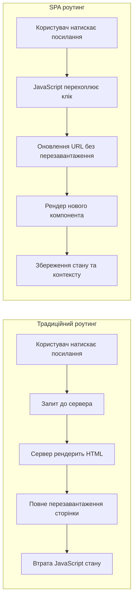

# Лекція 11. Роутинг та навігація (React Router)

## Вступ до клієнтського роутингу

### Традиційний серверний роутинг vs SPA роутинг

У традиційних вебзастосунках кожен перехід між сторінками вимагає нового HTTP запиту до сервера. Сервер повертає нову HTML сторінку, браузер перезавантажує всю сторінку, втрачаючи JavaScript стан та викликаючи мерехтіння інтерфейсу. Цей підхід простий у реалізації, але створює повільний та фрагментований досвід користування.

Single Page Applications (SPA) працюють інакше. Сервер повертає одну HTML сторінку при першому завантаженні, а всі наступні переходи обробляються JavaScript на клієнті. Контент динамічно оновлюється без перезавантаження сторінки, що створює плавний та швидкий досвід, схожий на нативні застосунки.



Клієнтський роутинг надає переваги:

**Швидкість**: немає затримок на мережеві запити при переходах між сторінками.

**Плавність**: анімації та переходи можливі між сторінками, UI оновлюється без мерехтіння.

**Збереження стану**: глобальний стан, кеші, форми зберігаються при навігації.

**Кращий UX**: інтерфейс відповідає миттєво, створюючи досвід нативного застосунку.

Проте клієнтський роутинг додає складності: потрібна підтримка browser history API, обробка 404 сторінок, правильна SEO оптимізація, серверна конфігурація для SPA.

### Історія React Router

React Router був створений в 2014 році Райаном Флоренсом та Майклом Джексоном як рішення для декларативного роутингу в React застосунках. За десятиліття бібліотека пройшла значну еволюцію через шість major версій.

Ключові етапи розвитку:

- **React Router v1-3 (2014-2016)**: статична конфігурація маршрутів, імперативне API;
- **React Router v4 (2017)**: революційне переосмислення — динамічні маршрути, роутинг як компоненти;
- **React Router v5 (2019)**: покращення hooks API, кращі TypeScript типи;
- **React Router v6 (2021-теперішній час)**: нове компактне API, вбудована підтримка вкладених маршрутів, відносні шляхи.

React Router v6 приніс найзначніші зміни, спростивши API та зробивши його більш інтуїтивним. Сучасна версія повністю використовує React hooks, надає кращу TypeScript підтримку та оптимізована для продуктивності.

### Концепції клієнтського роутингу

Клієнтський роутинг базується на декількох ключових концепціях:

**URL як стан застосунку**: URL відображає поточний стан інтерфейсу. Зміна URL призводить до зміни відображеного контенту без перезавантаження сторінки.

**History API**: браузерний API для маніпуляції з історією навігації. React Router використовує методи pushState та replaceState для оновлення URL без перезавантаження сторінки.

**Декларативний роутинг**: маршрути визначаються через React компоненти, що робить конфігурацію зрозумілою та композиційною.

**Вкладені маршрути**: підтримка ієрархічної структури маршрутів, де дочірні маршрути рендеряться всередині батьківських.

## React Router v6 основи

### Встановлення та базове налаштування

React Router встановлюється через npm або yarn як окремий пакет.

```bash
# Встановлення React Router
npm install react-router-dom

# Або через yarn
yarn add react-router-dom
```

Базова структура застосунку з роутингом:

```javascript
import { BrowserRouter, Routes, Route } from 'react-router-dom';

function App() {
    return (
        <BrowserRouter>
            <Routes>
                <Route path="/" element={<Home />} />
                <Route path="/about" element={<About />} />
                <Route path="/contact" element={<Contact />} />
            </Routes>
        </BrowserRouter>
    );
}

// Компоненти сторінок
function Home() {
    return <h1>Головна сторінка</h1>;
}

function About() {
    return <h1>Про нас</h1>;
}

function Contact() {
    return <h1>Контакти</h1>;
}
```

### BrowserRouter vs HashRouter

React Router надає різні типи роутерів для різних сценаріїв використання.

**BrowserRouter** використовує звичайні URL шляхи та History API браузера. Це стандартний вибір для більшості веб застосунків.

```javascript
import { BrowserRouter } from 'react-router-dom';

function App() {
    return (
        <BrowserRouter>
            {/* URL виглядають як https://example.com/about */}
            <Routes>
                <Route path="/about" element={<About />} />
            </Routes>
        </BrowserRouter>
    );
}
```

BrowserRouter вимагає серверної конфігурації для правильної обробки SPA маршрутів. Сервер повинен повертати index.html для всіх запитів, щоб React Router міг обробити роутинг на клієнті.

**HashRouter** використовує хеш частину URL для роутингу, що не вимагає серверної конфігурації.

```javascript
import { HashRouter } from 'react-router-dom';

function App() {
    return (
        <HashRouter>
            {/* URL виглядають як https://example.com/#/about */}
            <Routes>
                <Route path="/about" element={<About />} />
            </Routes>
        </HashRouter>
    );
}
```

HashRouter корисний для статичних хостингів без можливості налаштування серверних redirects, але має недоліки: гірша SEO, менш естетичні URL, проблеми з деякими аналітичними інструментами.

### Routes та Route компоненти

Routes є контейнером для всіх маршрутів застосунку. Він відповідає за вибір найкращого відповідного маршруту на основі поточного URL.

```javascript
import { Routes, Route } from 'react-router-dom';

function App() {
    return (
        <Routes>
            {/* Точна відповідність шляху */}
            <Route path="/" element={<Home />} />

            {/* Статичні шляхи */}
            <Route path="/about" element={<About />} />
            <Route path="/services" element={<Services />} />

            {/* Динамічні сегменти */}
            <Route path="/users/:userId" element={<UserProfile />} />
            <Route path="/posts/:postId" element={<Post />} />

            {/* Catch-all маршрут для 404 */}
            <Route path="*" element={<NotFound />} />
        </Routes>
    );
}
```

Route компонент визначає окремий маршрут. Він приймає два основні props:

**path**: визначає URL шлях, який повинен відповідати поточному URL.

**element**: React компонент, який рендериться при відповідності шляху.

React Router v6 використовує алгоритм ранжування для вибору найкращого відповідного маршруту, що робить порядок визначення маршрутів менш важливим порівняно з попередніми версіями.

### Link та NavLink для навігації

Link компонент замінює стандартні HTML теги для створення навігації без перезавантаження сторінки.

```javascript
import { Link } from 'react-router-dom';

function Navigation() {
    return (
        <nav>
            <Link to="/">Головна</Link>
            <Link to="/about">Про нас</Link>
            <Link to="/contact">Контакти</Link>

            {/* Передача state через навігацію */}
            <Link
                to="/profile"
                state={{ from: 'navigation' }}
            >
                Профіль
            </Link>

            {/* Відносні шляхи */}
            <Link to="settings">Налаштування</Link>
            <Link to="../parent">Повернутись</Link>
        </nav>
    );
}
```

NavLink є розширенням Link з додатковими можливостями для активних посилань.

```javascript
import { NavLink } from 'react-router-dom';

function Navigation() {
    return (
        <nav className="navigation">
            <NavLink
                to="/"
                className={({ isActive }) =>
                    isActive ? 'nav-link active' : 'nav-link'
                }
            >
                Головна
            </NavLink>

            <NavLink
                to="/about"
                style={({ isActive }) => ({
                    color: isActive ? 'red' : 'black',
                    fontWeight: isActive ? 'bold' : 'normal'
                })}
            >
                Про нас
            </NavLink>

            {/* Функція для складної логіки */}
            <NavLink
                to="/dashboard"
                className={({ isActive, isPending }) =>
                    isPending ? 'pending' : isActive ? 'active' : ''
                }
            >
                Dashboard
            </NavLink>
        </nav>
    );
}
```

NavLink автоматично додає класи або стилі для активного посилання, що робить створення навігаційних меню простішим.

## Динамічні маршрути та параметри

### URL параметри через useParams

URL параметри дозволяють створювати динамічні маршрути, де частина шляху є змінною.

```javascript
import { useParams } from 'react-router-dom';

// Визначення маршруту з параметрами
function App() {
    return (
        <Routes>
            <Route path="/users/:userId" element={<UserProfile />} />
            <Route path="/posts/:postId/comments/:commentId" element={<Comment />} />
        </Routes>
    );
}

// Використання параметрів в компоненті
function UserProfile() {
    const { userId } = useParams();
    const [user, setUser] = useState(null);

    useEffect(() => {
        fetch(`/api/users/${userId}`)
            .then(res => res.json())
            .then(setUser);
    }, [userId]);

    if (!user) return <div>Завантаження...</div>;

    return (
        <div className="user-profile">
            <h1>{user.name}</h1>
            <p>{user.email}</p>
        </div>
    );
}

// Множинні параметри
function Comment() {
    const { postId, commentId } = useParams();

    return (
        <div>
            <h2>Коментар {commentId} до поста {postId}</h2>
        </div>
    );
}
```

URL параметри є завжди рядками. Якщо потрібен числовий тип, необхідна явна конвертація.

```javascript
function Product() {
    const { productId } = useParams();

    // Конвертація в число
    const id = Number(productId);

    // Або з валідацією
    const id = parseInt(productId, 10);
    if (isNaN(id)) {
        return <div>Невалідний ID продукту</div>;
    }

    return <div>Продукт #{id}</div>;
}
```

### Query параметри через useSearchParams

Query параметри передають додаткову інформацію через URL після знаку питання.

```javascript
import { useSearchParams } from 'react-router-dom';

function ProductList() {
    const [searchParams, setSearchParams] = useSearchParams();

    // Читання параметрів
    const category = searchParams.get('category') || 'all';
    const sortBy = searchParams.get('sortBy') || 'name';
    const page = parseInt(searchParams.get('page')) || 1;

    // Оновлення параметрів
    const updateCategory = (newCategory) => {
        setSearchParams(params => {
            params.set('category', newCategory);
            params.set('page', '1'); // Скинути на першу сторінку
            return params;
        });
    };

    const updateSort = (newSort) => {
        setSearchParams({
            category,
            sortBy: newSort,
            page: '1'
        });
    };

    // Видалення параметра
    const clearFilters = () => {
        setSearchParams({});
    };

    return (
        <div>
            {/* URL: /products?category=electronics&sortBy=price&page=2 */}
            <div className="filters">
                <select
                    value={category}
                    onChange={e => updateCategory(e.target.value)}
                >
                    <option value="all">Всі категорії</option>
                    <option value="electronics">Електроніка</option>
                    <option value="books">Книги</option>
                </select>

                <select
                    value={sortBy}
                    onChange={e => updateSort(e.target.value)}
                >
                    <option value="name">За назвою</option>
                    <option value="price">За ціною</option>
                    <option value="date">За датою</option>
                </select>

                <button onClick={clearFilters}>Очистити фільтри</button>
            </div>

            <ProductGrid
                category={category}
                sortBy={sortBy}
                page={page}
            />
        </div>
    );
}
```

Робота з складними query параметрами:

```javascript
function SearchPage() {
    const [searchParams, setSearchParams] = useSearchParams();

    // Множинні значення для одного параметра
    const tags = searchParams.getAll('tag'); // ['react', 'javascript', 'web']

    // Перевірка наявності параметра
    const hasFilter = searchParams.has('filter');

    // Ітерація по всіх параметрах
    const allParams = {};
    for (const [key, value] of searchParams.entries()) {
        allParams[key] = value;
    }

    // Додавання тега
    const addTag = (tag) => {
        const current = searchParams.getAll('tag');
        setSearchParams({
            ...Object.fromEntries(searchParams),
            tag: [...current, tag]
        });
    };

    // Видалення конкретного тега
    const removeTag = (tagToRemove) => {
        const current = searchParams.getAll('tag');
        const updated = current.filter(t => t !== tagToRemove);

        const newParams = new URLSearchParams(searchParams);
        newParams.delete('tag');
        updated.forEach(tag => newParams.append('tag', tag));

        setSearchParams(newParams);
    };

    return (
        <div>
            <div className="tags">
                {tags.map(tag => (
                    <span key={tag} className="tag">
                        {tag}
                        <button onClick={() => removeTag(tag)}>×</button>
                    </span>
                ))}
            </div>
        </div>
    );
}
```

### useLocation для доступу до поточної локації

useLocation надає доступ до об'єкта поточної локації з інформацією про URL та state.

```javascript
import { useLocation } from 'react-router-dom';

function PageComponent() {
    const location = useLocation();

    console.log(location.pathname);  // "/users/123"
    console.log(location.search);    // "?sort=name&page=2"
    console.log(location.hash);      // "#section-3"
    console.log(location.state);     // { from: '/previous-page' }
    console.log(location.key);       // "ac3df4" - унікальний ключ локації

    return (
        <div>
            <h1>Поточний шлях: {location.pathname}</h1>
        </div>
    );
}

// Передача state між сторінками
function ProductList() {
    return (
        <div>
            {products.map(product => (
                <Link
                    key={product.id}
                    to={`/products/${product.id}`}
                    state={{
                        from: '/products',
                        previousFilters: { category: 'electronics' }
                    }}
                >
                    {product.name}
                </Link>
            ))}
        </div>
    );
}

function ProductDetails() {
    const location = useLocation();
    const from = location.state?.from;
    const filters = location.state?.previousFilters;

    return (
        <div>
            <h1>Деталі продукту</h1>
            {from && (
                <Link to={from} state={{ filters }}>
                    ← Назад до списку
                </Link>
            )}
        </div>
    );
}

// Відстеження зміни маршруту
function Analytics() {
    const location = useLocation();

    useEffect(() => {
        // Надсилання аналітичних даних при зміні сторінки
        trackPageView(location.pathname);
    }, [location]);

    return null;
}
```

## Nested routes та layouts

### Концепція вкладених маршрутів

Вкладені маршрути дозволяють створювати ієрархічну структуру, де дочірні маршрути рендеряться всередині батьківських компонентів.

```javascript
import { Routes, Route, Outlet } from 'react-router-dom';

function App() {
    return (
        <Routes>
            {/* Батьківський маршрут з Outlet для дочірніх */}
            <Route path="/" element={<Layout />}>
                <Route index element={<Home />} />
                <Route path="about" element={<About />} />
                <Route path="contact" element={<Contact />} />
            </Route>

            {/* Вкладена структура для dashboard */}
            <Route path="/dashboard" element={<DashboardLayout />}>
                <Route index element={<DashboardHome />} />
                <Route path="profile" element={<Profile />} />
                <Route path="settings" element={<Settings />} />

                {/* Глибша вкладеність */}
                <Route path="products" element={<ProductsLayout />}>
                    <Route index element={<ProductList />} />
                    <Route path=":productId" element={<ProductDetails />} />
                    <Route path="new" element={<NewProduct />} />
                </Route>
            </Route>
        </Routes>
    );
}
```

### Outlet компонент

Outlet є placeholder для рендерингу дочірніх маршрутів всередині батьківського компонента.

```javascript
import { Outlet, Link } from 'react-router-dom';

function Layout() {
    return (
        <div className="layout">
            <header>
                <nav>
                    <Link to="/">Головна</Link>
                    <Link to="/about">Про нас</Link>
                    <Link to="/contact">Контакти</Link>
                </nav>
            </header>

            <main className="content">
                {/* Дочірні маршрути рендеряться тут */}
                <Outlet />
            </main>

            <footer>
                <p>© 2025 My App</p>
            </footer>
        </div>
    );
}

// Передача контексту через Outlet
function DashboardLayout() {
    const [user, setUser] = useState(null);
    const [notifications, setNotifications] = useState([]);

    return (
        <div className="dashboard">
            <Sidebar user={user} />

            <main>
                {/* Передача props до дочірніх маршрутів */}
                <Outlet context={{ user, notifications, setUser }} />
            </main>
        </div>
    );
}

// Використання контексту в дочірньому компоненті
import { useOutletContext } from 'react-router-dom';

function Profile() {
    const { user, setUser } = useOutletContext();

    return (
        <div>
            <h1>Профіль {user?.name}</h1>
        </div>
    );
}
```

### Index routes

Index route визначає компонент за замовчуванням для батьківського маршруту.

```javascript
function App() {
    return (
        <Routes>
            <Route path="/dashboard" element={<DashboardLayout />}>
                {/* Index route - рендериться за /dashboard */}
                <Route index element={<DashboardHome />} />

                {/* Дочірні маршрути */}
                <Route path="profile" element={<Profile />} />
                <Route path="settings" element={<Settings />} />
            </Route>
        </Routes>
    );
}

// Без index route
// /dashboard -> показує тільки Layout без контенту
// /dashboard/profile -> Layout + Profile

// З index route
// /dashboard -> Layout + DashboardHome
// /dashboard/profile -> Layout + Profile
```

### Складні layout структури

```javascript
function App() {
    return (
        <Routes>
            {/* Публічний layout */}
            <Route element={<PublicLayout />}>
                <Route path="/" element={<Home />} />
                <Route path="/about" element={<About />} />
                <Route path="/login" element={<Login />} />
            </Route>

            {/* Dashboard layout з авторизацією */}
            <Route element={<ProtectedLayout />}>
                <Route path="/dashboard" element={<DashboardLayout />}>
                    <Route index element={<Overview />} />

                    <Route path="users" element={<UsersLayout />}>
                        <Route index element={<UserList />} />
                        <Route path=":userId" element={<UserDetails />} />
                        <Route path="new" element={<NewUser />} />
                    </Route>

                    <Route path="settings" element={<Settings />} />
                </Route>
            </Route>

            {/* Admin layout */}
            <Route element={<AdminLayout />}>
                <Route path="/admin" element={<AdminDashboard />} />
                <Route path="/admin/users" element={<AdminUsers />} />
            </Route>
        </Routes>
    );
}

// Захищений layout
function ProtectedLayout() {
    const { user } = useAuth();

    if (!user) {
        return <Navigate to="/login" replace />;
    }

    return <Outlet />;
}

// Layout з завантаженням даних
function DataLayout() {
    const [data, setData] = useState(null);
    const [loading, setLoading] = useState(true);

    useEffect(() => {
        loadData().then(data => {
            setData(data);
            setLoading(false);
        });
    }, []);

    if (loading) {
        return <LoadingSpinner />;
    }

    return <Outlet context={{ data }} />;
}
```

## Protected routes та аутентифікація

### Захист маршрутів від неавторизованих користувачів

Protected routes обмежують доступ до певних сторінок на основі стану аутентифікації користувача.

```javascript
import { Navigate, Outlet } from 'react-router-dom';

// Простий захищений маршрут
function ProtectedRoute({ children }) {
    const { user } = useAuth();

    if (!user) {
        return <Navigate to="/login" replace />;
    }

    return children;
}

// Використання з children
function App() {
    return (
        <Routes>
            <Route path="/login" element={<Login />} />

            <Route
                path="/dashboard"
                element={
                    <ProtectedRoute>
                        <Dashboard />
                    </ProtectedRoute>
                }
            />
        </Routes>
    );
}

// Використання з Outlet для вкладених маршрутів
function ProtectedLayout() {
    const { user, loading } = useAuth();

    if (loading) {
        return <LoadingSpinner />;
    }

    if (!user) {
        return <Navigate to="/login" replace />;
    }

    return <Outlet />;
}

function App() {
    return (
        <Routes>
            <Route path="/login" element={<Login />} />

            <Route element={<ProtectedLayout />}>
                <Route path="/dashboard" element={<Dashboard />} />
                <Route path="/profile" element={<Profile />} />
                <Route path="/settings" element={<Settings />} />
            </Route>
        </Routes>
    );
}
```

### Редирект з збереженням попереднього шляху

При редиректі на сторінку логіну корисно зберегти попередній шлях, щоб повернути користувача після успішної авторизації.

```javascript
function ProtectedRoute() {
    const { user } = useAuth();
    const location = useLocation();

    if (!user) {
        // Зберігаємо поточний шлях в state
        return <Navigate to="/login" state={{ from: location }} replace />;
    }

    return <Outlet />;
}

function LoginPage() {
    const navigate = useNavigate();
    const location = useLocation();
    const { login } = useAuth();

    // Шлях, звідки користувач був перенаправлений
    const from = location.state?.from?.pathname || '/dashboard';

    const handleSubmit = async (credentials) => {
        try {
            await login(credentials);
            // Повертаємо на попередню сторінку
            navigate(from, { replace: true });
        } catch (error) {
            console.error('Помилка логіну:', error);
        }
    };

    return (
        <form onSubmit={handleSubmit}>
            {/* форма логіну */}
        </form>
    );
}
```

### Захист на основі ролей

Більш складні сценарії вимагають перевірки ролей користувача.

```javascript
function RoleBasedRoute({ allowedRoles, children }) {
    const { user } = useAuth();
    const location = useLocation();

    if (!user) {
        return <Navigate to="/login" state={{ from: location }} replace />;
    }

    if (!allowedRoles.includes(user.role)) {
        return <Navigate to="/unauthorized" replace />;
    }

    return children || <Outlet />;
}

function App() {
    return (
        <Routes>
            <Route path="/login" element={<Login />} />
            <Route path="/unauthorized" element={<Unauthorized />} />

            {/* Доступ тільки для звичайних користувачів */}
            <Route element={<RoleBasedRoute allowedRoles={['user', 'admin']} />}>
                <Route path="/dashboard" element={<Dashboard />} />
                <Route path="/profile" element={<Profile />} />
            </Route>

            {/* Доступ тільки для адміністраторів */}
            <Route element={<RoleBasedRoute allowedRoles={['admin']} />}>
                <Route path="/admin" element={<AdminPanel />} />
                <Route path="/admin/users" element={<UserManagement />} />
            </Route>

            {/* Доступ для модераторів та адміністраторів */}
            <Route element={<RoleBasedRoute allowedRoles={['moderator', 'admin']} />}>
                <Route path="/moderate" element={<ModerationPanel />} />
            </Route>
        </Routes>
    );
}

// Розширена версія з правами доступу
function PermissionBasedRoute({ requiredPermissions, children }) {
    const { user, hasPermissions } = useAuth();

    if (!user) {
        return <Navigate to="/login" replace />;
    }

    if (!hasPermissions(requiredPermissions)) {
        return <Navigate to="/forbidden" replace />;
    }

    return children || <Outlet />;
}

// Використання
<Route element={<PermissionBasedRoute requiredPermissions={['posts.create', 'posts.edit']} />}>
    <Route path="/posts/new" element={<NewPost />} />
</Route>
```

## Програмна навігація

### useNavigate для програмного переходу

useNavigate hook дозволяє програмно ініціювати навігацію з будь-якого місця в коді.

```javascript
import { useNavigate } from 'react-router-dom';

function LoginForm() {
    const navigate = useNavigate();

    const handleSubmit = async (credentials) => {
        try {
            await login(credentials);
            // Програмний перехід після успішного логіну
            navigate('/dashboard');
        } catch (error) {
            console.error(error);
        }
    };

    return (
        <form onSubmit={handleSubmit}>
            {/* поля форми */}
        </form>
    );
}

// Навігація з параметрами
function ProductForm({ productId }) {
    const navigate = useNavigate();

    const handleSave = async (data) => {
        const savedProduct = await saveProduct(data);

        // Перехід з передачею state
        navigate(`/products/${savedProduct.id}`, {
            state: { message: 'Продукт успішно збережено' }
        });
    };

    const handleCancel = () => {
        // Перехід назад
        navigate(-1);
    };

    return (
        <div>
            <button onClick={handleCancel}>Скасувати</button>
            <button onClick={handleSave}>Зберегти</button>
        </div>
    );
}

// Відносні переходи
function SettingsPage() {
    const navigate = useNavigate();

    const goToProfile = () => {
        navigate('profile'); // Відносний шлях
    };

    const goToParent = () => {
        navigate('..'); // На рівень вище
    };

    return (
        <div>
            <button onClick={goToProfile}>Профіль</button>
            <button onClick={goToParent}>Назад</button>
        </div>
    );
}
```

### Replace vs Push навігація

Navigate може працювати в двох режимах: push (додає новий запис в історію) та replace (замінює поточний запис).

```javascript
function Navigation() {
    const navigate = useNavigate();

    // Push navigation (за замовчуванням)
    const goToDashboard = () => {
        navigate('/dashboard');
        // Додає /dashboard в історію
        // Кнопка "Назад" поверне на попередню сторінку
    };

    // Replace navigation
    const redirectToHome = () => {
        navigate('/', { replace: true });
        // Замінює поточний запис в історії
        // Кнопка "Назад" пропустить цю сторінку
    };

    return (
        <div>
            <button onClick={goToDashboard}>Dashboard</button>
            <button onClick={redirectToHome}>Home (Replace)</button>
        </div>
    );
}

// Практичний приклад: форма логіну
function LoginPage() {
    const navigate = useNavigate();

    const handleLogin = async (credentials) => {
        await login(credentials);

        // Replace щоб не дати користувачу повернутись на логін
        navigate('/dashboard', { replace: true });
    };

    return <form onSubmit={handleLogin}>{/* форма */}</form>;
}

// Приклад: multi-step форма
function MultiStepForm() {
    const navigate = useNavigate();
    const [step, setStep] = useState(1);

    const nextStep = () => {
        if (step < 3) {
            // Push для можливості повернутись назад
            navigate(`/form/step-${step + 1}`);
            setStep(step + 1);
        }
    };

    const complete = () => {
        // Replace після завершення
        navigate('/success', { replace: true });
    };

    return (
        <div>
            {/* контент форми */}
        </div>
    );
}
```

### Navigate компонент для декларативного редиректу

Navigate компонент дозволяє виконувати редиректи декларативно через JSX.

```javascript
import { Navigate } from 'react-router-dom';

// Простий редирект
function OldProfilePage() {
    return <Navigate to="/profile" replace />;
}

// Умовний редирект
function Dashboard() {
    const { user } = useAuth();

    if (!user) {
        return <Navigate to="/login" replace />;
    }

    if (!user.isEmailVerified) {
        return <Navigate to="/verify-email" />;
    }

    return (
        <div>
            <h1>Dashboard</h1>
        </div>
    );
}

// Редирект з state
function ProtectedPage() {
    const { user } = useAuth();
    const location = useLocation();

    if (!user) {
        return (
            <Navigate
                to="/login"
                state={{ from: location }}
                replace
            />
        );
    }

    return <div>Protected Content</div>;
}

// Використання в маршрутах
function App() {
    return (
        <Routes>
            {/* Редирект старого URL */}
            <Route path="/old-dashboard" element={<Navigate to="/dashboard" replace />} />

            {/* Редирект кореневого шляху */}
            <Route path="/" element={<Navigate to="/home" />} />

            {/* Catch-all з редиректом */}
            <Route path="*" element={<Navigate to="/404" />} />
        </Routes>
    );
}
```

## Висновки та найкращі практики

### Розуміння React Router

React Router є стандартом для клієнтського роутингу в React екосистемі. Версія 6 принесла значні покращення в API, зробивши його більш інтуїтивним та потужним. Розуміння різниці між серверним та клієнтським роутингом є основою для ефективного використання бібліотеки.

Ключові концепції React Router включають декларативне визначення маршрутів через компоненти, використання History API для маніпуляції URL без перезавантаження сторінки, підтримку вкладених маршрутів для складних ієрархічних структур.

BrowserRouter є стандартним вибором для більшості застосунків, надаючи чисті URL та кращу SEO. HashRouter залишається корисним для статичних хостингів без серверної конфігурації, але має обмеження в SEO та естетиці URL.

### Організація маршрутів

Правильна організація маршрутів є критичною для підтримуваності застосунку. Використовуйте вкладені маршрути для створення ієрархічних структур, де батьківські компоненти надають спільну функціональність для групи дочірніх маршрутів.

Outlet компонент дозволяє створювати гнучкі layout структури, де спільні елементи інтерфейсу рендеряться один раз, а контент динамічно змінюється. Передача контексту через Outlet context дозволяє ділитися даними між батьківськими та дочірніми компонентами без prop drilling.

Index routes визначають компонент за замовчуванням для батьківського маршруту, забезпечуючи зрозумілу навігацію та уникаючи порожніх сторінок. Використовуйте їх для створення home сторінок всередині секцій застосунку.

### Робота з параметрами

URL параметри через useParams дозволяють створювати динамічні маршрути для ресурсів. Завжди валідуйте параметри та обробляйте помилкові значення, оскільки користувачі можуть вводити URL вручну.

Query параметри через useSearchParams ідеальні для фільтрів, пошуку, пагінації та інших параметрів, які не є частиною ідентифікатора ресурсу. Синхронізація UI з URL через query параметри дозволяє користувачам ділитися посиланнями з застосованими фільтрами.

Location state надає спосіб передачі даних між сторінками без відображення їх в URL. Використовуйте його для тимчасової інформації, такої як повідомлення про успіх, попередні фільтри, або контекст навігації.

### Безпека та аутентифікація

Protected routes є фундаментальним патерном для захисту приватного контенту. Створюйте переносні компоненти для різних рівнів доступу: базова аутентифікація, ролі користувачів, детальні права доступу.

Завжди зберігайте шлях, з якого користувач був перенаправлений на логін, щоб повернути його після успішної аутентифікації. Використовуйте replace навігацію для сторінок логіну та завершення процесів, щоб запобігти поверненню через кнопку "Назад".

Обробляйте стани завантаження при перевірці аутентифікації, щоб уникнути мерехтіння інтерфейсу та передчасних редиректів. Створюйте чіткі повідомлення про помилки та незрозумілі дозволи.

### Найкращі практики

1. **Використовуйте BrowserRouter для production** застосунків з правильною серверною конфігурацією;
2. **Організовуйте маршрути ієрархічно** використовуючи вкладені маршрути та layouts;
3. **Створюйте переносні protected route компоненти** для різних рівнів доступу;
4. **Завжди валідуйте URL параметри** та обробляйте невалідні значення;
5. **Синхронізуйте UI стан з URL** через query параметри для кращого UX;
6. **Використовуйте NavLink для активних станів** в навігаційних меню;
7. **Обробляйте 404 помилки** через catch-all маршрут;
8. **Документуйте структуру маршрутів** для кращого розуміння архітектури застосунку.

Розуміння цих концепцій та дотримання найкращих практик дозволяє створювати інтуїтивні, безпечні та підтримувані React застосунки з професійною системою навігації та роутингу.
