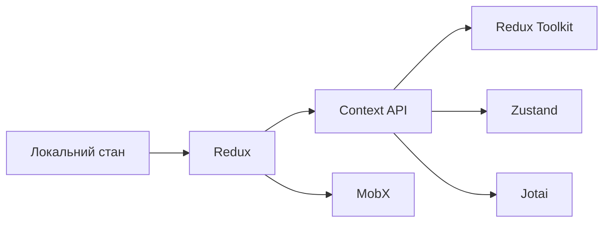

# Лекція 12. Управління глобальним станом

## Вступ до управління станом

### Проблема стану в React застосунках

У міру зростання React застосунків управління станом стає дедалі складнішим викликом. Локальний стан компонентів через useState чудово працює для ізольованої функціональності, але коли багато компонентів потребують доступу до одних і тих самих даних, виникають фундаментальні проблеми.

**Prop drilling** є першою проблемою, з якою стикаються розробники. Коли дані потрібно передати глибоко вниз по дереву компонентів, кожен проміжний компонент змушений приймати та передавати props, навіть якщо сам їх не використовує. Це призводить до багатослівного, важкопідтримуваного коду.

```javascript
// Приклад prop drilling проблеми
function App() {
    const [user, setUser] = useState(null);
    const [theme, setTheme] = useState('light');

    return (
        <Layout user={user} theme={theme}>
            <Sidebar user={user} theme={theme}>
                <Navigation user={user} theme={theme}>
                    <UserMenu user={user} theme={theme} />
                </Navigation>
            </Sidebar>
        </Layout>
    );
}
```

**Синхронізація стану** між різними частинами застосунку стає складною задачею. Коли кілька компонентів відображають одні й ті ж дані, потрібен механізм їх синхронізації та оновлення.

**Розподіл відповідальності** ускладнюється, коли логіка управління станом розкидана по багатьох компонентах. Важко зрозуміти, де знаходиться джерело істини для кожної частини даних.

### Локальний vs глобальний стан

Розуміння різниці між локальним та глобальним станом є критичним для архітектурних рішень.

**Локальний стан** належить одному компоненту або невеликій групі пов'язаних компонентів. Він використовується для UI специфічної логіки: стан форм, відкриття модальних вікон, поточна вкладка, анімації.

```javascript
function TodoItem({ todo }) {
    // Локальний стан для UI
    const [isEditing, setIsEditing] = useState(false);
    const [isHovered, setIsHovered] = useState(false);

    // Цей стан не потрібен іншим компонентам
    return (
        <div
            onMouseEnter={() => setIsHovered(true)}
            onMouseLeave={() => setIsHovered(false)}
        >
            {isEditing ? (
                <input defaultValue={todo.text} />
            ) : (
                <span>{todo.text}</span>
            )}
        </div>
    );
}
```

**Глобальний стан** потрібен багатьом компонентам у різних частинах застосунку: дані користувача, налаштування, теми, дані з API, кошик покупок, сповіщення.

```javascript
// Глобальний стан - потрібен багатьом компонентам
// - User інформація (Header, Profile, Settings)
// - Theme (Layout, Button, Card, всі компоненти)
// - Cart items (Header count, Cart page, Product cards)
// - Notifications (Header, NotificationCenter)
```

Золоте правило: починайте з локального стану, переходьте до глобального тільки коли виникає реальна потреба в спільному доступі.

### Еволюція управління станом

React екосистема пройшла значну еволюцію в підходах до управління станом.

**2013-2015**: локальний стан в класових компонентах через setState був єдиним офіційним способом. Redux з'явився в 2015 як рішення для складних застосунків.

**2016-2018**: Redux став стандартом, але його boilerplate та складність призвели до пошуку альтернатив. MobX, Apollo Client, Unstated надали різні підходи.

**2019-теперішній час**: React Context API та Hooks змінили ландшафт, зробивши вбудовані рішення потужнішими. З'явились легші альтернативи: Zustand, Jotai, Recoil. Redux Toolkit спростив Redux, зробивши його більш доступним.



## Context API для глобального стану

### Створення Context провайдерів

Context API є вбудованим React рішенням для передачі даних через дерево компонентів без prop drilling.

```javascript
import { createContext, useContext, useState } from 'react';

// Створення контексту
const ThemeContext = createContext(null);

// Provider компонент
export function ThemeProvider({ children }) {
    const [theme, setTheme] = useState('light');

    const toggleTheme = () => {
        setTheme(prev => prev === 'light' ? 'dark' : 'light');
    };

    const value = {
        theme,
        toggleTheme
    };

    return (
        <ThemeContext.Provider value={value}>
            {children}
        </ThemeContext.Provider>
    );
}

// Кастомний hook для зручності
export function useTheme() {
    const context = useContext(ThemeContext);

    if (!context) {
        throw new Error('useTheme must be used within ThemeProvider');
    }

    return context;
}

// Використання
function App() {
    return (
        <ThemeProvider>
            <Layout>
                <Header />
                <Main />
                <Footer />
            </Layout>
        </ThemeProvider>
    );
}

function Header() {
    const { theme, toggleTheme } = useTheme();

    return (
        <header className={`header-${theme}`}>
            <button onClick={toggleTheme}>
                Переключити на {theme === 'light' ? 'темну' : 'світлу'}
            </button>
        </header>
    );
}
```

### Множинні контексти

Для різних типів даних краще створювати окремі контексти замість одного великого.

```javascript
// Розділення контекстів за відповідальністю
const UserContext = createContext(null);
const ThemeContext = createContext(null);
const NotificationContext = createContext(null);

// Провайдери
export function UserProvider({ children }) {
    const [user, setUser] = useState(null);
    const [loading, setLoading] = useState(true);

    useEffect(() => {
        // Завантаження користувача
        loadUser().then(user => {
            setUser(user);
            setLoading(false);
        });
    }, []);

    const login = async (credentials) => {
        const user = await authAPI.login(credentials);
        setUser(user);
    };

    const logout = () => {
        setUser(null);
        authAPI.logout();
    };

    const value = { user, loading, login, logout };

    return (
        <UserContext.Provider value={value}>
            {children}
        </UserContext.Provider>
    );
}

export function NotificationProvider({ children }) {
    const [notifications, setNotifications] = useState([]);

    const addNotification = (notification) => {
        const id = Date.now();
        setNotifications(prev => [...prev, { ...notification, id }]);

        // Автоматичне видалення через 5 секунд
        setTimeout(() => {
            removeNotification(id);
        }, 5000);
    };

    const removeNotification = (id) => {
        setNotifications(prev => prev.filter(n => n.id !== id));
    };

    const value = { notifications, addNotification, removeNotification };

    return (
        <NotificationContext.Provider value={value}>
            {children}
        </NotificationContext.Provider>
    );
}

// Комбінування провайдерів
function App() {
    return (
        <UserProvider>
            <ThemeProvider>
                <NotificationProvider>
                    <Router>
                        <Routes>
                            {/* маршрути */}
                        </Routes>
                    </Router>
                </NotificationProvider>
            </ThemeProvider>
        </UserProvider>
    );
}

// Compose utility для кращої організації
function ComposeProviders({ providers, children }) {
    return providers.reduceRight(
        (child, Provider) => <Provider>{child}</Provider>,
        children
    );
}

// Використання
function App() {
    return (
        <ComposeProviders providers={[UserProvider, ThemeProvider, NotificationProvider]}>
            <Router>
                <Routes>
                    {/* маршрути */}
                </Routes>
            </Router>
        </ComposeProviders>
    );
}
```

### Оптимізація Context продуктивності

Context може призвести до зайвих рендерів, якщо не оптимізувати його використання.

```javascript
// ПРОБЛЕМА: всі споживачі перерендеряться при будь-якій зміні
function AppWithProblem() {
    const [user, setUser] = useState(null);
    const [settings, setSettings] = useState({});
    const [notifications, setNotifications] = useState([]);

    // Новий об'єкт при кожному рендері!
    const value = {
        user,
        setUser,
        settings,
        setSettings,
        notifications,
        setNotifications
    };

    return (
        <AppContext.Provider value={value}>
            {children}
        </AppContext.Provider>
    );
}

// РІШЕННЯ 1: useMemo для стабільного value
function AppOptimized() {
    const [user, setUser] = useState(null);
    const [settings, setSettings] = useState({});

    const value = useMemo(
        () => ({ user, setUser, settings, setSettings }),
        [user, settings]
    );

    return (
        <AppContext.Provider value={value}>
            {children}
        </AppContext.Provider>
    );
}

// РІШЕННЯ 2: Розділення на read та write контексти
const UserStateContext = createContext(null);
const UserDispatchContext = createContext(null);

function UserProvider({ children }) {
    const [user, setUser] = useState(null);

    // State context рідко змінюється
    // Dispatch context ніколи не змінюється
    return (
        <UserStateContext.Provider value={user}>
            <UserDispatchContext.Provider value={setUser}>
                {children}
            </UserDispatchContext.Provider>
        </UserStateContext.Provider>
    );
}

// Компоненти можуть підписатись тільки на потрібний контекст
function UserDisplay() {
    // Перерендериться тільки при зміні user
    const user = useContext(UserStateContext);
    return <div>{user?.name}</div>;
}

function UserActions() {
    // Не перерендериться при зміні user
    const setUser = useContext(UserDispatchContext);
    return <button onClick={() => setUser(null)}>Logout</button>;
}

// РІШЕННЯ 3: Селектори з useContextSelector (потребує бібліотеку)
// Дозволяє підписатись тільки на частину контексту
function UserName() {
    const userName = useContextSelector(UserContext, state => state.user.name);
    // Перерендериться тільки при зміні user.name
    return <div>{userName}</div>;
}
```

## useReducer для складного стану

### Паттерни useReducer

useReducer надає більш структурований підхід до управління станом порівняно з useState, особливо коли стан має складну структуру або багато способів оновлення.

```javascript
// Визначення типів дій
const actionTypes = {
    LOAD_DATA_START: 'LOAD_DATA_START',
    LOAD_DATA_SUCCESS: 'LOAD_DATA_SUCCESS',
    LOAD_DATA_ERROR: 'LOAD_DATA_ERROR',
    UPDATE_FILTERS: 'UPDATE_FILTERS',
    CLEAR_FILTERS: 'CLEAR_FILTERS',
    SET_SORT: 'SET_SORT',
    SET_PAGE: 'SET_PAGE'
};

// Початковий стан
const initialState = {
    data: [],
    loading: false,
    error: null,
    filters: {
        category: 'all',
        priceRange: [0, 1000],
        inStock: false
    },
    sort: { field: 'name', order: 'asc' },
    pagination: { page: 1, pageSize: 20, total: 0 }
};

// Reducer функція
function dataReducer(state, action) {
    switch (action.type) {
        case actionTypes.LOAD_DATA_START:
            return {
                ...state,
                loading: true,
                error: null
            };

        case actionTypes.LOAD_DATA_SUCCESS:
            return {
                ...state,
                loading: false,
                data: action.payload.data,
                pagination: {
                    ...state.pagination,
                    total: action.payload.total
                }
            };

        case actionTypes.LOAD_DATA_ERROR:
            return {
                ...state,
                loading: false,
                error: action.payload
            };

        case actionTypes.UPDATE_FILTERS:
            return {
                ...state,
                filters: {
                    ...state.filters,
                    ...action.payload
                },
                pagination: {
                    ...state.pagination,
                    page: 1 // Скинути на першу сторінку
                }
            };

        case actionTypes.CLEAR_FILTERS:
            return {
                ...state,
                filters: initialState.filters,
                pagination: {
                    ...state.pagination,
                    page: 1
                }
            };

        case actionTypes.SET_SORT:
            return {
                ...state,
                sort: action.payload,
                pagination: {
                    ...state.pagination,
                    page: 1
                }
            };

        case actionTypes.SET_PAGE:
            return {
                ...state,
                pagination: {
                    ...state.pagination,
                    page: action.payload
                }
            };

        default:
            return state;
    }
}

// Використання reducer
function ProductList() {
    const [state, dispatch] = useReducer(dataReducer, initialState);

    // Завантаження даних
    useEffect(() => {
        dispatch({ type: actionTypes.LOAD_DATA_START });

        fetchProducts(state.filters, state.sort, state.pagination)
            .then(result => {
                dispatch({
                    type: actionTypes.LOAD_DATA_SUCCESS,
                    payload: result
                });
            })
            .catch(error => {
                dispatch({
                    type: actionTypes.LOAD_DATA_ERROR,
                    payload: error.message
                });
            });
    }, [state.filters, state.sort, state.pagination.page]);

    // Action creators для зручності
    const updateFilters = (filters) => {
        dispatch({
            type: actionTypes.UPDATE_FILTERS,
            payload: filters
        });
    };

    const clearFilters = () => {
        dispatch({ type: actionTypes.CLEAR_FILTERS });
    };

    const setSort = (field, order) => {
        dispatch({
            type: actionTypes.SET_SORT,
            payload: { field, order }
        });
    };

    return (
        <div>
            <Filters
                filters={state.filters}
                onUpdate={updateFilters}
                onClear={clearFilters}
            />

            {state.loading && <LoadingSpinner />}
            {state.error && <ErrorMessage error={state.error} />}

            <ProductGrid products={state.data} />

            <Pagination
                page={state.pagination.page}
                total={state.pagination.total}
                pageSize={state.pagination.pageSize}
                onChange={page => dispatch({ type: actionTypes.SET_PAGE, payload: page })}
            />
        </div>
    );
}
```

### Комбінування Context та useReducer

Context та useReducer чудово працюють разом для створення потужного глобального state management.

```javascript
// Типи дій
const cartActions = {
    ADD_ITEM: 'ADD_ITEM',
    REMOVE_ITEM: 'REMOVE_ITEM',
    UPDATE_QUANTITY: 'UPDATE_QUANTITY',
    CLEAR_CART: 'CLEAR_CART',
    APPLY_DISCOUNT: 'APPLY_DISCOUNT'
};

// Reducer
function cartReducer(state, action) {
    switch (action.type) {
        case cartActions.ADD_ITEM: {
            const existingItem = state.items.find(i => i.id === action.payload.id);

            if (existingItem) {
                return {
                    ...state,
                    items: state.items.map(item =>
                        item.id === action.payload.id
                            ? { ...item, quantity: item.quantity + 1 }
                            : item
                    )
                };
            }

            return {
                ...state,
                items: [...state.items, { ...action.payload, quantity: 1 }]
            };
        }

        case cartActions.REMOVE_ITEM:
            return {
                ...state,
                items: state.items.filter(item => item.id !== action.payload)
            };

        case cartActions.UPDATE_QUANTITY:
            return {
                ...state,
                items: state.items.map(item =>
                    item.id === action.payload.id
                        ? { ...item, quantity: action.payload.quantity }
                        : item
                )
            };

        case cartActions.CLEAR_CART:
            return {
                ...state,
                items: []
            };

        case cartActions.APPLY_DISCOUNT:
            return {
                ...state,
                discount: action.payload
            };

        default:
            return state;
    }
}

// Context
const CartContext = createContext(null);

// Provider
export function CartProvider({ children }) {
    const [state, dispatch] = useReducer(cartReducer, {
        items: [],
        discount: 0
    });

    // Обчислені значення
    const subtotal = state.items.reduce(
        (sum, item) => sum + item.price * item.quantity,
        0
    );

    const total = subtotal * (1 - state.discount);

    const itemCount = state.items.reduce(
        (sum, item) => sum + item.quantity,
        0
    );

    // Action creators
    const addItem = (item) => {
        dispatch({ type: cartActions.ADD_ITEM, payload: item });
    };

    const removeItem = (itemId) => {
        dispatch({ type: cartActions.REMOVE_ITEM, payload: itemId });
    };

    const updateQuantity = (itemId, quantity) => {
        if (quantity <= 0) {
            removeItem(itemId);
        } else {
            dispatch({
                type: cartActions.UPDATE_QUANTITY,
                payload: { id: itemId, quantity }
            });
        }
    };

    const clearCart = () => {
        dispatch({ type: cartActions.CLEAR_CART });
    };

    const applyDiscount = (discount) => {
        dispatch({ type: cartActions.APPLY_DISCOUNT, payload: discount });
    };

    const value = {
        items: state.items,
        discount: state.discount,
        subtotal,
        total,
        itemCount,
        addItem,
        removeItem,
        updateQuantity,
        clearCart,
        applyDiscount
    };

    return (
        <CartContext.Provider value={value}>
            {children}
        </CartContext.Provider>
    );
}

// Custom hook
export function useCart() {
    const context = useContext(CartContext);

    if (!context) {
        throw new Error('useCart must be used within CartProvider');
    }

    return context;
}

// Використання
function ProductCard({ product }) {
    const { addItem } = useCart();

    return (
        <div className="product-card">
            <h3>{product.name}</h3>
            <p>{product.price} грн</p>
            <button onClick={() => addItem(product)}>
                Додати в кошик
            </button>
        </div>
    );
}

function Cart() {
    const { items, total, itemCount, updateQuantity, clearCart } = useCart();

    return (
        <div className="cart">
            <h2>Кошик ({itemCount})</h2>

            {items.map(item => (
                <div key={item.id} className="cart-item">
                    <span>{item.name}</span>
                    <input
                        type="number"
                        value={item.quantity}
                        onChange={e => updateQuantity(item.id, parseInt(e.target.value))}
                        min="0"
                    />
                    <span>{item.price * item.quantity} грн</span>
                </div>
            ))}

            <div className="cart-total">
                Всього: {total} грн
            </div>

            <button onClick={clearCart}>Очистити кошик</button>
        </div>
    );
}
```

## Альтернативи: Zustand

### Чому Zustand

Zustand є мінімалістичним state management рішенням, яке пропонує простий API без boilerplate коду. На відміну від Context API, Zustand не викликає зайвих рендерів завдяки селекторам. Порівняно з Redux, він має значно менше коду та простішу конфігурацію.

```bash
# Встановлення
npm install zustand
```

### Створення store з Zustand

```javascript
import { create } from 'zustand';

// Простий store
const useCounterStore = create((set) => ({
    count: 0,
    increment: () => set((state) => ({ count: state.count + 1 })),
    decrement: () => set((state) => ({ count: state.count - 1 })),
    reset: () => set({ count: 0 })
}));

// Використання
function Counter() {
    const count = useCounterStore((state) => state.count);
    const increment = useCounterStore((state) => state.increment);
    const decrement = useCounterStore((state) => state.decrement);

    return (
        <div>
            <h2>Count: {count}</h2>
            <button onClick={increment}>+</button>
            <button onClick={decrement}>-</button>
        </div>
    );
}

// Складніший store
const useTodoStore = create((set, get) => ({
    todos: [],
    filter: 'all',

    addTodo: (text) => set((state) => ({
        todos: [...state.todos, {
            id: Date.now(),
            text,
            completed: false
        }]
    })),

    toggleTodo: (id) => set((state) => ({
        todos: state.todos.map(todo =>
            todo.id === id
                ? { ...todo, completed: !todo.completed }
                : todo
        )
    })),

    removeTodo: (id) => set((state) => ({
        todos: state.todos.filter(todo => todo.id !== id)
    })),

    setFilter: (filter) => set({ filter }),

    // Getter з обчисленнями
    getFilteredTodos: () => {
        const { todos, filter } = get();

        if (filter === 'completed') {
            return todos.filter(t => t.completed);
        }
        if (filter === 'active') {
            return todos.filter(t => !t.completed);
        }
        return todos;
    }
}));

// Використання з селекторами
function TodoList() {
    // Підписка тільки на todos
    const todos = useTodoStore((state) => state.todos);
    const toggleTodo = useTodoStore((state) => state.toggleTodo);
    const removeTodo = useTodoStore((state) => state.removeTodo);

    return (
        <ul>
            {todos.map(todo => (
                <TodoItem
                    key={todo.id}
                    todo={todo}
                    onToggle={toggleTodo}
                    onRemove={removeTodo}
                />
            ))}
        </ul>
    );
}

function TodoFilters() {
    // Підписка тільки на filter
    const filter = useTodoStore((state) => state.filter);
    const setFilter = useTodoStore((state) => state.setFilter);

    return (
        <div>
            <button
                className={filter === 'all' ? 'active' : ''}
                onClick={() => setFilter('all')}
            >
                Всі
            </button>
            <button
                className={filter === 'active' ? 'active' : ''}
                onClick={() => setFilter('active')}
            >
                Активні
            </button>
            <button
                className={filter === 'completed' ? 'active' : ''}
                onClick={() => setFilter('completed')}
            >
                Виконані
            </button>
        </div>
    );
}
```

### Middleware та persisting

Zustand підтримує middleware для додаткової функціональності.

```javascript
import { create } from 'zustand';
import { persist, devtools } from 'zustand/middleware';

// Збереження в localStorage
const useUserStore = create(
    persist(
        (set) => ({
            user: null,
            preferences: {
                theme: 'light',
                language: 'uk'
            },

            setUser: (user) => set({ user }),

            updatePreferences: (prefs) => set((state) => ({
                preferences: { ...state.preferences, ...prefs }
            })),

            logout: () => set({ user: null })
        }),
        {
            name: 'user-storage', // ключ в localStorage
            partialize: (state) => ({
                // Зберігати тільки preferences
                preferences: state.preferences
            })
        }
    )
);

// DevTools для debugging
const useCartStore = create(
    devtools(
        (set) => ({
            items: [],

            addItem: (item) => set(
                (state) => ({ items: [...state.items, item] }),
                false,
                'cart/addItem' // Назва дії в DevTools
            )
        }),
        { name: 'CartStore' }
    )
);

// Комбінування middleware
const useAppStore = create(
    devtools(
        persist(
            (set) => ({
                settings: {},
                updateSettings: (settings) => set({ settings })
            }),
            { name: 'app-storage' }
        ),
        { name: 'AppStore' }
    )
);

// Імутабельні оновлення з immer
import { immer } from 'zustand/middleware/immer';

const useComplexStore = create(
    immer((set) => ({
        nested: {
            deeply: {
                value: 0
            }
        },

        // З immer можна мутувати draft
        updateDeepValue: (value) => set((state) => {
            state.nested.deeply.value = value;
        })
    }))
);
```

### Асинхронні дії

```javascript
const useDataStore = create((set, get) => ({
    data: null,
    loading: false,
    error: null,

    fetchData: async (id) => {
        set({ loading: true, error: null });

        try {
            const response = await fetch(`/api/data/${id}`);
            const data = await response.json();

            set({ data, loading: false });
        } catch (error) {
            set({ error: error.message, loading: false });
        }
    },

    updateData: async (id, updates) => {
        const previousData = get().data;

        // Optimistic update
        set({ data: { ...previousData, ...updates } });

        try {
            await fetch(`/api/data/${id}`, {
                method: 'PUT',
                body: JSON.stringify(updates)
            });
        } catch (error) {
            // Rollback on error
            set({ data: previousData, error: error.message });
        }
    }
}));

// Використання
function DataComponent({ id }) {
    const { data, loading, error, fetchData } = useDataStore();

    useEffect(() => {
        fetchData(id);
    }, [id, fetchData]);

    if (loading) return <div>Завантаження...</div>;
    if (error) return <div>Помилка: {error}</div>;

    return <div>{JSON.stringify(data)}</div>;
}
```

## Persisting стану

### localStorage для збереження стану

Збереження стану в localStorage дозволяє зберігати дані між сеансами.

```javascript
// Кастомний hook для роботи з localStorage
function useLocalStorage(key, initialValue) {
    const [value, setValue] = useState(() => {
        try {
            const saved = localStorage.getItem(key);
            return saved ? JSON.parse(saved) : initialValue;
        } catch {
            return initialValue;
        }
    });

    useEffect(() => {
        try {
            localStorage.setItem(key, JSON.stringify(value));
        } catch (error) {
            console.error('Error saving to localStorage:', error);
        }
    }, [key, value]);

    return [value, setValue];
}

// Використання
function Settings() {
    const [theme, setTheme] = useLocalStorage('theme', 'light');
    const [language, setLanguage] = useLocalStorage('language', 'uk');

    return (
        <div>
            <select value={theme} onChange={e => setTheme(e.target.value)}>
                <option value="light">Світла</option>
                <option value="dark">Темна</option>
            </select>
        </div>
    );
}

// Context з localStorage
const SettingsContext = createContext(null);

export function SettingsProvider({ children }) {
    const [settings, setSettings] = useLocalStorage('app-settings', {
        theme: 'light',
        language: 'uk',
        notifications: true
    });

    const updateSettings = (updates) => {
        setSettings(prev => ({ ...prev, ...updates }));
    };

    const resetSettings = () => {
        setSettings({
            theme: 'light',
            language: 'uk',
            notifications: true
        });
    };

    const value = {
        settings,
        updateSettings,
        resetSettings
    };

    return (
        <SettingsContext.Provider value={value}>
            {children}
        </SettingsContext.Provider>
    );
}
```

### Синхронізація між вкладками

localStorage дозволяє синхронізувати стан між вкладками браузера.

```javascript
function useSyncedState(key, initialValue) {
    const [value, setValue] = useState(() => {
        const saved = localStorage.getItem(key);
        return saved ? JSON.parse(saved) : initialValue;
    });

    useEffect(() => {
        localStorage.setItem(key, JSON.stringify(value));
    }, [key, value]);

    // Синхронізація між вкладками
    useEffect(() => {
        const handleStorage = (e) => {
            if (e.key === key && e.newValue) {
                setValue(JSON.parse(e.newValue));
            }
        };

        window.addEventListener('storage', handleStorage);
        return () => window.removeEventListener('storage', handleStorage);
    }, [key]);

    return [value, setValue];
}

// Використання
function App() {
    const [cart, setCart] = useSyncedState('cart', []);

    // Зміни в одній вкладці автоматично відобразяться в інших
    return (
        <div>
            <CartDisplay cart={cart} />
            <button onClick={() => setCart([])}>Очистити</button>
        </div>
    );
}
```

### IndexedDB для великих даних

Для великих обсягів даних localStorage недостатній, потрібен IndexedDB.

```javascript
// Обгортка для IndexedDB
class IndexedDBStore {
    constructor(dbName, storeName) {
        this.dbName = dbName;
        this.storeName = storeName;
        this.db = null;
    }

    async init() {
        return new Promise((resolve, reject) => {
            const request = indexedDB.open(this.dbName, 1);

            request.onerror = () => reject(request.error);
            request.onsuccess = () => {
                this.db = request.result;
                resolve();
            };

            request.onupgradeneeded = (event) => {
                const db = event.target.result;
                if (!db.objectStoreNames.contains(this.storeName)) {
                    db.createObjectStore(this.storeName);
                }
            };
        });
    }

    async get(key) {
        return new Promise((resolve, reject) => {
            const transaction = this.db.transaction([this.storeName], 'readonly');
            const store = transaction.objectStore(this.storeName);
            const request = store.get(key);

            request.onerror = () => reject(request.error);
            request.onsuccess = () => resolve(request.result);
        });
    }

    async set(key, value) {
        return new Promise((resolve, reject) => {
            const transaction = this.db.transaction([this.storeName], 'readwrite');
            const store = transaction.objectStore(this.storeName);
            const request = store.put(value, key);

            request.onerror = () => reject(request.error);
            request.onsuccess = () => resolve();
        });
    }

    async remove(key) {
        return new Promise((resolve, reject) => {
            const transaction = this.db.transaction([this.storeName], 'readwrite');
            const store = transaction.objectStore(this.storeName);
            const request = store.delete(key);

            request.onerror = () => reject(request.error);
            request.onsuccess = () => resolve();
        });
    }
}

// Hook для IndexedDB
function useIndexedDB(dbName, storeName) {
    const [store, setStore] = useState(null);

    useEffect(() => {
        const db = new IndexedDBStore(dbName, storeName);
        db.init().then(() => setStore(db));
    }, [dbName, storeName]);

    return store;
}

// Використання
function DataManager() {
    const db = useIndexedDB('myApp', 'data');
    const [data, setData] = useState(null);

    useEffect(() => {
        if (db) {
            db.get('userData').then(setData);
        }
    }, [db]);

    const saveData = async (newData) => {
        if (db) {
            await db.set('userData', newData);
            setData(newData);
        }
    };

    return (
        <div>
            {data && <DataDisplay data={data} />}
            <button onClick={() => saveData({ updated: Date.now() })}>
                Зберегти
            </button>
        </div>
    );
}
```

## Висновки та найкращі практики

### Вибір підходу до управління станом

Вибір правильного підходу до управління станом залежить від складності застосунку та специфічних вимог.

**Для малих застосунків**: локальний стан через useState та prop drilling є достатнім. Не додавайте зайвої складності без реальної потреби.

**Для середніх застосунків**: Context API з useReducer надає достатню потужність без додаткових залежностей. Розділяйте контексти за відповідальністю для кращої продуктивності.

**Для великих застосунків**: спеціалізовані бібліотеки як Zustand або Redux Toolkit надають кращу продуктивність, devtools та розширені можливості.

Золоте правило: починайте з найпростішого рішення та ускладнюйте тільки при виникненні реальних проблем.

### Організація стану

Правильна організація стану є ключем до підтримуваного коду:

**Розділяйте локальний та глобальний стан**: не робіть все глобальним, більшість UI стану повинен залишатись локальним.

**Групуйте пов'язані дані**: створюйте окремі store або контексти для різних доменів застосунку (user, cart, notifications).

**Нормалізуйте структуру даних**: уникайте глибокої вкладеності та дублювання, зберігайте дані в плоских структурах з посиланнями.

**Використовуйте селектори**: не підписуйтесь на весь стан, підписуйтесь тільки на потрібні частини через селектори.

### Продуктивність

Оптимізація продуктивності при роботі з глобальним станом:

**Мемоїзуйте Context value**: використовуйте useMemo для об'єктів, які передаються через Context Provider.

**Розділяйте контексти**: створюйте окремі контексти для даних, які змінюються незалежно.

**Використовуйте селектори**: в Zustand підписуйтесь тільки на потрібні частини стану.

**Уникайте зайвих обчислень**: використовуйте useMemo для складних derived state.

### Тестування

Стан застосунку повинен бути легко тестованим:

**Виносьте логіку в окремі функції**: reducer функції, action creators та селектори легко тестувати ізольовано.

**Використовуйте тестові провайдери**: створюйте wrapper компоненти для тестів з необхідним контекстом.

**Тестуйте інтеграцію**: переконайтесь, що компоненти правильно взаємодіють з state management.

### Найкращі практики

1. **Починайте з локального стану** та переходьте до глобального тільки при реальній потребі;
2. **Розділяйте контексти** за відповідальністю для кращої продуктивності та організації;
3. **Використовуйте TypeScript** для типобезпеки state та actions;
4. **Документуйте структуру стану** для кращого розуміння архітектури;
5. **Мемоїзуйте Context values** для запобігання зайвим рендерам;
6. **Використовуйте селектори** для підписки на конкретні частини стану;
7. **Зберігайте важливий стан** через localStorage або IndexedDB;
8. **Тестуйте логіку стану** окремо від компонентів для кращої надійності.

Розуміння цих концепцій та дотримання найкращих практик дозволяє створювати масштабовані React застосунки з чистою архітектурою управління станом, які легко підтримувати та розширювати.
