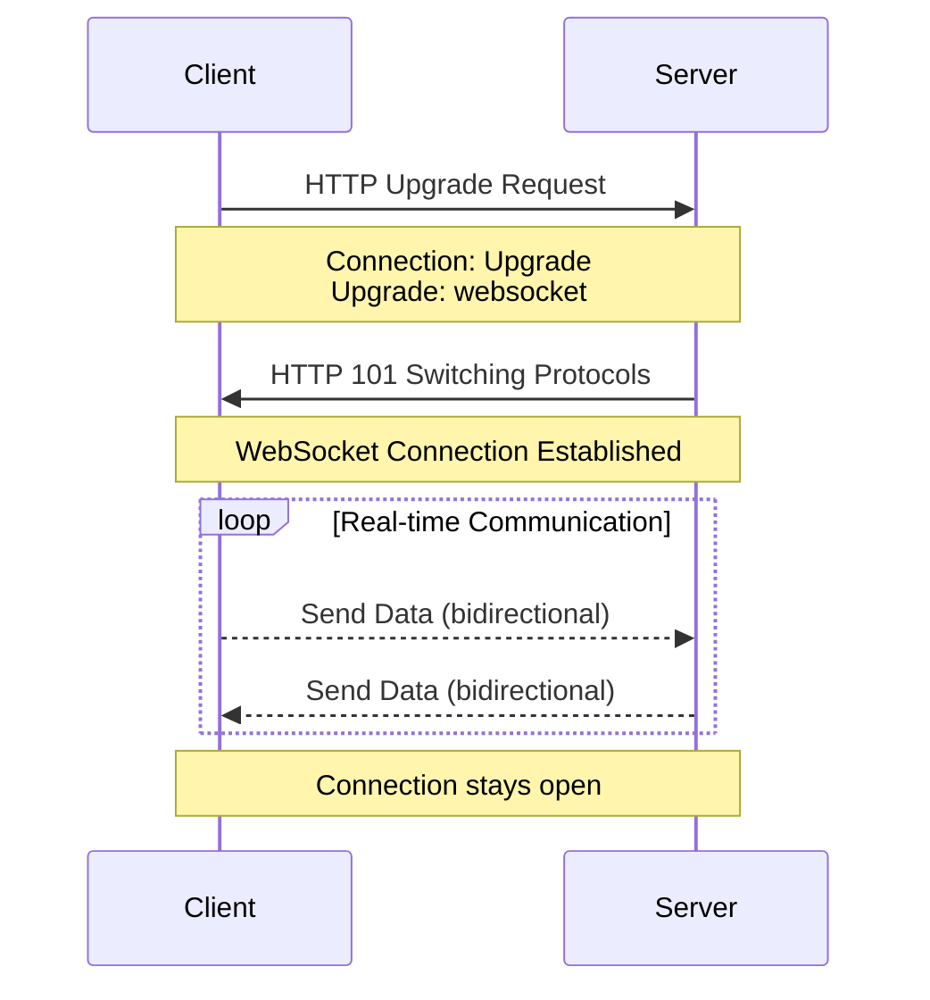
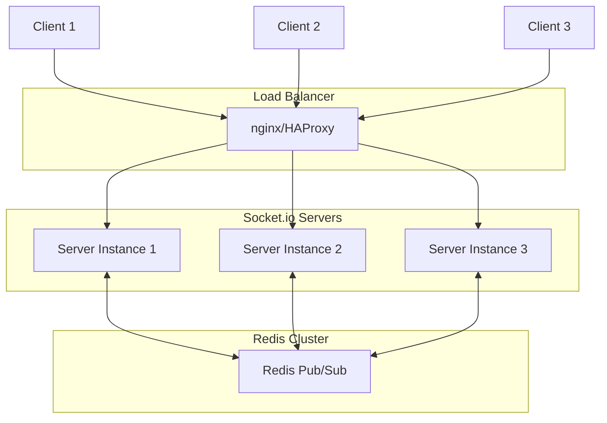

# Лекція 17. Real-time веб-додатки (WebSocket)

## Вступ до real-time комунікацій

### Еволюція двостороннього зв'язку у вебі

Веб народився як request-response система: клієнт надсилає запит, сервер відповідає, з'єднання закривається. Цей підхід був цілком достатнім для статичних сторінок та простих форм. Але з розвитком вебдодатків виникла потреба в двосторонній комунікації в реальному часі: чати, онлайн-ігри, спільне редагування документів, біржові термінали, дашборди моніторингу.

Спроби вирішити цю проблему призвели до появи різних технік, кожна з яких мала свої обмеження. **Short Polling** передбачав регулярні запити клієнта до сервера з фіксованим інтервалом, наприклад, кожні 5 секунд. Це створювало надлишкове навантаження на сервер та затримки в отриманні оновлень. **Long Polling** був еволюцією цього підходу: клієнт надсилав запит, який сервер тримав відкритим доти, доки не з'являлися нові дані. Після відповіді клієнт одразу надсилав новий запит. Хоча це зменшувало затримки, накладні витрати HTTP залишалися значними.

**Server-Sent Events** дозволяв серверу надсилати дані клієнту через постійне HTTP з'єднання, але підтримував лише односторонню комунікацію від сервера до клієнта. Для повноцінної двосторонньої взаємодії знадобилася принципово нова технологія.

### WebSocket: справжній двосторонній зв'язок

**WebSocket** був стандартизований як частина HTML5 і вирішив фундаментальну проблему real-time комунікацій у вебі. Замість створення нових HTTP з'єднань для кожного обміну даними, WebSocket встановлює єдине постійне з'єднання, через яке дані можуть передаватися в обох напрямках без накладних витрат HTTP headers.

Технічно WebSocket починається як HTTP запит з особливим заголовком Upgrade, який сигналізує серверу про бажання перейти на WebSocket протокол. Після успішного handshake з'єднання переходить у стан WebSocket, і обидві сторони можуть надсилати дані незалежно одна від одної.



Переваги WebSocket над традиційними підходами є суттєвими. По-перше, це **низька затримка** через відсутність необхідності створювати нове з'єднання для кожного повідомлення. По-друге, **ефективність**: після встановлення з'єднання накладні витрати мінімальні, тоді як кожен HTTP запит несе повний набір заголовків. По-третє, **справжня двостороння комунікація**: будь-яка сторона може ініціювати передачу даних у будь-який момент. По-четверте, **підтримка браузерами**: всі сучасні браузери мають нативну підтримку WebSocket API.

## Порівняння підходів: WebSocket vs HTTP Polling

### HTTP Polling: простота з ціною

**Short Polling** є найпростішим підходом до отримання оновлень від сервера. Клієнт регулярно надсилає запити, незалежно від того, чи є нові дані.

```javascript
// Приклад Short Polling
class ShortPolling {
    constructor(url, interval = 5000) {
        this.url = url;
        this.interval = interval;
        this.timerId = null;
    }

    start() {
        this.timerId = setInterval(async () => {
            try {
                const response = await fetch(this.url);
                const data = await response.json();

                if (data.updates && data.updates.length > 0) {
                    this.handleUpdates(data.updates);
                }
            } catch (error) {
                console.error('Polling error:', error);
            }
        }, this.interval);
    }

    stop() {
        if (this.timerId) {
            clearInterval(this.timerId);
            this.timerId = null;
        }
    }

    handleUpdates(updates) {
        updates.forEach(update => {
            console.log('Отримано оновлення:', update);
        });
    }
}

// Використання
const polling = new ShortPolling('/api/updates', 3000);
polling.start();
```

Недоліки Short Polling є очевидними. Якщо оновлення з'являються рідко, більшість запитів повертають порожні відповіді, марнуючи ресурси. Якщо оновлення з'являються часто, може виникнути затримка до наступного запиту. Навантаження на сервер зростає лінійно з кількістю клієнтів.

**Long Polling** покращує ситуацію, але не вирішує її повністю.

```javascript
// Приклад Long Polling
class LongPolling {
    constructor(url) {
        this.url = url;
        this.isActive = false;
    }

    async start() {
        this.isActive = true;

        while (this.isActive) {
            try {
                // Сервер тримає з'єднання відкритим доки не з'являться дані
                const response = await fetch(this.url, {
                    method: 'GET',
                    headers: {
                        'Content-Type': 'application/json',
                    },
                });

                if (!response.ok) {
                    throw new Error(`HTTP error: ${response.status}`);
                }

                const data = await response.json();

                if (data.updates) {
                    this.handleUpdates(data.updates);
                }

                // Після отримання відповіді одразу надсилаємо новий запит
            } catch (error) {
                console.error('Long polling error:', error);
                // Чекаємо перед повторною спробою після помилки
                await new Promise(resolve => setTimeout(resolve, 5000));
            }
        }
    }

    stop() {
        this.isActive = false;
    }

    handleUpdates(updates) {
        updates.forEach(update => {
            console.log('Отримано оновлення:', update);
        });
    }
}
```

Long Polling зменшує затримки, але створює інші проблеми. Кожне з'єднання споживає ресурси сервера, навіть якщо воно просто чекає. При великій кількості клієнтів це може призвести до вичерпання доступних з'єднань. HTTP накладні витрати залишаються для кожного нового запиту.

### WebSocket: сучасне рішення

WebSocket усуває ці проблеми завдяки постійному з'єднанню.

```javascript
// Нативний WebSocket API
class WebSocketClient {
    constructor(url) {
        this.url = url;
        this.ws = null;
        this.reconnectInterval = 5000;
        this.shouldReconnect = true;
    }

    connect() {
        this.ws = new WebSocket(this.url);

        this.ws.onopen = () => {
            console.log('WebSocket з\'єднання встановлено');
            this.onConnectionEstablished();
        };

        this.ws.onmessage = (event) => {
            try {
                const data = JSON.parse(event.data);
                this.handleMessage(data);
            } catch (error) {
                console.error('Помилка обробки повідомлення:', error);
            }
        };

        this.ws.onerror = (error) => {
            console.error('WebSocket помилка:', error);
        };

        this.ws.onclose = () => {
            console.log('WebSocket з\'єднання закрито');

            if (this.shouldReconnect) {
                setTimeout(() => this.connect(), this.reconnectInterval);
            }
        };
    }

    send(data) {
        if (this.ws && this.ws.readyState === WebSocket.OPEN) {
            this.ws.send(JSON.stringify(data));
        } else {
            console.warn('WebSocket не готовий до відправки');
        }
    }

    disconnect() {
        this.shouldReconnect = false;
        if (this.ws) {
            this.ws.close();
        }
    }

    onConnectionEstablished() {
        // Можна відправити ініціалізаційні дані
        this.send({ type: 'init', userId: 'user123' });
    }

    handleMessage(data) {
        console.log('Отримано повідомлення:', data);
    }
}
```

### Порівняльний аналіз

Порівняємо ключові характеристики різних підходів.

**Затримка:** Short Polling має затримку до інтервалу опитування, Long Polling майже миттєвий після появи даних, WebSocket миттєвий в обох напрямках.

**Навантаження на сервер:** Short Polling створює постійне навантаження незалежно від активності, Long Polling тримає з'єднання відкритими, WebSocket мінімальне навантаження після встановлення з'єднання.

**Пропускна здатність:** Short Polling повні HTTP headers при кожному запиті, Long Polling повні HTTP headers при кожному запиті, WebSocket мінімальні накладні витрати після handshake.

**Складність реалізації:** Short Polling найпростіший, Long Polling середня складність на сервері, WebSocket потребує спеціальної підтримки на сервері.

```javascript
// Порівняння накладних витрат
class ConnectionComparison {
    // HTTP запит з повними заголовками
    static calculateHTTPOverhead(dataSize) {
        const headers = 500; // Приблизний розмір headers в байтах
        const totalPerRequest = headers + dataSize;
        return totalPerRequest;
    }

    // WebSocket після встановлення з'єднання
    static calculateWebSocketOverhead(dataSize) {
        const frameOverhead = 2; // Мінімальний frame overhead
        return frameOverhead + dataSize;
    }

    // Порівняння для 1000 повідомлень
    static compare(messageSize = 100) {
        const messages = 1000;

        const httpTotal = this.calculateHTTPOverhead(messageSize) * messages;
        const wsHandshake = 500; // Одноразовий handshake
        const wsTotal = wsHandshake +
                       (this.calculateWebSocketOverhead(messageSize) * messages);

        console.log(`Для ${messages} повідомлень по ${messageSize} байт:`);
        console.log(`HTTP Polling: ${httpTotal} байт`);
        console.log(`WebSocket: ${wsTotal} байт`);
        console.log(`Економія: ${((1 - wsTotal/httpTotal) * 100).toFixed(1)}%`);
    }
}

ConnectionComparison.compare();
// Вивід:
// Для 1000 повідомлень по 100 байт:
// HTTP Polling: 600000 байт
// WebSocket: 102500 байт
// Економія: 82.9%
```

## Socket.io: високорівнева бібліотека для real-time

### Чому Socket.io замість чистого WebSocket

Хоча нативний WebSocket API є потужним, він має обмеження. Відсутність автоматичного перепідключення при обриві з'єднання, немає вбудованої підтримки кімнат та груп, відсутність fallback механізмів для старих браузерів, потреба в ручній обробці бінарних даних та відсутність логіки для підтримки різних типів подій.

**Socket.io** надає високорівневий API, який вирішує ці проблеми, додаючи корисні можливості поверх WebSocket протоколу.

### Налаштування Socket.io на сервері

Почнемо з базової конфігурації Socket.io сервера.

```javascript
// server.js
import express from 'express';
import { createServer } from 'http';
import { Server } from 'socket.io';
import cors from 'cors';

const app = express();
const httpServer = createServer(app);

// Конфігурація Socket.io з підтримкою CORS
const io = new Server(httpServer, {
    cors: {
        origin: 'http://localhost:5173', // React dev server
        methods: ['GET', 'POST'],
        credentials: true
    },
    // Налаштування транспортів
    transports: ['websocket', 'polling'],
    // Налаштування ping/pong для перевірки з'єднання
    pingInterval: 25000,
    pingTimeout: 60000
});

// Middleware для Express
app.use(cors());
app.use(express.json());

// REST endpoint для перевірки
app.get('/health', (req, res) => {
    res.json({
        status: 'ok',
        connections: io.engine.clientsCount
    });
});

// Socket.io connection handler
io.on('connection', (socket) => {
    console.log('Клієнт підключився:', socket.id);

    // Обробка відключення
    socket.on('disconnect', (reason) => {
        console.log('Клієнт відключився:', socket.id, 'Причина:', reason);
    });

    // Обробка помилок
    socket.on('error', (error) => {
        console.error('Socket помилка:', error);
    });
});

const PORT = process.env.PORT || 3000;
httpServer.listen(PORT, () => {
    console.log(`Сервер запущено на порту ${PORT}`);
});
```

### Основні події та їх обробка

Socket.io використовує event-driven модель для комунікації.

```javascript
// Розширена обробка подій на сервері
io.on('connection', (socket) => {
    console.log('Новий клієнт:', socket.id);

    // Обробка користувацьких подій
    socket.on('chat:message', (data) => {
        console.log('Отримано повідомлення:', data);

        // Відправка повідомлення всім клієнтам
        io.emit('chat:message', {
            id: Date.now(),
            userId: socket.id,
            text: data.text,
            timestamp: new Date().toISOString()
        });
    });

    // Приватне повідомлення конкретному користувачу
    socket.on('chat:private', (data) => {
        const { recipientId, text } = data;

        // Відправка тільки конкретному сокету
        io.to(recipientId).emit('chat:private', {
            from: socket.id,
            text,
            timestamp: new Date().toISOString()
        });
    });

    // Повідомлення з підтвердженням (acknowledgment)
    socket.on('task:create', (taskData, callback) => {
        try {
            // Логіка створення завдання
            const newTask = {
                id: Date.now(),
                ...taskData,
                createdAt: new Date().toISOString()
            };

            // Сповістити всіх про нове завдання
            io.emit('task:created', newTask);

            // Підтвердження відправнику
            callback({ success: true, task: newTask });
        } catch (error) {
            callback({ success: false, error: error.message });
        }
    });

    // Typing indicator
    socket.on('chat:typing', (data) => {
        socket.broadcast.emit('chat:typing', {
            userId: socket.id,
            isTyping: data.isTyping
        });
    });
});
```

### Broadcasting стратегії

Socket.io надає гнучкі методи для відправки повідомлень різним групам клієнтів.

```javascript
// Різні способи broadcasting
class BroadcastExamples {
    static setupHandlers(io, socket) {
        // 1. Відправка всім підключеним клієнтам (включно з відправником)
        socket.on('global:announcement', (data) => {
            io.emit('announcement', data);
        });

        // 2. Відправка всім крім відправника
        socket.on('user:action', (data) => {
            socket.broadcast.emit('user:action', {
                userId: socket.id,
                action: data
            });
        });

        // 3. Відправка всім в конкретній кімнаті
        socket.on('room:message', (data) => {
            io.to(data.room).emit('room:message', {
                userId: socket.id,
                text: data.text
            });
        });

        // 4. Відправка всім в кімнаті крім відправника
        socket.on('room:typing', (data) => {
            socket.to(data.room).emit('room:typing', {
                userId: socket.id,
                isTyping: data.isTyping
            });
        });

        // 5. Відправка кільком кімнатам одночасно
        socket.on('multi:room:message', (data) => {
            io.to(data.rooms).emit('message', {
                text: data.text,
                from: socket.id
            });
        });

        // 6. Відправка конкретному socket ID
        socket.on('direct:message', (data) => {
            io.to(data.recipientId).emit('direct:message', {
                from: socket.id,
                text: data.text
            });
        });
    }
}

io.on('connection', (socket) => {
    BroadcastExamples.setupHandlers(io, socket);
});
```

## Namespaces та Rooms: організація комунікації

### Namespaces: логічний поділ з'єднань

**Namespaces** дозволяють створити окремі канали комунікації на одному сервері. Це корисно для розділення різних частин застосунку.

```javascript
// Створення та використання namespaces
class NamespaceManager {
    constructor(io) {
        this.io = io;
        this.setupNamespaces();
    }

    setupNamespaces() {
        // Головний namespace (за замовчуванням)
        this.io.on('connection', (socket) => {
            console.log('Підключення до головного namespace:', socket.id);
        });

        // Namespace для адміністраторів
        const adminNamespace = this.io.of('/admin');
        adminNamespace.use(this.adminAuthMiddleware);
        adminNamespace.on('connection', (socket) => {
            console.log('Адмін підключився:', socket.id);

            socket.on('admin:broadcast', (data) => {
                // Відправка повідомлення всім адмінам
                adminNamespace.emit('admin:message', {
                    from: socket.id,
                    text: data.text,
                    timestamp: new Date().toISOString()
                });
            });

            socket.on('admin:stats', (callback) => {
                const stats = this.getServerStats();
                callback(stats);
            });
        });

        // Namespace для чату
        const chatNamespace = this.io.of('/chat');
        chatNamespace.on('connection', (socket) => {
            console.log('Користувач приєднався до чату:', socket.id);

            socket.on('chat:join', (userData) => {
                socket.userData = userData;
                socket.broadcast.emit('user:joined', {
                    userId: socket.id,
                    username: userData.username
                });
            });

            socket.on('chat:message', (message) => {
                chatNamespace.emit('chat:message', {
                    userId: socket.id,
                    username: socket.userData?.username,
                    text: message.text,
                    timestamp: new Date().toISOString()
                });
            });
        });

        // Namespace для сповіщень
        const notificationNamespace = this.io.of('/notifications');
        notificationNamespace.on('connection', (socket) => {
            socket.on('subscribe', (topics) => {
                topics.forEach(topic => {
                    socket.join(`topic:${topic}`);
                });
            });
        });
    }

    adminAuthMiddleware(socket, next) {
        const token = socket.handshake.auth.token;

        if (!token) {
            return next(new Error('Authentication error'));
        }

        // Перевірка токену
        try {
            // Логіка валідації токену
            const decoded = verifyToken(token);
            if (decoded.role === 'admin') {
                socket.userData = decoded;
                next();
            } else {
                next(new Error('Insufficient permissions'));
            }
        } catch (error) {
            next(new Error('Invalid token'));
        }
    }

    getServerStats() {
        return {
            totalConnections: this.io.engine.clientsCount,
            adminConnections: this.io.of('/admin').sockets.size,
            chatConnections: this.io.of('/chat').sockets.size
        };
    }

    // Відправка сповіщення конкретній темі
    sendNotification(topic, data) {
        this.io.of('/notifications')
            .to(`topic:${topic}`)
            .emit('notification', data);
    }
}

// Використання
const namespaceManager = new NamespaceManager(io);

// Приклад відправки сповіщення
namespaceManager.sendNotification('orders', {
    type: 'new_order',
    orderId: '12345',
    message: 'Нове замовлення отримано'
});
```

### Rooms: динамічна сегментація клієнтів

**Rooms** дозволяють групувати сокети для вибіркової розсилки повідомлень. На відміну від namespaces, rooms є динамічними і сокет може бути в багатьох rooms одночасно.

```javascript
// Управління кімнатами
class RoomManager {
    constructor(io) {
        this.io = io;
        this.rooms = new Map(); // Зберігання метаданих кімнат
    }

    setupHandlers(socket) {
        // Приєднання до кімнати
        socket.on('room:join', async (roomId, callback) => {
            try {
                await socket.join(roomId);

                // Оновлення метаданих кімнати
                if (!this.rooms.has(roomId)) {
                    this.rooms.set(roomId, {
                        id: roomId,
                        users: new Set(),
                        createdAt: new Date()
                    });
                }

                const room = this.rooms.get(roomId);
                room.users.add(socket.id);

                // Сповістити інших в кімнаті
                socket.to(roomId).emit('room:user:joined', {
                    userId: socket.id,
                    username: socket.userData?.username,
                    roomId
                });

                // Відправити список користувачів новому учаснику
                const roomUsers = await this.getRoomUsers(roomId);
                callback({
                    success: true,
                    room: {
                        id: roomId,
                        users: roomUsers
                    }
                });
            } catch (error) {
                callback({ success: false, error: error.message });
            }
        });

        // Вихід з кімнати
        socket.on('room:leave', async (roomId, callback) => {
            await socket.leave(roomId);

            const room = this.rooms.get(roomId);
            if (room) {
                room.users.delete(socket.id);

                // Видалити кімнату якщо вона порожня
                if (room.users.size === 0) {
                    this.rooms.delete(roomId);
                } else {
                    // Сповістити інших про вихід
                    socket.to(roomId).emit('room:user:left', {
                        userId: socket.id,
                        roomId
                    });
                }
            }

            callback?.({ success: true });
        });

        // Повідомлення в кімнату
        socket.on('room:message', (data) => {
            const { roomId, text } = data;

            this.io.to(roomId).emit('room:message', {
                id: Date.now(),
                userId: socket.id,
                username: socket.userData?.username,
                text,
                roomId,
                timestamp: new Date().toISOString()
            });
        });

        // Обробка відключення
        socket.on('disconnect', () => {
            // Видалити користувача з усіх кімнат
            this.rooms.forEach((room, roomId) => {
                if (room.users.has(socket.id)) {
                    room.users.delete(socket.id);

                    socket.to(roomId).emit('room:user:left', {
                        userId: socket.id,
                        roomId
                    });

                    if (room.users.size === 0) {
                        this.rooms.delete(roomId);
                    }
                }
            });
        });
    }

    async getRoomUsers(roomId) {
        const sockets = await this.io.in(roomId).fetchSockets();
        return sockets.map(s => ({
            id: s.id,
            username: s.userData?.username
        }));
    }

    getRoomInfo(roomId) {
        const room = this.rooms.get(roomId);
        if (!room) return null;

        return {
            id: roomId,
            userCount: room.users.size,
            createdAt: room.createdAt
        };
    }

    getAllRooms() {
        return Array.from(this.rooms.values()).map(room => ({
            id: room.id,
            userCount: room.users.size,
            createdAt: room.createdAt
        }));
    }
}

// Використання
io.on('connection', (socket) => {
    const roomManager = new RoomManager(io);
    roomManager.setupHandlers(socket);
});
```

### Практичний приклад: система чат-кімнат

Створімо повноцінну систему чат-кімнат з підтримкою приватних повідомлень та онлайн-статусу.

```javascript
// Комплексна система чату
class ChatSystem {
    constructor(io) {
        this.io = io;
        this.users = new Map(); // userId -> userData
        this.rooms = new Map(); // roomId -> room data
    }

    initialize() {
        this.io.on('connection', (socket) => {
            console.log('Новий користувач підключився:', socket.id);

            // Ініціалізація користувача
            socket.on('user:init', (userData, callback) => {
                socket.userData = {
                    id: socket.id,
                    username: userData.username,
                    avatar: userData.avatar,
                    status: 'online'
                };

                this.users.set(socket.id, socket.userData);

                // Відправити список активних користувачів
                callback({
                    success: true,
                    user: socket.userData,
                    onlineUsers: Array.from(this.users.values())
                });

                // Сповістити інших про новий онлайн статус
                socket.broadcast.emit('user:online', socket.userData);
            });

            // Створення кімнати
            socket.on('room:create', async (roomData, callback) => {
                const roomId = `room_${Date.now()}`;
                const room = {
                    id: roomId,
                    name: roomData.name,
                    type: roomData.type || 'public', // public або private
                    creator: socket.id,
                    members: new Set([socket.id]),
                    messages: [],
                    createdAt: new Date()
                };

                this.rooms.set(roomId, room);
                await socket.join(roomId);

                callback({
                    success: true,
                    room: this.serializeRoom(room)
                });

                // Якщо публічна кімната, сповістити всіх
                if (room.type === 'public') {
                    socket.broadcast.emit('room:created',
                        this.serializeRoom(room)
                    );
                }
            });

            // Приєднання до існуючої кімнати
            socket.on('room:join', async (roomId, callback) => {
                const room = this.rooms.get(roomId);

                if (!room) {
                    return callback({
                        success: false,
                        error: 'Кімната не знайдена'
                    });
                }

                if (room.type === 'private' && !room.members.has(socket.id)) {
                    return callback({
                        success: false,
                        error: 'Доступ заборонено'
                    });
                }

                await socket.join(roomId);
                room.members.add(socket.id);

                // Відправити історію повідомлень
                callback({
                    success: true,
                    room: this.serializeRoom(room),
                    messages: room.messages.slice(-50) // Останні 50 повідомлень
                });

                // Сповістити учасників кімнати
                socket.to(roomId).emit('room:user:joined', {
                    roomId,
                    user: socket.userData
                });
            });

            // Відправка повідомлення в кімнату
            socket.on('room:message', (data) => {
                const { roomId, text, type = 'text' } = data;
                const room = this.rooms.get(roomId);

                if (!room || !room.members.has(socket.id)) {
                    return;
                }

                const message = {
                    id: Date.now(),
                    roomId,
                    userId: socket.id,
                    username: socket.userData.username,
                    avatar: socket.userData.avatar,
                    text,
                    type,
                    timestamp: new Date().toISOString(),
                    reactions: []
                };

                room.messages.push(message);

                // Обмежити історію до 1000 повідомлень
                if (room.messages.length > 1000) {
                    room.messages = room.messages.slice(-1000);
                }

                // Відправити всім в кімнаті
                this.io.to(roomId).emit('room:message', message);
            });

            // Приватне повідомлення
            socket.on('message:private', (data) => {
                const { recipientId, text } = data;

                const message = {
                    id: Date.now(),
                    from: {
                        id: socket.id,
                        username: socket.userData.username,
                        avatar: socket.userData.avatar
                    },
                    text,
                    timestamp: new Date().toISOString()
                };

                // Відправити отримувачу
                this.io.to(recipientId).emit('message:private', message);

                // Підтвердження відправнику
                socket.emit('message:private:sent', message);
            });

            // Typing indicator
            socket.on('room:typing', (data) => {
                const { roomId, isTyping } = data;
                socket.to(roomId).emit('room:typing', {
                    userId: socket.id,
                    username: socket.userData.username,
                    isTyping
                });
            });

            // Реакції на повідомлення
            socket.on('message:reaction', (data) => {
                const { roomId, messageId, emoji } = data;
                const room = this.rooms.get(roomId);

                if (room) {
                    const message = room.messages.find(m => m.id === messageId);
                    if (message) {
                        const existingReaction = message.reactions
                            .find(r => r.userId === socket.id && r.emoji === emoji);

                        if (existingReaction) {
                            // Видалити реакцію
                            message.reactions = message.reactions
                                .filter(r => !(r.userId === socket.id && r.emoji === emoji));
                        } else {
                            // Додати реакцію
                            message.reactions.push({
                                userId: socket.id,
                                username: socket.userData.username,
                                emoji
                            });
                        }

                        // Оновити всіх в кімнаті
                        this.io.to(roomId).emit('message:reaction:updated', {
                            roomId,
                            messageId,
                            reactions: message.reactions
                        });
                    }
                }
            });

            // Відключення
            socket.on('disconnect', () => {
                console.log('Користувач відключився:', socket.id);

                // Видалити з усіх кімнат
                this.rooms.forEach((room, roomId) => {
                    if (room.members.has(socket.id)) {
                        room.members.delete(socket.id);

                        this.io.to(roomId).emit('room:user:left', {
                            roomId,
                            userId: socket.id
                        });

                        // Видалити порожні кімнати
                        if (room.members.size === 0) {
                            this.rooms.delete(roomId);
                        }
                    }
                });

                // Видалити користувача
                this.users.delete(socket.id);

                // Сповістити інших
                socket.broadcast.emit('user:offline', {
                    userId: socket.id
                });
            });
        });
    }

    serializeRoom(room) {
        return {
            id: room.id,
            name: room.name,
            type: room.type,
            creator: room.creator,
            memberCount: room.members.size,
            members: Array.from(room.members),
            createdAt: room.createdAt
        };
    }
}

// Ініціалізація
const chatSystem = new ChatSystem(io);
chatSystem.initialize();
```

## Socket.io Client: інтеграція з React

### Базове підключення з React

Інтеграція Socket.io з React вимагає уваги до життєвого циклу компонентів та управління станом.

```javascript
// hooks/useSocket.js
import { useEffect, useState, useRef, useCallback } from 'react';
import { io } from 'socket.io-client';

export function useSocket(url, options = {}) {
    const [isConnected, setIsConnected] = useState(false);
    const [error, setError] = useState(null);
    const socketRef = useRef(null);

    useEffect(() => {
        // Створення Socket.io з'єднання
        socketRef.current = io(url, {
            autoConnect: true,
            reconnection: true,
            reconnectionDelay: 1000,
            reconnectionDelayMax: 5000,
            reconnectionAttempts: 5,
            ...options
        });

        const socket = socketRef.current;

        // Обробка підключення
        socket.on('connect', () => {
            console.log('Socket підключено:', socket.id);
            setIsConnected(true);
            setError(null);
        });

        // Обробка відключення
        socket.on('disconnect', (reason) => {
            console.log('Socket відключено:', reason);
            setIsConnected(false);
        });

        // Обробка помилок підключення
        socket.on('connect_error', (err) => {
            console.error('Помилка підключення:', err.message);
            setError(err.message);
        });

        // Cleanup при розмонтуванні
        return () => {
            socket.close();
        };
    }, [url, JSON.stringify(options)]);

    // Helper для підписки на події
    const on = useCallback((event, handler) => {
        socketRef.current?.on(event, handler);

        return () => {
            socketRef.current?.off(event, handler);
        };
    }, []);

    // Helper для відправки подій
    const emit = useCallback((event, data, callback) => {
        socketRef.current?.emit(event, data, callback);
    }, []);

    return {
        socket: socketRef.current,
        isConnected,
        error,
        on,
        emit
    };
}
```

### React Context для Socket.io

Створимо централізований доступ до socket з'єднання через Context API.

```javascript
// context/SocketContext.jsx
import React, { createContext, useContext, useEffect, useState } from 'react';
import { io } from 'socket.io-client';

const SocketContext = createContext(null);

export function useSocketContext() {
    const context = useContext(SocketContext);
    if (!context) {
        throw new Error('useSocketContext має використовуватися всередині SocketProvider');
    }
    return context;
}

export function SocketProvider({ children, url, options = {} }) {
    const [socket, setSocket] = useState(null);
    const [isConnected, setIsConnected] = useState(false);
    const [connectionError, setConnectionError] = useState(null);

    useEffect(() => {
        const socketInstance = io(url, {
            autoConnect: true,
            reconnection: true,
            reconnectionDelay: 1000,
            reconnectionAttempts: 5,
            ...options
        });

        socketInstance.on('connect', () => {
            console.log('Socket.io підключено');
            setIsConnected(true);
            setConnectionError(null);
        });

        socketInstance.on('disconnect', () => {
            console.log('Socket.io відключено');
            setIsConnected(false);
        });

        socketInstance.on('connect_error', (error) => {
            console.error('Помилка підключення Socket.io:', error);
            setConnectionError(error.message);
        });

        setSocket(socketInstance);

        return () => {
            socketInstance.close();
        };
    }, [url, JSON.stringify(options)]);

    const value = {
        socket,
        isConnected,
        connectionError
    };

    return (
        <SocketContext.Provider value={value}>
            {children}
        </SocketContext.Provider>
    );
}
```

### Компонент чату з Socket.io

Створімо повноцінний компонент чату з використанням Socket.io.

```javascript
// components/Chat.jsx
import React, { useState, useEffect, useRef } from 'react';
import { useSocketContext } from '../context/SocketContext';

export function Chat({ roomId, currentUser }) {
    const { socket, isConnected } = useSocketContext();
    const [messages, setMessages] = useState([]);
    const [inputText, setInputText] = useState('');
    const [isTyping, setIsTyping] = useState(false);
    const [typingUsers, setTypingUsers] = useState(new Set());
    const [onlineUsers, setOnlineUsers] = useState([]);
    const messagesEndRef = useRef(null);
    const typingTimeoutRef = useRef(null);

    // Автоскрол до останнього повідомлення
    const scrollToBottom = () => {
        messagesEndRef.current?.scrollIntoView({ behavior: 'smooth' });
    };

    useEffect(() => {
        if (!socket || !roomId) return;

        // Приєднання до кімнати
        socket.emit('room:join', roomId, (response) => {
            if (response.success) {
                setMessages(response.messages || []);
                setOnlineUsers(response.room.users || []);
            }
        });

        // Обробка нових повідомлень
        socket.on('room:message', (message) => {
            setMessages(prev => [...prev, message]);
            scrollToBottom();
        });

        // Обробка typing indicators
        socket.on('room:typing', ({ userId, username, isTyping }) => {
            setTypingUsers(prev => {
                const newSet = new Set(prev);
                if (isTyping) {
                    newSet.add(username);
                } else {
                    newSet.delete(username);
                }
                return newSet;
            });
        });

        // Обробка приєднання користувача
        socket.on('room:user:joined', ({ user }) => {
            setOnlineUsers(prev => [...prev, user]);
        });

        // Обробка виходу користувача
        socket.on('room:user:left', ({ userId }) => {
            setOnlineUsers(prev => prev.filter(u => u.id !== userId));
        });

        // Cleanup
        return () => {
            socket.off('room:message');
            socket.off('room:typing');
            socket.off('room:user:joined');
            socket.off('room:user:left');
            socket.emit('room:leave', roomId);
        };
    }, [socket, roomId]);

    useEffect(() => {
        scrollToBottom();
    }, [messages]);

    const handleInputChange = (e) => {
        const text = e.target.value;
        setInputText(text);

        // Відправка typing indicator
        if (!isTyping && text.length > 0) {
            setIsTyping(true);
            socket?.emit('room:typing', { roomId, isTyping: true });
        }

        // Скидання typing після паузи
        clearTimeout(typingTimeoutRef.current);
        typingTimeoutRef.current = setTimeout(() => {
            setIsTyping(false);
            socket?.emit('room:typing', { roomId, isTyping: false });
        }, 1000);
    };

    const handleSendMessage = (e) => {
        e.preventDefault();

        if (!inputText.trim() || !socket) return;

        socket.emit('room:message', {
            roomId,
            text: inputText.trim()
        });

        setInputText('');
        setIsTyping(false);
        socket.emit('room:typing', { roomId, isTyping: false });
    };

    const formatTimestamp = (timestamp) => {
        const date = new Date(timestamp);
        return date.toLocaleTimeString('uk-UA', {
            hour: '2-digit',
            minute: '2-digit'
        });
    };

    if (!isConnected) {
        return (
            <div className="flex items-center justify-center h-full">
                <div className="text-gray-500">Підключення до чату...</div>
            </div>
        );
    }

    return (
        <div className="flex flex-col h-full bg-white">
            {/* Header */}
            <div className="border-b p-4">
                <h2 className="text-lg font-semibold">Чат</h2>
                <div className="text-sm text-gray-600">
                    {onlineUsers.length} користувачів онлайн
                </div>
            </div>

            {/* Messages */}
            <div className="flex-1 overflow-y-auto p-4 space-y-4">
                {messages.map((message) => (
                    <div
                        key={message.id}
                        className={`flex ${
                            message.userId === socket.id
                                ? 'justify-end'
                                : 'justify-start'
                        }`}
                    >
                        <div
                            className={`max-w-xs md:max-w-md px-4 py-2 rounded-lg ${
                                message.userId === socket.id
                                    ? 'bg-blue-500 text-white'
                                    : 'bg-gray-200 text-gray-900'
                            }`}
                        >
                            {message.userId !== socket.id && (
                                <div className="text-xs font-semibold mb-1">
                                    {message.username}
                                </div>
                            )}
                            <div className="break-words">{message.text}</div>
                            <div className={`text-xs mt-1 ${
                                message.userId === socket.id
                                    ? 'text-blue-100'
                                    : 'text-gray-500'
                            }`}>
                                {formatTimestamp(message.timestamp)}
                            </div>
                        </div>
                    </div>
                ))}

                {/* Typing indicator */}
                {typingUsers.size > 0 && (
                    <div className="text-sm text-gray-500 italic">
                        {Array.from(typingUsers).join(', ')} {
                            typingUsers.size === 1 ? 'пише' : 'пишуть'
                        }...
                    </div>
                )}

                <div ref={messagesEndRef} />
            </div>

            {/* Input */}
            <form onSubmit={handleSendMessage} className="border-t p-4">
                <div className="flex gap-2">
                    <input
                        type="text"
                        value={inputText}
                        onChange={handleInputChange}
                        placeholder="Введіть повідомлення..."
                        className="flex-1 px-4 py-2 border rounded-lg focus:outline-none focus:ring-2 focus:ring-blue-500"
                        disabled={!isConnected}
                    />
                    <button
                        type="submit"
                        disabled={!inputText.trim() || !isConnected}
                        className="px-6 py-2 bg-blue-500 text-white rounded-lg hover:bg-blue-600 disabled:bg-gray-300 disabled:cursor-not-allowed transition-colors"
                    >
                        Надіслати
                    </button>
                </div>
            </form>
        </div>
    );
}
```

### Використання в додатку

```javascript
// App.jsx
import React, { useState } from 'react';
import { SocketProvider } from './context/SocketContext';
import { Chat } from './components/Chat';

function App() {
    const [currentUser] = useState({
        id: 'user_' + Math.random().toString(36).substr(2, 9),
        username: 'User ' + Math.floor(Math.random() * 1000)
    });

    return (
        <SocketProvider
            url="http://localhost:3000"
            options={{
                auth: {
                    token: 'your-auth-token'
                }
            }}
        >
            <div className="h-screen">
                <Chat
                    roomId="general"
                    currentUser={currentUser}
                />
            </div>
        </SocketProvider>
    );
}

export default App;
```

## Масштабування Real-time додатків

### Проблеми масштабування

Коли real-time застосунок росте, виникають специфічні проблеми масштабування. Одна інстанція Socket.io сервера має обмеження по кількості одночасних з'єднань. При горизонтальному масштабуванні Socket.io серверів виникає проблема синхронізації стану між інстанціями. Кожне WebSocket з'єднання споживає значні ресурси пам'яті. Broadcasting повідомлень через тисячі з'єднань може стати вузьким місцем продуктивності.

### Redis Adapter для Socket.io

Socket.io надає механізм адаптерів для синхронізації між множинними інстанціями через Redis pub/sub.

```javascript
// server.js з Redis адаптером
import express from 'express';
import { createServer } from 'http';
import { Server } from 'socket.io';
import { createAdapter } from '@socket.io/redis-adapter';
import { createClient } from 'redis';

const app = express();
const httpServer = createServer(app);

// Створення Socket.io сервера
const io = new Server(httpServer, {
    cors: {
        origin: process.env.CLIENT_URL,
        methods: ['GET', 'POST']
    }
});

// Налаштування Redis adapter
const pubClient = createClient({ url: process.env.REDIS_URL });
const subClient = pubClient.duplicate();

Promise.all([pubClient.connect(), subClient.connect()]).then(() => {
    io.adapter(createAdapter(pubClient, subClient));
    console.log('Redis adapter підключено');
});

// Тепер broadcasting працює через всі інстанції
io.on('connection', (socket) => {
    socket.on('message', (data) => {
        // Це повідомлення буде доставлено всім клієнтам
        // на всіх інстанціях серверу
        io.emit('message', data);
    });
});

const PORT = process.env.PORT || 3000;
httpServer.listen(PORT, () => {
    console.log(`Сервер запущено на порту ${PORT}`);
});
```



### Оптимізація продуктивності

Впровадимо кілька стратегій оптимізації для high-load сценаріїв.

```javascript
// Оптимізований Socket.io сервер
class OptimizedSocketServer {
    constructor(io) {
        this.io = io;
        this.messageQueue = [];
        this.batchInterval = 100; // мс
        this.maxBatchSize = 50;
        this.setupBatchProcessing();
    }

    setupBatchProcessing() {
        // Batch processing повідомлень
        setInterval(() => {
            if (this.messageQueue.length > 0) {
                const batch = this.messageQueue.splice(0, this.maxBatchSize);
                this.processBatch(batch);
            }
        }, this.batchInterval);
    }

    queueMessage(roomId, message) {
        this.messageQueue.push({ roomId, message });
    }

    processBatch(batch) {
        // Групування по кімнатах
        const byRoom = batch.reduce((acc, item) => {
            if (!acc[item.roomId]) {
                acc[item.roomId] = [];
            }
            acc[item.roomId].push(item.message);
            return acc;
        }, {});

        // Відправка згрупованих повідомлень
        Object.entries(byRoom).forEach(([roomId, messages]) => {
            this.io.to(roomId).emit('messages:batch', messages);
        });
    }

    setupHandlers() {
        this.io.on('connection', (socket) => {
            // Compression для повідомлень
            socket.use((packet, next) => {
                // Можна додати compression логіку тут
                next();
            });

            // Throttling для частих подій
            let lastTypingEvent = 0;
            const typingThrottle = 1000; // мс

            socket.on('typing', (data) => {
                const now = Date.now();
                if (now - lastTypingEvent > typingThrottle) {
                    lastTypingEvent = now;
                    socket.broadcast.emit('typing', data);
                }
            });

            // Використання batch для повідомлень
            socket.on('message', (data) => {
                this.queueMessage(data.roomId, {
                    id: Date.now(),
                    userId: socket.id,
                    text: data.text,
                    timestamp: new Date().toISOString()
                });
            });
        });
    }
}

const server = new OptimizedSocketServer(io);
server.setupHandlers();
```

### Моніторинг та метрики

Впровадження системи моніторингу є критично важливим для production системи.

```javascript
// Система моніторингу для Socket.io
class SocketMonitoring {
    constructor(io) {
        this.io = io;
        this.metrics = {
            connections: 0,
            totalMessages: 0,
            messagesPerSecond: 0,
            rooms: 0,
            errors: 0
        };

        this.messageCounter = 0;
        this.setupMetricsCollection();
    }

    setupMetricsCollection() {
        // Оновлення messages per second кожну секунду
        setInterval(() => {
            this.metrics.messagesPerSecond = this.messageCounter;
            this.messageCounter = 0;
        }, 1000);

        // Збір метрик кожні 10 секунд
        setInterval(() => {
            this.collectMetrics();
        }, 10000);
    }

    collectMetrics() {
        this.metrics.connections = this.io.engine.clientsCount;
        this.metrics.rooms = this.io.sockets.adapter.rooms.size;

        // Логування або відправка до системи моніторингу
        console.log('Метрики Socket.io:', this.metrics);

        // Можна відправити до Prometheus, Grafana, або іншої системи
        this.sendToMonitoring(this.metrics);
    }

    recordMessage() {
        this.messageCounter++;
        this.metrics.totalMessages++;
    }

    recordError(error) {
        this.metrics.errors++;
        console.error('Socket.io error:', error);
    }

    sendToMonitoring(metrics) {
        // Інтеграція з системою моніторингу
        // Наприклад, відправка до Prometheus push gateway
    }

    getHealthStatus() {
        return {
            healthy: this.metrics.connections < 10000, // Граничне значення
            metrics: this.metrics
        };
    }
}

// Використання
const monitoring = new SocketMonitoring(io);

io.on('connection', (socket) => {
    socket.on('message', (data) => {
        monitoring.recordMessage();
        // обробка повідомлення
    });

    socket.on('error', (error) => {
        monitoring.recordError(error);
    });
});

// Health check endpoint
app.get('/health', (req, res) => {
    res.json(monitoring.getHealthStatus());
});
```

## Практичні Use Cases

### Real-time Dashboard

Система моніторингу з real-time оновленнями метрик.

```javascript
// Server: Dashboard system
class DashboardSystem {
    constructor(io) {
        this.io = io;
        this.setupNamespace();
        this.startMetricsCollection();
    }

    setupNamespace() {
        const dashboard = this.io.of('/dashboard');

        dashboard.on('connection', (socket) => {
            console.log('Dashboard client connected:', socket.id);

            // Відправка поточних метрик при підключенні
            socket.emit('metrics:initial', this.getCurrentMetrics());

            // Підписка на конкретні метрики
            socket.on('subscribe:metrics', (metricTypes) => {
                metricTypes.forEach(type => {
                    socket.join(`metrics:${type}`);
                });
            });

            socket.on('disconnect', () => {
                console.log('Dashboard client disconnected:', socket.id);
            });
        });
    }

    startMetricsCollection() {
        // Симуляція збору метрик кожні 5 секунд
        setInterval(() => {
            const metrics = {
                cpu: Math.random() * 100,
                memory: Math.random() * 100,
                requests: Math.floor(Math.random() * 1000),
                errors: Math.floor(Math.random() * 10),
                timestamp: new Date().toISOString()
            };

            // Відправка різним підписникам
            Object.entries(metrics).forEach(([key, value]) => {
                this.io.of('/dashboard')
                    .to(`metrics:${key}`)
                    .emit('metric:update', { type: key, value });
            });
        }, 5000);
    }

    getCurrentMetrics() {
        return {
            cpu: 45.2,
            memory: 68.5,
            requests: 450,
            errors: 2,
            timestamp: new Date().toISOString()
        };
    }
}

new DashboardSystem(io);
```

### Collaborative Editing

Спільне редагування документів в реальному часі.

```javascript
// Server: Collaborative editing
class CollaborativeEditor {
    constructor(io) {
        this.io = io;
        this.documents = new Map();
        this.setupHandlers();
    }

    setupHandlers() {
        this.io.on('connection', (socket) => {
            socket.on('document:join', async (docId, callback) => {
                await socket.join(`doc:${docId}`);

                if (!this.documents.has(docId)) {
                    this.documents.set(docId, {
                        content: '',
                        users: new Set(),
                        cursors: new Map()
                    });
                }

                const doc = this.documents.get(docId);
                doc.users.add(socket.id);

                callback({
                    success: true,
                    content: doc.content,
                    users: Array.from(doc.users)
                });

                // Сповістити інших про нового користувача
                socket.to(`doc:${docId}`).emit('user:joined', {
                    userId: socket.id
                });
            });

            socket.on('document:change', (data) => {
                const { docId, changes } = data;
                const doc = this.documents.get(docId);

                if (doc) {
                    // Застосувати зміни
                    this.applyChanges(doc, changes);

                    // Broadcast змін іншим користувачам
                    socket.to(`doc:${docId}`).emit('document:update', {
                        userId: socket.id,
                        changes
                    });
                }
            });

            socket.on('cursor:move', (data) => {
                const { docId, position } = data;

                socket.to(`doc:${docId}`).emit('cursor:update', {
                    userId: socket.id,
                    position
                });
            });

            socket.on('disconnect', () => {
                // Видалити користувача з усіх документів
                this.documents.forEach((doc, docId) => {
                    if (doc.users.has(socket.id)) {
                        doc.users.delete(socket.id);
                        doc.cursors.delete(socket.id);

                        this.io.to(`doc:${docId}`).emit('user:left', {
                            userId: socket.id
                        });
                    }
                });
            });
        });
    }

    applyChanges(doc, changes) {
        changes.forEach(change => {
            if (change.type === 'insert') {
                doc.content = doc.content.slice(0, change.position) +
                             change.text +
                             doc.content.slice(change.position);
            } else if (change.type === 'delete') {
                doc.content = doc.content.slice(0, change.position) +
                             doc.content.slice(change.position + change.length);
            }
        });
    }
}

new CollaborativeEditor(io);
```

## Висновки та найкращі практики

### Ключові концепції Real-time комунікацій

Real-time функціональність перетворила веб з платформи для статичних документів на середовище для інтерактивних застосунків. WebSocket надає фундамент для справжньої двосторонньої комунікації, а Socket.io додає зручний високорівневий API з автоматичним перепідключенням, підтримкою кімнат та namespaces, та fallback механізмами для старих браузерів.

Розуміння різниці між polling підходами та WebSocket є критично важливим. Short polling підходить лише для випадків з рідкими оновленнями та нестрогими вимогами до затримки. Long polling є компромісом, але створює значне навантаження. WebSocket є оптимальним рішенням для справжніх real-time застосунків з частими оновленнями та великою кількістю користувачів.

### Організація кодової бази

Структурування Socket.io застосунку вимагає ретельного планування. Використання namespaces для логічного розділення різних частин застосунку створює чіткі межі відповідальності. Rooms дозволяють ефективно групувати користувачів для вибіркового broadcasting. Middleware для аутентифікації та авторизації має бути впроваджений на рівні socket з'єднання. Централізоване управління помилками забезпечує надійність системи.

### Інтеграція з React

При інтеграції Socket.io з React критично важливо правильно керувати життєвим циклом з'єднання. Custom hooks інкапсулюють логіку роботи з socket та надають чистий API для компонентів. Context API або інший state management дозволяє шарити socket instance між компонентами. Cleanup в useEffect запобігає витокам пам'яті та множинним підпискам.

### Масштабування та продуктивність

Для production систем масштабування є неминучим. Redis adapter дозволяє синхронізувати стан між множинними інстанціями Socket.io серверів. Batch processing повідомлень зменшує накладні витрати при великій кількості подій. Throttling та debouncing для частих подій запобігають перевантаженню системи. Моніторинг метрик дозволяє виявляти проблеми продуктивності до того, як вони стануть критичними.

### Безпека

Безпека real-time застосунків потребує особливої уваги. Аутентифікація має відбуватися на етапі встановлення socket з'єднання. Валідація всіх вхідних даних на сервері запобігає injection атакам. Rate limiting захищає від abuse. CORS налаштування мають бути ретельно перевірені. Шифрування через WSS в production є обов'язковим.

### Найкращі практики

Розробка real-time застосунків вимагає дотримання певних принципів. По-перше, завжди впроваджуйте reconnection logic на клієнті для надійності з'єднання. По-друге, використовуйте acknowledgments для критичних операцій, щоб гарантувати доставку повідомлень. По-третє, оптимізуйте payload розмір через compression та ефективну сериалізацію. По-четверте, впроваджуйте graceful degradation для випадків проблем зі з'єднанням. По-п'яте, тестуйте під навантаженням для виявлення вузьких місць продуктивності.

Real-time функціональність відкриває нові можливості для створення залучаючих користувацьких досвідів. Від чатів та сповіщень до collaborative editing та live dashboards, WebSocket та Socket.io надають інструменти для реалізації будь-якої real-time функціональності. Ключем до успіху є розуміння базових концепцій, правильна архітектура та увага до деталей масштабування та безпеки.
