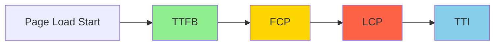

# Лекція 18 Продуктивність та оптимізація

## Вступ до оптимізації веб-додатків

### Чому продуктивність має значення

**Продуктивність** не є опціональною характеристикою сучасних веб-додатків. Дослідження показують пряму кореляцію між швидкістю завантаження та бізнес-метриками. Amazon виявила, що кожні 100ms затримки коштують їм 1% продажів. Google встановила, що затримка в 500ms призводить до 20% зменшення трафіку. Pinterest збільшила конверсію на 15% після покращення продуктивності на 40%.

Користувачі очікують миттєвого відгуку. 53% мобільних користувачів покидають сайт, якщо він завантажується більше 3 секунд. Кожна секунда затримки може призвести до 7% зниження конверсій. Повільні сайти негативно впливають на SEO рейтинги в Google.

Окрім бізнес-метрик, продуктивність впливає на користувацький досвід на фундаментальному рівні. Швидкі інтерфейси створюють відчуття контролю та відповідальності. Повільні додатки викликають фрустрацію та знижують довіру до продукту. Для користувачів з повільним інтернетом продуктивність є питанням доступності.

### Метрики продуктивності

Сучасний веб використовує набір метрик для вимірювання різних аспектів продуктивності.

**Core Web Vitals** від Google є індустріальним стандартом. **Largest Contentful Paint (LCP)** вимірює час до відображення найбільшого видимого елементу контенту. Хороші значення: менше 2.5 секунд. **First Input Delay (FID)** вимірює час від першої взаємодії користувача до відповіді браузера. Хороші значення: менше 100 мілісекунд. **Cumulative Layout Shift (CLS)** вимірює візуальну стабільність контенту. Хороші значення: менше 0.1.

Додаткові важливі метрики включають **Time to First Byte (TTFB)** - час до отримання першого байту від сервера, **First Contentful Paint (FCP)** - час до відображення першого контенту, **Time to Interactive (TTI)** - час до повної інтерактивності сторінки, та **Total Blocking Time (TBT)** - сумарний час, коли main thread був заблокований.



## Bundle Size оптимізація

### Проблема великих бандлів

Сучасні JavaScript додатки часто страждають від надмірного розміру бандлів. Типовий React додаток може мати бандл розміром 500KB-2MB або більше. Це створює множинні проблеми. Більший бандл означає довше завантаження, особливо на повільних з'єднаннях. Parsing та compilation JavaScript займає значний час на мобільних пристроях. Зайві байти коштують гроші користувачам з лімітованим трафіком.

### Аналіз розміру бандлу

Перш ніж оптимізувати, необхідно зрозуміти склад бандлу.

```javascript
// vite.config.js - аналіз бандлу з Rollup
import { defineConfig } from 'vite';
import react from '@vitejs/plugin-react';
import { visualizer } from 'rollup-plugin-visualizer';

export default defineConfig({
    plugins: [
        react(),
        visualizer({
            open: true, // Автоматично відкрити після build
            gzipSize: true,
            brotliSize: true,
            filename: 'dist/stats.html'
        })
    ],
    build: {
        rollupOptions: {
            output: {
                manualChunks: {
                    // Розділення vendor коду
                    'react-vendor': ['react', 'react-dom', 'react-router-dom'],
                    'ui-vendor': ['@headlessui/react', '@heroicons/react'],
                    'utils': ['lodash-es', 'date-fns']
                }
            }
        },
        // Показати warnings для великих chunks
        chunkSizeWarningLimit: 500
    }
});
```

Після build можна проаналізувати результат.

```bash
# Build з аналізом
npm run build

# Перевірка розміру файлів
ls -lh dist/assets/

# Використання source-map-explorer для детального аналізу
npx source-map-explorer dist/assets/*.js
```

### Tree Shaking та Dead Code Elimination

**Tree shaking** видаляє невикористаний код з фінального бандлу.

```javascript
// ❌ Погано: імпорт всієї бібліотеки
import _ from 'lodash';
const result = _.debounce(fn, 300);
// Результат: весь lodash (~70KB) в бандлі

// ✅ Добре: імпорт конкретної функції
import debounce from 'lodash-es/debounce';
const result = debounce(fn, 300);
// Результат: тільки debounce (~2KB) в бандлі

// ❌ Погано: default export не tree-shakable
import moment from 'moment';
moment().format();

// ✅ Добре: використання сучасніх альтернатив
import { format } from 'date-fns';
format(new Date(), 'yyyy-MM-dd');
// date-fns має модульну структуру
```

Для забезпечення tree shaking слід використовувати ES modules замість CommonJS, імпортувати тільки потрібні частини бібліотек, уникати side effects у модулях, використовувати `"sideEffects": false` в package.json для безпечних бібліотек.

### Динамічні імпорти

Динамічні імпорти дозволяють завантажувати код тільки коли він потрібен.

```javascript
// Лінива завантаження компонентів
import { lazy, Suspense } from 'react';

// ❌ Погано: всі компоненти завантажуються одразу
import Dashboard from './pages/Dashboard';
import Settings from './pages/Settings';
import Profile from './pages/Profile';

// ✅ Добре: lazy loading компонентів
const Dashboard = lazy(() => import('./pages/Dashboard'));
const Settings = lazy(() => import('./pages/Settings'));
const Profile = lazy(() => import('./pages/Profile'));

function App() {
    return (
        <Suspense fallback={<LoadingSpinner />}>
            <Routes>
                <Route path="/dashboard" element={<Dashboard />} />
                <Route path="/settings" element={<Settings />} />
                <Route path="/profile" element={<Profile />} />
            </Routes>
        </Suspense>
    );
}
```

Динамічне завантаження утиліт та бібліотек також ефективне.

```javascript
// Динамічне завантаження важких бібліотек
class ChartComponent extends React.Component {
    state = { ChartLib: null };

    async componentDidMount() {
        // Завантажити Chart.js тільки коли компонент монтується
        const { Chart } = await import('chart.js');
        this.setState({ ChartLib: Chart });
    }

    render() {
        const { ChartLib } = this.state;

        if (!ChartLib) {
            return <div>Завантаження графіка...</div>;
        }

        return <canvas ref={this.canvasRef} />;
    }
}

// Динамічне завантаження при взаємодії
async function handleExport() {
    // Завантажити xlsx бібліотеку тільки при експорті
    const XLSX = await import('xlsx');
    const wb = XLSX.utils.book_new();
    // ... логіка експорту
}
```

### Оптимізація залежностей

Вибір правильних залежностей суттєво впливає на розмір бандлу.

```javascript
// Порівняння розмірів популярних бібліотек

// Date манипуляції
// moment.js: ~230KB (весь пакет)
// date-fns: ~13KB (з tree-shaking)
// dayjs: ~2KB (базовий)

// ✅ Рекомендація: date-fns або dayjs
import { format, addDays } from 'date-fns';

// HTTP клієнти
// axios: ~13KB
// fetch (нативний): 0KB
// ky: ~4KB

// ✅ Рекомендація: fetch wrapper або ky для невеликих проєктів
async function fetchData(url) {
    const response = await fetch(url);
    if (!response.ok) throw new Error(response.statusText);
    return response.json();
}

// State management
// Redux + Redux Toolkit: ~15KB
// Zustand: ~1.2KB
// Jotai: ~2.8KB

// ✅ Рекомендація: Zustand або Jotai для невеликих/середніх проєктів
import create from 'zustand';

const useStore = create((set) => ({
    count: 0,
    increment: () => set((state) => ({ count: state.count + 1 }))
}));
```

### Bundle Splitting стратегії

Розумне розділення бандлу покращує caching та parallel завантаження.

```javascript
// vite.config.js - просунутий chunk splitting
export default defineConfig({
    build: {
        rollupOptions: {
            output: {
                manualChunks(id) {
                    // Vendor chunks
                    if (id.includes('node_modules')) {
                        // React ecosystem
                        if (id.includes('react') || id.includes('react-dom')) {
                            return 'react-vendor';
                        }

                        // Routing
                        if (id.includes('react-router')) {
                            return 'router-vendor';
                        }

                        // UI libraries
                        if (id.includes('@headlessui') ||
                            id.includes('@heroicons')) {
                            return 'ui-vendor';
                        }

                        // Large libraries
                        if (id.includes('chart.js') ||
                            id.includes('d3')) {
                            return 'visualization-vendor';
                        }

                        // Everything else
                        return 'vendor';
                    }

                    // Feature-based chunks
                    if (id.includes('/features/dashboard/')) {
                        return 'dashboard';
                    }
                    if (id.includes('/features/settings/')) {
                        return 'settings';
                    }
                }
            }
        }
    }
});
```

## Code Splitting та Lazy Loading

### Route-based Code Splitting

Найпростіший та найефективніший тип code splitting базується на маршрутах.

```javascript
// App.jsx - route-based splitting
import { lazy, Suspense } from 'react';
import { BrowserRouter, Routes, Route } from 'react-router-dom';

// Компоненти завантажуються lazy
const Home = lazy(() => import('./pages/Home'));
const Dashboard = lazy(() => import('./pages/Dashboard'));
const Profile = lazy(() => import('./pages/Profile'));
const Settings = lazy(() => import('./pages/Settings'));
const Admin = lazy(() => import('./pages/Admin'));

// Loading компонент для Suspense
function PageLoader() {
    return (
        <div className="flex items-center justify-center min-h-screen">
            <div className="animate-spin rounded-full h-12 w-12 border-b-2 border-blue-500" />
        </div>
    );
}

function App() {
    return (
        <BrowserRouter>
            <Suspense fallback={<PageLoader />}>
                <Routes>
                    <Route path="/" element={<Home />} />
                    <Route path="/dashboard" element={<Dashboard />} />
                    <Route path="/profile" element={<Profile />} />
                    <Route path="/settings" element={<Settings />} />
                    <Route path="/admin/*" element={<Admin />} />
                </Routes>
            </Suspense>
        </BrowserRouter>
    );
}

export default App;
```

### Component-based Splitting

Окремі компоненти також можуть бути lazy loaded.

```javascript
// Modal з lazy loading
import { lazy, Suspense, useState } from 'react';

const HeavyModal = lazy(() => import('./components/HeavyModal'));

function Page() {
    const [isModalOpen, setIsModalOpen] = useState(false);

    return (
        <div>
            <button onClick={() => setIsModalOpen(true)}>
                Відкрити модалку
            </button>

            {isModalOpen && (
                <Suspense fallback={<div>Завантаження...</div>}>
                    <HeavyModal onClose={() => setIsModalOpen(false)} />
                </Suspense>
            )}
        </div>
    );
}

//Editor з lazy loading
function DocumentPage() {
    const [showEditor, setShowEditor] = useState(false);

    // Lazy load тільки коли потрібно редагувати
    const Editor = lazy(() => import('./components/RichTextEditor'));

    return (
        <div>
            {showEditor ? (
                <Suspense fallback={<EditorSkeleton />}>
                    <Editor />
                </Suspense>
            ) : (
                <button onClick={() => setShowEditor(true)}>
                    Редагувати документ
                </button>
            )}
        </div>
    );
}
```

### Prefetching та Preloading

Розумне prefetching покращує perceived performance.

```javascript
// Prefetching наступної сторінки
import { useEffect } from 'react';
import { Link, useLocation } from 'react-router-dom';

function Navigation() {
    // Prefetch Dashboard коли користувач на Home
    useEffect(() => {
        // Динамічний імпорт для prefetch
        import('./pages/Dashboard');
    }, []);

    return (
        <nav>
            <Link to="/">Головна</Link>
            <Link to="/dashboard">Dashboard</Link>
        </nav>
    );
}

// Prefetch on hover
function SmartLink({ to, children, prefetch = true }) {
    const handleMouseEnter = () => {
        if (prefetch) {
            // Почати завантаження при наведенні
            import(`./pages/${to}`);
        }
    };

    return (
        <Link to={to} onMouseEnter={handleMouseEnter}>
            {children}
        </Link>
    );
}

// Використання Intersection Observer для prefetch
function usePrefetchOnVisible(componentPath) {
    useEffect(() => {
        const observer = new IntersectionObserver((entries) => {
            entries.forEach(entry => {
                if (entry.isIntersecting) {
                    import(componentPath);
                    observer.disconnect();
                }
            });
        });

        const trigger = document.querySelector('[data-prefetch-trigger]');
        if (trigger) observer.observe(trigger);

        return () => observer.disconnect();
    }, [componentPath]);
}
```

### Обробка помилок Lazy Loading

Graceful handling помилок завантаження модулів є критично важливим.

```javascript
// Компонент з retry логікою
import { lazy, Suspense, Component } from 'react';

class LazyLoadErrorBoundary extends Component {
    state = { hasError: false, error: null };

    static getDerivedStateFromError(error) {
        return { hasError: true, error };
    }

    handleRetry = () => {
        this.setState({ hasError: false, error: null });
        // Reload сторінки для повторної спроби
        window.location.reload();
    };

    render() {
        if (this.state.hasError) {
            return (
                <div className="error-container">
                    <h2>Помилка завантаження</h2>
                    <p>{this.state.error?.message}</p>
                    <button onClick={this.handleRetry}>
                        Спробувати знову
                    </button>
                </div>
            );
        }

        return this.props.children;
    }
}

// Використання
function App() {
    const Dashboard = lazy(() => import('./pages/Dashboard'));

    return (
        <LazyLoadErrorBoundary>
            <Suspense fallback={<Loading />}>
                <Dashboard />
            </Suspense>
        </LazyLoadErrorBoundary>
    );
}

// Retry wrapper для import
function lazyWithRetry(componentImport, retries = 3, interval = 1000) {
    return lazy(() => {
        return new Promise((resolve, reject) => {
            componentImport()
                .then(resolve)
                .catch((error) => {
                    if (retries === 0) {
                        reject(error);
                        return;
                    }

                    setTimeout(() => {
                        lazyWithRetry(componentImport, retries - 1, interval)
                            .then(resolve)
                            .catch(reject);
                    }, interval);
                });
        });
    });
}

// Використання
const Dashboard = lazyWithRetry(() => import('./pages/Dashboard'));
```

## Caching стратегії

### Browser Caching

HTTP caching headers контролюють як браузер кешує ресурси.

```javascript
// express.js - налаштування caching headers
import express from 'express';
import path from 'path';

const app = express();

// Статичні assets з агресивним кешуванням
app.use('/assets', express.static(path.join(__dirname, 'dist/assets'), {
    maxAge: '1y', // Кешувати на рік
    immutable: true // Файли ніколи не змінюються
}));

// HTML файли без кешування
app.get('*', (req, res) => {
    res.set({
        'Cache-Control': 'no-cache, no-store, must-revalidate',
        'Pragma': 'no-cache',
        'Expires': '0'
    });
    res.sendFile(path.join(__dirname, 'dist/index.html'));
});
```

Vite автоматично додає hash до імен файлів для cache busting.

```javascript
// vite.config.js
export default defineConfig({
    build: {
        rollupOptions: {
            output: {
                // Hash в іменах файлів для cache busting
                entryFileNames: 'assets/[name].[hash].js',
                chunkFileNames: 'assets/[name].[hash].js',
                assetFileNames: 'assets/[name].[hash].[ext]'
            }
        }
    }
});
```

### Service Workers та PWA

Service Workers надають повний контроль над кешуванням.

```javascript
// service-worker.js
const CACHE_NAME = 'app-v1';
const urlsToCache = [
    '/',
    '/index.html',
    '/assets/main.js',
    '/assets/styles.css'
];

// Install event - кешування критичних ресурсів
self.addEventListener('install', (event) => {
    event.waitUntil(
        caches.open(CACHE_NAME)
            .then((cache) => cache.addAll(urlsToCache))
    );
});

// Fetch event - стратегія кешування
self.addEventListener('fetch', (event) => {
    event.respondWith(
        caches.match(event.request)
            .then((response) => {
                // Cache hit - повернути з кешу
                if (response) {
                    return response;
                }

                // Cache miss - завантажити з мережі
                return fetch(event.request).then((response) => {
                    // Не кешувати non-success responses
                    if (!response || response.status !== 200 ||
                        response.type === 'error') {
                        return response;
                    }

                    // Клонувати response для кешування
                    const responseToCache = response.clone();

                    caches.open(CACHE_NAME)
                        .then((cache) => {
                            cache.put(event.request, responseToCache);
                        });

                    return response;
                });
            })
    );
});

// Activate event - очищення старих кешів
self.addEventListener('activate', (event) => {
    event.waitUntil(
        caches.keys().then((cacheNames) => {
            return Promise.all(
                cacheNames
                    .filter((name) => name !== CACHE_NAME)
                    .map((name) => caches.delete(name))
            );
        })
    );
});
```

Різні стратегії кешування для різних типів контенту.

```javascript
// Просунуті caching стратегії
const CACHE_STRATEGIES = {
    // Cache First - для статичних assets
    cacheFirst: async (request) => {
        const cached = await caches.match(request);
        if (cached) return cached;

        const response = await fetch(request);
        const cache = await caches.open(CACHE_NAME);
        cache.put(request, response.clone());
        return response;
    },

    // Network First - для динамічного контенту
    networkFirst: async (request) => {
        try {
            const response = await fetch(request);
            const cache = await caches.open(CACHE_NAME);
            cache.put(request, response.clone());
            return response;
        } catch (error) {
            const cached = await caches.match(request);
            if (cached) return cached;
            throw error;
        }
    },

    // Stale While Revalidate - баланс між швидкістю та свіжістю
    staleWhileRevalidate: async (request) => {
        const cached = await caches.match(request);

        const fetchPromise = fetch(request).then((response) => {
            const cache = caches.open(CACHE_NAME);
            cache.then((c) => c.put(request, response.clone()));
            return response;
        });

        return cached || fetchPromise;
    }
};

self.addEventListener('fetch', (event) => {
    const url = new URL(event.request.url);

    // Вибір стратегії залежно від типу ресурсу
    if (url.pathname.startsWith('/api/')) {
        event.respondWith(CACHE_STRATEGIES.networkFirst(event.request));
    } else if (url.pathname.match(/\.(js|css|png|jpg|svg)$/)) {
        event.respondWith(CACHE_STRATEGIES.cacheFirst(event.request));
    } else {
        event.respondWith(CACHE_STRATEGIES.staleWhileRevalidate(event.request));
    }
});
```

### Memory Caching у React

React Query та подібні бібліотеки надають in-memory caching для API запитів.

```javascript
// React Query setup з caching
import { QueryClient, QueryClientProvider, useQuery } from '@tanstack/react-query';

const queryClient = new QueryClient({
    defaultOptions: {
        queries: {
            staleTime: 5 * 60 * 1000, // 5 хвилин
            cacheTime: 10 * 60 * 1000, // 10 хвилин
            retry: 1,
            refetchOnWindowFocus: false
        }
    }
});

function App() {
    return (
        <QueryClientProvider client={queryClient}>
            <YourApp />
        </QueryClientProvider>
    );
}

// Використання з автоматичним кешуванням
function UserProfile({ userId }) {
    const { data, isLoading, error } = useQuery({
        queryKey: ['user', userId],
        queryFn: () => fetch(`/api/users/${userId}`).then(r => r.json()),
        staleTime: 5 * 60 * 1000 // Кеш валідний 5 хвилин
    });

    if (isLoading) return <div>Завантаження...</div>;
    if (error) return <div>Помилка: {error.message}</div>;

    return <div>{data.name}</div>;
}

// Prefetching для покращення UX
function UserList() {
    const queryClient = useQueryClient();

    const handleMouseEnter = (userId) => {
        // Prefetch user data при наведенні
        queryClient.prefetchQuery({
            queryKey: ['user', userId],
            queryFn: () => fetch(`/api/users/${userId}`).then(r => r.json())
        });
    };

    return (
        <ul>
            {users.map(user => (
                <li
                    key={user.id}
                    onMouseEnter={() => handleMouseEnter(user.id)}
                >
                    <Link to={`/users/${user.id}`}>{user.name}</Link>
                </li>
            ))}
        </ul>
    );
}
```

### Local Storage та IndexedDB

Для великих обсягів даних або офлайн підтримки використовуємо IndexedDB.

```javascript
// Wrapper для IndexedDB
class CacheDB {
    constructor(dbName = 'AppCache', version = 1) {
        this.dbName = dbName;
        this.version = version;
        this.db = null;
    }

    async init() {
        return new Promise((resolve, reject) => {
            const request = indexedDB.open(this.dbName, this.version);

            request.onerror = () => reject(request.error);
            request.onsuccess = () => {
                this.db = request.result;
                resolve(this.db);
            };

            request.onupgradeneeded = (event) => {
                const db = event.target.result;

                if (!db.objectStoreNames.contains('cache')) {
                    const store = db.createObjectStore('cache', { keyPath: 'key' });
                    store.createIndex('timestamp', 'timestamp', { unique: false });
                }
            };
        });
    }

    async set(key, value, ttl = 3600000) {
        if (!this.db) await this.init();

        return new Promise((resolve, reject) => {
            const transaction = this.db.transaction(['cache'], 'readwrite');
            const store = transaction.objectStore('cache');

            const item = {
                key,
                value,
                timestamp: Date.now(),
                expires: Date.now() + ttl
            };

            const request = store.put(item);
            request.onsuccess = () => resolve(true);
            request.onerror = () => reject(request.error);
        });
    }

    async get(key) {
        if (!this.db) await this.init();

        return new Promise((resolve, reject) => {
            const transaction = this.db.transaction(['cache'], 'readonly');
            const store = transaction.objectStore('cache');
            const request = store.get(key);

            request.onsuccess = () => {
                const item = request.result;

                if (!item) {
                    resolve(null);
                    return;
                }

                // Перевірка expiration
                if (Date.now() > item.expires) {
                    this.delete(key);
                    resolve(null);
                    return;
                }

                resolve(item.value);
            };

            request.onerror = () => reject(request.error);
        });
    }

    async delete(key) {
        if (!this.db) await this.init();

        return new Promise((resolve, reject) => {
            const transaction = this.db.transaction(['cache'], 'readwrite');
            const store = transaction.objectStore('cache');
            const request = store.delete(key);

            request.onsuccess = () => resolve(true);
            request.onerror = () => reject(request.error);
        });
    }

    async clear() {
        if (!this.db) await this.init();

        return new Promise((resolve, reject) => {
            const transaction = this.db.transaction(['cache'], 'readwrite');
            const store = transaction.objectStore('cache');
            const request = store.clear();

            request.onsuccess = () => resolve(true);
            request.onerror = () => reject(request.error);
        });
    }
}

// Використання
const cache = new CacheDB();

async function fetchUserData(userId) {
    const cacheKey = `user_${userId}`;

    // Спробувати отримати з кешу
    const cached = await cache.get(cacheKey);
    if (cached) {
        console.log('Завантажено з кешу');
        return cached;
    }

    // Завантажити з API
    const response = await fetch(`/api/users/${userId}`);
    const data = await response.json();

    // Зберегти в кеш на 1 годину
    await cache.set(cacheKey, data, 3600000);

    return data;
}
```

## Performance Моніторинг

### Web Vitals вимірювання

Впровадження моніторингу Core Web Vitals для production.

```javascript
// utils/webVitals.js
import { onCLS, onFID, onLCP, onFCP, onTTFB } from 'web-vitals';

class PerformanceMonitor {
    constructor(options = {}) {
        this.endpoint = options.endpoint || '/api/metrics';
        this.sampleRate = options.sampleRate || 1; // 100% за замовчуванням
        this.metrics = [];
        this.batchSize = 10;
        this.batchInterval = 5000; // 5 секунд

        this.initWebVitals();
        this.setupBatching();
    }

    initWebVitals() {
        // Core Web Vitals
        onCLS(this.handleMetric.bind(this));
        onFID(this.handleMetric.bind(this));
        onLCP(this.handleMetric.bind(this));

        // Додаткові метрики
        onFCP(this.handleMetric.bind(this));
        onTTFB(this.handleMetric.bind(this));
    }

    handleMetric(metric) {
        // Sample rate для зменшення навантаження
        if (Math.random() > this.sampleRate) return;

        const data = {
            name: metric.name,
            value: metric.value,
            rating: metric.rating, // 'good' | 'needs-improvement' | 'poor'
            delta: metric.delta,
            id: metric.id,
            navigationType: metric.navigationType,
            url: window.location.href,
            userAgent: navigator.userAgent,
            timestamp: Date.now()
        };

        this.metrics.push(data);

        // Відправити якщо досягли batch size
        if (this.metrics.length >= this.batchSize) {
            this.sendMetrics();
        }
    }

    setupBatching() {
        // Відправляти метрики кожні N секунд
        setInterval(() => {
            if (this.metrics.length > 0) {
                this.sendMetrics();
            }
        }, this.batchInterval);

        // Відправити при unload
        window.addEventListener('beforeunload', () => {
            if (this.metrics.length > 0) {
                this.sendMetrics(true);
            }
        });
    }

    sendMetrics(useBeacon = false) {
        const data = {
            metrics: [...this.metrics],
            session: this.getSessionId(),
            page: window.location.pathname
        };

        if (useBeacon && navigator.sendBeacon) {
            navigator.sendBeacon(this.endpoint, JSON.stringify(data));
        } else {
            fetch(this.endpoint, {
                method: 'POST',
                headers: { 'Content-Type': 'application/json' },
                body: JSON.stringify(data),
                keepalive: true
            }).catch(console.error);
        }

        this.metrics = [];
    }

    getSessionId() {
        let sessionId = sessionStorage.getItem('performanceSessionId');
        if (!sessionId) {
            sessionId = `session_${Date.now()}_${Math.random()}`;
            sessionStorage.setItem('performanceSessionId', sessionId);
        }
        return sessionId;
    }
}

// Ініціалізація
const monitor = new PerformanceMonitor({
    endpoint: '/api/metrics',
    sampleRate: 0.1 // Моніторити 10% користувачів
});

export default monitor;
```

### Custom Performance Metrics

Вимірювання специфічних для додатку метрик.

```javascript
// Custom performance markers
class CustomMetrics {
    static markFeatureStart(featureName) {
        performance.mark(`${featureName}-start`);
    }

    static markFeatureEnd(featureName) {
        performance.mark(`${featureName}-end`);

        try {
            performance.measure(
                featureName,
                `${featureName}-start`,
                `${featureName}-end`
            );

            const measure = performance.getEntriesByName(featureName)[0];

            // Відправити метрику
            this.sendCustomMetric({
                name: featureName,
                duration: measure.duration,
                timestamp: Date.now()
            });

            // Очистити marks
            performance.clearMarks(`${featureName}-start`);
            performance.clearMarks(`${featureName}-end`);
            performance.clearMeasures(featureName);
        } catch (error) {
            console.error('Error measuring performance:', error);
        }
    }

    static async measureAsync(name, fn) {
        this.markFeatureStart(name);
        try {
            const result = await fn();
            this.markFeatureEnd(name);
            return result;
        } catch (error) {
            this.markFeatureEnd(name);
            throw error;
        }
    }

    static sendCustomMetric(metric) {
        // Відправка на сервер або до analytics
        if (window.analytics) {
            window.analytics.track('Performance Metric', metric);
        }
    }
}

// Використання в компонентах
function DataDashboard() {
    useEffect(() => {
        CustomMetrics.markFeatureStart('dashboard-load');

        // Завантаження даних
        loadDashboardData().then(() => {
            CustomMetrics.markFeatureEnd('dashboard-load');
        });
    }, []);

    const handleExport = async () => {
        await CustomMetrics.measureAsync('export-data', async () => {
            const data = await fetchDataForExport();
            await generateExport(data);
        });
    };

    return <div>Dashboard content</div>;
}
```

### React Profiler для компонентів

React Profiler API дозволяє вимірювати render performance.

```javascript
// Profiler wrapper
import { Profiler } from 'react';

function onRenderCallback(
    id, // "id" prop дерева Profiler
    phase, // "mount" або "update"
    actualDuration, // час на render
    baseDuration, // оцінка часу без мемоізації
    startTime, // коли React почав render
    commitTime, // коли React закомітив update
    interactions // Set взаємодій, що призвели до render
) {
    // Логування або відправка метрик
    console.log({
        component: id,
        phase,
        actualDuration,
        baseDuration
    });

    // Якщо render займає забагато часу, відправити warning
    if (actualDuration > 16) { // Більше одного frame (60fps)
        console.warn(`Повільний render: ${id} took ${actualDuration}ms`);

        // Відправити метрику
        sendPerformanceMetric({
            type: 'slow-render',
            component: id,
            duration: actualDuration,
            phase
        });
    }
}

// Обгортання компонента
function App() {
    return (
        <Profiler id="App" onRender={onRenderCallback}>
            <Dashboard />
        </Profiler>
    );
}

// Вимірювання конкретного компонента
function Dashboard() {
    return (
        <div>
            <Profiler id="DataTable" onRender={onRenderCallback}>
                <DataTable />
            </Profiler>
            <Profiler id="Charts" onRender={onRenderCallback}>
                <Charts />
            </Profiler>
        </div>
    );
}
```

### Performance Observer API

Моніторинг різних аспектів продуктивності браузера.

```javascript
// Comprehensive performance monitoring
class BrowserPerformanceMonitor {
    constructor() {
        this.observers = [];
        this.setupObservers();
    }

    setupObservers() {
        // Long Tasks - виявлення блокуючих операцій
        if ('PerformanceObserver' in window) {
            const longTaskObserver = new PerformanceObserver((list) => {
                for (const entry of list.getEntries()) {
                    if (entry.duration > 50) { // Більше 50ms
                        console.warn('Long task detected:', {
                            duration: entry.duration,
                            startTime: entry.startTime,
                            name: entry.name
                        });

                        this.reportLongTask(entry);
                    }
                }
            });

            try {
                longTaskObserver.observe({ entryTypes: ['longtask'] });
                this.observers.push(longTaskObserver);
            } catch (e) {
                console.log('Long task observer not supported');
            }

            // Layout Shifts
            const layoutShiftObserver = new PerformanceObserver((list) => {
                for (const entry of list.getEntries()) {
                    if (entry.hadRecentInput) continue; // Ігнорувати user-initiated shifts

                    console.log('Layout shift:', {
                        value: entry.value,
                        sources: entry.sources
                    });

                    this.reportLayoutShift(entry);
                }
            });

            try {
                layoutShiftObserver.observe({ entryTypes: ['layout-shift'] });
                this.observers.push(layoutShiftObserver);
            } catch (e) {
                console.log('Layout shift observer not supported');
            }

            // Resource Timing
            const resourceObserver = new PerformanceObserver((list) => {
                for (const entry of list.getEntries()) {
                    // Виявлення повільних ресурсів
                    if (entry.duration > 1000) { // Більше 1 секунди
                        console.warn('Slow resource:', {
                            name: entry.name,
                            duration: entry.duration,
                            size: entry.transferSize
                        });

                        this.reportSlowResource(entry);
                    }
                }
            });

            try {
                resourceObserver.observe({ entryTypes: ['resource'] });
                this.observers.push(resourceObserver);
            } catch (e) {
                console.log('Resource observer not supported');
            }
        }
    }

    reportLongTask(entry) {
        fetch('/api/performance/long-task', {
            method: 'POST',
            headers: { 'Content-Type': 'application/json' },
            body: JSON.stringify({
                duration: entry.duration,
                startTime: entry.startTime,
                url: window.location.href,
                timestamp: Date.now()
            })
        }).catch(console.error);
    }

    reportLayoutShift(entry) {
        fetch('/api/performance/layout-shift', {
            method: 'POST',
            headers: { 'Content-Type': 'application/json' },
            body: JSON.stringify({
                value: entry.value,
                url: window.location.href,
                timestamp: Date.now()
            })
        }).catch(console.error);
    }

    reportSlowResource(entry) {
        fetch('/api/performance/slow-resource', {
            method: 'POST',
            headers: { 'Content-Type': 'application/json' },
            body: JSON.stringify({
                name: entry.name,
                duration: entry.duration,
                size: entry.transferSize,
                type: entry.initiatorType,
                timestamp: Date.now()
            })
        }).catch(console.error);
    }

    disconnect() {
        this.observers.forEach(observer => observer.disconnect());
    }
}

// Ініціалізація
const perfMonitor = new BrowserPerformanceMonitor();
```

## SEO оптимізація для SPA

### Server-Side Rendering (SSR)

SSR забезпечує контент для пошукових систем та покращує initial load.

```javascript
// Базовий SSR setup з Express та React
import express from 'express';
import React from 'react';
import { renderToString } from 'react-dom/server';
import { StaticRouter } from 'react-router-dom/server';
import App from './App';

const app = express();

app.use(express.static('dist'));

app.get('*', (req, res) => {
    const context = {};

    // Render React app на сервері
    const html = renderToString(
        <StaticRouter location={req.url} context={context}>
            <App />
        </StaticRouter>
    );

    // HTML template
    const fullHtml = `
        <!DOCTYPE html>
        <html lang="uk">
        <head>
            <meta charset="UTF-8">
            <meta name="viewport" content="width=device-width, initial-scale=1.0">
            <title>Мій додаток</title>
            <link rel="stylesheet" href="/assets/styles.css">
        </head>
        <body>
            <div id="root">${html}</div>
            <script src="/assets/main.js"></script>
        </body>
        </html>
    `;

    res.send(fullHtml);
});

app.listen(3000);
```

### Static Site Generation (SSG)

Pre-rendering сторінок на етапі build для максимальної продуктивності.

```javascript
// Script для генерації статичних сторінок
import React from 'react';
import { renderToStaticMarkup } from 'react-dom/server';
import { StaticRouter } from 'react-router-dom/server';
import fs from 'fs';
import path from 'path';
import App from './App';

const routes = [
    '/',
    '/about',
    '/products',
    '/contact'
];

function generateStaticPages() {
    routes.forEach(route => {
        const html = renderToStaticMarkup(
            <StaticRouter location={route}>
                <App />
            </StaticRouter>
        );

        const fullHtml = `
            <!DOCTYPE html>
            <html lang="uk">
            <head>
                <meta charset="UTF-8">
                <title>Сторінка</title>
            </head>
            <body>
                <div id="root">${html}</div>
            </body>
            </html>
        `;

        const fileName = route === '/' ? 'index.html' : `${route}/index.html`;
        const filePath = path.join(__dirname, 'dist', fileName);

        fs.mkdirSync(path.dirname(filePath), { recursive: true });
        fs.writeFileSync(filePath, fullHtml);

        console.log(`Generated: ${fileName}`);
    });
}

generateStaticPages();
```

### Meta Tags та Structured Data

Динамічні meta tags для кращої SEO.

```javascript
// React Helmet для управління meta tags
import { Helmet } from 'react-helmet-async';

function ProductPage({ product }) {
    const structuredData = {
        '@context': 'https://schema.org',
        '@type': 'Product',
        'name': product.name,
        'description': product.description,
        'image': product.image,
        'offers': {
            '@type': 'Offer',
            'price': product.price,
            'priceCurrency': 'UAH',
            'availability': 'https://schema.org/InStock'
        }
    };

    return (
        <>
            <Helmet>
                <title>{product.name} | Мій Магазин</title>
                <meta name="description" content={product.description} />

                {/* Open Graph */}
                <meta property="og:title" content={product.name} />
                <meta property="og:description" content={product.description} />
                <meta property="og:image" content={product.image} />
                <meta property="og:type" content="product" />

                {/* Twitter Card */}
                <meta name="twitter:card" content="summary_large_image" />
                <meta name="twitter:title" content={product.name} />
                <meta name="twitter:description" content={product.description} />
                <meta name="twitter:image" content={product.image} />

                {/* Structured Data */}
                <script type="application/ld+json">
                    {JSON.stringify(structuredData)}
                </script>
            </Helmet>

            <div className="product">
                <h1>{product.name}</h1>
                <p>{product.description}</p>
                <span>{product.price} грн</span>
            </div>
        </>
    );
}
```

### Sitemap Generation

Автоматична генерація sitemap для пошукових систем.

```javascript
// scripts/generate-sitemap.js
import fs from 'fs';
import path from 'path';

const baseUrl = 'https://example.com';

const routes = [
    { url: '/', changefreq: 'daily', priority: 1.0 },
    { url: '/about', changefreq: 'monthly', priority: 0.8 },
    { url: '/products', changefreq: 'weekly', priority: 0.9 },
    { url: '/contact', changefreq: 'monthly', priority: 0.7 }
];

// Можна додати динамічні маршрути з бази даних
async function getDynamicRoutes() {
    // const products = await fetchProducts();
    // return products.map(p => ({
    //     url: `/products/${p.slug}`,
    //     changefreq: 'weekly',
    //     priority: 0.8
    // }));
    return [];
}

async function generateSitemap() {
    const dynamicRoutes = await getDynamicRoutes();
    const allRoutes = [...routes, ...dynamicRoutes];

    const sitemap = `<?xml version="1.0" encoding="UTF-8"?>
<urlset xmlns="http://www.sitemaps.org/schemas/sitemap/0.9">
${allRoutes.map(route => `  <url>
    <loc>${baseUrl}${route.url}</loc>
    <changefreq>${route.changefreq}</changefreq>
    <priority>${route.priority}</priority>
  </url>`).join('\n')}
</urlset>`;

    fs.writeFileSync(
        path.join(__dirname, '../public/sitemap.xml'),
        sitemap
    );

    console.log('Sitemap generated successfully!');
}

generateSitemap();
```

## Progressive Web Apps (PWA)

### PWA основи та переваги

**Progressive Web Apps** поєднують найкраще з веб та нативних застосунків. Можливість встановлення на домашній екран створює app-like experience. Офлайн функціональність через Service Workers забезпечує доступність навіть без з'єднання. Push-сповіщення підвищують engagement користувачів. Швидке завантаження та responsive design покращують UX.

### Web App Manifest

Manifest файл визначає як PWA виглядає та поводиться.

```json
{
  "name": "Мій Веб-Додаток",
  "short_name": "МійДодаток",
  "description": "Опис мого чудового додатку",
  "start_url": "/",
  "display": "standalone",
  "background_color": "#ffffff",
  "theme_color": "#3b82f6",
  "orientation": "portrait-primary",
  "icons": [
    {
      "src": "/icons/icon-72x72.png",
      "sizes": "72x72",
      "type": "image/png",
      "purpose": "any maskable"
    },
    {
      "src": "/icons/icon-96x96.png",
      "sizes": "96x96",
      "type": "image/png",
      "purpose": "any maskable"
    },
    {
      "src": "/icons/icon-128x128.png",
      "sizes": "128x128",
      "type": "image/png",
      "purpose": "any maskable"
    },
    {
      "src": "/icons/icon-144x144.png",
      "sizes": "144x144",
      "type": "image/png",
      "purpose": "any maskable"
    },
    {
      "src": "/icons/icon-152x152.png",
      "sizes": "152x152",
      "type": "image/png",
      "purpose": "any maskable"
    },
    {
      "src": "/icons/icon-192x192.png",
      "sizes": "192x192",
      "type": "image/png",
      "purpose": "any maskable"
    },
    {
      "src": "/icons/icon-384x384.png",
      "sizes": "384x384",
      "type": "image/png",
      "purpose": "any maskable"
    },
    {
      "src": "/icons/icon-512x512.png",
      "sizes": "512x512",
      "type": "image/png",
      "purpose": "any maskable"
    }
  ],
  "screenshots": [
    {
      "src": "/screenshots/home.png",
      "sizes": "540x720",
      "type": "image/png"
    },
    {
      "src": "/screenshots/dashboard.png",
      "sizes": "540x720",
      "type": "image/png"
    }
  ],
  "shortcuts": [
    {
      "name": "Dashboard",
      "short_name": "Dashboard",
      "description": "Перейти до dashboard",
      "url": "/dashboard",
      "icons": [
        {
          "src": "/icons/dashboard.png",
          "sizes": "96x96"
        }
      ]
    }
  ]
}
```

### Install Prompt

Власний UI для встановлення PWA.

```javascript
// Custom install prompt
function InstallPrompt() {
    const [deferredPrompt, setDeferredPrompt] = useState(null);
    const [showInstallPrompt, setShowInstallPrompt] = useState(false);

    useEffect(() => {
        // Перехоплення браузерного prompt
        window.addEventListener('beforeinstallprompt', (e) => {
            e.preventDefault();
            setDeferredPrompt(e);
            setShowInstallPrompt(true);
        });

        // Відстежити успішну установку
        window.addEventListener('appinstalled', () => {
            console.log('PWA встановлено успішно');
            setShowInstallPrompt(false);
            setDeferredPrompt(null);
        });
    }, []);

    const handleInstallClick = async () => {
        if (!deferredPrompt) return;

        // Показати native install prompt
        deferredPrompt.prompt();

        // Дочекатися вибору користувача
        const { outcome } = await deferredPrompt.userChoice;
        console.log(`User ${outcome} the install prompt`);

        setDeferredPrompt(null);
        setShowInstallPrompt(false);
    };

    if (!showInstallPrompt) return null;

    return (
        <div className="fixed bottom-4 left-4 right-4 bg-white p-4 rounded-lg shadow-lg border">
            <div className="flex items-start gap-4">
                
                <div className="flex-1">
                    <h3 className="font-semibold text-lg">Встановити додаток</h3>
                    <p className="text-sm text-gray-600">
                        Встановіть наш додаток для швидкого доступу та офлайн роботи
                    </p>
                </div>
            </div>
            <div className="flex gap-2 mt-4">
                <button
                    onClick={handleInstallClick}
                    className="flex-1 bg-blue-500 text-white px-4 py-2 rounded-lg hover:bg-blue-600"
                >
                    Встановити
                </button>
                <button
                    onClick={() => setShowInstallPrompt(false)}
                    className="px-4 py-2 text-gray-600 hover:text-gray-800"
                >
                    Не зараз
                </button>
            </div>
        </div>
    );
}
```

### Офлайн функціональність

Робота додатку без інтернет-з'єднання.

```javascript
// Offline indicator component
function OfflineIndicator() {
    const [isOnline, setIsOnline] = useState(navigator.onLine);

    useEffect(() => {
        const handleOnline = () => setIsOnline(true);
        const handleOffline = () => setIsOnline(false);

        window.addEventListener('online', handleOnline);
        window.addEventListener('offline', handleOffline);

        return () => {
            window.removeEventListener('online', handleOnline);
            window.removeEventListener('offline', handleOffline);
        };
    }, []);

    if (isOnline) return null;

    return (
        <div className="fixed top-0 left-0 right-0 bg-yellow-500 text-white px-4 py-2 text-center">
            Ви офлайн. Деякі функції можуть бути недоступні.
        </div>
    );
}

// Offline data sync
class OfflineDataSync {
    constructor() {
        this.queue = [];
        this.isOnline = navigator.onLine;
        this.setupListeners();
    }

    setupListeners() {
        window.addEventListener('online', () => {
            this.isOnline = true;
            this.processQueue();
        });

        window.addEventListener('offline', () => {
            this.isOnline = false;
        });
    }

    async makeRequest(url, options) {
        if (this.isOnline) {
            try {
                const response = await fetch(url, options);
                return response;
            } catch (error) {
                // Додати до черги якщо помилка мережі
                this.queueRequest(url, options);
                throw error;
            }
        } else {
            // Офлайн - додати до черги
            this.queueRequest(url, options);
            throw new Error('Offline - request queued');
        }
    }

    queueRequest(url, options) {
        this.queue.push({ url, options, timestamp: Date.now() });
        this.saveQueue();
    }

    async processQueue() {
        const queue = [...this.queue];
        this.queue = [];

        for (const request of queue) {
            try {
                await fetch(request.url, request.options);
                console.log('Synced offline request:', request.url);
            } catch (error) {
                console.error('Failed to sync:', error);
                this.queue.push(request); // Повернути назад якщо помилка
            }
        }

        this.saveQueue();
    }

    saveQueue() {
        localStorage.setItem('offline_queue', JSON.stringify(this.queue));
    }

    loadQueue() {
        const saved = localStorage.getItem('offline_queue');
        if (saved) {
            this.queue = JSON.parse(saved);
        }
    }
}

const dataSync = new OfflineDataSync();
export default dataSync;
```

## Висновки та найкращі практики

### Фундаментальні принципи оптимізації

Продуктивність веб-додатків не є одноразовим завданням, а постійним процесом моніторингу та покращення. Кожен кілобайт JavaScript коштує користувачам часу та грошей, особливо на мобільних пристроях з повільним інтернетом. Розуміння того, як браузер обробляє код, дозволяє приймати усвідомлені рішення про архітектуру додатку.

Bundle size оптимізація починається з аналізу. Використання інструментів як webpack-bundle-analyzer або rollup-visualizer виявляє проблемні місця. Tree shaking працює тільки з ES modules, тому використання CommonJS автоматично збільшує розмір бандлу. Вибір легких альтернатив важких бібліотек може зменшити розмір додатку на сотні кілобайт.

### Code Splitting як стандарт

Route-based code splitting має бути стандартною практикою для будь-якого SPA. Користувачі не повинні завантажувати код для сторінок, які вони можливо ніколи не відвідають. Lazy loading компонентів дозволяє відкласти завантаження важких частин інтерфейсу до моменту їх фактичного використання. Prefetching та preloading створюють ілюзію миттєвості через завантаження ресурсів у фоні.

### Стратегічне кешування

Правильна стратегія кешування може трансформувати користувацький досвід. Browser caching з правильними headers забезпечує, що статичні ресурси завантажуються тільки один раз. Service Workers надають повний контроль над мережевими запитами, дозволяючи реалізувати складні стратегії як stale-while-revalidate. In-memory caching через бібліотеки як React Query зменшує непотрібні мережеві запити.

### Моніторинг як основа

Неможливо оптимізувати те, що не вимірюється. Core Web Vitals надають стандартизований спосіб вимірювання користувацького досвіду. Custom performance metrics дозволяють відстежувати специфічні для додатку аспекти продуктивності. Real User Monitoring показує як додаток працює для реальних користувачів в різних умовах, що часто відрізняється від synthetic tests.

### SEO для SPA

Single Page Applications мають унікальні SEO виклики. Server-Side Rendering вирішує проблему індексації, але додає складності до архітектури. Static Site Generation є золотою серединою для контенту, що рідко змінюється. Динамічні meta tags та structured data забезпечують, що соціальні мережі та пошукові системи правильно розуміють контент.

### PWA як майбутнє

Progressive Web Apps об'єднують найкраще з веб та нативних додатків. Офлайн функціональність через Service Workers робить додатки надійними навіть при поганому з'єднанні. Install capability створює app-like experience без необхідності проходити через app stores. Push notifications підвищують engagement, але мають використовуватися відповідально.

### Практичні рекомендації

Почніть з вимірювання current performance baseline. Використовуйте Lighthouse для аудиту та виявлення проблем. Впроваджуйте code splitting на рівні маршрутів як мінімум. Налаштуйте aggressive caching для статичних assets з hash-based invalidation. Моніторте real user metrics в production через Web Vitals. Оптимізуйте images через compression та modern formats як WebP та AVIF. Мінімізуйте JavaScript через tree shaking та вибір легких бібліотек. Впроваджуйте Service Worker для базового ofline функціоналу.

Продуктивність є фічею, яку користувачі відчувають безпосередньо. Інвестиції в оптимізацію окупаються через кращі бізнес-метрики, вищу конверсію та задоволеність користувачів. Сучасні інструменти та практики роблять створення швидких веб-додатків досяжною ціллю для кожного розробника.
