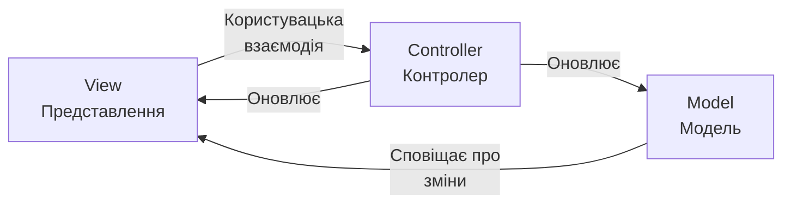
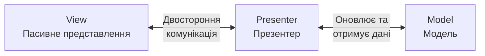
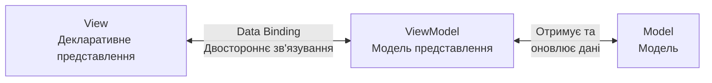
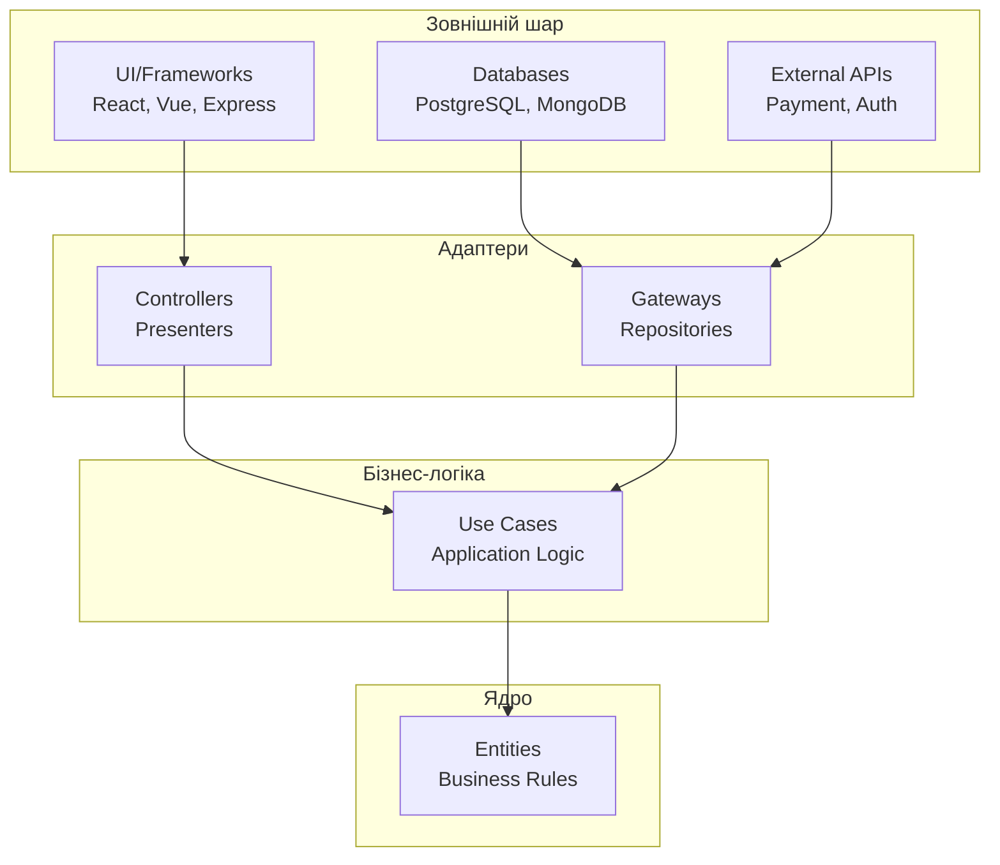
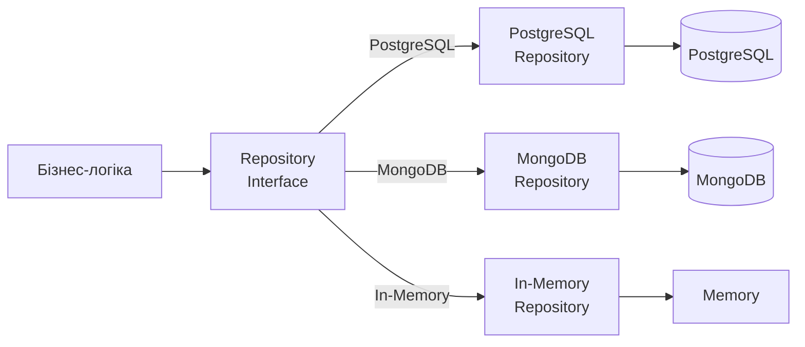

# Лекція 21. Архітектурні паттерни у веброзробці

## Вступ до архітектурних паттернів

### Що таке архітектурний паттерн

**Архітектурний паттерн** — це перевірене часом рішення для організації коду та структурування вебдодатків, яке визначає фундаментальну структуру системи, її компоненти, їхні взаємодії та принципи проектування. На відміну від дизайн-паттернів, які вирішують локальні проблеми в межах окремих модулів, архітектурні паттерни визначають глобальну структуру всього застосунку.

Архітектурний паттерн відповідає на ключові питання:

- Як організувати код для забезпечення масштабованості?
- Як розділити відповідальність між компонентами системи?
- Як забезпечити тестованість та підтримуваність коду?
- Як зменшити зв'язаність між модулями?
- Як забезпечити повторне використання коду?

### Чому архітектура важлива для веб-додатків

Сучасні вебдодатки еволюціонували від простих статичних сторінок до складних багатофункціональних систем, які можуть містити сотні тисяч рядків коду. Без продуманої архітектури такі системи швидко стають неконтрольованими, що призводить до:

**Технічного боргу**, коли швидкі рішення без урахування архітектури накопичуються та ускладнюють подальший розвиток. Кожна нова функція потребує все більше часу на реалізацію, а ризик введення нових помилок зростає експоненційно.

**Проблем масштабування**, коли система не може ефективно обробляти зростаюче навантаження або додавання нових функцій вимагає переписування значних частин коду. Відсутність чіткої архітектури робить неможливим горизонтальне масштабування окремих компонентів системи.

**Труднощів з підтримкою**, коли розробники витрачають більше часу на розуміння існуючого коду, ніж на написання нового. Виправлення однієї помилки може спричинити появу кількох інших через непередбачувані залежності між компонентами.

Правильно обрана архітектура забезпечує:

- Чітке розділення відповідальності між компонентами;
- Зменшення зв'язаності та збільшення згуртованості коду;
- Легкість тестування окремих частин системи;
- Можливість паралельної розробки різних модулів;
- Гнучкість при зміні вимог та технологій;
- Повторне використання компонентів.

### Еволюція архітектурних підходів у вебі

Історія веброзробки демонструє постійну еволюцію підходів до організації коду, відображаючи зростання складності вебдодатків та накопичення досвіду спільноти розробників.

**Початковий етап (1990-ті роки)** характеризувався монолітними скриптами, де HTML, логіка та дані змішувалися в одному файлі. Типовий PHP скрипт того часу містив запити до бази даних, бізнес-логіку та HTML верстку в одному місці, що робило код важко підтримуваним навіть для невеликих проєктів.

**Перехід до MVC (2000-ні роки)** ознаменував важливий крок вперед. Фреймворки як Ruby on Rails популяризували концепцію розділення коду на моделі, представлення та контролери. Це дозволило організувати код більш структуровано, але класична реалізація MVC мала свої обмеження в контексті складних користувацьких інтерфейсів.

**Ера SPA та компонентів (2010-ті роки)** привнесла нові виклики. З появою Angular, React та Vue постала потреба в нових архітектурних підходах, адаптованих до реактивного програмування та компонентної моделі. З'явилися варіації класичних паттернів, такі як Flux, Redux, MVI.

**Сучасний етап (2020-ті роки)** характеризується прагненням до простоти та прагматизму. Розробники поєднують кращі ідеї з різних паттернів, адаптуючи їх до конкретних потреб проєкту. Акцент зміщується на практичність, типобезпеку та інструменти розробника.

## MVC, MVP, MVVM паттерни у веб-додатках

### Model-View-Controller (MVC)

**MVC** є одним з найстаріших та найвпливовіших архітектурних паттернів, який розділяє додаток на три взаємопов'язані компоненти, кожен з яких має чітко визначену відповідальність.

#### Компоненти MVC паттерну

**Model (Модель)** відповідає за дані та бізнес-логіку застосунку. Модель інкапсулює стан додатку та правила його зміни, незалежно від способу відображення цих даних. Вона сповіщає підписників про зміни свого стану, але не знає про конкретні представлення, які використовують ці дані.

Модель може включати:

- Структури даних та їх валідацію;
- Бізнес-правила та обчислення;
- Взаємодію з базою даних або API;
- Механізми сповіщення про зміни.

**View (Представлення)** відповідає за відображення даних користувачу та прийняття користувацьких дій. Представлення відображає стан моделі та оновлюється при його зміні. Воно делегує обробку користувацьких дій контролеру, не містячи бізнес-логіки.

Представлення відповідає за:

- Візуалізацію даних моделі;
- Відображення форм та елементів керування;
- Реагування на події інтерфейсу;
- Форматування даних для відображення.

**Controller (Контролер)** координує взаємодію між моделлю та представленням. Він приймає користувацькі дії з представлення, інтерпретує їх та викликає відповідні методи моделі або оновлює представлення. Контролер служить посередником між моделлю та представленням, забезпечуючи їх незалежність.

Контролер виконує:

- Обробку користувацьких подій;
- Валідацію введених даних;
- Оркестрацію операцій над моделлю;
- Визначення відповідного представлення.

### Model-View-Presenter (MVP)

**MVP паттерн** є еволюцією MVC, яка вирішує деякі його проблеми, особливо в контексті складних користувацьких інтерфейсів. Основна відмінність полягає у ролі Presenter, який повністю контролює представлення.

### Model-View-ViewModel (MVVM)

**MVVM паттерн** був розроблений Microsoft для WPF та Silverlight, але знайшов широке застосування у сучасних JavaScript фреймворках завдяки концепції реактивного зв'язування даних. MVVM особливо добре підходить для додатків з багатим користувацьким інтерфейсом та складною логікою відображення.

## Clean Architecture принципи

### Концепція Clean Architecture

**Clean Architecture**, запропонована Робертом Мартіном (Uncle Bob), є набором принципів організації коду, які забезпечують незалежність бізнес-логіки від деталей реалізації, таких як фреймворки, бази даних або інтерфейси користувача. Основна ідея полягає в організації коду у вигляді концентричних шарів, де внутрішні шари не знають про існування зовнішніх.

### Принципи Clean Architecture

**Принцип залежності (Dependency Rule)** вимагає, щоб залежності в коді завжди були спрямовані всередину, від зовнішніх шарів до внутрішніх. Внутрішні шари не повинні знати нічого про зовнішні, що забезпечує їх незалежність та можливість повторного використання.

Код у внутрішніх шарах не може посилатися на класи, функції або змінні, оголошені у зовнішніх шарах. Це означає, що бізнес-логіка не залежить від конкретної бази даних, UI фреймворку або зовнішніх API. Всі ці деталі можна замінити без зміни основної логіки додатку.

**Незалежність від фреймворків** означає, що фреймворк є інструментом, а не архітектурою. Бізнес-правила не повинні залежати від наявності якоїсь бібліотеки чи фреймворку. Це дозволяє використовувати фреймворки як додаткові інструменти, не дозволяючи їм обмежувати систему.

**Незалежність від UI** забезпечує можливість легкої заміни інтерфейсу без зміни бізнес-правил. Одна і та ж бізнес-логіка може обслуговувати веб-інтерфейс, мобільний додаток, консольний інтерфейс або API.

**Незалежність від бази даних** означає, що бізнес-правила не прив'язані до конкретної системи управління базами даних. Можна замінити PostgreSQL на MongoDB або навіть файлову систему без впливу на бізнес-логіку.

**Тестованість** досягається завдяки тому, що бізнес-правила можна тестувати без UI, бази даних, веб-сервера або будь-яких інших зовнішніх елементів. Тести стають швидшими та надійнішими.

## Dependency Injection

### Концепція Dependency Injection

**Dependency Injection (впровадження залежностей)** - це патерн проектування, який реалізує принцип інверсії залежностей (Dependency Inversion Principle) з SOLID. Суть полягає в тому, що об'єкт не створює свої залежності самостійно, а отримує їх ззовні, що робить код більш гнучким, тестованим та модульним.

### Способи впровадження залежностей

#### Constructor Injection (через конструктор)

Найпопулярніший спосіб, який забезпечує обов'язковість залежностей та незмінність після створення об'єкта.

#### Property Injection (через властивості)

Корисно для опційних залежностей.

#### Method Injection (через методи)

Використовується, коли залежність потрібна тільки для конкретного методу.

## Repository та Service patterns

### Repository Pattern

**Repository Pattern** інкапсулює логіку доступу до даних та надає абстрактний інтерфейс для роботи з колекціями об'єктів, немов вони зберігаються в пам'яті. Цей патерн створює прошарок між бізнес-логікою та джерелом даних, приховуючи деталі роботи з базою даних.

### Service Pattern

**Service Pattern** інкапсулює бізнес-логіку, яка не належить до жодної конкретної сутності або репозиторію. Сервіси координують операції між різними репозиторіями та застосовують бізнес-правила.

## Error Boundaries та Error Handling

### Концепція Error Boundaries

**Error Boundaries** у React - це компоненти, які перехоплюють JavaScript помилки в будь-якому місці дерева компонентів, логують ці помилки та відображають запасний UI замість дерева компонентів, яке зламалося.

### Стратегії обробки помилок у веб-додатках

Створюйте ієрархію власних помилок для різних типів помилкових ситуацій. Використовуйте Error Boundaries у React для graceful degradation інтерфейсу. Впроваджуйте централізовану обробку помилок як на backend, так і на frontend.

## Logging та Debugging стратегії

### Система логування

**Логування** є критично важливим для відстеження поведінки додатку, діагностики проблем та аналізу використання. Ефективна система логування повинна бути структурованою, рівневою та легко пошуковою.

### Debugging стратегії

Використовуйте структуроване логування з різними рівнями важливості. Впроваджуйте контекстне логування, додаючи trace IDs до кожного запиту. Інтегруйте систему моніторингу та алертів для критичних помилок.

## Висновки та найкращі практики

### Ключові висновки про архітектурні паттерни

Архітектурні паттерни не є догмами, а інструментами, які допомагають вирішувати конкретні проблеми. Вибір паттерну має базуватися на вимогах проєкту, розмірі команди та специфіці домену.

**MVC, MVP та MVVM** мають свої сильні сторони в різних контекстах. MVC добре працює в традиційних веб-додатках з серверним рендерингом. MVP надає кращу тестованість завдяки пасивному View. MVVM ідеально підходить для реактивних фреймворків з двостороннім зв'язуванням даних.

**Clean Architecture** забезпечує довгострокову підтримуваність через незалежність бізнес-логіки від деталей реалізації. Хоча початкові інвестиції в структурування коду можуть здаватися значними, переваги проявляються при масштабуванні та еволюції системи.

**Dependency Injection** є fundamental принципом для створення гнучких та тестованих систем. Використання DI контейнерів автоматизує управління залежностями та робить код більш модульним.

**Repository та Service паттерни** забезпечують чітке розділення відповідальності між доступом до даних та бізнес-логікою. Repositories інкапсулюють деталі зберігання, Services координують складні операції.

### Найкращі практики

Архітектура має еволюціонувати разом з проєктом. Починайте з простих рішень та ускладнюйте архітектуру тільки коли це необхідно. Документуйте архітектурні рішення та їх обґрунтування. Інвестуйте в автоматизоване тестування на всіх рівнях архітектури.

Пам'ятайте, що найкращий код - це той, який легко читати, розуміти та модифікувати. Архітектурні паттерни мають служити цій меті, а не ускладнювати код заради дотримання паттернів.
