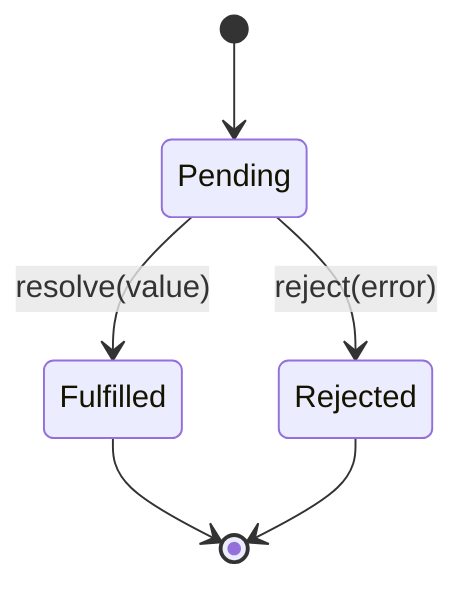
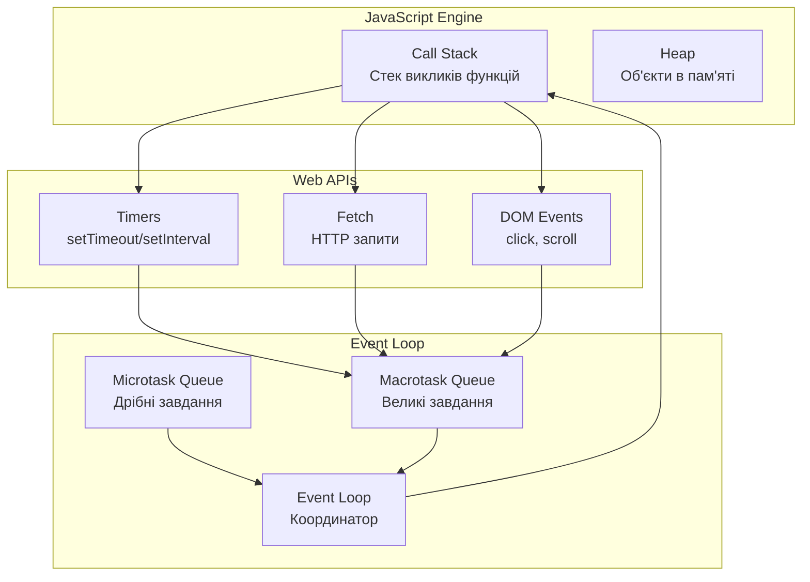

# JavaScript ES6+ та асинхронне програмування

## План лекції

1. Еволюція JavaScript та ES6+
2. Деструктуризація масивів та об'єктів
3. Spread/Rest оператори
4. Arrow Functions та контекст this
5. Модульна система import/export
6. Promises та async/await
7. Event Loop та асинхронність
8. Практичні паттерни та оптимізація

## Еволюція JavaScript

### Ключові етапи розвитку

- 1995 - Народження JavaScript (Netscape, Brendan Eich за 10 днів)
- 1997 - Стандартизація як ECMAScript (міжнародний стандарт)
- 2009 - ES5 з JSON та strict mode (перший великий крок)
- 2015 - ES6/ES2015 - революційні зміни (класи, модулі, Promise)
- 2016+ - Щорічні оновлення ES (передбачуваний розвиток)

### Що змінив ES6+?

JavaScript перетворився з мови сценаріїв на повноцінну платформу для великих додатків:

- ✅ Модульність та інкапсуляція
- ✅ Читабельний асинхронний код
- ✅ Сучасний синтаксис
- ✅ Кращі інструменти розробки

## Деструктуризація

**Деструктуризація** дозволяє "розпаковувати" значення з масивів або властивості з об'єктів в окремі змінні за один крок. Це не просто синтаксичний цукор — це новий спосіб мислення про роботу з даними.

### До ES6: громіздкий код
```javascript
const person = { name: 'Іван', age: 25, city: 'Київ' };
const personName = person.name;
const personAge = person.age;
const personCity = person.city;
```

### ES6+: елегантне рішення
```javascript
const { name, age, city } = person;
console.log(name, age, city); // 'Іван' 25 'Київ'
```

*Код стає більш декларативним — ми говоримо "що" хочемо, а не "як" це отримати.*

## Деструктуризація масивів

### Основний синтаксис
```javascript
const [x, y, z] = [10, 20, 30];
console.log(x, y, z); // 10 20 30

// Пропуск елементів
const [first, , third] = [1, 2, 3];
console.log(first, third); // 1 3

// Значення за замовчуванням
const [width = 100, height = 200] = [300];
console.log(width, height); // 300 200
```

### Rest в деструктуризації
```javascript
const [head, ...tail] = [1, 2, 3, 4, 5];
console.log(head); // 1
console.log(tail); // [2, 3, 4, 5]
```

## Деструктуризація об'єктів

### Перейменування змінних
```javascript
const apiResponse = {
    user_name: 'Марія',
    user_age: 28
};

const {
    user_name: name,
    user_age: age
} = apiResponse;
```

### Глибока деструктуризація
```javascript
const user = {
    profile: {
        contacts: { email: 'maria@example.com' }
    }
};

const { profile: { contacts: { email } } } = user;
console.log(email); // 'maria@example.com'
```

## Деструктуризація в функціях

### Традиційний підхід
```javascript
function createUser(name, age, email, city) {
    return { name, age, email, city };
}

// Проблема: порядок має значення
const user = createUser('Олексій', 30, 'alex@example.com', 'Львів');
```

### ES6+ підхід
```javascript
function createUser({ name, age, email, city = 'Київ' }) {
    return { name, age, email, city };
}

// Переваги: порядок не важливий, значення за замовчуванням
const user = createUser({
    email: 'dev@example.com',
    name: 'Анна',
    age: 27
});
```

## Spread оператор: розгортання структур

**Spread оператор (...)** дозволяє "розпакувати" ітеровані об'єкти. Це універсальний інструмент для копіювання, об'єднання та передачі даних без мутації оригінальних структур.

### Об'єднання масивів
```javascript
const primaryColors = ['червоний', 'синій', 'жовтий'];
const secondaryColors = ['зелений', 'помаранчевий'];

const allColors = [...primaryColors, ...secondaryColors];
// ['червоний', 'синій', 'жовтий', 'зелений', 'помаранчевий']

// Копіювання масиву (shallow copy)
const colorsCopy = [...primaryColors];
```

### Spread з об'єктами
```javascript
const baseConfig = {
    theme: 'light',
    language: 'uk'
};

const userConfig = {
    ...baseConfig,
    theme: 'dark', // Перезаписує існуючу властивість
    fontSize: 'large' // Додає нову властивість
};
```

*Spread дотримується принципу immutability — створює нові об'єкти замість зміни існуючих.*

## Rest параметри: збирання аргументів

**Rest параметри** дозволяють функціям приймати змінну кількість аргументів як масив. Це сучасна заміна проблематичного об'єкта `arguments`.

### Проблема з arguments
```javascript
// Застарілий підхід
function oldSum() {
    var total = 0;
    for (var i = 0; i < arguments.length; i++) { // arguments не справжній масив
        total += arguments[i];
    }
    return total;
}
```

### ES6+ рішення
```javascript
function sum(...numbers) {
    return numbers.reduce((total, num) => total + num, 0);
}

console.log(sum(1, 2, 3, 4, 5)); // 15
console.log(sum(10, 20)); // 30
```

*Rest параметри завжди дають справжній масив зі всіма його методами (map, filter, reduce тощо).*

## Arrow Functions: функціональна революція

### Еволюція синтаксису
```javascript
// 1. Function declaration
function multiply(a, b) {
    return a * b;
}

// 2. Function expression
const multiply = function(a, b) {
    return a * b;
};

// 3. Arrow function
const multiply = (a, b) => a * b;
```

### Різні форми
```javascript
const square = x => x * x; // Один параметр
const greet = () => console.log('Привіт!'); // Без параметрів
const process = data => {
    // Багаторядкове тіло
    return data.map(item => item * 2);
};
```

## Контекст this у стрілочних функціях

**Найважливіша відмінність** стрілочних функцій — це поведінка `this`. Традиційні функції створюють власний контекст, а стрілочні наслідують його з оточуючого scope.

### Проблема традиційних функцій
```javascript
const timer = {
    seconds: 0,
    start: function() {
        setInterval(function() {
            this.seconds++; // this = global/window ❌
            console.log(this.seconds); // undefined
        }, 1000);
    }
};
```

### Рішення з arrow functions
```javascript
const timer = {
    seconds: 0,
    start: function() {
        setInterval(() => {
            this.seconds++; // this = timer ✅
            console.log(this.seconds);
        }, 1000);
    }
};
```

*Стрілочні функції "запам'ятовують" контекст з місця створення (лексичний scope).*

## Модульна система: організація коду

ES6 модулі вирішили одну з найбільших проблем JavaScript — відсутність стандартного способу організації коду. До цього використовували різні підходи з їхніми недоліками.

### До ES6: глобальне забруднення
```javascript
// file1.js
var userName = 'Іван';
function processUser() { /* ... */ }

// file2.js
var userName = 'Марія'; // ❌ Конфлікт! Перезаписує глобальну змінну
function processUser() { /* ... */ } // ❌ Перезапис функції!
```

### ES6+ модулі: інкапсуляція
```javascript
// mathematics.js
export const PI = 3.14159;
export function add(a, b) { return a + b; }
export default class Calculator { /* ... */ }

// app.js
import Calculator, { add, PI } from './mathematics.js';
```

*Модулі забезпечують власну область видимості, явні залежності та контрольований публічний API.*

## Named Export vs Default Export

### Named Export: множинні експорти
```javascript
// utils.js
export const formatDate = (date) => date.toLocaleDateString();
export const formatTime = (date) => date.toLocaleTimeString();
export const CURRENT_YEAR = new Date().getFullYear();

// app.js
import { formatDate, formatTime, CURRENT_YEAR } from './utils.js';
```

### Default Export: головний експорт
```javascript
// logger.js
export default class Logger {
    log(message) { console.log(message); }
}

// app.js
import Logger from './logger.js'; // Довільне ім'я
```

## Типи імпорту

### Іменований імпорт
```javascript
import { add, multiply } from './math.js';
```

### Namespace імпорт
```javascript
import * as MathUtils from './math.js';
console.log(MathUtils.add(1, 2));
```

### Динамічний імпорт
```javascript
async function loadMath() {
    const math = await import('./math.js');
    return math.add(1, 2);
}
```

### Умовний імпорт
```javascript
if (condition) {
    const module = await import('./conditional-module.js');
    module.initialize();
}
```

## Promises: концептуальна революція

**Promise** — це "контракт" про майбутнє значення. Він представляє результат асинхронної операції, яка може завершитися успішно або з помилкою. Promises вирішили проблему "callback hell" та надали структурований підхід до асинхронності.

### Стани Promise


### Створення Promise
```javascript
const fetchData = (id) => {
    return new Promise((resolve, reject) => {
        setTimeout(() => {
            if (id > 0) {
                resolve({ id, name: `User ${id}` });
            } else {
                reject(new Error('Invalid ID'));
            }
        }, 1000);
    });
};
```

*Promise може бути тільки в одному стані одночасно і не може змінити стан повторно.*

## Promise методи

### Promise.all() - чекає на всі
```javascript
const [user, posts, stats] = await Promise.all([
    fetchUser(id),
    fetchPosts(id),
    fetchStats(id)
]);
// Якщо один fail - весь Promise.all fails
```

### Promise.allSettled() - чекає на всі, не зупиняється
```javascript
const results = await Promise.allSettled([
    fetchUser(id),
    fetchPosts(id),
    fetchStats(id)
]);

results.forEach(result => {
    if (result.status === 'fulfilled') {
        console.log('Success:', result.value);
    } else {
        console.error('Error:', result.reason);
    }
});
```

## Promise.race() та Promise.any()

### Promise.race() - перший завершений
```javascript
const winner = await Promise.race([
    fetch('/api/data'),
    new Promise((_, reject) =>
        setTimeout(() => reject(new Error('Timeout')), 5000)
    )
]);
```

### Promise.any() - перший успішний
```javascript
const data = await Promise.any([
    fetchFromPrimaryServer(),
    fetchFromSecondaryServer(),
    fetchFromCache()
]);
// Повертає дані з першого успішного сервера
```

## async/await

**async/await** — це новий спосіб мислення про асинхронний код. Він дозволяє писати асинхронний код у стилі синхронного, зберігаючи всі переваги неблокуючого виконання.

### Еволюція від callbacks до async/await

#### Callback Hell
```javascript
// Піраміда смерті — код росте вправо, а не вниз
fetchUser(id, (userErr, user) => {
    if (userErr) return callback(userErr);
    fetchPosts(user.id, (postsErr, posts) => {
        if (postsErr) return callback(postsErr);
        fetchStats(user.id, (statsErr, stats) => {
            if (statsErr) return callback(statsErr);
            callback(null, { user, posts, stats });
        });
    });
});
```

*Callback hell робить код важкочитабельним, схильним до помилок і складним для тестування.*

## Promise Chains vs Async/Await

### Promise chains
```javascript
function loadUserData(id) {
    return fetchUser(id)
        .then(user => {
            return fetchPosts(user.id)
                .then(posts => ({ user, posts }));
        })
        .then(data => {
            return fetchStats(data.user.id)
                .then(stats => ({ ...data, stats }));
        });
}
```

### Async/await - найкраще рішення
```javascript
async function loadUserData(id) {
    const user = await fetchUser(id);
    const posts = await fetchPosts(user.id);
    const stats = await fetchStats(user.id);
    return { user, posts, stats };
}
```

## Послідовність vs Паралельність

### ❌ НЕЕФЕКТИВНО: послідовне виконання
```javascript
async function loadDataSequential(id) {
    const user = await fetchUser(id);      // ~1 сек
    const posts = await fetchPosts(id);    // ~1 сек
    const stats = await fetchStats(id);    // ~1 сек
    // Загалом: ~3 секунди
    return { user, posts, stats };
}
```

### ✅ ЕФЕКТИВНО: паралельне виконання
```javascript
async function loadDataParallel(id) {
    const [user, posts, stats] = await Promise.all([
        fetchUser(id),
        fetchPosts(id),
        fetchStats(id)
    ]);
    // Загалом: ~1 секунда
    return { user, posts, stats };
}
```

## Обробка помилок з async/await

### Базова обробка
```javascript
async function fetchUserSafely(id) {
    try {
        const user = await fetchUser(id);
        return user;
    } catch (error) {
        console.error('User fetch failed:', error.message);
        return { id, name: 'Unknown User' }; // Fallback
    }
}
```

### Власні класи помилок
```javascript
class ValidationError extends Error {
    constructor(message, field) {
        super(message);
        this.name = 'ValidationError';
        this.field = field;
    }
}

class NetworkError extends Error {
    constructor(message) {
        super(message);
        this.name = 'NetworkError';
        this.retryable = true;
    }
}
```

## Event Loop: серце асинхронності

**Event Loop** — це механізм, який дозволяє однопоточному JavaScript виконувати неблокуючі операції. Він координує виконання коду, збір та обробку подій, виконання під-завдань в черзі.

### Архітектура JavaScript Runtime



*Event Loop постійно перевіряє черги та передає завдання до Call Stack коли він порожній.*

## Пріоритети виконання в Event Loop

### Порядок виконання

1. **Синхронний код** (Call Stack)
2. **Microtasks** (Promises, queueMicrotask)
3. **Macrotasks** (setTimeout, DOM events)
4. **Render** (тільки в браузері)

```javascript
console.log('1: Синхронний'); // 1

setTimeout(() => console.log('2: Macrotask'), 0); // 4

Promise.resolve().then(() => console.log('3: Microtask')); // 3

console.log('4: Синхронний'); // 2

// Вивід: 1 → 4 → 3 → 2
```

## Macrotasks vs Microtasks

Розуміння різниці між типами завдань критично важливе для передбачення порядку виконання коду.

### Macrotasks (Task Queue)

Великі завдання, кожен Event Loop цикл обробляє тільки одну macrotask:

- `setTimeout` / `setInterval`
- I/O операції (файли, мережа)
- DOM події (click, scroll)
- HTTP запити

### Microtasks (Microtask Queue)

Дрібні завдання з високим пріоритетом, всі microtasks виконуються перед наступною macrotask:

- Promise callbacks (`.then()`, `.catch()`)
- `queueMicrotask()`
- `async/await`
- MutationObserver (браузер)

**Правило:** Всі microtasks виконуються перед будь-якими macrotasks!

*Це означає, що Promise завжди "обганяють" setTimeout, навіть з затримкою 0.*

## Демонстрація Event Loop

```javascript
console.log('🟢 Start');

setTimeout(() => {
    console.log('🔴 setTimeout (macrotask)');
    Promise.resolve().then(() => {
        console.log('🟡 Promise in setTimeout (microtask)');
    });
}, 0);

Promise.resolve().then(() => {
    console.log('🟡 Promise (microtask)');
});

queueMicrotask(() => {
    console.log('🟡 queueMicrotask (microtask)');
});

console.log('🟢 End');

/* Результат:
🟢 Start
🟢 End
🟡 Promise (microtask)
🟡 queueMicrotask (microtask)
🔴 setTimeout (macrotask)
🟡 Promise in setTimeout (microtask)
*/
```

## Уникнення блокування Event Loop

**Блокування Event Loop** — одна з найсерйозніших проблем JavaScript додатків. Коли синхронний код виконується занадто довго, він "заморожує" всю програму.

### ❌ ПОГАНО: блокуючий код
```javascript
function heavyCalculation() {
    let result = 0;
    for (let i = 0; i < 10000000000; i++) { // 10 мільярдів ітерацій
        result += Math.random();
    }
    return result; // 5+ секунд блокування UI, користувач не може взаємодіяти
}
```

### ✅ ДОБРЕ: неблокуючий підхід
```javascript
function heavyCalculationAsync(callback) {
    let result = 0, processed = 0;
    const total = 10000000000, chunkSize = 1000000; // Обробляємо по частинах

    function processChunk() {
        const end = Math.min(processed + chunkSize, total);
        for (let i = processed; i < end; i++) {
            result += Math.random();
        }
        processed = end;

        if (processed < total) {
            setTimeout(processChunk, 0); // Передаємо контроль Event Loop
        } else {
            callback(result);
        }
    }
    processChunk();
}
```

*Розбиття важких операцій на частини дозволяє браузеру обробляти інші події між обчисленнями.*

## Web Workers для важких обчислень

**Web Workers** дозволяють виконувати JavaScript код в окремих потоках, повністю уникаючи блокування головного потоку UI.

```javascript
// Створення Web Worker для неблокуючих обчислень
function heavyComputationWithWorker(data) {
    return new Promise((resolve, reject) => {
        // Код worker-а як рядок (в реальному проєкті це окремий файл)
        const workerCode = `
            self.onmessage = function(e) {
                const data = e.data;
                let result = 0;

                // Важкі обчислення виконуються в окремому потоці
                for (let i = 0; i < data.length; i++) {
                    result += Math.sqrt(data[i]);
                }

                // Відправляємо результат назад
                self.postMessage(result);
            };
        `;

        const blob = new Blob([workerCode]);
        const worker = new Worker(URL.createObjectURL(blob));

        worker.onmessage = (e) => {
            resolve(e.data);
            worker.terminate(); // Очищуємо ресурси
        };

        worker.postMessage(data);
    });
}
```

*Worker працює паралельно з основним потоком, UI залишається responsive.*

## Retry механізм з Exponential Backoff

```javascript
class RetryManager {
    constructor(options = {}) {
        this.maxRetries = options.maxRetries || 3;
        this.baseDelay = options.baseDelay || 1000;
        this.backoffFactor = options.backoffFactor || 2;
    }

    async executeWithRetry(operation) {
        let lastError;

        for (let attempt = 0; attempt <= this.maxRetries; attempt++) {
            try {
                return await operation();
            } catch (error) {
                lastError = error;

                if (attempt === this.maxRetries || !this.isRetryable(error)) {
                    break;
                }

                const delay = this.baseDelay * Math.pow(this.backoffFactor, attempt);
                console.warn(`Retry attempt ${attempt + 1} after ${delay}ms`);
                await this.delay(delay);
            }
        }

        throw lastError;
    }
}
```

## Connection Pool для оптимізації

```javascript
class ConnectionPool {
    constructor(maxConnections = 5) {
        this.maxConnections = maxConnections;
        this.activeConnections = 0;
        this.queue = [];
    }

    async execute(operation, priority = 0) {
        return new Promise((resolve, reject) => {
            this.queue.push({ operation, resolve, reject, priority });
            this.queue.sort((a, b) => b.priority - a.priority); // Сортування за пріоритетом
            this.processQueue();
        });
    }

    async processQueue() {
        if (this.activeConnections >= this.maxConnections || !this.queue.length) {
            return;
        }

        const { operation, resolve, reject } = this.queue.shift();
        this.activeConnections++;

        try {
            const result = await operation();
            resolve(result);
        } catch (error) {
            reject(error);
        } finally {
            this.activeConnections--;
            this.processQueue();
    }
}
```

*Кеш з TTL та fallback стратегіями забезпечує баланс між свіжістю даних та продуктивністю.*

## Розумне кешування асинхронних операцій

```javascript
class SmartAsyncCache {
    constructor(options = {}) {
        this.cache = new Map();
        this.defaultTTL = options.ttl || 300000; // 5 хвилин
        this.stats = { hits: 0, misses: 0 };
    }

    async get(key, fetchFunction, options = {}) {
        const cached = this.cache.get(key);
        const ttl = options.ttl || this.defaultTTL;

        // Перевірка кешу
        if (cached && !this.isExpired(cached, ttl)) {
            this.stats.hits++;
            return cached.data;
        }

        this.stats.misses++;

        try {
            const data = await fetchFunction();
            this.set(key, data);
            return data;
        } catch (error) {
            // Fallback до застарілих даних при помилці
            if (cached && options.fallbackToStale) {
                return cached.data;
            }
            throw error;
        }
    }
}
```

## Практичний приклад: Real-time система

Real-time системи вимагають особливого підходу до Event Loop оптимізації, оскільки потрібно обробляти велику кількість повідомлень без блокування UI.

```javascript
class RealtimeMessaging {
    constructor(options) {
        this.wsUrl = options.wsUrl;
        this.messageBuffer = []; // Буфер для batch обробки
        this.batchSize = options.batchSize || 10;
        this.batchInterval = options.batchInterval || 100; // 100ms
    }

    handleMessage(message) {
        // Batch обробка для оптимізації Event Loop
        this.messageBuffer.push(message);

        // Відкладена обробка для групування повідомлень
        if (!this.batchTimer) {
            this.batchTimer = setTimeout(() => {
                this.processBatchedMessages();
            }, this.batchInterval);
        }

        // Негайна обробка при переповненні буферу
        if (this.messageBuffer.length >= this.batchSize) {
            clearTimeout(this.batchTimer);
            this.processBatchedMessages();
        }
    }

    processBatchedMessages() {
        const messages = this.messageBuffer.splice(0); // Очищуємо буфер
        this.batchTimer = null;

        // queueMicrotask для неблокуючої обробки
        queueMicrotask(() => {
            messages.forEach(msg => this.processMessage(msg));
        });
    }
}
```

*Batch обробка зменшує кількість операцій DOM та покращує загальну продуктивність.*

## Найкращі практики

Ефективне використання сучасного JavaScript вимагає розуміння не тільки синтаксису, але й принципів продуктивності, читабельності та підтримуваності коду.

### ✅ DO (Роби)

- Використовуй `const`/`let` замість `var` (блочна область видимості)
- Віддавай перевагу `async/await` над Promise chains (читабельність)
- Структуруй код в модулі з чіткими залежностями (архітектура)
- Обробляй помилки на кожному рівні (надійність)
- Використовуй паралельне виконання де можливо (продуктивність)
- Кешуй результати довгих операцій (оптимізація)
- Реалізовуй retry логіку для нестабільних операцій (стійкість)

### ❌ DON'T (Не роби)

- Не блокуй Event Loop важкими обчисленнями
- Не ігноруй помилки в асинхронному коді
- Не використовуй nested callbacks (callback hell)
- Не забувай про cleanup (clear timers, close connections)
- Не використовуй `for...in` з масивами
- Не модифікуй прототипи вбудованих об'єктів

## Висновки

### JavaScript ES6+ трансформував розробку
Сучасний JavaScript кардинально відрізняється від мови початку 2000-х. ES6+ перетворив JavaScript з простої мови сценаріїв на повноцінну платформу для створення складних, масштабованих додатків.

- 🚀 **Продуктивність**: сучасні інструменти та підходи дозволяють створювати швидкі додатки
- 📚 **Читабельність**: код стає зрозумілішим завдяки деструктуризації, arrow functions, async/await
- 🛡️ **Надійність**: кращі механізми обробки помилок та типізація
- 🔧 **Підтримуваність**: модульна архітектура спрощує роботу в командах
- ⚡ **Асинхронність**: елегантна робота з неблокуючими операціями
