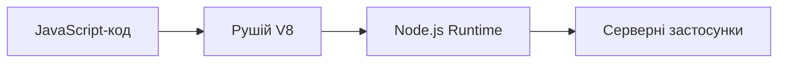
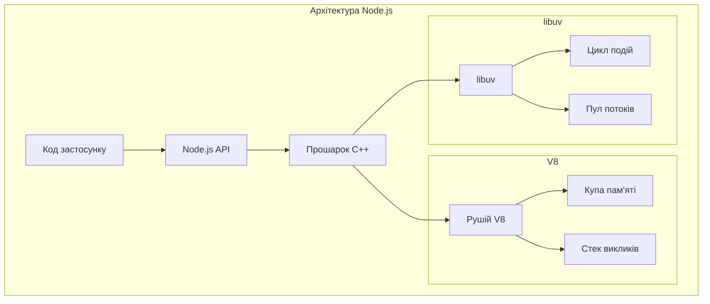
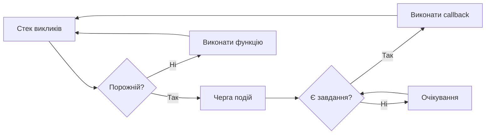
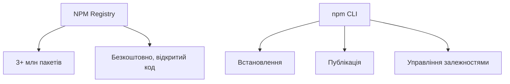
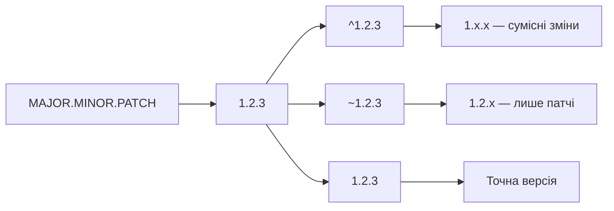
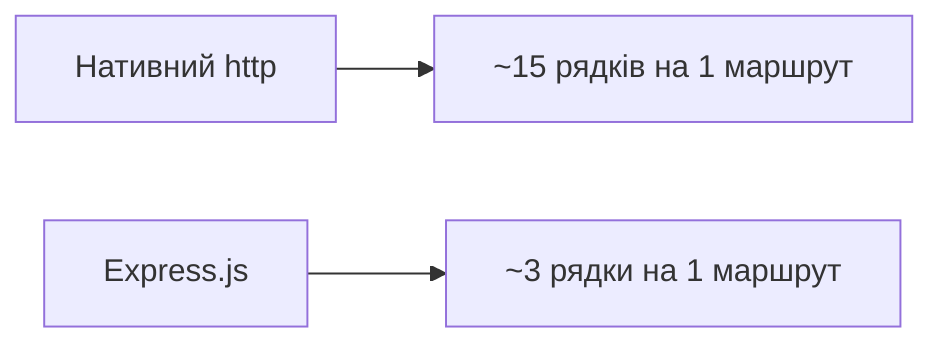
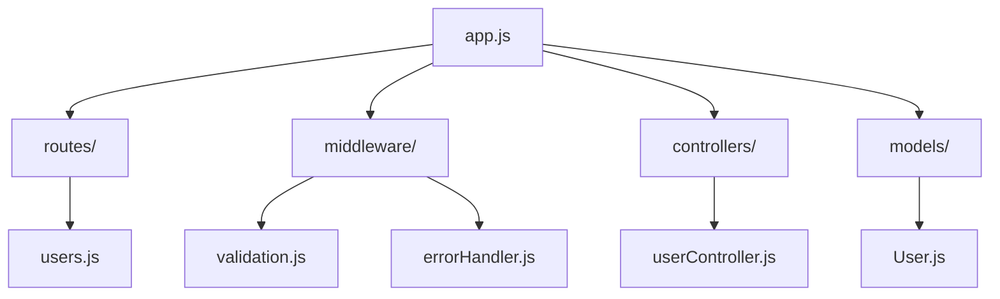

# Node.js та Express.js: основи серверної розробки

## План лекції

- Навіщо серверна частина на JavaScript
- **Частина I.** Node.js: платформа, цикл подій, NPM, модулі
- **Частина II.** Express.js: маршрутизація, middleware, MVC
- Наскрізний приклад: REST API
- Найкращі практики


## Від сторінки до сервера

**Клієнтська частина** (браузер) не може:
- зберігати базу даних користувачів
- обробляти платежі
- обслуговувати тисячі клієнтів одночасно

**Node.js (2009)** — перше середовище, що дозволило писати серверну частину тією самою мовою, що й клієнтську — JavaScript.


```mermaid
graph LR
    A[Клієнтська частина<br/>браузер] <--> B[Серверна частина<br/>Node.js + Express.js]
    B <--> C[База даних]
```

## Що таке Node.js?

**Node.js** — середовище виконання JavaScript поза браузером


```mermaid
graph LR
    A[JavaScript-код] --> B[Рушій V8]
    B --> C[Node.js Runtime]
    C --> D[Серверні застосунки]
```

### Ключові особливості:
- Асинхронність і неблокуюче введення-виведення
- Подієво-орієнтована архітектура (цикл подій)
- Єдина мова для клієнтської та серверної частини
- Величезна екосистема NPM (3+ млн пакетів)


## Переваги та обмеження

### ✅ Переваги
- **Висока продуктивність** для I/O-операцій
- **Швидкість розробки** — одна мова для всього стеку
- **Активна спільнота** та екосистема

### ❌ Обмеження
- Не підходить для CPU-інтенсивних задач (потрібні Worker Threads)
- Callback hell у legacy-коді (вирішується async/await)
- Швидкі зміни в екосистемі


## Архітектура Node.js


```mermaid
graph TB
    subgraph "Архітектура Node.js"
        A[Код застосунку] --> B[Node.js API]
        B --> C[Прошарок C++]
        C --> D[Рушій V8]
        C --> E[libuv]

        subgraph "V8"
            D --> F[Купа пам'яті]
            D --> G[Стек викликів]
        end

        subgraph "libuv"
            E --> H[Цикл подій]
            E --> I[Пул потоків]
        end
    end
```

**V8** — виконує JS-код. **libuv** — забезпечує неблокуюче введення-виведення та цикл подій.


## Цикл подій (Event Loop)


```mermaid
graph LR
    A[Стек викликів] --> B{Порожній?}
    B -->|Так| C[Черга подій]
    C --> D{Є завдання?}
    D -->|Так| E[Виконати callback]
    E --> A
    D -->|Ні| F[Очікування]
    F --> D
    B -->|Ні| G[Виконати функцію]
    G --> A
```

**Головний принцип:** один потік, неблокуючі I/O-операції


## Приклад асинхронності

```javascript
console.log('Початок');

setTimeout(() => {
    console.log('Таймер виконано');
}, 0);

console.log('Кінець');

// Вивід:
// Початок
// Кінець
// Таймер виконано
```

**Чому?** Цикл подій обробляє `setTimeout` лише після звільнення стеку викликів


## Версії Node.js (вересень 2026)

| Версія | Кодова назва | Статус | Підтримка до |
|---|---|---|---|
| **Node.js 24** | Krypton | **Active LTS** | квітень 2028 |
| Node.js 22 | Jod | Maintenance LTS | квітень 2027 |
| Node.js 26 | — | Current | стане LTS у жовтні 2026 |

### Що нового за останній рік:
- `--env-file` та `process.loadEnvFile()` — вбудована робота з `.env`
- `require()` вміє синхронно завантажувати ES-модулі
- Вбудований тестовий раннер `node:test`


## NPM — менеджер пакетів


```mermaid
graph TB
    A[NPM Registry] --> B[3+ млн пакетів]
    A --> C[Безкоштовно, відкритий код]
    E[npm CLI] --> F[Встановлення]
    E --> G[Публікація]
    E --> H[Управління залежностями]
```

### Основні команди:
```bash
npm init -y                # Ініціалізація проєкту
npm install express         # Встановлення пакета
npm install -D nodemon     # Залежність для розробки
npm run dev                 # Запуск скрипта
```


## package.json — серце проєкту

```json
{
  "name": "my-app",
  "version": "1.0.0",
  "type": "module",
  "scripts": {
    "start": "node src/index.js",
    "dev": "node --watch src/index.js",
    "test": "node --test"
  },
  "dependencies": { "express": "^5.1.0" },
  "engines": { "node": ">=22.0.0" }
}
```


## Семантичне версіонування


```mermaid
graph LR
    A["MAJOR.MINOR.PATCH"] --> B["1.2.3"]
    B --> C["^1.2.3"]
    B --> D["~1.2.3"]
    B --> E["1.2.3"]
    C --> F["1.x.x — сумісні зміни"]
    D --> G["1.2.x — лише патчі"]
    E --> H["Точна версія"]
```

- **MAJOR** — зміни, що ламають сумісність
- **MINOR** — нові можливості
- **PATCH** — виправлення помилок

`package-lock.json` фіксує точні версії — завжди додається в Git


## Модульна система: ES Modules

```javascript
// math.js — експорт
export function add(a, b) {
    return a + b;
}
export default function multiply(a, b) {
    return a * b;
}

// app.js — імпорт
import multiply, { add } from './math.js';

console.log(add(5, 3)); // 8
```

```json
// package.json
{ "type": "module" }
```


## Модульна система: CommonJS (легасі)

```javascript
// math.cjs — експорт
function add(a, b) { return a + b; }
module.exports = { add };

// app.cjs — імпорт
const { add } = require('./math.cjs');
```

### 💡 Новинка Node.js 22+:
`require()` тепер може синхронно завантажувати ES-модулі — межа між CJS та ESM стала прозорішою

### Рекомендація:
Нові проєкти → **ES Modules**. CommonJS — розуміти для legacy-коду


## Вбудовані модулі: fs та path

```javascript
import { readFile } from 'node:fs/promises';
import path from 'node:path';
import { fileURLToPath } from 'node:url';

// Читання файлу
const data = await readFile('config.txt', 'utf8');

// Шляхи (ESM: __dirname через import.meta.url)
const __dirname = path.dirname(fileURLToPath(import.meta.url));
const configPath = path.join(__dirname, 'config', 'db.json');
```


## Вбудований модуль HTTP

```javascript
import http from 'node:http';

const server = http.createServer((req, res) => {
    res.setHeader('Content-Type', 'application/json');

    if (req.url === '/' && req.method === 'GET') {
        res.statusCode = 200;
        res.end(JSON.stringify({ message: 'Ласкаво просимо' }));
    } else {
        res.statusCode = 404;
        res.end(JSON.stringify({ error: 'Не знайдено' }));
    }
});

server.listen(3000);
```

**Проблема:** ручний розбір URL і методу для кожного маршруту → рутина


## Змінні середовища: сучасний підхід

### Вбудовано в Node.js (з v24 — стабільно):
```bash
node --env-file=.env src/index.js
```
```javascript
import { loadEnvFile } from 'node:process';
loadEnvFile();
```

### Пакет dotenv (легасі, але й досі поширений):
```javascript
import 'dotenv/config';
const port = process.env.PORT || 3000;
```


## Автоматичний перезапуск

### Вбудований прапорець (без залежностей):
```json
{ "scripts": { "dev": "node --watch src/index.js" } }
```

### nodemon (для складніших сценаріїв):
```bash
npm install -D nodemon
```
```json
// nodemon.json
{ "watch": ["src"], "ext": "js,json" }
```

## Що таке Express.js?

**Express.js** — мінімалістичний і гнучкий вебфреймворк для Node.js

### Основні характеристики:
- 🚀 **Швидкий** старт проєктів
- 🔧 **Гнучкий**, без нав'язаної архітектури
- 📦 **Мінімалістичне** ядро + middleware
- 🌐 Стандарт де-факто для Node.js

### Актуальна версія: **Express 5.x**
За замовчуванням у `npm install express` з березня 2025 року


## Чому Express, а не «голий» Node.js?


```mermaid
graph LR
    A[Нативний http] --> B["~15 рядків на 1 маршрут"]
    C[Express.js] --> D["~3 рядки на 1 маршрут"]
```

### Переваги:
- ✅ Декларативна маршрутизація замість розбору `req.url`
- ✅ Потужна екосистема middleware
- ✅ Автоматична обробка помилок в async-коді (Express 5)
- ✅ Активна підтримка спільноти


## Перший Express-сервер

### Встановлення:
```bash
npm install express
```

### Код (ESM — сучасний стиль):
```javascript
import express from 'express';
const app = express();

app.get('/', (req, res) => {
    res.send('Привіт, Express!');
});

app.listen(3000, () => {
    console.log('Сервер працює на порті 3000');
});
```

> Легасі-код часто використовує `require('express')` — теж працює


## Система роутингу

### HTTP-методи в Express:

| Метод | Призначення | Приклад |
|---|---|---|
| **GET** | Отримання даних | `app.get('/users')` |
| **POST** | Створення | `app.post('/users')` |
| **PUT** | Повне оновлення | `app.put('/users/:id')` |
| **DELETE** | Видалення | `app.delete('/users/:id')` |

### Динамічні маршрути та query:
```javascript
app.get('/users/:id', (req, res) => res.json({ id: req.params.id }));

// /search?q=node&limit=10
app.get('/search', (req, res) => res.json(req.query));
```


## ⚠️ Express 5: новий синтаксис шляхів

| Express 4 | Express 5 |
|---|---|
| `app.get('*', ...)` | `app.get('/*splat', ...)` |
| `app.get('/products/:cat?', ...)` | `app.get('/products{/:cat}', ...)` |

**Причина:** новий path-to-regexp v8 — захист від ReDoS-атак, wildcard тепер має ім'я


## Express Router — модульна організація

```javascript
// routes/users.js
import { Router } from 'express';
const router = Router();

router.get('/', getAllUsers);
router.get('/:id', getUserById);
router.post('/', createUser);

export default router;

// app.js
import userRoutes from './routes/users.js';
app.use('/api/users', userRoutes);
```

### Переваги: модульність • повторне використання • простіше тестування


## Концепція Middleware


```mermaid
graph LR
    A[Запит] --> B["Middleware 1<br/>Логування"]
    B --> C["Middleware 2<br/>Авторизація"]
    C --> D["Middleware 3<br/>Валідація"]
    D --> E[Обробник маршруту]
    E --> F[Відповідь]
```

### Middleware-функції:
- Виконують код перед обробкою запиту
- Модифікують `req` і `res`
- Викликають `next()` або завершують цикл запит-відповідь


## Типи Middleware

### 1. Рівня застосунку
```javascript
app.use((req, res, next) => {
    console.log(Date.now());
    next();
});
```

### 2. Рівня роутера
```javascript
router.use(loggerMiddleware);
```

### 3. Вбудовані
```javascript
app.use(express.json());          // Розбір JSON
app.use(express.static('public')); // Статичні файли
```

### 4. Сторонні
```javascript
app.use(cors());
app.use(helmet());
```


## Обробка помилок: middleware з 4 параметрами

```javascript
// Завжди підключається останнім
app.use((err, req, res, next) => {
    console.error(err.stack);

    res.status(err.status || 500).json({
        error: err.message || 'Внутрішня помилка сервера',
    });
});
```

Express розпізнає обробник помилок саме за **кількістю параметрів (4)**


## 🆕 Express 5: автоматична обробка async-помилок

### Express 4 (потрібен try/catch):
```javascript
app.get('/users/:id', async (req, res, next) => {
    try {
        const user = await findUser(req.params.id);
        res.json(user);
    } catch (error) {
        next(error); // обов'язково вручну
    }
});
```

### Express 5 (автоматично):
```javascript
app.get('/users/:id', async (req, res) => {
    const user = await findUser(req.params.id);
    res.json(user); // помилка сама потрапить у error-handler
});
```


## Об'єкти Request і Response

```javascript
app.post('/users', (req, res) => {
    // Request
    console.log(req.method, req.params, req.query, req.body);

    // Response
    res.status(200);
    res.set('X-Custom-Header', 'value');
    res.json({ success: true });
    // res.redirect('/new-url');
});
```


## Валідація даних

```javascript
const validateUser = (req, res, next) => {
    const { name, email, age } = req.body;
    const errors = [];

    if (!name || name.length < 2) errors.push('Ім\'я закоротке');
    if (!/\S+@\S+\.\S+/.test(email)) errors.push('Некоректний email');
    if (!age || age < 18) errors.push('Вік має бути ≥ 18');

    if (errors.length) return res.status(400).json({ errors });
    next();
};

app.post('/users', validateUser, (req, res) => {
    res.json({ message: 'Користувача створено' });
});
```


## Статичні файли та шаблонізатори

```javascript
// Статичні файли
app.use(express.static('public'));
// http://localhost:3000/css/style.css

// EJS-шаблонізатор
app.set('view engine', 'ejs');
app.get('/', (req, res) => {
    res.render('index', { title: 'Головна' });
});
```

```html
<!-- views/index.ejs -->
<h1><%= title %></h1>
```

> Актуально для SSR та адмін-панелей; клієнтські SPA частіше спілкуються через REST API


## Структура Express-застосунку (MVC)


```mermaid
graph TB
    A[app.js] --> B[routes/]
    A --> C[middleware/]
    A --> D[controllers/]
    A --> E[models/]

    B --> B1[users.js]
    C --> C1[validation.js]
    C --> C2[errorHandler.js]
    D --> D1[userController.js]
    E --> E1[User.js]
```

- **Routes** — прив'язка URL до контролерів
- **Controllers** — бізнес-логіка
- **Models** — робота з даними
- **Middleware** — наскрізна логіка


## Наскрізний приклад: контролер

```javascript
// controllers/userController.js
const users = [];

export const userController = {
    getAllUsers(req, res) {
        res.json({ success: true, data: users });
    },

    createUser(req, res) {
        const newUser = { id: Date.now(), ...req.body };
        users.push(newUser);
        res.status(201).json({ success: true, data: newUser });
    },
};
```


## Наскрізний приклад: маршрути й застосунок

```javascript
// routes/users.js
router.get('/', userController.getAllUsers);
router.post('/', validateUser, userController.createUser);

// app.js
app.use(express.json());
app.use('/api/users', userRoutes);

app.use('/{*splat}', (req, res) =>
    res.status(404).json({ error: 'Не знайдено' })
);

app.use((err, req, res, next) =>
    res.status(500).json({ error: err.message })
);
```

**Потік:** маршрут → middleware валідації → контролер → відповідь


## Безпека Express-застосунків

```javascript
import helmet from 'helmet';
import rateLimit from 'express-rate-limit';

app.use(helmet()); // безпечні заголовки

app.use('/api/', rateLimit({
    windowMs: 15 * 60 * 1000,
    max: 100,
}));
```

### Чек-лист:
- ✅ HTTPS у продакшені
- ✅ Валідація всіх вхідних даних
- ✅ Хешування паролів (bcrypt), секрети — лише у змінних середовища


## Тестування Express-застосунків

```javascript
import request from 'supertest';
import app from '../app.js';

describe('Users API', () => {
    test('GET /api/users повертає список', async () => {
        const res = await request(app).get('/api/users').expect(200);
        expect(res.body.success).toBe(true);
    });
});
```

**Jest + Supertest** — традиційний вибір
**`node --test`** — вбудований раннер, без залежностей (з Node.js 20)


## Продуктивність

```javascript
import compression from 'compression';
app.use(compression()); // стиснення відповідей

// Кластеризація для CPU-навантаження
import cluster from 'node:cluster';
import os from 'node:os';

if (cluster.isPrimary) {
    for (let i = 0; i < os.availableParallelism(); i++) cluster.fork();
} else {
    await import('./server.js');
}
```


## Висновки

### Node.js — це:
- Асинхронне середовище виконання JavaScript на сервері
- Цикл подій — основа високої продуктивності для I/O
- NPM, `package.json`, SemVer — керування залежностями
- Актуально: Node.js 24 «Krypton» (Active LTS), ES Modules за замовчуванням

### Express.js — це:
- 🚀 Мінімалістичний фреймворк над `http`-модулем
- 🔧 Middleware як основний механізм розширення
- 🆕 Express 5: автоматична обробка async-помилок, новий синтаксис шляхів
- 📚 Фундамент для REST API, баз даних та автентифікації — тем наступних лекцій
