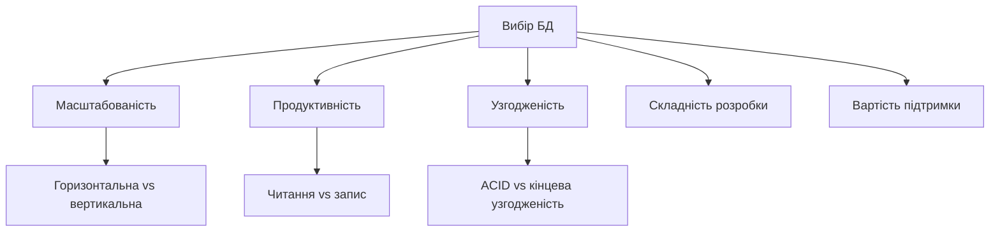
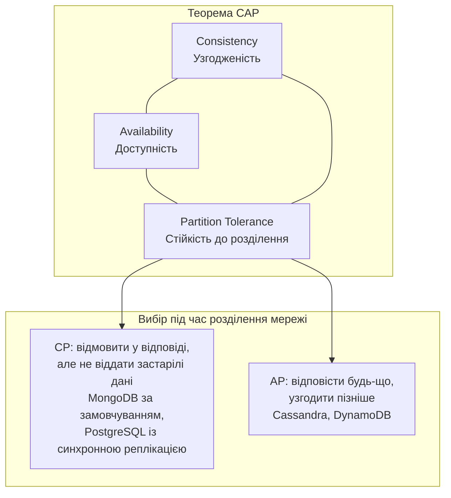
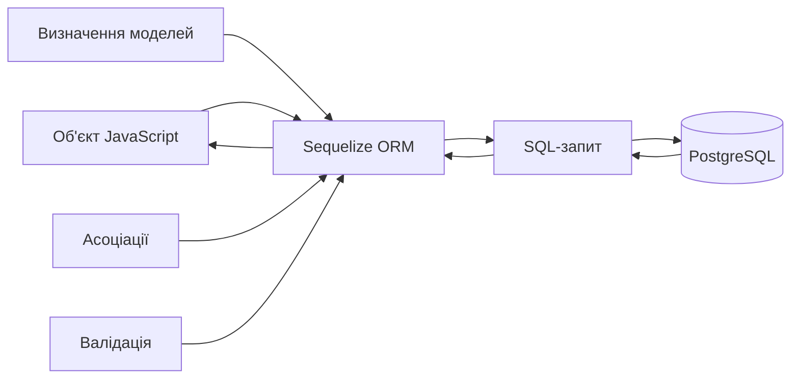
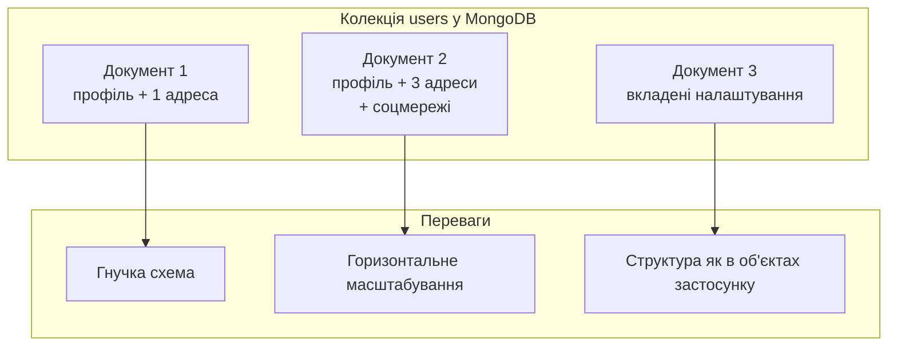
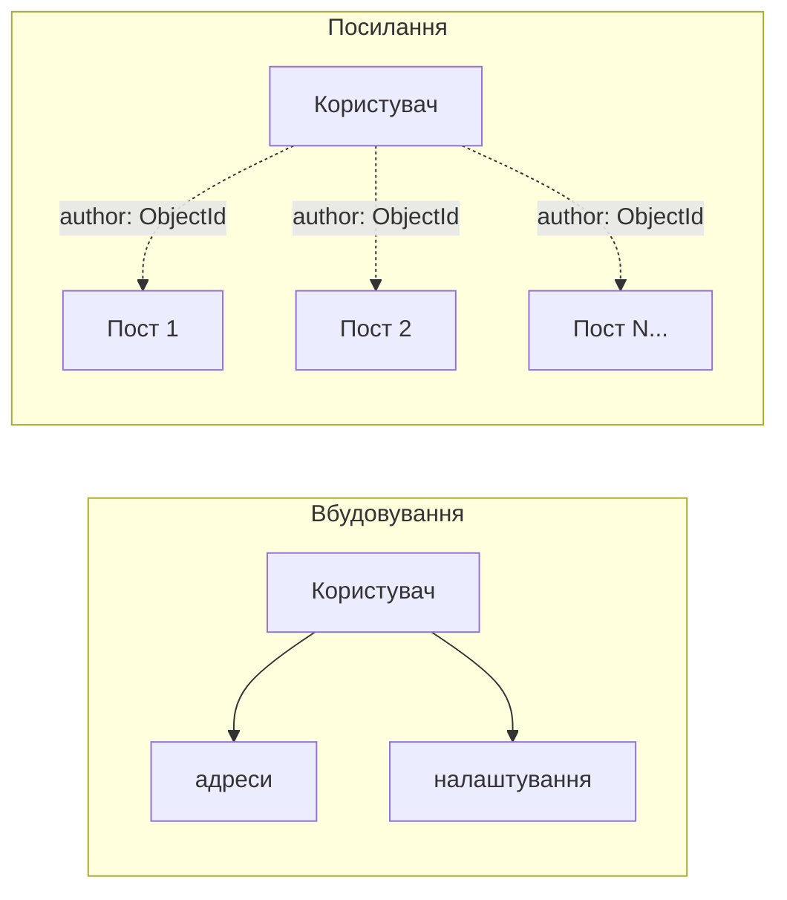
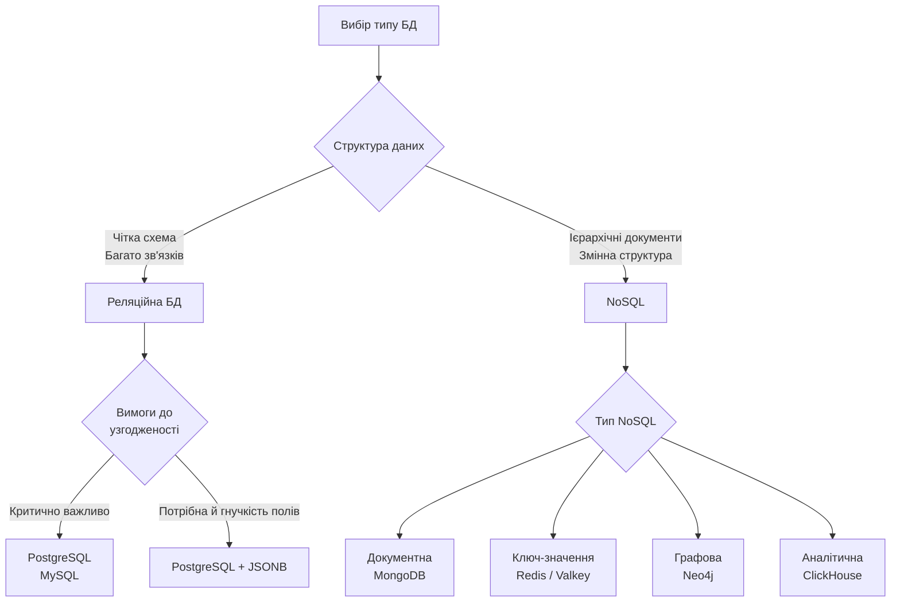
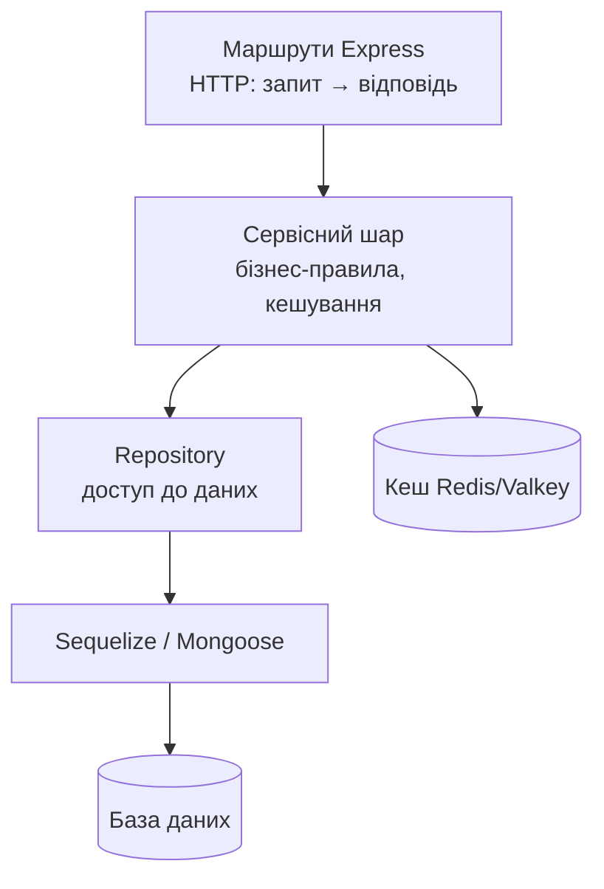
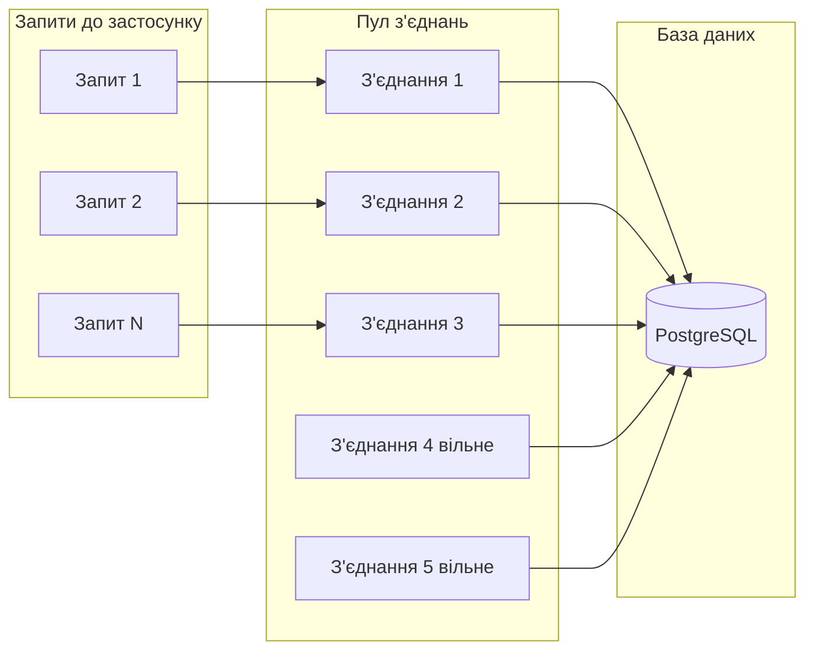
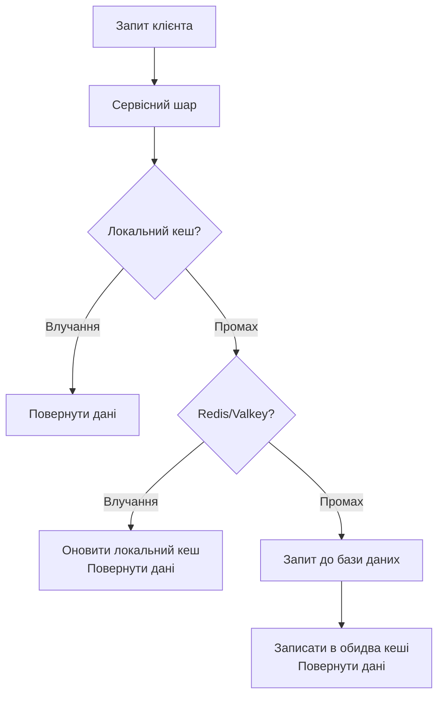
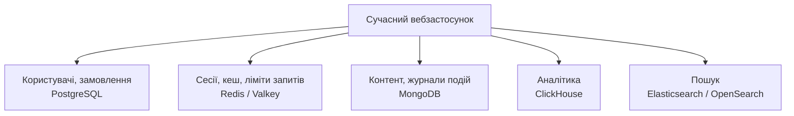

# Бази даних та ORM

## План лекції

1. **SQL vs NoSQL**: філософські відмінності, CAP без міфів
2. **PostgreSQL 18**: потужність реляційної моделі
3. **Sequelize 6**: моделі, міграції, асоціації, транзакції, N+1
4. **Prisma і Drizzle**: сучасні альтернативи
5. **MongoDB + Mongoose 9**: документо-орієнтований підхід
6. **Патерни**: Repository, сервісний шар, пули з'єднань, кешування

## Чому важливий вибір бази даних?



**Помилка в моделі даних «проростає» в увесь код**

## SQL vs NoSQL: Ключові відмінності

### **Реляційні (PostgreSQL)**
- ✅ **ACID**-транзакції
- ✅ **Складні запити** з JOIN
- ✅ **Цілісність** через обмеження й зовнішні ключі
- ⚠️ Горизонтальне масштабування складне
- ⚠️ Зміна схеми — через міграції

### **NoSQL (MongoDB, Redis, Neo4j...)**
- ✅ **Гнучка схема** (але схема переїжджає в код!)
- ✅ Вбудоване **горизонтальне масштабування**
- ✅ Швидко, коли об'єкт читається **одним документом**
- ⚠️ Часто **кінцева узгодженість**
- ⚠️ Зв'язки між документами дорожчі

**«NoSQL швидший» без уточнення сценарію — міф**

## CAP Теорема



- ❌ «Оберіть 2 з 3» і «SQL = CA» — **спрощення**
- ✅ Розриви мережі неминучі → вибір **C або A лише під час розділення**
- **PACELC:** і без збоїв — вибір між затримкою та узгодженістю

## PostgreSQL: Гібридна потужність

### **Чому PostgreSQL?**
- 🚀 **MVCC** — читання не блокує запис
- 🔧 **Розширення:** PostGIS, pg_trgm, pgvector
- 📄 **JSONB** для гібридного підходу
- 📊 **Повнотекстовий пошук**
- 🆕 **PostgreSQL 18:** асинхронне введення-виведення, `uuidv7()`

```sql
CREATE TABLE users (
    id         BIGINT GENERATED ALWAYS AS IDENTITY PRIMARY KEY,  -- замість SERIAL
    public_id  UUID NOT NULL DEFAULT uuidv7() UNIQUE,            -- упорядкований UUID
    email      VARCHAR(100) NOT NULL UNIQUE,
    created_at TIMESTAMPTZ NOT NULL DEFAULT now()                -- з часовим поясом
);
```

## JSONB: Найкраще з двох світів

```sql
INSERT INTO products (name, price, specifications) VALUES
('Laptop Pro', 42999.00, '{"cpu": "Intel i7", "ram": 16, "weight": 1.4}');

-- -> повертає JSONB, ->> повертає текст
SELECT name, specifications->>'cpu' AS processor
FROM products
WHERE specifications @> '{"ram": 16}';

-- Приведення типу — лише з дужками!
SELECT name FROM products
WHERE (specifications->>'weight')::numeric < 1.5;

-- Індекси
CREATE INDEX idx_products_specs ON products USING GIN (specifications);
CREATE INDEX idx_products_cpu   ON products ((specifications->>'cpu'));
```

**Фільтруєте, сортуєте, з'єднуєте за полем → окремий стовпець, не JSONB**

## Індекси PostgreSQL

| Тип | Для чого |
|-----|----------|
| B-Tree | Рівність, діапазони, сортування (за замовчуванням) |
| GIN | JSONB, масиви, повнотекстовий пошук |
| GiST | Геометрія, діапазони, нечіткий пошук |
| BRIN | Величезні таблиці з природним порядком |

```sql
CREATE INDEX idx_orders_user_date ON orders (user_id, created_at DESC);
CREATE INDEX idx_active_users ON users (email) WHERE is_active = true;
EXPLAIN ANALYZE SELECT ...;   -- головний інструмент діагностики
```

- `UNIQUE` уже створює індекс — не дублюйте
- Кожен індекс сповільнює запис

## Sequelize ORM: Об'єктно-Реляційне Відображення



- Стабільна гілка — **Sequelize 6** (v7 — досі альфа)
- ⚠️ **CVE-2026-30951**: SQL-ін'єкція через ключі JSON у where → **лише ≥ 6.37.8**
- Ніколи не передавайте в `where` неперевірений об'єкт від клієнта

## Sequelize: Визначення Моделі

```javascript
const NAME_PATTERN = /^[\p{L}\s'’-]+$/u;   // isAlpha відкине кирилицю!

export class User extends Model {
    getFullName() { return `${this.firstName} ${this.lastName}`; }
    toJSON() {
        const { passwordHash, deletedAt, ...safe } = this.get();
        return safe;                          // хеш ніколи не потрапить у відповідь
    }
}

User.init({
    id: { type: DataTypes.UUID, defaultValue: DataTypes.UUIDV4, primaryKey: true },
    email: { type: DataTypes.STRING(100), allowNull: false, unique: true,
             validate: { isEmail: true } },
    firstName: { type: DataTypes.STRING(50), validate: { is: NAME_PATTERN } },
    passwordHash: { type: DataTypes.STRING, allowNull: false },
    preferences: { type: DataTypes.JSONB, defaultValue: {} }
}, {
    sequelize, tableName: 'users',
    paranoid: true,      // м'яке видалення (deletedAt)
    underscored: true,   // snake_case у базі
    version: true        // оптимістичне блокування → ETag з лекції 3
});
```

## Sequelize: Асоціації

```javascript
// Один до багатьох
User.hasMany(Order, { foreignKey: 'userId', as: 'orders' });
Order.belongsTo(User, { foreignKey: 'userId', as: 'user' });

// Багато до багатьох через проміжну модель з атрибутами
Order.belongsToMany(Product, { through: OrderItem, foreignKey: 'orderId', as: 'products' });
Product.belongsToMany(Order, { through: OrderItem, foreignKey: 'productId', as: 'orders' });

// Використання
const user = await User.findByPk(id, {
    include: [{
        model: Order, as: 'orders', required: false,
        include: [{ model: Product, as: 'products',
                    through: { attributes: ['quantity', 'unitPrice'] } }]
    }]
});
```

**Гроші — лише `DECIMAL`, ніколи `FLOAT`**

## Sequelize: Міграції

```javascript
// migrations/20260915120000-create-users-table.cjs
module.exports = {
    async up(queryInterface, Sequelize) {
        await queryInterface.createTable('users', {
            id: { type: Sequelize.UUID, primaryKey: true,
                  defaultValue: Sequelize.literal('gen_random_uuid()') },
            email: { type: Sequelize.STRING(100), allowNull: false, unique: true },
            created_at: { type: Sequelize.DATE, allowNull: false,
                          defaultValue: Sequelize.fn('now') }
        });
    },
    async down(queryInterface) {
        await queryInterface.dropTable('users');
    }
};
```

**Міграції = Git для схеми БД!**
- `sync()` / `sync({ alter: true })` — лише для експериментів
- Застосовані міграції не редагують — пишуть нову
- Нове поле в таблиці з даними — спочатку nullable

## Транзакції: Забезпечення Цілісності

```javascript
// Керована транзакція: успіх → commit, виняток → rollback
await sequelize.transaction(async (transaction) => {
    const order = await Order.create({ userId, orderNumber, totalAmount: 0 }, { transaction });

    for (const item of items) {
        // Перевірка + зменшення залишку ОДНИМ запитом → без стану гонитви
        const [, affectedCount] = await Product.decrement('stockQuantity', {
            by: item.quantity,
            where: { id: item.productId, stockQuantity: { [Op.gte]: item.quantity } },
            transaction
        });
        if (affectedCount === 0) throw new ConflictError('Недостатньо товару');
        // ... OrderItem.create(..., { transaction })
    }
});
```

- Кожен запит — з `{ transaction }`
- Ціну беремо з БД, а не з запиту клієнта

## Проблема N+1

```javascript
// ❌ 1 + 50 запитів
const orders = await Order.findAll({ limit: 50 });
for (const order of orders) {
    const user = await order.getUser();
}

// ✅ Один запит із JOIN
await Order.findAll({
    limit: 50,
    include: [{ model: User, as: 'user', attributes: ['id', 'email'] }]
});

// ✅ Для hasMany — 2 запити замість N+1
await User.findAll({ include: [{ model: Order, as: 'orders', separate: true }] });
```

**На 10 тестових записах проблему не видно → вмикайте журнал SQL**

## Сучасні альтернативи

| Інструмент | Підхід | Коли обирати |
|------------|--------|--------------|
| Sequelize 6 | Моделі-класи | JavaScript, наявна кодова база |
| Prisma 7 | Схема → згенерований клієнт | TypeScript, зручність і типізація |
| Drizzle | Схема в коді, API як SQL | Знання SQL, легкість |
| Knex.js | Конструктор запитів | Складні запити |
| `pg` | Чистий SQL | Критичні ділянки |

- **Prisma 7** (листопад 2025): без рушія на Rust → менший і швидший
- **Drizzle:** стабільна 0.45, версія 1.0 у беті

**Принципи однакові: моделі, міграції, зв'язки, транзакції, N+1**

## MongoDB: Документо-Орієнтований Підхід



**Документи зберігаються як BSON · Зберігаємо разом те, що разом читається**

## MongoDB: Структура Документа

```javascript
{
  "_id": ObjectId("..."),
  "username": "ivan_p",
  "profile": {
    "firstName": "Іван",
    "lastName": "Петренко",
    "interests": ["програмування", "музика"]
  },
  "addresses": [
    { "type": "home", "city": "Луцьк", "postalCode": "43000" }
  ],
  "settings": {
    "theme": "dark",
    "notifications": { "email": true, "push": false }
  }
}
```

## Mongoose 9: підключення та схема

```javascript
// useNewUrlParser / useUnifiedTopology — вилучено, не потрібні
await mongoose.connect(process.env.MONGODB_URI, {
    maxPoolSize: 10, serverSelectionTimeoutMS: 5000
});

const userSchema = new Schema({
    username: { type: String, required: true, unique: true, lowercase: true,
                match: /^[a-z0-9_]+$/ },
    email: { type: String, required: true, unique: true, lowercase: true },
    passwordHash: { type: String, required: true, select: false },
    profile: {
        firstName: { type: String, match: /^[\p{L}\s'’-]+$/u },
        lastName: String
    },
    preferences: {
        theme: { type: String, enum: ['light', 'dark', 'auto'], default: 'auto' },
        language: { type: String, enum: ['uk', 'en'], default: 'uk' }
    }
}, { timestamps: true, versionKey: false });
```

**`unique: true` — це індекс у БД, а не валідатор (помилка 11000 → 409)**

## Mongoose: Віртуальні Поля та Методи

```javascript
// Віртуальне поле — обчислюється, не зберігається
userSchema.virtual('fullName').get(function () {
    return `${this.profile.firstName} ${this.profile.lastName}`;
});

// Метод екземпляра
userSchema.methods.getPublicProfile = function () {
    return { id: this._id, username: this.username, fullName: this.fullName };
};

// Статичний метод
userSchema.statics.findByEmail = function (email) {
    return this.findOne({ email: email.toLowerCase() });
};
```

- ⚠️ За віртуальним полем **не можна фільтрувати**
- У JSON — лише з `toJSON: { virtuals: true }`

## Mongoose 9: Middleware (Hooks)

```javascript
// ❌ Mongoose 9: next() у pre-хуках більше НЕ підтримується
// ✅ async-функція; перервати операцію — кинути виняток
userSchema.pre('save', async function prepareUserBeforeSave() {
    this.$locals.wasNew = this.isNew;       // після save isNew = false
    if (this.isModified('tags')) {
        this.tags = [...new Set(this.tags)];
    }
});

userSchema.post('save', function afterUserSaved(doc) {
    if (doc.$locals.wasNew) {
        console.log(`Створено користувача: ${doc.email}`);
    }
});
```

- Іменуйте хуки → зрозумілі стеки помилок
- ❌ Не перевіряйте унікальність у хуку — лише індекс
- ❌ Не додавайте «невидимих» фільтрів у `pre(/^find/)`

## Вбудовування чи посилання?



| Вбудовувати | Посилатися |
|-------------|------------|
| Читається разом | Зростає необмежено |
| Належить лише батьку | Спільне для багатьох |
| Обмежена кількість | Змінюється незалежно |

**Документ ≤ 16 МБ · Постійні `populate()` → дані реляційні за природою**

## SQL vs NoSQL: Коли що використовувати?



**Сумніваєтеся — починайте з PostgreSQL**

## Шари застосунку



## Repository Pattern

```javascript
// Один контракт — дві реалізації (а не один клас, що «вгадує» ORM)
export class SequelizeUserRepository {
    async findById(id) {
        return (await User.findByPk(id))?.toJSON() ?? null;
    }
    async findByEmail(email) {
        return (await User.findOne({ where: { email } }))?.toJSON() ?? null;
    }
    // ...
}

export class MongooseUserRepository {
    async findById(id) {
        return toPlain(await User.findById(id).lean());
    }
    // ...
}

// Складання застосунку — один рядок змінює БД
const userService = new UserService({ userRepository: new SequelizeUserRepository(), ... });
```

**Репозиторій повертає прості об'єкти, а не моделі ORM**

## Connection Pooling



- Екземпляри × розмір пулу ≤ `max_connections` (100 за замовчуванням)
- Багато екземплярів → PgBouncer
- Тривожний сигнал: `idle in transaction`

## Моніторинг Продуктивності БД

```javascript
// Стан з'єднань PostgreSQL
const [rows] = await postgres.query(`
    SELECT state, COUNT(*)::int AS count
    FROM pg_stat_activity
    WHERE datname = current_database()
    GROUP BY state
`);

// Стан MongoDB
const status = await mongoose.connection.db.admin().serverStatus();

// Кінцева точка для балансувальника
app.get('/health', async (req, res) => {
    try {
        await sequelize.authenticate();
        res.json({ status: 'ok' });
    } catch {
        res.status(503).json({ status: 'unavailable' });
    }
});
```

## Кешування: Багаторівнева Стратегія



**Cache-aside:** кеш → база → записати в кеш із TTL

## Кешування: Реалізація

```javascript
// node-redis v5 (працює і з Valkey)
async getOrLoad(key, ttlSeconds, loader) {
    const cached = await this.get(key);          // локальний → Redis
    if (cached !== null) return cached;
    const value = await loader();                // промах → база
    if (value != null) {
        await this.redis.set(key, JSON.stringify(value), { EX: ttlSeconds });
    }
    return value;
}

async invalidate(pattern) {
    // SCAN порціями, а не KEYS (KEYS блокує сервер)
    for await (const keys of this.redis.scanIterator({ MATCH: pattern, COUNT: 100 })) {
        if (keys.length > 0) await this.redis.del(keys);
    }
}
```

- Помилка кешу **не ламає** застосунок
- `@cached` не працює в Node.js без транспіляції → функція-обгортка `withCache()`

## Полімодальний Підхід (Polyglot Persistence)



**Кожне сховище = окремий сервіс для підтримки. Додаємо, лише коли справді потрібно**

## Рекомендації щодо Вибору

### **Реляційна БД (PostgreSQL), коли:**
- 🏦 Фінанси, облік — критична узгодженість
- 📊 Звіти й аналітика довільними запитами
- 🔗 Багато зв'язків між сутностями
- ❓ Не впевнені — це вибір за замовчуванням

### **NoSQL, коли:**
- 📄 Ієрархічні документи змінної структури
- ⚡ Кеш, сесії, лічильники → Redis/Valkey
- 🕸️ Графи зв'язків → Neo4j
- 📈 Справжня потреба в горизонтальному масштабуванні

### **Еволюційний підхід:** просте рішення → вимірювання → ускладнення лише за потреби

## Далі

**Лекція 5:** аутентифікація та безпека — хеші паролів у БД, refresh-токени, сесії в Redis, перевірка прав доступу до ресурсів
