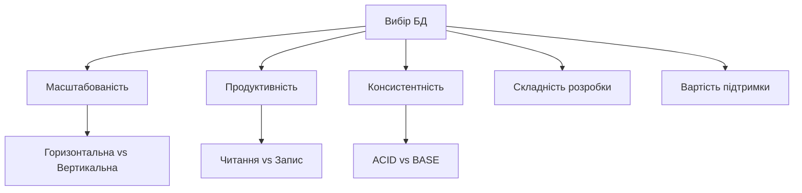
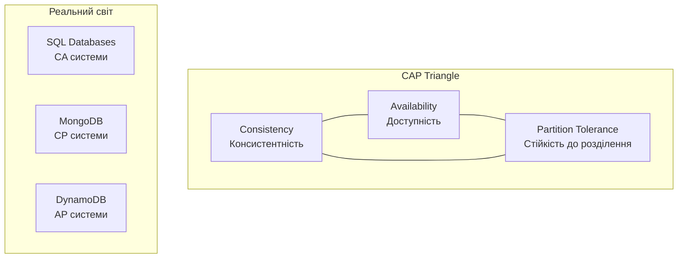
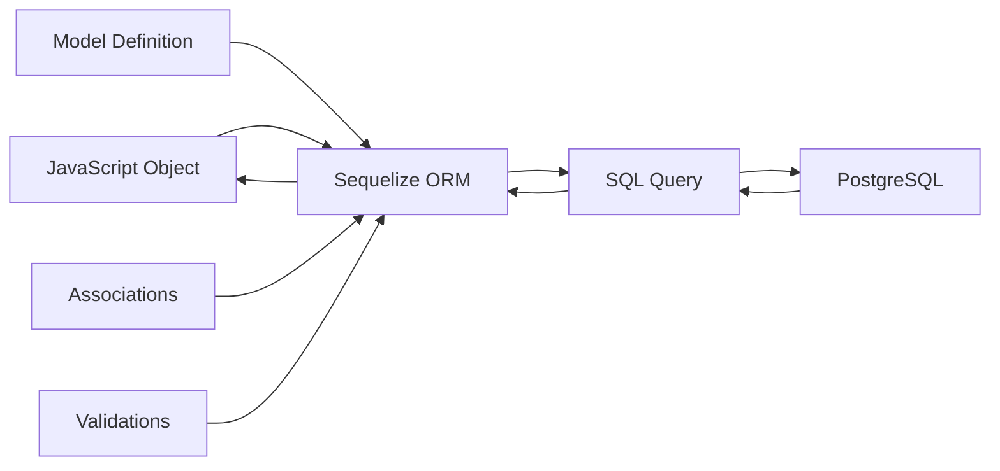
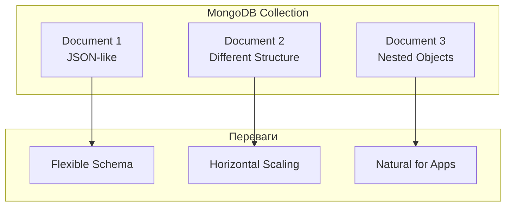
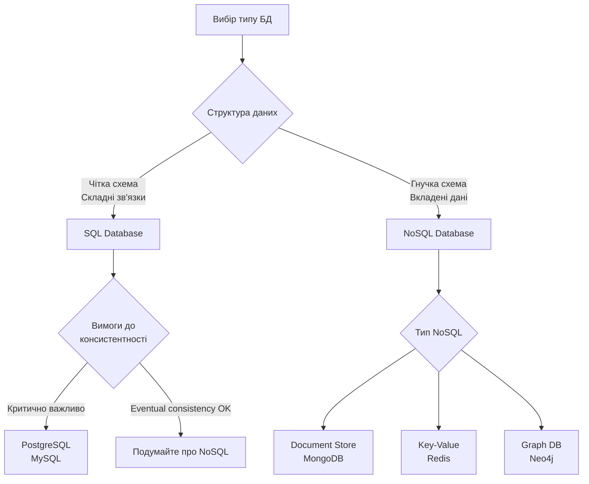
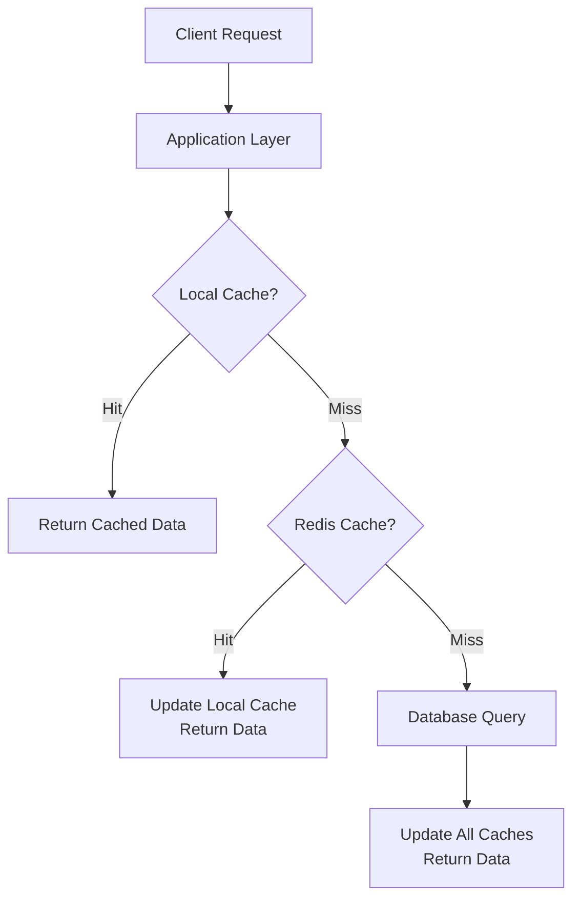
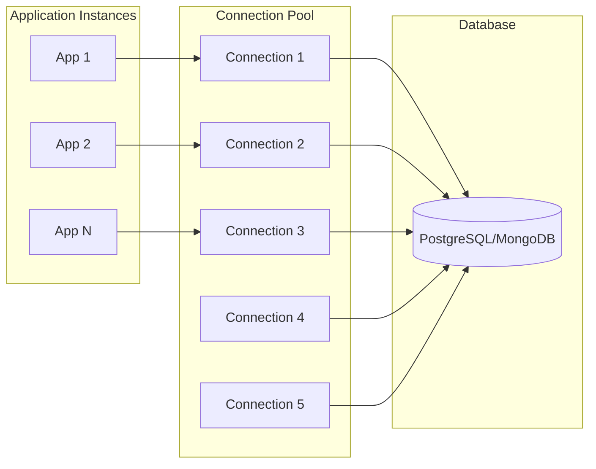
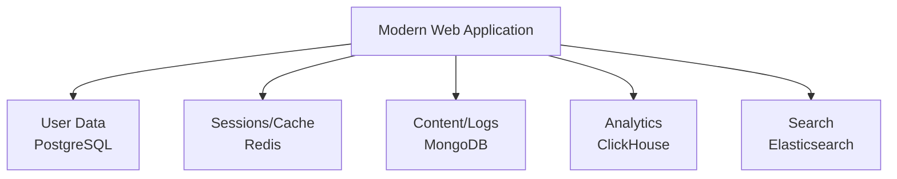

# Бази даних та ORM

## План лекції

1. **SQL vs NoSQL**: філософські відмінності
2. **PostgreSQL**: потужність реляційної моделі
3. **Sequelize ORM**: об'єктно-реляційне відображення
4. **MongoDB + Mongoose**: документо-орієнтований підхід
5. **Паттерни роботи з БД**: Repository, кешування, оптимізація

## Чому важливий вибір бази даних?




## SQL vs NoSQL: Ключові відмінності

### **SQL Бази Даних**
- ✅ **ACID** транзакції
- ✅ **Складні запити** з JOIN
- ✅ **Цілісність даних**
- ❌ Складне горизонтальне масштабування
- ❌ Жорстка схема

### **NoSQL Бази Даних**
- ✅ **Горизонтальне масштабування**
- ✅ **Гнучкість схеми**
- ✅ **Високий performance**
- ❌ Eventual consistency
- ❌ Обмежені можливості запитів

## CAP Теорема



**Можна обрати тільки 2 з 3 властивостей!**

## PostgreSQL: Гібридна потужність

### **Чому PostgreSQL?**
- 🚀 **MVCC** для високої concurrency
- 🔧 **Розширюваність** через extensions
- 📄 **JSON/JSONB** для гібридного підходу
- 📊 **Повнотекстовий пошук**
- 🔒 **Enterprise-рівень безпеки**

```sql
-- JSON в PostgreSQL
CREATE TABLE products (
    id SERIAL PRIMARY KEY,
    name VARCHAR(100),
    specs JSONB
);

-- Пошук по JSON
SELECT * FROM products
WHERE specs @> '{"cpu": "Intel i7"}';
```

## JSONB: Найкраще з двох світів

```sql
-- Створення з JSONB
INSERT INTO products (name, specs) VALUES
('Laptop Pro', '{"cpu": "Intel i7", "ram": "16GB", "ssd": "512GB"}');

-- Індексування JSON полів
CREATE INDEX idx_specs_cpu ON products USING GIN ((specs->'cpu'));

-- Складні JSON запити
SELECT name, specs->'cpu' as processor
FROM products
WHERE specs @> '{"ram": "16GB"}'
AND specs->'price'::numeric < 1000;
```

**PostgreSQL поєднує реляційну надійність з NoSQL гнучкістю!**

## Sequelize ORM: Об'єктно-Реляційне Відображення



**ORM абстрагує SQL та забезпечує безпеку**

## Sequelize: Визначення Моделі

```javascript
class User extends Model {
    getFullName() {
        return `${this.firstName} ${this.lastName}`;
    }
}

User.init({
    id: {
        type: DataTypes.UUID,
        defaultValue: DataTypes.UUIDV4,
        primaryKey: true
    },
    email: {
        type: DataTypes.STRING,
        allowNull: false,
        unique: true,
        validate: { isEmail: true }
    },
    preferences: {
        type: DataTypes.JSONB,
        defaultValue: {}
    }
}, { sequelize, modelName: 'User' });
```

## Sequelize: Асоціації

```javascript
// One-to-Many
User.hasMany(Post, { foreignKey: 'userId', as: 'posts' });
Post.belongsTo(User, { foreignKey: 'userId', as: 'author' });

// Many-to-Many через проміжну таблицю
Post.belongsToMany(Tag, {
    through: 'PostTags',
    as: 'tags'
});

// Використання асоціацій
const user = await User.findByPk(1, {
    include: [
        { model: Post, as: 'posts' },
        { model: Profile, as: 'profile' }
    ]
});
```

## Sequelize: Міграції

```javascript
// Створення міграції
module.exports = {
    up: async (queryInterface, Sequelize) => {
        await queryInterface.createTable('users', {
            id: {
                type: Sequelize.UUID,
                primaryKey: true,
                defaultValue: Sequelize.UUIDV4
            },
            email: {
                type: Sequelize.STRING,
                allowNull: false,
                unique: true
            }
        });
    },

    down: async (queryInterface) => {
        await queryInterface.dropTable('users');
    }
};
```

**Міграції = версіонування схеми БД!**

## MongoDB: Документо-Орієнтований Підхід



**Документи зберігаються як BSON (Binary JSON)**

## MongoDB: Структура Документа

```javascript
// Приклад документа в MongoDB
{
  "_id": ObjectId("..."),
  "username": "john_doe",
  "profile": {
    "firstName": "John",
    "lastName": "Doe",
    "interests": ["programming", "music"]
  },
  "posts": [
    {
      "title": "My First Post",
      "content": "Hello, world!",
      "tags": ["introduction"]
    }
  ],
  "settings": {
    "theme": "dark",
    "notifications": {
      "email": true,
      "push": false
    }
  }
}
```

## Mongoose: ODM для MongoDB

```javascript
const userSchema = new Schema({
    username: {
        type: String,
        required: [true, 'Username is required'],
        unique: true,
        minlength: 3,
        maxlength: 30
    },
    email: {
        type: String,
        required: true,
        unique: true,
        match: /^\w+@\w+\.\w+$/
    },
    profile: {
        firstName: String,
        lastName: String,
        avatar: String
    },
    preferences: {
        theme: { type: String, enum: ['light', 'dark'], default: 'light' }
    }
}, { timestamps: true });
```

## Mongoose: Віртуальні Поля та Методи

```javascript
// Віртуальне поле
userSchema.virtual('profile.fullName').get(function() {
    return `${this.profile.firstName} ${this.profile.lastName}`;
});

// Методи екземпляру
userSchema.methods.getPublicProfile = function() {
    return {
        username: this.username,
        fullName: this.profile.fullName,
        avatar: this.profile.avatar
    };
};

// Статичні методи
userSchema.statics.findByEmail = function(email) {
    return this.findOne({ email: email.toLowerCase() });
};
```

## Mongoose: Middleware (Hooks)

```javascript
// Pre middleware - перед збереженням
userSchema.pre('save', async function(next) {
    if (this.isNew) {
        console.log(`Створюється користувач: ${this.email}`);

        // Генерація аватара
        if (!this.profile.avatar) {
            this.profile.avatar = generateAvatar(this.profile.firstName);
        }
    }
    next();
});

// Post middleware - після збереження
userSchema.post('save', function(doc) {
    console.log(`Користувач збережений: ${doc.email}`);
    // Відправити welcome email
    sendWelcomeEmail(doc.email);
});
```

## SQL vs NoSQL: Коли що використовувати?



## Repository Pattern

```javascript
// Абстракція доступу до даних
class UserRepository {
    constructor(model) {
        this.model = model;
    }

    async findById(id) {
        return await this.model.findByPk(id);
    }

    async findByEmail(email) {
        return await this.model.findOne({ where: { email } });
    }

    async create(userData) {
        return await this.model.create(userData);
    }

    async searchUsers(searchTerm) {
        // Складна логіка пошуку
        return await this.model.findAll({...});
    }
}
```

**Централізована логіка доступу до даних**

## Кешування: Багаторівнева Стратегія



## Кешування: Реалізація

```javascript
class CacheService {
    async get(key) {
        // 1. Локальний кеш (швидкий)
        if (this.localCache.has(key)) {
            return this.localCache.get(key);
        }

        // 2. Redis кеш (середній)
        const cached = await this.redis.get(key);
        if (cached) {
            this.localCache.set(key, JSON.parse(cached));
            return JSON.parse(cached);
        }

        // 3. Cache miss
        return null;
    }

    async set(key, value, ttl = 300) {
        this.localCache.set(key, value);
        await this.redis.setex(key, ttl, JSON.stringify(value));
    }
}
```

## Моніторинг Продуктивності БД

```javascript
class DatabaseMonitor {
    async collectMetrics() {
        // PostgreSQL статистика
        const [results] = await postgres.query(`
            SELECT
                schemaname,
                tablename,
                n_tup_ins as inserts,
                n_tup_upd as updates,
                n_tup_del as deletes
            FROM pg_stat_user_tables
        `);

        // MongoDB статистика
        const mongoStats = await db.runCommand({serverStatus: 1});

        return { postgres: results, mongodb: mongoStats };
    }
}
```

**Моніторинг = превентивна оптимізація!**

## Connection Pooling



**Ефективне використання з'єднань з БД**

## Паттерни Оптимізації

### **Індексування**
```sql
-- B-Tree для звичайних запитів
CREATE INDEX idx_users_email ON users(email);

-- GIN для JSONB та повнотекстовий пошук
CREATE INDEX idx_products_specs ON products USING gin(specifications);

-- Часткові індекси
CREATE INDEX idx_active_users ON users(email) WHERE is_active = true;
```

### **Партиціонування**
```sql
-- Партиціонування за датою
CREATE TABLE sales_2024_q1 PARTITION OF sales
FOR VALUES FROM ('2024-01-01') TO ('2024-04-01');
```

## Транзакції: Забезпечення Цілісності

```javascript
// Sequelize транзакції
async function transferMoney(fromUserId, toUserId, amount) {
    const transaction = await sequelize.transaction();

    try {
        // Зняти гроші
        await Account.decrement('balance', {
            by: amount,
            where: { userId: fromUserId },
            transaction
        });

        // Додати гроші
        await Account.increment('balance', {
            by: amount,
            where: { userId: toUserId },
            transaction
        });

        await transaction.commit();
    } catch (error) {
        await transaction.rollback();
        throw error;
    }
}
```

## Полімодальний Підхід (Polyglot Persistence)



**Використовуйте правильний інструмент для кожної задачі!**

## Рекомендації щодо Вибору

### **Використовуйте SQL коли:**
- 🏦 **Фінансові дані** з критичною консистентністю
- 📊 **Складні звіти** та аналітика
- 🔗 **Багато зв'язків** між сутностями
- 👥 **Команда знає SQL**

### **Використовуйте NoSQL коли:**
- 🚀 **Швидке прототипування**
- 📈 **Горизонтальне масштабування**
- 📄 **Неструктуровані дані**
- ⚡ **High-load системи**
