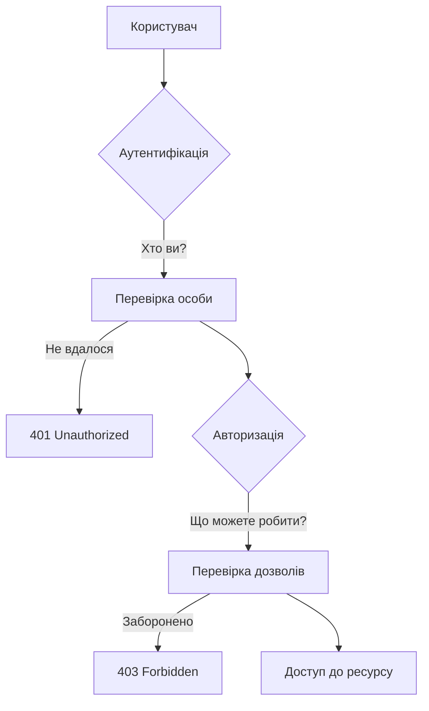
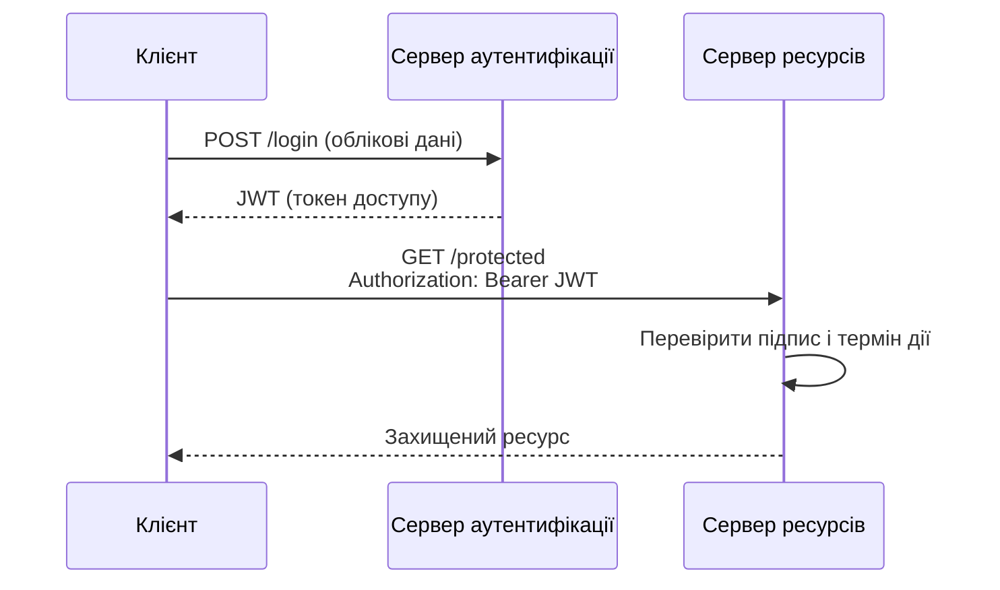
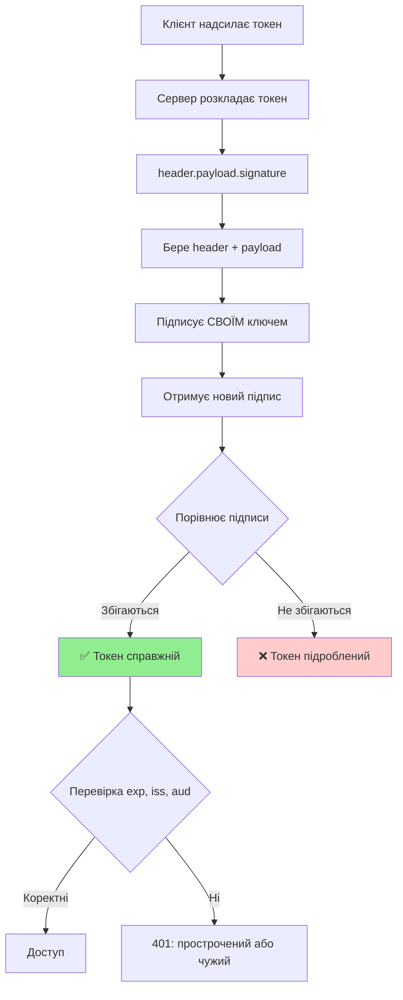
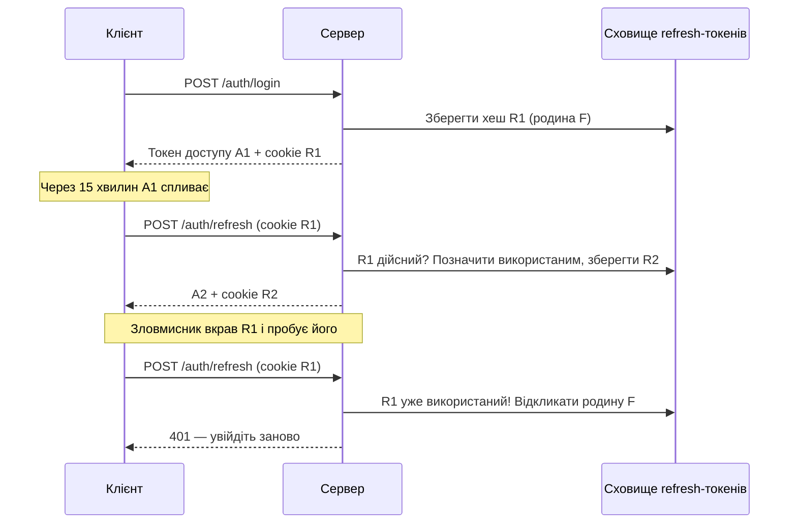
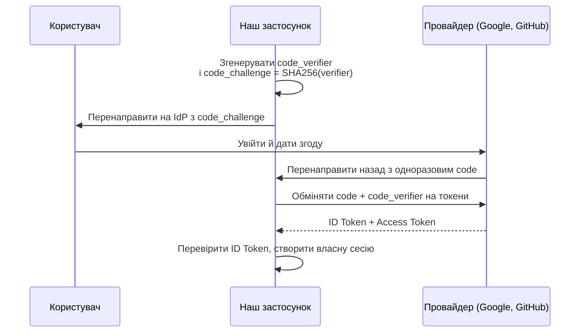
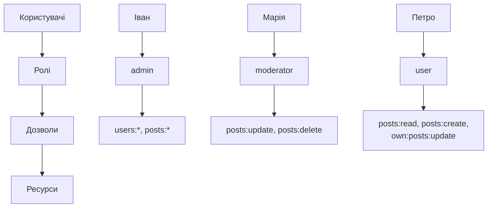
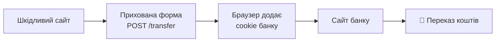
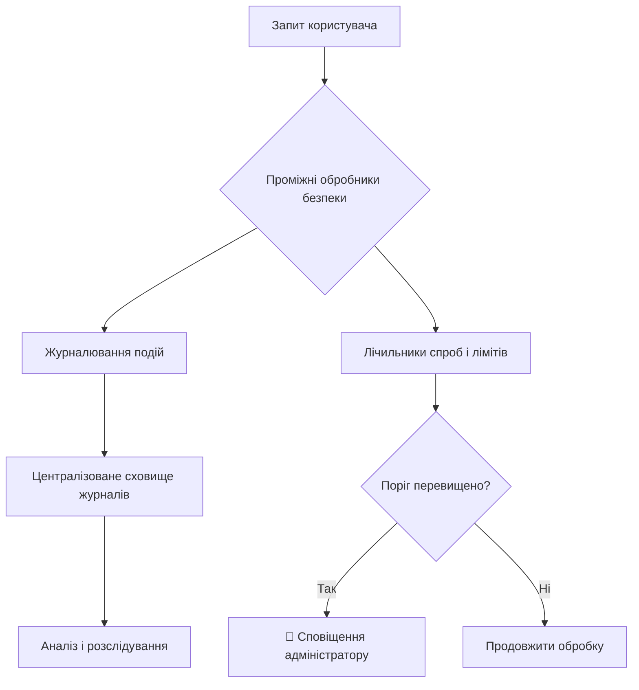
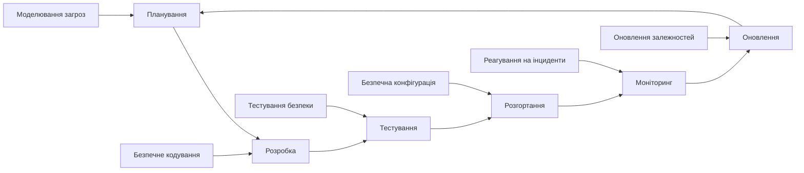

# Аутентифікація та безпека

## 🎯 План лекції

1. **OWASP Top 10:2025** — карта ризиків
2. **Аутентифікація vs авторизація**
3. **Сесії vs JWT**: як працює підпис, де зберігати токени
4. **Паролі**: Argon2id, bcrypt
5. **Middleware**: перевірка токенів, refresh-токени з ротацією
6. **Сучасний вхід**: OAuth 2.0/OIDC + PKCE, passkeys, MFA
7. **Авторизація**: RBAC, власність ресурсів, IDOR
8. **Атаки**: CORS, CSRF, XSS, ін'єкції
9. **Практики**: ліміти, журнали, шифрування, залежності

## 🗺️ OWASP Top 10:2025

| № | Категорія |
|---|-----------|
| A01 | Broken Access Control |
| A02 | Security Misconfiguration |
| A03 | **Software Supply Chain Failures** 🆕 |
| A04 | Cryptographic Failures |
| A05 | Injection |
| A06 | Insecure Design |
| A07 | Authentication Failures |
| A08 | Software or Data Integrity Failures |
| A09 | Security Logging and Alerting Failures |
| A10 | **Mishandling of Exceptional Conditions** 🆕 |

**Остаточна версія — початок 2026 · SSRF увійшла до A01**

## 🔐 Аутентифікація vs Авторизація


```mermaid
graph TD
    A[Користувач] --> B{Аутентифікація}
    B -->|"Хто ви?"| C[Перевірка особи]
    C -->|Не вдалося| X1[401 Unauthorized]
    C --> D{Авторизація}
    D -->|"Що можете робити?"| E[Перевірка дозволів]
    E -->|Заборонено| X2[403 Forbidden]
    E --> F[Доступ до ресурсу]
```

### **Аутентифікація** = «Хто ви?» — знаю / маю / є

### **Авторизація** = «Що ви можете робити?»

## ⚖️ Сесії vs Токени

### 🏪 Сесійна аутентифікація (Stateful)

```mermaid
sequenceDiagram
    participant C as Клієнт
    participant S as Сервер
    participant DB as Сховище сесій

    C->>S: POST /login (облікові дані)
    S->>DB: Створити сесію
    DB-->>S: ID сесії
    S-->>C: Set-Cookie: sid=abc123; HttpOnly; Secure; SameSite=Lax

    C->>S: GET /protected (Cookie: sid=abc123)
    S->>DB: Знайти сесію abc123
    DB-->>S: Дані сесії
    S-->>C: Захищений ресурс
```

- Сховище — Redis/Valkey · `req.session.regenerate()` після входу

## 🎫 JWT токени (Stateless)


```mermaid
sequenceDiagram
    participant C as Клієнт
    participant AS as Сервер аутентифікації
    participant RS as Сервер ресурсів

    C->>AS: POST /login (облікові дані)
    AS-->>C: JWT (токен доступу)

    C->>RS: GET /protected<br/>Authorization: Bearer JWT
    RS->>RS: Перевірити підпис і термін дії
    RS-->>C: Захищений ресурс
```

### JWT: **Header.Payload.Signature**

⚠️ Base64URL — **кодування, не шифрування**: payload читає будь-хто

## 🔍 Як сервер перевіряє справжність JWT?

### **Ключовий принцип: сервер повторює підпис!**


```mermaid
graph TD
    A[Клієнт надсилає токен] --> B[Сервер розкладає токен]
    B --> C[header.payload.signature]

    C --> D[Бере header + payload]
    D --> E[Підписує СВОЇМ ключем]
    E --> F[Отримує новий підпис]

    F --> G{Порівнює підписи}
    G -->|Збігаються| H[✅ Токен справжній]
    G -->|Не збігаються| I[❌ Токен підроблений]

    H --> J{Перевірка exp, iss, aud}
    J -->|Коректні| K[Доступ]
    J -->|Ні| L[401: прострочений або чужий]

    style H fill:#90ee90
    style I fill:#ffcccb
```

## 🔐 Процес перевірки токена

```javascript
import { createHmac, timingSafeEqual } from 'node:crypto';

function verifyToken(token, secret) {
    const [headerB64, payloadB64, signature] = token.split('.');

    // 1. Приймаємо лише очікуваний алгоритм (захист від "alg": "none")
    const header = JSON.parse(Buffer.from(headerB64, 'base64url').toString());
    if (header.alg !== 'HS256') throw new Error('Алгоритм не дозволено');

    // 2. Підписуємо ті самі дані своїм ключем
    const expected = createHmac('sha256', secret)
        .update(`${headerB64}.${payloadB64}`).digest('base64url');

    // 3. Порівнюємо за сталий час, а не через ===
    const a = Buffer.from(expected), b = Buffer.from(signature);
    if (a.length !== b.length || !timingSafeEqual(a, b)) {
        throw new Error('❌ Токен підроблений!');
    }

    // 4. Лише тепер довіряємо вмісту + перевіряємо exp
    return JSON.parse(Buffer.from(payloadB64, 'base64url').toString());
}
```

## 🏛️ Аналогія з печаткою

```
┌─────────────────────────────┐
│ ПОСВІДЧЕННЯ ОСОБИ           │
│ ─────────────────────────── │ ← header
│ Ім'я: Іван Петренко         │ ← payload
│ ID: 123, Роль: user         │
│ Дійсне до: 15:45            │
│ ─────────────────────────── │
│     [ПЕЧАТКА СЕРВЕРА] 🏛️    │ ← signature
└─────────────────────────────┘
```

**Як перевіряє сервер:**

1. 📖 Читає документ
2. 🏛️ Ставить свою печатку на ці дані
3. 🔍 Порівнює з печаткою в документі
4. ✅ Збігаються і не прострочено → справжній

⚠️ **Печатка захищає від підробки, а не від читання!**

## ❌ Чому атака не працює?

### Спроба підробки:
```javascript
// Зловмисник змінює payload:
originalPayload = { sub: '123', role: 'user' }
hackedPayload   = { sub: '123', role: 'admin' }  // ⚠️

// Але підпис залишається старий!
oldSignature = "abc123xyz"   // для старого payload

// Сервер перевіряє:
newSignature = HMAC_SHA256(header + hackedPayload, SECRET)
// Результат: "def456uvw" ≠ "abc123xyz" ❌
```

### **🔑 Без SECRET неможливо створити правильний підпис!**
- Секрет ≥ 256 біт, випадковий: `openssl rand -base64 32`
- Короткий секрет підбирається перебором за хвилини

## 📦 Де зберігати токени?

| Місце | XSS | CSRF |
|-------|-----|------|
| `localStorage` | ❌ Скрипт прочитає токен | ✅ |
| Пам'ять застосунку | ⚠️ Нижчий ризик | ✅ |
| Cookie `HttpOnly; Secure; SameSite` | ✅ Недоступний для JS | ⚠️ Потрібен захист |

**Рекомендація:** refresh-токен — лише в `HttpOnly`-cookie, токен доступу — у пам'яті або cookie

## 📊 Порівняння підходів

| Критерій | Сесії | JWT |
|----------|-------|-----|
| **Стан сервера** | Stateful | Stateless |
| **Масштабування** | ⚠️ Спільне сховище | ✅ Просте |
| **Відкликання** | ✅ Миттєве | ⚠️ Короткий термін + refresh |
| **Розмір** | ✅ Малий | ⚠️ Сотні байтів |
| **Клієнти** | Браузер | Будь-які |
| **Ризики** | CSRF, фіксація сесії | Слабкий секрет, XSS, помилки перевірки |

**Жоден підхід не безпечний «за замовчуванням»**

## 🔒 Хешування паролів

### ❌ Небезпечно
```javascript
// НІКОЛИ! Швидкий хеш без солі → мільярди спроб/с на GPU
const hash = createHash('sha256').update(password).digest('hex');
```

### ✅ Argon2id — перший вибір OWASP

```javascript
import argon2 from 'argon2';

const hash = await argon2.hash(password, {
    type: argon2.argon2id,
    memoryCost: 19456,   // 19 МіБ — мінімум OWASP
    timeCost: 2,
    parallelism: 1
});

const ok = await argon2.verify(hash, password);
```

**Паролі хешують, а не шифрують**

## 🔒 bcrypt — допустима альтернатива

```javascript
import bcrypt from 'bcryptjs';

const hash = await bcrypt.hash(password, 12);   // cost ≥ 10, краще 12+
const ok = await bcrypt.compare(password, hash);
```

- ⚠️ bcrypt бачить лише **72 байти**: українська літера = 2 байти
- Ще варіант без пакетів — вбудований `crypto.scrypt`

### Вхід без витоку інформації
- Однакове повідомлення: «Невірний email або пароль»
- Перевірка фіктивного хешу, якщо користувача немає → однаковий час відповіді

## 🔧 Middleware аутентифікації

```javascript
import jwt from 'jsonwebtoken';

export function authenticate(req, res, next) {
    const [scheme, token] = req.get('Authorization')?.split(' ') ?? [];
    if (scheme !== 'Bearer' || !token) {
        throw new AuthenticationError('Токен доступу відсутній');
    }

    try {
        const payload = jwt.verify(token, process.env.JWT_SECRET, {
            algorithms: ['HS256'],                  // явний перелік!
            issuer: 'https://api.example.com',
            audience: 'https://app.example.com'
        });
        req.user = { id: payload.sub, role: payload.role };
        next();
    } catch {
        throw new AuthenticationError('Недійсний або прострочений токен'); // 401, не 403
    }
}
```

## 🔄 Refresh-токени з ротацією


```mermaid
sequenceDiagram
    participant C as Клієнт
    participant S as Сервер
    participant DB as Сховище refresh-токенів

    C->>S: POST /auth/login
    S->>DB: Зберегти хеш R1 (родина F)
    S-->>C: Токен доступу A1 + cookie R1

    Note over C: Через 15 хвилин A1 спливає
    C->>S: POST /auth/refresh (cookie R1)
    S->>DB: R1 дійсний? Позначити використаним, зберегти R2
    S-->>C: A2 + cookie R2

    Note over C,S: Зловмисник вкрав R1 і пробує його
    C->>S: POST /auth/refresh (cookie R1)
    S->>DB: R1 уже використаний! Відкликати родину F
    S-->>C: 401 — увійдіть заново
```

- Випадковий рядок, у БД — **хеш** · cookie `HttpOnly; Secure; SameSite=Strict; Path=/api/v1/auth`

## 🌐 OAuth 2.0 + OpenID Connect


```mermaid
sequenceDiagram
    participant U as Користувач
    participant App as Наш застосунок
    participant IdP as Провайдер (Google, GitHub)

    App->>App: Згенерувати code_verifier<br/>і code_challenge = SHA256(verifier)
    App->>U: Перенаправити на IdP з code_challenge
    U->>IdP: Увійти й дати згоду
    IdP->>App: Перенаправити назад з одноразовим code
    App->>IdP: Обміняти code + code_verifier на токени
    IdP-->>App: ID Token + Access Token
    App->>App: Перевірити ID Token, створити власну сесію
```

- **OAuth 2.0** — делегування доступу · **OIDC** — вхід
- **PKCE** захищає перехоплений код · обов'язковий у проєкті OAuth 2.1

## 🔑 Passkeys і MFA

### **Passkeys (WebAuthn / FIDO2)**
- Пара ключів для кожного сайту, закритий — на пристрої
- ✅ Стійкі до фішингу (прив'язка до домену)
- ✅ Витік бази відкритих ключів нічого не дає
- ✅ Пристрій + біометрія/PIN = два фактори за один крок

### **Другі фактори (від слабшого до сильнішого)**
- SMS → TOTP-застосунок → апаратний ключ / passkey

**Для адміністраторів MFA — обов'язкова**

## 👥 Система ролей (RBAC)


```mermaid
graph TD
    A[Користувачі] --> B[Ролі]
    B --> C[Дозволи]
    C --> D[Ресурси]

    A1[Іван] --> B1[admin]
    A2[Марія] --> B2[moderator]
    A3[Петро] --> B3[user]

    B1 --> C1["users:*, posts:*"]
    B2 --> C2["posts:update, posts:delete"]
    B3 --> C3["posts:read, posts:create,<br/>own:posts:update"]
```

## 🛡️ Middleware авторизації

```javascript
export function requireRole(...roles) {
    return (req, res, next) => {
        if (!req.user) throw new AuthenticationError();
        if (!roles.includes(req.user.role)) throw new ForbiddenError();
        next();
    };
}

app.get('/api/v1/admin/users', authenticate, requireRole('admin'), listUsers);
```

⚠️ Роль у токені — стан **на момент видачі** (ще до 15 хв після зміни)

## 🕵️ Власність ресурсу та IDOR

```javascript
// ❌ IDOR: /orders/1001 → /orders/1002 і бачимо чуже замовлення
// ✅ Перевірка власності ПІСЛЯ завантаження ресурсу
app.patch('/api/v1/posts/:id', authenticate, async (req, res) => {
    const post = await postService.findById(req.params.id);

    if (!post || !canAccess(req.user, 'posts', 'update', post)) {
        throw new NotFoundError('Пост не знайдено');   // не розкриваємо існування
    }
    res.json(await postService.update(post.id, req.valid.body));
});
```

**Ще надійніше:** `WHERE id = :id AND author_id = :userId`

**A01 OWASP — найчастіша вразливість!**

## 🌐 CORS: Cross-Origin Resource Sharing

### Суть
Браузер не дає JS з одного джерела читати відповіді іншого → сервер явно дозволяє

### ⚠️ CORS — **не захист сервера**: curl і Postman його ігнорують

```javascript
const ALLOWED_ORIGINS = new Set(['https://app.example.com']);

app.use(cors({
    origin(origin, callback) {
        callback(null, !origin || ALLOWED_ORIGINS.has(origin));
    },
    credentials: true,
    allowedHeaders: ['Content-Type', 'Authorization', 'Idempotency-Key', 'If-Match'],
    exposedHeaders: ['ETag', 'Location', 'X-Request-Id']
}));
```

**❌ Будь-яке джерело + `credentials: true` = критична помилка**

## 🎭 CSRF: Cross-Site Request Forgery


```mermaid
graph LR
    A[Шкідливий сайт] --> B[Прихована форма<br/>POST /transfer]
    B --> C[Браузер додає<br/>cookie банку]
    C --> D[Сайт банку]
    D --> E[💸 Переказ коштів]
```

- Загрожує лише **cookie-аутентифікації** (Bearer-токен у заголовку — ні)
- ❌ `csurf` — архівовано 2022, офіційно застарілий з травня 2025

## 🎭 Сучасний захист від CSRF

1. **`SameSite=Lax/Strict`** для cookie
2. **`Sec-Fetch-Site`** — відхиляти змінювальні запити з `cross-site`
3. **`Origin`** — для старих браузерів
4. **CSRF-токени** — для форм: csrf-csrf, csrf-sync

```javascript
export function csrfProtection(req, res, next) {
    if (['GET', 'HEAD', 'OPTIONS'].includes(req.method)) return next();

    const site = req.get('Sec-Fetch-Site');
    if (site) {
        if (site === 'same-origin' || site === 'none') return next();
        throw new ForbiddenError('Міжсайтовий запит заблоковано');
    }
    if (ALLOWED_ORIGINS.has(req.get('Origin'))) return next();
    throw new ForbiddenError('Не вдалося підтвердити джерело запиту');
}
```

**Працює, лише якщо GET справді нічого не змінює!**

## 💉 XSS: Cross-Site Scripting

### Типи XSS атак

- **Відбитий**: шкідливий код у URL
- **Збережений**: код у базі даних
- **DOM-based**: клієнтський JS вставляє неперевірені дані

### Захист

- ✅ **Контекстне екранування при виведенні** (React робить це сам)
- ❌ «Очищення» всіх вхідних даних на вході — псує дані й не захищає
- ✅ HTML від користувача → **DOMPurify** з білим списком тегів

```javascript
DOMPurify.sanitize(dirty, {
    ALLOWED_TAGS: ['b', 'i', 'em', 'strong', 'p', 'br', 'a'],
    ALLOWED_ATTR: ['href']
});
```

## 🧱 Content Security Policy

```javascript
app.use((req, res, next) => {
    res.locals.cspNonce = randomBytes(16).toString('base64');
    next();
});

app.use(helmet({
    contentSecurityPolicy: {
        directives: {
            defaultSrc: ["'self'"],
            scriptSrc: ["'self'", (req, res) => `'nonce-${res.locals.cspNonce}'`],
            objectSrc: ["'none'"],
            frameAncestors: ["'none'"]
        }
    }
}));
```

- ❌ `'unsafe-inline'` у `scriptSrc` скасовує захист від XSS
- ❌ `X-XSS-Protection` — застарів, Helmet ставить `0`

## 💉 Ін'єкції: SQL та NoSQL

```javascript
// ❌ SQL-ін'єкція
await sequelize.query(`SELECT * FROM users WHERE email = '${req.query.email}'`);

// ✅ Параметризований запит
await sequelize.query('SELECT * FROM users WHERE email = :email', {
    replacements: { email: req.query.email }, type: QueryTypes.SELECT
});

// ❌ Ін'єкція операторів MongoDB
// { "email": "a@b.c", "password": { "$ne": null } }
// ✅ Схема валідації: password — лише рядок
```

**❌ Блокування запитів зі словом «SELECT» — хибне відчуття безпеки**

## 🚀 Rate Limiting

### Захист від перебору паролів

```javascript
import { rateLimit } from 'express-rate-limit';

const generalLimiter = rateLimit({
    windowMs: 15 * 60 * 1000,
    limit: 300,                 // раніше — max
    standardHeaders: 'draft-7',
    legacyHeaders: false
});

const authLimiter = rateLimit({
    windowMs: 15 * 60 * 1000,
    limit: 5,                   // лише 5 невдалих спроб
    skipSuccessfulRequests: true
});

app.use('/api', generalLimiter);
app.use('/api/v1/auth/login', authLimiter);
```

- Кілька екземплярів → лічильники в Redis/Valkey
- `app.set('trust proxy', 1)` — інакше всі клієнти мають одну IP

## 🔑 Політика паролів

### ❌ Застаріло
- «Обов'язково велика літера, цифра, спецсимвол»
- Примусова зміна кожні 90 днів

### ✅ Сучасні рекомендації (NIST, OWASP)
- Довжина важливіша: мінімум 8, краще **12–15**
- Паролі-фрази й будь-які символи Unicode
- Перевірка за базою **зламаних паролів** (HIBP, k-анонімність)
- Зміна — лише за ознак компрометації

## 📊 Журналювання та моніторинг


```mermaid
graph TD
    A[Запит користувача] --> B{Проміжні обробники безпеки}
    B --> C[Журналювання подій]
    B --> D[Лічильники спроб і лімітів]
    C --> E[Централізоване сховище журналів]
    D --> F{Поріг перевищено?}
    F -->|Так| G[🚨 Сповіщення адміністратору]
    F -->|Ні| H[Продовжити обробку]
    E --> I[Аналіз і розслідування]
```

### Що журналювати:
- Спроби входу, зміни паролів і ролей, відмови в доступі, повторне використання refresh-токенів

### ❌ Що НЕ журналювати:
- Паролі, токени, cookie, номери документів і карток

## 🔐 Шифрування даних

```javascript
import { createCipheriv, createDecipheriv, randomBytes } from 'node:crypto';

// ❌ createCipher / createDecipher — ВИЛУЧЕНО з Node.js
export function encrypt(plaintext, aad = '') {
    const iv = randomBytes(12);                          // новий IV щоразу!
    const cipher = createCipheriv('aes-256-gcm', KEY, iv);
    cipher.setAAD(Buffer.from(aad));
    const data = Buffer.concat([cipher.update(plaintext, 'utf8'), cipher.final()]);
    return [iv, cipher.getAuthTag(), data].map(b => b.toString('base64url')).join('.');
}

export function decrypt(payload, aad = '') {
    const [iv, tag, data] = payload.split('.').map(p => Buffer.from(p, 'base64url'));
    const decipher = createDecipheriv('aes-256-gcm', KEY, iv);
    decipher.setAAD(Buffer.from(aad));
    decipher.setAuthTag(tag);                            // змінені дані → помилка
    return Buffer.concat([decipher.update(data), decipher.final()]).toString('utf8');
}
```

### **Ключ — окремо від даних · HTTPS у робочому середовищі — обов'язково!**

## ⚙️ Безпечне робоче середовище

```javascript
// Неповна конфігурація → застосунок не стартує
const env = z.object({
    JWT_SECRET: z.string().min(32),
    ENCRYPTION_KEY: z.string().regex(/^[0-9a-f]{64}$/i),
    DATABASE_URL: z.url()
}).parse(process.env);

app.set('trust proxy', 1);
app.disable('x-powered-by');
app.use(helmet());   // HSTS, nosniff, frame-options, referrer-policy...
```

- Секрети — не в репозиторії (`.env` у `.gitignore`)
- Детальні помилки — лише в журнал

## 📦 Безпека залежностей (A03)

- 🔒 `package-lock.json` у репозиторії + `npm ci`
- 🔍 `npm audit`, Dependabot / Renovate
- 🤔 Кожен новий пакет — ризик: перевіряйте, чи він справді потрібен
- ⚠️ Скрипти встановлення виконують код під час `npm install`
- 🟢 Лише LTS-версії Node.js

**Атаки через скомпрометовані npm-пакети стали масовими**

## ✅ Чекліст безпеки

### Аутентифікація
- ✅ Argon2id (або bcrypt cost ≥ 10)
- ✅ Короткі токени доступу + refresh з ротацією
- ✅ MFA / passkeys
- ✅ Ліміт спроб входу

### Авторизація
- ✅ Доступ заборонено за замовчуванням
- ✅ Перевірка власності ресурсу (IDOR)
- ✅ Найменші привілеї

### Захист від атак
- ✅ CORS з переліком джерел
- ✅ SameSite + Sec-Fetch-Site для cookie
- ✅ Екранування виведення + CSP без `unsafe-inline`
- ✅ Валідація схемами + параметризовані запити

## 🛠️ Інструменти безпеки

### Автоматизація
- **Helmet** — безпечні HTTP-заголовки
- **express-rate-limit** — обмеження запитів
- **Zod / express-validator** — валідація вхідних даних
- **argon2 / bcryptjs** — хешування паролів

### Тестування
- **OWASP ZAP**, **Burp Suite** — сканування й ручне тестування
- **npm audit**, **Snyk**, **Dependabot** — залежності
- **Semgrep**, **gitleaks** — статичний аналіз і пошук секретів

### Навчання
- **OWASP Juice Shop**, **WebGoat**, **DVWA**

## 🚨 Типові помилки

### ❌ Що НЕ робити

- Перевіряти лише вхід, але не власність ресурсу
- Зберігати паролі відкрито чи швидким хешем (MD5, SHA-*)
- Короткий або «зашитий» у код секрет JWT
- Токени в `localStorage` при XSS-уразливості
- CORS «для всіх» разом із cookie
- Використовувати `csurf`, `crypto.createCipher`
- Показувати стек помилок користувачу

### ✅ Що робити ЗАВЖДИ

- Валідувати ВСІ вхідні дані на сервері
- HTTPS скрізь
- Оновлювати залежності
- Журналювати безпекові події
- Тестувати на вразливості

## 📈 Життєвий цикл безпеки


```mermaid
graph LR
    A[Планування] --> B[Розробка]
    B --> C[Тестування]
    C --> D[Розгортання]
    D --> E[Моніторинг]
    E --> F[Оновлення]
    F --> A

    A1[Моделювання загроз] --> A
    B1[Безпечне кодування] --> B
    C1[Тестування безпеки] --> C
    D1[Безпечна конфігурація] --> D
    E1[Реагування на інциденти] --> E
    F1[Оновлення залежностей] --> F
```

## 💡 Ключові принципи

### Defense in Depth
**Кілька рівнів захисту краще за один досконалий**

### Principle of Least Privilege
**Мінімальні необхідні дозволи**

### Fail Secure
**Помилка → відмова в доступі, а не доступ**

### Security by Design
**Безпека з самого початку, не як доповнення**

### Don't Roll Your Own Crypto
**Лише перевірені алгоритми й бібліотеки**

## 📚 Ресурси для поглиблення

### Документація
- [OWASP Top 10:2025](https://owasp.org/Top10/2025/)
- [OWASP Cheat Sheet Series](https://cheatsheetseries.owasp.org/)
- [MDN Web Security](https://developer.mozilla.org/en-US/docs/Web/Security)
- [RFC 8725: JWT Best Current Practices](https://www.rfc-editor.org/rfc/rfc8725)
- [passkeys.dev](https://passkeys.dev/)

### Практика
- [OWASP Juice Shop](https://owasp.org/www-project-juice-shop/) — навчальний вразливий застосунок
- [WebGoat](https://owasp.org/www-project-webgoat/) — навчальні вразливості
- [DVWA](https://github.com/digininja/DVWA) — тестове середовище
- [TryHackMe](https://tryhackme.com/) — практичні завдання

## 🎉 Висновки

### Безпека — не опція, а необхідність

- **Комплексний підхід**: від паролів до залежностей
- **Постійне оновлення знань**: за рік змінилися OWASP Top 10, рекомендації щодо паролів, захист від CSRF
- **Превентивні заходи** дешевші за реагування
- **Тестування безпеки** на всіх етапах розробки
