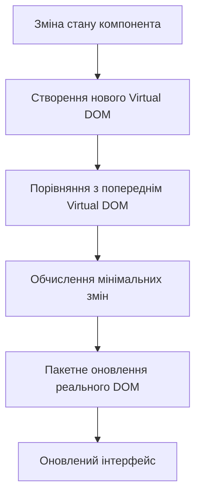
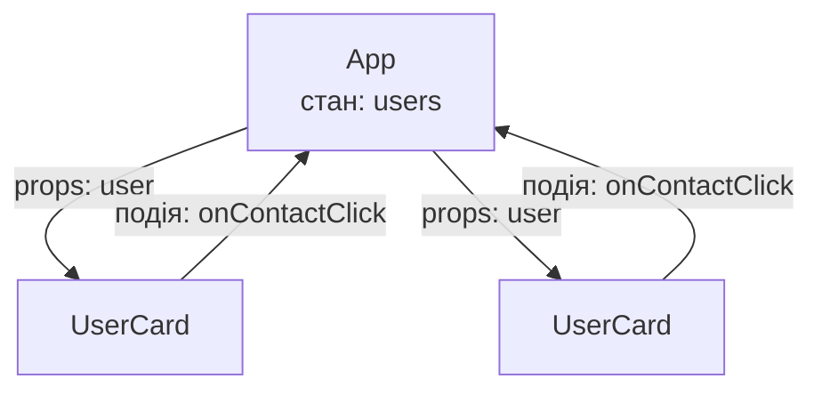

# React основи та сучасні підходи

### Лекція 7. Клієнтська частина: React 19, Vite 8, TypeScript


## План лекції

1. Вступ до React
2. JSX: синтаксис та можливості
3. React компоненти
4. Props та композиція
5. React Developer Tools
6. Налаштування проєкту з Vite
7. TypeScript з React
8. Тестування компонентів
9. Висновки та найкращі практики


## Де ми в курсі

- Лекції 1–6: **серверна частина** (API, БД, автентифікація, тестування, розгортання)
- Лекція 7: **клієнтська частина** — інтерфейс у браузері
- Далі: хуки, стан застосунку, маршрутизація, взаємодія з API

**Актуалізовано під:** React 19 (19.2) · Vite 8 · Node.js 24


## Вступ до React

### Історія та еволюція

| Рік | Подія |
| --- | --- |
| 2013 | Публічний реліз (JSConf US) |
| 2015 | React Native |
| 2017 | React 16: Fiber |
| 2019 | React 16.8: **хуки** |
| 2022 | React 18: конкурентне відтворення, `createRoot` |
| 2024 | React 19: Actions, `use`, `ref` як prop |
| 2025 | React 19.2, **React Compiler 1.0** |

**Еволюція, а не революція:** старий код продовжує працювати


## Філософія React

### Ключові принципи

**Декларативність**
Описуємо, *що* відображати, а не *як*

**Компонентна архітектура**
Інтерфейс — дерево компонентів

**Однонаправлений потік даних**
Дані — вниз (props), події — вгору (функції)

**Інтерфейс як функція стану**
Змінили дані — React оновив сторінку

**Learn Once, Write Anywhere**
Веб, React Native, серверне відтворення


## Virtual DOM

### Як це працює



**Переваги:**
- Мінімальні маніпуляції з реальним DOM
- Пакетні оновлення
- Зручна декларативна модель за прийнятної швидкості


## Фази оновлення

- **Відтворення (render)** — виклик функцій компонентів, побудова нового дерева; може перериватися (Fiber)
- **Фіксація (commit)** — застосування змін до DOM; синхронна, не переривається
- **Ефекти** — `useEffect` після оновлення DOM

**Ключове правило:** у фазі відтворення — жодних побічних дій


## Екосистема сьогодні

- **React — бібліотека**, а не фреймворк
- **Create React App — застарілий** (лютий 2025)
- Нові проєкти: фреймворки (Next.js, React Router, TanStack Start) або **Vite** для SPA
- **React Compiler** — автоматична мемоїзація
- **TanStack Query** — стан сервера (у лабораторних)

**У курсі:** Vite + власний Express-сервер


## JSX: JavaScript XML

### Що це

```javascript
// JSX виглядає як HTML
const element = <h1>Привіт, React!</h1>;

// Але насправді це синтаксичний цукор
const element = React.createElement('h1', null, 'Привіт, React!');
```

- Не обов'язковий, але значно читабельніший
- Перетворюється на JavaScript інструментом збирання (Vite)
- Розділення за **відповідальністю**, а не за технологією


## Правила JSX

### Єдиний кореневий елемент

```javascript
// Правильно
function UserCard() {
    return (
        <div className="card">
            <h2>Іван Петренко</h2>
            <p>Розробник</p>
        </div>
    );
}

// Правильно: Fragment
function UserInfo() {
    return (
        <>
            <h2>Іван Петренко</h2>
            <p>Розробник</p>
        </>
    );
}
```


## Правила JSX (продовження)

### Атрибути та теги

```javascript
function StyledButton({ handleClick }) {
    return (
        <button
            className="btn-primary"      // замість class
            onClick={handleClick}        // замість onclick
            tabIndex={0}                 // замість tabindex
            aria-label="Кнопка дії"      // aria-* з дефісом
        >
            Натисніть мене
        </button>
    );
}
```

- Усі теги закриті: ``, `<input />`, `<br />`
- Ім'я компонента — **з великої літери**


## JavaScript в JSX

### Вирази у фігурних дужках

```javascript
function UserProfile({ user }) {
    const age = new Date().getFullYear() - user.birthYear;

    return (
        <div className="profile">
            <h1>{user.name}</h1>
            <p>Вік: {age} років</p>
            <p>{age >= 18 ? 'Повнолітній' : 'Неповнолітній'}</p>

            {user.isVerified && <span className="badge">Верифіковано</span>}

            <ul>
                {user.skills.map((skill) => (
                    <li key={skill}>{skill}</li>
                ))}
            </ul>
        </div>
    );
}
```

JSX **екранує** значення — захист від XSS


## Ключі списків

- `key` — стабільний і унікальний серед сусідів
- Ідеал: `id` з бази даних
- **Не** `key={index}` для списків, що змінюються: стан «переїжджає» до не тих елементів

```javascript
// Добре
{users.map((user) => <UserListItem key={user.id} user={user} />)}

// Погано, якщо список змінюється
{users.map((user, index) => <UserListItem key={index} user={user} />)}
```


## Умовне відтворення

### Способи

```javascript
function ProductCard({ product, user }) {
    // 1. Раннє повернення — ДО звернення до полів
    if (!product) return <div>Товар не знайдено</div>;
    if (product.outOfStock) return <div>Немає в наявності</div>;

    // 2. Тернарний оператор
    const priceDisplay = user.isPremium
        ? <span>{product.price * 0.9} грн</span>
        : <span>{product.price} грн</span>;

    return (
        <div className="product-card">
            <h3>{product.name}</h3>
            {priceDisplay}
            {/* 3. Логічне && */}
            {product.discount > 0 && <div className="badge">Знижка {product.discount}%</div>}
        </div>
    );
}
```

**Пастка:** `{items.length && ...}` виведе `0` → пишіть `items.length > 0 &&`


## Функціональні компоненти

### Основа сучасного React

```javascript
function Welcome() {
    return <h1>Вітаємо в React!</h1>;
}

function Greeting({ name, title }) {
    return <h2>{title} {name}</h2>;
}
```

```javascript
// src/main.jsx — React 18+ / 19
import { StrictMode } from 'react';
import { createRoot } from 'react-dom/client';
import App from './App.jsx';

createRoot(document.getElementById('root')).render(
    <StrictMode><App /></StrictMode>
);
```

`StrictMode` у розробці викликає код двічі — це перевірка, а не помилка


## Чисті компоненти

### Правила React

- Однакові props і стан → однаковий результат
- **Не змінювати** props, стан і зовнішні змінні «на місці»
- **Без побічних дій** під час відтворення (запити, підписки, `document.title`) — лише в обробниках подій та ефектах
- Хуки — **лише на верхньому рівні** компонента чи власного хука; не в умовах і циклах
- Перевіряє `eslint-plugin-react-hooks`


## Стан: useState

```javascript
import { useState } from 'react';

function Counter() {
    const [count, setCount] = useState(0);

    return (
        <div>
            <p>Натиснуто разів: {count}</p>
            <button onClick={() => setCount((prev) => prev + 1)}>Додати</button>
        </div>
    );
}
```

- Стан — «знімок» на момент відтворення
- Масиви й об'єкти — **не змінювати на місці**: `setItems([...items, item])`


## Ефекти: useEffect

```javascript
function OnlineStatus() {
    const [isOnline, setIsOnline] = useState(navigator.onLine);

    useEffect(() => {
        const update = () => setIsOnline(navigator.onLine);
        window.addEventListener('online', update);
        window.addEventListener('offline', update);

        return () => {                              // очищення
            window.removeEventListener('online', update);
            window.removeEventListener('offline', update);
        };
    }, []);                                         // залежності

    return <p>{isOnline ? 'Ви в мережі' : 'Немає з’єднання'}</p>;
}
```

**Ефект — для синхронізації із зовнішнім світом**, а не для обчислень


## Class компоненти

### Історичний контекст

```javascript
class UserProfile extends React.Component {
    state = { user: null, loading: true, error: null };
    controller = new AbortController();

    componentDidMount() { this.fetchUserData(); }

    componentDidUpdate(prevProps) {
        if (prevProps.userId !== this.props.userId) this.fetchUserData();
    }

    componentWillUnmount() { this.controller.abort(); }

    render() {
        const { user, loading, error } = this.state;
        if (loading) return <div>Завантаження...</div>;
        if (error) return <div>Помилка: {error}</div>;
        return <h1>{user.name}</h1>;
    }
}
```

- Працюють і в React 19, але **нових не пишуть**
- Нові можливості — лише для функціональних компонентів


## Функціональні vs Класові

| | Функціональні | Класові |
| --- | --- | --- |
| Службовий код | мало | `constructor`, `this` |
| Повторне використання логіки | власні хуки | HOC, Render Props |
| Проблеми з `this` | немає | є |
| Компілятор React, `use`, Actions | так | ні |

**Логіка життєвого циклу:** у класі розкидана по трьох методах, у хуках — в одному ефекті


## Завантаження даних в ефекті

```javascript
useEffect(() => {
    const controller = new AbortController();

    async function fetchUserData() {
        try {
            const response = await fetch(`/api/users/${userId}`, { signal: controller.signal });
            if (!response.ok) throw new Error(`Сервер відповів: ${response.status}`);
            setUser(await response.json());
        } catch (err) {
            if (err.name !== 'AbortError') setError(err.message);
        } finally {
            if (!controller.signal.aborted) setLoading(false);
        }
    }

    fetchUserData();
    return () => controller.abort();   // скасування запиту
}, [userId]);
```

- `fetch` **не кидає** помилку для 404/500 → перевіряємо `response.ok`
- У проєктах: **TanStack Query** (кеш, повтори, дедублікація)


## Props: передача даних



```javascript
<UserCard
    name={user.name}
    isVerified={true}
    skills={['React', 'TypeScript', 'Node.js']}
    onContactClick={() => console.log('Контакт')}
/>
```

- Props **лише для читання**
- Вниз — дані, вгору — події (функції-обробники)


## Деструктуризація Props

```javascript
function Button({ text = 'Натиснути', variant = 'primary', disabled = false, onClick }) {
    return (
        <button className={`btn btn-${variant}`} disabled={disabled} onClick={onClick}>
            {text}
        </button>
    );
}

// Rest-оператор для решти props
function Input({ label, error, ...inputProps }) {
    return (
        <div className="input-group">
            <label>{label}</label>
            <input {...inputProps} />
            {error && <span className="error">{error}</span>}
        </div>
    );
}
```

**Значення за замовчуванням** — у параметрах; `defaultProps` у React 19 не працює


## Children Prop

```javascript
function Card({ children }) {
    return (
        <div className="card">
            <div className="card-content">{children}</div>
        </div>
    );
}

<Card>
    <h2>Заголовок картки</h2>
    <p>Це вміст усередині картки</p>
</Card>
```

**Композиція замість успадкування**


## Layout з множинними slots

```javascript
function PageLayout({ header, sidebar, children, footer }) {
    return (
        <div className="page-layout">
            <header className="header">{header}</header>
            <div className="main-content">
                <aside className="sidebar">{sidebar}</aside>
                <main className="content">{children}</main>
            </div>
            <footer className="footer">{footer}</footer>
        </div>
    );
}

<PageLayout header={<Navigation />} sidebar={<Sidebar />} footer={<Footer />}>
    <h1>Основний вміст</h1>
</PageLayout>
```


## Композиційні патерни

### Контейнер і подання → власний хук

```javascript
function useUsers() {
    const [users, setUsers] = useState([]);
    const [loading, setLoading] = useState(true);
    const [error, setError] = useState(null);
    // ... завантаження в useEffect з AbortController
    return { users, loading, error };
}

function UserListContainer() {
    const { users, loading, error } = useUsers();

    if (loading) return <LoadingSpinner />;
    if (error) return <ErrorMessage message={error} />;
    return <UserList users={users} />;
}
```

Подання (`UserList`) — лише вигляд, легко тестується


## Складені компоненти через Context

```javascript
const TabsContext = createContext(null);

function Tabs({ children, defaultTab = 0 }) {
    const [activeTab, setActiveTab] = useState(defaultTab);
    return (
        <TabsContext value={{ activeTab, setActiveTab }}>
            <div className="tabs">{children}</div>
        </TabsContext>
    );
}

function Tab({ index, children }) {
    const { activeTab, setActiveTab } = useTabs();
    return (
        <button role="tab" aria-selected={index === activeTab} onClick={() => setActiveTab(index)}>
            {children}
        </button>
    );
}
```

- `cloneElement` — крихкий, застарілий підхід
- Контекст працює на будь-якій глибині вкладення


## Використання складених компонентів

```javascript
<Tabs defaultTab={0}>
    <TabList>
        <Tab index={0}>Профіль</Tab>
        <Tab index={1}>Налаштування</Tab>
        <Tab index={2}>Сповіщення</Tab>
    </TabList>

    <TabPanel index={0}><UserProfile userId={1} /></TabPanel>
    <TabPanel index={1}><Settings /></TabPanel>
    <TabPanel index={2}><Notifications /></TabPanel>
</Tabs>
```

**Доступність:** `role`, `aria-selected`

**Готові бібліотеки:** Radix UI, React Aria, shadcn/ui


## Що змінив React 19

| Було | Стало |
| --- | --- |
| `forwardRef((props, ref) => ...)` | `ref` — звичайний prop |
| `<Ctx.Provider value>` | `<Ctx value>` |
| `defaultProps` | значення в параметрах |
| `propTypes` | не перевіряються → TypeScript |
| `useContext(Ctx)` | також `use(Ctx)` |

**Нове:** Actions, `useActionState`, `useOptimistic`, `use` (лекція про форми)


## React Developer Tools

### Розширення для браузера

- Chrome, Firefox, Edge
- Дві вкладки в DevTools:
  - **Components** — дерево, props, стан, хуки
  - **Profiler** — вимірювання продуктивності
- Працює в режимі розробки повною мірою


## Components Tab

### Що можна робити

- Переглядати ієрархію компонентів
- **Props** — читати й змінювати в реальному часі
- **Hooks** — стан усіх хуків
- **Rendered by** — хто створив компонент
- **Source** — файл і рядок коду
- «Highlight updates» — підсвітка відтворень
- Позначка **«Memo ✨»** — компонент оптимізовано компілятором React


## Profiler Tab

### Пошук вузьких місць

1. Увімкнути «Record why each component rendered»
2. Записати сеанс
3. Виконати дії в застосунку
4. Зупинити й проаналізувати

**Візуалізації:**
- **Flame graph** — час відтворення кожного компонента
- **Ranked chart** — за витраченим часом
- **Причини** — props, стан, хук, батько

**Спершу вимірюємо, потім оптимізуємо.** React 19.2: треки продуктивності в Chrome


## Vite: сучасний інструмент збирання

### Що це

- Автор — Еван Ю (Vue.js)
- Сервер розробки на нативних ES-модулях
- Миттєвий старт, швидка гаряча заміна модулів (HMR)
- Vite 8: єдиний збирач **Rolldown** (Rust) і компілятор **Oxc**
- Вимоги: Node.js 20.19+ або 22.12+ (у курсі — 24)

**Замінив** Create React App


## Створення проєкту з Vite

```bash
# Створення нового проєкту
npm create vite@latest my-react-app -- --template react

# Або з TypeScript
npm create vite@latest my-react-app -- --template react-ts

cd my-react-app
npm install
npm run dev    # http://localhost:5173
```

**Порт 5173**, а не 3000 — саме він указаний в `ALLOWED_ORIGINS` серверної частини (лекція 6)


## Структура Vite проєкту

```
my-react-app/
├── public/
│   └── vite.svg
├── src/
│   ├── assets/
│   ├── App.jsx
│   ├── main.jsx
│   └── index.css
├── eslint.config.js
├── index.html          # у корені: точка входу
├── package.json
└── vite.config.js
```

| Скрипт | Призначення |
| --- | --- |
| `dev` | сервер розробки |
| `build` | збірка в `dist/` |
| `preview` | перегляд збірки |
| `lint` | ESLint |


## Конфігурація Vite

```javascript
import { defineConfig } from 'vite';
import react from '@vitejs/plugin-react';
import { fileURLToPath, URL } from 'node:url';

export default defineConfig({
    plugins: [react()],
    resolve: {
        alias: { '@': fileURLToPath(new URL('./src', import.meta.url)) }
    },
    server: {
        port: 5173,
        proxy: {
            '/api': { target: 'http://localhost:3000', changeOrigin: true }
        }
    },
    build: { outDir: 'dist', sourcemap: true }
});
```

- **Проксі** усуває CORS у розробці
- У Vite 8: `resolve.tsconfigPaths: true` — псевдоніми з `tsconfig.json`
- Ручний `manualChunks` зазвичай не потрібен → `React.lazy` + `import()`


## Змінні середовища

```bash
# .env
VITE_APP_TITLE=My React App

# .env.development
VITE_API_URL=http://localhost:3000

# .env.production
VITE_API_URL=https://api.example.com
```

```javascript
export const API_URL = import.meta.env.VITE_API_URL;
export const IS_DEBUG = import.meta.env.VITE_DEBUG === 'true';
```

- ⚠️ `VITE_*` — **публічні**: жодних секретів
- ⚠️ Значення підставляються **під час збірки** → змінили — перезібрали


## TypeScript з React

### Переваги

- **Раннє виявлення помилок** — у редакторі, а не в браузері
- **Підказки IDE** — точні props і поля
- **Самодокументований код** — замість `propTypes`
- **Безпечний рефакторинг**
- **Керованість великих проєктів**

**Нюанс:** Vite типи **не перевіряє** → `tsc --noEmit` у CI


## Типізація компонентів

```typescript
interface ButtonProps {
    text: string;
    onClick: () => void;
    variant?: 'primary' | 'secondary' | 'danger';
    disabled?: boolean;
}

function Button({ text, onClick, variant = 'primary', disabled = false }: ButtonProps) {
    return (
        <button className={`btn btn-${variant}`} onClick={onClick} disabled={disabled}>
            {text}
        </button>
    );
}
```

- Тип повернення зазвичай не вказують
- Замість глобального `JSX.Element` — `React.JSX.Element`


## Типізація з children

```typescript
interface CardProps {
    title: string;
    children: React.ReactNode;
    className?: string;
}

function Card({ title, children, className }: CardProps) {
    return (
        <div className={`card ${className ?? ''}`}>
            <h2>{title}</h2>
            <div className="card-content">{children}</div>
        </div>
    );
}

// Обгортка над нативним елементом
interface InputProps extends React.ComponentProps<'input'> {
    label: string;
}
```


## Generic компоненти

```typescript
interface ListProps<T> {
    items: T[];
    renderItem: (item: T) => React.ReactNode;
    keyExtractor: (item: T) => string | number;
}

function List<T>({ items, renderItem, keyExtractor }: ListProps<T>) {
    return (
        <ul>
            {items.map((item) => (
                <li key={keyExtractor(item)}>{renderItem(item)}</li>
            ))}
        </ul>
    );
}

<List<User>
    items={users}
    renderItem={(user) => <div>{user.name}</div>}
    keyExtractor={(user) => user.id}
/>
```


## Типізація хуків

```typescript
const [count, setCount] = useState<number>(0);
const [user, setUser] = useState<User | null>(null);
const [items, setItems] = useState<string[]>([]);

const inputRef = useRef<HTMLInputElement>(null);
const timerRef = useRef<ReturnType<typeof setTimeout> | null>(null);

const data = (await response.json()) as User[];   // ⚠️ це твердження, а не перевірка
```

- `response.json()` повертає `any`: дані з мережі перевіряйте **Zod**
- `ReturnType<typeof setTimeout>` замість `number`


## Типізація подій

```typescript
const handleChange = (e: React.ChangeEvent<HTMLInputElement>) => {
    console.log(e.target.value);
};

const handleSubmit = (e: React.FormEvent<HTMLFormElement>) => {
    e.preventDefault();
};

const handleKeyDown = (e: React.KeyboardEvent<HTMLInputElement>) => {
    if (e.key === 'Enter') { /* ... */ }
};

const handleClick = (e: React.MouseEvent<HTMLButtonElement>) => {
    console.log(e.clientX, e.clientY);
};
```

**Порада:** не знаєте тип — наведіть курсор на атрибут у редакторі


## Власні типи та стани

```typescript
type AsyncState<T> =
    | { status: 'idle' }
    | { status: 'loading' }
    | { status: 'success'; data: T }
    | { status: 'error'; error: string };

function DataDisplay({ state }: { state: AsyncState<User> }) {
    switch (state.status) {
        case 'idle':    return <div>Натисніть «Завантажити»</div>;
        case 'loading': return <div>Завантаження...</div>;
        case 'success': return <div>{state.data.name}</div>;
        case 'error':   return <div>Помилка: {state.error}</div>;
    }
}
```

**Дискримінантні об'єднання:** неправильні стани неможливо записати


## Тестування компонентів

```bash
npm install --save-dev vitest jsdom @testing-library/react @testing-library/dom \
    @testing-library/jest-dom @testing-library/user-event
```

```javascript
// vite.config.js
test: { environment: 'jsdom', setupFiles: ['./src/test/setup.js'] }
```

- **Vitest** — той самий інструмент, що й на сервері (лекція 6)
- **React Testing Library** — перевірка очима користувача


## Приклад тесту компонента

```javascript
it('збільшує лічильник після натискання', async () => {
    const user = userEvent.setup();
    render(<Counter />);

    await user.click(screen.getByRole('button', { name: 'Додати' }));

    expect(screen.getByText('Натиснуто разів: 1')).toBeInTheDocument();
});

it('викликає onClick', async () => {
    const user = userEvent.setup();
    const handleClick = vi.fn();
    render(<Button text="Зберегти" onClick={handleClick} />);

    await user.click(screen.getByRole('button', { name: 'Зберегти' }));
    expect(handleClick).toHaveBeenCalledTimes(1);
});
```

**`getByRole`** заодно перевіряє доступність; тестуємо **поведінку**, а не реалізацію


## Найкращі практики

### Компоненти

1. **Єдина відповідальність** — одна річ і добре
2. **Композиція** замість дублювання й успадкування
3. **Чисті компоненти** — без побічних дій і змін «на місці»
4. **Стабільні ключі** у списках
5. **Малі компоненти** — розділяйте великі


## Найкращі практики

### Продуктивність і дані

6. **Спершу вимірюйте**, потім оптимізуйте (Profiler, React Compiler)
7. **Не зловживайте ефектами** — вони для синхронізації із зовнішнім світом
8. **Дані з сервера** — TanStack Query чи засоби фреймворка
9. **Типізуйте** props і стан, дані з мережі перевіряйте (Zod)


## Найкращі практики

### Проєкт і якість

10. **Не кладіть секрети** у `VITE_*`
11. **Тестуйте поведінку**: Vitest + Testing Library у конвеєрі CI
12. **Перевіряйте типи** окремо: `tsc --noEmit`
13. **Перевіряйте актуальність порад:** документація — `react.dev`


## Висновки

- React — декларативна бібліотека: **інтерфейс = функція від стану**
- Дані вниз, події вгору; чисті компоненти
- Функціональні компоненти + хуки — стандарт; React 19 і компілятор — для них
- Vite 8 + TypeScript + Vitest — сучасний базовий набір
- Далі: **хуки, стан застосунку, маршрутизація, взаємодія з API**


## Запитання та обговорення

1. Що означає «декларативний» підхід у React?
2. У якій фазі оновлення можна виконувати побічні ефекти?
3. Чому не варто використовувати індекс масиву як `key`?
4. Чому Context надійніший за `cloneElement`?
5. Що змінилося в React 19 щодо `ref` і `defaultProps`?
6. Чому не можна зберігати секрети у змінних `VITE_*`?
