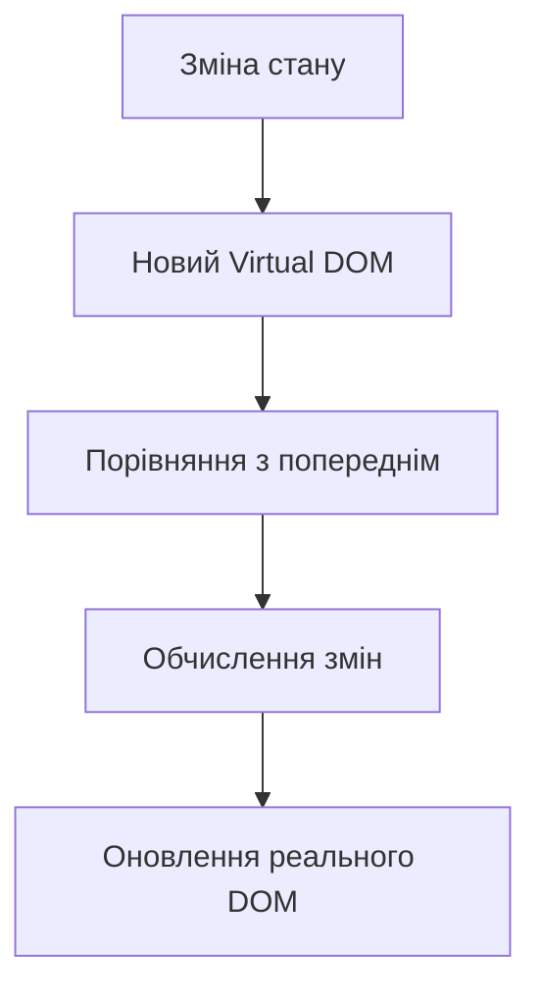

# React основи та сучасні підходи


## План лекції

1. Вступ до React
2. JSX: синтаксис та можливості
3. React компоненти
4. Props та композиція
5. React Developer Tools
6. Налаштування проєкту з Vite
7. TypeScript з React


## Вступ до React

### Історія та еволюція

- **2011**: Створення в Facebook (Джордан Волке)
- **2013**: Публічний реліз на JSConf US
- **2015**: React Native для мобільної розробки
- **2017**: React Fiber — нова архітектура
- **2019**: React Hooks — революція в розробці
- **2020-2024**: Concurrent features, Suspense, Server Components


## Філософія React

### Ключові принципи

**Декларативність**
Описуємо "що" відображати, а не "як"

**Компонентна архітектура**
UI складається з ієрархії компонентів

**Однонаправлений потік даних**
Дані течуть від батьківських до дочірніх компонентів

**Virtual DOM**
Ефективне оновлення через віртуальне представлення


## Virtual DOM

### Як це працює



**Переваги:**
- Мінімальні маніпуляції з DOM
- Batch оновлення
- Висока продуктивність


## JSX: JavaScript XML

### Що таке JSX?

Синтаксичне розширення JavaScript для опису UI

```javascript
// JSX
const element = <h1>Привіт, React!</h1>;

// Транспілюється в:
const element = React.createElement('h1', null, 'Привіт, React!');
```

**Переваги JSX:**
- Читабельність коду
- Знайомий HTML-подібний синтаксис
- Потужність JavaScript


## Правила JSX

### Основні обмеження

✅ **Єдиний кореневий елемент**
```javascript
// Правильно
return (
    <div>
        <h1>Заголовок</h1>
        <p>Параграф</p>
    </div>
);

// Або Fragment
return (
    <>
        <h1>Заголовок</h1>
        <p>Параграф</p>
    </>
);
```


## Правила JSX (продовження)

✅ **camelCase для атрибутів**
```javascript
<button
    className="btn-primary"    // замість class
    onClick={handleClick}      // замість onclick
    tabIndex={0}
>
    Натисніть
</button>
```

✅ **Закриття всіх тегів**
```javascript

<input type="text" />
<br />
```


## JavaScript в JSX

### Вбудовані вирази

```javascript
function UserProfile({ user }) {
    const age = 2025 - user.birthYear;

    return (
        <div className="profile">
            <h1>{user.name}</h1>
            <p>Вік: {age} років</p>

            {/* Умовний рендеринг */}
            {user.isVerified && <span>✓ Верифікований</span>}

            {/* Рендеринг списків */}
            {user.skills.map((skill, index) => (
                <span key={index}>{skill}</span>
            ))}
        </div>
    );
}
```


## Умовний рендеринг

### Різні підходи

**Тернарний оператор**
```javascript
{user.isPremium ? <PremiumBadge /> : <RegularBadge />}
```

**Логічний &&**
```javascript
{product.discount > 0 && <DiscountBadge />}
```

**Раннє повернення**
```javascript
if (!product) return <NotFound />;
```


## Функціональні компоненти

### Сучасний стандарт React

```javascript
function Welcome() {
    return <h1>Вітаємо в React!</h1>;
}

function Greeting({ name, title }) {
    return (
        <div className="greeting">
            <h2>{title} {name}</h2>
        </div>
    );
}
```

**Переваги:**
- Простота та лаконічність
- Hooks для стану та lifecycle
- Краща продуктивність


## Class компоненти

### Історичний контекст

```javascript
class UserProfile extends React.Component {
    constructor(props) {
        super(props);
        this.state = { user: null };
    }

    componentDidMount() {
        this.fetchUserData();
    }

    render() {
        return <div>{this.state.user?.name}</div>;
    }
}
```

⚠️ **Legacy підхід** — використовуйте функціональні компоненти!


## Функціональні vs Класові

| Функціональні | Класові |
|---------------|---------|
| ✅ Менше коду | ❌ Більше boilerplate |
| ✅ Hooks | ❌ Lifecycle методи |
| ✅ Немає this | ❌ Проблеми з this |
| ✅ Легше тестувати | ❌ Складніше тестувати |
| ✅ Кращі оптимізації | ❌ Гірші оптимізації |

**Висновок:** Використовуйте функціональні компоненти!


## Props: передача даних

### Комунікація між компонентами

```javascript
// Батьківський компонент
function App() {
    return (
        <UserCard
            name="Олена"
            email="olena@example.com"
            role="Розробник"
            skills={['React', 'TypeScript']}
            onContactClick={() => console.log('Контакт')}
        />
    );
}

// Дочірній компонент
function UserCard({ name, email, role, skills, onContactClick }) {
    return (
        <div className="user-card">
            <h2>{name}</h2>
            <p>{email} - {role}</p>
        </div>
    );
}
```


## Деструктуризація Props

### Чистий та виразний код

```javascript
// Без деструктуризації
function Button(props) {
    return (
        <button className={props.className}>
            {props.text}
        </button>
    );
}

// З деструктуризацією
function Button({ text, variant = 'primary', disabled = false }) {
    return (
        <button className={`btn btn-${variant}`} disabled={disabled}>
            {text}
        </button>
    );
}
```


## Children Prop

### Композиція компонентів

```javascript
function Card({ children }) {
    return (
        <div className="card">
            <div className="card-content">
                {children}
            </div>
        </div>
    );
}

// Використання
<Card>
    <h2>Заголовок</h2>
    <p>Контент картки</p>
</Card>
```

**Переваги:** Гнучкість та повторне використання


## Layout з множинними slots

```javascript
function PageLayout({ header, sidebar, children, footer }) {
    return (
        <div className="page-layout">
            <header>{header}</header>
            <div className="main-content">
                <aside>{sidebar}</aside>
                <main>{children}</main>
            </div>
            <footer>{footer}</footer>
        </div>
    );
}

// Використання
<PageLayout
    header={<Navigation />}
    sidebar={<Sidebar />}
    footer={<Footer />}
>
    <h1>Основний контент</h1>
</PageLayout>
```


## React Developer Tools

### Інструменти для відладки

**Встановлення:**
- Chrome Web Store
- Firefox Add-ons
- Microsoft Edge Add-ons

**Функції:**
- 🔍 Інспекція дерева компонентів
- 📊 Перегляд props та state
- ⚡ Profiler для продуктивності
- 🎯 Пошук компонентів


## Components Tab

### Інспекція компонентів

**Можливості:**
- Перегляд ієрархії компонентів
- Редагування props та state в реальному часі
- Перегляд hooks та їх значень
- Джерело компонента (файл та рядок)

**Використання:**
1. Відкрити DevTools
2. Вибрати вкладку Components
3. Інспектувати компоненти


## Profiler Tab

### Оптимізація продуктивності

**Що показує:**
- ⏱️ Час рендерингу кожного компонента
- 🔄 Причини перерендерів
- 📈 Flame graph візуалізація
- 🎯 Ranked chart (найповільніші компоненти)

**Workflow:**
1. Натиснути запис
2. Виконати дії в додатку
3. Зупинити запис
4. Аналізувати результати


## Vite: сучасний build tool

### Чому Vite?

**Переваги над CRA:**
- ⚡ Миттєвий холодний старт (секунди)
- 🔥 Блискавичний HMR
- 📦 Оптимізована збірка
- 🎯 Нативна підтримка TypeScript
- 🔌 Гнучка система плагінів

**Технології:**
- ES modules (dev)
- esbuild (pre-bundling)
- Rollup (production)


## Створення проєкту з Vite

### Швидкий старт

```bash
# Створення React проєкту
npm create vite@latest my-app -- --template react

# З TypeScript
npm create vite@latest my-app -- --template react-ts

# Встановлення залежностей
cd my-app
npm install

# Запуск dev server
npm run dev
```

**Результат:** Проєкт готовий за хвилину!


## Структура Vite проєкту

```
my-react-app/
├── node_modules/
├── public/
│   └── vite.svg
├── src/
│   ├── assets/
│   ├── App.jsx
│   ├── App.css
│   ├── index.css
│   └── main.jsx
├── index.html
├── package.json
└── vite.config.js
```


## Конфігурація Vite

### vite.config.js

```javascript
import { defineConfig } from 'vite';
import react from '@vitejs/plugin-react';

export default defineConfig({
    plugins: [react()],

    server: {
        port: 3000,
        open: true,
        proxy: {
            '/api': 'http://localhost:5000'
        }
    },

    resolve: {
        alias: {
            '@': '/src',
            '@components': '/src/components'
        }
    }
});
```


## Змінні середовища

### .env файли

```bash
# .env
VITE_API_URL=http://localhost:5000
VITE_APP_TITLE=My React App

# .env.production
VITE_API_URL=https://api.production.com
```

**Використання:**
```javascript
const apiUrl = import.meta.env.VITE_API_URL;
const appTitle = import.meta.env.VITE_APP_TITLE;
```

⚠️ **Важливо:** Префікс `VITE_` обов'язковий!


## TypeScript з React

### Чому TypeScript?

**Переваги:**
- ✅ Раннє виявлення помилок
- ✅ Кращий IntelliSense
- ✅ Самодокументування коду
- ✅ Безпечний рефакторинг
- ✅ Краща підтримка великих проєктів

**TypeScript = JavaScript + типи**


## Типізація компонентів

### Props Interface

```typescript
interface ButtonProps {
    text: string;
    onClick: () => void;
    variant?: 'primary' | 'secondary';
    disabled?: boolean;
}

function Button({
    text,
    onClick,
    variant = 'primary',
    disabled = false
}: ButtonProps) {
    return (
        <button
            className={`btn btn-${variant}`}
            onClick={onClick}
            disabled={disabled}
        >
            {text}
        </button>
    );
}
```


## Типізація з children

```typescript
interface CardProps {
    title: string;
    children: React.ReactNode;
    className?: string;
}

function Card({ title, children, className }: CardProps) {
    return (
        <div className={`card ${className || ''}`}>
            <h2>{title}</h2>
            <div className="card-content">
                {children}
            </div>
        </div>
    );
}
```


## Generic компоненти

```typescript
interface ListProps<T> {
    items: T[];
    renderItem: (item: T) => React.ReactNode;
    keyExtractor: (item: T) => string | number;
}

function List<T>({ items, renderItem, keyExtractor }: ListProps<T>) {
    return (
        <ul>
            {items.map(item => (
                <li key={keyExtractor(item)}>
                    {renderItem(item)}
                </li>
            ))}
        </ul>
    );
}

// Використання
<List<User>
    items={users}
    renderItem={user => <div>{user.name}</div>}
    keyExtractor={user => user.id}
/>
```


## Типізація подій

```typescript
function SearchInput() {
    const handleChange = (e: React.ChangeEvent<HTMLInputElement>) => {
        console.log(e.target.value);
    };

    const handleSubmit = (e: React.FormEvent<HTMLFormElement>) => {
        e.preventDefault();
    };

    const handleKeyDown = (e: React.KeyboardEvent<HTMLInputElement>) => {
        if (e.key === 'Enter') {
            // обробка
        }
    };

    return (
        <form onSubmit={handleSubmit}>
            <input
                onChange={handleChange}
                onKeyDown={handleKeyDown}
            />
        </form>
    );
}
```


## Найкращі практики

### React компоненти

1. ✅ Використовуйте функціональні компоненти
2. ✅ Дотримуйтесь принципу єдиної відповідальності
3. ✅ Використовуйте композицію замість наслідування
4. ✅ Типізуйте всі props через TypeScript
5. ✅ Створюйте невеликі, переносні компоненти
6. ✅ Документуйте складні компоненти


## Найкращі практики

### JSX та Props

1. ✅ Використовуйте деструктуризацію props
2. ✅ Задавайте default values для опціональних props
3. ✅ Уникайте вбудованих функцій в JSX (оптимізація)
4. ✅ Використовуйте key prop для списків
5. ✅ Слідкуйте за правилами іменування


## Найкращі практики

### Інструменти розробки

1. ✅ Використовуйте Vite для нових проєктів
2. ✅ Налаштуйте alias для зручних імпортів
3. ✅ Використовуйте React DevTools для відладки
4. ✅ Профілюйте продуктивність перед оптимізацією
5. ✅ Використовуйте змінні середовища для конфігурації
