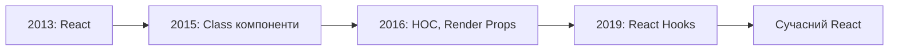
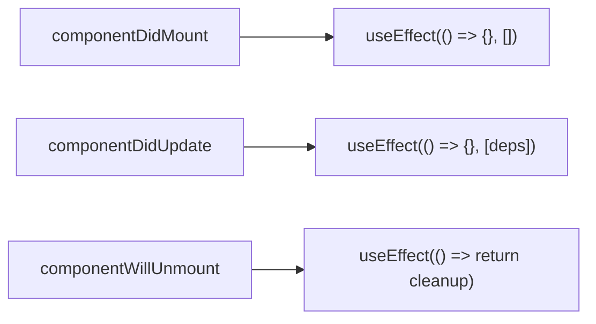

# React Hooks та управління станом

## План лекції

1. Вступ до React Hooks
2. useState: локальний стан
3. useEffect: side effects
4. useContext: глобальний стан
5. Кастомні хуки
6. useReducer для складного стану
7. Performance оптимізації


## Вступ до React Hooks

### Що таке Hooks?

**Hooks** — це функції, які дозволяють використовувати стан та lifecycle у функціональних компонентах

**До Hooks (2019):**
- Тільки класові компоненти мали стан
- Складний код з lifecycle методами
- Проблеми з повторним використанням логіки

**Після Hooks:**
- ✅ Стан у функціональних компонентах
- ✅ Простіший та чистіший код
- ✅ Легке повторне використання логіки


## Історія Hooks

### Еволюція React



**React 16.8 (лютий 2019)** — революційне оновлення


## Мотивація створення Hooks

### Проблеми, які вирішили Hooks

**Проблема 1:** Складність повторного використання логіки
- HOCs та Render Props → "wrapper hell"

**Проблема 2:** Великі компоненти
- Lifecycle методи змішують непов'язану логіку

**Проблема 3:** Класи заплутують
- Проблеми з `this`
- Необхідність біндити методи


## Правила Hooks

### ⚠️ Критично важливі правила

**Правило 1:** Викликайте хуки тільки на верхньому рівні
```javascript
// ❌ НЕПРАВИЛЬНО
if (condition) {
    const [state, setState] = useState(0);
}

// ✅ ПРАВИЛЬНО
const [state, setState] = useState(0);
if (condition) {
    // використання state
}
```

**Правило 2:** Викликайте хуки тільки з React функцій
- Функціональні компоненти
- Кастомні хуки


## useState: основи

### Найпростіший хук

```javascript
import { useState } from 'react';

function Counter() {
    // [поточне значення, функція оновлення]
    const [count, setCount] = useState(0);

    return (
        <div>
            <h2>Лічильник: {count}</h2>
            <button onClick={() => setCount(count + 1)}>
                +1
            </button>
        </div>
    );
}
```

**Початкове значення** використовується тільки при першому рендері


## useState: типи даних

### Працює з будь-якими даними

```javascript
// Примітиви
const [name, setName] = useState('');
const [age, setAge] = useState(0);
const [isActive, setIsActive] = useState(false);

// Об'єкти
const [user, setUser] = useState({
    name: '',
    email: ''
});

// Масиви
const [items, setItems] = useState([]);

// Складні структури
const [data, setData] = useState({
    user: {},
    settings: {},
    preferences: {}
});
```


## Оновлення стану

### Два способи

**Пряме значення:**
```javascript
const addTodo = (text) => {
    setTodos([...todos, { id: Date.now(), text }]);
};
```

**Функціональне оновлення:**
```javascript
const addTodo = (text) => {
    setTodos(prevTodos => [
        ...prevTodos,
        { id: Date.now(), text }
    ]);
};
```

💡 **Рекомендація:** Використовуйте функціональне оновлення для множинних змін


## Immutability: важливо!

### Оновлення об'єктів та масивів

```javascript
// ❌ НЕПРАВИЛЬНО: мутація
const updateUser = () => {
    user.name = 'Нове ім\'я';
    setUser(user); // React не виявить зміну
};

// ✅ ПРАВИЛЬНО: новий об'єкт
const updateUser = () => {
    setUser({
        ...user,
        name: 'Нове ім\'я'
    });
};
```

React порівнює стан **за посиланням**


## Ледаче ініціалізування

### Оптимізація початкового стану

```javascript
// ❌ Неефективно: обчислення при кожному рендері
const [data, setData] = useState(
    expensiveCalculation(props.data)
);

// ✅ Ефективно: обчислення один раз
const [data, setData] = useState(() => {
    return expensiveCalculation(props.data);
});

// Приклад з localStorage
const [preferences, setPreferences] = useState(() => {
    const saved = localStorage.getItem('prefs');
    return saved ? JSON.parse(saved) : defaults;
});
```


## useEffect: side effects

### Що таке side effects?

**Side effects** — операції, які впливають на щось поза компонентом:
- 🌐 API запити
- 📡 Підписки на події
- 🎯 Маніпуляції з DOM
- 📝 Логування
- ⏰ Таймери

```javascript
useEffect(() => {
    // Код, який виконається після рендеру
    document.title = `Лічильник: ${count}`;
});
```


## useEffect: базове використання

```javascript
function UserProfile({ userId }) {
    const [user, setUser] = useState(null);

    useEffect(() => {
        // Виконається після рендеру
        fetch(`/api/users/${userId}`)
            .then(res => res.json())
            .then(setUser);
    }, [userId]); // Залежності

    return <div>{user?.name}</div>;
}
```

**Коли викликається:**
- Після монтування компонента
- Після зміни залежностей


## Масив залежностей

### Три варіанти

```javascript
// 1. Без масиву: після КОЖНОГО рендеру
useEffect(() => {
    console.log('Кожен рендер');
});

// 2. Порожній масив: ОДИН РАЗ після монтування
useEffect(() => {
    console.log('Тільки при монтуванні');
}, []);

// 3. З залежностями: при зміні залежностей
useEffect(() => {
    console.log('При зміні count');
}, [count]);
```


## Cleanup функція

### Очищення side effects

```javascript
function Timer() {
    const [seconds, setSeconds] = useState(0);

    useEffect(() => {
        // Створення інтервалу
        const interval = setInterval(() => {
            setSeconds(s => s + 1);
        }, 1000);

        // Cleanup: викликається перед unmount
        return () => {
            clearInterval(interval);
        };
    }, []);

    return <div>Секунд: {seconds}</div>;
}
```

**Cleanup викликається:**
- Перед unmount компонента
- Перед наступним запуском effect


## Lifecycle через useEffect



```javascript
useEffect(() => {
    // componentDidMount + componentDidUpdate
    console.log('Монтування або оновлення');

    return () => {
        // componentWillUnmount
        console.log('Розмонтування');
    };
}, [dependencies]);
```


## useContext: проблема

### Prop Drilling

```javascript
function App() {
    const [user, setUser] = useState(null);

    return (
        <Layout user={user}>
            <Sidebar user={user}>
                <Navigation user={user}>
                    <UserMenu user={user} />
                </Navigation>
            </Sidebar>
        </Layout>
    );
}
```

❌ **Проблема:** Props передаються через багато рівнів


## useContext: рішення

### Створення Context

```javascript
import { createContext, useContext } from 'react';

// Створення контексту
const UserContext = createContext(null);

// Provider
function App() {
    const [user, setUser] = useState(null);

    return (
        <UserContext.Provider value={{ user, setUser }}>
            <Layout>
                <UserMenu />
            </Layout>
        </UserContext.Provider>
    );
}

// Споживання
function UserMenu() {
    const { user } = useContext(UserContext);
    return <div>{user?.name}</div>;
}
```


## Custom Hook для Context

### Кращі практики

```javascript
// Створення кастомного хука
export function useAuth() {
    const context = useContext(AuthContext);

    if (!context) {
        throw new Error(
            'useAuth must be used within AuthProvider'
        );
    }

    return context;
}

// Використання
function Profile() {
    const { user, logout } = useAuth();

    return (
        <div>
            <h1>{user.name}</h1>
            <button onClick={logout}>Вийти</button>
        </div>
    );
}
```


## Кастомні хуки

### Повторне використання логіки

```javascript
// Кастомний хук для API запитів
function useFetch(url) {
    const [data, setData] = useState(null);
    const [loading, setLoading] = useState(true);
    const [error, setError] = useState(null);

    useEffect(() => {
        fetch(url)
            .then(res => res.json())
            .then(setData)
            .catch(setError)
            .finally(() => setLoading(false));
    }, [url]);

    return { data, loading, error };
}

// Використання
function UserList() {
    const { data: users, loading } = useFetch('/api/users');

    if (loading) return <div>Завантаження...</div>;
    return <div>{/* список */}</div>;
}
```


## Популярні кастомні хуки

### useLocalStorage

```javascript
function useLocalStorage(key, initialValue) {
    const [value, setValue] = useState(() => {
        const saved = localStorage.getItem(key);
        return saved ? JSON.parse(saved) : initialValue;
    });

    useEffect(() => {
        localStorage.setItem(key, JSON.stringify(value));
    }, [key, value]);

    return [value, setValue];
}

// Використання
function Settings() {
    const [theme, setTheme] = useLocalStorage('theme', 'light');

    return (
        <select value={theme} onChange={e => setTheme(e.target.value)}>
            <option value="light">Світла</option>
            <option value="dark">Темна</option>
        </select>
    );
}
```


## useDebounce Hook

```javascript
function useDebounce(value, delay) {
    const [debouncedValue, setDebouncedValue] = useState(value);

    useEffect(() => {
        const timer = setTimeout(() => {
            setDebouncedValue(value);
        }, delay);

        return () => clearTimeout(timer);
    }, [value, delay]);

    return debouncedValue;
}

// Використання для пошуку
function Search() {
    const [search, setSearch] = useState('');
    const debouncedSearch = useDebounce(search, 500);

    // API запит тільки після 500ms затримки
    const { data } = useFetch(`/api/search?q=${debouncedSearch}`);
}
```


## useReducer: коли використовувати

### useState vs useReducer

**useState:** Простий стан
```javascript
const [count, setCount] = useState(0);
```

**useReducer:** Складний стан
```javascript
const [state, dispatch] = useReducer(reducer, initialState);
```

**Використовуйте useReducer коли:**
- Складна структура стану
- Багато способів оновлення
- Наступний стан залежить від попереднього
- Хочете тестувати логіку окремо


## useReducer: приклад

```javascript
const initialState = { count: 0, history: [] };

function reducer(state, action) {
    switch (action.type) {
        case 'increment':
            return {
                count: state.count + 1,
                history: [...state.history, 'increment']
            };
        case 'decrement':
            return {
                count: state.count - 1,
                history: [...state.history, 'decrement']
            };
        case 'reset':
            return initialState;
        default:
            return state;
    }
}

function Counter() {
    const [state, dispatch] = useReducer(reducer, initialState);

    return (
        <div>
            <h2>Count: {state.count}</h2>
            <button onClick={() => dispatch({ type: 'increment' })}>+</button>
        </div>
    );
}
```


## Context + useReducer

### Потужна комбінація

```javascript
const CartContext = createContext(null);

function cartReducer(state, action) {
    switch (action.type) {
        case 'ADD_ITEM':
            return {
                ...state,
                items: [...state.items, action.payload]
            };
        case 'REMOVE_ITEM':
            return {
                ...state,
                items: state.items.filter(i => i.id !== action.payload)
            };
        default:
            return state;
    }
}

function CartProvider({ children }) {
    const [state, dispatch] = useReducer(cartReducer, { items: [] });

    return (
        <CartContext.Provider value={{ state, dispatch }}>
            {children}
        </CartContext.Provider>
    );
}
```


## Performance оптимізації

### Коли оптимізувати?

**Правило:** Не оптимізуйте передчасно!

**Оптимізуйте коли:**
- ⚠️ Реальні проблеми з продуктивністю
- ⚠️ Виявлені через React DevTools Profiler
- ⚠️ Повільні компоненти або обчислення

**Інструменти оптимізації:**
- `useMemo` — мемоїзація обчислень
- `useCallback` — мемоїзація функцій
- `React.memo` — мемоїзація компонентів


## useMemo: мемоїзація обчислень

```javascript
import { useMemo } from 'react';

function ProductList({ products, filters }) {
    // ❌ Без useMemo: фільтрація при кожному рендері
    const filtered = products.filter(p =>
        p.category === filters.category
    );

    // ✅ З useMemo: тільки при зміні products або filters
    const filtered = useMemo(() => {
        return products
            .filter(p => p.category === filters.category)
            .sort((a, b) => b.price - a.price);
    }, [products, filters]);

    return <div>{/* список */}</div>;
}
```

**Використовуйте для:**
- Складних обчислень
- Великих масивів даних
- Derived state


## useCallback: мемоїзація функцій

```javascript
import { useCallback, memo } from 'react';

const ProductCard = memo(function ProductCard({ product, onAdd }) {
    return (
        <div>
            <h3>{product.name}</h3>
            <button onClick={() => onAdd(product)}>Додати</button>
        </div>
    );
});

function ProductList({ products }) {
    const [cart, setCart] = useState([]);

    // ❌ Нова функція при кожному рендері
    const addToCart = (product) => {
        setCart(prev => [...prev, product]);
    };

    // ✅ Стабільна функція
    const addToCart = useCallback((product) => {
        setCart(prev => [...prev, product]);
    }, []);

    return products.map(p => (
        <ProductCard key={p.id} product={p} onAdd={addToCart} />
    ));
}
```


## React.memo: мемоїзація компонентів

```javascript
// Без memo: рендериться при кожному рендері батька
function ExpensiveComponent({ value }) {
    return <div>{value}</div>;
}

// З memo: рендериться тільки при зміні props
const MemoizedComponent = memo(function ExpensiveComponent({ value }) {
    return <div>{value}</div>;
});

// Кастомне порівняння
const CustomMemo = memo(
    function Component({ user }) {
        return <div>{user.name}</div>;
    },
    (prevProps, nextProps) => {
        // Повернути true якщо props однакові (skip рендер)
        return prevProps.user.id === nextProps.user.id;
    }
);
```


## Коли НЕ оптимізувати

### Приклади

```javascript
// ❌ НЕ ПОТРІБНО: простий компонент
const Button = memo(function Button({ text }) {
    return <button>{text}</button>;
});

// ❌ НЕ ПОТРІБНО: прості обчислення
const age = useMemo(() => 2025 - birthYear, [birthYear]);

// ❌ НЕ ПОТРІБНО: компонент завжди змінюється
const Clock = memo(function Clock() {
    const [time, setTime] = useState(new Date());
    return <div>{time.toLocaleTimeString()}</div>;
});
```

**Правило:** Оптимізація додає складність. Використовуйте тільки при потребі!


## Найкращі практики

### Hooks

1. ✅ Дотримуйтесь правил Hooks
2. ✅ Використовуйте ESLint плагін
3. ✅ Правильно визначайте залежності
4. ✅ Очищайте side effects
5. ✅ Виносьте логіку в кастомні хуки
6. ✅ Документуйте складні хуки


## Найкращі практики

### Оптимізація

1. ⚡ Профілюйте перед оптимізацією
2. ⚡ Використовуйте React DevTools
3. ⚡ Оптимізуйте тільки вузькі місця
4. ⚡ Мемоїзуйте тільки важкі обчислення
5. ⚡ Розділяйте Context за відповідальністю
6. ⚡ Використовуйте useMemo для Context value
