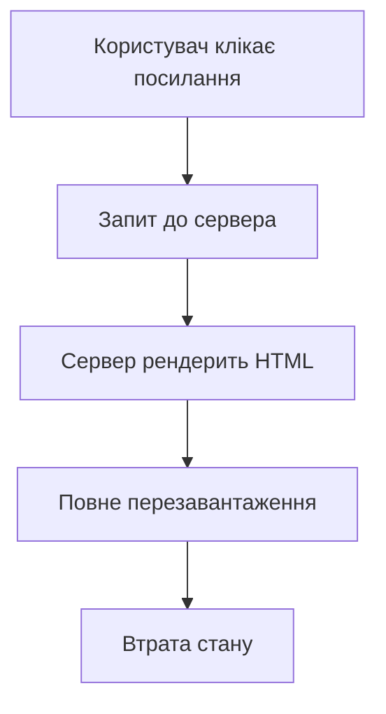
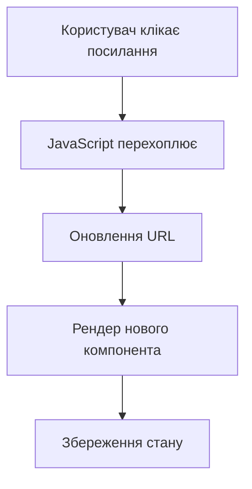

# Роутинг та навігація (React Router)

## План лекції

1. Вступ до клієнтського роутингу
2. React Router v6 основи
3. Динамічні маршрути
4. Nested routes та layouts
5. Protected routes
6. Програмна навігація
7. Найкращі практики


## Традиційний роутинг

### Серверний підхід



**Проблеми:**
- ⏱️ Повільно (мережеві запити)
- 💥 Перезавантаження сторінки
- 📉 Втрата JavaScript стану
- 🎭 Мерехтіння інтерфейсу


## SPA роутинг

### Клієнтський підхід



**Переваги:**
- ⚡ Швидкість (без мережевих запитів)
- ✨ Плавні переходи
- 💾 Збереження стану
- 🎯 Кращий UX


## React Router: історія

### Еволюція бібліотеки

| Версія | Рік | Ключові зміни |
|--------|-----|---------------|
| v1-3 | 2014-2016 | Статична конфігурація |
| v4 | 2017 | Динамічні маршрути |
| v5 | 2019 | Hooks API |
| **v6** | **2021** | **Нове API, вкладені маршрути** |

**React Router v6** — сучасний стандарт


## Встановлення

### Швидкий старт

```bash
# Встановлення React Router
npm install react-router-dom

# Або через yarn
yarn add react-router-dom
```

**Версія:** v6.x (найновіша)


## Базова структура

### Перший роутер

```javascript
import { BrowserRouter, Routes, Route } from 'react-router-dom';

function App() {
    return (
        <BrowserRouter>
            <Routes>
                <Route path="/" element={<Home />} />
                <Route path="/about" element={<About />} />
                <Route path="/contact" element={<Contact />} />
            </Routes>
        </BrowserRouter>
    );
}
```

**Компоненти:**
- `BrowserRouter` — контейнер
- `Routes` — група маршрутів
- `Route` — окремий маршрут


## BrowserRouter vs HashRouter

### Два типи роутерів

**BrowserRouter** — звичайні URL
```
https://example.com/about
https://example.com/products/123
```

✅ Чисті URL
✅ Краща SEO
❌ Потрібна серверна конфігурація

**HashRouter** — хеш URL
```
https://example.com/#/about
https://example.com/#/products/123
```

✅ Працює без серверної конфігурації
❌ Гірша SEO
❌ Менш естетичні URL


## Routes та Route

### Визначення маршрутів

```javascript
<Routes>
    {/* Точна відповідність */}
    <Route path="/" element={<Home />} />

    {/* Статичні шляхи */}
    <Route path="/about" element={<About />} />
    <Route path="/services" element={<Services />} />

    {/* Динамічні параметри */}
    <Route path="/users/:userId" element={<UserProfile />} />
    <Route path="/posts/:postId" element={<Post />} />

    {/* 404 сторінка */}
    <Route path="*" element={<NotFound />} />
</Routes>
```


## Link та NavLink

### Навігація без перезавантаження

**Link** — базова навігація
```javascript
import { Link } from 'react-router-dom';

<nav>
    <Link to="/">Головна</Link>
    <Link to="/about">Про нас</Link>
    <Link to="/contact">Контакти</Link>
</nav>
```

**NavLink** — з активним станом
```javascript
import { NavLink } from 'react-router-dom';

<NavLink
    to="/dashboard"
    className={({ isActive }) =>
        isActive ? 'nav-link active' : 'nav-link'
    }
>
    Dashboard
</NavLink>
```


## Динамічні параметри

### useParams hook

```javascript
import { useParams } from 'react-router-dom';

// Маршрут: /users/:userId
function UserProfile() {
    const { userId } = useParams();

    useEffect(() => {
        fetch(`/api/users/${userId}`)
            .then(res => res.json())
            .then(setUser);
    }, [userId]);

    return <div>Користувач #{userId}</div>;
}
```

**Приклади URL:**
- `/users/123` → `userId = "123"`
- `/users/john` → `userId = "john"`


## Множинні параметри

```javascript
// Маршрут: /posts/:postId/comments/:commentId
function Comment() {
    const { postId, commentId } = useParams();

    return (
        <div>
            <h2>Коментар {commentId}</h2>
            <p>До поста {postId}</p>
        </div>
    );
}

// URL: /posts/42/comments/7
// postId = "42"
// commentId = "7"
```

⚠️ **Важливо:** Всі параметри є рядками!


## Query параметри

### useSearchParams hook

```javascript
import { useSearchParams } from 'react-router-dom';

function ProductList() {
    const [searchParams, setSearchParams] = useSearchParams();

    // Читання параметрів
    const category = searchParams.get('category') || 'all';
    const page = parseInt(searchParams.get('page')) || 1;

    // Оновлення параметрів
    const updateCategory = (cat) => {
        setSearchParams({ category: cat, page: 1 });
    };

    return (
        <div>
            <select value={category} onChange={e => updateCategory(e.target.value)}>
                <option value="all">Всі</option>
                <option value="electronics">Електроніка</option>
            </select>
        </div>
    );
}

// URL: /products?category=electronics&page=2
```


## useLocation hook

### Доступ до локації

```javascript
import { useLocation } from 'react-router-dom';

function PageComponent() {
    const location = useLocation();

    console.log(location.pathname);  // "/users/123"
    console.log(location.search);    // "?sort=name"
    console.log(location.hash);      // "#section"
    console.log(location.state);     // { from: '/home' }

    return <div>Шлях: {location.pathname}</div>;
}
```

**Використання:**
- Відстеження навігації
- Аналітика
- Передача state між сторінками


## Nested Routes

### Концепція вкладеності

```javascript
<Routes>
    <Route path="/" element={<Layout />}>
        <Route index element={<Home />} />
        <Route path="about" element={<About />} />
        <Route path="contact" element={<Contact />} />
    </Route>

    <Route path="/dashboard" element={<DashboardLayout />}>
        <Route index element={<Overview />} />
        <Route path="profile" element={<Profile />} />
        <Route path="settings" element={<Settings />} />
    </Route>
</Routes>
```

**Переваги:**
- Спільні layout компоненти
- Ієрархічна структура
- Чистий код


## Outlet компонент

### Placeholder для дочірніх маршрутів

```javascript
import { Outlet, Link } from 'react-router-dom';

function Layout() {
    return (
        <div className="layout">
            <header>
                <nav>
                    <Link to="/">Головна</Link>
                    <Link to="/about">Про нас</Link>
                </nav>
            </header>

            <main>
                {/* Дочірні маршрути рендеряться тут */}
                <Outlet />
            </main>

            <footer>
                <p>© 2025 My App</p>
            </footer>
        </div>
    );
}
```


## Index Routes

### Маршрут за замовчуванням

```javascript
<Route path="/dashboard" element={<DashboardLayout />}>
    {/* Index route — рендериться за /dashboard */}
    <Route index element={<DashboardHome />} />

    {/* Дочірні маршрути */}
    <Route path="profile" element={<Profile />} />
    <Route path="settings" element={<Settings />} />
</Route>
```

**Результат:**
- `/dashboard` → `DashboardLayout` + `DashboardHome`
- `/dashboard/profile` → `DashboardLayout` + `Profile`


## Protected Routes

### Захист маршрутів

```javascript
function ProtectedRoute() {
    const { user } = useAuth();
    const location = useLocation();

    if (!user) {
        // Редирект на логін зі збереженням шляху
        return <Navigate to="/login" state={{ from: location }} replace />;
    }

    return <Outlet />;
}

// Використання
<Routes>
    <Route path="/login" element={<Login />} />

    <Route element={<ProtectedRoute />}>
        <Route path="/dashboard" element={<Dashboard />} />
        <Route path="/profile" element={<Profile />} />
    </Route>
</Routes>
```


## Захист на основі ролей

```javascript
function RoleBasedRoute({ allowedRoles }) {
    const { user } = useAuth();

    if (!user) {
        return <Navigate to="/login" replace />;
    }

    if (!allowedRoles.includes(user.role)) {
        return <Navigate to="/unauthorized" replace />;
    }

    return <Outlet />;
}

// Використання
<Route element={<RoleBasedRoute allowedRoles={['admin']} />}>
    <Route path="/admin" element={<AdminPanel />} />
</Route>

<Route element={<RoleBasedRoute allowedRoles={['user', 'admin']} />}>
    <Route path="/dashboard" element={<Dashboard />} />
</Route>
```


## Редирект після логіну

```javascript
function LoginPage() {
    const navigate = useNavigate();
    const location = useLocation();
    const { login } = useAuth();

    // Шлях, звідки користувач прийшов
    const from = location.state?.from?.pathname || '/dashboard';

    const handleSubmit = async (credentials) => {
        await login(credentials);

        // Повернути на попередню сторінку
        navigate(from, { replace: true });
    };

    return <form onSubmit={handleSubmit}>{/* форма */}</form>;
}
```


## useNavigate hook

### Програмна навігація

```javascript
import { useNavigate } from 'react-router-dom';

function ProductForm() {
    const navigate = useNavigate();

    const handleSave = async (data) => {
        const product = await saveProduct(data);

        // Перехід на сторінку продукту
        navigate(`/products/${product.id}`);
    };

    const handleCancel = () => {
        // Перехід назад
        navigate(-1);
    };

    return (
        <div>
            <button onClick={handleCancel}>Скасувати</button>
            <button onClick={handleSave}>Зберегти</button>
        </div>
    );
}
```


## Push vs Replace

### Різниця в історії

**Push** (за замовчуванням)
```javascript
navigate('/dashboard');
// Додає в історію
// Кнопка "Назад" поверне на попередню сторінку
```

**Replace**
```javascript
navigate('/dashboard', { replace: true });
// Замінює в історії
// Кнопка "Назад" пропустить цю сторінку
```

**Коли використовувати replace:**
- Після логіну/реєстрації
- Після завершення multi-step форми
- Редиректи


## Navigate компонент

### Декларативний редирект

```javascript
import { Navigate } from 'react-router-dom';

function Dashboard() {
    const { user } = useAuth();

    // Умовний редирект
    if (!user) {
        return <Navigate to="/login" replace />;
    }

    if (!user.isEmailVerified) {
        return <Navigate to="/verify-email" />;
    }

    return (
        <div>
            <h1>Dashboard</h1>
        </div>
    );
}

// Використання в Routes
<Route path="/old-url" element={<Navigate to="/new-url" replace />} />
```


## Передача state

### Додаткова інформація

```javascript
// Передача state через Link
<Link
    to="/profile"
    state={{ from: 'navigation', userId: 123 }}
>
    Профіль
</Link>

// Передача через navigate
navigate('/profile', {
    state: { message: 'Профіль оновлено' }
});

// Отримання state
function Profile() {
    const location = useLocation();
    const message = location.state?.message;

    return (
        <div>
            {message && <div className="alert">{message}</div>}
        </div>
    );
}
```


## Складні layout структури

```javascript
<Routes>
    {/* Публічний layout */}
    <Route element={<PublicLayout />}>
        <Route path="/" element={<Home />} />
        <Route path="/about" element={<About />} />
    </Route>

    {/* Захищений layout */}
    <Route element={<ProtectedLayout />}>
        <Route path="/dashboard" element={<DashboardLayout />}>
            <Route index element={<Overview />} />

            <Route path="users" element={<UsersLayout />}>
                <Route index element={<UserList />} />
                <Route path=":userId" element={<UserDetails />} />
            </Route>
        </Route>
    </Route>
</Routes>
```


## 404 сторінка

### Обробка невідомих маршрутів

```javascript
<Routes>
    {/* Всі відомі маршрути */}
    <Route path="/" element={<Home />} />
    <Route path="/about" element={<About />} />

    {/* Catch-all маршрут для 404 */}
    <Route path="*" element={<NotFound />} />
</Routes>

function NotFound() {
    return (
        <div className="not-found">
            <h1>404</h1>
            <p>Сторінка не знайдена</p>
            <Link to="/">На головну</Link>
        </div>
    );
}
```


## Відносні шляхи

### Навігація відносно поточного маршруту

```javascript
// Поточний URL: /dashboard/users

// Абсолютний шлях
<Link to="/about">Про нас</Link>
// → /about

// Відносний шлях
<Link to="settings">Налаштування</Link>
// → /dashboard/users/settings

// На рівень вище
<Link to="..">Назад</Link>
// → /dashboard

<Link to="../profile">Профіль</Link>
// → /dashboard/profile
```


## Серверна конфігурація

### Для BrowserRouter

**Проблема:** Сервер повертає 404 для SPA маршрутів

**Рішення:** Налаштувати сервер повертати `index.html`

**Nginx:**
```nginx
location / {
    try_files $uri $uri/ /index.html;
}
```

**Express.js:**
```javascript
app.get('*', (req, res) => {
    res.sendFile(path.join(__dirname, 'build', 'index.html'));
});
```


## Найкращі практики

### Організація маршрутів

1. ✅ Використовуйте `BrowserRouter` для production
2. ✅ Організовуйте маршрути ієрархічно
3. ✅ Створюйте переносні layout компоненти
4. ✅ Використовуйте index routes для сторінок за замовчуванням
5. ✅ Додайте 404 сторінку через `path="*"`
6. ✅ Документуйте структуру маршрутів


## Найкращі практики

### Параметри та навігація

1. ✅ Завжди валідуйте URL параметри
2. ✅ Використовуйте query параметри для фільтрів
3. ✅ Синхронізуйте UI з URL
4. ✅ Зберігайте попередній шлях при редиректах
5. ✅ Використовуйте `replace` для завершених процесів
6. ✅ Передавайте state для тимчасової інформації


## Найкращі практики

### Безпека

1. 🔒 Створюйте переносні protected route компоненти
2. 🔒 Перевіряйте авторизацію на сервері
3. 🔒 Обробляйте стани завантаження
4. 🔒 Використовуйте ролі та права доступу
5. 🔒 Показуйте зрозумілі повідомлення про помилки
6. 🔒 Редиректьте на логін зі збереженням шляху


## Типові помилки

### Чого уникати

❌ Використання `<a>` замість `<Link>`
```javascript
// НЕПРАВИЛЬНО
<a href="/about">Про нас</a>

// ПРАВИЛЬНО
<Link to="/about">Про нас</Link>
```

❌ Забуття про cleanup в useEffect
❌ Невалідація URL параметрів
❌ Пропуск 404 сторінки
❌ Неправильна серверна конфігурація
