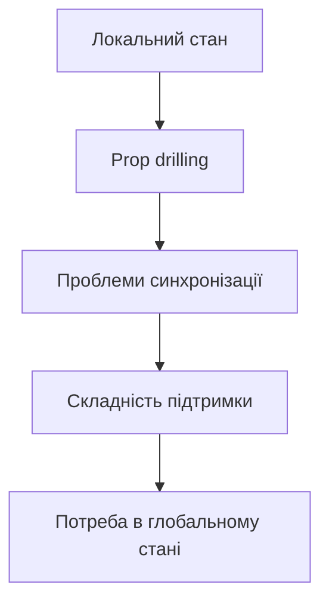
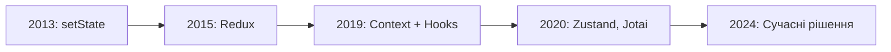

# Управління глобальним станом

## План лекції

1. Вступ до управління станом
2. Context API для глобального стану
3. useReducer паттерни
4. Альтернативи: Zustand
5. Persisting стану
6. Найкращі практики


## Проблема стану

### Зростання складності



**Коли виникають проблеми:**
- Багато компонентів потребують доступу до даних
- Глибока вкладеність компонентів
- Синхронізація стану між віддаленими частинами UI


## Prop Drilling

### Проблема передачі props

```javascript
function App() {
    const [user, setUser] = useState(null);

    return (
        <Layout user={user}>
            <Sidebar user={user}>
                <Navigation user={user}>
                    <UserMenu user={user} />
                </Navigation>
            </Sidebar>
        </Layout>
    );
}
```

❌ **Проблеми:**
- Props через багато рівнів
- Проміжні компоненти не використовують дані
- Важко підтримувати


## Локальний vs Глобальний

### Коли використовувати

**Локальний стан (useState):**
- 📝 Стан форм
- 🎭 UI стан (відкриті модалки, вкладки)
- 🎨 Анімації та ефекти
- 🔍 Тимчасовий стан

**Глобальний стан:**
- 👤 Дані користувача
- ⚙️ Налаштування застосунку
- 🎨 Тема інтерфейсу
- 🛒 Кошик покупок
- 📬 Сповіщення


## Еволюція управління станом

### Історичний контекст



**Тренд:** Від складних до простих рішень


## Context API: основи

### Створення контексту

```javascript
import { createContext, useContext, useState } from 'react';

// Створення контексту
const ThemeContext = createContext(null);

// Provider компонент
export function ThemeProvider({ children }) {
    const [theme, setTheme] = useState('light');

    const toggleTheme = () => {
        setTheme(prev => prev === 'light' ? 'dark' : 'light');
    };

    return (
        <ThemeContext.Provider value={{ theme, toggleTheme }}>
            {children}
        </ThemeContext.Provider>
    );
}

// Custom hook
export function useTheme() {
    return useContext(ThemeContext);
}
```


## Використання Context

### Споживання даних

```javascript
// Обгортка застосунку
function App() {
    return (
        <ThemeProvider>
            <Layout>
                <Header />
                <Main />
            </Layout>
        </ThemeProvider>
    );
}

// Компонент-споживач
function Header() {
    const { theme, toggleTheme } = useTheme();

    return (
        <header className={`header-${theme}`}>
            <button onClick={toggleTheme}>
                Тема: {theme}
            </button>
        </header>
    );
}
```

✅ **Переваги:** Немає prop drilling!


## Множинні контексти

### Розділення за відповідальністю

```javascript
// Окремі контексти для різних даних
<UserProvider>
    <ThemeProvider>
        <NotificationProvider>
            <App />
        </NotificationProvider>
    </ThemeProvider>
</UserProvider>

// Композиція провайдерів
function ComposeProviders({ providers, children }) {
    return providers.reduceRight(
        (child, Provider) => <Provider>{child}</Provider>,
        children
    );
}

// Використання
<ComposeProviders providers={[UserProvider, ThemeProvider]}>
    <App />
</ComposeProviders>
```


## Context: проблема продуктивності

### Зайві рендери

```javascript
// ❌ ПРОБЛЕМА: всі споживачі перерендеряться
function AppWithProblem() {
    const [user, setUser] = useState(null);
    const [settings, setSettings] = useState({});

    // Новий об'єкт при кожному рендері!
    const value = { user, setUser, settings, setSettings };

    return (
        <AppContext.Provider value={value}>
            {children}
        </AppContext.Provider>
    );
}
```

**Наслідок:** Всі компоненти перерендеряться


## Оптимізація Context

### useMemo для value

```javascript
// ✅ РІШЕННЯ 1: useMemo
function AppOptimized() {
    const [user, setUser] = useState(null);
    const [settings, setSettings] = useState({});

    const value = useMemo(
        () => ({ user, setUser, settings, setSettings }),
        [user, settings]
    );

    return (
        <AppContext.Provider value={value}>
            {children}
        </AppContext.Provider>
    );
}
```

**Результат:** Рендер тільки при зміні user або settings


## Розділення Context

### State та Dispatch окремо

```javascript
// ✅ РІШЕННЯ 2: Окремі контексти
const UserStateContext = createContext(null);
const UserDispatchContext = createContext(null);

function UserProvider({ children }) {
    const [user, setUser] = useState(null);

    return (
        <UserStateContext.Provider value={user}>
            <UserDispatchContext.Provider value={setUser}>
                {children}
            </UserDispatchContext.Provider>
        </UserStateContext.Provider>
    );
}

// Компоненти підписуються тільки на потрібне
function UserDisplay() {
    const user = useContext(UserStateContext);
    // Рендериться тільки при зміні user
}
```


## useReducer: коли використовувати

### useState vs useReducer

| useState | useReducer |
|----------|-----------|
| Простий стан | Складний стан |
| Один спосіб оновлення | Багато способів оновлення |
| Незалежні значення | Пов'язані значення |
| Просте тестування | Складне тестування логіки |

**Використовуйте useReducer коли:**
- Складна структура стану
- Багато типів оновлень
- Наступний стан залежить від попереднього


## useReducer: приклад

### Todo менеджер

```javascript
const initialState = { todos: [], filter: 'all' };

function todoReducer(state, action) {
    switch (action.type) {
        case 'ADD_TODO':
            return {
                ...state,
                todos: [...state.todos, action.payload]
            };
        case 'TOGGLE_TODO':
            return {
                ...state,
                todos: state.todos.map(todo =>
                    todo.id === action.payload
                        ? { ...todo, completed: !todo.completed }
                        : todo
                )
            };
        case 'SET_FILTER':
            return { ...state, filter: action.payload };
        default:
            return state;
    }
}
```


## useReducer: використання

```javascript
function TodoApp() {
    const [state, dispatch] = useReducer(todoReducer, initialState);

    const addTodo = (text) => {
        dispatch({
            type: 'ADD_TODO',
            payload: { id: Date.now(), text, completed: false }
        });
    };

    const toggleTodo = (id) => {
        dispatch({ type: 'TOGGLE_TODO', payload: id });
    };

    return (
        <div>
            <TodoList todos={state.todos} onToggle={toggleTodo} />
            <TodoFilters
                filter={state.filter}
                onChange={(f) => dispatch({ type: 'SET_FILTER', payload: f })}
            />
        </div>
    );
}
```


## Context + useReducer

### Потужна комбінація

```javascript
const CartContext = createContext(null);

function cartReducer(state, action) {
    switch (action.type) {
        case 'ADD_ITEM':
            return { ...state, items: [...state.items, action.payload] };
        case 'REMOVE_ITEM':
            return {
                ...state,
                items: state.items.filter(i => i.id !== action.payload)
            };
        default:
            return state;
    }
}

export function CartProvider({ children }) {
    const [state, dispatch] = useReducer(cartReducer, { items: [] });

    return (
        <CartContext.Provider value={{ state, dispatch }}>
            {children}
        </CartContext.Provider>
    );
}
```


## Zustand: альтернатива

### Чому Zustand?

**Переваги:**
- ⚡ Швидкий та легкий (1KB)
- 🎯 Простий API без boilerplate
- 🚀 Селектори запобігають зайвим рендерам
- 🔧 Немає Context Provider
- 💾 Вбудована підтримка middleware

```bash
npm install zustand
```


## Zustand: створення store

```javascript
import { create } from 'zustand';

// Створення store
const useCounterStore = create((set) => ({
    count: 0,
    increment: () => set((state) => ({
        count: state.count + 1
    })),
    decrement: () => set((state) => ({
        count: state.count - 1
    })),
    reset: () => set({ count: 0 })
}));

// Використання
function Counter() {
    const count = useCounterStore((state) => state.count);
    const increment = useCounterStore((state) => state.increment);

    return (
        <div>
            <h2>{count}</h2>
            <button onClick={increment}>+</button>
        </div>
    );
}
```


## Zustand: складний приклад

### Todo store

```javascript
const useTodoStore = create((set, get) => ({
    todos: [],
    filter: 'all',

    addTodo: (text) => set((state) => ({
        todos: [...state.todos, {
            id: Date.now(),
            text,
            completed: false
        }]
    })),

    toggleTodo: (id) => set((state) => ({
        todos: state.todos.map(todo =>
            todo.id === id
                ? { ...todo, completed: !todo.completed }
                : todo
        )
    })),

    getFilteredTodos: () => {
        const { todos, filter } = get();
        if (filter === 'completed') return todos.filter(t => t.completed);
        if (filter === 'active') return todos.filter(t => !t.completed);
        return todos;
    }
}));
```


## Zustand: селектори

### Оптимізація підписок

```javascript
function TodoList() {
    // ❌ НЕОПТИМАЛЬНО: підписка на весь store
    const store = useTodoStore();

    // ✅ ОПТИМАЛЬНО: підписка тільки на todos
    const todos = useTodoStore((state) => state.todos);
    const toggleTodo = useTodoStore((state) => state.toggleTodo);

    return (
        <ul>
            {todos.map(todo => (
                <TodoItem
                    key={todo.id}
                    todo={todo}
                    onToggle={toggleTodo}
                />
            ))}
        </ul>
    );
}
```

**Переваги:** Рендер тільки при зміні підписаних даних


## Zustand: middleware

### Persist та DevTools

```javascript
import { persist, devtools } from 'zustand/middleware';

// localStorage збереження
const useUserStore = create(
    persist(
        (set) => ({
            user: null,
            preferences: { theme: 'light' },
            setUser: (user) => set({ user }),
            updatePreferences: (prefs) => set((state) => ({
                preferences: { ...state.preferences, ...prefs }
            }))
        }),
        {
            name: 'user-storage',
            partialize: (state) => ({
                preferences: state.preferences
            })
        }
    )
);
```


## Zustand: async дії

```javascript
const useDataStore = create((set, get) => ({
    data: null,
    loading: false,
    error: null,

    fetchData: async (id) => {
        set({ loading: true, error: null });

        try {
            const response = await fetch(`/api/data/${id}`);
            const data = await response.json();
            set({ data, loading: false });
        } catch (error) {
            set({ error: error.message, loading: false });
        }
    },

    updateData: async (id, updates) => {
        const previousData = get().data;

        // Optimistic update
        set({ data: { ...previousData, ...updates } });

        try {
            await fetch(`/api/data/${id}`, {
                method: 'PUT',
                body: JSON.stringify(updates)
            });
        } catch {
            set({ data: previousData }); // Rollback
        }
    }
}));
```


## localStorage: збереження стану

### Custom hook

```javascript
function useLocalStorage(key, initialValue) {
    const [value, setValue] = useState(() => {
        try {
            const saved = localStorage.getItem(key);
            return saved ? JSON.parse(saved) : initialValue;
        } catch {
            return initialValue;
        }
    });

    useEffect(() => {
        try {
            localStorage.setItem(key, JSON.stringify(value));
        } catch (error) {
            console.error('Error saving to localStorage:', error);
        }
    }, [key, value]);

    return [value, setValue];
}

// Використання
function Settings() {
    const [theme, setTheme] = useLocalStorage('theme', 'light');
}
```


## Синхронізація між вкладками

### storage event

```javascript
function useSyncedState(key, initialValue) {
    const [value, setValue] = useState(() => {
        const saved = localStorage.getItem(key);
        return saved ? JSON.parse(saved) : initialValue;
    });

    useEffect(() => {
        localStorage.setItem(key, JSON.stringify(value));
    }, [key, value]);

    // Синхронізація між вкладками
    useEffect(() => {
        const handleStorage = (e) => {
            if (e.key === key && e.newValue) {
                setValue(JSON.parse(e.newValue));
            }
        };

        window.addEventListener('storage', handleStorage);
        return () => window.removeEventListener('storage', handleStorage);
    }, [key]);

    return [value, setValue];
}
```


## IndexedDB для великих даних

### Коли використовувати

**localStorage обмеження:**
- 📦 Максимум 5-10MB
- 🐌 Синхронні операції
- 📝 Тільки рядки

**IndexedDB переваги:**
- 💾 Сотні MB даних
- ⚡ Асинхронні операції
- 🗂️ Структуровані дані
- 🔍 Індекси для швидкого пошуку

**Використовуйте для:**
- Офлайн застосунків
- Кешування великих даних
- Складних структур даних


## Порівняння рішень

### Context vs Zustand vs Redux

| | Context API | Zustand | Redux Toolkit |
|---|-------------|---------|---------------|
| **Складність** | Низька | Дуже низька | Середня |
| **Boilerplate** | Середній | Мінімальний | Середній |
| **Продуктивність** | Середня | Висока | Висока |
| **DevTools** | ❌ | ✅ | ✅ |
| **Middleware** | ❌ | ✅ | ✅ |
| **Розмір** | 0KB | 1KB | 12KB |


## Коли використовувати

### Вибір рішення

**Context API:**
- ✅ Малі та середні застосунки
- ✅ Простий глобальний стан
- ✅ Немає додаткових залежностей

**Zustand:**
- ✅ Середні та великі застосунки
- ✅ Потрібна висока продуктивність
- ✅ Потрібні селектори

**Redux Toolkit:**
- ✅ Дуже великі застосунки
- ✅ Складна логіка стану
- ✅ Потрібна time-travel debugging


## Найкращі практики

### Організація стану

1. ✅ Починайте з локального стану
2. ✅ Переходьте до глобального при потребі
3. ✅ Розділяйте стан за доменами
4. ✅ Нормалізуйте структуру даних
5. ✅ Використовуйте селектори
6. ✅ Мемоїзуйте Context value


## Найкращі практики

### Продуктивність

1. ⚡ Розділяйте Context за відповідальністю
2. ⚡ Використовуйте useMemo для value
3. ⚡ Підписуйтесь тільки на потрібні дані
4. ⚡ Уникайте зайвих обчислень
5. ⚡ Профілюйте перед оптимізацією


## Найкращі практики

### Архітектура

1. 🏗️ Створюйте кастомні hooks для доступу
2. 🏗️ Виносьте логіку в окремі функції
3. 🏗️ Використовуйте TypeScript для типобезпеки
4. 🏗️ Документуйте структуру стану
5. 🏗️ Тестуйте логіку окремо від компонентів


## Типові помилки

### Чого уникати

❌ Робити весь стан глобальним
```javascript
// Погано: все в Context
<AppContext.Provider value={everythingInApp}>
```

❌ Не мемоїзувати Context value
```javascript
// Погано: новий об'єкт щоразу
<Context.Provider value={{ user, settings }}>
```

❌ Складна вкладеність об'єктів
```javascript
// Погано: глибока вкладеність
state.user.profile.settings.theme.colors.primary
```
