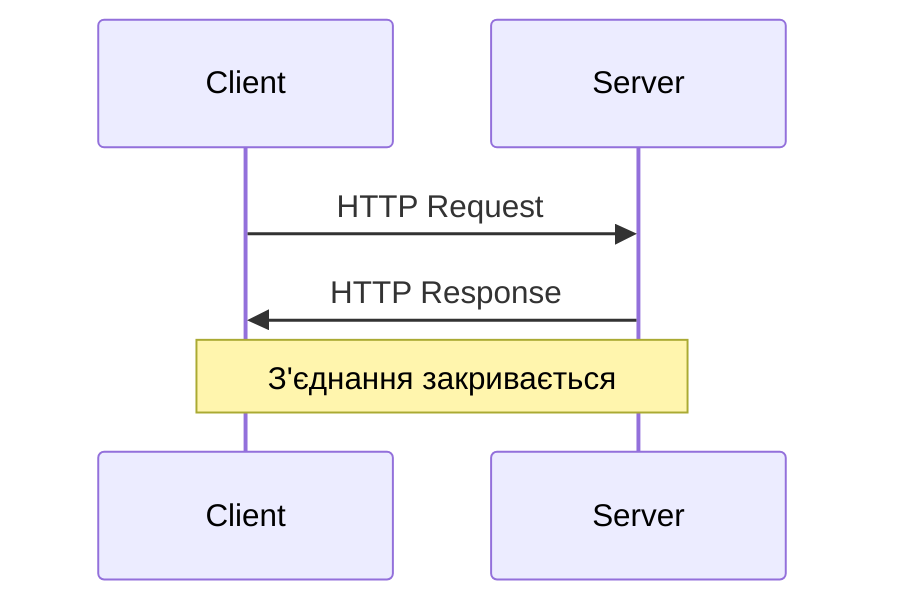
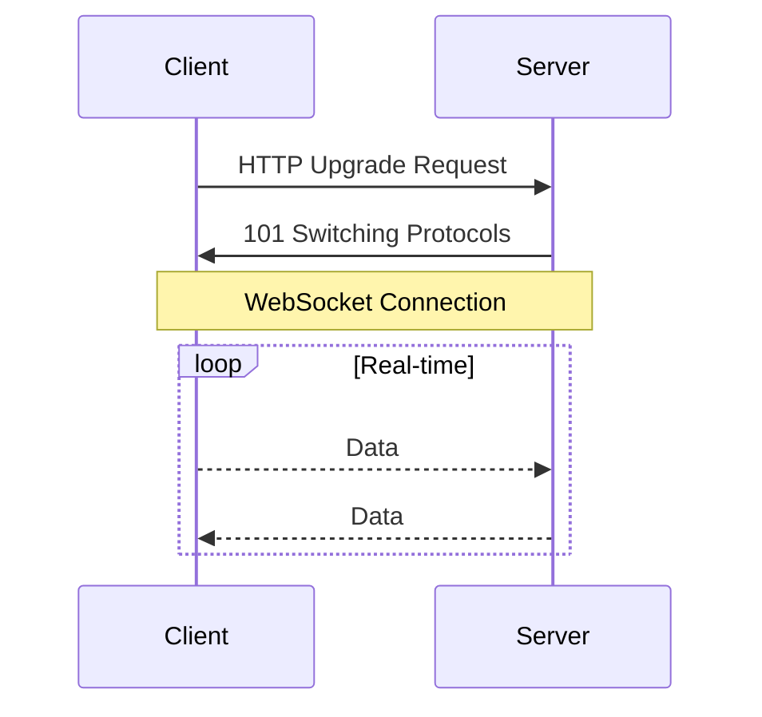
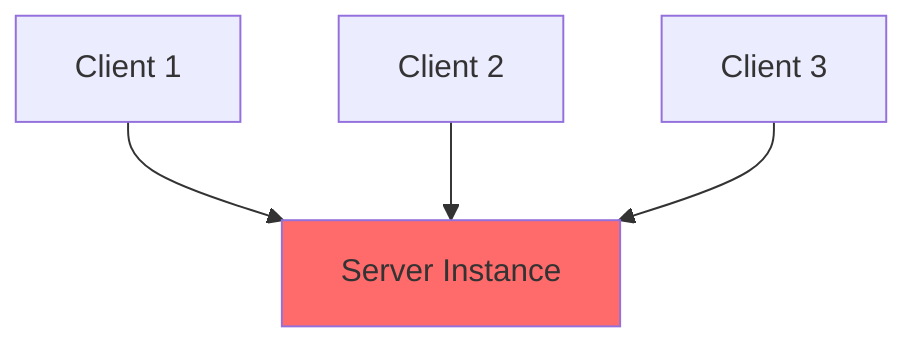
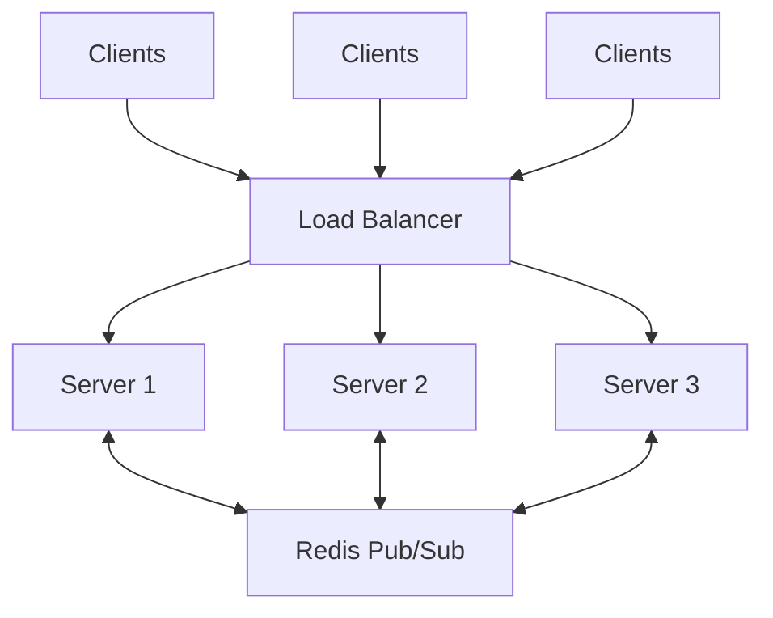

# Лекція 17. Real-time веб-додатки (WebSocket)

---

## План лекції

- Еволюція real-time комунікацій у вебі
- WebSocket vs HTTP Polling
- Socket.io: високорівнева бібліотека
- Namespaces та Rooms
- Інтеграція Socket.io з React
- Масштабування real-time додатків
- Практичні use cases

---

## Проблема: як отримувати оновлення?

### Традиційний веб (Request-Response)



**Проблема:** Клієнт не знає про нові дані доки не запитає

---

## Спроба 1: Short Polling

### Регулярні запити до сервера

```javascript
setInterval(async () => {
    const response = await fetch('/api/updates');
    const data = await response.json();
    updateUI(data);
}, 5000); // Кожні 5 секунд
```

**Недоліки:**
- Марнування ресурсів на порожні запити
- Затримка до наступного запиту
- Великі накладні витрати HTTP headers

---

## Спроба 2: Long Polling

### Сервер тримає з'єднання до появи даних

```javascript
async function longPoll() {
    const response = await fetch('/api/updates');
    const data = await response.json();
    updateUI(data);

    longPoll(); // Одразу новий запит
}
```

**Покращення:** Менша затримка
**Проблема:** Все ще HTTP накладні витрати

---

## Рішення: WebSocket

### Постійне двостороннє з'єднання



**Переваги:**
- Мінімальна затримка
- Низькі накладні витрати
- Справжня двостороння комунікація

---

## Порівняння підходів

| Характеристика | Short Polling | Long Polling | WebSocket |
|---------------|---------------|--------------|-----------|
| **Затримка** | До інтервалу | ~Миттєва | Миттєва |
| **Навантаження** | Високе | Середнє | Низьке |
| **Пропускна здатність** | Повні headers | Повні headers | Мінімальна |
| **Двосторонність** | Ні | Ні | Так |

---

## Економія трафіку: приклад

### 1000 повідомлень по 100 байт

**HTTP Polling:**
- Headers: ~500 байт на запит
- Всього: 600,000 байт (600 KB)

**WebSocket:**
- Handshake: 500 байт (один раз)
- Frame overhead: 2 байти на повідомлення
- Всього: 102,500 байт (100 KB)

**Економія: 82.9%**

---

## Нативний WebSocket API

```javascript
const ws = new WebSocket('ws://localhost:3000');

ws.onopen = () => {
    console.log('Connected');
    ws.send(JSON.stringify({ type: 'hello' }));
};

ws.onmessage = (event) => {
    const data = JSON.parse(event.data);
    console.log('Received:', data);
};

ws.onerror = (error) => {
    console.error('WebSocket error:', error);
};

ws.onclose = () => {
    console.log('Disconnected');
};
```

---

## Проблеми нативного WebSocket

**Що відсутнє:**
- Автоматичне перепідключення
- Fallback для старих браузерів
- Групування клієнтів (rooms)
- Типізовані події
- Acknowledgments (підтвердження)

**Рішення:** Socket.io

---

## Socket.io: що це?

### Високорівнева бібліотека поверх WebSocket

**Можливості:**
- Автоматичне reconnection
- Підтримка кімнат (rooms) та просторів імен (namespaces)
- Fallback до polling якщо WebSocket недоступний
- Event-driven API
- Підтримка бінарних даних
- Broadcasting механізми

---

## Базовий Socket.io Server

```javascript
import { Server } from 'socket.io';
import { createServer } from 'http';

const httpServer = createServer();
const io = new Server(httpServer, {
    cors: {
        origin: 'http://localhost:5173',
        methods: ['GET', 'POST']
    }
});

io.on('connection', (socket) => {
    console.log('Client connected:', socket.id);

    socket.on('message', (data) => {
        console.log('Received:', data);
        io.emit('message', data); // Broadcast всім
    });

    socket.on('disconnect', () => {
        console.log('Client disconnected:', socket.id);
    });
});

httpServer.listen(3000);
```

---

## Broadcasting стратегії

```javascript
// 1. Всім (включно з відправником)
io.emit('announcement', data);

// 2. Всім крім відправника
socket.broadcast.emit('user:action', data);

// 3. Конкретній кімнаті
io.to(roomId).emit('room:message', data);

// 4. Кімнаті крім відправника
socket.to(roomId).emit('room:typing', data);

// 5. Конкретному socket ID
io.to(socketId).emit('direct:message', data);
```

---

## Namespaces: логічний поділ

### Різні канали комунікації на одному сервері

```javascript
// Головний namespace
io.on('connection', (socket) => {
    console.log('Main namespace');
});

// Namespace для адміністраторів
const adminNamespace = io.of('/admin');
adminNamespace.on('connection', (socket) => {
    console.log('Admin connected');
});

// Namespace для чату
const chatNamespace = io.of('/chat');
chatNamespace.on('connection', (socket) => {
    console.log('Chat user connected');
});
```

---

## Використання Namespaces

### Коли використовувати?

**Приклади:**
- `/admin` - адміністративні функції
- `/chat` - система чату
- `/notifications` - сповіщення
- `/analytics` - real-time аналітика

**Переваги:**
- Логічне розділення функціональності
- Різні middleware для різних частин
- Можливість окремого масштабування

---

## Rooms: динамічна сегментація

### Групування сокетів для вибіркового broadcasting

```javascript
socket.on('room:join', async (roomId) => {
    await socket.join(roomId);

    // Повідомити інших в кімнаті
    socket.to(roomId).emit('user:joined', {
        userId: socket.id,
        roomId
    });
});

socket.on('room:leave', async (roomId) => {
    await socket.leave(roomId);

    socket.to(roomId).emit('user:left', {
        userId: socket.id
    });
});

socket.on('room:message', (data) => {
    io.to(data.roomId).emit('room:message', data);
});
```

---

## Namespaces vs Rooms

| Характеристика | Namespaces | Rooms |
|---------------|-----------|--------|
| **Створення** | Статичні | Динамічні |
| **Підключення** | Окреме з'єднання | В межах одного з'єднання |
| **Використання** | Різні частини додатку | Групування користувачів |
| **Middleware** | Окремий для кожного | Спільний |
| **Приклад** | `/admin`, `/chat` | `room-123`, `game-456` |

---

## React Hook для Socket.io

```javascript
// hooks/useSocket.js
import { useEffect, useRef, useState } from 'react';
import { io } from 'socket.io-client';

export function useSocket(url, options = {}) {
    const [isConnected, setIsConnected] = useState(false);
    const socketRef = useRef(null);

    useEffect(() => {
        socketRef.current = io(url, options);

        socketRef.current.on('connect', () => {
            setIsConnected(true);
        });

        socketRef.current.on('disconnect', () => {
            setIsConnected(false);
        });

        return () => {
            socketRef.current.close();
        };
    }, [url]);

    return { socket: socketRef.current, isConnected };
}
```

---

## Socket Context для React

```javascript
// context/SocketContext.jsx
import { createContext, useContext } from 'react';

const SocketContext = createContext(null);

export function SocketProvider({ children, url }) {
    const [socket, setSocket] = useState(null);
    const [isConnected, setIsConnected] = useState(false);

    useEffect(() => {
        const socketInstance = io(url);

        socketInstance.on('connect', () => {
            setIsConnected(true);
        });

        setSocket(socketInstance);

        return () => socketInstance.close();
    }, [url]);

    return (
        <SocketContext.Provider value={{ socket, isConnected }}>
            {children}
        </SocketContext.Provider>
    );
}
```

---

## Використання в компонентах

```javascript
function Chat({ roomId }) {
    const { socket, isConnected } = useSocketContext();
    const [messages, setMessages] = useState([]);

    useEffect(() => {
        if (!socket) return;

        socket.emit('room:join', roomId);

        socket.on('room:message', (message) => {
            setMessages(prev => [...prev, message]);
        });

        return () => {
            socket.off('room:message');
            socket.emit('room:leave', roomId);
        };
    }, [socket, roomId]);

    const sendMessage = (text) => {
        socket?.emit('room:message', { roomId, text });
    };

    return <ChatUI messages={messages} onSend={sendMessage} />;
}
```

---

## Typing Indicator: приклад

```javascript
function ChatInput({ roomId }) {
    const { socket } = useSocketContext();
    const [text, setText] = useState('');
    const timeoutRef = useRef(null);

    const handleChange = (e) => {
        setText(e.target.value);

        // Повідомити що користувач пише
        socket?.emit('room:typing', {
            roomId,
            isTyping: true
        });

        // Скинути після паузи
        clearTimeout(timeoutRef.current);
        timeoutRef.current = setTimeout(() => {
            socket?.emit('room:typing', {
                roomId,
                isTyping: false
            });
        }, 1000);
    };

    return <input value={text} onChange={handleChange} />;
}
```

---

## Масштабування: проблема

### Один сервер - обмежена кількість з'єднань



**Проблеми:**
- Обмеження по кількості одночасних з'єднань
- Відсутність синхронізації між інстанціями
- Single point of failure

---

## Рішення: Redis Adapter

### Синхронізація між Socket.io інстанціями

```javascript
import { createAdapter } from '@socket.io/redis-adapter';
import { createClient } from 'redis';

const pubClient = createClient({ url: 'redis://localhost:6379' });
const subClient = pubClient.duplicate();

await pubClient.connect();
await subClient.connect();

io.adapter(createAdapter(pubClient, subClient));
```

**Результат:** Broadcasting працює через всі інстанції

---

## Архітектура з Redis



---

## Оптимізація: Batch Processing

```javascript
class MessageBatcher {
    constructor(io, interval = 100) {
        this.io = io;
        this.queue = [];
        this.interval = interval;
        this.startProcessing();
    }

    add(roomId, message) {
        this.queue.push({ roomId, message });
    }

    startProcessing() {
        setInterval(() => {
            if (this.queue.length === 0) return;

            // Групування по кімнатах
            const byRoom = this.queue.reduce((acc, item) => {
                if (!acc[item.roomId]) acc[item.roomId] = [];
                acc[item.roomId].push(item.message);
                return acc;
            }, {});

            // Відправка батчами
            Object.entries(byRoom).forEach(([roomId, messages]) => {
                this.io.to(roomId).emit('messages:batch', messages);
            });

            this.queue = [];
        }, this.interval);
    }
}
```

---

## Моніторинг метрик

```javascript
class SocketMonitoring {
    constructor(io) {
        this.io = io;
        this.metrics = {
            connections: 0,
            messagesPerSecond: 0,
            rooms: 0
        };
    }

    collectMetrics() {
        this.metrics.connections = this.io.engine.clientsCount;
        this.metrics.rooms = this.io.sockets.adapter.rooms.size;

        console.log('Socket.io Metrics:', this.metrics);

        // Відправити до системи моніторингу
        this.sendToMonitoring(this.metrics);
    }
}

// Збір метрик кожні 10 секунд
setInterval(() => monitoring.collectMetrics(), 10000);
```

---

## Use Case 1: Чат

**Функціональність:**
- Створення кімнат
- Відправка повідомлень
- Typing indicators
- Online статус
- Приватні повідомлення

**Технології:**
- Socket.io rooms для кімнат
- Broadcasting для повідомлень
- Events для typing та online статусу

---

## Use Case 2: Collaborative Editing

**Функціональність:**
- Спільне редагування документів
- Синхронізація змін
- Курсори користувачів
- Conflict resolution

**Технології:**
- Operational Transformation або CRDT
- Socket.io для real-time sync
- Rooms для документів

---

## Use Case 3: Live Dashboard

**Функціональність:**
- Real-time метрики
- Графіки що оновлюються
- Сповіщення про події
- Моніторинг систем

**Технології:**
- Namespaces для різних типів даних
- Rooms для підписки на конкретні метрики
- Throttling для оптимізації

---

## Use Case 4: Онлайн-гра

**Функціональність:**
- Синхронізація стану гри
- Позиції гравців
- Дії в реальному часі
- Matchmaking

**Технології:**
- Rooms для ігрових сесій
- Binary data для оптимізації
- Authoritative server pattern

---

## Безпека Real-time додатків

### Основні загрози

**Аутентифікація:**
```javascript
io.use((socket, next) => {
    const token = socket.handshake.auth.token;
    if (verifyToken(token)) {
        socket.userId = getUserId(token);
        next();
    } else {
        next(new Error('Authentication failed'));
    }
});
```

**Rate Limiting:**
```javascript
const limiter = new Map();

socket.on('message', (data) => {
    const count = limiter.get(socket.id) || 0;
    if (count > 10) return; // Макс 10 повідомлень

    limiter.set(socket.id, count + 1);
    // Обробка повідомлення
});
```

---

## Валідація даних

```javascript
socket.on('room:message', (data) => {
    // Валідація структури
    if (!data || typeof data.text !== 'string') {
        return socket.emit('error', 'Invalid data');
    }

    // Валідація довжини
    if (data.text.length > 1000) {
        return socket.emit('error', 'Message too long');
    }

    // Санітизація
    const sanitized = sanitizeHTML(data.text);

    // Обробка
    io.to(data.roomId).emit('room:message', {
        userId: socket.id,
        text: sanitized,
        timestamp: Date.now()
    });
});
```

---

## Обробка помилок

```javascript
// Client-side error handling
function useSocket(url) {
    const [error, setError] = useState(null);
    const socketRef = useRef(null);

    useEffect(() => {
        const socket = io(url);

        socket.on('connect_error', (err) => {
            setError(`Connection failed: ${err.message}`);
        });

        socket.on('error', (err) => {
            setError(`Socket error: ${err.message}`);
        });

        socketRef.current = socket;

        return () => socket.close();
    }, [url]);

    return { socket: socketRef.current, error };
}
```

---

## Reconnection логіка

```javascript
const socket = io('http://localhost:3000', {
    reconnection: true,
    reconnectionDelay: 1000,
    reconnectionDelayMax: 5000,
    reconnectionAttempts: 5
});

socket.on('reconnect_attempt', () => {
    console.log('Attempting to reconnect...');
});

socket.on('reconnect', () => {
    console.log('Reconnected successfully');
    // Повторна підписка на події
    resubscribe();
});

socket.on('reconnect_failed', () => {
    console.log('Reconnection failed');
    // Показати користувачу повідомлення
});
```

---

## Найкращі практики

**Архітектура:**
- Використовуйте namespaces для логічного поділу
- Rooms для динамічного групування
- Централізоване управління подіями

**Продуктивність:**
- Batch processing для великої кількості подій
- Throttling для частих оновлень
- Redis adapter для масштабування

**Безпека:**
- Аутентифікація на рівні socket
- Валідація всіх вхідних даних
- Rate limiting для захисту від abuse

---

## Тестування Real-time функціональності

```javascript
// Тестування з Jest та socket.io-client
import { io } from 'socket.io-client';

describe('Chat Socket', () => {
    let socket;

    beforeEach((done) => {
        socket = io('http://localhost:3000');
        socket.on('connect', done);
    });

    afterEach(() => {
        socket.close();
    });

    it('should receive message', (done) => {
        socket.emit('message', { text: 'Hello' });

        socket.on('message', (data) => {
            expect(data.text).toBe('Hello');
            done();
        });
    });
});
```

---

## Debugging інструменти

**Socket.io Admin UI:**
```javascript
import { instrument } from '@socket.io/admin-ui';

instrument(io, {
    auth: {
        type: 'basic',
        username: 'admin',
        password: 'admin123'
    }
});
```

**Доступ:** http://localhost:3000/admin

**Можливості:**
- Перегляд активних з'єднань
- Rooms та namespaces
- Відправка тестових подій
- Моніторинг метрик

---

## Альтернативи Socket.io

**Server-Sent Events (SSE):**
- Простіший протокол
- Тільки server → client
- Автоматичне reconnection
- Підходить для uni-directional streams

**WebRTC:**
- Peer-to-peer комунікація
- Низька затримка
- Підходить для відео/аудіо
- Складніше налаштування

**GraphQL Subscriptions:**
- Інтеграція з GraphQL API
- Типізовані події
- Можливість фільтрації на сервері

---

## Майбутнє Real-time технологій

**Тренди:**
- WebTransport - наступник WebSocket
- HTTP/3 з покращеною продуктивністю
- Edge computing для зменшення latency
- 5G для кращої мобільної real-time комунікації

**Інновації:**
- AR/VR додатки з real-time sync
- Collaborative AI інструменти
- IoT інтеграція
- Blockchain та real-time Apps
