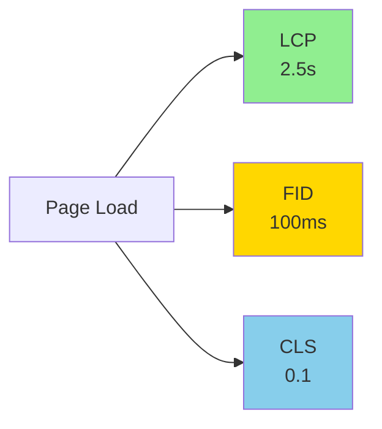

# Лекція 18. Продуктивність та оптимізація

---

## План лекції

- Чому продуктивність має значення
- Метрики продуктивності (Core Web Vitals)
- Bundle size оптимізація
- Code splitting та lazy loading
- Caching стратегії
- Performance моніторинг
- SEO оптимізація для SPA
- Progressive Web Apps

---

## Продуктивність = Гроші

### Реальний вплив на бізнес

**Amazon:** кожні 100ms затримки = -1% продажів

**Google:** 500ms затримки = -20% трафіку

**Pinterest:** 40% покращення швидкості = +15% конверсія

**53%** мобільних користувачів покидають сайт, якщо він завантажується більше 3 секунд

---

## Психологія продуктивності

### Як користувачі сприймають швидкість

| Час відгуку | Сприйняття |
|------------|-----------|
| 0-100ms | Миттєво |
| 100-300ms | Невелика затримка |
| 300-1000ms | Відчутна затримка |
| 1000ms+ | Завдання виконується |
| 10000ms+ | Втрата фокусу |

**Правило:** Якщо не можете зробити швидко, покажіть прогрес

---

## Core Web Vitals

### Ключові метрики від Google



**LCP** - Largest Contentful Paint
**FID** - First Input Delay
**CLS** - Cumulative Layout Shift

---

## Largest Contentful Paint (LCP)

### Час до відображення найбільшого елементу

**Хороше:** < 2.5 секунд
**Потребує покращення:** 2.5-4 секунди
**Погане:** > 4 секунди

**Що впливає:**
- Розмір зображень
- Швидкість сервера (TTFB)
- Render-blocking ресурси
- Client-side rendering

---

## First Input Delay (FID)

### Час до першої взаємодії

**Хороше:** < 100 мілісекунд
**Потребує покращення:** 100-300 мс
**Погане:** > 300 мс

**Що впливає:**
- Розмір JavaScript бандлу
- Long tasks (>50ms)
- Parsing та compilation JS
- Main thread блокування

---

## Cumulative Layout Shift (CLS)

### Візуальна стабільність контенту

**Хороше:** < 0.1
**Потребує покращення:** 0.1-0.25
**Погане:** > 0.25

**Причини:**
- Зображення без розмірів
- Динамічний контент
- Web fonts без fallback
- Ads та embeds

---

## Додаткові метрики

**Time to First Byte (TTFB):**
- Час до отримання першого байту
- Залежить від швидкості сервера

**First Contentful Paint (FCP):**
- Час до першого контенту
- Показник початку завантаження

**Time to Interactive (TTI):**
- Час до повної інтерактивності
- Коли сторінка готова до взаємодії

---

## Проблема великих бандлів

### Типовий React додаток

```
dist/
├── index.html
├── assets/
│   ├── index-a1b2c3.js    500 KB  ❌
│   ├── vendor-d4e5f6.js   800 KB  ❌
│   └── styles-g7h8i9.css  150 KB  ❌
```

**Проблеми:**
- Довге завантаження на повільному інтернеті
- Повільний parsing на мобільних пристроях
- Витрати трафіку для користувачів

---

## Аналіз розміру бандлу

### Rollup Plugin Visualizer

```javascript
// vite.config.js
import { visualizer } from 'rollup-plugin-visualizer';

export default defineConfig({
    plugins: [
        react(),
        visualizer({
            open: true,
            gzipSize: true,
            brotliSize: true
        })
    ]
});
```

**Результат:** Інтерактивна візуалізація розміру модулів

---

## Tree Shaking

### Видалення невикористаного коду

```javascript
// ❌ Погано: імпорт всієї бібліотеки
import _ from 'lodash';
_.debounce(fn, 300); // Весь lodash у бандлі

// ✅ Добре: імпорт конкретної функції
import debounce from 'lodash-es/debounce';
debounce(fn, 300); // Тільки debounce

// ❌ Погано: moment.js (230 KB)
import moment from 'moment';

// ✅ Добре: date-fns (13 KB з tree-shaking)
import { format, addDays } from 'date-fns';
```

---

## Порівняння розмірів бібліотек

| Категорія | Важка | Легка | Економія |
|-----------|-------|-------|----------|
| **Dates** | moment (230 KB) | date-fns (13 KB) | 94% |
| **HTTP** | axios (13 KB) | ky (4 KB) | 69% |
| **State** | Redux (15 KB) | Zustand (1.2 KB) | 92% |
| **Utility** | lodash (70 KB) | lodash-es (modular) | ~80% |

**Рекомендація:** Завжди шукайте легші альтернативи

---

## Динамічні імпорти

### Завантаження коду коли потрібно

```javascript
// ❌ Погано: завантажується одразу
import HeavyChart from './HeavyChart';

function Dashboard() {
    return <HeavyChart data={data} />;
}

// ✅ Добре: завантажується при потребі
const HeavyChart = lazy(() => import('./HeavyChart'));

function Dashboard() {
    return (
        <Suspense fallback={<Loading />}>
            <HeavyChart data={data} />
        </Suspense>
    );
}
```

---

## Bundle Splitting стратегії

```javascript
// vite.config.js
export default defineConfig({
    build: {
        rollupOptions: {
            output: {
                manualChunks: {
                    // React ecosystem
                    'react-vendor': ['react', 'react-dom'],
                    // UI libraries
                    'ui-vendor': ['@headlessui/react'],
                    // Utilities
                    'utils': ['date-fns', 'lodash-es']
                }
            }
        }
    }
});
```

**Результат:** Кращий caching та parallel завантаження

---

## Code Splitting: Route-based

### Найпростіший та найефективніший підхід

```javascript
import { lazy, Suspense } from 'react';
import { Routes, Route } from 'react-router-dom';

// Lazy loading сторінок
const Home = lazy(() => import('./pages/Home'));
const Dashboard = lazy(() => import('./pages/Dashboard'));
const Settings = lazy(() => import('./pages/Settings'));

function App() {
    return (
        <Suspense fallback={<PageLoader />}>
            <Routes>
                <Route path="/" element={<Home />} />
                <Route path="/dashboard" element={<Dashboard />} />
                <Route path="/settings" element={<Settings />} />
            </Routes>
        </Suspense>
    );
}
```

---

## Code Splitting: Component-based

### Розумне завантаження важких компонентів

```javascript
function Page() {
    const [showModal, setShowModal] = useState(false);

    // Modal завантажується тільки коли відкривається
    const Modal = lazy(() => import('./HeavyModal'));

    return (
        <div>
            <button onClick={() => setShowModal(true)}>
                Відкрити модалку
            </button>

            {showModal && (
                <Suspense fallback={<div>Завантаження...</div>}>
                    <Modal onClose={() => setShowModal(false)} />
                </Suspense>
            )}
        </div>
    );
}
```

---

## Prefetching

### Завантаження до того як потрібно

```javascript
function Navigation() {
    // Prefetch Dashboard приMount
    useEffect(() => {
        import('./pages/Dashboard');
    }, []);

    return <Link to="/dashboard">Dashboard</Link>;
}

// Prefetch on Hover
function SmartLink({ to, children }) {
    const handleMouseEnter = () => {
        import(`./pages/${to}`);
    };

    return (
        <Link to={to} onMouseEnter={handleMouseEnter}>
            {children}
        </Link>
    );
}
```

---

## Помилки Lazy Loading

### Graceful error handling

```javascript
function lazyWithRetry(importFn, retries = 3) {
    return lazy(() => {
        return new Promise((resolve, reject) => {
            importFn()
                .then(resolve)
                .catch((error) => {
                    if (retries === 0) {
                        reject(error);
                        return;
                    }

                    setTimeout(() => {
                        lazyWithRetry(importFn, retries - 1)
                            .then(resolve)
                            .catch(reject);
                    }, 1000);
                });
        });
    });
}
```

---

## Browser Caching

### HTTP Headers для оптимального кешування

```javascript
// express.js
app.use('/assets', express.static('dist/assets', {
    maxAge: '1y',      // Кешувати на рік
    immutable: true    // Файли ніколи не змінюються
}));

// HTML без кешування
app.get('*', (req, res) => {
    res.set({
        'Cache-Control': 'no-cache, no-store',
        'Pragma': 'no-cache'
    });
    res.sendFile('dist/index.html');
});
```

**Принцип:** Assets з hash - довге кешування, HTML - без кешування

---

## Cache Busting з Hash

### Vite автоматично додає hash

```javascript
// vite.config.js
export default defineConfig({
    build: {
        rollupOptions: {
            output: {
                entryFileNames: 'assets/[name].[hash].js',
                chunkFileNames: 'assets/[name].[hash].js',
                assetFileNames: 'assets/[name].[hash].[ext]'
            }
        }
    }
});
```

**Результат:**
```
assets/index-a1b2c3d4.js
assets/vendor-e5f6g7h8.js
```

---

## Service Workers

### Повний контроль над кешуванням

```javascript
// service-worker.js
const CACHE_NAME = 'app-v1';

self.addEventListener('install', (event) => {
    event.waitUntil(
        caches.open(CACHE_NAME)
            .then(cache => cache.addAll([
                '/',
                '/assets/main.js',
                '/assets/styles.css'
            ]))
    );
});

self.addEventListener('fetch', (event) => {
    event.respondWith(
        caches.match(event.request)
            .then(response => response || fetch(event.request))
    );
});
```

---

## Caching стратегії

### Різні підходи для різного контенту

**Cache First:**
- Статичні assets (JS, CSS, fonts)
- Швидке завантаження

**Network First:**
- API запити
- Динамічний контент

**Stale While Revalidate:**
- Баланс між швидкістю та свіжістю
- Повертає кеш, оновлює в фоні

---

## React Query для API кешування

```javascript
import { QueryClient, QueryClientProvider } from '@tanstack/react-query';

const queryClient = new QueryClient({
    defaultOptions: {
        queries: {
            staleTime: 5 * 60 * 1000,  // 5 хвилин
            cacheTime: 10 * 60 * 1000, // 10 хвилин
            retry: 1
        }
    }
});

function App() {
    return (
        <QueryClientProvider client={queryClient}>
            <YourApp />
        </QueryClientProvider>
    );
}
```

---

## Використання React Query

```javascript
function UserProfile({ userId }) {
    const { data, isLoading } = useQuery({
        queryKey: ['user', userId],
        queryFn: () => fetch(`/api/users/${userId}`)
            .then(r => r.json()),
        staleTime: 5 * 60 * 1000 // Кеш валідний 5 хвилин
    });

    if (isLoading) return <Loading />;

    return <div>{data.name}</div>;
}
```

**Переваги:** Автоматичне кешування, deduplіcation, retry

---

## IndexedDB для великих даних

```javascript
class CacheDB {
    async set(key, value, ttl = 3600000) {
        const item = {
            key,
            value,
            expires: Date.now() + ttl
        };

        const db = await this.openDB();
        const tx = db.transaction(['cache'], 'readwrite');
        tx.objectStore('cache').put(item);
    }

    async get(key) {
        const db = await this.openDB();
        const tx = db.transaction(['cache'], 'readonly');
        const item = await tx.objectStore('cache').get(key);

        if (!item || Date.now() > item.expires) {
            return null;
        }

        return item.value;
    }
}
```

---

## Web Vitals вимірювання

```javascript
import { onCLS, onFID, onLCP } from 'web-vitals';

function sendToAnalytics(metric) {
    fetch('/api/metrics', {
        method: 'POST',
        body: JSON.stringify({
            name: metric.name,
            value: metric.value,
            rating: metric.rating, // good | needs-improvement | poor
            url: window.location.href
        })
    });
}

onCLS(sendToAnalytics);
onFID(sendToAnalytics);
onLCP(sendToAnalytics);
```

---

## Custom Performance Metrics

```javascript
class CustomMetrics {
    static measure(name, fn) {
        performance.mark(`${name}-start`);

        const result = fn();

        performance.mark(`${name}-end`);
        performance.measure(name,
            `${name}-start`,
            `${name}-end`
        );

        const measure = performance.getEntriesByName(name)[0];
        this.sendMetric(name, measure.duration);

        return result;
    }
}

// Використання
const data = CustomMetrics.measure('load-dashboard', () => {
    return loadDashboardData();
});
```

---

## React Profiler

```javascript
function onRenderCallback(
    id,              // "id" компонента
    phase,           // "mount" або "update"
    actualDuration,  // час на render
    baseDuration,    // теоретичний час без memo
    startTime,
    commitTime
) {
    if (actualDuration > 16) { // Більше одного frame
        console.warn(`Slow render: ${id} - ${actualDuration}ms`);
        sendPerformanceWarning(id, actualDuration);
    }
}

function App() {
    return (
        <Profiler id="App" onRender={onRenderCallback}>
            <Dashboard />
        </Profiler>
    );
}
```

---

## Performance Observer

```javascript
// Виявлення Long Tasks
const observer = new PerformanceObserver((list) => {
    for (const entry of list.getEntries()) {
        if (entry.duration > 50) {
            console.warn('Long task:', {
                duration: entry.duration,
                startTime: entry.startTime
            });
        }
    }
});

observer.observe({ entryTypes: ['longtask'] });
```

**Long Task:** Будь-яка операція що блокує main thread > 50ms

---

## Layout Shift моніторинг

```javascript
const layoutShiftObserver = new PerformanceObserver((list) => {
    for (const entry of list.getEntries()) {
        if (entry.hadRecentInput) continue;

        console.warn('Layout shift:', {
            value: entry.value,
            sources: entry.sources.map(s => ({
                node: s.node,
                previousRect: s.previousRect,
                currentRect: s.currentRect
            }))
        });
    }
});

layoutShiftObserver.observe({ entryTypes: ['layout-shift'] });
```

---

## Запобігання Layout Shifts

**Завжди вказуйте розміри:**
```html
<!-- ❌ Погано -->


<!-- ✅ Добре -->

```

**Резервуйте місце для динамічного контенту:**
```css
.dynamic-content {
    min-height: 200px; /* Резерв місця */
}
```

**Font loading strategy:**
```css
@font-face {
    font-family: 'CustomFont';
    src: url('font.woff2') format('woff2');
    font-display: swap; /* Fallback поки завантажується */
}
```

---

## SEO для SPA: проблема

### Пошукові роботи не завжди виконують JS

```html
<!-- Що бачить Google bot? -->
<div id="root"></div>
<script src="/bundle.js"></script>

<!-- Порожній HTML! -->
```

**Рішення:**
- Server-Side Rendering (SSR)
- Static Site Generation (SSG)
- Pre-rendering
- Hybrid підхід

---

## Server-Side Rendering

```javascript
// server.js
import express from 'express';
import React from 'react';
import { renderToString } from 'react-dom/server';
import App from './App';

const app = express();

app.get('*', (req, res) => {
    const html = renderToString(<App />);

    res.send(`
        <!DOCTYPE html>
        <html>
        <head><title>App</title></head>
        <body>
            <div id="root">${html}</div>
            <script src="/bundle.js"></script>
        </body>
        </html>
    `);
});
```

---

## Static Site Generation

### Pre-rendering на етапі build

```javascript
// generate-static.js
const routes = ['/', '/about', '/products'];

routes.forEach(route => {
    const html = renderToStaticMarkup(
        <StaticRouter location={route}>
            <App />
        </StaticRouter>
    );

    fs.writeFileSync(
        `dist${route}/index.html`,
        createHTML(html)
    );
});
```

**Переваги:** Максимальна швидкість, SEO friendly

---

## Meta Tags для SEO

```javascript
import { Helmet } from 'react-helmet-async';

function ProductPage({ product }) {
    return (
        <>
            <Helmet>
                <title>{product.name} | Shop</title>
                <meta name="description" content={product.description} />

                {/* Open Graph */}
                <meta property="og:title" content={product.name} />
                <meta property="og:image" content={product.image} />

                {/* Structured Data */}
                <script type="application/ld+json">
                    {JSON.stringify({
                        '@context': 'https://schema.org',
                        '@type': 'Product',
                        name: product.name,
                        price: product.price
                    })}
                </script>
            </Helmet>

            <div>{product.name}</div>
        </>
    );
}
```

---

## Sitemap.xml генерація

```javascript
// scripts/generate-sitemap.js
const routes = [
    { url: '/', priority: 1.0, changefreq: 'daily' },
    { url: '/about', priority: 0.8, changefreq: 'monthly' },
    { url: '/products', priority: 0.9, changefreq: 'weekly' }
];

const sitemap = `<?xml version="1.0" encoding="UTF-8"?>
<urlset xmlns="http://www.sitemaps.org/schemas/sitemap/0.9">
${routes.map(r => `
  <url>
    <loc>https://example.com${r.url}</loc>
    <changefreq>${r.changefreq}</changefreq>
    <priority>${r.priority}</priority>
  </url>
`).join('')}
</urlset>`;

fs.writeFileSync('public/sitemap.xml', sitemap);
```

---

## Progressive Web Apps (PWA)

### Веб додатки з нативними можливостями

**Переваги:**
- Встановлення на домашній екран
- Офлайн функціональність
- Push сповіщення
- Швидке завантаження
- App-like досвід

**Вимоги:**
- HTTPS
- Service Worker
- Web App Manifest

---

## Web App Manifest

```json
{
  "name": "Мій Додаток",
  "short_name": "Додаток",
  "description": "Опис додатку",
  "start_url": "/",
  "display": "standalone",
  "background_color": "#ffffff",
  "theme_color": "#3b82f6",
  "icons": [
    {
      "src": "/icons/icon-192.png",
      "sizes": "192x192",
      "type": "image/png"
    },
    {
      "src": "/icons/icon-512.png",
      "sizes": "512x512",
      "type": "image/png"
    }
  ]
}
```

---

## Custom Install Prompt

```javascript
function InstallPrompt() {
    const [prompt, setPrompt] = useState(null);

    useEffect(() => {
        window.addEventListener('beforeinstallprompt', (e) => {
            e.preventDefault();
            setPrompt(e);
        });
    }, []);

    const handleInstall = async () => {
        if (!prompt) return;

        prompt.prompt();
        const { outcome } = await prompt.userChoice;

        if (outcome === 'accepted') {
            console.log('PWA встановлено');
        }

        setPrompt(null);
    };

    return prompt && (
        <button onClick={handleInstall}>Встановити додаток</button>
    );
}
```

---

## Офлайн функціональність

```javascript
// Offline індикатор
function OfflineIndicator() {
    const [isOnline, setIsOnline] = useState(navigator.onLine);

    useEffect(() => {
        const handleOnline = () => setIsOnline(true);
        const handleOffline = () => setIsOnline(false);

        window.addEventListener('online', handleOnline);
        window.addEventListener('offline', handleOffline);

        return () => {
            window.removeEventListener('online', handleOnline);
            window.removeEventListener('offline', handleOffline);
        };
    }, []);

    return !isOnline && (
        <div className="offline-banner">
            Ви офлайн. Деякі функції недоступні.
        </div>
    );
}
```

---

## Offline Data Sync

```javascript
class OfflineQueue {
    constructor() {
        this.queue = [];
        this.setupListeners();
    }

    setupListeners() {
        window.addEventListener('online', () => {
            this.processQueue();
        });
    }

    async addRequest(url, options) {
        if (navigator.onLine) {
            return fetch(url, options);
        } else {
            this.queue.push({ url, options });
            throw new Error('Offline - queued for later');
        }
    }

    async processQueue() {
        while (this.queue.length > 0) {
            const request = this.queue.shift();
            await fetch(request.url, request.options);
        }
    }
}
```

---

## Image оптимізація

### Сучасні формати та техніки

```html
<picture>
    <!-- WebP для підтримуючих браузерів -->
    <source srcset="image.webp" type="image/webp">
    <!-- Fallback до JPEG -->
    
</picture>
```

**Техніки:**
- WebP/AVIF формати (-30% розміру)
- Responsive images (`srcset`)
- Lazy loading (`loading="lazy"`)
- Image CDN (автоматична оптимізація)

---

## Font оптимізація

```css
/* Preload критичних шрифтів */
<link rel="preload"
      href="/fonts/main.woff2"
      as="font"
      type="font/woff2"
      crossorigin>

/* Font display strategy */
@font-face {
    font-family: 'CustomFont';
    src: url('/fonts/main.woff2') format('woff2');
    font-display: swap; /* Показати fallback одразу */
    font-weight: 400;
}

/* Variable fonts - один файл замість багатьох */
@font-face {
    font-family: 'VariableFont';
    src: url('/fonts/variable.woff2') format('woff2-variations');
    font-weight: 100 900; /* Весь діапазон */
}
```

---

## CSS оптимізація

**Critical CSS:**
```html
<head>
    <!-- Inline critical CSS -->
    <style>
        /* Above-the-fold styles */
        .header { ... }
        .hero { ... }
    </style>

    <!-- Load full CSS async -->
    <link rel="preload" href="/styles.css" as="style"
          onload="this.rel='stylesheet'">
</head>
```

**CSS-in-JS оптимізація:**
- Використовуйте atomic CSS (Tailwind)
- Lazy load компонентів з великими стилями
- Уникайте runtime CSS generation

---

## JavaScript execution оптимізація

**Уникайте Long Tasks:**
```javascript
// ❌ Погано: блокує UI
function processData(data) {
    for (let i = 0; i < 100000; i++) {
        // Важкі обчислення
    }
}

// ✅ Добре: розбиття на chunks
async function processDataChunked(data) {
    const chunkSize = 1000;
    for (let i = 0; i < data.length; i += chunkSize) {
        await new Promise(resolve => setTimeout(resolve, 0));
        // Обробка chunk
    }
}
```

---

## Web Workers для важких обчислень

```javascript
// worker.js
self.onmessage = function(e) {
    const result = heavyComputation(e.data);
    self.postMessage(result);
};

// main.js
const worker = new Worker('worker.js');

worker.postMessage(data);

worker.onmessage = function(e) {
    console.log('Result:', e.data);
};
```

**Використання:** CPU-intensive операції, обробка даних, парсинг

---

## React оптимізації

**Мемоізація:**
```javascript
// Компонент
const MemoizedComponent = memo(ExpensiveComponent);

// Значення
const expensiveValue = useMemo(() => {
    return computeExpensiveValue(a, b);
}, [a, b]);

// Callback
const handleClick = useCallback(() => {
    doSomething(a, b);
}, [a, b]);
```

**Коли НЕ використовувати:** Для простих компонентів overhead > benefit

---

## Віртуалізація списків

```javascript
import { FixedSizeList } from 'react-window';

function VirtualList({ items }) {
    const Row = ({ index, style }) => (
        <div style={style}>
            {items[index].name}
        </div>
    );

    return (
        <FixedSizeList
            height={600}
            itemCount={items.length}
            itemSize={50}
            width="100%"
        >
            {Row}
        </FixedSizeList>
    );
}
```

**Замість:** Рендер 10,000 елементів → Рендер тільки видимих

---

## Debounce та Throttle

```javascript
// Debounce - чекати паузи
function useDebounce(value, delay) {
    const [debouncedValue, setDebouncedValue] = useState(value);

    useEffect(() => {
        const handler = setTimeout(() => {
            setDebouncedValue(value);
        }, delay);

        return () => clearTimeout(handler);
    }, [value, delay]);

    return debouncedValue;
}

// Використання для пошуку
function SearchInput() {
    const [query, setQuery] = useState('');
    const debouncedQuery = useDebounce(query, 500);

    useEffect(() => {
        if (debouncedQuery) {
            searchAPI(debouncedQuery);
        }
    }, [debouncedQuery]);
}
```

---

## Network оптимізації

**HTTP/2 переваги:**
- Multiplexing (множинні запити по одному з'єднанню)
- Server Push
- Header compression

**Resource Hints:**
```html
<!-- DNS prefetch -->
<link rel="dns-prefetch" href="//api.example.com">

<!-- Preconnect -->
<link rel="preconnect" href="https://cdn.example.com">

<!-- Prefetch -->
<link rel="prefetch" href="/next-page.js">

<!-- Preload -->
<link rel="preload" href="/critical.css" as="style">
```

---

## Lighthouse аудит

### Автоматична перевірка продуктивності

```bash
# CLI
npm install -g @lhci/cli
lhci autorun

# CI/CD integration
- name: Lighthouse CI
  run: |
    npm run build
    lhci autorun
```

**Метрики:**
- Performance (0-100)
- Accessibility
- Best Practices
- SEO
- PWA

---

## Performance Budget

### Встановлення лімітів

```javascript
// vite.config.js
export default defineConfig({
    build: {
        chunkSizeWarningLimit: 500, // KB
        rollupOptions: {
            output: {
                manualChunks: {
                    vendor: ['react', 'react-dom']
                }
            }
        }
    }
});
```

**Budget приклад:**
- JavaScript: < 200 KB
- CSS: < 50 KB
- Images: < 500 KB total
- LCP: < 2.5s
- FID: < 100ms

---

## Чек-лист оптимізації

**Bundle:**
- ✅ Code splitting по routes
- ✅ Lazy loading компонентів
- ✅ Tree shaking
- ✅ Bundle analysis

**Images:**
- ✅ WebP/AVIF формати
- ✅ Responsive images
- ✅ Lazy loading
- ✅ CDN

**Fonts:**
- ✅ Preload критичних
- ✅ font-display: swap
- ✅ Variable fonts
- ✅ Subset fonts

---

## Чек-лист оптимізації (продовження)

**Caching:**
- ✅ Service Worker
- ✅ HTTP caching headers
- ✅ API response caching
- ✅ IndexedDB для даних

**Performance:**
- ✅ Core Web Vitals monitoring
- ✅ Custom metrics
- ✅ Error tracking
- ✅ RUM (Real User Monitoring)

**SEO:**
- ✅ Meta tags
- ✅ Sitemap
- ✅ Structured data
- ✅ SSR/SSG якщо потрібно

---

## Інструменти та ресурси

**Аналіз:**
- Lighthouse - комплексний аудит
- WebPageTest - детальний аналіз
- Chrome DevTools - Performance tab
- webpack-bundle-analyzer

**Моніторинг:**
- Google Analytics
- Sentry Performance
- New Relic
- Datadog RUM

**CDN:**
- Cloudflare
- Vercel
- Netlify

---

## Найкращі практики

**Розробка:**
- Measure first, optimize second
- Set performance budgets
- Automate performance checks
- Monitor real users

**Архітектура:**
- Progressive enhancement
- Mobile-first approach
- Lazy load everything non-critical
- Use modern formats (WebP, HTTP/2)

**Команда:**
- Performance culture
- Regular audits
- Share metrics
- Celebrate improvements

---

## Поширені помилки

❌ **Передчасна оптимізація**
- Оптимізуйте bottlenecks, не все підряд

❌ **Ігнорування мобільних пристроїв**
- Тестуйте на реальних пристроях

❌ **Відсутність моніторингу**
- Що не вимірюється, не покращується

❌ **Over-engineering**
- Простота часто швидша

---

## Висновки

**Продуктивність:**
- Критична для UX та бізнесу
- Вимірювана через Core Web Vitals
- Потребує постійної уваги

**Ключові техніки:**
- Bundle optimization
- Code splitting
- Intelligent caching
- Performance monitoring
