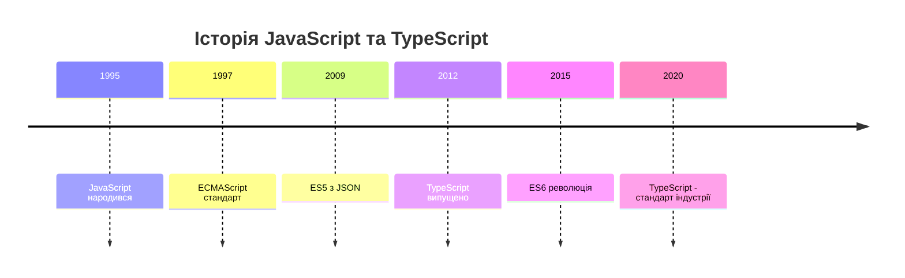
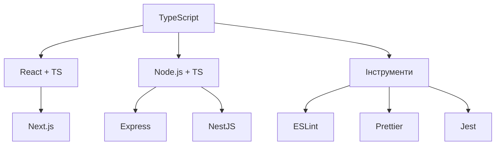

# TypeScript у веброзробці

---

## План лекції

- Вступ до TypeScript: від JavaScript до типобезпеки
- TypeScript основи та налаштування
- Типізація у Node.js проєктах
- React з TypeScript: патерни та практики
- Generic типи та utility types
- Типізація API responses
- Migration стратегії

---

## Еволюція JavaScript

### Від хаосу до порядку



**Проблема**: JavaScript росте, складність росте, але безпека типів - ні

**Рішення**: TypeScript = JavaScript + Types + Tools

---

## Що таке TypeScript?

### Надмножина JavaScript

**TypeScript = JavaScript + Типи**

- Будь-який валідний JS є валідним TS
- Компілюється в звичайний JavaScript
- Помилки виявляються на етапі розробки
- Покращує підтримку IDE

```typescript
// JavaScript
function add(a, b) {
    return a + b;
}

// TypeScript
function add(a: number, b: number): number {
    return a + b;
}
```

---

## Проблеми, які вирішує TypeScript

### 1. Динамічна типізація

```javascript
// JavaScript: помилка тільки під час виконання
const total = calculatePrice("100", "5");
// Результат: "100100" замість 500
```

```typescript
// TypeScript: помилка на етапі компіляції
function calculatePrice(price: number, quantity: number): number {
    return price * quantity;
}

const total = calculatePrice("100", "5"); // ❌ Помилка компіляції
```

---

## Проблеми, які вирішує TypeScript

### 2. Відсутність автодоповнення

```javascript
// JavaScript: IDE не знає структури
user.firstName // Можлива помилка в назві
user.fistName  // Помилка знайдеться пізно
```

```typescript
// TypeScript: повне автодоповнення
interface User {
    firstName: string;
    lastName: string;
}

user.fir // IDE запропонує firstName
```

---

## Проблеми, які вирішує TypeScript

### 3. Складність рефакторингу

**JavaScript**: пошук вручну всіх місць використання

**TypeScript**: автоматичне виявлення всіх змін

```typescript
// Змінили сигнатуру функції
function getUser(id: number): Promise<User> { }

// TypeScript автоматично покаже всі місця,
// де потрібні зміни
```

---

## Встановлення TypeScript

### Налаштування проєкту

```bash
# Ініціалізація проєкту
npm init -y

# Встановлення TypeScript
npm install --save-dev typescript

# Створення конфігурації
npx tsc --init
```

---

## Конфігурація tsconfig.json

```json
{
  "compilerOptions": {
    "target": "ES2020",
    "module": "commonjs",
    "strict": true,
    "esModuleInterop": true,
    "skipLibCheck": true,
    "outDir": "./dist",
    "rootDir": "./src",
    "sourceMap": true
  },
  "include": ["src/**/*"],
  "exclude": ["node_modules", "dist"]
}
```

**strict: true** - максимальна типобезпека

---

## Базові типи

```typescript
// Примітивні типи
let isDone: boolean = false;
let decimal: number = 6;
let color: string = "синій";

// Масиви
let list: number[] = [1, 2, 3];
let genericList: Array<number> = [1, 2, 3];

// Кортежі
let tuple: [string, number];
tuple = ["привіт", 10];

// Enum
enum Color { Red = 1, Green = 2, Blue = 4 }
let c: Color = Color.Green;
```

---

## Any vs Unknown

### Any - вимикає перевірку типів

```typescript
let notSure: any = 4;
notSure = "може бути рядком";
notSure.toFixed(); // Працює, але небезпечно
```

### Unknown - безпечна альтернатива

```typescript
let uncertain: unknown = 4;
// uncertain.toFixed(); // ❌ Помилка

if (typeof uncertain === "number") {
    uncertain.toFixed(); // ✅ Безпечно
}
```

**Правило**: використовуйте unknown замість any

---

## Інтерфейси

### Опис структури об'єктів

```typescript
interface User {
    id: number;
    username: string;
    email: string;
    firstName?: string;        // Необов'язкова
    readonly createdAt: Date;  // Тільки читання
}

const user: User = {
    id: 1,
    username: "ivan.petrenko",
    email: "ivan@example.com",
    createdAt: new Date()
};
```

---

## Розширення інтерфейсів

```typescript
interface User {
    id: number;
    email: string;
}

interface AdminUser extends User {
    role: "admin" | "superadmin";
    permissions: string[];
}

const admin: AdminUser = {
    id: 2,
    email: "admin@example.com",
    role: "admin",
    permissions: ["read", "write", "delete"]
};
```

---

## Type Aliases

### Альтернатива інтерфейсам

```typescript
type Point = {
    x: number;
    y: number;
};

// Union types
type StringOrNumber = string | number;

// Intersection types
type Timestamped = {
    createdAt: Date;
    updatedAt: Date;
};

type NamedEntity = {
    name: string;
};

type TimestampedEntity = NamedEntity & Timestamped;
```

---

## Interface vs Type

### Коли використовувати що?

**Interface**:
- Об'єкти та класи
- Коли потрібне розширення
- ООП підхід

**Type**:
- Union типи
- Intersection типи
- Tuple типи
- Алгоритмічні типи

---

## Функції у TypeScript

```typescript
// Типізація параметрів та результату
function add(a: number, b: number): number {
    return a + b;
}

// Необов'язкові параметри
function buildName(firstName: string, lastName?: string): string {
    return lastName ? `${firstName} ${lastName}` : firstName;
}

// Параметри за замовчуванням
function greet(name: string, greeting = "Привіт"): string {
    return `${greeting}, ${name}!`;
}

// Rest параметри
function sum(...numbers: number[]): number {
    return numbers.reduce((total, num) => total + num, 0);
}
```

---

## Function Type Expressions

```typescript
// Тип функції
type MathOperation = (a: number, b: number) => number;

const multiply: MathOperation = (a, b) => a * b;
const divide: MathOperation = (a, b) => a / b;

// Функція з властивостями
type DescribableFunction = {
    description: string;
    (someArg: number): boolean;
};

function doSomething(fn: DescribableFunction): void {
    console.log(fn.description + " returned " + fn(6));
}
```

---

## TypeScript у Node.js

### Налаштування для Node.js

```json
{
  "compilerOptions": {
    "target": "ES2020",
    "module": "commonjs",
    "moduleResolution": "node",
    "types": ["node"],
    "outDir": "./dist",
    "rootDir": "./src"
  }
}
```

```bash
# Встановлення типів для Node.js
npm install --save-dev @types/node
```

---

## Типізація Express

```typescript
import express, { Request, Response, NextFunction } from 'express';

const app = express();

// Базовий обробник
app.get('/api/users', (req: Request, res: Response) => {
    res.json({ users: [] });
});

// Типізація параметрів
interface UserParams {
    userId: string;
}

app.get('/api/users/:userId', (
    req: Request<UserParams>,
    res: Response
) => {
    const userId = parseInt(req.params.userId);
    res.json({ userId });
});
```

---

## Розширення типів Request

```typescript
// Кастомний Request з user
interface AuthRequest extends Request {
    user?: {
        id: number;
        email: string;
        role: string;
    };
}

// Middleware
const authMiddleware = (
    req: AuthRequest,
    res: Response,
    next: NextFunction
): void => {
    const token = req.headers.authorization;

    if (!token) {
        res.status(401).json({ error: 'Unauthorized' });
        return;
    }

    req.user = { id: 1, email: 'user@example.com', role: 'user' };
    next();
};
```

---

## Типізація body та query

```typescript
// Body
interface CreateUserBody {
    email: string;
    password: string;
    firstName: string;
}

app.post('/api/users', (
    req: Request<{}, {}, CreateUserBody>,
    res: Response
) => {
    const { email, password, firstName } = req.body;
    res.status(201).json({ message: 'User created' });
});

// Query параметри
interface SearchQuery {
    q?: string;
    page?: string;
}

app.get('/api/search', (
    req: Request<{}, {}, {}, SearchQuery>,
    res: Response
) => {
    const { q, page = '1' } = req.query;
    res.json({ query: q, page: parseInt(page) });
});
```

---

## Організація типів

```typescript
// src/types/user.types.ts
export interface User {
    id: number;
    email: string;
    firstName: string;
    lastName: string;
    role: UserRole;
}

export enum UserRole {
    Admin = 'admin',
    User = 'user',
    Moderator = 'moderator'
}

export interface CreateUserDTO {
    email: string;
    password: string;
    firstName: string;
    lastName: string;
}
```

---

## TypeScript у React

### Створення проєкту

```bash
# З Vite
npm create vite@latest my-app -- --template react-ts

# З Create React App
npx create-react-app my-app --template typescript
```

---

## Типізація компонентів

```typescript
import { FC, ReactNode } from 'react';

interface ButtonProps {
    children: ReactNode;
    onClick: () => void;
    variant?: 'primary' | 'secondary';
    disabled?: boolean;
}

export const Button: FC<ButtonProps> = ({
    children,
    onClick,
    variant = 'primary',
    disabled = false
}) => {
    return (
        <button
            onClick={onClick}
            disabled={disabled}
            className={`btn btn-${variant}`}
        >
            {children}
        </button>
    );
};
```

---

## Типізація хуків

```typescript
// useState з типом
const [count, setCount] = useState<number>(0);
const [user, setUser] = useState<User | null>(null);

// TypeScript автоматично визначає тип
const [text, setText] = useState(''); // string
const [isLoading, setIsLoading] = useState(false); // boolean

// useRef
const inputRef = useRef<HTMLInputElement>(null);

const handleFocus = () => {
    inputRef.current?.focus();
};
```

---

## Типізація подій

```typescript
import { ChangeEvent, MouseEvent, FormEvent } from 'react';

function EventHandlers() {
    const handleClick = (e: MouseEvent<HTMLButtonElement>) => {
        console.log('Clicked:', e.currentTarget.value);
    };

    const handleChange = (e: ChangeEvent<HTMLInputElement>) => {
        console.log('Changed:', e.target.value);
    };

    const handleSubmit = (e: FormEvent<HTMLFormElement>) => {
        e.preventDefault();
        console.log('Submitted');
    };
}
```

---

## Context з TypeScript

```typescript
interface AuthContextType {
    user: User | null;
    isAuthenticated: boolean;
    login: (email: string, password: string) => Promise<void>;
    logout: () => void;
}

const AuthContext = createContext<AuthContextType | undefined>(undefined);

export function useAuth(): AuthContextType {
    const context = useContext(AuthContext);

    if (context === undefined) {
        throw new Error('useAuth must be used within AuthProvider');
    }

    return context;
}
```

---

## Generic типи

### Функції для будьякого типу

```typescript
// Базовий generic
function identity<T>(arg: T): T {
    return arg;
}

const num = identity<number>(42);
const str = identity("hello");

// Generic з обмеженнями
interface Lengthwise {
    length: number;
}

function logLength<T extends Lengthwise>(arg: T): T {
    console.log(arg.length);
    return arg;
}
```

---

## Generic класи

```typescript
class DataStore<T> {
    private items: T[] = [];

    add(item: T): void {
        this.items.push(item);
    }

    get(index: number): T | undefined {
        return this.items[index];
    }

    filter(predicate: (item: T) => boolean): T[] {
        return this.items.filter(predicate);
    }
}

const numberStore = new DataStore<number>();
const userStore = new DataStore<User>();
```

---

## Utility Types: Partial

```typescript
interface User {
    id: number;
    email: string;
    firstName: string;
    lastName: string;
}

// Partial - всі властивості необов'язкові
type PartialUser = Partial<User>;
// {
//   id?: number;
//   email?: string;
//   firstName?: string;
//   lastName?: string;
// }

function updateUser(id: number, updates: Partial<User>): void {
    // Можна передати тільки ті поля, які потрібно оновити
}
```

---

## Utility Types: Pick та Omit

```typescript
interface User {
    id: number;
    email: string;
    firstName: string;
    lastName: string;
    age: number;
}

// Pick - вибрати властивості
type UserPreview = Pick<User, 'id' | 'email' | 'firstName'>;
// { id: number; email: string; firstName: string; }

// Omit - виключити властивості
type UserWithoutId = Omit<User, 'id'>;
// { email: string; firstName: string; lastName: string; age: number; }

type PublicUser = Omit<User, 'email' | 'age'>;
```

---

## Utility Types: Record

```typescript
type UserRoles = 'admin' | 'user' | 'moderator';

// Record - об'єкт з певними ключами
type RolePermissions = Record<UserRoles, string[]>;

const permissions: RolePermissions = {
    admin: ['read', 'write', 'delete'],
    user: ['read'],
    moderator: ['read', 'write']
};
```

---

## Utility Types: Readonly

```typescript
interface User {
    id: number;
    email: string;
    firstName: string;
}

// Readonly - всі властивості тільки для читання
type ReadonlyUser = Readonly<User>;

const user: ReadonlyUser = {
    id: 1,
    email: 'user@example.com',
    firstName: 'Ivan'
};

// user.email = 'new@example.com'; // ❌ Помилка
```

---

## Типізація API

```typescript
interface ApiResponse<T> {
    success: boolean;
    data?: T;
    error?: ApiError;
}

interface PaginatedResponse<T> {
    items: T[];
    total: number;
    page: number;
    pageSize: number;
}

class ApiClient {
    async get<T>(endpoint: string): Promise<ApiResponse<T>> {
        const response = await fetch(endpoint);
        return response.json();
    }
}
```

---

## Type Guards

```typescript
// Перевірка типу під час виконання
function isUser(value: unknown): value is User {
    return (
        typeof value === 'object' &&
        value !== null &&
        'id' in value &&
        typeof (value as any).id === 'number' &&
        'email' in value &&
        typeof (value as any).email === 'string'
    );
}

// Використання
async function fetchUser(id: number): Promise<User | null> {
    const response = await fetch(`/api/users/${id}`);
    const data = await response.json();

    if (isUser(data)) {
        return data; // TypeScript знає, що це User
    }

    return null;
}
```

---

## Валідація з Zod

```typescript
import { z } from 'zod';

const UserSchema = z.object({
    id: z.number(),
    email: z.string().email(),
    firstName: z.string(),
    lastName: z.string(),
    age: z.number().min(0).max(150)
});

// Отримати тип з схеми
type User = z.infer<typeof UserSchema>;

// Валідація
try {
    const user = UserSchema.parse(data);
    // user тепер має тип User
} catch (error) {
    console.error('Validation failed');
}
```

---

## Міграція на TypeScript

### Поступове впровадження

```json
// tsconfig.json для міграції
{
  "compilerOptions": {
    "allowJs": true,     // Дозволити JS файли
    "checkJs": false,    // Не перевіряти JS
    "strict": false,     // Поки без строгості
    "noImplicitAny": false
  }
}
```

**Стратегія**: файл за файлом, від простого до складного

---

## Етапи міграції

### 5 кроків до TypeScript

1. **Налаштуйте TypeScript** з allowJs: true
2. **Перейменуйте файли** з .js на .ts поступово
3. **Додайте типи** де TypeScript скаржиться
4. **Збільшуйте строгість** опцій по одній
5. **Рефакторинг** для використання TypeScript можливостей

---

## Міграція: приклад

```javascript
// До (JavaScript)
class UserService {
    async getUser(id) {
        const response = await fetch(`/users/${id}`);
        return response.json();
    }
}
```

```typescript
// Після (TypeScript)
class UserService {
    async getUser(id: number): Promise<User> {
        const response = await fetch(`/users/${id}`);
        const data = await response.json();

        if (!isUser(data)) {
            throw new Error('Invalid user data');
        }

        return data;
    }
}
```

---

## Найкращі практики

### 10 правил TypeScript

1. **Вмикайте strict режим** для нових проєктів
2. **Використовуйте type inference** де можливо
3. **interface для об'єктів**, type для unions
4. **Створюйте type guards** для валідації
5. **Уникайте any**, використовуйте unknown

---

## Найкращі практики

### 10 правил TypeScript (продовження)

6. **Організуйте типи** в окремих файлах
7. **Використовуйте utility types** замість дублювання
8. **Документуйте складні типи** коментарями
9. **Проводьте code review** типів
10. **Навчайте команду** TypeScript практикам

---

## TypeScript екосистема



---

## Продуктивність розробки

### З TypeScript vs Без TypeScript

**З TypeScript**:
- ✅ Помилки на етапі розробки
- ✅ Автодоповнення IDE
- ✅ Безпечний рефакторинг
- ✅ Жива документація
- ✅ Менше багів у продакшені

**Без TypeScript**:
- ❌ Помилки під час виконання
- ❌ Обмежене автодоповнення
- ❌ Ручний пошук при рефакторингу
- ❌ Застаріла документація
- ❌ Більше багів у продакшені

---

## Коли використовувати TypeScript?

### Завжди для:

- Великих проєктів
- Командної розробки
- Бібліотек та фреймворків
- Production додатків
- Довгострокової підтримки

### Можна пропустити:

- Невеликих скриптів
- Прототипів
- Навчальних проєктів

---

## Ресурси для навчання

### Офіційна документація

- [TypeScript Handbook](https://www.typescriptlang.org/docs/)
- [TypeScript Deep Dive](https://basarat.gitbook.io/typescript/)
- [React TypeScript Cheatsheet](https://react-typescript-cheatsheet.netlify.app/)

### Практика

- [TypeScript Exercises](https://typescript-exercises.github.io/)
- [Type Challenges](https://github.com/type-challenges/type-challenges)

---

## Висновки

### TypeScript змінює розробку

- **Типобезпека** без втрати гнучкості JavaScript
- **Покращує якість** коду та продуктивність команди
- **Зменшує кількість** багів у продакшені
- **Полегшує підтримку** та рефакторинг
- **Стандарт індустрії** для професійної розробки

**TypeScript - це інвестиція, яка окупається**
