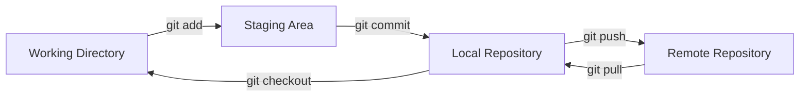
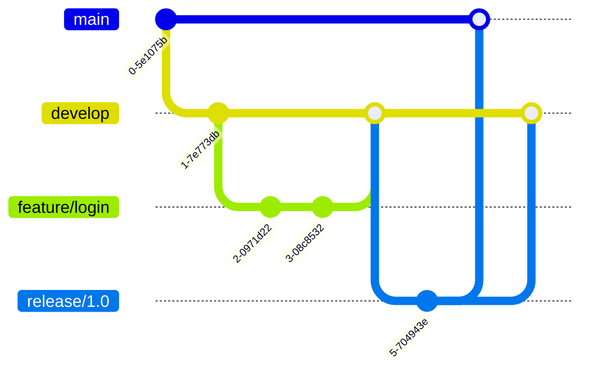
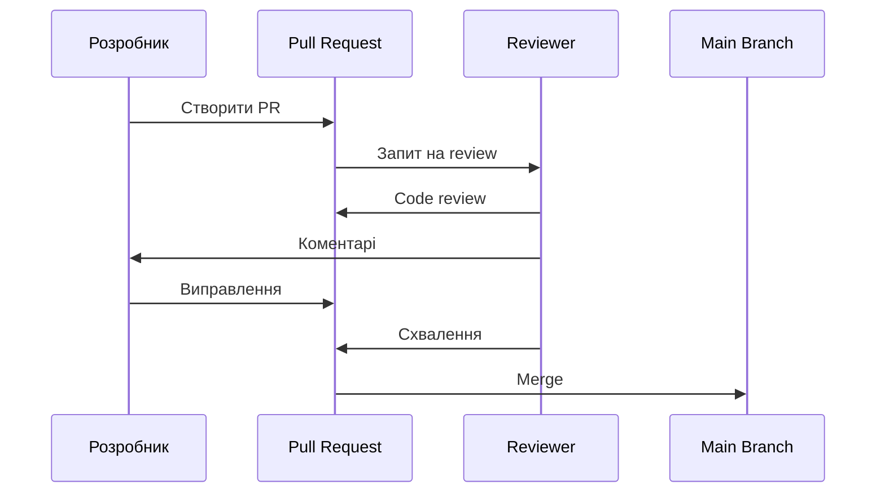
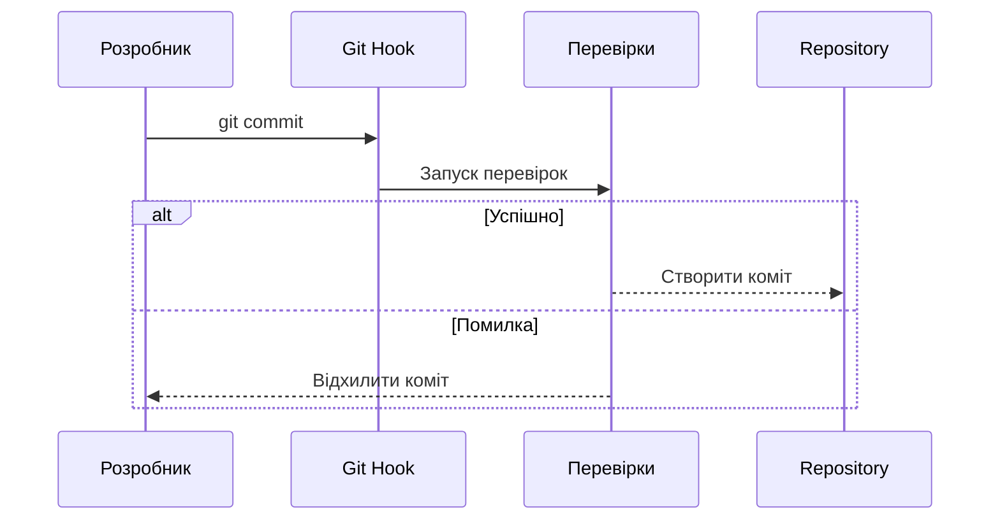
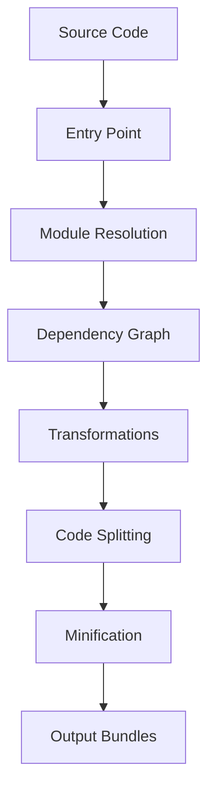
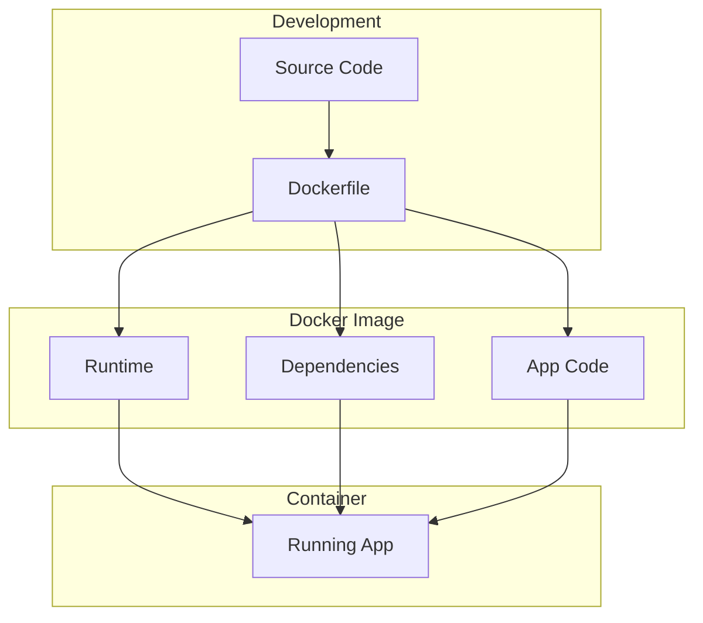

# Лекція 20. Сучасні інструменти розробки

---

## План лекції

1. **Git workflow та колаборація**
2. **ESLint та Prettier**
3. **Husky та pre-commit hooks**
4. **Bundle аналіз та оптимізація**
5. **Docker для веброзробників**
6. **VS Code розширення**

---

## Еволюція інструментів веброзробки

**Від простого до складного:**

- 1995: текстовий редактор + браузер
- 2000: IDE + FTP-клієнт
- 2010: Git + системи збірки
- 2020+: комплексна екосистема інструментів

**Чому це важливо?**

- Автоматизація рутинних завдань
- Раннє виявлення помилок
- Єдині стандарти в команді
- Швидкий зворотний зв'язок

---

## Категорії сучасних інструментів

**Системи контролю версій**
- Git для відстеження змін та співпраці

**Якість коду**
- Лінтери, форматери, статичний аналіз

**Автоматизація**
- Збірка, тестування, деплой

**Аналіз та оптимізація**
- Продуктивність, розмір bundle

**Контейнеризація**
- Ідентичне середовище розробки

---

## Git: Фундаментальні концепції



**Ключові поняття:**
- Репозиторій (repository) - база даних з історією
- Коміт (commit) - знімок стану проєкту
- Гілка (branch) - ізольована лінія розробки
- Індекс (staging area) - проміжна область

---

## Базові операції Git

```bash
# Ініціалізація та клонування
git init
git clone https://github.com/username/project.git

# Робота з змінами
git status
git add file.js
git commit -m "feat: Add user authentication"

# Синхронізація
git push origin main
git pull origin main

# Історія
git log --oneline --graph
```

---

## Анатомія хорошого коміту

**Структура повідомлення:**

```
<type>: <short description>

<detailed description>

<footer>
```

**Типи комітів:**
- `feat` - нова функціональність
- `fix` - виправлення помилки
- `docs` - зміни в документації
- `style` - форматування коду
- `refactor` - рефакторинг
- `test` - додавання тестів
- `chore` - технічні зміни

---

## Приклади повідомлень комітів

**Хороші приклади:**

```bash
feat: Add password reset functionality

Implement password reset flow with email verification.
Users can now request password reset link via email.
Link expires after 1 hour for security reasons.

Fixes #123
```

**Погані приклади:**

```bash
fixed stuff
update
changes
```

---

## Робота з гілками

```bash
# Створення та перемикання
git checkout -b feature/user-authentication

# Перегляд гілок
git branch -a

# Об'єднання
git checkout main
git merge feature/user-authentication

# Rebase
git rebase main

# Видалення
git branch -d feature/user-authentication
```

---

## Стратегії об'єднання

**Merge**
- Створює merge-коміт
- Зберігає повну історію
- Безпечний підхід

**Rebase**
- Лінійна історія
- Переписує коміти
- Обережно з публічними гілками

**Squash**
- Об'єднує коміти в один
- Чиста історія

---

## Git Flow: структура гілок



---

## Git Flow: типи гілок

**Основні:**
- `main` - production код
- `develop` - інтеграційна гілка

**Допоміжні:**
- `feature/*` - нові функції
- `release/*` - підготовка релізу
- `hotfix/*` - термінові виправлення

---

## GitHub Flow: спрощена альтернатива

**Принципи:**

1. Єдина гілка `main` завжди готова до деплою
2. Всі зміни в feature branches
3. Pull requests для code review
4. Автоматичне тестування
5. Деплой після merge

```bash
git checkout main
git pull origin main
git checkout -b feature/new-feature
# розробка
git push origin feature/new-feature
# створення PR через GitHub
```

---

## Розв'язання конфліктів

**Виникнення конфлікту:**

```javascript
<<<<<<< HEAD
const userEmail = user.email;
=======
const userEmail = user.emailAddress;
>>>>>>> feature/user-profile
```

**Розв'язання:**

```bash
# Редагування файлу вручну
git add src/components/User.jsx
git commit -m "Merge with conflict resolution"

# Або використання mergetool
git mergetool
```

---

## Продвинуті техніки Git

**Інтерактивний rebase:**

```bash
git rebase -i HEAD~3

# pick abc123 feat: Add login form
# squash def456 fix: Fix validation
# squash ghi789 style: Format code
```

**Cherry-pick:**

```bash
git cherry-pick abc123
```

**Stash:**

```bash
git stash save "Work in progress"
git stash list
git stash pop
```

---

## Pull Request процес



---

## Структура опису PR

```markdown
## Опис змін
Додано систему сповіщень для користувачів

## Тип змін
- [x] Нова функціональність

## Пов'язані issues
Closes #123

## Як тестувати
1. Зареєструватися
2. Увімкнути сповіщення
3. Перевірити отримання

## Checklist
- [x] Додано тести
- [x] Оновлено документацію
```

---

## ESLint: статичний аналіз коду

**Що таке ESLint?**

Інструмент для виявлення проблем у JavaScript коді та забезпечення єдиного стилю.

**Встановлення:**

```bash
npm install --save-dev eslint
npx eslint --init
```

**Рівні правил:**
- `error` - блокує виконання
- `warn` - попередження
- `off` - вимкнено

---

## Конфігурація ESLint

**.eslintrc.json:**

```json
{
  "extends": [
    "eslint:recommended",
    "plugin:react/recommended"
  ],
  "rules": {
    "indent": ["error", 2],
    "quotes": ["error", "single"],
    "semi": ["error", "always"],
    "no-unused-vars": "warn",
    "no-console": "warn"
  }
}
```

---

## Використання ESLint

```bash
# Перевірка коду
npx eslint src/

# Автоматичне виправлення
npx eslint src/ --fix

# Ігнорування файлів
echo "node_modules
dist
build" > .eslintignore
```

**В package.json:**

```json
{
  "scripts": {
    "lint": "eslint src/",
    "lint:fix": "eslint src/ --fix"
  }
}
```

---

## Prettier: автоматичне форматування

**Що таке Prettier?**

Opinionated code formatter, який автоматично форматує код.

**Встановлення:**

```bash
npm install --save-dev prettier
echo {} > .prettierrc.json
```

**Філософія:**
- Мінімум налаштувань
- Усуває дискусії про стиль
- Підтримка багатьох мов

---

## Конфігурація Prettier

**.prettierrc.json:**

```json
{
  "semi": true,
  "trailingComma": "es5",
  "singleQuote": true,
  "printWidth": 80,
  "tabWidth": 2,
  "arrowParens": "always"
}
```

**Використання:**

```bash
npx prettier --write .
npx prettier --check .
```

---

## Інтеграція ESLint та Prettier

```bash
npm install --save-dev eslint-config-prettier eslint-plugin-prettier
```

**.eslintrc.json:**

```json
{
  "extends": [
    "eslint:recommended",
    "prettier"
  ],
  "plugins": ["prettier"],
  "rules": {
    "prettier/prettier": "error"
  }
}
```

**Результат:** ESLint для логіки, Prettier для форматування

---

## VS Code інтеграція

**.vscode/settings.json:**

```json
{
  "editor.defaultFormatter": "esbenp.prettier-vscode",
  "editor.formatOnSave": true,
  "editor.codeActionsOnSave": {
    "source.fixAll.eslint": true
  }
}
```

**Рекомендовані розширення:**
- ESLint
- Prettier
- EditorConfig

---

## Git Hooks концепція

**Що таке Git Hooks?**

Скрипти, які виконуються до або після Git подій.



---

## Типи Git Hooks

**Pre-commit:**
- Виконується перед комітом
- Лінтинг, форматування, тести

**Pre-push:**
- Перед відправкою на сервер
- Повний набір тестів

**Commit-msg:**
- Перевірка повідомлення коміту
- Дотримання конвенцій

---

## Husky: автоматизація hooks

```bash
# Встановлення
npm install --save-dev husky
npx husky init

# Створення pre-commit hook
npx husky add .husky/pre-commit "npm test"
```

**.husky/pre-commit:**

```bash
#!/usr/bin/env sh
. "$(dirname -- "$0")/_/husky.sh"

npm run lint
npm run format:check
```

---

## lint-staged: оптимізація

**Перевірка тільки змінених файлів:**

```bash
npm install --save-dev lint-staged
```

**.lintstagedrc.json:**

```json
{
  "*.{js,jsx,ts,tsx}": [
    "eslint --fix",
    "prettier --write"
  ],
  "*.{css,scss,json,md}": [
    "prettier --write"
  ]
}
```

---

## Інтеграція Husky + lint-staged

**.husky/pre-commit:**

```bash
#!/usr/bin/env sh
. "$(dirname -- "$0")/_/husky.sh"

npx lint-staged
```

**Результат:**
- Швидкі перевірки
- Тільки змінені файли
- Автоматичне виправлення
- Блокування поганого коду

---

## commitlint: валідація повідомлень

```bash
npm install --save-dev @commitlint/cli @commitlint/config-conventional
```

**.commitlintrc.json:**

```json
{
  "extends": ["@commitlint/config-conventional"],
  "rules": {
    "type-enum": [2, "always", [
      "feat", "fix", "docs", "style",
      "refactor", "test", "chore"
    ]]
  }
}
```

**.husky/commit-msg:**

```bash
npx --no -- commitlint --edit $1
```

---

## Повна система перевірок

**package.json:**

```json
{
  "scripts": {
    "prepare": "husky install",
    "lint": "eslint src/",
    "format": "prettier --write .",
    "type-check": "tsc --noEmit",
    "test": "jest"
  },
  "lint-staged": {
    "*.{js,jsx,ts,tsx}": [
      "eslint --fix",
      "prettier --write",
      "jest --findRelatedTests --bail"
    ]
  }
}
```

---

## Bundle аналіз: розуміння процесу



**Популярні bundler'и:**
- Webpack - найпотужніший
- Vite - найшвидший
- Parcel - zero-config
- esbuild - надшвидкий

---

## webpack-bundle-analyzer

```bash
npm install --save-dev webpack-bundle-analyzer
```

**webpack.config.js:**

```javascript
const { BundleAnalyzerPlugin } = require('webpack-bundle-analyzer');

module.exports = {
  plugins: [
    new BundleAnalyzerPlugin({
      analyzerMode: 'static',
      reportFilename: 'bundle-report.html'
    })
  ]
};
```

---

## Vite bundle аналіз

```bash
npm install --save-dev rollup-plugin-visualizer
```

**vite.config.js:**

```javascript
import { visualizer } from 'rollup-plugin-visualizer';

export default defineConfig({
  plugins: [
    visualizer({
      filename: './dist/stats.html',
      gzipSize: true,
      brotliSize: true
    })
  ]
});
```

---

## Code Splitting

**Динамічні імпорти:**

```javascript
// React lazy loading
const UserProfile = lazy(() => import('./UserProfile'));

function App() {
  return (
    <Suspense fallback={<Loading />}>
      <Routes>
        <Route path="/profile" element={<UserProfile />} />
      </Routes>
    </Suspense>
  );
}
```

**Результат:**
- Менші початкові bundle
- Швидше завантаження
- Кращий UX

---

## Tree Shaking

**Правильний імпорт:**

```javascript
// Добре - tree shaking працює
import { specific } from 'library';

// Погано - імпортує все
import * as library from 'library';

// Приклад з lodash
import debounce from 'lodash/debounce'; // 5KB
// замість
import _ from 'lodash'; // 70KB
```

---

## Оптимізація Vite збірки

```javascript
export default defineConfig({
  build: {
    rollupOptions: {
      output: {
        manualChunks: {
          'react-vendor': ['react', 'react-dom'],
          'ui-vendor': ['@radix-ui/react-dialog']
        }
      }
    },
    minify: 'terser',
    terserOptions: {
      compress: {
        drop_console: true
      }
    }
  }
});
```

---

## Docker: концепція контейнеризації



---

## Переваги Docker

**Консистентність:**
- Однакове середовище скрізь

**Ізоляція:**
- Різні версії залежностей

**Швидкість:**
- Легке розгортання

**Масштабованість:**
- Горизонтальне масштабування

---

## Dockerfile для Node.js

```dockerfile
FROM node:20-alpine

WORKDIR /app

COPY package*.json ./
RUN npm ci --only=production

COPY . .
RUN npm run build

EXPOSE 3000
CMD ["npm", "start"]
```

---

## Multi-stage build

```dockerfile
# Build stage
FROM node:20-alpine AS builder
WORKDIR /app
COPY package*.json ./
RUN npm ci
COPY . .
RUN npm run build

# Production stage
FROM node:20-alpine
WORKDIR /app
COPY --from=builder /app/dist ./dist
COPY --from=builder /app/node_modules ./node_modules
EXPOSE 3000
CMD ["node", "dist/server.js"]
```

**Переваги:** менший розмір образу

---

## Docker Compose

```yaml
version: '3.8'

services:
  frontend:
    build: ./frontend
    ports:
      - "5173:5173"
    depends_on:
      - backend

  backend:
    build: ./backend
    ports:
      - "3000:3000"
    depends_on:
      - postgres

  postgres:
    image: postgres:15-alpine
    environment:
      POSTGRES_DB: mydb
```

---

## Docker Compose команди

```bash
# Запуск
docker-compose up -d

# Зупинка
docker-compose down

# Перебудова
docker-compose build

# Логи
docker-compose logs -f

# Виконання команд
docker-compose exec backend npm run migrate
```

---

## .dockerignore

```
node_modules
npm-debug.log
dist
build
.git
.gitignore
.env
.vscode
coverage
*.md
```

**Зменшує:**
- Розмір контексту збірки
- Час створення образу
- Розмір фінального образу

---

## VS Code обов'язкові розширення

**.vscode/extensions.json:**

```json
{
  "recommendations": [
    "dbaeumer.vscode-eslint",
    "esbenp.prettier-vscode",
    "eamodio.gitlens",
    "usernamehw.errorlens",
    "formulahendry.auto-rename-tag"
  ]
}
```

---

## Налаштування VS Code

```json
{
  "editor.formatOnSave": true,
  "editor.codeActionsOnSave": {
    "source.fixAll.eslint": true
  },
  "editor.fontLigatures": true,
  "editor.bracketPairColorization.enabled": true,
  "files.autoSave": "onFocusChange",
  "javascript.updateImportsOnFileMove.enabled": "always"
}
```

---

## Користувацькі snippets

```json
{
  "React Functional Component": {
    "prefix": "rfc",
    "body": [
      "export const ${1:ComponentName} = () => {",
      "  return (",
      "    <div>",
      "      $0",
      "    </div>",
      "  );",
      "};"
    ]
  }
}
```

---

## CI/CD інтеграція

```yaml
name: CI

on: [pull_request, push]

jobs:
  quality:
    runs-on: ubuntu-latest
    steps:
      - uses: actions/checkout@v3
      - uses: actions/setup-node@v3
      - run: npm ci
      - run: npm run lint
      - run: npm run type-check
      - run: npm run test
      - run: npm run build
```

---

## Послідовність впровадження

1. **Git workflow** - основа всього
2. **ESLint + Prettier** - якість коду
3. **Git hooks** - автоматизація
4. **Bundle аналіз** - оптимізація
5. **Docker** - консистентність
6. **VS Code** - продуктивність

---

## Баланс якості та продуктивності

**Pre-commit hooks:**
- Швидкі перевірки (< 10 сек)
- Тільки змінені файли
- lint-staged

**Pre-push hooks:**
- Повний набір тестів
- Складніші перевірки

**CI/CD:**
- Всі перевірки
- Різні середовища

---

## Командні стандарти

**Обов'язкові файли:**
- `.eslintrc.json` - правила лінтингу
- `.prettierrc.json` - форматування
- `.editorconfig` - базова конфігурація
- `.vscode/` - налаштування редактора
- `.husky/` - git hooks
- `docker-compose.yml` - локальна розробка
- `CONTRIBUTING.md` - інструкції

---

## Критерії оцінки нових інструментів

**Питання:**
- Яку проблему вирішує?
- Чи активна підтримка?
- Легкість інтеграції?
- Вплив на workflow?
- Наявність документації?

**Підхід:** поступове впровадження

---

## Ключові висновки

**Автоматизація:**
- Звільняє час для розробки
- Зменшує кількість помилок
- Забезпечує консистентність

**Інтеграція:**
- Інструменти працюють разом
- Єдиний workflow
- Безперервний процес

**Еволюція:**
- Постійне вдосконалення
- Адаптація під команду
- Баланс складності та користі
