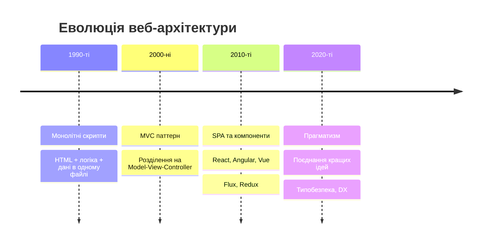
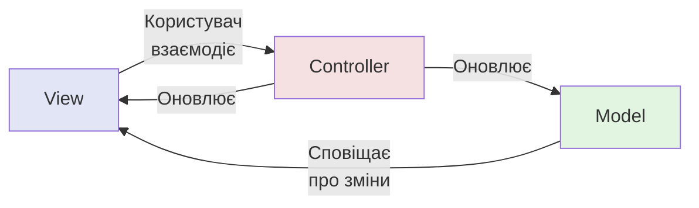
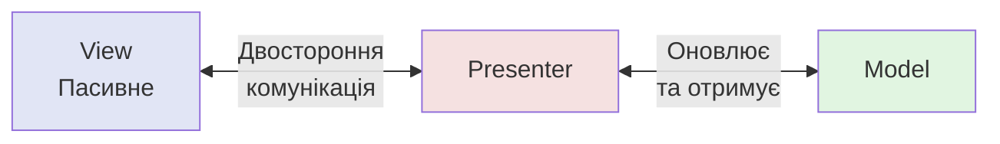
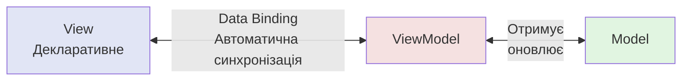
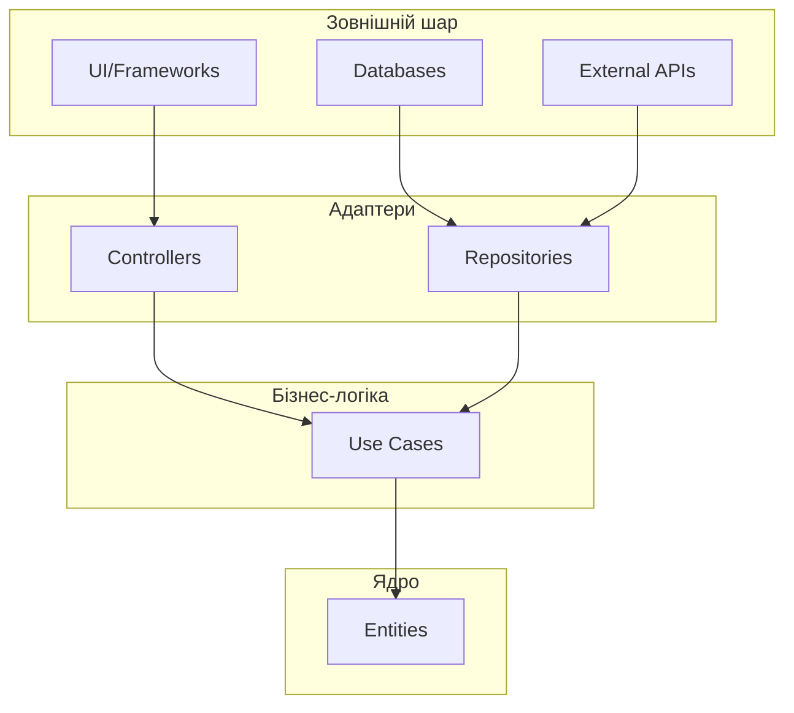
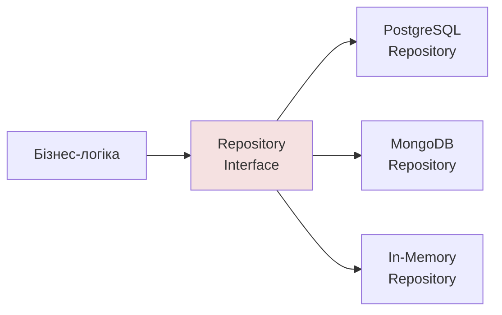

# Архітектурні паттерни у веброзробці

## Що таке архітектурний паттерн?

### Визначення

**Архітектурний паттерн** — перевірене рішення для організації коду, яке визначає структуру системи, компоненти та їх взаємодії

### Ключові питання

- Як організувати код для масштабованості?
- Як розділити відповідальність між компонентами?
- Як забезпечити тестованість?
- Як зменшити зв'язаність між модулями?

---

## Чому архітектура важлива?

### Без продуманої архітектури

**Технічний борг**

Швидкі рішення накопичуються, ускладнюють розвиток

**Проблеми масштабування**

Неможливість додавати функції без переписування коду

**Труднощі підтримки**

Більше часу на розуміння коду, ніж на його написання

### З правильною архітектурою

- Чітке розділення відповідальності
- Легке тестування окремих частин
- Можливість паралельної розробки
- Гнучкість при зміні вимог

---

## Еволюція архітектурних підходів



---

## MVC - Model-View-Controller

### Схема взаємодії



**Model** — дані та бізнес-логіка

**View** — відображення даних

**Controller** — координація взаємодії

---

## Компоненти MVC

### Model (Модель)

- Структури даних та валідація
- Бізнес-правила та обчислення
- Взаємодія з базою даних
- Сповіщення про зміни

### View (Представлення)

- Візуалізація даних моделі
- Відображення форм
- Реагування на події інтерфейсу
- Форматування даних

### Controller (Контролер)

- Обробка користувацьких подій
- Валідація введених даних
- Оркестрація операцій над моделлю

---

## MVP - Model-View-Presenter

### Відмінності від MVC



**View** — повністю пасивне, без логіки

**Presenter** — вся логіка презентації

**Переваги:**

- Повна ізоляція View від бізнес-логіки
- Легке тестування через мок-об'єкти
- Проста заміна View

---

## MVVM - Model-View-ViewModel

### Реактивне зв'язування



### Ключові концепції

**ViewModel** — стан представлення у готовому форматі

**Data Binding** — автоматична синхронізація

**Commands** — інкапсуляція дій користувача

**Використання:** Vue.js, Angular, React з реактивністю

---

## Порівняння MVC, MVP, MVVM

| Аспект | MVC | MVP | MVVM |
|--------|-----|-----|------|
| **View** | Активне | Пасивне | Декларативне |
| **Зв'язування** | Ручне | Через Presenter | Автоматичне |
| **Тестованість** | Середня | Висока | Висока |
| **Складність** | Низька | Середня | Висока |
| **Використання** | Традиційний веб | Складні UI | Реактивні фреймворки |

### Вибір паттерну

Залежить від вимог проєкту, фреймворку та команди

---

## Clean Architecture

### Концепція Uncle Bob



**Залежності** завжди спрямовані всередину

---

## Принципи Clean Architecture

### Dependency Rule

Внутрішні шари НЕ знають про зовнішні

### Незалежність

**Від фреймворків** — фреймворк це інструмент, не архітектура

**Від UI** — легка заміна інтерфейсу

**Від бази даних** — можна змінити СУБД без впливу на логіку

**Від зовнішніх агентів** — бізнес-правила не залежать від деталей

### Результат

**Тестованість** — можна тестувати без UI та БД

**Гнучкість** — легко замінювати компоненти

---

## Шари Clean Architecture

### Entities (Сутності)

Критичні бізнес-правила підприємства

Можуть використовуватися в різних додатках

### Use Cases (Варіанти використання)

Специфічна для додатку бізнес-логіка

Оркестрація потоку даних

### Interface Adapters (Адаптери)

Перетворення даних між форматами

Controllers, Presenters, Repositories

### Frameworks & Drivers

Зовнішні інструменти та фреймворки

База даних, UI, веб-фреймворк

---

## Dependency Injection

### Концепція

Об'єкт НЕ створює свої залежності, а отримує їх ззовні

### Погано: жорстка залежність

```javascript
class UserService {
    constructor() {
        this.database = new PostgresDatabase();
        this.emailService = new EmailService();
    }
}
```

### Добре: впровадження залежностей

```javascript
class UserService {
    constructor(database, emailService) {
        this.database = database;
        this.emailService = emailService;
    }
}
```

---

## Способи Dependency Injection

### Constructor Injection

Через конструктор — найпопулярніший спосіб

Забезпечує обов'язковість залежностей

### Property Injection

Через властивості — для опційних залежностей

Можна встановити пізніше

### Method Injection

Через параметри методу

Коли залежність потрібна для конкретного методу

### DI контейнер

Автоматизує створення об'єктів та впровадження залежностей

---

## Переваги Dependency Injection

### Тестованість

Легко замінити реальні залежності на мок-об'єкти

```javascript
const mockDatabase = { insert: jest.fn() };
const service = new UserService(mockDatabase);
```

### Модульність

Слабка зв'язаність між компонентами

### Конфігурованість

Зміна поведінки через зміну впроваджених реалізацій

### Повторне використання

Компоненти не залежать від контексту

---

## Repository Pattern

### Концепція

Інкапсуляція доступу до даних

Абстрактний інтерфейс для роботи з колекціями



### Переваги

- Приховує деталі зберігання даних
- Легко замінити джерело даних
- Спрощує тестування

---

## Service Pattern

### Призначення

Координація операцій між репозиторіями

Застосування бізнес-правил

### Коли використовувати

- Операції між кількома репозиторіями
- Складна бізнес-логіка кількох сутностей
- Інтеграція зовнішніх сервісів
- Трансакційні операції
- Валідація з перевіркою різних джерел

### Приклад

```javascript
class OrderService {
    constructor(orderRepo, productRepo, payment) {
        this.orderRepo = orderRepo;
        this.productRepo = productRepo;
        this.payment = payment;
    }
}
```

---

## Repository vs Service

### Repository

**Відповідальність:**

- Доступ до даних конкретної сутності
- CRUD операції
- Запити та фільтрація

**НЕ містить:** бізнес-логіку

### Service

**Відповідальність:**

- Координація між репозиторіями
- Бізнес-правила
- Валідація складних сценаріїв

**Використовує:** репозиторії для доступу до даних

---

## Error Boundaries в React

### Концепція

Компоненти, які перехоплюють помилки в дереві компонентів

Відображають запасний UI замість зламаного дерева

### Переваги

**Graceful degradation** — одна помилка не руйнує весь додаток

**Логування** — централізоване відстеження помилок

**Кращий UX** — користувач бачить зрозуміле повідомлення

### Використання

```javascript
<ErrorBoundary>
    <MainContent />
</ErrorBoundary>
```

---

## Стратегії обробки помилок

### Власні класи помилок

```javascript
class ValidationError extends Error { }
class NotFoundError extends Error { }
class UnauthorizedError extends Error { }
```

### Централізована обробка

**Backend:** глобальний error handler middleware

**Frontend:** error boundary + error handler utility

### Типи помилок

**Операційні** — очікувані, оброблюються gracefully

**Програмні** — баги, потребують виправлення

---

## Система логування

### Рівні логування

**ERROR** — помилки, що потребують уваги

**WARN** — попередження про потенційні проблеми

**INFO** — інформація про нормальну роботу

**DEBUG** — детальна інформація для розробки

**TRACE** — дуже детальна інформація

### Структуроване логування

```javascript
logger.info('User created', {
    userId: user.id,
    email: user.email,
    timestamp: new Date()
});
```

---

## Практики логування

### Контекстне логування

Додавання trace ID до кожного запиту

Відстеження операцій через розподілену систему

### Транспорти логів

**Console** — розробка

**File** — довгострокове зберігання

**HTTP** — централізований сервіс логування

### Performance моніторинг

Вимірювання часу виконання операцій

Відстеження використання пам'яті

---

## Debugging стратегії

### Request tracing

Middleware для відстеження запитів

Trace ID для кожного запиту

### Performance monitoring

Вимірювання метрик ключових операцій

Виявлення вузьких місць

### Інтеграція з моніторингом

**Sentry** — відстеження помилок

**DataDog** — моніторинг продуктивності

**LogRocket** — session replay

---

## Найкращі практики

### Вибір архітектури

Базуйтеся на вимогах проєкту, не на трендах

Починайте просто, ускладнюйте за потребою

### Документація

Документуйте архітектурні рішення

Пояснюйте обґрунтування вибору

### Тестування

Інвестуйте в автоматизоване тестування

Тестуйте на всіх рівнях архітектури

### Code Reviews

Фокусуйтеся на архітектурних аспектах

Забезпечуйте консистентність підходів

---

## Практичні рекомендації

### Еволюція

Архітектура має еволюціонувати з проєктом

Рефакторинг — це нормальна практика

### Принципи SOLID

Застосовуйте SOLID принципи до архітектури

Single Responsibility, Open/Closed, тощо

### Баланс

Не переусложнюйте передчасно

Не жертвуйте простотою заради паттернів

### Команда

Забезпечуйте розуміння архітектури всією командою

Проводьте навчання та обмін знаннями

---

## Ключові висновки

### MVC, MVP, MVVM

Кожен паттерн має своє застосування

Вибір залежить від контексту та фреймворку

### Clean Architecture

Незалежність бізнес-логіки від деталей

Довгострокова підтримуваність

### Dependency Injection

Fundamental для гнучких систем

Покращує тестованість

### Repository & Service

Чітке розділення відповідальності

Спрощує розвиток та підтримку

---

## Фінальні поради

### Головний принцип

**Найкращий код — той, який легко читати, розуміти та модифікувати**

### Пам'ятайте

Архітектурні паттерни — це інструменти, не догми

Адаптуйте їх до своїх потреб

Не ускладнюйте код заради паттернів

### Практика

Експериментуйте з різними підходами

Вчіться на помилках

Ділітеся досвідом з командою
