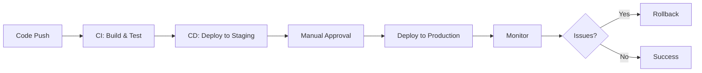
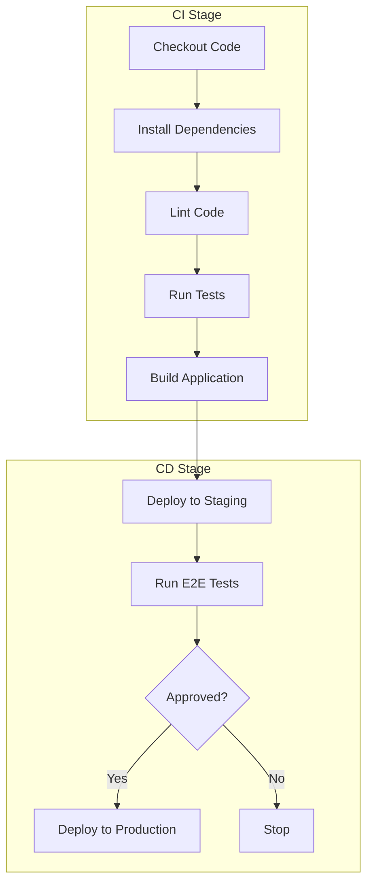
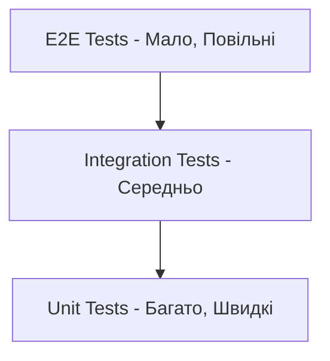
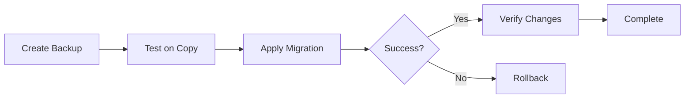
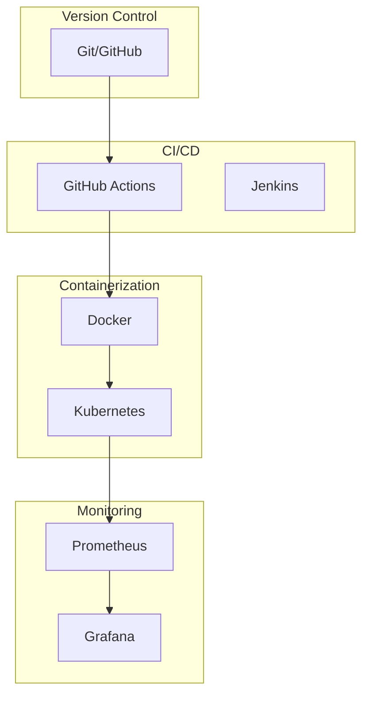
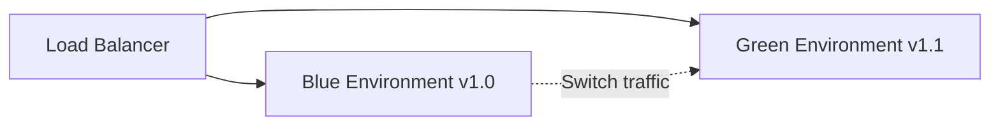
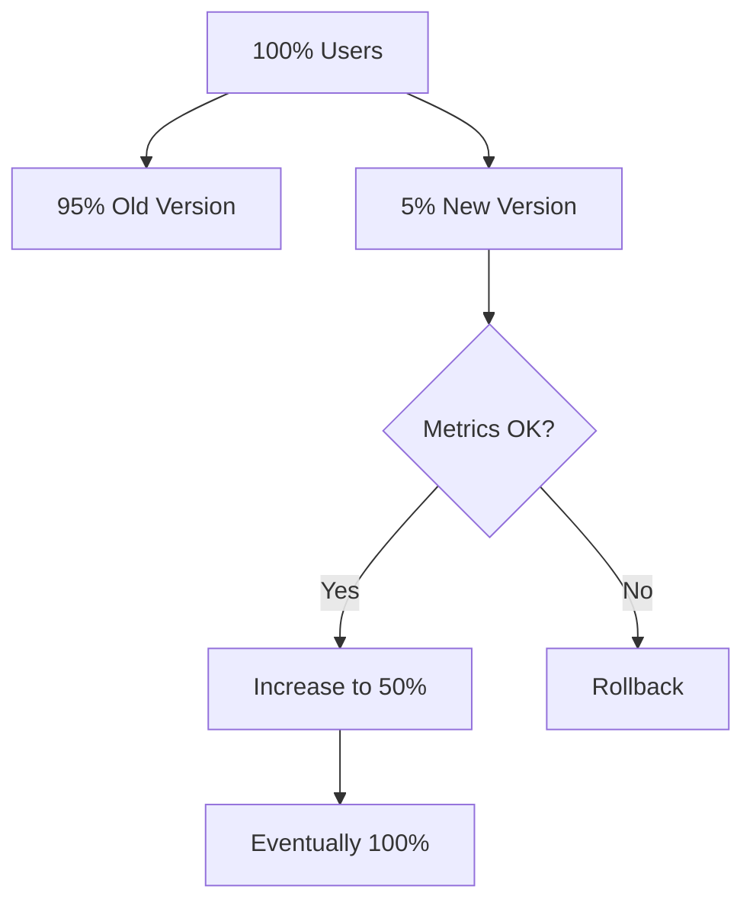
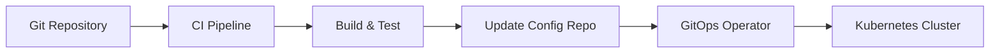
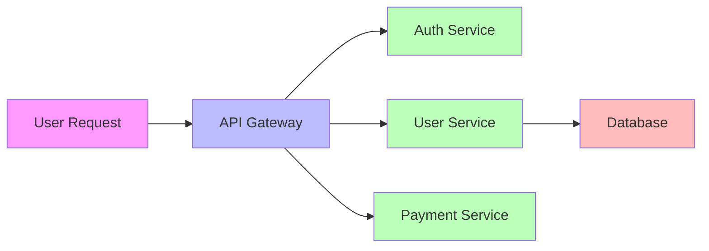
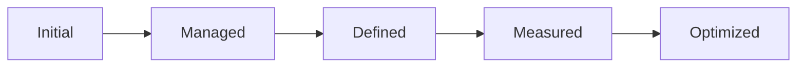

# DevOps для веброзробників


---

## План лекції

1. Вступ до DevOps культури
2. CI/CD Pipelines та автоматизація
3. Environment Management
4. Database Migrations у Production
5. Backup та Recovery стратегії
6. Monitoring та Alerting

---

## Що таке DevOps?

**DevOps = Development + Operations**

Методологія, яка об'єднує розробку та операційну діяльність в єдиний безперервний процес

**Мета:** прискорення доставки якісного ПЗ кінцевим користувачам

---

## Проблема до DevOps

### Традиційний підхід:

- **Розробники:** швидко випускати нові функції
- **Операційники:** стабільність та надійність систем

### Результат:

❌ Конфлікт інтересів
❌ Уповільнення доставки ПЗ
❌ Ручні процеси деплою
❌ Непередбачувані проблеми в production

---

## Основні принципи DevOps

### 1. Безперервна інтеграція та доставка
Код постійно інтегрується, тестується та готується до випуску

### 2. Інфраструктура як код
Вся конфігурація описується в коді

### 3. Моніторинг та спостережуваність
Проактивний підхід до виявлення проблем

### 4. Культура відповідальності
Команди контролюють весь життєвий цикл додатку

---

## Переваги DevOps

✅ **Швидкість доставки** — нові функції за лічені хвилини
✅ **Надійність** — автоматизоване тестування
✅ **Масштабованість** — інфраструктура як код
✅ **Економія ресурсів** — автоматизація рутинних операцій

---

## CI/CD: Основні концепції



---

## Continuous Integration (CI)

**Що це?**
Регулярне об'єднання змін коду з автоматичною верифікацією

**Як працює?**
1. Розробник робить push коду
2. Автоматично запускається збірка
3. Виконуються тести
4. Перевіряється якість коду
5. Результат повідомляється команді

---

## Continuous Delivery vs Deployment

### Continuous Delivery
- Код завжди готовий до випуску
- Розгортання вимагає ручного підтвердження
- Підходить для критичних систем

### Continuous Deployment
- Автоматичне розгортання кожної зміни
- Без ручного втручання
- Вимагає високої зрілості процесів

---

## GitHub Actions: Приклад Workflow

```yaml
name: CI Pipeline

on:
  push:
    branches: [main, develop]
  pull_request:
    branches: [main]

jobs:
  test:
    runs-on: ubuntu-latest
    steps:
      - uses: actions/checkout@v4
      - uses: actions/setup-node@v4
      - run: npm ci
      - run: npm run lint
      - run: npm run test
      - run: npm run build
```

---

## Anatomy CI/CD Pipeline



---

## Типи тестів в Pipeline

### Unit Tests
Тестування окремих функцій та модулів

### Integration Tests
Тестування взаємодії між компонентами

### End-to-End Tests
Тестування повних сценаріїв користувача

**Правило:** пірамідальна структура тестів

---

## Пірамідальна структура тестів



**Чим нижче рівень — тим більше тестів і швидше виконання**

---

## Environment Management

### Типи середовищ:

**Development** — локальна розробка
**Staging** — копія production для тестування
**Production** — реальні користувачі

**Принцип:** кожне середовище має свою конфігурацію

---

## Управління конфігурацією

```bash
# .env.development
NODE_ENV=development
DATABASE_URL=postgresql://localhost:5432/myapp_dev
LOG_LEVEL=debug

# .env.production
NODE_ENV=production
DATABASE_URL=postgresql://prod-db:5432/myapp
LOG_LEVEL=warn
```

**Важливо:** секрети зберігаються в GitHub Secrets, не в коді!

---

## Docker: Контейнеризація

**Проблема:** "works on my machine"

**Рішення:** Docker контейнери

### Переваги:
✅ Консистентність між середовищами
✅ Ізоляція залежностей
✅ Легке масштабування
✅ Швидкий деплой

---

## Багатоетапна збірка Docker

```dockerfile
# Етап 1: Збірка
FROM node:20-alpine AS builder
WORKDIR /app
COPY package*.json ./
RUN npm ci
COPY . .
RUN npm run build

# Етап 2: Production
FROM node:20-alpine AS production
WORKDIR /app
COPY --from=builder /app/dist ./dist
COPY --from=builder /app/node_modules ./node_modules
CMD ["node", "dist/main.js"]
```

**Результат:** мінімальний розмір образу

---

## Database Migrations

### Стратегії міграцій:

**Forward-only** — тільки вперед, без відкату
**Reversible** — можливість відкату змін
**Blue-green** — підтримка двох версій схеми

---

## Безпечні міграції

### Правила безпечності:

1. ✅ Завжди робити backup перед міграцією
2. ✅ Тестувати на копії бази даних
3. ✅ Мати план rollback
4. ✅ Виконувати в maintenance window
5. ✅ Моніторити виконання

---

## Процес міграції



---

## Backup стратегії

### Ключові показники:

**RPO** (Recovery Point Objective)
Максимально допустимий обсяг втрати даних

**RTO** (Recovery Time Objective)
Максимально допустимий час простою

---

## Автоматизація бекапів

### Компоненти:

1. **Регулярне створення** (щоденно/щогодини)
2. **Верифікація бекапу** (перевірка цілісності)
3. **Зберігання в кількох локаціях** (локально + cloud)
4. **Retention policy** (зберігання старих бекапів)
5. **Процедура відновлення** (документована і протестована)

---

## Backup Workflow

```yaml
name: Database Backup

on:
  schedule:
    - cron: '0 2 * * *'  # Щоденно о 2:00

jobs:
  backup:
    runs-on: ubuntu-latest
    steps:
      - name: Create backup
        run: pg_dump $DATABASE_URL | gzip > backup.sql.gz

      - name: Upload to S3
        run: aws s3 cp backup.sql.gz s3://backups/

      - name: Verify backup
        run: gunzip -t backup.sql.gz
```

---

## Моніторинг: Навіщо?

### Без моніторингу:
❌ Користувачі першими помічають проблеми
❌ Немає історичних даних
❌ Складно знайти причину проблеми

### З моніторингом:
✅ Проактивне виявлення проблем
✅ Детальна телеметрія
✅ Швидка діагностика
✅ Оптимізація продуктивності

---

## Що моніторити?

### Технічні метрики:
- HTTP запити (кількість, тривалість, помилки)
- Використання ресурсів (CPU, RAM, disk)
- База даних (з'єднання, час запитів)
- Cache hit rate

### Бізнес метрики:
- Активні користувачі
- Конверсії
- Помилки платежів

---

## Prometheus Architecture

```mermaid
graph TB
    A[Web Application] --> B[/metrics endpoint]
    B --> C[Prometheus Server]
    C --> D[Time Series Database]
    D --> E[Grafana]
    C --> F[Alert Manager]
    F --> G[Slack/Email]
```

---

## Приклад метрик

```typescript
import { Counter, Histogram } from 'prom-client';

const httpRequests = new Counter({
  name: 'http_requests_total',
  help: 'Total HTTP requests',
  labelNames: ['method', 'route', 'status']
});

const httpDuration = new Histogram({
  name: 'http_request_duration_seconds',
  help: 'Duration of HTTP requests',
  labelNames: ['method', 'route']
});
```

---

## Налаштування алертів

```yaml
groups:
  - name: application_alerts
    rules:
      - alert: HighErrorRate
        expr: rate(http_errors_total[5m]) > 0.05
        for: 5m
        annotations:
          summary: "High error rate detected"

      - alert: HighLatency
        expr: http_request_duration_seconds{quantile="0.95"} > 2
        for: 10m
        annotations:
          summary: "High latency detected"
```

---

## Health Check Endpoints

```typescript
app.get('/health', async (req, res) => {
  const health = {
    status: 'ok',
    timestamp: new Date().toISOString(),
    checks: {
      database: await checkDatabase(),
      redis: await checkRedis(),
      disk: await checkDiskSpace()
    }
  };

  const code = health.status === 'ok' ? 200 : 503;
  res.status(code).json(health);
});
```

---

## Grafana Dashboards

### Основні панелі:

- **System Overview:** CPU, RAM, Network
- **HTTP Metrics:** Request rate, Latency, Errors
- **Database:** Connections, Query time
- **Business Metrics:** Active users, Conversions

**Важливо:** дашборди мають бути зрозумілими з першого погляду

---

## DevOps Tools Ecosystem



---

## Security в DevOps

### Security Scanning в Pipeline:

1. **Dependency scanning** — перевірка вразливостей у залежностях
2. **Code scanning** — статичний аналіз коду
3. **Container scanning** — сканування Docker образів
4. **Secrets detection** — виявлення секретів у коді

---

## Приклад Security Workflow

```yaml
name: Security Scan

on: [push, pull_request]

jobs:
  security:
    runs-on: ubuntu-latest
    steps:
      - uses: actions/checkout@v4

      - name: Run npm audit
        run: npm audit --audit-level=moderate

      - name: Run Snyk scan
        uses: snyk/actions/node@master
        env:
          SNYK_TOKEN: ${{ secrets.SNYK_TOKEN }}
```

---

## Rollback Strategy

### Коли потрібен rollback?

- Критичні помилки в production
- Падіння продуктивності
- Помилки в міграціях БД

### Типи rollback:

**Швидкий** — повернення до попередньої версії коду
**Повний** — відновлення бази даних з бекапу

---

## Blue-Green Deployment



**Переваги:**
- Нульовий downtime
- Швидкий rollback
- Можливість тестування на production інфраструктурі

---

## Canary Deployment



**Мета:** поступове розгортання з мінімізацією ризику

---

## Infrastructure as Code

### Приклади:

**Terraform** — управління cloud інфраструктурою
**Ansible** — конфігурація серверів
**Docker Compose** — оркестрація контейнерів
**Kubernetes manifests** — декларативна конфігурація

**Переваги:** версіонування, відтворюваність, автоматизація

---

## GitOps Workflow



**Принцип:** Git як єдине джерело правди для інфраструктури

---

## Observability: 3 Pillars

### 1. Metrics
Числові дані про стан системи

### 2. Logs
Детальні записи подій

### 3. Traces
Шлях запиту через систему

**Разом:** повна картина роботи додатку

---

## Distributed Tracing



**Інструменти:** Jaeger, Zipkin, OpenTelemetry

---

## Incident Response

### Етапи реагування на інцидент:

1. **Detection** — виявлення через алерти/моніторинг
2. **Response** — початкова реакція команди
3. **Mitigation** — зменшення впливу
4. **Resolution** — вирішення проблеми
5. **Post-mortem** — аналіз причин

---

## Post-Mortem Culture

### Що включає post-mortem?

- **Timeline** — хронологія подій
- **Root cause** — основна причина
- **Impact** — вплив на користувачів
- **Action items** — кроки для запобігання

**Важливо:** без звинувачень (blameless)

---

## DevOps Metrics (DORA)

### 4 ключові метрики:

1. **Deployment Frequency** — як часто деплоїмо
2. **Lead Time for Changes** — час від коміту до production
3. **Time to Restore** — час відновлення після інциденту
4. **Change Failure Rate** — % деплоїв з проблемами

---

## DevOps Maturity Model



**Ціль:** постійне вдосконалення процесів

---

## Best Practices: Культура

### 1. Автоматизація
Автоматизуйте все, що можна автоматизувати

### 2. Вимірювання
Якщо не можна виміряти — не можна покращити

### 3. Експериментування
Не бійтеся пробувати нові підходи

### 4. Навчання на помилках
Post-mortem без звинувачень

---

## Best Practices: Технічні

### 1. Version Control
Весь код (включно з інфраструктурою) в Git

### 2. Тестування
Багаторівнева пірамідальна структура тестів

### 3. Моніторинг
Інструментація з першого дня

### 4. Security
Security як частина pipeline, не окремий етап

---

## Best Practices: Процеси

### 1. Малі зміни
Краще часто і мало, ніж рідко і багато

### 2. Швидкий feedback
Чим швидше дізнаємося про проблему — тим легше виправити

### 3. Документація
Процеси та рішення мають бути задокументовані

### 4. Спільна відповідальність
Вся команда відповідає за production

---

## Типові помилки

❌ Відсутність автоматизованого тестування
❌ Ручні процеси деплою
❌ Відсутність моніторингу
❌ Недостатньо часу на DevOps практики
❌ Ігнорування security
❌ Відсутність backup стратегії

---

## Як почати з DevOps?

### Крок 1: Automation
Почніть з автоматизації найбільш повторюваних задач

### Крок 2: Testing
Впровадьте базове автоматизоване тестування

### Крок 3: CI/CD
Налаштуйте простий CI/CD pipeline

### Крок 4: Monitoring
Додайте базовий моніторинг

### Крок 5: Iterate
Постійно вдосконалюйте процеси

---

## Майбутнє DevOps

### Тренди:

🔮 **AI/ML в DevOps** — AIOps для автоматичного виявлення аномалій
🔮 **GitOps** — все через Git
🔮 **Serverless** — фокус на код, не на інфраструктуру
🔮 **Platform Engineering** — внутрішні платформи для команд
🔮 **Security-first** — shift-left security

---

## Інструменти для початку

### Базовий набір:

- **Git + GitHub** — version control
- **GitHub Actions** — CI/CD
- **Docker** — контейнеризація
- **Prometheus + Grafana** — моніторинг
- **Jest/Playwright** — тестування

**Важливо:** не намагайтеся використати все одразу!

---

## Вартість DevOps

### Інвестиції часу:

**Початкове налаштування:** 2-4 тижні
**Підтримка:** 10-20% часу команди
**Навчання:** постійний процес

### Окупність:

✅ Швидша доставка функцій
✅ Менше помилок у production
✅ Краща надійність системи
✅ Щасливіша команда

---

## DevOps vs Traditional IT

| Аспект | Traditional | DevOps |
|--------|------------|--------|
| Деплой | Рідко (місяці) | Часто (дні/години) |
| Тестування | Ручне | Автоматизоване |
| Rollback | Складний | Швидкий |
| Моніторинг | Реактивний | Проактивний |
| Відповідальність | Розділена | Спільна |

---

## Кар'єра в DevOps

### Ролі:

**DevOps Engineer** — автоматизація та інфраструктура
**Site Reliability Engineer (SRE)** — надійність систем
**Platform Engineer** — внутрішні платформи
**Cloud Engineer** — хмарна інфраструктура

**Навички:** Linux, scripting, cloud, networking, coding
