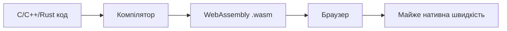
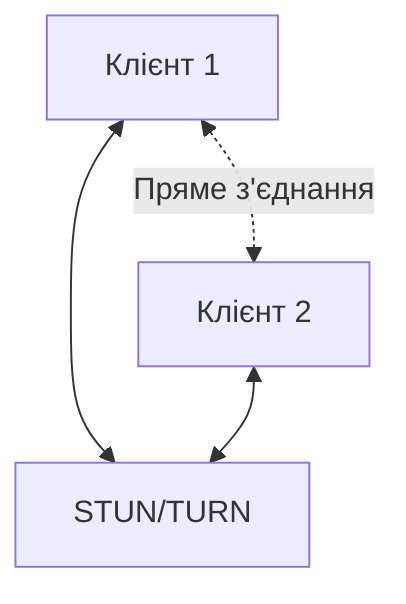
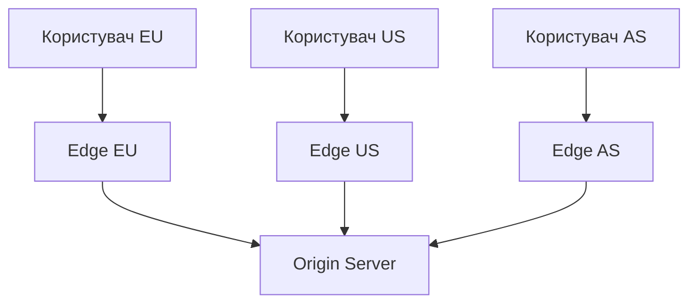
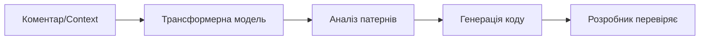
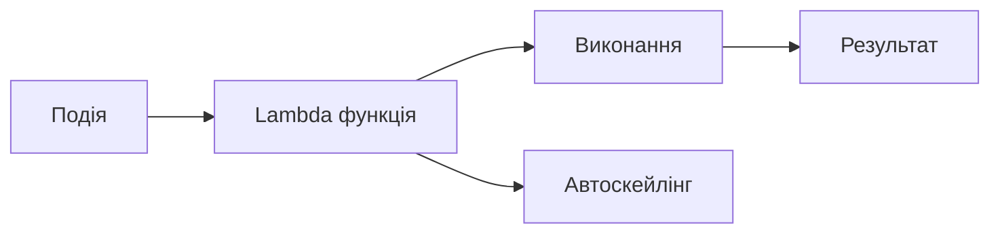
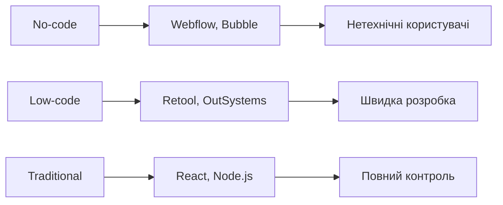
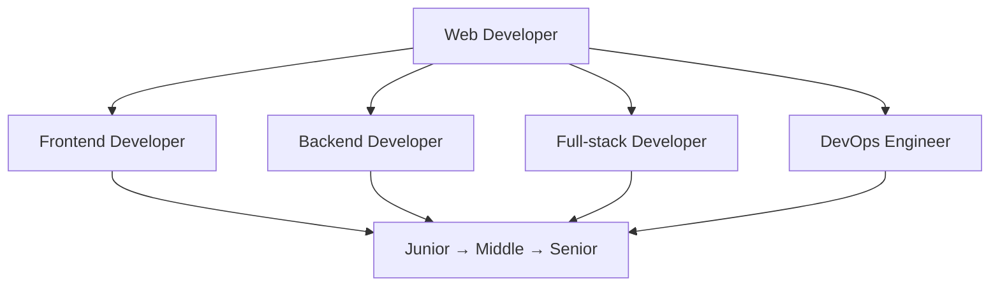

# Майбутнє веб-розробки та кар'єра

## Лекція 24

---

## План лекції

- Emerging технології: WebAssembly, WebRTC, Edge Computing
- AI в веб-розробці
- Serverless архітектура
- Low-code/No-code рішення
- Voice Search та Accessibility
- Кар'єрні шляхи у веб-розробці
- Continuous learning стратегії

---

# Emerging технології

---

## WebAssembly (Wasm)

**Революція у веб-продуктивності**

Компактний бінарний формат для виконання коду з швидкістю, близькою до нативної



---

## WebAssembly: застосування

**Де використовується Wasm?**

- Графічні редактори (Figma)
- Відеообробка в браузері
- Ігри (Unity, Unreal Engine)
- Машинне навчання (TensorFlow.js)
- Наукові обчислення
- Криптографія

---

## WebAssembly: приклад

```javascript
// Завантаження Wasm модуля
async function initWasm() {
    const response = await fetch('image_processor.wasm');
    const buffer = await response.arrayBuffer();

    const { instance } = await WebAssembly.instantiate(
        buffer,
        importObject
    );

    return instance.exports;
}

// Використання
const wasm = await initWasm();
const result = wasm.processImage(imageData);
```

---

## WebRTC

**Реальний час без серверів**

Пір-до-пір комунікація для аудіо, відео та даних



---

## WebRTC: компоненти

**Три основних API:**

- **MediaStream** - доступ до камери/мікрофона
- **RTCPeerConnection** - пір-до-пір з'єднання
- **RTCDataChannel** - передача даних

**Застосування:**

- Відеоконференції (Google Meet, Zoom)
- Мультиплеєрні ігри
- Peer-to-peer передача файлів

---

## Edge Computing

**Обчислення на периферії**

Виконання коду близько до користувача



---

## Edge Computing: переваги

**Чому Edge?**

- Мінімальна латентність
- Персоналізація на рівні CDN
- Географічно розподілені обчислення
- Зменшення навантаження на origin

**Платформи:**

- Cloudflare Workers
- AWS Lambda@Edge
- Vercel Edge Functions

---

## Edge Functions: приклад

```javascript
// Персоналізація на edge
addEventListener('fetch', event => {
    event.respondWith(handleRequest(event.request));
});

async function handleRequest(request) {
    const country = request.cf?.country || 'US';
    const content = await generateLocalizedContent(country);

    return new Response(JSON.stringify(content), {
        headers: {
            'Content-Type': 'application/json',
            'Cache-Control': 'public, max-age=300'
        }
    });
}
```

---

# AI в веб-розробці

---

## AI-асистовані інструменти

**Нове покоління інструментів розробки**

- **GitHub Copilot** - AI pair programmer
- **Tabnine** - інтелектуальне автодоповнення
- **Codeium** - безкоштовна альтернатива

**Можливості:**

- Генерація коду на основі коментарів
- Автоматичне доповнення складних патернів
- Рефакторинг та оптимізація

---

## AI Code Assistants: принципи

**Як це працює?**



**Важливо:**

- AI не замінює розробника
- Потрібна валідація згенерованого коду
- Фокус на архітектурних рішеннях

---

## Генеративний AI для UI

**Створення інтерфейсів за допомогою AI**

```javascript
// Опис природною мовою
const description = `
    Картка продукту з зображенням,
    назвою, ціною та кнопкою "Купити".
    Dark mode підтримка.
`;

// AI генерує повноцінний компонент
const component = await aiGenerator.generateComponent(
    description,
    'react'
);
```

---

## AI в тестуванні

**Автоматизація тестування**

- Visual regression testing
- Автоматична адаптація тестів до змін UI
- Генерація тестових кейсів
- Аналіз accessibility

**Інструменти:**

- Testim
- Mabl
- Percy (visual testing)

---

# Serverless архітектура

---

## Serverless: концепція

**Що таке Serverless?**

- Розробники не управляють серверами
- Оплата за фактичне виконання
- Автоматичне масштабування
- Фокус на бізнес-логіці



---

## Functions as a Service (FaaS)

**Основні платформи:**

- AWS Lambda
- Google Cloud Functions
- Azure Functions
- Cloudflare Workers

**Тригери:**

- HTTP запити
- Зміни в БД
- Завантаження файлів
- Cron jobs
- Queue messages

---

## Serverless: приклад

```javascript
// AWS Lambda для обробки зображень
export const handler = async (event) => {
    const file = event.Records[0].s3.object;

    // Обробити зображення
    const processed = await processImage(file);

    // Створити thumbnails
    const thumbnails = await createThumbnails(processed);

    // Зберегти в S3
    await saveThumbnails(thumbnails);

    return { statusCode: 200 };
};
```

---

## Backend as a Service (BaaS)

**Готові backend сервіси**

- **Firebase** - Google's BaaS
- **Supabase** - open-source альтернатива
- **Appwrite** - self-hosted BaaS

**Функціональність:**

- Автентифікація
- База даних
- Storage
- Cloud functions
- Real-time підписки

---

## BaaS: приклад

```javascript
import { createClient } from '@supabase/supabase-js';

const supabase = createClient(URL, KEY);

// CRUD операції
const { data } = await supabase
    .from('tasks')
    .select('*')
    .order('created_at', { ascending: false });

// Real-time підписки
supabase
    .channel('tasks')
    .on('postgres_changes', {
        event: '*',
        schema: 'public',
        table: 'tasks'
    }, handleChange)
    .subscribe();
```

---

# Low-code / No-code

---

## Демократизація веб-розробки

**Створення застосунків без коду**



---

## No-code платформи

**Для нетехнічних користувачів:**

- **Webflow** - візуальний веб-дизайн
- **Bubble** - складні застосунки
- **Adalo** - мобільні додатки

**Можливості:**

- Drag-and-drop інтерфейс
- Візуальна логіка
- Готові інтеграції
- Швидкий прототипінг

---

## Low-code платформи

**Для розробників:**

- **Retool** - внутрішні інструменти
- **OutSystems** - enterprise додатки
- **Mendix** - бізнес застосунки

**Переваги:**

- Прискорення розробки
- Візуальний дизайнер + код
- Готові компоненти
- Інтеграції з API

---

## Роль розробників у low-code світі

**Еволюція, не заміна**

- Архітектори рішень
- Створення custom компонентів
- Backend API розробка
- Складна бізнес-логіка
- Інтеграція систем

**Висновок:** Low-code доповнює, не замінює професійних розробників

---

# Voice Search та Accessibility

---

## Voice Search

**Голосова взаємодія з вебом**

```javascript
// Web Speech API
const recognition = new SpeechRecognition();
recognition.lang = 'uk-UA';

recognition.onresult = (event) => {
    const query = event.results[0][0].transcript;
    handleVoiceQuery(query);
};

recognition.start();
```

**Застосування:**

- Голосовий пошук
- Голосові команди
- Диктування тексту

---

## Web Accessibility

**Інклюзивність за дизайном**

Створення веб-застосунків для всіх людей, включаючи осіб з обмеженими можливостями

**Важливо:**

- Етична відповідальність
- Юридичні вимоги
- Розширення аудиторії
- Кращий UX для всіх

---

## ARIA та семантичний HTML

**Accessibility атрибути**

```jsx
<button
    onClick={handleClick}
    aria-label="Закрити модальне вікно"
    aria-pressed={isPressed}
>
    <span aria-hidden="true">&times;</span>
</button>

<form role="search">
    <input
        type="text"
        aria-label="Пошук"
        aria-describedby="search-help"
    />
    <div id="search-help">
        Введіть запит для пошуку
    </div>
</form>
```

---

## Accessibility: best practices

**Ключові принципи:**

1. Використовуйте семантичний HTML
2. Забезпечте клавіатурну навігацію
3. Додайте ARIA атрибути де необхідно
4. Перевіряйте контрастність кольорів
5. Тестуйте з screen readers
6. Використовуйте автоматизоване тестування

**Інструменти:** axe DevTools, Lighthouse, WAVE

---

# Кар'єрні шляхи

---

## Спектр спеціалізацій



---

## Frontend розробник

**Фокус:** Користувацький інтерфейс

**Технології:**

- HTML, CSS, JavaScript
- React / Vue / Angular
- TypeScript
- Tailwind CSS / Styled Components

**Навички:**

- UX/UI дизайн
- Accessibility
- Performance optimization
- SEO

---

## Backend розробник

**Фокус:** Серверна логіка та дані

**Технології:**

- Node.js / Python / Java / Go
- Бази даних (SQL, NoSQL)
- API дизайн (REST, GraphQL)
- Кешування, черги

**Навички:**

- Архітектура систем
- Безпека
- Масштабованість
- Оптимізація запитів

---

## Full-stack розробник

**Фокус:** Frontend + Backend

**Переваги:**

- Універсальність
- Розуміння повного циклу
- Цінність для стартапів

**Важливо:**

- Зазвичай є основна спеціалізація
- Глибина vs. ширина знань

---

## DevOps інженер

**Фокус:** Інфраструктура та процеси

**Технології:**

- Docker, Kubernetes
- CI/CD (GitHub Actions, Jenkins)
- Хмарні платформи (AWS, Azure, GCP)
- Infrastructure as Code (Terraform)

**Навички:**

- Автоматизація
- Моніторинг та логування
- Безпека інфраструктури

---

# Continuous Learning

---

## Стратегії навчання

**Структуроване навчання:**

- Онлайн курси (freeCodeCamp, Frontend Masters)
- Офіційна документація
- Технічні книги
- YouTube канали

**Практичне навчання:**

- Власні проєкти
- Клонування популярних застосунків
- Участь у хакатонах
- Freelance проєкти

---

## Практика через проєкти

**Як обирати проєкти?**

1. Вирішують реальну проблему
2. Використовують нові технології
3. Можна додати в портфоліо
4. Складність відповідає рівню

**Приклади:**

- Task manager з real-time
- E-commerce з payment integration
- Social media dashboard
- Blog platform з CMS

---

## Особистий план розвитку

```javascript
const DevelopmentPlan = {
    quarter: 'Q1 2026',
    focus: 'Advanced React та Performance',

    goals: [
        'React Server Components',
        'Web Performance Optimization',
        'TypeScript Advanced Patterns'
    ],

    projects: [
        'Personal Blog with RSC',
        'Performance monitoring tool'
    ],

    community: [
        'Publish 2 articles',
        'Contribute to open source',
        'Attend meetups'
    ]
};
```

---

# Open Source участь

---

## Чому Open Source?

**Переваги:**

- Розвиток технічних навичок
- Робота з великими кодовими базами
- Співпраця з розробниками зі світу
- Будування репутації
- Розуміння code review процесу

**З чого почати:**

- Виправлення документації
- Додавання тестів
- Виправлення простих багів

---

## Вибір проєктів

**Критерії вибору:**

1. Використовуєте в своїх проєктах
2. Активна спільнота
3. Дружня до новачків (good first issue)
4. Цікава для вас domain область

**Платформи:**

- GitHub
- GitLab
- Open Source guides

---

## Перший Pull Request

```markdown
# Опис змін
Додано null перевірку для параметра options

# Мотивація
Функція кидала помилку при виклику без options,
хоча в документації він опціональний

# Зміни
- Додано перевірку options = options || {}
- Додано unit тести
- Оновлено документацію

# Тестування
- Всі тести проходять
- Локально протестовано
```

---

# Portfolio Building

---

## Професійне портфоліо

**Обов'язкові елементи:**

- **Про мене** - досвід, спеціалізація
- **Проєкти** - 3-5 найкращих з демо та кодом
- **Навички** - технології та рівень володіння
- **Блог** (опціонально) - технічні статті
- **Контакти** - GitHub, LinkedIn, email

**Правило:** Якість > Кількість

---

## Структура проєкту

**Кожен проєкт повинен містити:**

1. **Overview** - короткий опис
2. **Live Demo** - працююче демо
3. **Key Features** - основні можливості
4. **Tech Stack** - використані технології
5. **Architecture Highlights** - архітектурні рішення
6. **What I Learned** - отриманий досвід
7. **Setup Instructions** - як запустити
8. **Future Improvements** - плани розвитку

---

## Приклад опису проєкту

```markdown
# Real-time Collaboration Tool

Collaborative whiteboard з можливістю
одночасного малювання кількома користувачами

## Tech Stack
- React 18, TypeScript, Tailwind
- Socket.io для real-time
- Konva.js для canvas

## Architecture
- Optimistic updates
- CRDT для синхронізації
- WebSocket з автореконнектом
```

---

# Найкращі практики

---

## Ключові висновки

**Майбутнє веб-розробки:**

- WebAssembly розширює можливості веба
- Edge Computing покращує продуктивність
- AI стає інтегральною частиною інструментарію
- Serverless спрощує backend розробку
- Low-code доповнює традиційну розробку

**Вимоги до розробника:**

- Continuous learning
- Адаптивність
- Технічні + soft skills

---

## Рекомендації для розвитку

**1. Фундаментальні знання**

JavaScript, HTTP, браузерні API > фреймворки

**2. Якісне портфоліо**

3-5 відмінних проєктів > 10 незавершених

**3. Open source участь**

Розвиває навички та репутацію

**4. Технічні статті**

Поглиблюють розуміння та будують авторитет

---

## Рекомендації (продовження)

**5. Активне мережування**

Конференції, мітапи, онлайн спільноти

**6. Спеціалізація + кругозір**

Глибина в одній області + розуміння суміжних

**7. Soft skills**

Комунікація, teamwork, адаптивність

**Висновок:** Баланс між технічною експертизою та особистим розвитком
